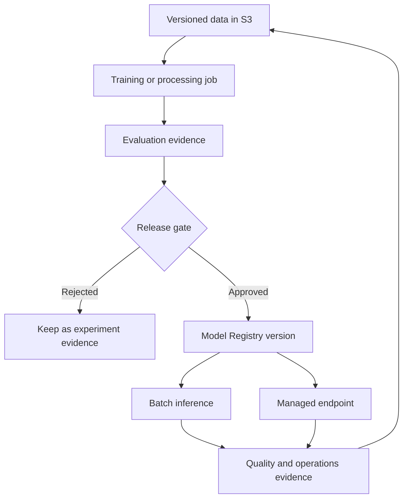
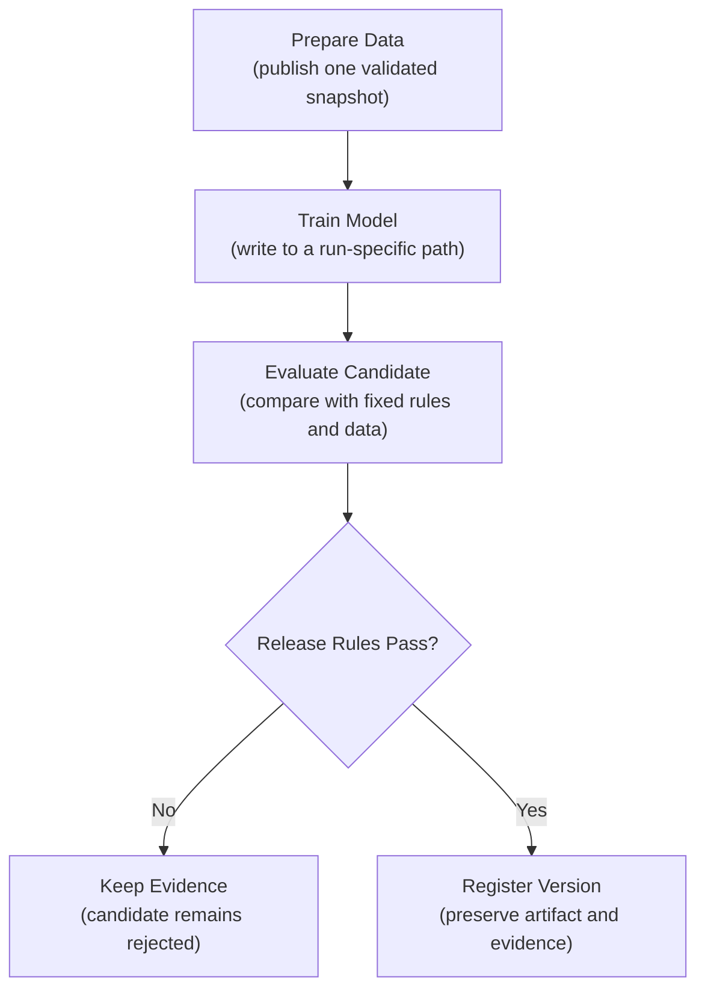
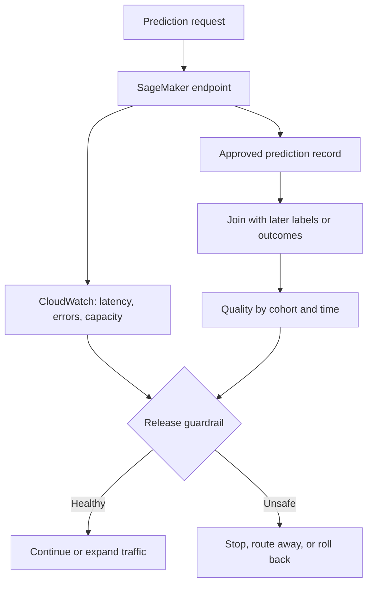

## Table of Contents

1. [Follow The SageMaker AI Model Lifecycle](#follow-the-sagemaker-ai-model-lifecycle)
2. [Decide What AWS Manages And What The ML Team Owns](#decide-what-aws-manages-and-what-the-ml-team-owns)
3. [Understand The Main SageMaker AI Resources](#understand-the-main-sagemaker-ai-resources)
4. [Follow One Trained Model From Training To Release](#follow-one-trained-model-from-training-to-release)
5. [Monitor Service Health And Model Outcomes Together](#monitor-service-health-and-model-outcomes-together)
6. [Design Security And Recovery Into The SageMaker AI Workflow](#design-security-and-recovery-into-the-sagemaker-ai-workflow)
7. [Decide Whether SageMaker AI Fits The Team And Workloads](#decide-whether-sagemaker-ai-fits-the-team-and-workloads)
8. [Follow The Complete SageMaker AI Lifecycle](#follow-the-complete-sagemaker-ai-lifecycle)
9. [References](#references)

A training script finishes on a laptop and leaves a `model.tar.gz` file behind. That file may contain useful weights, yet it answers none of the production questions. The team still needs the source data and runnable container, the approval, the serving path, and an earlier release that can take traffic during an incident.

AWS provides managed resources for each part of that journey. A training job runs code on temporary compute. A pipeline connects preparation, training, evaluation, and registration. Model Registry gives a reviewed model a versioned identity. An endpoint or batch job delivers predictions. CloudWatch and application-owned prediction records show how the released system behaves.

**Amazon SageMaker AI is AWS's managed platform for this predictive-ML lifecycle.** It operates the job, registry, and inference control planes. A team can use that machinery without building each control plane itself. SageMaker AI remains a collection of resources rather than one automatic MLOps switch. The team still defines valid data, meaningful evaluation, release authority, traffic policy, product outcomes, and recovery.

AWS now uses the name **Amazon SageMaker AI** for the ML service inside the broader Amazon SageMaker product. Existing APIs and the AWS CLI namespace continue to use `sagemaker`. This article follows the predictive-ML path through the current service boundaries.

## Follow The SageMaker AI Model Lifecycle
<!-- section-summary: SageMaker AI uses a chain of managed resources to carry a model from versioned data to an operated prediction workload. -->

A production model moves through several distinct states. Data is prepared, code runs in a controlled environment, and evaluation evidence is produced. A trained model being considered for release receives a stable identity. After approval, the model is released and its production behaviour is monitored. SageMaker AI has resources for most of those transitions.

The lifecycle below connects four questions. It records what created the model, what evidence supported release, where predictions run, and what production signals lead to investigation or retraining. SageMaker resources manage parts of this path, while the team defines the contracts and decisions between them.



The arrows matter as much as the boxes. A pipeline moves references and evidence between resources; it does not magically make those references trustworthy. A registry approval is useful only when the package points to an immutable model artifact, a known inference image, and the evaluation report used for the decision. An endpoint is safe only when the release workflow knows which model version it loaded and how to restore the previous one.

This lifecycle also shows why adopting SageMaker AI does not require adopting every SageMaker feature. A team may use managed training jobs and Model Registry while serving on EKS. Another may train on an existing Kubernetes platform and use SageMaker endpoints for online inference. The architecture should follow the responsibilities the platform improves.


*Approval sends the evaluated candidate to Model Registry, while rejection preserves the run as evidence. Online and batch predictions both return operational and quality evidence to the next training decision.*

## Decide What AWS Manages And What The ML Team Owns
<!-- section-summary: AWS runs the managed control plane, while the customer owns model meaning, access boundaries, release policy, and product outcomes. -->

Managed ML platforms divide work between a **provider plane** and a **team plane**. The provider plane covers infrastructure and managed-resource state. The team plane covers the meaning of the data, the quality of the model, release authority, and the response to production outcomes.

The provider plane creates compute, starts containers, records resource state, replaces unhealthy endpoint instances, exposes APIs, and integrates with services such as IAM, S3, ECR, CloudWatch, KMS, and EventBridge. This removes a large amount of undifferentiated infrastructure work.

The team plane supplies the decisions that AWS cannot infer:

| Responsibility | What SageMaker AI can manage | What the team must define |
| --- | --- | --- |
| Training | Isolated jobs, instance lifecycle, logs, output upload | Code, data contract, image, resources, retry safety |
| Evaluation | Pipeline steps and stored metrics | Cohorts, metrics, thresholds, uncertainty, reviewer |
| Registration | Versioned model packages and approval status | Package completeness and approval policy |
| Serving | Endpoint resources, variants, scaling, health metrics | Request contract, traffic policy, capacity target, fallback |
| Monitoring | Data capture and scheduled monitoring jobs | Baseline, label join, business guardrails, response playbook |
| Security | IAM integration, encryption and network controls | Least-privilege roles, data classification, trust boundaries |

This boundary prevents a common mistake: treating a green AWS resource status as proof that the model is good. An endpoint can be `InService` while the model produces harmful predictions. A training job can complete successfully after reading the wrong dataset. Resource health and model quality are separate kinds of evidence.

### Read Managed Status And Model Evidence Separately

Suppose a training job reaches `Completed`. SageMaker AI has proved that the container ran and that the declared output was uploaded. The status does not prove that the input snapshot was the intended one or that the model outperformed the accepted baseline. The pipeline should therefore keep the job status beside a separate evaluation result and release decision.

The same split applies in production. `InService` means the endpoint control plane has healthy capacity. A product-quality view must still join prediction records to later outcomes. An operator investigating a release needs both views: CloudWatch for service behaviour and a governed evaluation path for model usefulness.

## Understand The Main SageMaker AI Resources
<!-- section-summary: Training jobs, Pipelines, Model Registry, and inference resources solve different lifecycle problems and should have explicit handoff contracts. -->

Four resource groups cover the main production path. Jobs run bounded computation, Pipelines coordinate several steps, Model Registry gives trained models stable versions, and inference resources deliver predictions. Each group produces a result that the next part of the lifecycle can identify and verify.

### Run Training And Batch Processing Jobs

A **training job** asks SageMaker AI to run a training container with declared data channels, compute, storage, and an IAM execution role. SageMaker provisions the compute, runs the container, streams logs, uploads output artifacts, and tears the compute down. A **processing job** provides a similar boundary for data preparation, evaluation, or other batch processing.

The durable unit is the job specification plus its inputs and outputs. For reproduction, record the container image digest, source commit, dataset snapshot, configuration, instance type, and random controls. A job name alone cannot reproduce a run.

The execution role is part of the experiment boundary. A training role usually needs read access to approved input prefixes and write access to a run-specific output prefix. It should not also have permission to change production endpoints. Separating training and deployment roles limits what compromised code can do.

For example, a weekly demand model may read `s3://ml-curated/demand/snapshot=1842/` and write only to `s3://ml-runs/demand/run=8fb4c32/`. The job record should preserve those concrete paths, the ECR image digest, and the source revision. A rerun against snapshot `1843` is a new experiment even if the Python code is unchanged.

### Coordinate ML Workflows With SageMaker Pipelines

**SageMaker Pipelines** represents an ML workflow as steps and dependencies. Typical steps prepare data, train, evaluate, apply a condition, and register an accepted candidate. Pipelines can cache eligible steps and retry some failures, but the author still has to decide whether an operation is safe to repeat.

A pipeline is most valuable when its step contracts are explicit. The training step should emit a model artifact URI and run identity. The evaluation step should consume that exact artifact and emit a versioned report. The registration step should receive both. Passing “latest model” between steps creates a race that orchestration cannot repair.



Retries expose the value of these identities. If a worker loses the response after submitting a training job, the pipeline should look up the existing operation before starting another one. Registration and endpoint updates change shared state, so they need a stable candidate or release ID and a current-state check before retry.

### Register And Review Models In SageMaker Model Registry

**SageMaker Model Registry** groups model versions into a model package group. A model package can carry artifact and inference-image references, supported content types, metrics, metadata, and an approval status. It is the handoff between model creation and release.

Treat the registry as a release boundary. The useful question is whether the version contains enough evidence for a deployment workflow to make a safe decision. The artifact and inference image identify what would run. A model signature describes the request and response shape. Evaluation results explain expected behaviour, while data and code lineage explain where the candidate came from. Ownership identifies who can answer for the version, and a rollback target records the known release that can replace it.

Approval status should reflect a real authority decision. Automation may verify thresholds and assemble evidence. A policy owner may still need to approve high-impact models. For lower-risk models, a policy engine can approve automatically when every required check is machine-verifiable.

Imagine that model-package version `42` passed the overall accuracy gate and failed recall for one important region. The registry should keep the version and its report as rejected evidence. Replacing the report in place would hide why version `42` was never released. A corrected training run should create a new package version with its own evaluation.

### Choose A SageMaker AI Inference Option

SageMaker AI supports several inference patterns. **Real-time endpoints** serve interactive requests. **Asynchronous inference** accepts requests that can wait and may have larger payloads or longer processing times. **Batch Transform** processes bounded datasets without keeping an endpoint running. Serverless and multi-model options fit narrower traffic and cost shapes.

Choose from the product deadline and arrival pattern first. Interactive requests need ready capacity, while scheduled files can wait for batch compute. Payload size and model-loading time narrow the supported modes. Isolation, accelerators, scale-to-zero behaviour, and total cost then decide among the eligible choices.

For real-time endpoints, a model resource combines a model artifact with an inference container. An endpoint configuration declares production variants and capacity. The endpoint points to that configuration. This indirection supports controlled updates and a clear previous configuration for rollback.

A low-volume overnight scoring job usually fits Batch Transform better than a continuously running endpoint. A document service with large requests that can wait may fit asynchronous inference. An interactive fraud decision with a strict deadline needs a real-time endpoint and capacity evidence. Serverless or multi-model endpoints can reduce idle cost for suitable traffic, although cold starts, model-loading behaviour, isolation, and Model Monitor compatibility need explicit tests.

## Follow One Trained Model From Training To Release
<!-- section-summary: A small release manifest shows how identities connect across data, training, evaluation, registry, and serving without turning the example into the article structure. -->

Consider a demand-forecast model. The release workflow does not need a huge script to explain its core contract. It needs a manifest that connects the evidence:

```yaml
model_family: demand-forecast
candidate_id: demand-2026-07-15-a1b2c3d
training_job: demand-train-2026-07-15-a1b2c3d
code_commit: a1b2c3d
training_image: 123456789012.dkr.ecr.eu-west-2.amazonaws.com/demand-trainer@sha256:7c8d...
dataset_uri: s3://ml-prod/demand/snapshots/2026-07-14/
model_artifact_uri: s3://ml-prod/demand/runs/demand-2026-07-15-a1b2c3d/model.tar.gz
evaluation_uri: s3://ml-prod/demand/runs/demand-2026-07-15-a1b2c3d/evaluation.json
registry_group: demand-forecast
approval_status: PendingManualApproval
rollback_package_version: "41"
```

Every field answers an operational question. Which code and data created the candidate? Which exact image ran? Where is the model? Which report supports approval? Which model family owns the version? What can production restore?

After registration, a reviewer or policy service checks the evaluation report, segment results, cost, limitations, and evidence completeness. Approval changes the candidate's release eligibility; it does not deploy it by itself. A separate deployment workflow resolves the approved package version, creates a new endpoint configuration, sends a small traffic share to it, and watches release guardrails.

This separation is deliberate. Training code cannot quietly approve and deploy itself. Registry state captures the decision. Deployment state captures the traffic change. The audit trail can then answer who made each transition.

## Monitor Service Health And Model Outcomes Together
<!-- section-summary: Endpoint health and prediction quality use different signals, different clocks, and often different owners. -->

CloudWatch exposes service signals such as invocation errors, latency, instance health, and resource utilization. Those measurements show whether the endpoint can accept and finish work. They cannot establish whether the predictions remain useful.

**Service monitoring** asks whether the endpoint can respond within its reliability target. **ML monitoring** asks whether inputs, outputs, and later outcomes still support the model's purpose. The second view may wait hours or weeks for labels. It also needs cohort analysis; an overall average can hide failure for one region or customer group.



Monitoring design should name the join key, label delay, baseline window, minimum sample size, and owner for each alert. One safe prediction record might keep only governed identifiers and summaries:

```json
{
  "prediction_id": "pred_7f2",
  "release_id": "demand-forecast-r42",
  "predicted_at": "2026-07-15T09:00:00Z",
  "segment": "north-region",
  "prediction": 184.2,
  "latency_ms": 47
}
```

A later pipeline joins `prediction_id` to the observed demand. It computes error by region and time window, then publishes CloudWatch metrics or another governed monitoring result. A release alarm can name a concrete response: stop traffic expansion, restore the previous endpoint configuration, or investigate the feature pipeline.

SageMaker Model Monitor is now a legacy choice for existing customers. AWS has closed it to new customers and plans no new features. Existing users can continue scheduled data and model-quality checks, subject to its supported endpoint and data shapes.

New designs should keep monitoring logic portable. Capture approved prediction evidence and run scheduled checks through a processing or data workflow. Export actionable metrics, then retain the exact baseline and code version. This design also covers labels and product outcomes that Model Monitor never owns.


*CloudWatch and endpoint status show whether the service can respond. Joined outcomes, data health, and release identity show whether the returned predictions remain useful and traceable.*

## Design Security And Recovery Into The SageMaker AI Workflow
<!-- section-summary: IAM, immutable references, network paths, and rollback state determine what a SageMaker workflow can safely do. -->

Use separate roles for training, registration, and deployment because each task needs different authority. CI systems can obtain short-lived AWS credentials through workload identity such as GitHub Actions OIDC. Its trust policy should restrict the repository and deployment environment.

Data classification determines the remaining controls. Encrypt data and artifacts with the approved key policy. Keep secrets in a managed secrets service, and use private network paths for workloads that must stay off public routes.

Pin container images by digest and give datasets immutable identities. Mutable tags and moving S3 prefixes weaken both audit and rollback. Tag resources with model family, candidate or release ID, source commit, dataset identity, owner, environment, and cost centre so operational evidence can be joined later.

Recovery needs a complete previous release. Record its model-package version and inference image because those identify the executable model. Preserve the endpoint configuration and traffic state because those identify how the service ran. Keep the request schema and feature contract because an old model may be incompatible with current callers.

If a service loads a registry reference only at startup, moving an alias or approval status will not change already-running containers. The runbook must update the resource that actually controls traffic and model loading.

### Test The Access Path Before Training Or Serving

An execution role may have permission to call SageMaker AI and still be unable to read the S3 input or pull the ECR image. A private subnet may reach S3 and fail to reach CloudWatch Logs. Test the whole path under the real workload identity: KMS decrypt, S3 read or write, ECR pull, logging, and required control-plane calls. A small fixture job can detect this boundary before an expensive training run begins.

### Restore The Previous Endpoint Configuration

Keep the previous endpoint configuration available during the rollback window. If the candidate creates errors or violates a product guardrail, route the endpoint back to that known configuration:

```bash
aws sagemaker update-endpoint \
  --endpoint-name demand-forecast-prod \
  --endpoint-config-name demand-forecast-r41

aws sagemaker describe-endpoint \
  --endpoint-name demand-forecast-prod \
  --query '{status:EndpointStatus,config:EndpointConfigName}'
```

The first command requests the state change. The second checks the control-plane result. Recovery is complete only after a fixture prediction succeeds, the runtime reports the expected release, and live traffic and product signals return to their accepted range. If the old artifact, image, or KMS key has already expired, the configuration name alone cannot recover the service; retention policy must protect the complete rollback unit.

## Decide Whether SageMaker AI Fits The Team And Workloads
<!-- section-summary: SageMaker AI is justified when its managed lifecycle resources remove recurring work without hiding ownership or creating disproportionate coupling. -->

SageMaker AI is a strong fit for teams whose governed data and production systems already live on AWS. Its managed control planes have more value as several teams repeat the same training, release, and endpoint work. IAM integration and private networking can also remove difficult custom integration from regulated workloads.

A lighter stack may fit a small number of scheduled models. It can also fit a team that already operates a capable batch and container platform, or a workload that does not align with SageMaker hosting. AWS Batch, ECS, EKS, Step Functions, MLflow, and S3 can form a valid MLOps stack. The trade-off is that the team owns more integration and operational behaviour.

Evaluate the platform with one real path. Begin with data identity and job isolation, then follow the evaluation and promotion record into an endpoint. Test performance, private access, quota, observability, cost attribution, and rollback on that same path. Operator effort shows whether SageMaker AI reduced recurring work or simply moved it into unfamiliar resources.

Run that pilot under realistic constraints. Use the production identity pattern, private network path, representative model size, and one failure drill. Stop artifact access during registration, request an unavailable instance type, or fail a canary fixture. The useful result is evidence that the team can identify the failed boundary and recover, rather than a console screenshot of a successful happy path.

## Follow The Complete SageMaker AI Lifecycle
<!-- section-summary: SageMaker AI is a managed resource layer inside a wider MLOps system whose evidence and decisions remain team-owned. -->

S3 preserves identified data and artifacts. Training and processing jobs run bounded work. Pipelines connect those jobs through explicit inputs and outputs. Model Registry records a reviewed model version. An endpoint or batch job delivers predictions. CloudWatch and application-owned quality evidence reveal different kinds of production health.

The identities and policies between those resources make the lifecycle dependable. An immutable dataset and pinned image explain the training run. A complete evaluation explains the release decision. An approved package and measured traffic change explain the production transition. A tested recovery unit protects the service after that transition.

SageMaker AI operates the managed machinery. The team defines what the model is allowed to learn, when it may ship, and what evidence proves that it remains safe and useful.


*AWS operates the managed resources in the lifecycle. The team remains responsible for data meaning, release policy, traffic and fallback behaviour, and the response to production outcomes.*

## References

- [What is Amazon SageMaker AI?](https://docs.aws.amazon.com/sagemaker/latest/dg/whatis.html)
- [Train a model with Amazon SageMaker AI](https://docs.aws.amazon.com/sagemaker/latest/dg/train-model.html)
- [Amazon SageMaker Pipelines](https://docs.aws.amazon.com/sagemaker/latest/dg/pipelines.html)
- [Amazon SageMaker Model Registry](https://docs.aws.amazon.com/sagemaker/latest/dg/model-registry.html)
- [Real-time inference](https://docs.aws.amazon.com/sagemaker/latest/dg/realtime-endpoints.html)
- [Inference options in Amazon SageMaker AI](https://docs.aws.amazon.com/sagemaker/latest/dg/deploy-model-options.html)
- [Test models with production variants](https://docs.aws.amazon.com/sagemaker/latest/dg/model-ab-testing.html)
- [Amazon SageMaker Model Monitor](https://docs.aws.amazon.com/sagemaker/latest/dg/model-monitor.html)
- [SageMaker events in Amazon EventBridge](https://docs.aws.amazon.com/sagemaker/latest/dg/automating-sagemaker-with-eventbridge.html)
- [GitHub Actions OIDC for AWS](https://docs.github.com/en/actions/how-tos/secure-your-work/security-harden-deployments/oidc-in-aws)
