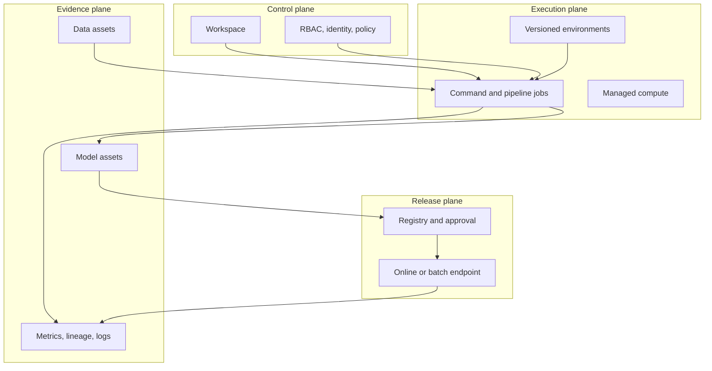
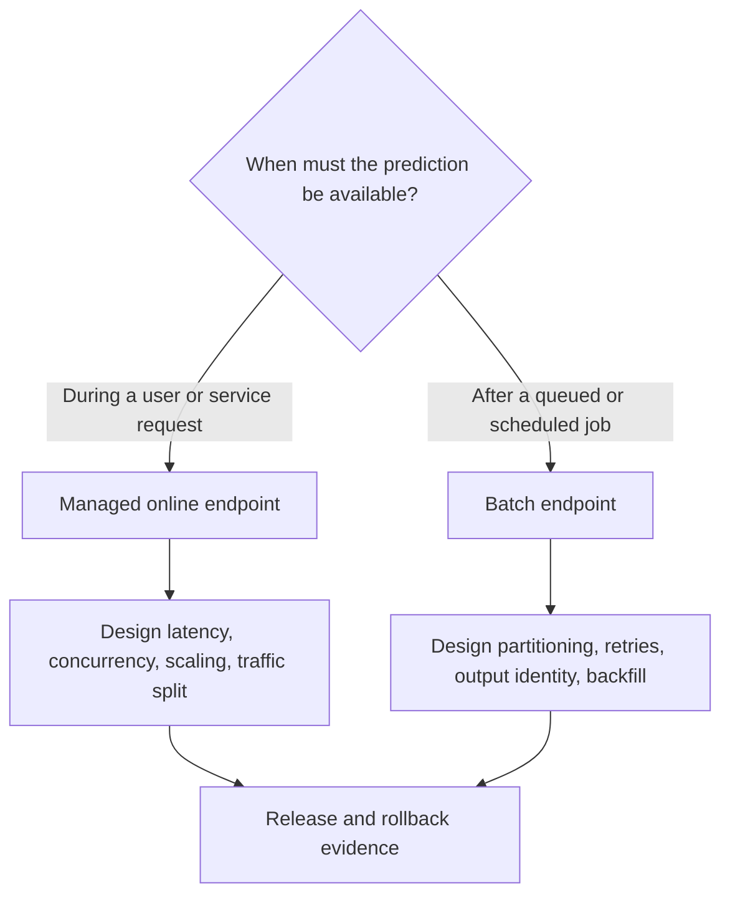

## Table of Contents

1. [Understand The Four Jobs Azure Machine Learning Performs](#understand-the-four-jobs-azure-machine-learning-performs)
2. [Use A Workspace To Organize Shared ML Resources](#use-a-workspace-to-organize-shared-ml-resources)
3. [Use Versioned Assets For Data, Models, Code, And Environments](#use-versioned-assets-for-data-models-code-and-environments)
4. [Run Repeatable Training With Jobs And Pipelines](#run-repeatable-training-with-jobs-and-pipelines)
5. [Share Approved Models And Environments Through Registries](#share-approved-models-and-environments-through-registries)
6. [Choose Online Or Batch Prediction For The Workload](#choose-online-or-batch-prediction-for-the-workload)
7. [Protect And Monitor Azure ML With Identity, Networking, And Observability](#protect-and-monitor-azure-ml-with-identity-networking-and-observability)
8. [Follow One Model Release Through Azure ML](#follow-one-model-release-through-azure-ml)
9. [Decide Whether Azure Machine Learning Fits The Organisation](#decide-whether-azure-machine-learning-fits-the-organisation)
10. [Follow The Complete Azure Machine Learning Lifecycle](#follow-the-complete-azure-machine-learning-lifecycle)
11. [References](#references)

A useful model may begin as a notebook that reads a local CSV and saves a file. Production needs a more durable chain. The training run must identify its data and environment. A reviewer needs the evaluation, and a release process must deploy the same model that passed those checks. The running endpoint also needs its own identity, permissions, telemetry, and rollback target.

Azure provides managed resources for those responsibilities. A workspace groups the work. Versioned assets identify data, environments, components, and models. Jobs and pipelines execute declared steps. Registries share reviewed assets across workspace boundaries. Online and batch endpoints deliver predictions.

**Azure Machine Learning is Microsoft's managed platform for this predictive-ML lifecycle.** It supplies the control and execution machinery around model development. The team still defines the meaning of the data and the evaluation that protects users. It also controls release approval and the product outcome that proves the model useful.

The examples use Azure ML CLI and SDK **v2**, the supported interface family. The earlier CLI and SDK v1 interfaces have reached end of support. Microsoft Foundry is the current direction for generative-AI application and agent development. Azure Machine Learning remains the Azure platform for traditional predictive ML, custom training, and end-to-end MLOps.

## Understand The Four Jobs Azure Machine Learning Performs
<!-- section-summary: Azure ML combines control, execution, evidence, and release planes, each with a different responsibility and failure mode. -->

Azure Machine Learning covers four broad jobs. It coordinates requests and permissions, runs training or inference compute, stores shared assets and evidence, and manages model releases. Grouping resources by these jobs shows how one model moves through the platform without requiring a beginner to memorize every Azure resource first.

The **control plane** says where the work belongs and who may change it. The **execution plane** says where code runs and which dependencies it uses. The **evidence plane** identifies inputs, outputs, and observed results. The **release plane** governs the transition from a reviewed candidate to a prediction workload.

These planes can fail independently. A training job may run successfully with a moving data path. A model asset may exist with no useful evaluation evidence. An endpoint may be technically healthy while the product receives poor predictions. The separation directs an operator to the evidence owned by the failed plane.

Consider a late-payment model trained from a governed monthly snapshot. The control plane accepts the submitted job under a managed identity. The execution plane starts compute with the reviewed environment. The evidence plane records the data asset, job, model, and metrics. The release plane deploys an approved model version to a small share of endpoint traffic.

The diagram shows those jobs and the main handoffs between them:



The same four jobs appear in every later section. The late-payment model only makes their connection visible; it does not determine the article structure.


*The workspace is the shared control plane for assets and resources. Azure runs managed jobs and endpoints, while the team defines data meaning, quality gates, and the release policy.*

## Use A Workspace To Organize Shared ML Resources
<!-- section-summary: A workspace groups Azure ML resources for a product or team, while Azure subscriptions, resource groups, regions, and policies define the wider platform boundary. -->

An Azure ML **workspace** is the main container for jobs, experiments, compute, environments, data assets, models, endpoints, and connections. It gives these resources a shared discovery and access boundary.

A workspace should follow ownership and environment boundaries. Many organizations use separate development, staging, and production workspaces because live endpoints and data access need tighter controls. Production secrets and approvals also belong to a smaller group.

A single workspace for an entire enterprise makes permissions and cost attribution difficult. A workspace per individual experiment creates needless fragmentation. Product area plus environment is a common starting point.

The workspace does not contain all underlying bytes. A data asset may reference Azure Blob Storage or Azure Data Lake Storage. A model asset may reference managed storage. Compute resources run outside the workspace's logical metadata boundary. Azure role-based access control, managed identities, private endpoints, DNS, storage rules, and Key Vault connections determine whether those resources can interact.

That distinction is important for incident work. “I can see the model in Azure ML” does not prove the serving identity can read its storage path. “The job is in the workspace” does not prove its identity has only the minimum permissions.

### Choose Workspace Boundaries From Ownership And Risk

A practical design often uses a development workspace for experimentation and a production workspace for controlled jobs and endpoints. A shared registry carries reviewed assets between them. The production workspace can live in a different subscription, use private networking, and grant release authority to a separate identity.

This split should solve a real boundary. Two workspaces do not create governance if both accept the same broad role and mutable data paths. The team must still define who can publish to the registry, who can deploy into production, and how runtime evidence connects back to the reviewed asset.

## Use Versioned Assets For Data, Models, Code, And Environments
<!-- section-summary: Versioned data, environment, component, and model assets let jobs refer to reviewed inputs instead of mutable paths and local setup. -->

Azure ML uses **assets** to give important ML inputs and outputs stable names and versions. Jobs can then refer to a reviewed data version, environment, component, or model instead of depending on a developer's local files or a mutable storage path.

A **data asset** identifies data used by jobs. Depending on its type, it may point to files, folders, or tabular data. The asset version should resolve to a stable snapshot. Versioning a pointer to a mutable folder does not freeze the underlying data, so the storage and publishing process still matter.

An **environment** identifies the runtime: base image, Python or Conda dependencies, and other execution requirements. Reproduction is strongest when the base image and packages resolve immutably. A friendly environment label such as `sklearn-prod:8` aids discovery; a lockfile and image digest provide stronger replay evidence.

A **component** packages one reusable pipeline step with its command, inputs, outputs, code, and environment. Components make a pipeline modular because each step exposes a contract. They do not automatically make the step deterministic. A component that reads “latest” data or writes to a shared output path remains difficult to reproduce.

A **model asset** identifies a trained artifact and associated metadata. Registration should connect the model to its training job, data version, code commit, environment, signature, evaluation report, owner, and intended use. Without that chain, the registry is only a file catalogue.

### Resolve Moving Asset Names Before The Run Starts

Azure ML supports friendly references such as `azureml:forecast-training@latest`. They are useful during exploration because the platform resolves the newest version. A production job should resolve and record a concrete version before execution. Otherwise, a retry tomorrow may use a different environment or dataset under the same job definition.

The same rule applies to storage behind a data asset. Version `12` may still point to a folder whose files can change. The data publisher must create an immutable snapshot or manifest, then register that stable location as the asset version. Azure ML names the asset; the data platform protects the bytes.

## Run Repeatable Training With Jobs And Pipelines
<!-- section-summary: Command jobs run one declared unit of work, while pipeline jobs coordinate component contracts and preserve the run graph. -->

A **command job** runs a command in a declared environment on selected compute with named inputs and outputs. It is the fundamental execution boundary for custom training. The job record captures status and metadata while Azure manages compute allocation and logs.

A **pipeline job** connects component jobs through their inputs and outputs. The graph should express data and artifact dependencies directly. If evaluation consumes the model emitted by training, the pipeline can show and record that relationship. If two steps communicate through a shared hard-coded storage path, the important dependency stays hidden.

The framework has three levels:

1. **Component contract:** what one step consumes, produces, and guarantees.
2. **Run graph:** which component output feeds which later input.
3. **Release policy:** which outputs and evidence allow a model to move forward.

Retries and reuse require care. A training step that writes to a run-specific location can usually retry safely. A registration or deployment step changes shared state and should use a stable candidate identity, check current state, and reconcile partial completion before repeating.

One compact job definition shows the boundary more clearly than a long CLI walkthrough:

```yaml
$schema: https://azuremlschemas.azureedge.net/latest/commandJob.schema.json
command: >-
  python train.py
  --data ${{inputs.training_data}}
  --model-output ${{outputs.model_dir}}
code: ../../src
environment: azureml:forecast-training@latest
compute: azureml:cpu-training
inputs:
  training_data:
    path: azureml:forecast-snapshot:2026-07-14
    type: uri_folder
outputs:
  model_dir:
    type: uri_folder
```

This fragment declares code, environment, compute, a versioned data input, and a named output. A production version should replace mutable environment labels with a controlled version or immutable build identity and attach source and policy metadata to the submitted job.

The named output gives a later pipeline step an explicit handoff. An evaluation component can consume `${{parent.jobs.train.outputs.model_dir}}` rather than searching a shared folder for “the newest model.” A failed training step then produces no valid evaluation input. The evaluator cannot accidentally score an earlier run.

Pipeline retries need different rules for computation and shared state. Repeating a run-specific evaluation is usually safe. Publishing a model to a registry or changing endpoint traffic needs a stable operation ID and a current-state check. The workflow should find an already-created version or deployment before it tries to create another one.

## Share Approved Models And Environments Through Registries
<!-- section-summary: Workspace model assets support local lifecycle work, while registries support controlled reuse and promotion across workspaces. -->

Azure ML **registries** provide a shared store for model, component, and environment assets across workspaces. Use them where several teams or environments need governed reuse. A development workspace can produce and validate a candidate; a production deployment process can consume a version copied or shared through a controlled registry boundary.

Promotion should move the same reviewed asset identity. Rebuilding the container, retraining the model, or resolving a new dependency during production deployment creates a different candidate. The release packet should therefore identify the model asset version, environment or inference image, signature, evaluation evidence, source run, and approval.

Environment separation also applies to configuration and identity. Development jobs may read sampled data and allow rapid iteration. Production training may use governed data and a managed identity. Production deployment should require a distinct authority. Reusing code is desirable; reusing broad permissions is not.

Suppose development publishes `late-payment-model:17` and `scoring-environment:9` to a registry after evaluation. The production controller resolves those exact versions and creates the endpoint deployment from them. If it rebuilds environment `9` or selects `@latest`, the deployed system no longer matches the evidence. Registry promotion protects identity only if the release process preserves it.

## Choose Online Or Batch Prediction For The Workload
<!-- section-summary: Managed online endpoints serve interactive requests, while batch endpoints suit asynchronous jobs over bounded inputs. -->

Azure ML **managed online endpoints** host low-latency request-response inference. An endpoint provides a stable invocation boundary, and one or more deployments behind it hold model and environment combinations. Traffic allocation between deployments supports canary or blue-green release patterns.

**Batch endpoints** trigger asynchronous jobs over stored input and suit large or scheduled prediction workloads. They avoid keeping interactive serving capacity running. The right choice follows the product deadline, input location, volume pattern, payload size, model-loading cost, and recovery expectations.



For an online release, keep the previous deployment available while a candidate receives a small traffic share. Watch technical signals and product guardrails. A rollback changes traffic back to the known deployment, then reconciles the declared configuration. Deleting the previous deployment immediately removes the fastest recovery path.

Traffic is an endpoint property, so rollback changes the endpoint rather than the registry. If `blue` is the known release and `green` is the candidate, the operator can restore all traffic to `blue`:

```bash
az ml online-endpoint update \
  --name late-payment-prod \
  --traffic "blue=100 green=0" \
  --resource-group ml-prod-rg \
  --workspace-name ml-prod

az ml online-endpoint show \
  --name late-payment-prod \
  --resource-group ml-prod-rg \
  --workspace-name ml-prod
```

The update requests the traffic change. The second command checks the control-plane state. A fixture request and release-aware telemetry must then prove that the `blue` deployment received traffic and returned a valid result.

## Protect And Monitor Azure ML With Identity, Networking, And Observability
<!-- section-summary: Managed identities and Azure controls establish access paths, while Azure Monitor and prediction evidence show whether the workload and model remain healthy. -->

Use **managed identities** for jobs and endpoints so workloads can access Azure resources without long-lived credentials in code. Training, serving, and deployment workflows usually deserve different identities because their powers differ. The training identity reads approved data and writes run outputs. The endpoint identity reads approved model or reference data. The release identity may update endpoint traffic.

Private networking changes the full path: workspace dependencies, storage, container registry, Key Vault, compute, endpoint, DNS, and callers. Draw that path before implementation. A private endpoint on one resource does not make every dependency private.

Azure Monitor and workspace logs show whether jobs and endpoints run correctly. Their latency, failures, and resource health describe the managed service path.

Prediction-quality monitoring needs evidence that the application understands. Each prediction record should identify the model and request-schema versions. Safe input summaries show which data shape reached the model. The output and later label or outcome provide the quality result, and the cohort shows which users or workload slice experienced it.

Service health and model usefulness should appear together in a release dashboard. Each alert needs a named owner and response action.

### Test The Real Identity And Network Path

An online endpoint identity is selected when the endpoint is created, and that identity needs permission on every resource it must read. Test access to model storage, reference data, Key Vault, and any private dependency under that exact identity. Private endpoints and DNS must cover the complete path; one private workspace connection does not make Blob Storage or Container Registry reachable.

Run a small fixture through the production network before the canary. A startup failure should identify whether image pull, model read, key access, DNS, or scoring code failed. That evidence gives the incident to the correct owner and prevents an operator from treating every endpoint failure as a model problem.

## Follow One Model Release Through Azure ML
<!-- section-summary: A release trace verifies that workspace assets, approval, endpoint configuration, and runtime evidence refer to the same candidate. -->

The four-plane framework controls a release. The evidence plane supplies a concrete model version, environment version, source job, evaluation report, and input signature. The control plane verifies that the release identity has permission to change the production endpoint. The release plane creates a candidate deployment and assigns a small traffic share. The execution plane starts containers and reports health.

The release controller should compare desired and actual identities before expanding traffic:

| Evidence point | Required proof |
| --- | --- |
| Candidate record | model, environment, schema, evaluation, and approval versions agree |
| Endpoint configuration | deployment references the reviewed model and environment |
| Runtime startup | logs or health metadata report the expected release identity |
| Canary traffic | requests reach the expected deployment share |
| Recovery state | previous deployment remains healthy and can receive traffic |

Partial failure can occur between any two points. The deployment resource may exist while its identity cannot read the model. Containers may start while the scoring script rejects the production request shape. A traffic update may succeed while the product dashboard still groups results under the old release. The controller should hold the canary, retain the previous deployment, and preserve each resource ID for investigation.


*The canary keeps the reviewed model and environment identities attached to the runtime evidence. Failed guardrails restore the retained deployment, while both outcomes end with a recorded decision.*

Rollback changes traffic to the retained deployment, then verifies request success and reported model identity. Deleting the failed deployment and evidence comes later, after the incident record links the resource IDs and the team understands the failure.

## Decide Whether Azure Machine Learning Fits The Organisation
<!-- section-summary: Azure ML earns its platform weight when Azure-native managed lifecycle resources solve recurring collaboration, governance, and operations problems. -->

Azure ML is a strong fit for data and applications that already use Azure. Managed custom training and prediction endpoints can remove repeated infrastructure work. Entra identity and Azure Policy add value for teams with Azure-wide governance, while shared assets and registries help several workspaces reuse reviewed components.

A lighter stack can be enough for a few scheduled models. Existing Azure Batch, AKS, Databricks, MLflow, storage, and CI/CD systems may already cover the needed responsibilities. Platform adoption should solve a visible constraint such as reproducible compute, asset handoff, regulated access, endpoint operations, or multi-team governance.

Evaluate one real lifecycle. Can the team identify the data, code, environment, job, model, approval, deployment, loaded version, monitoring evidence, and rollback target? Measure setup, operator effort, latency, quota, network complexity, cost attribution, and recovery. The answers expose the ownership boundary and its operational cost.

Use the same representative workflow for a failure drill. Deny storage access to the candidate deployment, send an incompatible request fixture, or stop the canary after a latency breach. The team should locate the failed boundary, restore the known deployment, and preserve the evidence through the supported path. Recovery should never depend on one person remembering the portal steps.

## Follow The Complete Azure Machine Learning Lifecycle
<!-- section-summary: Azure ML supplies managed lifecycle resources; production quality comes from the identities, contracts, policies, and evidence that connect them. -->

The workspace groups the work, and versioned assets identify the inputs and outputs. Jobs and pipelines run the declared contracts. A registry carries reviewed versions across workspace boundaries. Endpoints operate prediction workloads, while managed identities and Azure controls restrict access. Azure Monitor describes service health; application evidence connects predictions to later model outcomes.

One traceable chain must connect those resources. The data, code, environment, job, model, approval, deployment, observed runtime version, and rollback target should all agree. Azure ML reduces the infrastructure needed to operate that path. The team remains responsible for what each identity means and which evidence allows the model to advance.


*The four planes solve different parts of the lifecycle. Production evidence remains trustworthy only while every plane refers to the same reviewed candidate.*

## References

- [Azure Machine Learning CLI and SDK v2 concepts](https://learn.microsoft.com/en-us/azure/machine-learning/concept-v2?view=azureml-api-2)
- [Upgrade Azure Machine Learning client code from v1 to v2](https://learn.microsoft.com/en-us/azure/machine-learning/how-to-migrate-from-v1?view=azureml-api-2)
- [How Azure Machine Learning works](https://learn.microsoft.com/en-us/azure/machine-learning/concept-azure-machine-learning-v2?view=azureml-api-2)
- [Azure Machine Learning jobs](https://learn.microsoft.com/en-us/azure/machine-learning/concept-train-machine-learning-model?view=azureml-api-2)
- [Machine learning pipelines](https://learn.microsoft.com/en-us/azure/machine-learning/concept-ml-pipelines?view=azureml-api-2)
- [Azure Machine Learning registries](https://learn.microsoft.com/en-us/azure/machine-learning/concept-machine-learning-registries-mlops?view=azureml-api-2)
- [Managed online endpoints](https://learn.microsoft.com/en-us/azure/machine-learning/concept-endpoints-online?view=azureml-api-2)
- [Batch endpoints](https://learn.microsoft.com/en-us/azure/machine-learning/concept-endpoints-batch?view=azureml-api-2)
- [Access Azure resources from online endpoints with managed identities](https://learn.microsoft.com/en-us/azure/machine-learning/how-to-access-resources-from-endpoints-managed-identities?view=azureml-api-2)
- [Architecture best practices for Azure Machine Learning](https://learn.microsoft.com/en-us/azure/well-architected/service-guides/azure-machine-learning)
- [MLOps v2 architecture](https://learn.microsoft.com/en-us/azure/architecture/ai-ml/guide/machine-learning-operations-v2)
