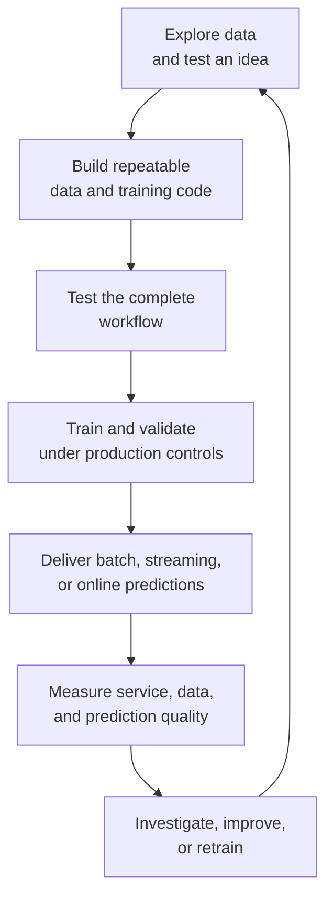
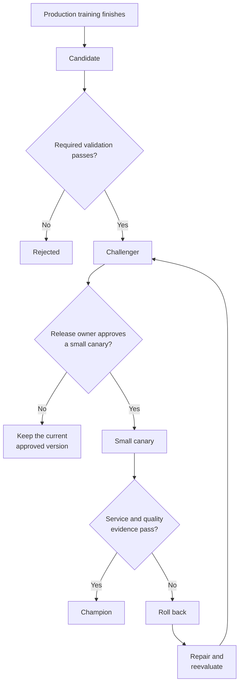
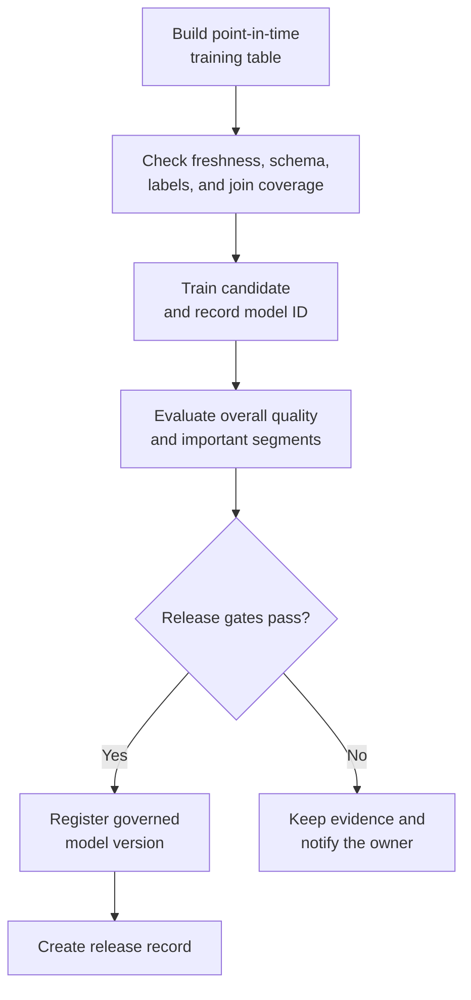

## Table of Contents

1. [What Databricks MLOps Actually Means](#what-databricks-mlops-actually-means)
2. [Why Machine Learning Needs More Than Ordinary DevOps](#why-machine-learning-needs-more-than-ordinary-devops)
3. [How To Read The Platform Map](#how-to-read-the-platform-map)
4. [Record The Code, Data, And Model Used For Each Run](#record-the-code-data-and-model-used-for-each-run)
5. [Turn Exploration Into Repeatable Development Work](#turn-exploration-into-repeatable-development-work)
6. [Test The Complete ML Workflow In Staging](#test-the-complete-ml-workflow-in-staging)
7. [Run Training Under Production Controls](#run-training-under-production-controls)
8. [Coordinate Training And Data Pipelines With Lakeflow Jobs](#coordinate-training-and-data-pipelines-with-lakeflow-jobs)
9. [Deploy Reviewed Databricks Changes With Declarative Automation Bundles](#deploy-reviewed-databricks-changes-with-declarative-automation-bundles)
10. [Choose Batch, Streaming, Or Online Predictions](#choose-batch-streaming-or-online-predictions)
11. [Monitor Predictions, Service Health, And Real Outcomes](#monitor-predictions-service-health-and-real-outcomes)
12. [Decide Which Responsibilities Databricks Should Own](#decide-which-responsibilities-databricks-should-own)
13. [Follow The Complete Databricks MLOps Lifecycle](#follow-the-complete-databricks-mlops-lifecycle)
14. [References](#references)

## What Databricks MLOps Actually Means
<!-- section-summary: Databricks MLOps carries code, data, and models from experimentation into a controlled production system and then learns from production results. -->

At a high level, **Databricks MLOps is the way a team takes a machine-learning idea and turns it into a repeatable, controlled production system.** The model is one result of that work. The lifecycle also preserves how the team produced and evaluated that model. After release, it records where the model runs, what it predicts, and what happens in the real world.

Imagine that a data scientist trains a model in a notebook and gets an accuracy score of 94 percent. That result sounds promising, although it leaves many practical questions unanswered. Which rows trained the model? Which version of the feature logic created those rows? Would the code still work as an automated job? Did the model perform well for the important customer groups? Which version should an application call? What will the team do after production behaviour changes?

Databricks gives each part of that journey a home:

- Git keeps the code and deployment configuration.
- Delta Lake keeps reliable, versioned tables.
- Unity Catalog controls access and records governed data and model identities.
- MLflow 3 records experiments, trained models, datasets, and evaluation evidence.
- Lakeflow Jobs runs the data, training, validation, and inference workflows.
- Declarative Automation Bundles move reviewed project definitions between environments.
- Model Serving provides managed online endpoints.
- Prediction records, service telemetry, data profiling, and later outcomes show how the production system performs.

The important idea is the connection between these parts. A production prediction should lead back to the endpoint that served it, the model version behind that endpoint, the evaluation that approved the model, the run that created it, and the data and code used by that run. The same prediction should also connect forward to the outcome that eventually shows whether it was useful.

You can think of Databricks MLOps as a controlled journey:



Each stage answers a different question. Development asks whether the idea can work. Staging asks whether the pieces work together. Production asks whether reviewed code can create and deliver an approved model under controlled access. Monitoring asks whether the system still works after real data and real users enter the picture.

## Why Machine Learning Needs More Than Ordinary DevOps
<!-- section-summary: ML delivery must control changing data and model evidence alongside the code and infrastructure handled by ordinary software delivery. -->

Traditional software delivery already has a difficult job. A team versions source code, tests it, builds an artifact, deploys that artifact, and watches the running service. If the same code and dependencies build successfully, the team usually receives the same application behaviour.

Machine learning adds another large input: **training data**. The same Python code can produce a different model next month because new rows arrived, labels changed, or feature values were corrected. Production quality can also fall even though nobody deployed new code. Customer behaviour, fraud patterns, prices, language, and product policies keep changing around the model.

A simple comparison shows the extra responsibility:

**Ordinary application**

`source code + dependencies + configuration → application artifact`

**Machine-learning system**

`source code + dependencies + configuration + training data + feature definitions → trained model`

The model then produces predictions that need later outcomes for evaluation. A churn model may predict today and learn the final answer thirty days later. A fraud model may receive a chargeback label weeks after the payment. The production loop therefore continues beyond deployment.

Databricks describes this work through three connected disciplines:

**DevOps** manages code, tests, build automation, deployment, infrastructure, and the running service. For a Databricks project, this includes Git review, CI, project configuration, and controlled promotion between environments.

**DataOps** manages ingestion, transformations, schemas, data quality, feature computation, and the tables consumed by training and inference. It protects the reliability and meaning of the data path.

**ModelOps** manages experiments, evaluation, model versions, approvals, prediction delivery, monitoring, retraining, and retirement. It gives the trained model a controlled lifecycle.

These disciplines overlap during a real release. Suppose a team adds a seven-day transaction-count feature to a fraud model. DataOps must calculate the feature correctly from event time. ModelOps must show that the new feature improves the candidate on representative data. DevOps must test and deploy the pipeline code. A serving release must then confirm that the online feature path can provide the value within the request deadline.

A code-only pipeline would miss the feature history and model evidence. A model-only workflow would miss the deployment and runtime controls. A data-only pipeline would produce reliable tables without proving that the resulting predictions help the product. Databricks brings these responsibilities onto one platform so the assets can share access control, lineage, automation, and production evidence.

## How To Read The Platform Map
<!-- section-summary: The platform has connected pipelines running through development, staging, and production while durable records preserve what happened. -->

A large MLOps diagram can resemble one enormous pipeline. Real systems contain several pipelines with different schedules and owners. A feature pipeline may run hourly. Model training may run weekly. Online inference runs for every request. Monitoring may join outcomes each night. CI runs after a pull request.

It helps to read the platform in three directions. Each direction answers a different question about the same system. The workflows show what work happens, the environments show where it happens, and the durable records show what remains after the work finishes.

First, follow the **workflows** from left to right:

1. code changes move through review and testing;
2. data moves through ingestion, validation, and feature computation;
3. candidates move through training, evaluation, registration, and approval;
4. approved models move into batch, streaming, or online prediction;
5. production evidence moves back into investigation and improvement.

Second, follow the **environments** from development to staging to production. Each environment has its own compute, runtime, libraries, jobs, data access, identities, and permissions. A Git branch alone cannot create this separation. The environment controls where the code runs and what it may touch.

Third, look for the **durable records** that remain after a job finishes. Delta tables keep data and predictions. MLflow keeps runs, models, metrics, and artifacts. Unity Catalog keeps governed names, versions, permissions, and lineage. Git keeps the source history. These records allow another person to understand an old release without depending on one notebook session.


*The top row follows the work from data to operation. Unity Catalog applies governance across the path. Cloud identity, networking, object storage, and encryption support the Databricks platform underneath it.*

The three environments have different goals.

**Development optimizes for learning.** Data scientists explore data, compare approaches, inspect errors, and change code quickly. They need enough freedom to discover a useful solution, along with access controls that protect sensitive production data.

**Staging optimizes for proof.** CI runs unit and integration tests against controlled data. The environment checks that feature, training, validation, serving, and monitoring code can work together before production receives the change.

**Production optimizes for control and reliability.** Automated jobs run under production identities against governed production data. Changes arrive through reviewed automation. People receive read access for investigation, while write and deployment access stays narrow.

A small team may separate these environments through catalogs, schemas, permissions, and separate job identities inside one workspace. A larger or regulated organization often uses separate workspaces and catalogs, separate service principals, and stronger network boundaries. The separation should match the risk. Its purpose is to keep experiments from changing production and to give release automation a clear target.

## Record The Code, Data, And Model Used For Each Run
<!-- section-summary: Git, Delta Lake, Unity Catalog, and MLflow preserve the histories needed to reproduce and investigate a production model. -->

Every automated task eventually finishes. The cluster may shut down and the notebook session may disappear. The system still needs a reliable account of what happened. Databricks MLOps uses three connected histories for that job: code history, data history, and model history.

Imagine that a model starts producing poor results six months after its release. The investigation follows the prediction back to the governed candidate in Unity Catalog and its evaluation in MLflow. That model record points to the training table state preserved by Delta Lake. The training run also points to the source revision recorded in Git. A notebook name or model file would leave most of this path missing, while these connected identifiers carry the investigation across the complete lifecycle.

### Use Git To Record The Training Code

Git holds feature logic, training code, tests, configuration, and deployment definitions. A commit identifies the exact source revision used by a workflow. For example, commit `7da0b53` may contain the transformation that calculates `transactions_7d` and the validation rule that rejects a candidate after segment recall falls below its threshold.

The repository should contain repeatable project code. Exploration can stay in a notebook while the idea is still changing. Once the team wants CI or a scheduled job to run it, the useful logic moves into reviewed source files. Python modules and SQL files hold the transformations and algorithms. Workflow configuration defines how automation runs them, while tests protect the expected behaviour.

### Use Delta Lake To Record Data Versions

**Delta Lake** gives tables on cloud object storage reliable transactions and version history. In simple terms, a Delta table has data files plus a transaction log that records each committed change. Readers receive a consistent table state, and a training run can point to one table version.

Suppose `prod.features.churn_training` is at version 128 during training. Two days later, a source team corrects thousands of account-status rows and the table reaches version 131. The original model still refers to version 128. An investigator can reproduce that run, while a new candidate can use version 131 and measure the effect of the correction.

A table version protects the stored state used by the job. The training pipeline still has to respect time. A historical row created on 1 March can use feature values available by 1 March. A support case opened on 4 March belongs to that row's future. Using it would create **data leakage**, where training receives information that the production prediction could never have known.

Labels have another clock. If churn means “cancelled within 30 days,” a prediction from 1 March needs an observation window through the end of March. The training table can include the row after that window has completed. Point-in-time feature joins and label-maturity rules work together: one protects the input time, and the other waits for the outcome.

### Give Data And Models Governed Names With Unity Catalog

**Unity Catalog** is the governance layer that organizes and protects data and AI assets. A three-part name such as `prod.features.churn_training` means the `churn_training` table inside the `features` schema and `prod` catalog.

That name carries practical controls. Unity Catalog can grant a training identity permission to read the table, give a release identity permission to create model versions, and let an analyst inspect monitoring tables. It can also record lineage for supported operations, helping a team follow a feature table back to its sources or identify models that depend on a changing column.

Lineage shows observed technical relationships. Business meaning still needs a human owner. A graph can show that `monthly_fee` entered the model, while a data contract explains its currency, null policy, update schedule, and owner. Both pieces matter during an investigation.

### Use MLflow To Record Model Development

**MLflow 3** records what happened during model development. An **experiment** groups related work. A **run** records one execution, including parameters, metrics, datasets, tags, and artifacts. A **Logged Model** gives the trained model its own identity, allowing evaluation evidence from several runs to connect to the same model. **Models in Unity Catalog** then gives accepted candidates governed names and immutable versions.

These histories connect into one evidence chain:


*A production prediction leads back through its endpoint and governed model version to MLflow evidence and the exact training-table state.*

Consider a poor prediction with ID `pred_82a`. The decision record points to endpoint `churn-risk-prod` and model version 18. Unity Catalog identifies the governed candidate. MLflow identifies the run, metrics, dataset, code revision, signature, and Logged Model. Delta identifies the training table at version 128. The team now has a concrete path to investigate.

## Turn Exploration Into Repeatable Development Work
<!-- section-summary: Development starts with open-ended investigation and produces data, training, evaluation, and monitoring code that automation can run again. -->

Development is the learning stage. The team is still discovering whether the data can solve the problem and which approach deserves production investment. Databricks notebooks, SQL, Spark, Python, and AutoML can all support this exploration.

Suppose the task is fraud detection. A data scientist may inspect label delay, class imbalance, missing device identifiers, payment amount distributions, and merchant behaviour. They may test features such as transactions during the last ten minutes, distance from the previous payment, merchant chargeback rate, and whether the device has appeared before.

This work is exploratory because the questions keep changing. A notebook is useful here: the scientist can inspect a chart, change a query, and try another model. The production result of this stage is the reusable logic discovered during that exploration.

### Define Which Historical Data Each Feature May Use

Feature logic turns raw events into values the model can use. A feature such as “transactions during the last ten minutes” needs an exact event-time window, a policy for late events, and a rule for duplicate transactions. The training path must calculate the feature as it would have existed at each historical prediction time.

Databricks Feature Engineering and Feature Store can help teams create, register, discover, and reuse features. Time-series feature tables support point-in-time joins. Models trained with registered features can preserve their feature dependencies, and supported serving paths can retrieve online values during inference.

This machinery earns its place after features need reuse or online consistency. A monthly model that reads three stable warehouse columns may only need a well-tested Delta transformation. A real-time fraud service with shared features across several models gains more from a feature platform.

### Track Experiments So Runs Can Be Compared

During exploration, people often remember a model as “the XGBoost run from Tuesday.” MLflow gives that attempt a durable record. The run can capture the algorithm, parameters, metrics, training-data reference, plots, code revision, environment, and model artifact.

The recorded metrics need context. An accuracy of 99.5 percent sounds excellent for a fraud model until you learn that only 0.5 percent of payments are fraudulent. A model that predicts “not fraud” for every payment would reach the same accuracy.

The evaluation should measure the decision the model supports. Precision shows how many fraud alerts were correct, and recall shows how much actual fraud the model found. Calibration checks whether a score such as `0.8` behaves like an 80 percent risk across many examples. Expected loss connects mistakes to their financial effect, while segment checks reveal groups hidden by an overall average.

MLflow 3 can attach metrics and datasets directly to a Logged Model:

```python
import mlflow
import mlflow.sklearn

validation_data = mlflow.data.from_pandas(
    validation_df,
    name="fraud_validation",
)

with mlflow.start_run():
    model_info = mlflow.sklearn.log_model(
        sk_model=model,
        name="fraud_candidate",
        signature=signature,
    )
    mlflow.log_metrics(
        {"recall": 0.82, "false_positive_rate": 0.014},
        model_id=model_info.model_id,
        dataset=validation_data,
    )
```

The **signature** describes the columns and types accepted and returned by the model. It helps catch an integration error such as a missing feature or a string sent where the model expects a number. `model_id` connects the two metrics to the trained model, and the named validation dataset records where those measurements came from.

Development ends with repeatable project code and explicit evaluation rules. The team now knows how to build features, train a candidate, evaluate it, and produce the monitoring records needed later. Staging tests whether those pieces still work after automation replaces the interactive notebook session.

## Test The Complete ML Workflow In Staging
<!-- section-summary: Staging runs reviewed code in a controlled environment to check software behaviour, pipeline integration, and model acceptance logic. -->

Staging answers a practical question: can the complete system run from start to finish under conditions that resemble production? It uses controlled data, production-like permissions, and temporary resources to expose broken connections safely. A notebook result gives evidence about an idea. Staging gives evidence about the automated implementation and the records that implementation will create.

The process normally starts with a pull request. CI runs unit tests on small pieces of logic. A feature test can confirm that a payment exactly ten minutes old falls on the correct side of a window. A schema test can confirm that missing device IDs receive the agreed treatment. A time-based split test can prove that future events stay out of historical features.

Integration tests then run several pieces together. They may read a controlled Delta dataset, calculate features, train a small candidate, log it to MLflow, register it in the staging catalog, load it again, and send a request to a temporary endpoint. The goal is to expose broken connections before production data and users depend on them.

Three kinds of tests answer three different questions:

- **Unit tests** ask whether one function or rule behaves correctly.
- **Integration tests** ask whether the data, training, registry, serving, and monitoring pieces fit together.
- **Model validation** asks whether the candidate meets the quality, safety, latency, and governance requirements for this use case.

The separation matters. A pipeline can pass every software test and still produce a weak model. A strong model can also sit inside code that fails to load its artifact or writes predictions with the wrong schema.

Staging can trade some scale for speed. A training test may use five percent of the data and three tuning trials. An online service may create a small temporary endpoint for smoke tests. Full load testing remains important before a high-traffic launch, especially if model loading, feature lookup, or accelerator capacity changes.

Imagine that the candidate passes offline quality checks and the temporary endpoint returns a correct response. The integration test then checks the prediction record and finds that `model_version` is empty. The model itself works, yet production monitoring would lose the connection between a prediction and its release. Staging should fail that deployment because the missing identifier would make later quality investigation unreliable.

The recovery path is straightforward. The application or serving wrapper adds the governed model version to its decision record. CI reruns the request, checks the response, confirms that the prediction row contains the expected version, and removes the temporary endpoint after the test. Production receives the change only after the evidence path works.

## Run Training Under Production Controls
<!-- section-summary: Production runs reviewed pipeline code against governed data, validates the resulting model, and records an explicit release decision. -->

Production has stricter goals than development. Jobs run with production identities. They read governed production data, use approved compute, write to controlled locations, and produce evidence that other people can inspect. Data scientists often receive read access for investigation, while automation owns the main write path.

Databricks generally recommends promoting **pipeline code** through the environments and training the production model under production controls. This gives the final model a clear story: reviewed production code ran against governed production data through the production identity and runtime.

Consider a weekly churn model. The production job creates a release record that another engineer can inspect months later. It contains the following evidence:

- Git commit `7da0b53`;
- training table `prod.features.churn_training`, version 128;
- label cutoff after the required 30-day outcome window;
- dependency lock or image digest;
- MLflow Logged Model ID `m-4c21`;
- evaluation report and data-slice results;
- Unity Catalog model version 18;
- approval result and release owner.

The values form a release record. Each one points to evidence kept by Git, Delta Lake, MLflow, Unity Catalog, or the approval system.

### Give Each Trained Model A Governed Version In Unity Catalog

**Models in Unity Catalog** manages registered model names and immutable versions. In everyday terms, the registered name identifies the model's purpose, while the version identifies one exact trained candidate. A name such as `prod.customer_models.churn` groups the candidates used for churn prediction. Version 18 always points to the same candidate, even after a later version receives production traffic.

The older Workspace Model Registry is a legacy path. Older tutorials may also show fixed stages named `Staging` and `Production`. Current MLflow guidance has deprecated those fixed stages. Unity Catalog model versions, aliases, tags, environment catalogs, and explicit deployment records provide the current path.

An alias is a readable pointer to a model version. A team may use `Challenger` for the accepted candidate under comparison and `Champion` for the model chosen by the release process. The immutable version remains the audit identity. The alias expresses the current role and can move after a reviewed decision.

### Compare The Trained Model With A Meaningful Baseline

A training job that exits successfully has proved that code ran. Model validation asks whether the result deserves release. The checks can cover overall quality, important segments, calibration, robustness, model size, latency, input signature, required documentation, fairness, privacy, and compliance rules.

A score needs a baseline. A candidate with 94 percent accuracy may still lose to the current production model at 96 percent. A fraud candidate may increase recall while creating too many false declines. The release policy defines which tradeoffs are acceptable.

For a first model, the baseline may be a business rule. For an existing service, the baseline is usually the approved production model. Offline evaluation can compare both on the same held-out data. A later canary can compare service behaviour and real outcomes under controlled traffic.



The state names make the release decision visible. The job may automate many checks, while the policy still defines who can approve the canary and which signal triggers rollback. A high-risk model may require a manual approval. A low-risk batch model may use fully automated gates.

Retraining in the target environment can be expensive for very large models. Current Databricks tooling also supports copying model versions across registered models for workflows where retraining in every environment is impractical. The choice should preserve the source artifact, evaluation, destination identity, and approval evidence.

## Coordinate Training And Data Pipelines With Lakeflow Jobs
<!-- section-summary: Lakeflow Jobs turns separate data, training, validation, inference, and monitoring tasks into repeatable workflows with visible dependencies and retries. -->

An ML lifecycle contains work that runs on different schedules. Features may refresh hourly. Training may run weekly. Batch predictions may run every night. Outcome evaluation may wait thirty days for labels. One notebook cannot reliably coordinate all of that work.

**Lakeflow Jobs** is Databricks' workflow automation service. A **job** is the reusable workflow definition. A **task** is one unit inside the job, such as validating a table, training a model, evaluating a candidate, or publishing predictions. Dependencies tell the job which tasks must finish before another task can start. Triggers start work on a schedule, after file arrival, or through another system.

A production training workflow may follow this path:



Tasks pass small, stable identifiers between them. The training task can return `model_id=m-4c21`. Evaluation reads that Logged Model and writes a report. Registration refers to the accepted model ID. Large datasets and artifacts stay in Delta tables, MLflow storage, or another governed store.

This design helps after a partial failure. Suppose training and evaluation succeed, then registration fails because the release identity temporarily lacks one permission. The team can repair the permission and retry registration against `m-4c21`. Repeating the expensive training task could create another candidate with different randomness and confuse the accepted evidence.

Each task needs its own retry behaviour. A read-only validation task can usually run again safely. A table writer can use a run-specific output, an idempotent merge, or another method that prevents duplicates. A deployment task should compare the desired and current route before changing traffic.

Lakeflow Jobs fits work that mainly runs in Databricks. An organization may already use Airflow or Dagster to coordinate a warehouse, approval service, application deployment, and Databricks jobs. The external orchestrator can own that cross-platform process while Lakeflow Jobs owns the bounded Databricks workflow. One system should hold the final retry and release state for each step.

## Deploy Reviewed Databricks Changes With Declarative Automation Bundles
<!-- section-summary: Declarative Automation Bundles keep Databricks project code and resource definitions in Git so CI can validate and deploy the same project across environments. -->

Clicking through a UI works well during exploration. Repeating those clicks across development, staging, and production creates hidden differences. One job may use another schedule, compute policy, service principal, permission set, or model name. Those differences often appear during an incident or release.

**Declarative Automation Bundles** describe a Databricks project through source files and configuration. Older material may call them **Databricks Asset Bundles**. A bundle can package notebooks or Python files together with definitions for Lakeflow Jobs, pipelines, MLflow experiments, registered models, and serving endpoints.

The bundle usually keeps shared project structure in one place and defines **targets** for development, staging, and production. A target supplies the workspace and environment-specific settings. The configuration belongs in Git, so a pull request shows the resource change beside the code that uses it.

CI can apply a small, understandable workflow:

```bash
databricks bundle validate -t staging
databricks bundle deploy -t staging
databricks bundle run -t staging train_candidate
```

The first command checks the resolved configuration for the staging target. The second deploys the declared project resources. The third starts a named workflow. Unit tests and policy checks normally run earlier in CI, and a production deployment uses a durable service principal with narrow permissions.

Bundles automate project delivery. They cannot decide whether a model satisfies the product's release policy. Evaluation and approval evidence make that decision, and the deployment reads the chosen model version from the release record.

Terraform, OpenTofu, Pulumi, or cloud-native infrastructure tooling often owns the wider foundation: Databricks accounts and workspaces, cloud networking, object storage, identity integration, encryption, and private connectivity. Bundles manage project resources inside that foundation. This boundary lets the cloud platform team protect shared infrastructure while the ML team delivers its workflows through normal code review.

Rollback follows the type of change. A broken job definition can be repaired by deploying an earlier reviewed Git revision. A model-quality regression can be contained by routing traffic to the previously approved model version. Each action preserves the history for its own asset.

## Choose Batch, Streaming, Or Online Predictions
<!-- section-summary: Databricks can deliver predictions through batch, streaming, or online paths, and each path fits a different deadline and workload shape. -->

After approval, the model needs to deliver a result where the product can use it. The correct delivery path depends on how soon the answer is needed, how much work arrives, and how the consumer reads the result.

An overnight retention process can wait for one large table of scores. A payment authorization needs one answer in a fraction of a second. A fraud-event stream sits between those cases because it processes continuing events without waiting for a daily batch. Databricks supports all three patterns, and each one has a different way to measure completeness, recover from failure, and control cost.

### Use Batch Inference For Large Scheduled Work

**Batch inference** scores a known set of records together. A retention team may need churn scores for five million accounts before 06:00 each morning. A Lakeflow job can load the approved model, score the current table, and write predictions to a governed Delta table.

Batch health comes from completeness and deadlines. The job should record expected rows, produced rows, rejected rows, source-data version, model version, and publication time. A `SUCCESS` process status cannot prove that every account received a prediction.

Safe publication often uses a staging table. The job writes all candidate output there, checks coverage and quality, then updates a table alias or pointer in one step. Downstream readers receive the previous complete result or the new complete result.

### Use Streaming Inference For Continuing Event Flows

**Streaming inference** scores events continuously as they arrive. It fits a pipeline that reads a Kafka topic or streaming Delta table, enriches each event, applies the model, and writes predictions to another stream or table.

The workflow needs event-time rules, checkpointing, late-data handling, and idempotent output. A restarted stream may replay an event. Stable event and model identifiers let the writer avoid duplicate business actions.

Suppose a transaction stream restarts from its latest checkpoint and replays 2,000 payments. A writer keyed only by arrival time could create another prediction and another fraud-review case for every replayed payment. A stable transaction ID and model version allow the output table to merge the repeated work safely. After restart, the team checks the input offset, prediction count, duplicate count, and age of the oldest unprocessed event before declaring recovery.

### Use Online Serving For Immediate Requests

**Databricks Model Serving** provides managed serverless endpoints for real-time requests. An **endpoint** is the stable API address called by the application. A **served entity** is a model version or other supported model behind the endpoint. The endpoint configuration controls compute and traffic routing.

Imagine a payment API that needs a fraud score before authorization. The application sends the current transaction features to `fraud-risk-prod`. The endpoint loads the approved Unity Catalog model version, validates the input against the model signature, runs inference, and returns a score. The application then applies its decision policy.

The endpoint name stays stable during a release. Model Serving can route traffic across more than one served entity, allowing a small canary for version 18 while version 17 handles the remaining traffic. The release controller watches latency, errors, fallback use, and the available quality evidence before increasing traffic.

Endpoint ownership deserves care. Databricks uses the identity that creates a custom model serving endpoint to access Unity Catalog resources on its behalf. A production service should use a durable service principal with the required catalog, schema, and model privileges. A personal identity creates avoidable risk after the employee changes roles or loses workspace access.

Online features add another request-time dependency. Databricks Feature Engineering can publish features for online lookup and preserve feature dependencies with the model. This fits repeated low-latency features shared across models. An endpoint that already receives three stable request fields may stay simpler.

The product also needs a fallback. A recommendation service might return a cached popular list. A fraud service might send the payment to review. A medical decision may need to stop and wait for a human. The application team defines that safe behaviour because the endpoint cannot decide which degraded result the product may accept.

## Monitor Predictions, Service Health, And Real Outcomes
<!-- section-summary: Production monitoring combines service health, prediction records, data evidence, and delayed outcomes to show what changed and how the team should respond. -->

Deployment starts the model's operational life. Real requests now contain new combinations of data, dependencies face real load, and the world continues changing. The model can return valid-looking predictions long after their quality has started to decline.

Production monitoring needs several views because each view answers a different question:

- **Service health** asks whether requests are fast, available, and resource-efficient.
- **Data quality** asks whether required inputs are fresh, valid, and complete.
- **Drift evidence** asks whether feature or prediction distributions changed.
- **Prediction quality** asks whether predictions still agree with later outcomes.
- **Business outcomes** ask whether the model still helps the product.

For a custom Model Serving endpoint, Databricks exposes request, latency, error, CPU, memory, and related endpoint evidence. Service and build logs help explain runtime failures. Supported endpoint telemetry can persist OpenTelemetry logs, metrics, and traces to managed Unity Catalog Delta tables, subject to regional and storage constraints.

AI Gateway-enabled inference tables can capture requests and responses for supported endpoint paths. Availability varies by endpoint type, and some paths remain in preview. Many production teams also keep an application decision table because the application knows information outside the model endpoint: the policy version, fallback, final action, and approved key for joining the later outcome.

Consider a churn prediction:

1. the endpoint returns score `0.81`;
2. the application records prediction ID `pred_82a`, model version 18, policy `retention-v4`, and action `offer`;
3. the outcome pipeline receives the cancellation result thirty days later;
4. monitoring joins the outcome to `pred_82a`;
5. quality jobs calculate recall, precision, calibration, and segment results for version 18.

This join gives the prediction a real answer. Drift can suggest that the input changed, while the outcome shows whether the model's relationship with reality changed.

Suppose recall falls sharply after version 18 receives traffic. The first investigation checks the evidence path: monitoring-job freshness, label volume, schema changes, join coverage, and the current outcome definition. A drop in join coverage from 96 percent to 41 percent points to broken monitoring data.

The data team repairs the identifier mapping, backfills missing outcomes, reruns the quality calculation, and checks that coverage returns to its normal range. Rolling back the model at this point would treat an evidence failure as a model failure.

If evidence integrity remains healthy and version 18 performs worse for representative segments, the release owner routes traffic back to version 17. Recovery means more than changing the endpoint configuration. The team confirms that traffic reaches version 17, new decision records contain the recovered route, service health remains stable, and later quality evidence returns to the expected range.

Data profiling can calculate statistics over time for features and predictions. Alerts can start an investigation after distributions or quality metrics cross a useful threshold. Automatic retraining deserves caution because an upstream data error can train a new model on corrupted rows. Databricks recommends starting with scheduled retraining and adding triggered workflows after the team understands the evidence and controls.


*Production evidence returns to the team and supports the next decision. The response may promote a candidate, pause a release, repair data, improve the model, or keep the current version.*

## Decide Which Responsibilities Databricks Should Own
<!-- section-summary: Databricks fits best as the governed data and ML lifecycle platform while cloud foundations, CI, product behaviour, and enterprise controls keep clear owners. -->

Databricks has a strong fit for teams whose data engineering and ML work already use Delta tables, Spark, SQL, and Unity Catalog. The platform can connect source data, feature tables, training runs, registered models, serving identities, predictions, and monitoring evidence through one governance system.

A mixed architecture is common. GitHub Actions, GitLab CI, or Jenkins may run CI. Terraform or OpenTofu may provision the workspaces and cloud foundation. A production application may run on Kubernetes, a serverless platform, or a managed application service. Databricks can still own the ML lifecycle inside that wider system.

The boundary should follow ownership and failure recovery. Each team needs enough control to repair the layer it operates, and the release path needs a named decision owner.

The **cloud platform team** usually owns the account and network foundation. It also manages shared storage, encryption, private connectivity, and base workspace provisioning because these controls protect many projects.

The **data and ML platform team** usually owns the shared Databricks foundation. That work includes Unity Catalog structure, compute policies, MLflow configuration, common job patterns, serving foundations, and platform monitoring.

The **model team** owns the meaning and behaviour of its model. It defines the feature logic, training code, evaluation, model evidence, and operating thresholds for the use case.

The **application team** owns the way the product uses a prediction. It defines the request contract, decision policy, fallback, customer action, and application decision record. The application must have a safe response after a model endpoint slows down or fails.

The **release owner** accepts the model and product risk. Automation applies that decision. The release policy identifies the person or group with authority and lists the evidence they need.

The size of the platform should match the work. A model trained monthly from one warehouse table and served through an existing API may only need a Python job, MLflow, and the organization's current deployment system.

A larger estate has more coordination pressure. Dozens of models may share lakehouse data and governed features across several workspaces. Strict lineage and access requirements make a common Unity Catalog and Databricks lifecycle much more valuable.

Platform choice also includes portability. Delta Lake and MLflow provide open formats and APIs that help. Unity Catalog permissions, Lakeflow job definitions, bundle schemas, Feature Engineering behaviour, and Model Serving configuration still belong to Databricks. A portability plan should preserve model artifacts, data contracts, evaluation reports, dependencies, and release records in forms another runtime can use.

## Follow The Complete Databricks MLOps Lifecycle
<!-- section-summary: The full Databricks MLOps journey connects reviewed code, governed data, model evidence, automated delivery, predictions, and outcomes. -->

The complete journey follows one production question: how does a useful experiment turn into a prediction that the team can trust and investigate? Each stage adds a different kind of evidence. Together, those records connect the original idea to production behaviour.

A data scientist explores whether the available data can solve a business problem. Useful feature and training logic moves into Git as repeatable project code. Delta tables give the data a reliable, versioned state. Unity Catalog gives those tables governed names, permissions, and lineage.

MLflow records training runs and gives each trained candidate a Logged Model identity. Staging proves that the data, training, validation, registration, serving, and monitoring pieces work together. Declarative Automation Bundles move the reviewed project definitions into the production target.

Lakeflow Jobs runs production tasks under controlled identities. The production training run records the Git revision, Delta table version, label cutoff, environment, MLflow model ID, and evaluation. An accepted candidate receives an immutable model version in Unity Catalog and an explicit release decision.

Batch, streaming, or online serving delivers predictions according to the product's deadline. Every prediction carries enough identity to reconnect it to the model and release. Monitoring then joins service health, data evidence, prediction records, and later outcomes.

That final connection turns a deployed model into an operating system the team can understand. A poor result can lead to the responsible layer: data repair, feature correction, model improvement, capacity recovery, deployment rollback, or product fallback. Recovery evidence then proves that the chosen action worked.

Databricks MLOps is therefore a connected lifecycle for code, data, models, and production learning. The value comes from keeping their histories linked while different teams perform the work.

## References

- [MLOps workflows on Databricks](https://docs.databricks.com/aws/en/machine-learning/mlops/mlops-workflow)
- [How Databricks supports CI/CD for machine learning](https://docs.databricks.com/aws/en/machine-learning/mlops/ci-cd-for-ml)
- [Databricks Feature Store](https://docs.databricks.com/aws/en/machine-learning/feature-store/)
- [Delta Lake documentation](https://docs.delta.io/)
- [Work with Delta table history](https://docs.databricks.com/aws/en/tables/history)
- [What is Unity Catalog?](https://docs.databricks.com/aws/en/data-governance/unity-catalog/)
- [Lineage in Unity Catalog](https://docs.databricks.com/aws/en/data-governance/unity-catalog/data-lineage)
- [MLflow on Databricks](https://docs.databricks.com/aws/en/mlflow/)
- [Track and compare models using MLflow Logged Models](https://docs.databricks.com/aws/en/mlflow/logged-model)
- [Manage model lifecycle in Unity Catalog](https://docs.databricks.com/aws/en/machine-learning/manage-model-lifecycle/)
- [Lakeflow Jobs](https://docs.databricks.com/aws/en/jobs/)
- [Declarative Automation Bundles](https://docs.databricks.com/aws/en/dev-tools/bundles/)
- [Create custom model serving endpoints](https://docs.databricks.com/aws/en/machine-learning/model-serving/create-manage-serving-endpoints)
- [Monitor model quality and endpoint health](https://docs.databricks.com/aws/en/machine-learning/model-serving/monitor-diagnose-endpoints)
- [Persist custom Model Serving telemetry to Unity Catalog](https://docs.databricks.com/aws/en/machine-learning/model-serving/custom-model-serving-uc-logs)
- [Configure AI Gateway on serving endpoints](https://docs.databricks.com/aws/en/ai-gateway/configure-ai-gateway-endpoints)
- [Data profiling](https://docs.databricks.com/aws/en/data-governance/unity-catalog/data-quality-monitoring/data-profiling)
- [System tables reference](https://docs.databricks.com/aws/en/admin/system-tables)
