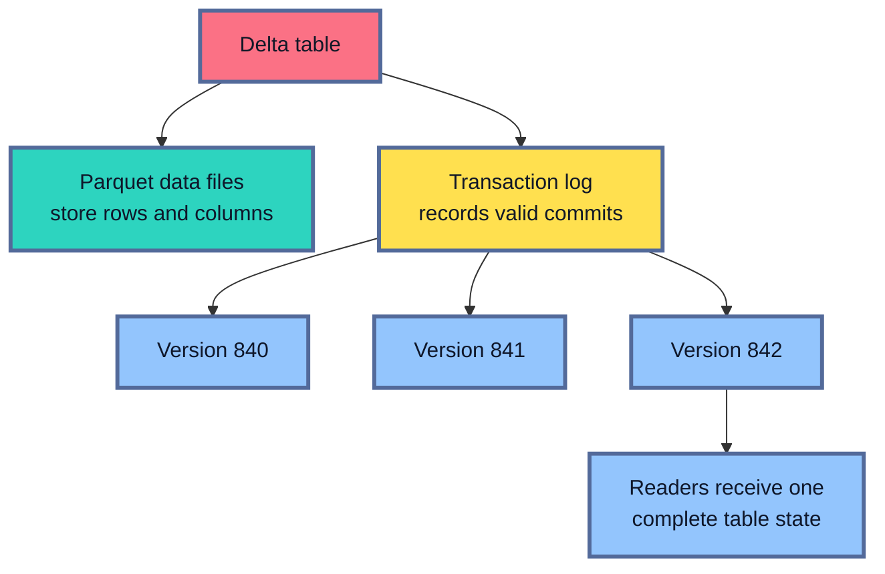
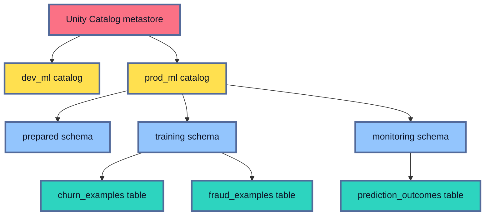
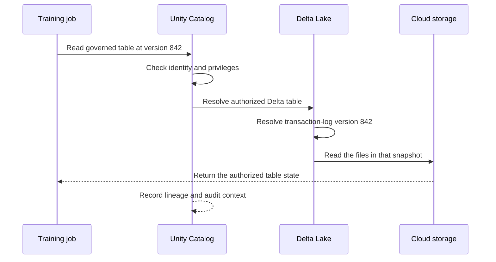
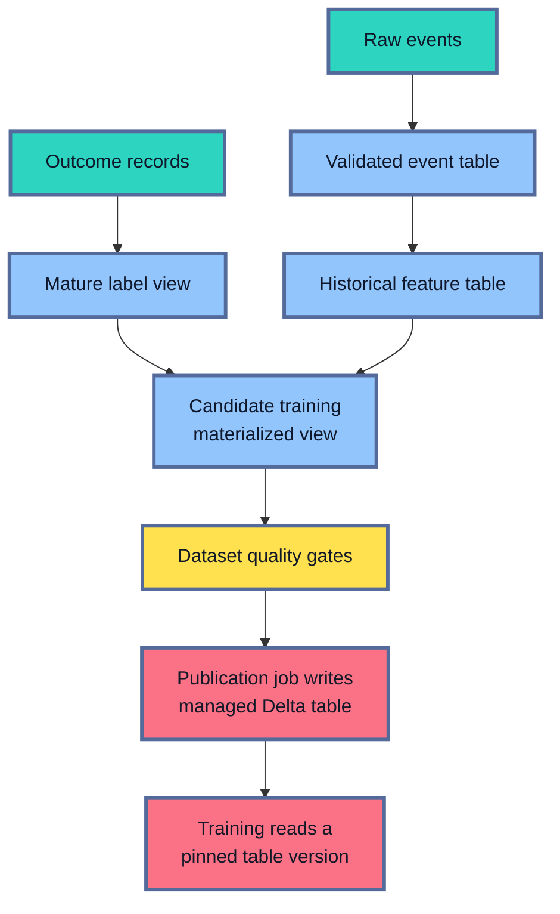

## Table of Contents

1. [The Two Layers Around ML Data](#the-two-layers-around-ml-data)
2. [Why Machine Learning Data Needs These Controls](#why-machine-learning-data-needs-these-controls)
3. [Delta Lake Makes Files Behave Like Reliable Tables](#delta-lake-makes-files-behave-like-reliable-tables)
4. [Unity Catalog Governs The Assets Around Those Tables](#unity-catalog-governs-the-assets-around-those-tables)
5. [How Delta Lake And Unity Catalog Work Together](#how-delta-lake-and-unity-catalog-work-together)
6. [Data Contracts Protect Meaning As Well As Structure](#data-contracts-protect-meaning-as-well-as-structure)
7. [Lakeflow Pipelines Turn The Contract Into A Repeatable Process](#lakeflow-pipelines-turn-the-contract-into-a-repeatable-process)
8. [Catalog Structure And Permissions Create Production Boundaries](#catalog-structure-and-permissions-create-production-boundaries)
9. [Lineage Explains Where Training Data Came From](#lineage-explains-where-training-data-came-from)
10. [Rebuilding The Exact Dataset Used By A Model](#rebuilding-the-exact-dataset-used-by-a-model)
11. [What Governance Still Cannot Guarantee](#what-governance-still-cannot-guarantee)
12. [A Practical Production Design](#a-practical-production-design)
13. [The Complete Governed Data Path](#the-complete-governed-data-path)
14. [References](#references)

## The Two Layers Around ML Data
<!-- section-summary: Delta Lake provides reliable versioned tables, while Unity Catalog governs what those tables are, who can use them, and how they connect to other assets. -->

Start with the object this article is trying to protect: a training dataset. To a data scientist, it looks like a table of examples, features, and labels. Underneath that table are files in cloud storage. Around it are the people, pipelines, training jobs, and models that read or change the data.

Those parts create two different problems. The files need to form one dependable table state, even while pipelines are updating them. The organisation also needs to know what the table means, who may use it, who owns it, and what depends on it.

At a high level, **Delta Lake makes ML data reliable and reproducible, while Unity Catalog makes that data controlled, discoverable, and traceable.**

Delta Lake answers questions about the table itself:

- Did the write finish completely?
- Which files belong to the current table?
- What schema should the data follow?
- Which historical table version did a training job read?

Unity Catalog answers organisational questions around that table:

- What is the governed name of this asset?
- Who owns it?
- Which users and services may read or change it?
- Which pipeline produced it?
- Which models and dashboards depend on it?

In plain language, **Delta Lake is the reliable table layer. Unity Catalog is the governance layer around those tables.** This article follows one training dataset through both layers: from its physical files, to a governed table, to a validated release that a training run can recover later.


*Delta Lake protects the technical state of each table. Unity Catalog applies organisational controls across the tables, pipelines, people, and models that use that state.*

Consider a training table called `prod_ml.training.churn_examples`. Delta Lake can identify version `842` as one complete historical state of that table. Unity Catalog can grant a production training service permission to read it, identify the owning team, and trace the table back to its upstream data.

Neither layer covers the entire problem alone. A perfectly versioned table can still have unclear ownership and excessive access. A carefully permissioned catalog entry can still point to poorly written files with no reliable transaction history. Production MLOps needs the two layers to work together.

## Why Machine Learning Data Needs These Controls
<!-- section-summary: A model changes after its data changes, so production teams must version and govern training inputs alongside code and configuration. -->

Ordinary software behaviour is mainly determined by its code, dependencies, and configuration. Machine-learning behaviour also depends on training rows, features, labels, and the time at which those values were available.

The difference can be written as two simple equations:

`software behaviour = code + dependencies + configuration`

`model behaviour = code + dependencies + configuration + training data + feature logic + labels`

The second equation explains why a model can change even though the repository did not. New customers enter the dataset. Old labels are corrected. A feature definition changes. A join loses one region. A source begins arriving later. The same training script now receives a different account of the world.

Suppose a model was trained several months ago. An investigator asks:

- Which customer records trained this model?
- Did any feature use information that arrived after the historical prediction time?
- Which definition of `support_cases_30d` produced the values?
- Were sensitive columns available to the training identity?
- Which table version contained the corrected labels?
- Can the team recover the same rows today?

An answer such as “the notebook read some Parquet files from this bucket” does not provide enough evidence. The path may contain newer files, deleted files, partial updates, and data that other people can access directly.

A production data asset should answer five foundational questions.

**Identity:** What is the dataset called, what does one row represent, and who owns it?

**Integrity:** Can a reader trust that each update completed as one consistent table state?

**Access:** Which people and workloads may discover, read, or modify it?

**History:** Which exact state did a model use, and is that state still recoverable?

**Lineage:** Which sources produced it, and which downstream models depend on it?

Delta Lake provides much of the integrity and history. Unity Catalog provides the governed identity, access, discovery, audit, and lineage. Data contracts and Lakeflow pipelines add the shared meaning and repeatable production process.

## Delta Lake Makes Files Behave Like Reliable Tables
<!-- section-summary: Delta Lake adds a transaction log to cloud data files so readers receive complete table states, enforced schemas, and addressable history. -->

Most Databricks data ultimately lives in cloud object storage such as Amazon S3, Google Cloud Storage, or Azure Data Lake Storage. Object storage is excellent for keeping large amounts of data, but a folder of Parquet files does not automatically behave like a database table.

Imagine a directory containing thousands of feature files. A reader still needs to know:

- which files are current;
- which files were replaced;
- whether a multi-file update finished;
- which schema the writer followed;
- which files formed yesterday's table.

**Delta Lake adds a transaction log that records those decisions.** The data remains in scalable files, while the log defines each valid table state.



The data files hold the records. The transaction log records which files belong to each committed version. A query against version `842` therefore has a precise set of files to read.

### Atomic writes prevent half-finished training data

An **atomic write** is an update that appears as one complete success or one complete failure. Readers continue to see the previous committed table until the new update has finished and committed.

Suppose an hourly feature pipeline must replace five million customer rows. Without transactional behaviour, a training job might start after only half of the files have been written. Some customers would have new features, others would have old features, and a retry might leave duplicates.

Delta Lake commits the update as one table version. A reader sees the previous complete version or the new complete version. It does not see the pipeline's unfinished work.

This protection matters greatly for ML because broken data often fails silently. The training process may accept the mixed rows, produce a model file, and report normal-looking metrics. The damage appears later through unstable predictions or poor performance for a missing segment.

### Schema enforcement catches structural mistakes

A **schema** defines the columns and data types a table expects. For example:

- `customer_id` is a string;
- `account_age_days` is an integer;
- `average_monthly_spend` is a double;
- `prediction_time` is a timestamp.

Suppose an upstream service begins sending `account_age_days = "unknown"` and `average_monthly_spend = "£1,200"`. Those values no longer match the integer and double fields expected by the training table.

Delta Lake checks writes against the target schema and rejects incompatible data. The source problem reaches the pipeline as an explicit failure rather than quietly contaminating the production table.

Schema enforcement checks structure. It cannot decide whether an allowed value makes sense. `account_age_days = 90000` may still be a valid integer. Production teams add `NOT NULL` rules, `CHECK` constraints, pipeline expectations, freshness checks, and distribution checks for those higher-level guarantees.

A binary label table can enforce a basic domain:

```sql
ALTER TABLE prod_ml.training.churn_examples
ADD CONSTRAINT valid_churn_label CHECK (churned IN (0, 1));
```

The constraint rejects a transaction containing an impossible label. Primary-key and foreign-key declarations can describe relationships for supported tables, although Databricks treats those relationships as informational. Duplicate and referential checks still need pipeline logic.

### Schema evolution makes change deliberate

Production schemas do change. A team may add `device_trust_score`, replace a numeric identifier with a string, or split one address field into several fields.

**Schema evolution** is the controlled process of changing the table structure. Delta Lake supports explicit schema changes and optional automatic evolution. The important decision is which changes the pipeline should accept automatically.

A source that is expected to add well-governed fields may use controlled evolution. A sensitive training table often keeps stricter enforcement so an unexpected field does not enter the data contract without review. Otherwise, a typo such as `customer_adress` can survive as a new production column.

The team should review the effect on readers before changing or removing a field. Unity Catalog lineage helps identify those readers, while the data contract explains whether the change is compatible.

### Table versions give past data an address

Every committed change creates another Delta table version. Delta numbering starts at `0`, so version `842` means the state recorded by commit version `842`.

The training task should resolve a version and then read that version explicitly:

```python
table_name = "prod_ml.training.churn_examples"
version = spark.sql(
    f"DESCRIBE HISTORY {table_name} LIMIT 1"
).first()["version"]

training_df = (
    spark.read
    .option("versionAsOf", version)
    .table(table_name)
)
```

The explicit `versionAsOf` read prevents a race with concurrent writers. A new commit can arrive after the history query, while this DataFrame remains pinned to the resolved version.

An investigator can later query the same state:

```sql
SELECT *
FROM prod_ml.training.churn_examples VERSION AS OF 842;
```

This is **time travel**: reading a retained historical table version. It supports debugging, reproduction, comparison, and recovery. For example, the team can compare the training data before and after a feature correction and identify exactly which rows changed.

Time travel has a retention boundary. Old data files can be removed by `VACUUM`, and transaction history follows its own retention settings. A saved version number cannot recover files that no longer exist. The required investigation period must therefore shape the table's retention or snapshot policy.

### Change Data Feed exposes row-level changes

Some downstream systems need the rows that changed rather than the complete new table. Delta Lake **Change Data Feed** can record inserted, updated, and deleted rows between table versions after the feature is enabled.

This is useful for incremental work. A feature pipeline may update only customers whose transactions changed. An online store may refresh only the affected feature keys. A monitoring pipeline may process only new predictions.

Change Data Feed does not replace the final table version. The feed explains the changes between states, while the table version identifies the complete state used by training.

## Unity Catalog Governs The Assets Around Those Tables
<!-- section-summary: Unity Catalog gives data and AI assets governed names, ownership, permissions, discovery, lineage, policy, and audit across workspaces. -->

Delta Lake can maintain a dependable table without knowing the organisation's teams or policies. It does not decide whether an analyst may see a national identifier, which group owns a feature definition, or which production model depends on a column.

**Unity Catalog is the Databricks governance layer that handles those responsibilities.** It governs data and AI assets through a central object model shared across connected workspaces.

### The three-level name identifies the asset

Unity Catalog uses a three-level namespace:

`catalog.schema.object`

The table `prod_ml.training.churn_examples` has three parts:

- `prod_ml` is the catalog and main isolation boundary;
- `training` is the schema that groups related assets;
- `churn_examples` is the table.

A governed name such as `prod_ml.training.churn_examples` identifies where the asset belongs and which policy boundary contains it. An informal path such as `s3://bucket/final/new/churn_v2/` carries no equivalent catalog structure. Unity Catalog can attach ownership, permissions, comments, tags, and lineage to the named table.



Catalogs often represent an environment, a business domain, or a combination such as `risk_prod`. Schemas create smaller areas for prepared data, features, labels, training inputs, and monitoring evidence. The naming scheme should follow ownership and access boundaries that actually exist.

### Permissions belong to governed assets

Unity Catalog grants privileges to users, groups, and service principals.

A **user** is a person who explores data or investigates a problem. A **group** represents a durable responsibility such as data scientists or data stewards. A **service principal** represents an automated workload such as a production pipeline.

A training service principal may receive permission to read one approved table:

```sql
GRANT USE CATALOG ON CATALOG prod_ml TO `ml-training-prod`;
GRANT USE SCHEMA ON SCHEMA prod_ml.training TO `ml-training-prod`;
GRANT SELECT ON TABLE prod_ml.training.churn_examples TO `ml-training-prod`;
```

The identity can discover the catalog, use the schema, and read the table. It does not receive permission to modify labels, create arbitrary production tables, or manage grants.

This is a major improvement over attaching one broad cloud role to every cluster. A shared storage role often allows any user of that compute to read a large part of the bucket. Unity Catalog evaluates the actual identity and requested asset.

### Fine-grained policies protect sensitive rows and columns

Table-level access may still be too broad. One team may be allowed to see only records from its region. An analyst may need transaction amounts while receiving masked email addresses.

Unity Catalog supports row filters, column masks, and attribute-based access-control policies. Governed tags can classify data as `public`, `internal`, `confidential`, or `restricted`, and centrally managed policies can act on those classifications.

The people allowed to change governed tags need careful control. A tag can activate a security policy, so changing the tag can change the access boundary.

### Discovery helps teams reuse approved data

Governance also helps authorised users find the right asset. Unity Catalog can expose table descriptions, column comments, owners, schemas, tags, usage information, and related lineage.

Suppose several teams need `customer_lifetime_value`. Without discovery, each team may rebuild the calculation from raw tables and produce different answers. A governed table with clear ownership and semantics gives them a shared starting point.

Discovery depends on useful metadata. A table called `final_table_2` with no comments remains difficult to trust even after registration. The catalog name, table grain, important column meanings, freshness expectation, and owner should all be visible.

### Managed and external tables assign storage responsibility

Unity Catalog governs both managed and external tables, but the owner of the files differs.

For a **managed table**, Unity Catalog manages the metadata, storage location, file lifecycle, and platform optimisations. The files remain in the organisation's cloud account. Databricks recommends managed tables for most new production tables, and they are a strong default for curated features, labels, and published training inputs.

For an **external table**, the organisation chooses the storage path and controls the underlying file lifecycle. Unity Catalog governs access through the registered table. Dropping the external table removes the catalog registration while leaving the files in storage.

External tables fit existing shared data and integration boundaries that require direct path ownership. They also introduce another security responsibility: an external engine with independent cloud credentials may read the files without passing through Unity Catalog. Cloud IAM must protect that path because a direct Parquet reader cannot apply a Unity Catalog column mask.

Storage credentials and external locations provide governed objects for external storage access. A storage credential represents an approved cloud identity. An external location combines that identity with an authorised storage path. Users receive privileges on the external location rather than raw long-lived cloud credentials.

## How Delta Lake And Unity Catalog Work Together
<!-- section-summary: Unity Catalog authorizes and records access to a named asset, while Delta Lake supplies the consistent table state that the authorized query reads. -->

The two systems participate in the same table request at different moments.

Suppose a production training job asks for `prod_ml.training.churn_examples` at version `842`.

1. Unity Catalog resolves the governed table name.
2. Unity Catalog checks the service principal's catalog, schema, and table privileges.
3. Databricks reads the Delta transaction log for version `842`.
4. Delta Lake identifies the data files that form that complete table state.
5. The query produces lineage and audit evidence under the authorized identity.



The sequence explains the division of responsibility. Unity Catalog decides whether the request may reach the asset. Delta Lake decides which files form the requested table state.

The table below is useful only after those responsibilities are clear:

| Concern | Delta Lake | Unity Catalog |
|---|---|---|
| Complete transactional update | Provides the table commit | Governs the resulting asset |
| Schema | Enforces table structure | Publishes metadata and policies |
| Historical state | Stores addressable versions | Controls access to the table |
| User and workload access | Uses the authorized execution context | Defines privileges and policies |
| Discovery and ownership | Outside the table protocol | Provides governed metadata |
| Lineage and audit | Supplies versioned read and write activity | Captures supported relationships and access evidence |

## Data Contracts Protect Meaning As Well As Structure
<!-- section-summary: A data contract explains the row grain, field meaning, time rules, quality limits, freshness, ownership, and change policy that schemas alone cannot express. -->

Delta schema enforcement can prove that `monthly_spend` is a number. It cannot tell a data scientist whether the number includes refunds, which currency it uses, or whether it covers the calendar month or the last thirty days.

**A data contract is the agreement that explains those meanings and guarantees.** It connects the team that produces the data with the teams and models that consume it.

A useful ML data contract covers six areas.

**Row identity and grain.** Does one row represent a customer, an account, a transaction, or a customer at a historical prediction time? Which fields identify it?

**Field meaning.** What does `support_cases_30d` count? Does `monthly_spend` include tax and refunds? Which units and categories are valid?

**Time.** Which timestamp represents the business event? How are late records handled? Which values were available at the historical prediction time? How long must a label mature?

**Quality.** Which fields are required? Which ranges are valid? What duplicate rate, null rate, and join coverage can the consumer tolerate?

**Freshness.** How soon should new source events appear? At what age should the training job stop rather than use stale data?

**Ownership and change.** Which group owns the dataset? How are breaking changes reviewed? Who receives the incident and how much notice do consumers get?

The contract may live partly in catalog comments and tags, partly in reviewed source control, and partly in executable checks. The exact storage matters less than keeping the human explanation and technical enforcement aligned.

### Different failures need different responses

A production pipeline should decide what to do after a rule fails. The consequence to training data guides that decision.


*Each branch represents a separate response chosen from the risk. A warning keeps the row and measures the problem. A drop protects the main target. A separate quarantine flow preserves rejected records for repair. A failed target flow prevents publication of that candidate.*

An unexpected but valid channel might remain in the table while the team measures its frequency. A row without `customer_id` cannot join to features, so the main target can drop it while another flow writes it to quarantine. An impossible binary label such as `7` suggests a broken mapping and should fail the label flow.

The final publication gate checks that all required inputs succeeded. This matters because a failed expectation stops its target flow; independent flows in a triggered pipeline may continue.

### Row checks and dataset checks solve different problems

Row-level rules evaluate one record. Dataset-level rules evaluate the complete population.

Every row can have a valid customer ID while a failed join removes an entire region. Every label can be `0` or `1` while the positive rate unexpectedly falls from five percent to almost zero. Every timestamp can be valid while the newest source record is several days old.

Before publication, a training-data pipeline should check source freshness, input and output counts, duplicate rate, feature-to-label join coverage, label balance, segment coverage, and historical time boundaries. A major failure keeps the previous approved dataset version in use while the team repairs the source or transformation.

## Lakeflow Pipelines Turn The Contract Into A Repeatable Process
<!-- section-summary: Lakeflow pipelines declare tables, transformations, dependencies, and expectations, then expose the evidence needed to approve a training-data release. -->

A data contract describes the agreement. A **Lakeflow pipeline** runs the transformations and checks that implement that agreement on Databricks.

Lakeflow pipelines extend Apache Spark Declarative Pipelines. The developer declares streaming tables, materialized views, transformations, and expectations. Databricks builds the dependency graph and manages the required execution.

For an ML dataset, the graph may include:

1. raw events arriving in a streaming table;
2. a validated materialized view that standardises identifiers and time;
3. a mature label view;
4. a point-in-time feature join;
5. a candidate training materialized view;
6. aggregate quality gates;
7. a publication job that writes an ordinary managed Delta table.



The ordinary managed Delta table at the end is the training release artifact. The pipeline-managed materialized view remains a candidate. This boundary is important because Lakeflow materialized views and streaming tables cannot serve as `CLONE` sources, while the published ordinary Delta table supports the version and preservation workflow used later.

### Expectations enforce selected contract rules

Lakeflow expectations attach a name, condition, and violation action to a pipeline dataset:

```python
from pyspark import pipelines as dp

@dp.materialized_view(name="churn_training_candidate")
@dp.expect("known_channel", "channel IN ('web', 'mobile', 'store')")
@dp.expect_or_drop("has_customer", "customer_id IS NOT NULL")
@dp.expect_or_fail("valid_label", "churned IN (0, 1)")
def churn_training_candidate():
    return spark.read.table("prod_ml.prepared.churn_candidates")
```

The first rule keeps unfamiliar channels and measures them. The second excludes rows that cannot connect to a customer. The third fails this target flow after an impossible label appears.

`expect_or_drop` does not create a quarantine table. Preserving rejected rows requires a separate filtered dataset or flow. The pipeline event log and quality metrics provide evidence for retained and dropped violations.

### Streaming tables and materialized views serve different purposes

A **streaming table** incrementally processes arriving records. It fits event ingestion and transformations that advance as new data appears.

A **materialized view** stores the refreshed result of a query. It fits joins, aggregates, and candidate training datasets whose definition describes the desired result.

The published training release uses an ordinary managed Delta table written by a separate task after the gates pass. Training then reads a stable, cloneable, versioned input while the pipeline remains free to refresh its candidate materialized view.

### Environment configuration needs a reviewed path

Development and production use different catalogs, storage boundaries, and quality thresholds. The same transformation code should run with reviewed environment configuration.

Stable pipeline properties can set the target `catalog` and `schema`. Additional configuration values can use the pipeline `configuration` map and Spark configuration. Declarative Automation Bundles can store these environment definitions beside the pipeline code.

Lakeflow pipeline parameters can supply run-time values to SQL pipeline source, although that capability is currently Beta. Teams avoiding preview features can use the stable configuration path for production.

## Catalog Structure And Permissions Create Production Boundaries
<!-- section-summary: Catalogs, schemas, groups, service principals, policy controls, and workspace bindings separate exploratory work from automated production writes. -->

The Unity Catalog hierarchy should reflect real ownership and isolation. A small design might use:

- `dev_ml` for development assets;
- `prod_ml` for production prepared data, features, labels, training inputs, and monitoring;
- `prod_ml_archive` for restricted long-term training snapshots.

Within `prod_ml`, schemas can separate `prepared`, `features`, `labels`, `training`, and `monitoring`. The catalog provides the stronger environment boundary. Schemas group assets with similar purpose and privileges.

This layout is only useful after its permissions match the workflow.

The ingestion service writes raw tables. The transformation service reads raw data and writes prepared tables. The training-data pipeline reads prepared features and labels and publishes candidate data. A separate publication identity writes the approved training table. The training identity reads that table without gaining permission to rewrite labels.

Ownership should belong to groups rather than individuals. A group such as `ml-data-platform-owners` survives staff changes and gives the organisation a reviewed membership process.

### Workspace bindings add a location boundary

Catalog grants answer who may access an object. Workspace bindings answer where that catalog may be accessed.

A production catalog can be bound to production workspaces and excluded from an unrestricted development workspace. A read-only binding can support investigation from a controlled operations workspace without allowing that workspace to write the catalog.

Identity and workspace location then work together. A user's table grant does not automatically make the production catalog available from every cluster they can create.

## Lineage Explains Where Training Data Came From
<!-- section-summary: Unity Catalog lineage records supported relationships across tables, columns, jobs, pipelines, notebooks, models, and downstream consumers. -->

**Data lineage is the recorded path from source data to downstream use.** For a training table, it can show which upstream tables supplied the rows, which pipeline transformed them, and which model consumed the result.

Imagine that a source owner plans to redefine `account_status`. The lineage graph reveals two feature tables, three training datasets, and one monitoring dashboard that depend on the column. The change can receive a coordinated compatibility review.

Lineage also supports incident investigation. If a retraining run loses one region, the team can trace the region feature from the training table through its feature calculation and prepared source. The search narrows to the operations that touched that field.

Unity Catalog captures supported Databricks SQL and Spark DataFrame lineage down to column level and aggregates it across workspaces attached to the metastore. Named Unity Catalog tables provide stronger lineage than direct storage paths.

### Lineage has important boundaries

Lineage is a dependency map. It does not replace the exact evidence stored by a training run.

The graph may show that a job read a table without identifying the exact version used for training. Renamed objects do not preserve their old lineage identity. Direct path reads, some UDFs, and lower-level RDD operations can hide relationships. Visibility also follows the viewer's catalog and workspace permissions.

The training evidence must still record the table version, code revision, configuration, cutoffs, and contract version. Lineage provides the broader path around those exact identifiers.

### Lineage should lead to a human owner

A graph that ends at an unexplained table gives the investigator only half of the answer. Table comments should state the row grain and purpose. Important columns should explain their meaning and time semantics. Catalog and schema ownership should lead to a durable group.

The complete result is: “this feature came from this table, through this pipeline, under this contract, and this team owns the source definition.”

## Rebuilding The Exact Dataset Used By A Model
<!-- section-summary: Exact reconstruction needs a published Delta table version, retained files, the historical code and configuration, time rules, and validation evidence. -->

Rebuilding an exact training dataset means recovering the same rows and values that a historical model received. Rerunning today's pipeline against today's sources answers a different question.

The first requirement is a published ordinary managed Delta table such as `prod_ml.training.churn_examples` at version `842`.


*The version identifies the table state. Retention keeps that state available. Historical code, configuration, time cutoffs, and validation evidence explain and verify the recovered rows.*

### Step 1: Recover the published table version

The model run should store the fully qualified table name and version. Verify that the version still exists, then read it explicitly through time travel.

If the data files disappeared after retention cleanup, the version number alone cannot recover them. The result may be an approximation from surviving sources, and the investigation should label it that way.

### Step 2: Recover code and configuration

The evidence should identify the Git commit or released bundle that produced the dataset. It should also identify the Lakeflow pipeline, publication job, and their configuration.

Historical code matters because a newer branch may use a different window, join, deduplication rule, or label definition. Two successful runs can create different rows while using the same table names.

### Step 3: Recover time rules

ML data has several clocks.

The **feature cutoff** protects point-in-time correctness: a historical training row receives only feature values available by its prediction time.

The **label-maturity rule** waits until the outcome window has completed. If churn means cancellation within thirty days, a historical example cannot receive its final label until those thirty days have passed.

The **split rule** decides which prediction times belong to train, validation, and test sets. Changing any of these rules changes the dataset.

### Step 4: Reapply the recorded contract

Recover the expectations and dataset-level thresholds used by the original update. If the pipeline dropped rows without customer identifiers, that action is part of the historical data state.

Compare the recovered row count, schema, null counts, label rate, segment counts, join coverage, and time boundaries with the original evidence. A matching row count by itself is weak; two datasets can contain the same number of different rows.

### Step 5: Preserve the result and its evidence

The reconstruction is an auditable run. Record who requested it, which assets it used, which checks matched, and where any difference remained.

The training pipeline can keep one small evidence record per approved dataset:

- model or training run identifier;
- published table name and version;
- upstream table names and versions;
- pipeline and publication job run identifiers;
- source-code commit or bundle version;
- feature cutoff, label cutoff, and split definition;
- contract version;
- row count, schema fingerprint, and key quality metrics;
- snapshot location and retention class where applicable.

The record points to governed assets, so the evidence stays small and sensitive training rows remain inside their controlled data store.

### Time travel and durable snapshots serve different horizons

Time travel is efficient for a bounded operational investigation period. The table's log and deleted-file retention must cover that period.

A long-lived or high-risk model may need an independent snapshot. A **deep clone** copies one table state into a separate table:

```sql
CREATE TABLE prod_ml_archive.training.churn_run_7f31
DEEP CLONE prod_ml.training.churn_examples@v842;
```

The clone needs its own owner, permissions, retention, and deletion policy. It preserves the copied state rather than the source table's full history.

The team should choose the preservation horizon before release. Waiting for an incident may mean the required source files have already been removed.

## What Governance Still Cannot Guarantee
<!-- section-summary: Platform governance supplies control and evidence, while semantic correctness, responsible feature use, model quality, and human judgement still require separate work. -->

Governance tells the team that an asset is controlled and traceable. Correctness asks whether its contents, meaning, and use are actually right for the ML problem. Those are separate responsibilities.

Delta Lake can prove that a write committed atomically. It cannot prove that the feature formula represents the intended business behaviour.

Schema enforcement can prove that `age` is an integer. It cannot prove that `age = 900` is sensible.

Unity Catalog can show that a model used `customer_income`. It cannot decide whether income is appropriate for a specific legal, ethical, or product decision.

Lineage can show the upstream table and pipeline. Exact reproduction also needs the historical table state and the instructions that produced it. The table name and version identify the data. The code revision and dependencies identify the transformation logic. Configuration and time rules identify the choices made for that run. Random controls preserve algorithmic behaviour where the training process uses randomness.

Governance gives the team a controlled asset and an evidence path. Data-quality engineering, model evaluation, privacy review, fairness analysis, and human decision-making remain necessary.

## A Practical Production Design
<!-- section-summary: A practical design moves source data through reliable Delta tables and Lakeflow checks, then publishes one governed version for training and later reconstruction. -->

A production implementation can follow this sequence:

1. Register sources in Unity Catalog and limit raw access to approved identities.
2. Store new curated outputs as Unity Catalog managed Delta tables.
3. Use Lakeflow pipelines to clean records and calculate features and labels.
4. Put important schema, time, quality, freshness, and ownership rules in a reviewed data contract.
5. Implement row-level expectations and dataset-level publication gates.
6. Materialize a candidate training view.
7. Use a separate publication job to write an ordinary managed Delta training table.
8. Resolve the committed version and make training read that version explicitly.
9. Store the version, code revision, configuration, time cutoffs, and quality evidence with the model run.
10. Align time-travel retention or a deep-clone snapshot with the model's investigation horizon.

The first useful milestone is simple. A training run should answer four questions without relying on someone's notebook memory:

- Which exact table version did it read?
- Which reviewed code and configuration produced that table?
- Which checks approved it?
- Which group owns the data definition?

## The Complete Governed Data Path
<!-- section-summary: Unity Catalog governs the full path while Delta Lake, contracts, Lakeflow pipelines, publication gates, and evidence records create a recoverable training input. -->

The complete path starts with changing source records and ends with an exact training input that the team can explain and recover.

Delta Lake gives every table a reliable committed state and historical version. The data contract explains what the rows and columns mean. Lakeflow pipelines build and validate a candidate. A publication job writes an approved ordinary Delta table. The training run reads a pinned version and stores the evidence required for later reconstruction.

Unity Catalog surrounds this path. It gives the assets governed names, controls access, identifies owners, supports discovery, and records supported lineage and audit evidence.


*Unity Catalog governs every stage. The contract controls meaning and quality. The publication boundary creates a managed Delta version that training can pin and an investigator can recover.*

The result is more than a folder of training files. It is a named, authorised, versioned, explained, and traceable production asset.

## References

- [What is Delta Lake in Databricks?](https://docs.databricks.com/aws/en/delta)
- [ACID guarantees on Databricks](https://docs.databricks.com/aws/en/lakehouse/acid)
- [Schema enforcement on Databricks](https://docs.databricks.com/aws/en/tables/schema-enforcement)
- [Update table schemas with schema evolution](https://docs.databricks.com/aws/en/tables/update-schema)
- [Work with table history](https://docs.databricks.com/aws/en/tables/history)
- [Remove unused data files with VACUUM](https://docs.databricks.com/aws/en/delta/vacuum)
- [Use change data feed on Databricks](https://docs.databricks.com/aws/en/tables/features/change-data-feed)
- [CREATE TABLE CLONE](https://docs.databricks.com/aws/en/sql/language-manual/delta-clone)
- [What is Unity Catalog?](https://docs.databricks.com/aws/en/data-governance/unity-catalog/)
- [What are catalogs in Databricks?](https://docs.databricks.com/aws/en/catalogs/)
- [Managed versus external assets in Unity Catalog](https://docs.databricks.com/aws/en/data-governance/unity-catalog/managed-versus-external)
- [Unity Catalog access control](https://docs.databricks.com/aws/en/data-governance/unity-catalog/access-control/)
- [Unity Catalog privileges reference](https://docs.databricks.com/aws/en/data-governance/unity-catalog/access-control/privileges-reference)
- [Workspace-catalog binding](https://docs.databricks.com/aws/en/data-governance/unity-catalog/access-control/workspace-catalog-binding)
- [Lineage in Unity Catalog](https://docs.databricks.com/aws/en/data-governance/unity-catalog/data-lineage)
- [Lakeflow Spark Declarative Pipelines](https://docs.databricks.com/aws/en/ldp/)
- [Manage data quality with pipeline expectations](https://docs.databricks.com/aws/en/ldp/expectations)
- [Pipeline properties reference](https://docs.databricks.com/aws/en/ldp/properties)
