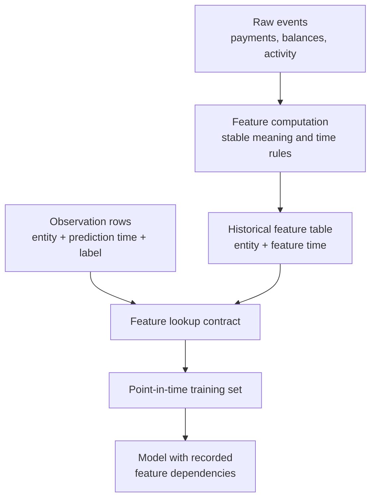
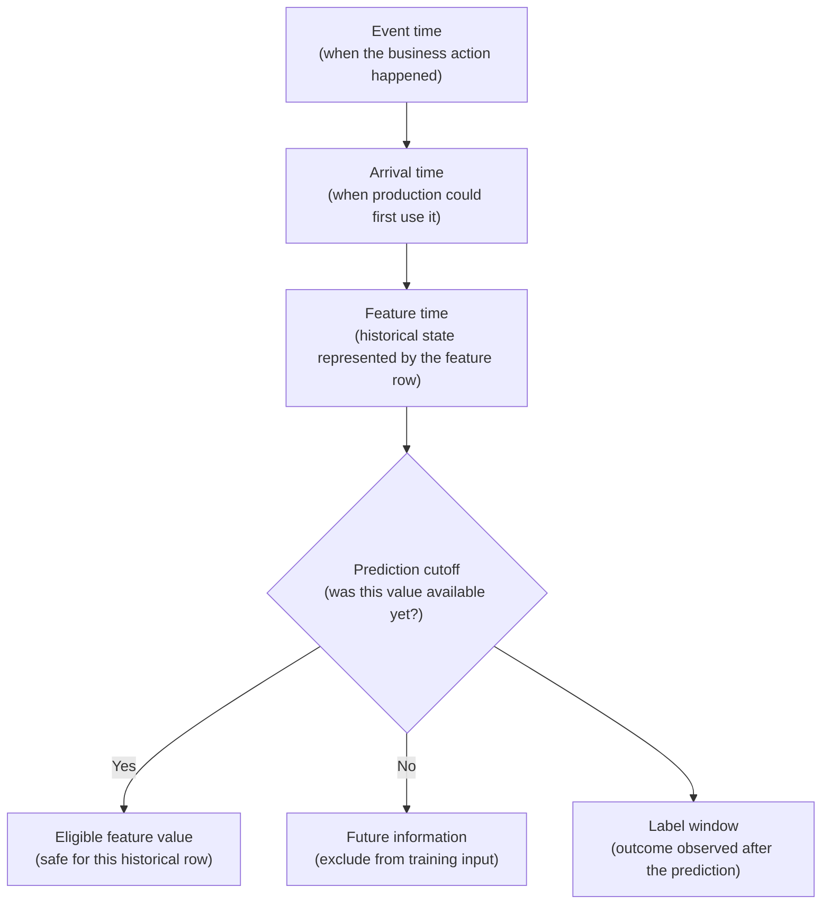
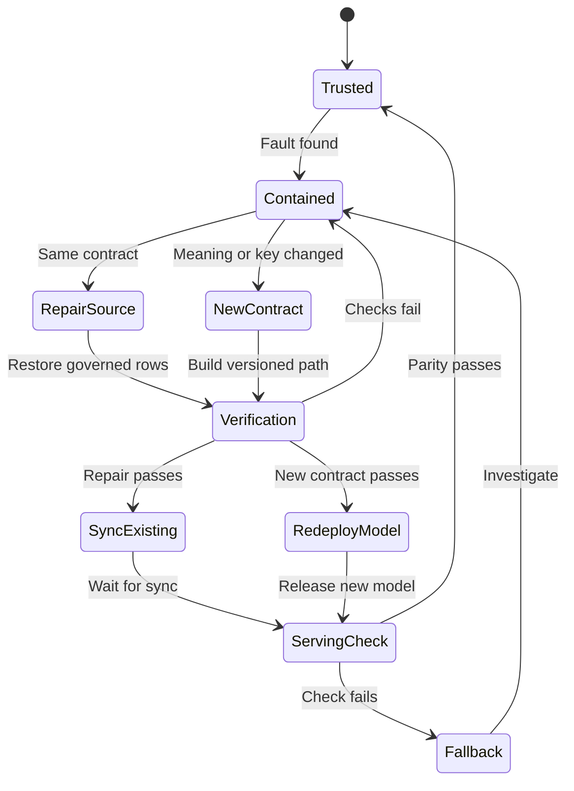

## Table of Contents

1. [What Feature Engineering And Point-In-Time Correctness Mean](#what-feature-engineering-and-point-in-time-correctness-mean)
2. [Turn Raw Records Into Model Features](#turn-raw-records-into-model-features)
3. [Use Only Information Available At Prediction Time](#use-only-information-available-at-prediction-time)
4. [How A Point-In-Time Join Builds One Training Row](#how-a-point-in-time-join-builds-one-training-row)
5. [Build Historically Correct Training Data In Databricks](#build-historically-correct-training-data-in-databricks)
6. [Use The Same Feature Logic For Training And Inference](#use-the-same-feature-logic-for-training-and-inference)
7. [Choose Offline, Online, Or On-Demand Features](#choose-offline-online-or-on-demand-features)
8. [Operate Shared Features As Production Assets](#operate-shared-features-as-production-assets)
9. [When A Feature Store Is Worth The Cost](#when-a-feature-store-is-worth-the-cost)
10. [Follow The Complete Feature Lifecycle](#follow-the-complete-feature-lifecycle)
11. [References](#references)

## What Feature Engineering And Point-In-Time Correctness Mean
<!-- section-summary: Feature engineering decides what a model should know, while point-in-time correctness limits each historical example to information that was genuinely available at its prediction time. -->

A model cannot learn directly from a stream of transactions, balance updates, and support events. **Feature engineering turns that raw activity into meaningful model inputs, while point-in-time correctness keeps each historical input limited to information that was available at the time.** Together, they give the model a useful and honest view of the past.

Suppose a model estimates whether an account will miss a payment during the next thirty days. The source systems contain transactions, balances, repayment events, account changes, and support conversations. The model cannot use those records directly as one tidy input. It needs values such as:

- the number of transactions during the previous 24 hours;
- the average balance during the previous 30 days;
- the number of failed payments during the previous 90 days;
- the number of days since the last successful payment.

Those values are **features**. Each one summarizes a useful part of the account's history. The calculation that creates them is feature engineering.

Now imagine that the training data contains a prediction opportunity from Tuesday at 10:00. A balance correction arrived at noon, and a failed payment happened on Wednesday. Both events may appear in the source today. Neither event belonged to the information available on Tuesday at 10:00.

If the Tuesday training row receives either value, the model gets help from the future. Its offline evaluation may look excellent because the answer has leaked into the inputs. The deployed model then performs worse because a live prediction never receives future information.

**Point-in-time correctness means that every historical observation receives the latest eligible feature value from its own past.** The observation at 10:00 can use a feature calculated at 09:45. It cannot use the update from noon.

The two ideas belong together:

- feature engineering decides **what the model should know**;
- point-in-time correctness decides **which historical version of that knowledge the model may use**.

Databricks Feature Store helps connect these paths. Historical feature values live in governed Delta tables in Unity Catalog. `FeatureEngineeringClient` joins those values to training observations and can preserve the lookup rules with the trained model. Batch inference can replay the recorded point-in-time rule. Online inference uses the same feature identities and entity keys to retrieve the latest published values, while freshness and fallback controls protect the live request.

The platform handles storage, lookup, lineage, and serving integration. The team still owns the difficult decisions: what a feature means, which events qualify, which clock controls its history, how fresh it must be, and what the system should do after a value is missing or late.

## Turn Raw Records Into Model Features
<!-- section-summary: A feature system gives raw records a stable subject, row meaning, calculation, history, and lookup contract that training and inference can share. -->

Raw operational tables describe events at the grain needed by the product. A transaction table may contain one row per payment attempt. A support table may contain one row per conversation. An account table may hold one current row per account. These sources have different keys, update schedules, and timestamp meanings.

A model expects something simpler: one row for one prediction, with one column for each input. Moving from the source records to that row requires a small set of objects. Those objects define the subject of the prediction, the meaning of each feature, the prediction time, and the rule that joins past feature values to that time.

### Define What One Feature Row Represents

The **entity** is the subject of a feature. It could be an account, device, merchant, product, or a pair such as `(viewer_id, item_id)`.

The **grain** states what one row represents. A table keyed only by `account_id` may represent the current feature state for each account. A table keyed by `(account_id, feature_ts)` represents many historical states for the same account.

This distinction changes the questions the data can answer. A current-state table can tell a live service the account's latest thirty-day spend. It cannot reconstruct what that value was three months ago unless history has been kept somewhere else.

Keys also need a stable meaning across systems. If the observation table uses a regional customer number while the feature table uses a global account identifier, the lookup may miss an entire population even though both columns are strings. Production teams define the identifier source, format, null policy, and migration path as part of the feature contract.

### Define The Meaning And Calculation Of Each Feature

Consider a column named `transactions_30d`. The name suggests a count, although it leaves important choices open:

- Are declined transactions included?
- Do refunds subtract from the count?
- Does the window use event time or arrival time?
- Is the current partial day included?
- Which timezone controls the boundary?
- What happens before an account has thirty days of history?

Two pipelines can answer those questions differently and still produce a valid integer. The model would receive two different meanings under the same name.

A production feature definition records the entity, formula, eligible events, window boundary, timestamp source, null and default behaviour, update schedule, owner, and sensitive-data classification. The feature is a maintained data product whose output feeds models.

### Record Each Historical Prediction Opportunity

The feature table stores knowledge about entities. The **observation table** stores the moments the model is learning from.

One observation row might contain:

| `observation_id` | `account_id` | `prediction_time` | `missed_payment_30d` |
|---|---|---|---:|
| `obs-701` | `A-1042` | 10:00 | 1 |

The row means: “At 10:00, the system could have predicted whether account `A-1042` would miss a payment during the following thirty days.” The label appears later, after the outcome window has finished. The feature values must come from 10:00 or earlier.

`observation_id` matters because one account may have many prediction opportunities. It gives each opportunity a durable identity for joins, validation, and investigation.

### Define How Observations Find Historical Features

A **feature lookup** states:

1. which feature table to read;
2. which feature columns to retrieve;
3. which observation column identifies the entity;
4. which observation timestamp controls historical selection;
5. how old an eligible feature value may be.

The feature table and observation table keep their own grains. The lookup contract connects them and produces the model-ready training set.



In Databricks, a Unity Catalog Delta table can hold the feature history, a `FeatureLookup` expresses the retrieval rule, and a `TrainingSet` represents the joined result. These product objects now have a clear job because the underlying relationship is already visible.

## Use Only Information Available At Prediction Time
<!-- section-summary: Feature history uses several clocks, and the production availability cutoff determines whether a value genuinely belonged to a past prediction. -->

Time-based leakage often starts with a reasonable-looking timestamp. An event happened before the prediction, so the training pipeline treats it as known. That assumption fails whenever the event reached the production system later.

To reconstruct a past prediction honestly, the team needs to distinguish several clocks.



### Separate When An Event Happened From When It Arrived

**Event time** records the business action. A card payment may happen at 09:42.

**Arrival time** records the moment the event reached the data platform or the production feature path. A mobile device may send the payment at 10:15 after reconnecting.

For a prediction made at 10:00, the event belongs to the business past and the system's future. A model serving at 10:00 could not use data that arrived at 10:15.

This is why a timestamp such as `payment_time` may be insufficient for strict historical replay. The feature pipeline may also need ingestion time, source publication time, or another reliable record of availability. The correct clock depends on the production path the historical evaluation is trying to reproduce.

### Record Which Historical State A Feature Row Represents

**Feature time** is the historical point represented by a feature row. A row with `feature_ts = 10:00` may summarize eligible account activity through 10:00.

Feature time needs a precise calculation rule. A window ending at 10:00 could include events whose event time is at or before 10:00. A stricter production-availability rule may also require those events to have arrived before the feature calculation cutoff.

The feature row should preserve enough evidence to explain that cutoff. Useful evidence includes the source versions, pipeline run, code revision, maximum arrival time consumed, and publication time.

### Use Prediction Time To Choose Historical Features

**Prediction time** belongs to the observation row. It says when the past decision could have happened.

During training, the lookup searches backward from this time. For account `A-1042` at 10:00, the system selects the latest eligible `A-1042` feature row at or before 10:00.

Prediction time also needs one agreed meaning. An API may receive a request at 10:00 and finish at 10:00:00.350. The contract should state whether the cutoff is request acceptance, policy evaluation, or another event. A small difference can matter for fast-moving features.

### Keep Future Outcomes Out Of Model Inputs

The **label** is the outcome the model tries to predict. A thirty-day missed-payment label cannot mature at prediction time because the next thirty days have not happened yet.

Feature and label timing therefore point in opposite directions:

- feature values come from the information available before the prediction;
- the label comes from the outcome observed after the prediction.

Training should wait until the label window is complete. A row from yesterday cannot carry a reliable thirty-day outcome today. Label-maturity checks and point-in-time feature joins protect different boundaries, and a trustworthy dataset needs both.

### Define How Backfills Handle Late Data

Late data creates a second decision. Suppose a payment failure happened on Monday, arrived on Wednesday, and entered a Thursday backfill. The corrected Monday feature row now contains that failure.

A Tuesday observation can see the row's Monday feature timestamp. It still could not have seen the failure in production because the event arrived on Wednesday.

Teams usually need two historical views for different purposes:

- a **reconstructed business history** that includes accepted corrections;
- an **as-known history** that reproduces the information available to the production system at the time.

Historical evaluation of a shipped decision usually relies on the as-known view. A later research analysis may use corrected business history. The run evidence should identify which policy was used so the two results are never mistaken for each other.

## How A Point-In-Time Join Builds One Training Row
<!-- section-summary: A point-in-time join matches the entity, searches backward from the observation time, and selects the newest feature row that is still eligible. -->

A normal key join asks, “Do these two rows describe the same account?” A point-in-time join adds, “Which account value belonged to the past of this prediction?”

The selection rule is simple:

1. match the entity key;
2. keep feature rows whose timestamp is at or before the observation time;
3. choose the eligible feature row with the greatest timestamp;
4. reject it if it exceeds the permitted age.

### See How Two Observations Select Different Feature Rows

Suppose the feature table holds this history for account `A-1042`:

| Feature time | `transactions_24h` | `average_balance_30d` |
|---|---:|---:|
| 09:00 | 4 | 1,260 |
| 11:30 | 5 | 1,180 |
| 13:00 | 7 | 940 |

The observation table contains one prediction at 10:00 and another at 12:00.

For the 10:00 observation, the join discards 11:30 and 13:00 because both belong to the future. It selects the 09:00 row.

For the 12:00 observation, the join can use 09:00 or 11:30. It selects 11:30 because that is the most recent eligible state.


*The 10:00 observation selects the 09:00 snapshot, while the 12:00 observation selects 11:30. The 13:00 update remains future information for both rows.*

A latest-value join would give both observations the 13:00 row. The code would run, the columns would have the expected types, and the model might report stronger validation metrics. The training set would still be false because both rows received future behaviour.

### Reject Features That Are Too Old

The newest earlier value may be too old to trust. Imagine that the last feature row for an active account is forty days old because its identifier stopped matching after a migration.

A **lookback window** sets the maximum permitted age. With a 35-day window, the forty-day-old row is excluded and the feature value remains missing.

Missing and zero have different meanings. Zero failed payments can describe a known account with a clean history. A missing value may mean a new account, a failed lookup, a late pipeline, or an identifier mismatch. Replacing every missing value with zero hides those conditions from both the model and the operator.

The feature contract should define any default and the pipeline should measure its use. A sudden rise in defaults is often an operational signal rather than a change in customer behaviour.

### Understand Point-In-Time Lookup And Delta Time Travel

The names sound similar, so these two mechanisms are easy to confuse.

**Point-in-time lookup** selects one feature row for each observation timestamp. A training dataset with one million observations may select values from one million different historical moments.

**Delta Lake time travel** reads one retained version of an entire Delta table. It answers, “Which committed table state did this job use?”

Exact reconstruction often needs both. The run reads feature table version `418`, then performs point-in-time joins inside that table state. The version protects the stored data snapshot. The lookup protects the historical cutoff for each observation.

### Check Whether Late Corrections Were Available Historically

A correct `feature_ts <= prediction_time` condition still depends on honest feature rows. If a later backfill rewrites an old row with newly arrived information, its timestamp may pass even though the value was unavailable in production.

This is why feature correctness extends beyond the join expression. The team preserves feature table versions, arrival or availability evidence, backfill ranges, and publication records. A repaired table can support new training, while the original retained version remains the evidence for an already released model.

## Build Historically Correct Training Data In Databricks
<!-- section-summary: A Databricks historical feature path stores entity-time history in Unity Catalog, joins observations through FeatureLookup, and verifies the selected timestamps before training. -->

The previous sections established the mechanism. The Databricks implementation now has to preserve the same entity, history, and cutoff rules in objects that a scheduled training job can use repeatedly.

That historical path has three main pieces:

1. a Unity Catalog Delta table that stores feature history;
2. an observation DataFrame that stores prediction opportunities and mature labels;
3. a `FeatureLookup` that maps observation keys and times to the feature table.

The code below is useful because each part now corresponds to an understood responsibility.

### Create A Time-Series Feature Table

A historical feature table needs one entity key and one time key. The pair `(account_id, feature_ts)` identifies one account state at one historical moment.

```sql
CREATE TABLE prod_ml.features.account_activity (
  account_id STRING NOT NULL,
  feature_ts TIMESTAMP NOT NULL,
  transactions_24h BIGINT,
  average_balance_30d DOUBLE,
  failed_payments_90d BIGINT,
  CONSTRAINT account_activity_pk
    PRIMARY KEY (account_id, feature_ts TIMESERIES)
)
CLUSTER BY (account_id, feature_ts);
```

`TIMESERIES` tells Databricks Feature Store that `feature_ts` is the clock used for historical retrieval. The primary key also records the intended entity-time grain.

Unity Catalog primary-key constraints are informational. The declaration documents the relationship and enables feature-table behaviour, while the pipeline still checks that entity-time pairs are unique and non-null before publication.

Liquid clustering on the entity and time columns is the current Databricks recommendation for improving large point-in-time lookups. It helps the engine skip unrelated data. It cannot repair ambiguous keys or incorrect timestamps, so data validation remains the first control.

### Build The Training Set From Observation Rows

Assume `observations` contains `observation_id`, `account_id`, `prediction_time`, and the matured label `missed_payment_30d`. The lookup asks for three features from the account history.

```python
from datetime import timedelta
from databricks.feature_engineering import (
    FeatureEngineeringClient,
    FeatureLookup,
)

fe = FeatureEngineeringClient()

lookups = [
    FeatureLookup(
        table_name="prod_ml.features.account_activity",
        feature_names=[
            "transactions_24h",
            "average_balance_30d",
            "failed_payments_90d",
        ],
        lookup_key="account_id",
        timestamp_lookup_key="prediction_time",
        lookback_window=timedelta(days=35),
    )
]

training_set = fe.create_training_set(
    df=observations,
    feature_lookups=lookups,
    label="missed_payment_30d",
    exclude_columns=["observation_id", "account_id", "prediction_time"],
)

model_input = training_set.load_df()
```

`lookup_key` connects `observations.account_id` to the feature table's entity key. `timestamp_lookup_key` supplies the cutoff for each observation. `lookback_window` excludes values older than 35 days.

The lookup keys and timestamp still participate in the join before `exclude_columns` removes them from `TrainingSet.load_df()`. The model trains on the returned features and label. For later investigation, the run should separately preserve the versioned observation table and its `observation_id` mapping, along with the feature-table version, lookup definition, row counts, missing-feature rates, and selected-value age evidence.

### Verify The Selected Time Directly

`TrainingSet.load_df()` produces the model input and leaves the matched feature timestamp outside the matrix. A validation-only as-of join can expose that timestamp without teaching the model to use it.

The following query mirrors the lookup rule. `observation_id` keeps separate prediction opportunities for the same account apart.

```sql
CREATE OR REPLACE TEMP VIEW candidate_training_features AS
SELECT *
FROM (
  SELECT
    o.observation_id,
    o.account_id,
    o.prediction_time,
    f.feature_ts AS selected_feature_ts,
    ROW_NUMBER() OVER (
      PARTITION BY o.observation_id
      ORDER BY f.feature_ts DESC
    ) AS match_rank
  FROM training_observations AS o
  LEFT JOIN prod_ml.features.account_activity AS f
    ON f.account_id = o.account_id
   AND f.feature_ts <= o.prediction_time
   AND f.feature_ts >= o.prediction_time - INTERVAL 35 DAYS
) AS ranked_matches
WHERE match_rank = 1;

SELECT
  COUNT_IF(selected_feature_ts > prediction_time) AS future_rows,
  COUNT_IF(selected_feature_ts IS NULL) AS missing_rows,
  MAX(prediction_time - selected_feature_ts) AS oldest_feature_age
FROM candidate_training_features;
```

`future_rows` should be zero. `missing_rows` and `oldest_feature_age` need reviewed thresholds. The same checks should be segmented by region, product, identifier version, or another important boundary. An overall 99 percent match rate can hide one route running at 60 percent.

For higher assurance, use a small set of known observations and manually reconstruct their expected source events. Automated aggregate checks find broad failures; known-row checks catch window boundaries, timezone errors, and event-eligibility mistakes.

### Review Preview Features Before Production Adoption

Feature tables preserve calculated values, although the calculation itself may still live in a project repository. After several models need the same rolling count or column selection, the team may want that reusable calculation to have its own governed name, owner, and permissions.

Databricks **Feature Views** address that need. A Feature View describes how a named feature is produced, and Unity Catalog gives the definition a governed identity.

The storage choice follows the calculation. A column selected from an existing source has a concrete value that can be materialized for online lookup. A rolling-window feature depends on the cutoff of each batch observation, so Databricks computes it on demand instead of materializing one universal value. A request-source feature exists only after a live request supplies its input, which leaves no value to store in advance.

Feature Views are in Public Preview and currently require `databricks-feature-engineering` 0.16.0 or newer. A production team should evaluate preview support, permissions, migration history, and rollback behaviour before moving a critical path. Stable feature tables remain a sensible baseline for teams that require generally available workflows.

## Use The Same Feature Logic For Training And Inference
<!-- section-summary: Databricks can store feature lookup metadata with a model so batch scoring can replay historical retrieval and online scoring can retrieve the latest published values for the same feature identities. -->

A model can fail even after the training dataset was historically correct. The serving application may calculate the same feature differently.

Imagine that training defines `spend_30d` as a rolling UTC window over settled transactions. An online service calculates thirty local calendar days and includes pending payments. Both values use the same name and type. The model still receives a different input in production.

This difference is called **training-serving skew**. One practical defence is to preserve the feature retrieval contract with the model.

### Record The Lookup Rules With The Model

Databricks can log the model together with the `TrainingSet`:

```python
import mlflow

mlflow.set_registry_uri("databricks-uc")

fe.log_model(
    model=trained_model,
    artifact_path="model",
    flavor=mlflow.sklearn,
    training_set=training_set,
    registered_model_name="prod_ml.models.payment_risk",
)

predictions = fe.score_batch(
    model_uri="models:/prod_ml.models.payment_risk@Champion",
    df=batch_requests,
)
```

The `training_set` argument records the feature tables, selected names, lookup keys, timestamp lookup, and defaults associated with the model. The `trained_model` must be fitted from `training_set.load_df()`. An extra transformation applied afterward exists only in the training script and automatic feature retrieval cannot replay it.

If the model needs another request field, add that field to the base DataFrame before `create_training_set`. If the value is reusable feature logic, put it in the governed feature path. In both cases, log the model with the `TrainingSet` that matches the actual model input.

During batch scoring, `batch_requests` supplies the entity keys and prediction timestamps. `score_batch` reads the stored metadata, retrieves the required features, and passes the completed rows to the model.

For a time-series feature table, the batch DataFrame needs the same timestamp lookup column name and data type used during training. A historical backtest can therefore apply the same point-in-time selection rule and lookback window.

Online retrieval follows a different time rule. Suppose the latest published row for account `A-1042` is forty days old. The 35-day training lookback would reject that row during a historical join, while the online store still returns it as the account's latest published value.

The difference comes from the access pattern. Batch scoring searches feature history for the value that belonged to each observation time. A real-time lookup reads the current row indexed by the entity key, so the historical `lookback_window` is not applied.

The endpoint replaces that historical limit with serving controls. It measures the returned value's age and compares it with the feature's maximum-age policy. Missing or over-age values then follow the reviewed default, fallback model, manual-review route, or request failure chosen for that decision.

### Store Feature Retrieval Rules And Monitor Their Results

Stored metadata prevents a caller from quietly choosing another feature table or forgetting a required lookup. It cannot guarantee that the underlying values are fresh, complete, or semantically correct.

The serving path still checks:

- whether required entity keys are present;
- whether online or offline values are recent enough;
- how often defaults are used;
- whether request types and units match the model signature;
- whether representative offline and online values agree;
- whether feature lookup fits inside the request latency budget.

This boundary matters during incidents. A successful API lookup proves only that a value arrived. Pipeline freshness and window validation provide the separate evidence needed to trust its source and meaning.

## Choose Offline, Online, Or On-Demand Features
<!-- section-summary: Historical scans, low-latency current lookups, and request-time calculations need different delivery paths even when they share one governed feature meaning. -->

Training and live prediction ask different questions of the same feature. Training asks which value belonged to each past prediction time, so it needs large historical scans. A live endpoint asks for the most recent usable value for one entity, usually within a tight request deadline. A third path handles values that can only be calculated from the current request.

These access patterns share a feature meaning, although their storage and operating requirements differ. The historical path optimizes for correct reconstruction. The online path optimizes for fast current lookup. The on-demand path optimizes for small calculations over request-specific data.


*Offline history supports training and replay. The online store serves the latest published value, while on-demand functions combine current request data at prediction time.*

### Use Offline Features To Preserve History

The **offline feature table** is the governed Delta history in Unity Catalog. It supports point-in-time training joins, backtests, batch inference, investigation, and large analytical reads.

This is usually the first feature path a team needs. A weekly batch model can read governed offline tables and may gain little from an online store. The table version, feature lookup, and quality evidence already provide reproducibility and historical correctness.

### Use Online Features For Fast Access To Current Values

An **online feature store** keeps a retrieval-ready copy for low-latency applications. Databricks Online Feature Store is powered by Lakebase, and new stores use the current Lakebase Autoscaling path.

For a real-time payment decision, the endpoint may receive only `account_id` and request-specific fields. It retrieves the latest published account features, combines them with the request, and scores the model.

The online copy introduces an extra production path:

`offline feature table → publication pipeline → online table → serving lookup`

Every arrow can fail. A late offline table or delayed publication produces stale values. A missing online key produces no value. A slow lookup consumes the endpoint's latency budget.

Online serving therefore measures source freshness and publication lag first. Lookup success, value age, and latency then show what the model-facing path actually delivered. The fallback signal records how the service responded after that path failed.

Databricks uses `TRIGGERED`, `CONTINUOUS`, and `SNAPSHOT` publication modes. Triggered publication fits scheduled incremental refreshes. Continuous publication fits features whose changes need to reach serving quickly. Snapshot performs a one-time full synchronization. Change Data Feed is required for the triggered and continuous paths.

The current API uses `publish_mode`. The older `streaming` parameter remains for backward compatibility, so new production code should use `publish_mode`.

### Use On-Demand Features For Request-Time Values

An **on-demand feature** is calculated during inference because part of its input exists only in the current request.

A recommendation request may contain the user's present coordinates. The feature store holds the restaurant coordinates. A governed function calculates the distance between them. Precomputing every possible user-location pair would waste storage and still miss the user's newest position.

Request-time functions need the same care as stored features. Input types and units protect the calculation's meaning. Missing-value rules define failure behaviour, while ownership and versioning control change.

A slow on-demand calculation also consumes the serving latency budget. Tracing should therefore measure feature lookup, function execution, and model inference as separate stages.

### Choose A Fallback Based On The Decision Risk

An online feature failure has no universal response.

A recommendation endpoint may fall back to a popularity model that needs no personal features. The result is less tailored, although the user still receives a usable page.

A high-risk financial decision may route to manual review or pause the automated action after a critical feature is missing. Substituting zero could change the meaning of the decision and create an unsafe approval.

The team chooses the fallback before release, tests it through the actual serving path, and records how often it activates. A fallback that has never been exercised is only an idea.

## Operate Shared Features As Production Assets
<!-- section-summary: Production features need contracts, compatible change paths, quality signals, and a recovery process that protects both historical evidence and current serving. -->

A feature earns reuse through stable meaning and reliable operation. Sharing a poorly defined column spreads one mistake across several models, which is worse than duplicating a small transformation.

The operational design has three parts: a contract that explains the feature, a change process that protects consumers, and evidence that shows the path is healthy.

### Document What Each Feature Means

A useful feature contract records:

- entity and table grain;
- calculation and eligible source events;
- event, arrival, feature, and prediction time rules;
- window boundary and timezone;
- type, unit, allowed range, null meaning, and default policy;
- refresh frequency and maximum age;
- owner and response route;
- sensitive-data classification and access boundary.

Unity Catalog comments, tags, permissions, ownership, and lineage make much of this context discoverable beside the table. Transformation code and tests enforce the calculation. Lakeflow Jobs or another orchestrator runs the pipeline. Delta versions and MLflow evidence connect the resulting data to model runs.

Feature tables should group values with compatible keys, refresh rates, and access needs. Fifteen-minute account activity belongs in a different table from yearly compliance attributes. Separating them avoids wide rewrites, broad permissions, and unnecessary online publication.

### Migrate Models Before Changing Feature Meaning

Adding a new independent column is often compatible after validation. Changing the meaning of an existing feature is more dangerous because active models were trained on the old meaning.

Suppose `failed_payments_90d` originally counts failed settled payments. A new definition includes declined attempts. Rewriting the column in place changes the input of every consumer while keeping the same name.

A safer migration creates a new feature name or version, writes old and new values in parallel, trains selected candidates on the new definition, and compares coverage, distribution, evaluation, and serving behaviour. The old feature remains available until lineage and deployment records show that active consumers have moved.

Key, timestamp, and data-type changes often justify a new table. These fields define retrieval itself, so a parallel table gives consumers an explicit migration boundary and preserves the old model's evidence.

### Monitor Feature Freshness, Quality, And Retrieval

Feature monitoring asks whether models receive valid and timely inputs. The answer requires signals from several boundaries.

The offline pipeline checks schema, non-null keys, entity-time uniqueness, row counts, freshness, null rates, ranges, distribution changes, and segment coverage. Historical training checks lookup coverage, selected feature age, and future-row count.

The online path checks publication status, publication lag, online value age, lookup success, missing-key rate, default rate, lookup latency, and timeout rate.

An **offline-online parity check** selects a safe sample of entity keys, reads the expected latest offline values, and retrieves the corresponding values through the serving path. A mismatch can reveal publication lag, key encoding differences, a stale online table, or a different calculation.

Suppose global lookup coverage remains at 99 percent after an identifier migration. A regional breakdown shows that one region has fallen to 62 percent and is receiving defaults. The segment view turns a reassuring average into a clear ownership problem. The team can stop the affected route, repair the key mapping, republish the missing entities, and verify that regional coverage and parity have recovered.

Full feature vectors and direct identifiers should stay inside governed stores. General telemetry can record allowlisted feature names, presence, age, validation result, model route, and a safe correlation identifier.

### Recover To The Last Trusted Feature Path

Feature failures often return plausible numbers, so restarting a job may simply publish the same defect again.

Suppose a timezone change shifts `transactions_24h` windows by one hour. The first action is containment: stop the single publication owner and prevent another sync from racing with the repair. If the bad rows already reached the online store, stopping publication leaves those rows in place, so the service should move to its reviewed fallback or pause the affected route. The last trusted online values remain usable only if the faulty version never synchronized.

The owner then pins the affected source versions, code revision, configuration, feature-table version, entity range, and time range. The repair path depends on the contract that changed.

For a **same-contract data repair**, the team writes verified rows back to the governed source feature table. It checks key uniqueness, row counts, window boundaries, nulls, distributions, lookup coverage, and known observations reconstructed from source events. One supported publication operation then synchronizes the existing online table. The owner waits for the sync status to finish and checks sampled offline-online parity before restoring traffic.

For a **meaning, key, or table change**, the team creates a versioned feature table and evaluates a model trained on that new contract. The logged model metadata still points to the original feature source, so a candidate table cannot silently replace it. The release must retrain, re-log, and redeploy the model with the new `TrainingSet`.



Historical investigation may produce two results. The original feature-table version explains the model that shipped. The corrected data or new contract estimates the defect's effect and supports a retraining decision. Preserving both avoids rewriting history.

## When A Feature Store Is Worth The Cost
<!-- section-summary: A feature store pays for itself after teams repeatedly need shared feature definitions, historical lookups, or low-latency retrieval across several consumers. -->

A feature store adds a registry and retrieval contract around feature data. Online use also adds publication pipelines, low-latency storage, capacity planning, monitoring, and failure ownership. The value should exceed that operating cost.

Databricks Feature Store is useful where several models reuse Unity Catalog features. It also earns its place after historical point-in-time joins recur across projects or Databricks Model Serving needs automatic online lookup.

The platform can then connect source tables to feature tables and models through shared governance and lineage. Supported serving paths carry that recorded lookup contract into inference.

A simple governed Delta pipeline may be enough for one batch model with a small number of stable inputs. The job can calculate one point-in-time-correct training table, pin its Delta version, and run batch inference without operating online infrastructure.

A platform-neutral store such as Feast can fit organisations that train or serve across several clouds and runtimes. Feast supplies feature definitions, historical retrieval, and online materialization across supported stores. The organisation operates more of the surrounding transformation, infrastructure, and serving integration.

Answer four questions before choosing a feature-store design:

1. **Reuse:** Do several models or teams need the same feature meaning?
2. **History:** Do repeated training and backtesting workflows need point-in-time retrieval?
3. **Serving:** Does a live endpoint need current features within a strict latency target?
4. **Ownership:** Can the team operate publication, freshness, fallback, cost, and incident response?

Start with governed offline features and explicit historical correctness. Add online or on-demand paths after the workload has a real latency or request-time need. This sequence keeps the system proportional while preserving a path to greater reuse.

## Follow The Complete Feature Lifecycle
<!-- section-summary: A reliable feature path preserves meaning and time from governed source events through historical training, current inference, monitoring, and recovery. -->

The full path starts with a question about the model input: what does this feature mean for one entity at one moment?

A reviewed transformation turns governed source records into feature values. The feature contract defines eligible events, keys, clocks, windows, defaults, freshness, and ownership. A pipeline validates the entity-time grain and writes history to a Unity Catalog Delta feature table.

Observation rows identify past prediction opportunities and mature labels. `FeatureLookup` connects each observation to the latest eligible feature value from its own past. The training run preserves the observation and feature table versions, lookup rules, quality evidence, and model metadata.

Batch inference can reuse the offline lookup. Low-latency services can read current values published to Databricks Online Feature Store. On-demand functions can combine governed data with request-time inputs. Each serving path measures freshness, coverage, latency, defaults, parity, and fallback use.


*A trustworthy feature keeps the same meaning while its keys, clocks, history, lookup rules, published values, monitoring, and recovery controls move through the lifecycle.*

A trustworthy feature has four properties:

- its meaning is clear;
- its entity and grain are unambiguous;
- its historical value respects the production knowledge cutoff;
- its serving value follows a measured freshness and fallback policy.

The Feature Store APIs help automate these rules. The quality of the system still comes from making the rules explicit, verifying them against real rows, and preserving enough evidence to investigate the model later.

## References

- [Databricks Feature Store](https://docs.databricks.com/aws/en/machine-learning/feature-store)
- [Databricks Feature Store overview and glossary](https://docs.databricks.com/aws/en/machine-learning/feature-store/concepts)
- [Feature tables in Unity Catalog](https://docs.databricks.com/aws/en/machine-learning/feature-store/uc/feature-tables-uc)
- [Point-in-time feature joins](https://docs.databricks.com/aws/en/machine-learning/feature-store/time-series)
- [Train models with feature tables](https://docs.databricks.com/aws/en/machine-learning/feature-store/train-models-with-feature-store)
- [Feature governance and lineage](https://docs.databricks.com/aws/en/machine-learning/feature-store/lineage)
- [Databricks Online Feature Stores](https://docs.databricks.com/aws/en/machine-learning/feature-store/online-feature-store)
- [Use features in online workflows](https://docs.databricks.com/aws/en/machine-learning/feature-store/online-workflows)
- [Feature Serving endpoints](https://docs.databricks.com/aws/en/machine-learning/feature-store/feature-function-serving)
- [On-demand feature computation](https://docs.databricks.com/aws/en/machine-learning/feature-store/on-demand-features)
- [Feature Views](https://docs.databricks.com/aws/en/machine-learning/feature-store/feature-views)
- [Materialize Feature Views](https://docs.databricks.com/aws/en/machine-learning/feature-store/materialized-features)
- [Constraints on Databricks](https://docs.databricks.com/aws/en/tables/constraints)
- [Use liquid clustering for Delta tables](https://docs.databricks.com/aws/en/delta/clustering)
- [Feast architecture and components](https://docs.feast.dev/getting-started/components/overview)
