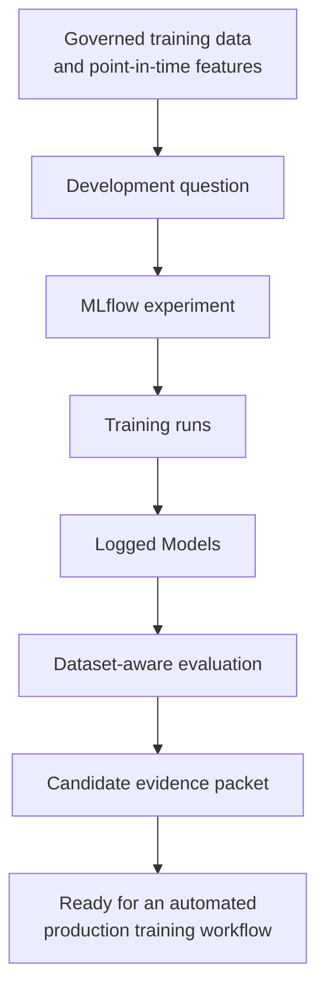
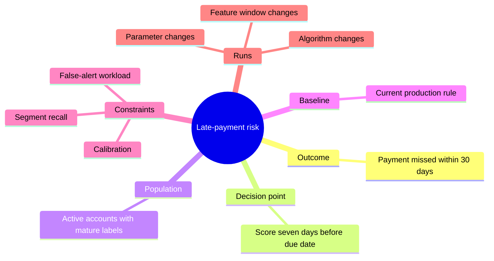
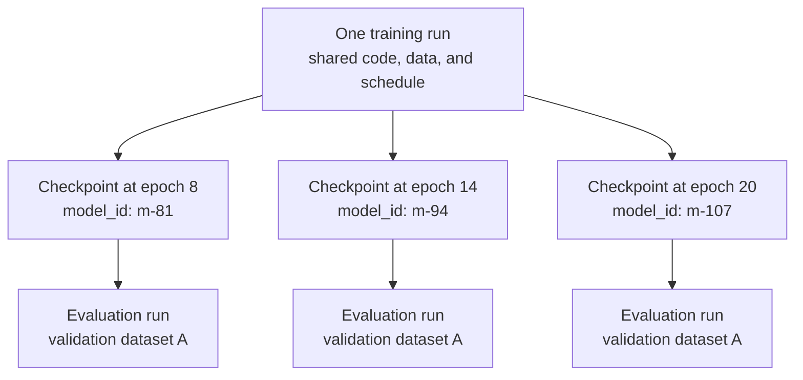
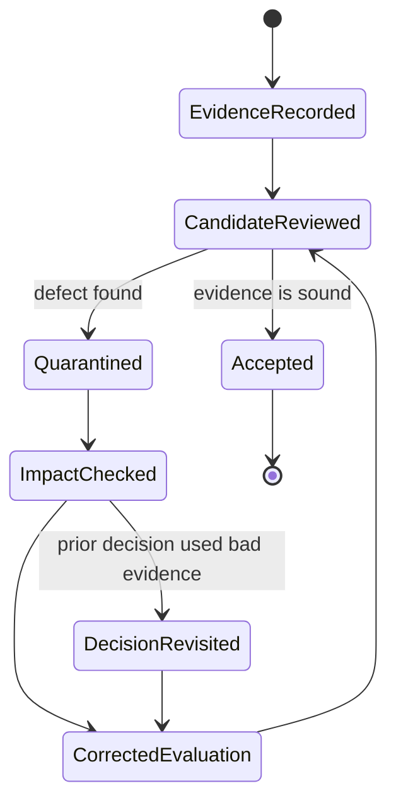
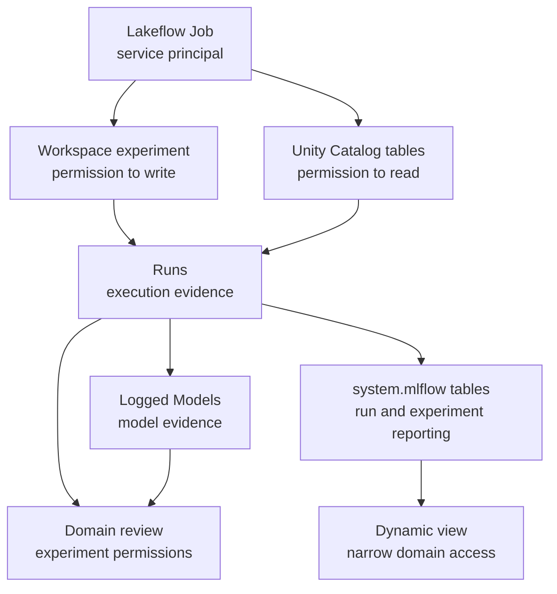

## Table of Contents

1. [What MLflow 3 Experiments, Logged Models, And Evaluation Mean](#what-mlflow-3-experiments-logged-models-and-evaluation-mean)
2. [Understand The Five Records MLflow Keeps Around A Model](#understand-the-five-records-mlflow-keeps-around-a-model)
3. [Design Experiments Around Questions](#design-experiments-around-questions)
4. [Give Every Trained Model Its Own Identity](#give-every-trained-model-its-own-identity)
5. [Compare Models On The Same Data And Evaluation Rules](#compare-models-on-the-same-data-and-evaluation-rules)
6. [Evaluate How The Model Will Support A Real Decision](#evaluate-how-the-model-will-support-a-real-decision)
7. [Gather The Information Needed To Review A Trained Model](#gather-the-information-needed-to-review-a-trained-model)
8. [Correct Faulty Evaluation Evidence Without Rewriting History](#correct-faulty-evaluation-evidence-without-rewriting-history)
9. [Operate Shared Experiments On Databricks](#operate-shared-experiments-on-databricks)
10. [Follow The Complete MLflow Evidence Path](#follow-the-complete-mlflow-evidence-path)
11. [References](#references)

## What MLflow 3 Experiments, Logged Models, And Evaluation Mean
<!-- section-summary: MLflow records the path from a model-development question to a specific trained artifact and the evidence used to judge it. -->

At a high level, **MLflow records the history of model development**. It keeps the settings, results, data references, and trained model from each attempt so the team can inspect and compare them later.

Start with a small classification task. The Iris dataset contains measurements from three flower species. A logistic-regression model learns from four measurements and predicts the species. Without tracking, the notebook can train the model and print an accuracy score, yet the result remains attached to that notebook session.

The following example creates a named MLflow experiment, enables scikit-learn autologging, and trains the model in an MLflow run. For now, think of the experiment as the home for related attempts and the run as the record of this particular attempt. After the code finishes, the Runs view should show `logistic-regression-baseline` with its parameters and metrics. The Models tab should show the autologged model named `model`.

```python
import mlflow
import mlflow.sklearn
from sklearn.datasets import load_iris
from sklearn.linear_model import LogisticRegression
from sklearn.metrics import accuracy_score
from sklearn.model_selection import train_test_split

X, y = load_iris(return_X_y=True)
X_train, X_test, y_train, y_test = train_test_split(
    X,
    y,
    test_size=0.2,
    stratify=y,
    random_state=42,
)

mlflow.set_experiment("/Shared/ml/iris-classification")
mlflow.sklearn.autolog()

with mlflow.start_run(run_name="logistic-regression-baseline"):
    model = LogisticRegression(
        solver="lbfgs",
        max_iter=1000,
        random_state=42,
    )
    model.fit(X_train, y_train)
    predictions = model.predict(X_test)
    mlflow.log_metric("test_accuracy", accuracy_score(y_test, predictions))
```

The training code remains ordinary scikit-learn. Autologging observes `fit()` and records the estimator parameters, training metrics, and fitted model. The explicit `test_accuracy` line adds the result from the held-out test rows.

That record answers questions the printed score cannot answer. A teammate can identify the solver and random seed, compare this run with another attempt, and load the recorded model after the notebook session has ended.

A production project records more context. It needs governed dataset versions and code identity so the result can be reproduced. Segment results and an acceptance policy explain whether the model is suitable for the intended decision.

MLflow divides that evidence into connected records and activities. **An experiment groups related attempts. A run records one execution. A Logged Model identifies one trained model. A dataset describes the evidence source. Evaluation applies the model to agreed data and writes its metrics and artifacts into a run.**


*The experiment gives related work a home. Runs preserve individual executions. Logged Models give trained artifacts their own identities, while dataset-aware evaluation explains what each result was measured against.*

MLflow 3 makes the model identity especially important. Earlier workflows often treated the model as a file tucked inside a run. A run might train several checkpoints, and later evaluation might happen in a different run. Following one model through that history could become awkward.

A **Logged Model** gives the model a durable ID of its own. Training runs can produce it. Evaluation runs can consume it. Metrics can be associated with both that model ID and a particular dataset. Deep-learning checkpoints can each receive a separate identity even though one training run created all of them.

The workflow below focuses on the evidence between trustworthy features and production training:



MLflow provides the structure that lets a team record model-development decisions and inspect them later. Feature meaning, production representativeness, and the business cost of an error still come from domain knowledge and deliberate review.

## Understand The Five Records MLflow Keeps Around A Model
<!-- section-summary: An experiment, run, Logged Model, dataset, and evaluation answer different questions, and together they make a model result understandable. -->

The Iris example already contains several kinds of evidence: a place that groups the work, one recorded execution, one fitted model, training data, and a held-out test result. MLflow separates these responsibilities because they have different lifetimes and answer different questions.

Experiments, runs, Logged Models, and datasets are tracked records. Evaluation works slightly differently. It is the activity that tests a model; its durable metrics, plots, dataset references, and policy tags live in an evaluation run. The Python `EvaluationResult` returned by MLflow is a convenient in-memory view of those results rather than a separately identified lifecycle object.

### Group Related Model-Development Runs In An Experiment

An **experiment** is a container for related model-development work. It tells MLflow which runs belong to the same problem and should be compared together. In the example, `/Shared/ml/iris-classification` can hold the baseline run, a regularized variant, and a tree-based alternative without mixing them with an unrelated forecasting project.

A useful experiment scope is stable enough to survive many training attempts. For example:

- `late-payment-risk` can contain logistic regression, gradient boosting, and calibrated tree models for the same decision;
- `weekly-demand-forecast` can contain different feature windows and forecasting algorithms for the same forecast horizon;
- `product-ranking-relevance` can contain ranking losses and parameter searches evaluated against the same relevance policy.

An experiment named after a temporary notebook or a single parameter value usually has the wrong scope. It fragments one investigation across many containers and makes comparison harder.

### Record One Execution As A Run

A **run** is one execution of code inside an experiment. The `logistic-regression-baseline` run records what happened during that particular fit: its parameter values, metrics, model output, time, status, and source context.

A run can record:

- parameters such as tree depth, learning rate, and random seed;
- metrics collected during training or evaluation;
- tags such as code revision, owner, purpose, and environment;
- input datasets;
- artifacts such as plots, reports, and model files;
- start time, duration, status, and source information.

If two runs use the same code and parameter values but read different table versions, they are different attempts. If one run fails halfway through training, that failure is also useful evidence. It can reveal an invalid parameter range, memory limit, or data problem.

### Give Each Trained Model Its Own Logged Model Record

A **Logged Model** is MLflow 3's first-class record for a model artifact. It identifies the exact trained model under discussion. In the example, it refers to the fitted logistic-regression model rather than the experiment as a whole or the Python process that trained it.

This distinction solves a common ambiguity. One run can train multiple artifacts. A deep-learning run may save checkpoints at epochs 5, 10, and 15. A training script may fit a baseline and a candidate. A single run ID cannot identify which output later received an evaluation score.

Each Logged Model has its own `model_id`. MLflow can link parameters, metrics, artifacts, inputs, outputs, and later evaluation work to that ID. The model can be loaded through a URI such as `models:/<model_id>` without pretending that it is already an approved registry version.

### Record The Data Used For Training Or Evaluation

An MLflow **dataset** is a tracked description of data used for training or evaluation. It can record a name, source, digest, schema, profile, target column, and context such as `training` or `validation`.

The dataset record usually points to data rather than copying the full dataset into MLflow. A Delta-backed dataset can include the Unity Catalog table name and table version. That combination connects the experiment evidence to the governed data introduced earlier in this module.

The dataset digest is a compact fingerprint. It helps detect that two runs used different inputs, although it does not replace a durable Delta version or retention policy. Exact reconstruction still depends on the source data remaining available.

### Record How The Model Performed

**Evaluation** applies a model to agreed data and records the resulting metrics and diagnostics in a run. It explains how that model behaved on a particular population under a particular evaluation policy. The Iris example logs one held-out accuracy value; production evaluation adds the threshold, segments, baseline, diagnostics, and domain-specific costs needed for a real decision.

For a classifier, MLflow can produce precision, recall, F1, ROC AUC, a confusion matrix, and other artifacts. A regression evaluation can produce MAE, RMSE, R², and residual plots. The team can add domain metrics, segment reports, and acceptance thresholds.

Evaluation is broader than calculating one metric. It includes the dataset, label definition, decision threshold, baseline, segments, diagnostics, and interpretation. Those pieces explain whether an observed improvement is real and whether it matters.

| Evidence concept | The question it answers | Its durable reference |
|---|---|---|
| Experiment | Which attempts belong to the same investigation? | Experiment ID; the workspace path is a renameable location |
| Run | What happened during one execution? | Run ID |
| Logged Model | Which trained artifact are we discussing? | Model ID |
| Dataset | Which data produced or tested the result? | Name, digest, and source version |
| Evaluation | How did the model behave under an agreed test? | Evaluation run, metrics, artifacts, and policy tags |

The table is a map of responsibilities. The important point sits underneath it: **a production candidate needs all five answers**. A run without a model identity leaves the artifact ambiguous. A model without dataset context leaves the score ambiguous. An experiment full of metrics without a stable question leaves the comparison ambiguous.

## Design Experiments Around Questions
<!-- section-summary: A well-designed experiment groups attempts that answer the same decision question and gives every run enough context to be compared later. -->

Model development often begins as exploration. A data scientist tries a simple baseline, changes a feature window, tests a new algorithm, and investigates surprising errors. MLflow should preserve that learning without turning every notebook cell into permanent clutter.

The first design decision is the **question** the experiment is meant to answer.

“Try XGBoost” is an activity. “Can a model predict late payment seven days earlier while keeping false alerts below the operations team's limit?” is an investigation. The second form gives the experiment a target population, outcome, horizon, and practical constraint.

### Keep The Experiment Stable And Record Variations In Runs

Parameters, random seeds, feature sets, and algorithms normally belong to runs. The experiment should remain stable while those variations change.



This structure keeps the theory at the centre. Individual model runs become evidence for the same decision rather than unrelated demonstrations.

### Use Workspace Experiments For Shared Or Scheduled Work

Databricks supports **workspace experiments** and **notebook experiments**.

A notebook experiment is tied to one notebook and is convenient during early personal exploration. Databricks can create it automatically after a notebook starts an MLflow run without an explicit experiment.

A workspace experiment has its own workspace path and can receive runs from different notebooks, Git-backed code, and jobs. It is the stronger default once several people collaborate or automation will repeat the work.

The next snippet assumes that the training frame, configuration, and Git commit have already been prepared. It sends the attempt to a shared workspace experiment, trains inside one named run, and attaches searchable context. The resulting run appears under `/Shared/ml/risk/late-payment` with its name and tags.

```python
import mlflow

mlflow.set_experiment("/Shared/ml/risk/late-payment")

with mlflow.start_run(
    run_name="gradient-boosting-feature-window-30d",
    tags={
        "purpose": "candidate-development",
        "owner_team": "risk-ml",
        "code_revision": git_commit,
        "label_policy": "missed-payment-within-30d-v2",
    },
):
    model = train_model(training_frame, config)
```

The path gives related runs a shared home. The run name gives a human a quick clue, while tags preserve values that need to be filtered or audited. The Git commit remains the stronger code identity.

For scheduled notebook tasks, Databricks recommends an explicit workspace experiment. A notebook experiment can follow the notebook's lifecycle and permissions, which makes it a fragile home for long-running production evidence.

### Start With Autologging And Add Domain-Specific Evidence

Manual tracking is easy to apply inconsistently. One run records the learning rate and forgets the random seed. Another records the final metric and omits the input schema. A third logs a model file whose dependency versions are unclear. The comparison page may still look complete even though the evidence underneath each row differs.

**Autologging asks the training framework to record its common evidence automatically.** MLflow integrations can capture familiar parameters, training metrics, signatures, and model artifacts without requiring a separate logging call for every field.

Databricks enables autologging automatically for many supported libraries in interactive Python notebooks. Serverless compute requires an explicit `mlflow.autolog()` call.

This automatic baseline reduces forgotten boilerplate. The team still adds the meaning that a training library cannot infer:

- the positive class means a missed payment rather than a successful one;
- a validation table represents mature labels through a specific cutoff;
- a false alert consumes ten minutes of an operations analyst's time;
- one geographic segment requires a separate recall floor;
- the model is exploratory and must never enter a release workflow.

A practical pattern is to enable autologging and add the missing context deliberately. The snippet assumes a point-in-time training dataset plus prepared training and validation arrays. It records the training input, domain parameters, validation metrics, signature, input example, and one explicitly logged model in the same run. The expected result is one source run whose evidence points to one unambiguous Logged Model.

```python
import mlflow
import mlflow.sklearn
from sklearn.ensemble import HistGradientBoostingClassifier
from sklearn.metrics import precision_score, recall_score
from mlflow.models import infer_signature

mlflow.autolog(log_models=False, exclusive=False)

with mlflow.start_run():
    mlflow.log_params({
        "prediction_horizon_days": 30,
        "decision_lead_days": 7,
        "positive_class": "missed_payment",
    })
    mlflow.log_input(training_dataset, context="training")

    model = HistGradientBoostingClassifier(max_iter=300).fit(X_train, y_train)
    predictions = model.predict(X_validation)
    mlflow.log_metrics({
        "validation_precision": precision_score(y_validation, predictions),
        "validation_recall": recall_score(y_validation, predictions),
    })

    signature_sample = X_validation.head(20)
    model_info = mlflow.sklearn.log_model(
        sk_model=model,
        name="late_payment_classifier",
        params={
            "algorithm": "hist_gradient_boosting",
            "max_iter": 300,
        },
        signature=infer_signature(
            signature_sample,
            model.predict(signature_sample),
        ),
        input_example=X_validation.head(3),
    )
```

`log_models=False` leaves model logging to the explicit call at the end of the same run. The training parameters, datasets, metrics, and Logged Model therefore share one source run. Teams can choose another autologging configuration, although the final evidence should still contain one unambiguous candidate identity.

## Give Every Trained Model Its Own Identity
<!-- section-summary: A Logged Model separates the identity of a trained artifact from the execution that produced it and preserves the information needed to load and inspect it. -->

The difference between a run and a Logged Model deserves careful attention because it is one of the largest changes in MLflow 3.

Imagine a deep-learning run that trains for twenty epochs and saves three promising checkpoints. The run records the shared training process: dataset, optimizer, learning-rate schedule, GPU environment, and metric history. The checkpoints are different trained states. Each can make different predictions and deserve separate evaluation.

The relationship looks like this:



The run answers “how did training execute?” Each model ID answers “which checkpoint produced these predictions?”

### Log The Model Interface And Dependencies With The Weights

An artifact needs more than weights. A reviewer or inference job also needs to understand the expected input and output.

An **MLflow model signature** records the input and output schema. An **input example** shows a small, concrete request shape. The selected MLflow flavor explains how a downstream tool should load the model. MLflow also records environment files such as `requirements.txt` and `conda.yaml`.

The previous training call returned `model_info`, which contains the new model ID. The following code retrieves that model record, loads the packaged model through its `models:/` URI, and scores three validation rows. Its output shows the same model ID, the parameters attached to the Logged Model, and three predictions from the reloaded artifact.

```python
logged_model = mlflow.get_logged_model(model_info.model_id)
reloaded_model = mlflow.pyfunc.load_model(
    f"models:/{logged_model.model_id}"
)

print(logged_model.model_id)
print(logged_model.params)
print(reloaded_model.predict(X_validation.head(3)))
```

The training run created `model_info` through MLflow 3's `name=` model-logging API. The older `artifact_path=` form remains visible in older examples but is deprecated for this workflow. The later code retrieves the same first-class model record and loads it by model ID.

The `log_model()` call in the training run does four important things:

1. stores the trained model through a standard MLflow flavor;
2. gives the Logged Model a searchable name;
3. gives the artifact a unique model ID;
4. records the request and response contract needed for later validation.

The environment files are a starting point for reproducibility. Teams still pin the project environment in source control and test loading in clean compute. Automatically inferred dependencies can miss packages imported dynamically, private wheels, system libraries, or external services.

### Check MLflow Support For The Model Framework

Most current MLflow flavors create the MLflow 3 Logged Model object. Databricks documents an important exception: `mlflow.spark.log_model()` continues to use the older run-artifact path and therefore lacks the new Logged Model object.

That limitation changes the evidence design for Spark MLlib models. The run can still store and load the model. Model-ID-based comparison is unavailable because the chosen flavor has not created a model ID. The compatibility check belongs in the training template and upgrade test so the team discovers it before release review.

## Compare Models On The Same Data And Evaluation Rules
<!-- section-summary: A model metric becomes comparable only after the team fixes the evaluation dataset, label policy, split, time period, and calculation rules. -->

At a high level, **a fair model comparison asks two candidates the same question**. The evaluation dataset and policy define that question: which population, time period, labels, prediction threshold, and metric calculation are being used.

Two scores may look comparable even though one of those conditions has changed.

Suppose model A has an F1 score of `0.76` and model B has an F1 score of `0.81`. Model B appears stronger. Then the team discovers:

- model A was evaluated on all customers from the latest quarter;
- model B was evaluated on a balanced sample from an earlier period;
- model B's sample contains far fewer difficult new accounts;
- the positive-class threshold also changed.

The numerical comparison has collapsed. The models were tested under different conditions.


*Models become comparable after they share the evaluation population, source version, label policy, split, prediction threshold, and metric calculation. A larger score from a less demanding dataset can mislead a reviewer.*

### Record The Exact Evaluation Dataset

MLflow dataset tracking can record a dataset name, digest, source, schema, profile, target column, and usage context. On Databricks, a Spark dataset can refer to a Unity Catalog Delta table and a specific table version.

The next example starts with two Spark DataFrames loaded from pinned Delta table versions. It wraps each frame in an MLflow dataset and logs their different roles to one run. The run then exposes the training and validation sources, versions, digests, target column, and usage contexts beside the model evidence.

```python
training_dataset = mlflow.data.from_spark(
    training_df,
    table_name="prod_ml.training.late_payment_examples",
    version="842",
    targets="label",
    name="late-payment-train",
)

validation_dataset = mlflow.data.from_spark(
    validation_df,
    table_name="prod_ml.evaluation.late_payment_validation",
    version="119",
    targets="label",
    name="late-payment-validation",
)

with mlflow.start_run():
    mlflow.log_input(training_dataset, context="training")
    mlflow.log_input(validation_dataset, context="validation")
```

The table version identifies the governed source state. The dataset digest helps distinguish the frame actually passed to MLflow. If code filters or transforms the table after reading it, the run should also record that query or transformation revision.

The word **validation** needs a stable meaning. A useful contract records:

- the population included and excluded;
- the time interval;
- the label definition and maturity cutoff;
- the sampling policy;
- the split method;
- the feature cutoff policy;
- the prediction threshold or ranking cutoff;
- any weights used in metric calculation.

These rules are part of the evaluation evidence. A table named `validation_latest` gives none of them and changes meaning over time.

### Link Each Metric To A Model And Dataset

MLflow 3 can associate a metric with a Logged Model and a dataset. The resulting record states that model `m-94` achieved this metric on the `late-payment-validation` dataset with this digest.

Here, `recall_at_capacity` and `precision_at_capacity` have already been calculated from predictions at the approved review limit. The call stores both values against the candidate's model ID and the tracked validation dataset. A later search can therefore distinguish these metrics from values produced by another model or another dataset.

```python
mlflow.log_metrics(
    metrics={
        "recall_at_review_capacity": recall_at_capacity,
        "precision_at_review_capacity": precision_at_capacity,
    },
    model_id=model_info.model_id,
    dataset=validation_dataset,
)
```

That association supports dataset-aware search. A team can ask for models above a recall threshold on the approved validation dataset instead of finding a metric with the right name from an unknown source.

A biased or leaky validation set can be tracked perfectly. Dataset appropriateness comes from combining MLflow evidence with the governed-data, point-in-time, and label-maturity controls established earlier.

## Evaluate How The Model Will Support A Real Decision
<!-- section-summary: Production evaluation tests the model under the threshold, population, costs, segments, and operating constraints of the real decision. -->

At a high level, **model evaluation asks whether a candidate can support an acceptable real-world decision**. Algorithm metrics describe part of that answer. The production evaluation also brings in the decision threshold, error costs, capacity, important segments, and operating limits.

A fraud classifier may rank risky transactions well and still overwhelm investigators after its threshold produces too many alerts. A demand forecast may have a reasonable average error while consistently underestimating a high-value product category. A churn model may improve overall recall while losing recall for new customers.

In essence, **the evaluation should recreate the decision the model will support, not merely score the mathematical function in isolation**.

### Start With The Task And The Cost Of Mistakes

For binary classification, a confusion matrix separates four outcomes:

| Outcome | Meaning | Possible operational effect |
|---|---|---|
| True positive | The model flags a real positive case | A useful intervention |
| False positive | The model flags a negative case | Unnecessary review or customer friction |
| False negative | The model misses a positive case | Lost opportunity, risk, or harm |
| True negative | The model leaves a negative case alone | Normal processing |

Precision, recall, F1, and ROC AUC summarize different parts of this behaviour. None of them chooses the decision policy for the team.

Consider a review team that can investigate 2,000 alerts per day. A threshold that creates 8,000 alerts cannot be rescued by a high recall score. A stronger evaluation measures precision and recall at the real review capacity, estimates the missed-case cost, and checks whether alert volume stays inside the operational limit.

Regression has the same issue in another form. MAE gives the average absolute error. It may hide a strong under-forecasting bias on peak days. The evaluation should add residual plots, error by horizon, error by high-value segment, and the business cost of over- and under-prediction.

### Use MLflow's Evaluator For Repeatable Diagnostics

For classic classification and regression models, `mlflow.models.evaluate()` can calculate built-in metrics and produce artifacts such as confusion matrices, ROC curves, precision-recall curves, residual plots, and evaluation tables.

The evaluator needs the candidate's model URI and the approved validation dataset created earlier. This run records the evaluation policy, generates standard classifier diagnostics, links them to the model ID, and checks two acceptance floors. The run finishes with metrics and plots after a pass; a missed floor raises a validation failure for the calling workflow to handle.

```python
from mlflow.models import MetricThreshold

with mlflow.start_run(
    run_name="evaluate-candidate-on-approved-validation",
    tags={
        "evaluation_policy": "late-payment-v3",
        "decision_threshold": "review-capacity-2000",
    },
):
    mlflow.log_input(validation_dataset, context="evaluation")

    result = mlflow.models.evaluate(
        model_info.model_uri,
        validation_dataset,
        model_type="classifier",
        model_id=model_info.model_id,
    )

    mlflow.validate_evaluation_results(
        candidate_result=result,
        validation_thresholds={
            "recall_score": MetricThreshold(
                threshold=0.78,
                greater_is_better=True,
            ),
            "precision_score": MetricThreshold(
                threshold=0.35,
                greater_is_better=True,
            ),
        },
    )
```

Passing `validation_dataset` preserves its governed source, version, digest, and target metadata in the evaluation evidence. The explicit model ID links the generated metrics and artifacts to the same Logged Model.

The evaluator generates consistent diagnostics. `validate_evaluation_results()` applies explicit thresholds and fails if the candidate misses them. Current MLflow separates evaluation from threshold validation, so older examples that pass validation thresholds directly to `evaluate()` should be updated.

For Spark DataFrame evaluation, the default evaluator currently uses at most 10,000 rows. A compact, approved evaluation sample can fit that path. A release decision that depends on the full distributed population should calculate its predictions and acceptance metrics with Spark, then log those results against the same model ID and dataset record.

The numbers in the snippet are illustrative. A real threshold comes from the risk, capacity, baseline, and policy of the application. Teams usually store the approved threshold policy in versioned configuration so changing the code does not quietly change the release rule.

### Compare The Model With A Baseline And An Absolute Threshold

An absolute floor answers, “Is this model acceptable at all?” A baseline comparison answers, “Is this candidate a worthwhile change?”

Useful baselines include:

- the current production model;
- a simple statistical or rules-based model;
- the previous approved candidate;
- a seasonal naïve forecast;
- a human or operational process already making the decision.

A candidate can pass an absolute metric floor and still offer no improvement over production. It can also improve one metric while adding latency, cost, instability, or segment harm. The evaluation record should make those trade-offs visible.

### Inspect Segments And Error Examples

Overall averages combine groups with different difficulty, frequency, and impact. Segment evaluation asks whether the improvement survives in the places that matter.

For a payment model, segments might include account age, region, payment method, and recent activity band. For demand forecasting, they might include product category, horizon, store size, and promotion status. The team chooses segments from product risk and data behaviour rather than generating hundreds of arbitrary slices.

A practical review usually includes:

1. the overall metric and baseline comparison;
2. a small set of pre-agreed high-risk segments;
3. confidence intervals or repeated-split evidence where variance matters;
4. calibration or residual diagnostics;
5. representative false positives and false negatives;
6. data coverage, missingness, and out-of-range rates;
7. inference cost and latency checks appropriate to the candidate.

MLflow can log the segment table and plots as artifacts. Aggregate segment metrics can also be logged with clear names. If a segment carries a release floor, the validation code should calculate and enforce it explicitly rather than relying on a reviewer to notice a bad chart.

### Use Different Evaluation Methods For Predictive ML And GenAI

Imagine applying a classifier evaluator to a support-answering agent. Precision and recall expect known labels and predictions. The agent needs a different kind of evidence: whether the answer followed the supplied context, satisfied a rubric, avoided unsafe content, and completed a multi-step task.

These are two different evaluation jobs. MLflow represents them through separate systems:

- `mlflow.models.evaluate()` and `EvaluationMetric` objects serve classic ML and deep-learning evaluation;
- `mlflow.genai.evaluate()` and `Scorer` objects serve GenAI and agent evaluation.

Classic metric objects receive predictions and targets in the classic evaluator. GenAI scorers can inspect inputs, outputs, expectations, traces, and feedback. Their objects use separate APIs because their evidence has a different shape. A shared template should route each workload to the correct evaluator and keep the resulting acceptance policy explicit.

## Gather The Information Needed To Review A Trained Model
<!-- section-summary: A candidate evidence packet gathers the model identity, data lineage, environment, evaluation results, limitations, and ownership needed for an informed next decision. -->

At a high level, **a candidate evidence packet is the handoff record for a trained model**. It gathers the information that would otherwise remain scattered across a notebook, run page, data catalog, Git repository, and review conversation.

The packet should give another engineer enough evidence to understand, reproduce, challenge, and continue with the candidate. It is a conceptual bundle rather than one special MLflow object. MLflow, Unity Catalog, Git, and the delivery system each preserve part of it.

A useful packet contains:

- **Question and intended decision:** prediction target, horizon, population, and product action.
- **Model identity:** Logged Model ID, model name, flavor, signature, and input example.
- **Training execution:** run ID, parameters, random seed, status, and compute context.
- **Code identity:** repository and immutable commit.
- **Data identity:** Unity Catalog tables, Delta versions, dataset digests, split policy, feature definitions, and label policy.
- **Environment:** pinned project dependencies, model requirements, runtime type, and any external dependencies.
- **Evaluation:** baseline, overall metrics, segments, plots, thresholds, and evaluation-policy version.
- **Operational evidence:** estimated inference latency, memory, throughput, and cost where relevant.
- **Limitations:** known weak populations, missing tests, unstable metrics, and unsupported input ranges.
- **Ownership:** responsible team, reviewer, and investigation links.

The packet is intentionally broader than a leaderboard row. A model with the best F1 score may have an unacceptable memory footprint. A candidate with a small average improvement may be valuable because it removes a serious failure in one high-risk segment. Reviewers need the whole shape of the decision.

### Find The Model Record And Inspect Its Evidence

MLflow 3 can search Logged Models by model attributes, parameters, tags, and dataset-associated metrics.

The next query uses the approved validation dataset's name and digest as part of the filter. It returns models that reached the recall floor on that exact evidence and orders them by the same dataset-specific metric. The result is a shortlist for review, not an approval decision.

```python
candidates = mlflow.search_logged_models(
    filter_string=(
        "model_name = 'late_payment_classifier' "
        "AND metrics.recall_at_review_capacity >= 0.78"
    ),
    datasets=[{
        "dataset_name": validation_dataset.name,
        "dataset_digest": validation_dataset.digest,
    }],
    order_by=[{
        "field_name": "metrics.recall_at_review_capacity",
        "dataset_name": validation_dataset.name,
        "dataset_digest": validation_dataset.digest,
    }],
)
```

The reviewer still examines precision, segment results, plots, limitations, and the difference from the production baseline.

The Databricks experiment page provides a Models tab for the same work. It helps people compare model parameters and metrics visually. Programmatic search is better for repeatable gates; the UI is better for exploration and review.

### Keep A Trained Model Separate From An Approved Release

A Logged Model records a trained artifact and its evidence. A registered model version in Unity Catalog represents a later lifecycle step: a governed model has entered the shared release system.

This separation is healthy. Development can produce many Logged Models. Only candidates that pass the required evaluation should move toward registration, review, aliases, and deployment. Logging a model should never silently mean that production approval has happened.

## Correct Faulty Evaluation Evidence Without Rewriting History
<!-- section-summary: After an evaluation defect is found, preserve the original record, mark its status, create corrected evidence, and trace any decisions that depended on it. -->

At a high level, **evidence repair corrects a faulty model claim while preserving the history of how the claim was produced**. This matters because an evaluation defect may already have influenced a candidate review, a registry action, or a production release.

Experiment evidence can be wrong even though the code ran successfully.

Common failures include:

- a validation query accidentally overlaps the training period;
- labels have not fully matured;
- a point-in-time join leaks future feature values;
- the positive and negative class labels are reversed;
- sample weights are missing from one candidate;
- a metric uses the wrong averaging rule;
- the decision threshold was tuned on the test set;
- a table alias points to a newer dataset version than the run description claims.

Deleting the original run hides how the mistake happened. Editing the old metric in place makes the audit trail harder to trust. The repair should preserve both the faulty evidence and the correction.



A practical repair follows this order:

1. **Contain the claim.** Stop the affected model from progressing and tag the run, model, or review record as invalid or quarantined.
2. **Preserve the original evidence.** Keep the run ID, model ID, dataset references, artifacts, and timestamps available for investigation.
3. **Identify the evidence boundary.** Determine which runs, Logged Models, reports, and release decisions used the faulty dataset or metric.
4. **Correct the source problem.** Fix the query, label policy, point-in-time logic, metric implementation, or configuration in version-controlled code.
5. **Create a new evaluation run.** Re-evaluate the same Logged Model if only the evaluation was wrong. Retrain and create a new Logged Model if training data or training logic was wrong.
6. **Link the correction.** Add tags or an external review record that connects the original and corrected evidence.
7. **Repeat the decision.** Apply the current acceptance policy and revisit any release that depended on the invalid result.

Consider a concrete case. A model was evaluated on outcomes that were only fourteen days mature even though the label meant “missed payment within thirty days.” Many apparent negatives had simply not had enough time to become positive.

The team tags the evaluation run `evidence_status=invalid` and records `superseded_by=<new_run_id>`. The model artifact itself may still be technically intact. After the full outcome window closes, a new evaluation run uses the same model ID, the corrected validation table version, and the same evaluation-policy version. If the original model was already registered or deployed, the release owner reopens that decision using the corrected result.

The distinction between retraining and re-evaluation saves time:

- a bad **evaluation dataset or metric** usually requires a new evaluation of the existing Logged Model;
- bad **training data, features, code, or parameters** requires a new training run and a new Logged Model.

## Operate Shared Experiments On Databricks
<!-- section-summary: Shared MLflow evidence needs stable locations, controlled identities, lifecycle rules, and reporting paths that match the team's collaboration model. -->

The first few MLflow runs are easy to manage. Problems appear after several teams, scheduled jobs, and thousands of runs share a workspace.

The production path usually crosses two permission systems and one reporting boundary:



The job identity needs permission to write MLflow evidence and separate permission to read governed data. Domain reviewers use the experiment permissions. Platform reporting uses a broader system-table permission path, so it should expose narrower views to ordinary teams.

### Give Production Code An Explicit Experiment Path

Every scheduled training or evaluation task should call `mlflow.set_experiment()` with an approved workspace experiment path. Relying on whichever notebook experiment happens to be active makes evidence placement depend on execution context.

The naming convention should reveal the owner and purpose without encoding every parameter:

```text
/Shared/ml/<domain>/<decision>
/Shared/ml/risk/late-payment
/Shared/ml/supply/weekly-demand
```

Development and production evidence may use separate experiments if their permissions, retention, or operational meaning differ. Tags can then connect the related question, codebase, and evaluation policy across environments.

### Use Service Identities For Scheduled Writers

Interactive users need permission to explore and compare. Scheduled jobs need stable service identities with permission to write only to their intended experiments and read the required Unity Catalog inputs.

This separation helps answer who produced a run. It also prevents a personal account change from breaking production tracking. Experiment permissions protect MLflow records, while Unity Catalog permissions protect the datasets and governed model assets. The two permission systems serve different objects and need separate review.

### Set Retention And Cleanup Rules For Experiment Evidence

Runs, models, plots, and checkpoints consume storage and make search noisy. Cleanup should follow an explicit evidence policy:

- keep evidence for registered, released, incident-related, or regulated models according to the required retention period;
- keep failed runs long enough to investigate recurring problems;
- remove disposable parameter-search artifacts through an automated rule after useful summaries are retained;
- preserve data source versions for as long as reproducibility claims require them;
- prevent deletion of an experiment from becoming the casual way to tidy a workspace.

Notebook experiments deserve extra care because their lifecycle is tied to the notebook. Shared and scheduled evidence belongs in workspace experiments.

### Use MLflow System Tables For Workspace-Wide Reporting

The experiment UI works well for investigating one experiment. A platform team faces broader questions: Which scheduled experiments fail most often? Which domains create unusually expensive runs? Are production jobs still writing evidence to personal notebook experiments?

Answering those questions one workspace at a time is slow and produces inconsistent reports. Databricks exposes MLflow experiment and run metadata through `system.mlflow` tables so privileged platform users can analyse it with SQL and build account-level dashboards.

These tables are a preview feature. Authorized readers can see broad MLflow metadata across workspaces in a region, so the access design deserves the same care as other central operational data:

- grant access to a small platform group;
- expose narrower dynamic views for domain teams;
- keep sensitive parameter and tag values out of broadly shared dashboards;
- avoid making a preview table the only source for a critical release gate;
- verify retention and coverage before using it for historical reporting.

Only account administrators have access by default. An administrator can grant Unity Catalog access to other users, and those grants do not inherit the permissions from individual experiments. Anyone who can read the base MLflow system tables can see metadata across the account's workspaces in that region. Dynamic views provide a safer way to narrow that scope.

Current MLflow system-table retention is 180 days. A compliance or investigation requirement that reaches further needs its own governed retention design. The experiment UI and MLflow APIs remain the direct surfaces for model-development work. System tables serve platform-level reporting rather than replacing the primary tracking records.

### Understand What MLflow Does Not Manage

MLflow is a strong default on Databricks because it connects naturally to Databricks compute, Delta data, Unity Catalog models, jobs, and serving. An organisation may also use Weights & Biases for experiment collaboration or another evaluation platform for specialised workloads.

The tool choice can change. The responsibilities remain:

- identify the investigation;
- record every attempt;
- identify each model artifact;
- identify the training and evaluation data;
- evaluate the real decision;
- preserve limitations and ownership;
- automate acceptance without erasing human review.

A second tool should solve a clear collaboration, governance, or evaluation need. Duplicating every run into several systems without an ownership model usually creates conflicting sources of truth.

## Follow The Complete MLflow Evidence Path
<!-- section-summary: Trustworthy model development moves from a stable question through recorded attempts and model identities to dataset-aware evaluation and a reviewable candidate. -->

At a high level, the complete path turns exploratory model development into a connected evidence trail. It starts with a clear decision question and ends with a candidate another engineer can understand, reproduce, and challenge.

The question sets the target, prediction moment, population, baseline, and practical constraints. A workspace experiment then gives that continuing investigation a stable home. Each run records one attempt to answer it, including the code identity, parameters, data inputs, and execution result.

Training produces a more specific object: the model that will actually make predictions. Its Logged Model ID, signature, input example, environment, and artifacts let later evaluation work refer to that exact output. Training and validation datasets add the governed source versions and digests needed to understand what the model learned from and what tested it.

Evaluation reconnects the artifact to the original decision. Overall metrics, important segments, diagnostic plots, operating limits, baselines, and acceptance thresholds show where the candidate helps and where it remains weak. The candidate evidence packet gathers those findings with ownership and limitations so the next reviewer can follow the reasoning.

If part of the evidence later proves faulty, the original run remains available. A corrected training or evaluation run supersedes the bad claim and links back to it. That repair path preserves trust because the history explains both the mistake and the correction.


*A reviewer can assess the candidate after its question, execution, artifact identity, data, evaluation policy, diagnostics, and limitations form one connected evidence trail.*

This is the handoff from model exploration to production engineering. The candidate now has a durable identity, an explainable evaluation, and enough evidence for an automated training workflow and later release review to continue safely.

## References

- [MLflow experiment tracking](https://mlflow.org/docs/latest/tracking/)
- [MLflow automatic logging](https://mlflow.org/docs/latest/ml/tracking/autolog/)
- [MLflow dataset tracking](https://mlflow.org/docs/latest/dataset/)
- [MLflow classic model evaluation](https://mlflow.org/docs/latest/ml/evaluation/)
- [MLflow data Python API](https://mlflow.org/docs/latest/api_reference/python_api/mlflow.data.html)
- [Databricks: Track model development using MLflow](https://docs.databricks.com/aws/en/mlflow/tracking)
- [Databricks: Organize training runs with MLflow experiments](https://docs.databricks.com/aws/en/mlflow/experiments)
- [Databricks: Track and compare models using MLflow Logged Models](https://docs.databricks.com/aws/en/mlflow/logged-model)
- [Databricks: Log, load, and register MLflow models](https://docs.databricks.com/aws/en/mlflow/models)
- [Databricks: Get started with MLflow 3 for models](https://docs.databricks.com/aws/en/mlflow/mlflow-3-install)
- [Databricks Autologging](https://docs.databricks.com/aws/en/mlflow/databricks-autologging)
- [Databricks MLflow system tables](https://docs.databricks.com/aws/en/admin/system-tables/mlflow)
