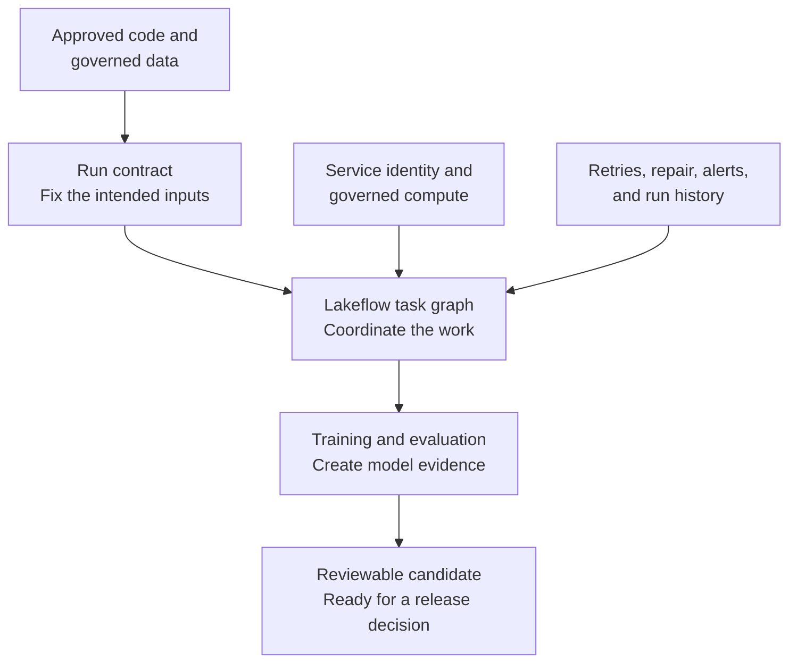
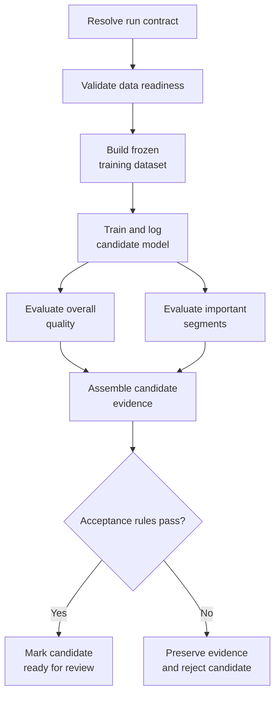
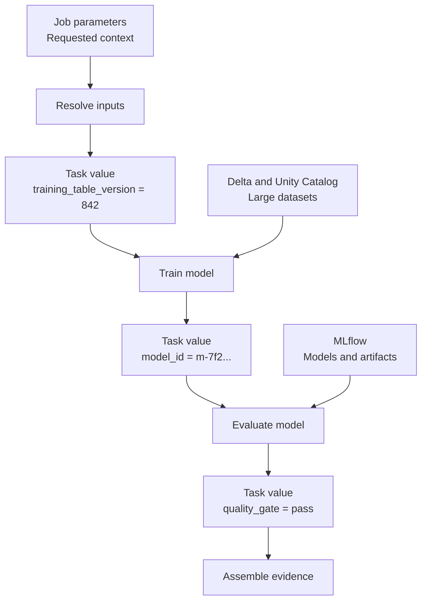
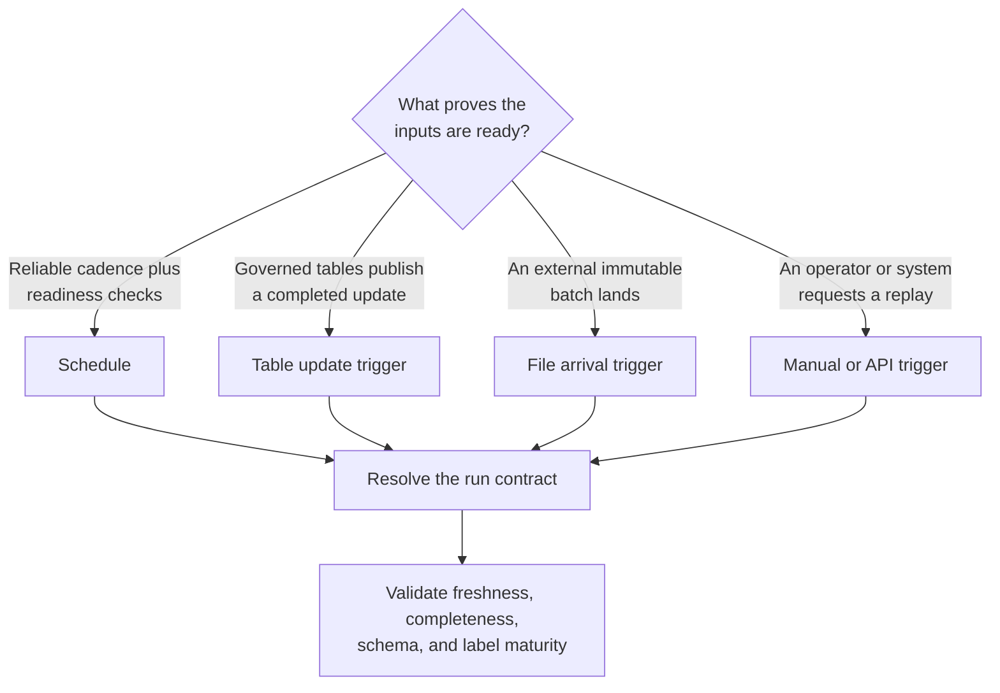
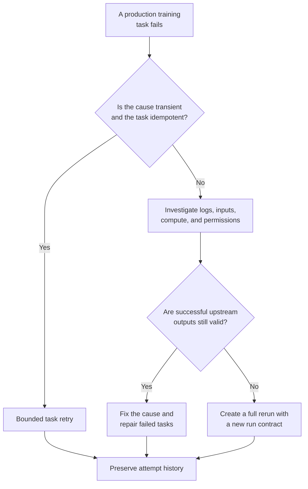

## Table of Contents

1. [What Production Training Means](#what-production-training-means)
2. [Why A Successful Notebook Is Still Only A Starting Point](#why-a-successful-notebook-is-still-only-a-starting-point)
3. [Define The Inputs And Outputs Of One Training Run](#define-the-inputs-and-outputs-of-one-training-run)
4. [Split The Training Workflow Into Visible Tasks](#split-the-training-workflow-into-visible-tasks)
5. [Pass Small Values Between Lakeflow Tasks](#pass-small-values-between-lakeflow-tasks)
6. [Control The Code, Compute, And Identity Used By Training](#control-the-code-compute-and-identity-used-by-training)
7. [Start Training Only After The Data Is Ready](#start-training-only-after-the-data-is-ready)
8. [Make Every Retried Task Safe To Repeat](#make-every-retried-task-safe-to-repeat)
9. [Recover A Failed Workflow With Repair Runs](#recover-a-failed-workflow-with-repair-runs)
10. [Record What The Training Job Did](#record-what-the-training-job-did)
11. [Choose When Lakeflow Jobs Is The Right Orchestrator](#choose-when-lakeflow-jobs-is-the-right-orchestrator)
12. [Follow The Complete Production Training Path](#follow-the-complete-production-training-path)
13. [References](#references)

## What Production Training Means
<!-- section-summary: Production training is a controlled process that turns approved code and data into a model candidate with reproducible evidence and a safe recovery path. -->

At a high level, **production training is the controlled process that creates a model candidate from approved code and approved data**. The training algorithm still matters, although the production system has a wider responsibility. It must start at the right time, use the intended inputs, run under the correct identity, preserve evidence, and recover safely if something fails halfway through.

Consider a weekly risk model. The model needs labels that mature several weeks after the original event. A person can open a notebook, choose a recent table, and click **Run all**. That may create a technically valid model. It does not prove that the label window was complete, that the same code ran in every task, or that another engineer could reproduce the result after the notebook changed.

A production training run answers those questions before the model reaches a release decision:

1. **What started this run?** A schedule, a table update, an API request, or another governed workflow.
2. **What exact inputs did it use?** Table versions, feature definitions, label cutoff, source revision, and configuration.
3. **What work happened?** Data validation, dataset construction, training, evaluation, and evidence publication.
4. **Who performed the work?** A stable service identity with deliberate permissions.
5. **What survived after the compute stopped?** MLflow evidence, job history, logs, task outputs, and governed dataset references.
6. **How can the team recover?** A retry, repair run, or clean rerun chosen according to the failure.

Lakeflow Jobs provides the orchestration layer for this process on Databricks. An **orchestrator** is the system that decides which unit of work may run, in what order, with which inputs, and what should happen after success or failure. It coordinates the work; the training code still owns feature preparation, fitting, evaluation, and output validation.

You can think of the complete system as a controlled envelope around the model code:



The run finishes with a **candidate**, meaning a trained model plus the evidence needed for review. Registration, approval, promotion, and deployment add their own controls later in the lifecycle. Keeping that boundary clear prevents a successful training task from silently becoming permission to release.


*Model code sits in the middle. The surrounding controls make its result repeatable, reviewable, and safe to operate.*

## Why A Successful Notebook Is Still Only A Starting Point
<!-- section-summary: A notebook can prove that an approach works, while production training must prove that the same process can run unattended and leave trustworthy evidence. -->

Notebooks are excellent for exploration. They let a data scientist inspect data, plot errors, change a feature, and compare another algorithm in one place. Repeated unattended runs introduce a different requirement: the session must work from explicit inputs in a clean environment.

A notebook session contains hidden state. One cell may create a variable that a later cell uses. A library may have been installed interactively. The scientist may run cells out of order or change a temporary view without restarting the session. The final metric can look correct even though a fresh run would fail.

Production automation starts from a clean environment, which exposes hidden state quickly. This is useful pressure. It encourages the team to turn the durable logic into functions, Python packages, SQL files, or other reviewed source assets with explicit inputs and outputs.

Consider one ordinary training scenario.

An exploratory notebook may:

- read `prod_ml.features.risk_training`;
- remove recent rows after the scientist notices incomplete labels;
- train three candidates;
- keep the candidate with the best validation score;
- save the model under a convenient local name.

The production version needs to make each decision explicit:

- the label cutoff is a run parameter;
- the training table version is recorded;
- data checks fail before expensive training starts;
- the selected algorithm and hyperparameters enter MLflow;
- evaluation uses a named baseline and segment rules;
- the model receives a durable identity;
- every output points back to the job run and source revision.

The notebook can remain a useful development surface. The production job should call the same tested library functions that the notebook uses. This keeps exploration comfortable without making notebook state part of the production contract.

A focused training entrypoint might be small:

```python
def train_candidate(
    training_table: str,
    training_cutoff: str,
    experiment_path: str,
) -> str:
    dataset = load_point_in_time_dataset(
        table=training_table,
        cutoff=training_cutoff,
    )
    model_id = fit_log_and_evaluate(
        dataset=dataset,
        experiment_path=experiment_path,
    )
    return model_id
```

The important feature of this code is its boundary. The table, cutoff, and experiment path arrive as inputs. The function returns a model identifier that another task can inspect. The orchestration layer can now run this logic under controlled conditions and record which values it supplied.

Moving code out of notebook cells does not require hundreds of tiny files. A small project may have one package with data validation, training, and evaluation modules. The useful separation follows production responsibilities: work that can fail independently, needs different compute, or produces evidence worth inspecting independently deserves a clear boundary.

## Define The Inputs And Outputs Of One Training Run
<!-- section-summary: A run contract fixes the data, code, configuration, identity, outputs, and acceptance rules for one production training attempt. -->

Before designing tasks, define exactly what belongs to one training attempt: the data, code, settings, execution identity, intended outputs, and acceptance rules. This definition is the **run contract**. It gives every task the same training-attempt identity. Those facts remain stable throughout the run, so the resulting evidence describes one reproducible attempt.

A useful contract covers six areas.

**Data identity** says which governed tables or feature sources the run may read. It also records the Delta versions, feature specification, prediction-time cutoff, and label-maturity cutoff. A table name alone is too loose because the table can change during a long training run.

**Code identity** says which source revision and packaged dependencies execute. A branch name such as `main` can move. The actual commit SHA observed by the run gives the result a durable address.

**Training configuration** includes the algorithm family, random seed, hyperparameters, sampling rules, and resource-sensitive options such as distributed worker count. These values belong in configuration or parameters, then in MLflow evidence.

**Execution identity** identifies the service principal and the permissions used to read data, write evidence, and create temporary outputs. A production run should not inherit whichever permissions happen to belong to the person who created it.

**Output contract** defines what the run will publish. Typical outputs include a Logged Model ID, MLflow run ID, evaluation summary, dataset reference, and a candidate status. Large outputs remain in Delta tables, Unity Catalog volumes, or MLflow artifacts; the workflow passes their identifiers.

**Acceptance rules** define which checks must pass before the workflow calls the result a candidate. These might include overall quality, important segments, model-size limits, prediction-schema validation, and comparison with the current baseline.

Suppose a label table updates during a six-hour training run. The job reads the table name again during evaluation and silently includes newly arrived labels. Training and evaluation now describe different data states. A run contract avoids this ambiguity by resolving the table version near the start and passing that stable version to downstream tasks.

The contract can be represented as one small record:

```json
{
  "training_table": "prod_ml.training.risk_examples",
  "training_table_version": 842,
  "training_cutoff": "label-window-complete",
  "source_commit": "resolved-by-job-run",
  "experiment_path": "/Shared/ml/prod/risk_training",
  "baseline_alias": "Champion",
  "run_identity": "sp-ml-prod-training"
}
```

Values such as `label-window-complete` would resolve to an actual cutoff before training begins. The example keeps attention on the fields rather than one calendar run.

This contract also improves incident response. If a candidate looks suspicious, an investigator can compare its contract with the previous successful run. A changed table version is expected. A changed source commit may explain a new feature. A different run identity or experiment path may reveal a configuration mistake.

## Split The Training Workflow Into Visible Tasks
<!-- section-summary: A task graph separates production training into units with explicit dependencies, outputs, failure states, and opportunities for parallel work. -->

A production training workflow contains several kinds of work. Some steps are cheap and deterministic. Others are expensive and statistical. Running everything inside one giant task hides these boundaries and makes recovery wasteful.

Lakeflow Jobs represents the workflow as tasks connected by dependencies. The resulting shape is a **directed acyclic graph**, usually shortened to **DAG**. Each part of the name describes how the workflow runs:

- **directed** means each connection has an order;
- **acyclic** means the connections do not loop back forever;
- **graph** means tasks are connected rather than forced into one straight list.

If `train_model` depends on `validate_dataset`, Lakeflow waits for validation to succeed before training starts. Two evaluation tasks can both depend on the trained model and run in parallel. A final evidence task can wait for both evaluations.



This graph exposes four useful boundaries.

### Run Cheap Checks Before Expensive Training

Schema, freshness, label volume, feature coverage, and permission checks usually cost much less than model training. Put them near the start. If label volume has fallen by 80 percent, the workflow should fail before it provisions expensive training compute.

For example, a demand-forecasting run expects every active region to have complete sales data through the cutoff. One region is missing its latest partition. The readiness task reports the missing region and stops the graph. The team repairs the data feed and reruns from that boundary instead of discovering the gap after a costly training task.

### Run Independent Evaluation Tasks In Parallel

Overall quality, segment analysis, calibration, fairness checks, and model packaging may use the same trained candidate without depending on one another. Independent tasks can run in parallel, provided they all read the same model and dataset identities.

Parallelism should follow real independence. Splitting ten metrics into ten tasks adds orchestration overhead without giving each task a meaningful owner or failure boundary. One overall evaluation task and one domain-critical segment task usually preserve a meaningful failure boundary without unnecessary orchestration.

### Define What Happens After Each Task Fails

A cleanup or notification task may need to run even after an upstream failure. Lakeflow Jobs supports dependency conditions such as **All succeeded**, **All done**, and **At least one failed**. These conditions let the graph preserve diagnostics, close temporary resources, or notify the correct operational channel.

Failure handling should never turn a failed candidate into a successful release. A cleanup task can succeed while the main training path remains failed. The final state must still communicate that the candidate was not produced.

### End The Training Workflow At A Clear Release Boundary

One training job can reasonably finish after it has created and evaluated a candidate. A separate release workflow can own approval and deployment. This separation assigns distinct permissions: the training identity can create evidence, while the release identity can approve or modify production serving.

## Pass Small Values Between Lakeflow Tasks
<!-- section-summary: Job parameters describe the requested run, while task values pass small results discovered during that run. -->

Tasks need a way to share context. Lakeflow Jobs provides two important mechanisms: **parameters** and **task values**. They solve different problems.

A **job parameter** arrives at the beginning of a run. It describes the work being requested, such as the training cutoff, environment name, target model, or experiment path. The same parameter can reach several tasks so they agree on the run contract.

A **task value** is created during the run. An upstream task may discover the exact Delta version, create an MLflow Logged Model, or calculate a quality result. It stores a small value that downstream tasks can reference.



Keep the distinction concrete: a parameter says **what the run was asked to do**; a task value says **what an earlier task learned or created**.

Follow one model-ID handoff from training to evaluation. The training task fits and logs the candidate in MLflow. It then sets the resulting model ID as a task value:

```python
model_info = train_and_log_candidate(dataset)

dbutils.jobs.taskValues.set(
    key="logged_model_id",
    value=model_info.model_id,
)
dbutils.jobs.taskValues.set(
    key="mlflow_run_id",
    value=model_info.run_id,
)
```

The evaluation task receives that ID through its task configuration:

```yaml
logged_model_id: "{{tasks.train_model.values.logged_model_id}}"
job_run_id: "{{job.run_id}}"
```

The double braces tell Lakeflow to substitute the value created by `train_model` during this run. Evaluation receives a short model address, then reads the actual model and artifacts from MLflow.

The `dbutils.jobs.taskValues` utility in this example is available in Python notebooks. A team that keeps training logic in a Python package can use a thin notebook task to call that package and publish the returned IDs. The wrapper handles orchestration; the package still owns the training logic.

Task values are intentionally small. A run can set up to 250 task values, and the JSON representation of each value cannot exceed 48 KiB. They work well for IDs, table versions, paths, counts, metric summaries, and status flags. They are a poor place for a training dataset, prediction frame, model binary, or long report.

### Understand How Job Parameters Reach Tasks

Job parameters carry requested context such as `training_cutoff`. Lakeflow tasks receive that context in one of two common shapes.

Some task types receive **named key-value pairs**. Notebook tasks and Python wheel tasks configured with keyword arguments follow this shape. Lakeflow automatically pushes the job parameters into them. If the job defines `training_cutoff`, the task reads it directly.

Avoid redefining the same name at the task level. Lakeflow warns about the collision, and the job value wins.

Other task types receive a **command-line-style list**. Python script tasks and Python wheel tasks configured with positional arguments follow this shape. Lakeflow cannot push named job parameters into that list automatically, so the task configuration places the reference in the intended command-line position:

```json
[
  "--training-cutoff",
  "{{job.parameters.training_cutoff}}",
  "--logged-model-id",
  "{{tasks.train_model.values.logged_model_id}}"
]
```

Finally, parameters do not authorize their own values. A user with **Can Manage Run** can start a run with overrides. Production code should validate allowed environments, table names, and cutoff ranges, while job permissions limit who may request a different run.

For a large result, write the result to its proper durable system and pass a reference:

- a dataset goes to a governed Delta table;
- a model and evaluation artifacts go to MLflow;
- a file goes to a Unity Catalog volume;
- a detailed quality report goes to an MLflow artifact or governed table;
- the task value carries the table name, version, model ID, or artifact URI.

This pattern keeps the graph readable. The orchestrator moves addresses between tasks, while the storage and evidence systems move the actual data.


*Parameters enter at the top. Tasks discover versions and IDs. Large data and model artifacts remain in governed systems.*

## Control The Code, Compute, And Identity Used By Training
<!-- section-summary: Reproducible training needs a fixed source revision, pinned dependencies, appropriate job compute, and a stable service identity. -->

The same training function can behave differently under another source revision, library set, compute shape, or identity. Production training therefore controls these four parts together.

### Use One Code Revision Throughout The Run

Lakeflow Jobs can run notebooks, Python scripts, SQL files, Python wheels, pipelines, and other task types. For staging and production, Databricks supports tasks that reference a remote Git repository. At the start of a run, tasks use one repository snapshot, and the run history records the commit.

This prevents a subtle problem. Imagine that data validation starts from the latest `main` branch. A developer merges a change before training begins. If each task fetched `main` independently, validation and training could use different code. One run-level snapshot keeps them aligned.

Production code can also arrive as a built Python wheel. Wheels help package reusable modules and pin a tested artifact. Remote Git tasks help when a script or notebook should remain directly tied to a repository snapshot. Both approaches are common; the key requirement is a source identity that the run can record.

Dependencies need the same care. Pin important package versions. A loose requirement such as `scikit-learn>=1.5` allows a later run to resolve a different environment. The source commit may be identical while the training behaviour changes underneath it.

### Match Compute To The Task

Compute is the CPU, memory, GPU, and runtime environment that executes a task. Databricks offers serverless compute and classic jobs compute for automated workflows.

Serverless is a strong default for supported new workloads because Databricks manages provisioning and scaling. Standard serverless mode fits automated batch work that can tolerate startup time, while performance-optimized mode favors faster startup. Pin the Python dependencies required by the workload so the environment stays reproducible.

Classic jobs compute remains useful if the workload depends on a specific Databricks Runtime ML version or specialized instance type. It also supports requirements such as custom Spark settings and network configurations outside the serverless boundary. For operational jobs on classic compute, an LTS runtime can provide a steadier compatibility target.

All-purpose compute is designed for interactive use. It is convenient during development, but sharing a long-lived interactive cluster with production training introduces changing libraries, users, and state. Jobs compute or serverless gives an automated run a cleaner lifecycle.

Different tasks may need different compute. Data validation can use modest serverless resources. Distributed training may need a GPU or larger memory profile. Evaluation may return to CPU compute. Separating these tasks avoids keeping the most expensive resource alive throughout the entire graph.

### Run Production Work As A Service Principal

A **service principal** is a non-human identity created for automation. The Lakeflow **Run as** setting determines which identity and permissions the tasks use.

Suppose a data scientist creates the production job under their own account. Six months later, they move to another team and lose access to the training catalog. The schedule still exists, yet the next run fails because it inherited a human identity.

A service principal gives the workflow a stable identity. Grant it only the permissions needed for its responsibilities:

- read the approved training and feature tables;
- write run-scoped temporary tables where required;
- write to the production MLflow experiment;
- create candidate evidence in the intended governed location;
- read secrets or external resources explicitly needed by the task.

The people who view or trigger a job do not need all of those data permissions. Lakeflow job permissions such as **Can View**, **Can Manage Run**, and **Can Manage** control interaction with the job object. Unity Catalog privileges control what the Run as identity can do with data and models. These are separate layers and should be reviewed separately.

## Start Training Only After The Data Is Ready
<!-- section-summary: The best trigger starts training after its required data and labels are ready, rather than merely because a convenient clock time has arrived. -->

A **trigger** tells Lakeflow Jobs to create a new run. Choosing a trigger looks like a scheduling decision, although the deeper question is about readiness: what evidence says the training inputs are complete enough to use?

### Use A Schedule For Predictable Data Readiness

A time-based schedule works well if upstream data and labels become ready on a reliable cadence. A weekly model may run after the label window closes and the feature pipeline finishes.

The job should still validate readiness. A schedule says, “It is time to check.” It does not prove that every source arrived. The first task can verify table freshness, label count, region coverage, schema, and the expected cutoff before training begins.

### Use A Table Update Trigger For Governed Table Completion

A table update trigger can start a job after one or more supported Unity Catalog tables change. It can wait for any monitored table or for all monitored tables, and it can debounce bursts of updates.

Use this trigger after an upstream pipeline publishes a completed training table. The trigger may pass the updated table version into the run contract. The training job still needs semantic validation: a table commit confirms that data changed, while a readiness check confirms that the data is complete and suitable for training.

### Use A File Arrival Trigger For External Batches

A file arrival trigger watches a Unity Catalog external location or volume. It can wait after the last file arrives so one batch starts one run.

This trigger is appropriate for an external label export that lands as immutable files. It is less helpful if files arrive continuously and there is no reliable signal for batch completion. In that case, a schedule plus a manifest or control table may describe readiness more clearly.

### Use Manual Or API Triggers For Controlled Replays

Manual and API-triggered runs are useful for backfills, investigations, and explicitly approved retraining. The caller can override job parameters such as the cutoff or dataset version.

A replay should preserve its purpose in tags or parameters. An investigator needs to distinguish a routine scheduled run from a backfill that intentionally used an older data window.



Continuous triggers are designed for workflows that should keep running, such as streaming processing. Periodic model retraining usually has a completed input window and a reviewable output, so a schedule or event trigger produces a bounded run that the team can inspect and replay.

Concurrency also matters. New jobs default to one active run. That is usually the safest setting for training because two runs may compete for the same output name or race to update a candidate record. If overlapping runs are genuinely independent, give every output a run-scoped identity before increasing concurrency.

Queueing prevents a run from being skipped at a concurrency or workspace-capacity boundary only if queueing is enabled. A queued run can wait for up to 48 hours. Jobs created through the current UI enable it by default, while existing jobs and declarative definitions should set the property explicitly so their behaviour does not depend on how the job was created.

## Make Every Retried Task Safe To Repeat
<!-- section-summary: A retry can recover a transient failure, but safe repetition depends on idempotent task logic and deliberate output design. -->

A **retry** starts a failed task again. It is useful for transient failures such as a temporary network interruption, lost compute, or a service rate limit. It cannot repair a bad schema, an incomplete label window, or invalid training code.

Most task configurations start with no retry policy. Serverless jobs can auto-optimize retries unless that behaviour is disabled. If the team configures both a retry count and a timeout, the timeout applies to every attempt separately. A task with a one-hour timeout and two retries can therefore consume close to three hours before the workflow reaches its final failed state.

The central reliability concept is **idempotency**. An idempotent task can run more than once with the same inputs and leave the same correct result. You can think of it as a task that is safe to repeat.

Suppose a task appends evaluation rows to `prod_ml.monitoring.candidate_results`. The task writes half of its rows and then loses its compute. A retry appends the full set. Half of the evidence now appears twice.

Safer designs include:

- write with a deterministic key such as `(job_run_id, evaluation_name, segment)`;
- use `MERGE` to update or insert that key;
- overwrite a run-scoped partition;
- write to a temporary run-scoped table and publish only after validation;
- check whether the intended durable output already exists before repeating expensive work.

A compact Delta pattern looks like this:

```sql
MERGE INTO prod_ml.monitoring.candidate_results AS target
USING current_evaluation AS source
ON  target.job_run_id = source.job_run_id
AND target.segment = source.segment
WHEN MATCHED THEN UPDATE SET *
WHEN NOT MATCHED THEN INSERT *
```

The `MERGE` key turns repeated writes for the same run and segment into one durable record. It does not make the whole workflow correct by itself; the task must also use the same model and dataset contract during the retry.

Training itself needs a deliberate policy. Repeating a stochastic algorithm can produce another model even with the same general configuration. Log the seed and environment, then decide whether a retry should:

1. resume from a checkpoint;
2. reuse an already completed Logged Model;
3. train a new model under the same job run and preserve the relationship;
4. fail for human investigation because the original result cannot be reconstructed safely.

Timeouts place an upper bound on a task attempt. If a training task usually takes forty minutes, a duration warning around its expected upper range can alert the team before the final timeout. An extremely short timeout causes healthy runs to restart; no timeout allows a stuck task to consume resources indefinitely.

Retry policies should follow failure classes:

- transient infrastructure and network failures may deserve a small bounded retry count;
- deterministic validation failures should fail immediately;
- permission errors need configuration repair;
- out-of-memory failures may need another compute profile or a data/algorithm change;
- quality-gate failures are valid model results and should preserve evidence without retrying.


*The failure class determines the response. Repeating every failure hides useful information and can create duplicate outputs.*

## Recover A Failed Workflow With Repair Runs
<!-- section-summary: A repair run re-executes failed and dependent tasks while preserving the successful work and history of the original multi-task run. -->

A multi-task training job may spend hours building a dataset and fitting a model, then fail during segment evaluation because one library cannot load. Starting the entire workflow again wastes the successful work and creates another set of evidence.

Lakeflow Jobs supports a **repair run** for this situation. A repair re-executes unsuccessful tasks and the downstream tasks that depend on them. Successful independent tasks remain part of the original job-run history.

This produces an important distinction:

- a **task retry** is an automatic or configured repeat of one failed task attempt;
- a **repair run** is an operator or API action that continues a failed multi-task job after investigation;
- a **full rerun** creates another job run from the beginning.



Imagine that `build_training_dataset` and `train_model` succeeded. `evaluate_segments` failed because its task used too little memory. The dataset version and Logged Model still exist and passed their earlier checks. The team updates the evaluation compute, then repairs the failed evaluation and downstream evidence task.

Now consider a different failure. The readiness task used an incorrect cutoff, so the training dataset contains immature labels. Even if training succeeded, its output is invalid. Repairing only evaluation would preserve a corrupted upstream result. The correct response is a full rerun with a corrected contract.

Repair runs use current task and job settings for the re-executed tasks. This makes the change visible in the run history, but it also means a repaired task may use updated code or compute. Record the repaired source revision and repair count in the evidence packet. If the change alters model semantics or input data, prefer a new full run so the candidate has one coherent contract.

Lakeflow does not make task logic idempotent automatically. A repair starts the task from its beginning. A partially written append, external API call, or notification may happen again. The output patterns from the retry section remain necessary.

## Record What The Training Job Did
<!-- section-summary: Job history, task logs, MLflow records, notifications, and system tables provide different views of one production training run. -->

After a job finishes, the team needs more than a green status. A production record should explain what ran, how long it took, what it produced, and why it failed or passed.

Four evidence layers work together.

### Use The Job Run To Inspect Workflow State

The Lakeflow Jobs UI shows the run, task graph, task states, timings, parameters, retries, repairs, compute details, and task output. The matrix view helps an operator compare failures across recent runs.

This layer answers operational questions: Which task failed? Was it retried? Which tasks were skipped? Did queueing delay the start? Which repair finally succeeded?

### Use MLflow To Inspect Model Evidence

MLflow records the experiment, run, Logged Model, dataset context, parameters, metrics, artifacts, and evaluation results. It answers model questions: Which model did training produce? What data identity did it use? How did it compare with the baseline? Which segments failed?

The Lakeflow job run ID should enter MLflow tags. The MLflow run and Logged Model IDs should return to the workflow as task values. These cross-links let an investigator move between orchestration and model evidence.

```python
with mlflow.start_run() as run:
    mlflow.set_tags(
        {
            "lakeflow.job_id": job_id,
            "lakeflow.job_run_id": job_run_id,
            "source.commit": source_commit,
            "training.table_version": training_table_version,
        }
    )
```

The exact tag names are a team contract. Consistency matters more than inventing many tags. Sensitive values and large payloads belong elsewhere.

### Send Notifications That Ask Someone Or A System To Act

Lakeflow can send notifications for start, success, failure, and duration warnings through email or configured system destinations. Custom webhooks fit incident systems that need a stable payload.

A useful failure notification includes the environment, job, run, failed task, owner, and a direct link to the run. It should lead to a clear action. Routine success notifications often create noise; a dashboard and service objective are better for steady-state reporting.

Task-level notifications can expose every failed attempt, including retries. Job-level failure notification usually represents the final unsuccessful result. Choose the level according to the operator's responsibility.

### Use System Tables To Find Patterns Across Runs

The `system.lakeflow` schema provides account-level records for jobs, tasks, and run timelines in the region. These tables support fleet questions that are difficult to answer from one job page:

- Which production training jobs fail most often?
- Which tasks have rising duration?
- Which tasks repeatedly end in an unsuccessful state?
- Which jobs still use interactive compute?
- Which teams have not run a required training workflow recently?

The published job system-table schemas do not expose the repair count directly. If repair frequency is part of the operating objective, capture `{{job.repair_count}}` in the run evidence or read the repair history through the Jobs API and run details.

Here is a compact query for recent production training outcomes:

```sql
SELECT
  workspace_id,
  job_id,
  result_state,
  COUNT(DISTINCT run_id) AS runs
FROM system.lakeflow.job_run_timeline
WHERE period_start_time >= CURRENT_TIMESTAMP() - INTERVAL 30 DAYS
  AND result_state IS NOT NULL
GROUP BY workspace_id, job_id, result_state
ORDER BY runs DESC
```

Timeline tables split long-running jobs into hourly slices, and only the final slice carries the final `result_state`. Filtering out null states makes the query count completed run outcomes instead of treating active hourly slices as another result category.

System tables have permissions, regional scope, retention rules, and ingestion delay. They are excellent for operational analysis. The job UI and task logs remain the immediate source during a fresh incident, while MLflow remains the evidence source for model behaviour.

## Choose When Lakeflow Jobs Is The Right Orchestrator
<!-- section-summary: Lakeflow Jobs is a strong default for workflows centered on Databricks assets, while broader cross-platform coordination may remain in an enterprise orchestrator. -->

Lakeflow Jobs is a strong default if most of the work runs on Databricks. It understands Databricks task types, compute, Git sources, Unity Catalog permissions, job parameters, task values, retries, repair runs, and system tables. A team avoids operating another scheduler merely to coordinate Databricks work.

Some organizations already use Apache Airflow, Dagster, Prefect, or a managed cloud orchestrator across many platforms. A single business workflow may wait for a warehouse export, run Databricks training, update a ticketing system, request approval, and then call a separate serving platform.

In that situation, choose one clear orchestration boundary:

- the enterprise orchestrator coordinates systems and business stages;
- Lakeflow Jobs coordinates the detailed Databricks task graph;
- the outer workflow triggers one Lakeflow job and follows its final state;
- task-level retries and repairs stay with Lakeflow instead of being recreated outside it.

Duplicating the same task graph in two schedulers creates confusing ownership. An Airflow task should not imitate every Lakeflow dependency while Lakeflow also manages them. A clean boundary gives each system one level of responsibility.

Lakeflow Spark Declarative Pipelines has another nearby role. It defines and maintains data transformations such as streaming tables and materialized views. Lakeflow Jobs can run a pipeline task and then continue into training. The pipeline owns the table transformation contract; the job owns the wider sequence and training run.

Use a simple selection question: **Where does the meaningful failure boundary live?** If a failed feature refresh, training task, and evaluation repair all live inside Databricks, Lakeflow Jobs is usually the clearest owner. If the business process spans many systems, let the enterprise orchestrator own the outer journey and call Lakeflow at the Databricks boundary.

## Follow The Complete Production Training Path
<!-- section-summary: A complete production training run moves from a readiness signal through a fixed contract and recoverable task graph to a reviewable model candidate. -->

A production training cycle receives a readiness signal first. A schedule reaches its expected window, a governed table publishes a new version, an external batch lands, or an operator requests a replay.

The first tasks resolve and validate the run contract. They fix the data versions, cutoffs, code revision, configuration, experiment path, and baseline identity. Cheap readiness checks stop unsuitable inputs before expensive compute starts.

The task graph then builds or references the frozen training dataset, trains the model, and records it in MLflow. Independent evaluations inspect overall performance, important segments, calibration, resource properties, and the comparison with the current baseline.

Small identifiers move through parameters and task values. Delta Lake carries datasets. MLflow carries models and evaluation artifacts. Unity Catalog controls access to the governed assets. A service principal gives the workflow stable permissions.

Retries handle bounded transient failures only after the task is safe to repeat. Repair runs continue a failed multi-task workflow if the successful upstream outputs remain valid. A changed input contract or corrupted upstream result creates a new full run.

The final task assembles the evidence and marks one of two outcomes:

- a reviewable candidate with complete, cross-linked evidence;
- a preserved rejection explaining which acceptance rule failed.


*A production run earns a candidate outcome through evidence. Failure and rejection remain visible results rather than disappearing into a notebook session.*

Lakeflow Jobs supplies the coordination, run history, and recovery machinery. The production design still comes from the team: explicit inputs, meaningful task boundaries, safe output semantics, least-privilege identity, and acceptance rules connected to the decision the model will support.

## References

- [Lakeflow Jobs](https://docs.databricks.com/aws/en/jobs/)
- [Configure and edit Lakeflow Jobs](https://docs.databricks.com/aws/en/jobs/configure-job)
- [Configure and edit tasks in Lakeflow Jobs](https://docs.databricks.com/aws/en/jobs/configure-task)
- [Configure task dependencies](https://docs.databricks.com/aws/en/jobs/run-if)
- [Parameterize jobs](https://docs.databricks.com/aws/en/jobs/parameters)
- [Dynamic value references](https://docs.databricks.com/aws/en/jobs/dynamic-value-references)
- [Databricks Utilities: task values](https://docs.databricks.com/aws/en/dev-tools/databricks-utils#taskvalues-subutility-dbutilsjobstaskvalues)
- [Automate jobs with schedules and triggers](https://docs.databricks.com/aws/en/jobs/triggers)
- [Trigger jobs when source tables are updated](https://docs.databricks.com/aws/en/jobs/trigger-table-update)
- [Trigger jobs when new files arrive](https://docs.databricks.com/aws/en/jobs/file-arrival-triggers)
- [Troubleshoot and repair job failures](https://docs.databricks.com/aws/en/jobs/repair-job-failures)
- [Use Git with Lakeflow Jobs](https://docs.databricks.com/aws/en/jobs/git)
- [Manage identities, permissions, and privileges for Lakeflow Jobs](https://docs.databricks.com/aws/en/jobs/privileges)
- [Best practices for serverless compute](https://docs.databricks.com/aws/en/compute/serverless/best-practices)
- [Jobs system table reference](https://docs.databricks.com/aws/en/admin/system-tables/jobs)
