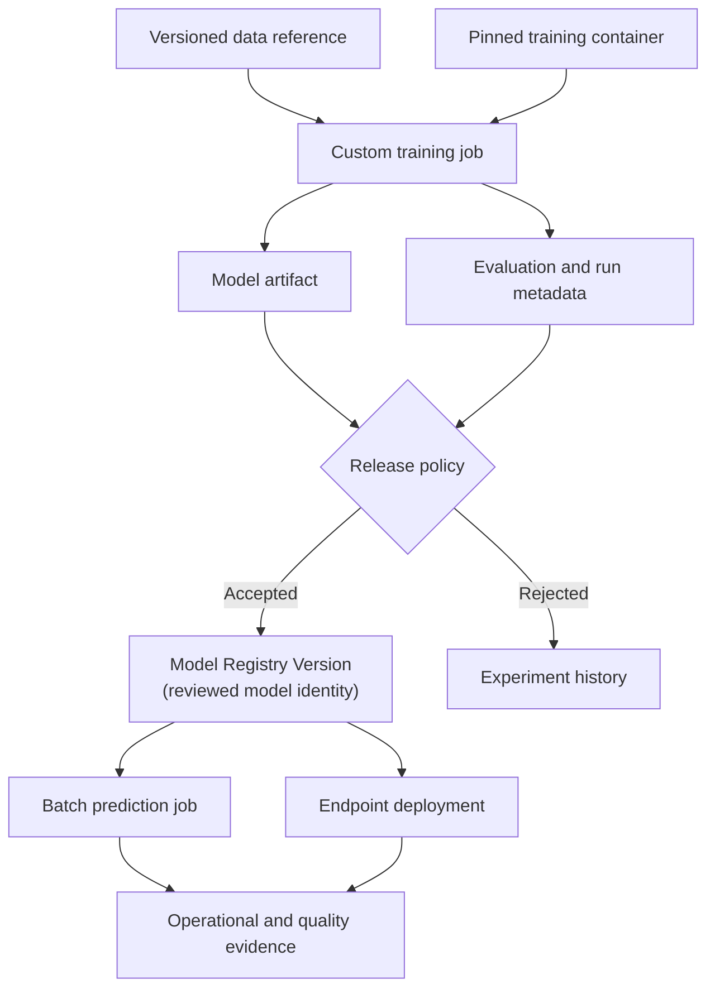
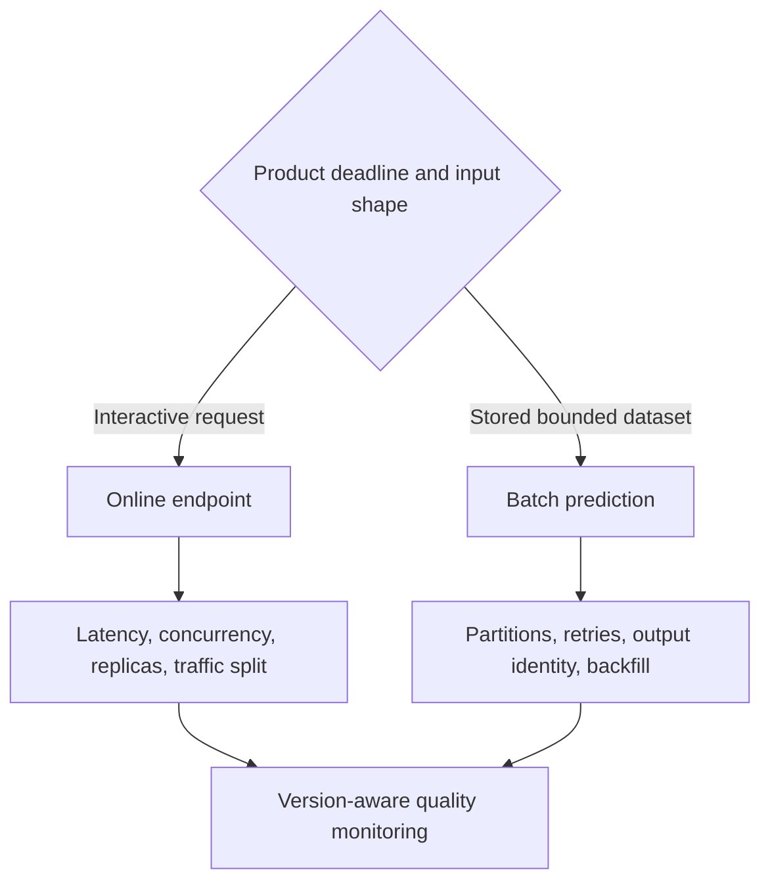
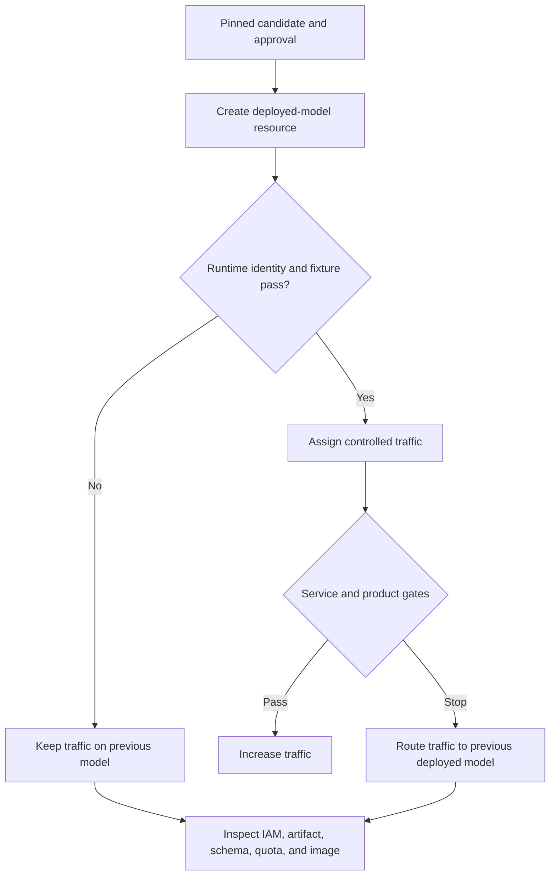

## Table of Contents

1. [Follow A Model From Training To Production](#follow-a-model-from-training-to-production)
2. [Decide What Google Cloud Manages And What The ML Team Owns](#decide-what-google-cloud-manages-and-what-the-ml-team-owns)
3. [Run Training On Managed Compute](#run-training-on-managed-compute)
4. [Coordinate Multi-Step ML Work With Managed Pipelines](#coordinate-multi-step-ml-work-with-managed-pipelines)
5. [Register Trained Models For Release](#register-trained-models-for-release)
6. [Batch And Online Prediction Solve Different Problems](#batch-and-online-prediction-solve-different-problems)
7. [Monitor Cloud Health And Product Outcomes Together](#monitor-cloud-health-and-product-outcomes-together)
8. [Recover Across Training, Registry, And Prediction Resources](#recover-across-training-registry-and-prediction-resources)
9. [Decide Whether Gemini Enterprise Agent Platform Fits The Workload](#decide-whether-gemini-enterprise-agent-platform-fits-the-workload)
10. [Follow The Complete Google Cloud ML Lifecycle](#follow-the-complete-google-cloud-ml-lifecycle)
11. [References](#references)

A custom training job can finish successfully and still leave the team with an incomplete production story. The model artifact may sit in Cloud Storage, while nobody can prove which BigQuery snapshot trained it. An endpoint may report healthy replicas, while the product cannot connect a poor prediction to the model version that served it.

Google Cloud provides managed resources for those separate responsibilities. Managed Training runs containers on temporary compute. Pipelines connects data preparation, training, evaluation, and registration. Model Registry identifies reviewed model versions. Batch Inference and Online Inference deliver predictions. IAM controls access, while Cloud Logging and Cloud Monitoring describe the managed service path.

**Gemini Enterprise Agent Platform, formerly Vertex AI Platform, is Google Cloud's managed platform for this ML lifecycle.** The newer product name now appears in the documentation and console. Existing API packages, endpoints, commands such as `gcloud ai`, and some resource names still use `aiplatform` or Vertex AI terminology. Those compatibility names do not change the architecture.

The platform operates infrastructure and resource state. The team still defines the meaning of the data, the evaluation policy, release authority, request contracts, product outcomes, and recovery. This article follows that ownership boundary through one predictive model lifecycle.

## Follow A Model From Training To Production
<!-- section-summary: Gemini Enterprise Agent Platform resources form a chain from a stable data reference through managed execution and review to an operated prediction workload. -->

The central MLOps question is whether the team can connect a production prediction to the exact evidence that allowed the model to ship. That connection needs concrete identities at every step.

Suppose a fraud model reads a point-in-time BigQuery snapshot and trains inside a pinned container. The training job writes one model artifact and one evaluation report. A release controller registers the accepted artifact as a model version, deploys it beside the current version, and records which deployed-model ID receives traffic. Production prediction records carry that release identity into later quality analysis.

The diagram shows the responsibilities and handoffs in that path:



Each transition needs a contract. Training consumes identified data and code. Evaluation consumes the candidate produced by that run. Registration preserves the same artifact identity and its evidence. Deployment resolves an approved model version. Monitoring records which version produced each prediction.

Gemini Enterprise Agent Platform can store and connect much of this metadata. It cannot repair an architecture that passes mutable names such as `latest.csv`, `main`, or `model:latest` between stages. Stable identities are a team design choice.


*The release rule separates rejected experiment evidence from a registered model version. Both online and batch predictions feed service and outcome evidence into the next training decision.*

## Decide What Google Cloud Manages And What The ML Team Owns
<!-- section-summary: Google operates the Gemini Enterprise Agent Platform control plane, while the customer owns the model's purpose, contracts, release rules, and response to harm. -->

Gemini Enterprise Agent Platform operates managed resource state, while the ML team remains responsible for the meaning and safety of the model. The following comparison shows where those responsibilities meet during development, training, release, prediction, and monitoring.

| Lifecycle area | Managed platform capability | Team-owned decision |
| --- | --- | --- |
| Development | Workbench and experiment integrations | Research method, code review, data access |
| Training | Custom jobs, managed compute, hyperparameter tuning | Dataset snapshot, image, resources, stopping rule |
| Orchestration | Managed Pipelines and task state | Component contracts, retry safety, gates |
| Registration | Model Registry versions and aliases | Evidence completeness, approval authority |
| Prediction | Batch jobs and managed endpoints | Serving pattern, schema, capacity, traffic policy |
| Monitoring | Logs, metrics, Model Monitoring capabilities | Baseline, cohorts, label join, action threshold |
| Security | IAM, service accounts, encryption and network integration | Least privilege, trust boundaries, data classification |

The ownership split is operationally useful. If a custom job fails to start, inspect resource, quota, image, and identity evidence. If it completes with a weak model, inspect data and evaluation. If an endpoint reports healthy instances while users receive bad decisions, inspect the model-quality and product-outcome loop.

### Read Resource Success And Model Success Separately

A `CustomJob` in a successful terminal state proves that the declared container finished under the managed execution contract. It does not prove that the selected data was current or that the model passed the right cohort checks. Keep the job state, evaluation result, and release decision as separate linked records.

The same distinction protects incident response. Endpoint health belongs to the serving control plane. Model usefulness belongs to the prediction-and-outcome path. One dashboard can show both, while each signal keeps its own owner and response.

## Run Training On Managed Compute
<!-- section-summary: A custom training job combines code, container, data references, compute, identity, outputs, and status into one managed execution. -->

A **custom training job** runs user-supplied training code on managed compute. The code can use a prebuilt training container or a custom container from Artifact Registry. The job specification selects machine and accelerator types, worker topology, region, service account, and output locations.

For repeatability, capture more than the successful job ID. Record:

- the source commit and training entry point;
- the container image digest and dependency lock;
- immutable training and validation data references;
- job configuration, random controls, and hardware shape;
- output artifact URI and evaluation report;
- the service account and relevant data boundary.

The service account is part of the run's capability boundary. A training job that reads curated features should not also have permission to deploy endpoints or overwrite governed source data. Separate training and release identities leave a narrower permission record for review.

Distributed training adds another layer. The job spec declares several worker pools or replicas, while the training framework coordinates them. Gemini Enterprise Agent Platform can allocate the workers; the team still owns checkpointing, collective behaviour, failure recovery, and whether the selected topology is efficient for the model.

### Follow One Training Attempt From Input To Output

A weekly model might read `bq://payments_ml.fraud_snapshot_1842`, pull `fraud-trainer@sha256:81e7...` from Artifact Registry, and write to `gs://payments-ml-prod/runs/run-8fb4c32/`. Those values belong in the submitted job and its run record. A retry that reads snapshot `1843` is a new training attempt even if the source code is unchanged.

Use a dedicated service account for the training container and grant it only the data and output access the run requires. The platform service agent may still perform platform-owned operations such as pulling the training image. Cross-project image and data access therefore need separate tests under the identities that actually perform them.

## Coordinate Multi-Step ML Work With Managed Pipelines
<!-- section-summary: Gemini Enterprise Agent Platform Pipelines records a component graph and run state, while the author defines deterministic inputs, outputs, cache behaviour, and side-effect safety. -->

**Gemini Enterprise Agent Platform Pipelines** runs ML workflows described using Kubeflow Pipelines or TensorFlow Extended-compatible pipeline definitions. A pipeline compiles component contracts into a graph that the managed platform executes and records.

The useful abstraction is a component with named inputs and outputs. A preparation component emits a dataset reference. Training emits a model artifact. Evaluation emits a report and decision inputs. Registration consumes the exact artifact and report. The graph exposes the handoff instead of relying on hidden shared paths.

Caching can reduce repeated work when a component's output is a pure function of its declared inputs and implementation. It is unsafe when a step reads current time, a mutable table, or an undeclared external system. Disable or carefully key caching for those steps.

Retries deserve the same reasoning. Recomputing an evaluation file in a run-specific path is usually safe. Re-registering, redeploying, or sending a notification changes shared state. Side-effecting components need stable operation IDs and current-state checks so a retry converges instead of duplicating an action.

Pipeline schedules and event triggers should reflect data readiness. A daily timer does not prove the latest partition is complete. A production trigger should identify the input snapshot and validate its completeness before expensive training starts.

### Treat Side-Effecting Pipeline Steps As Durable Operations

Preparation, training, and evaluation can write to run-specific locations and usually retry safely. Registration, notification, and endpoint updates change shared state. Give those steps a stable candidate or release ID, query current state after an uncertain response, and reuse an existing matching resource rather than creating a duplicate.

This distinction also controls pipeline caching. A deterministic feature step with fixed inputs can reuse an earlier output. A step that reads a moving table, current time, or undeclared service must expose that dependency or disable reuse. Managed caching cannot infer hidden inputs.

## Register Trained Models For Release
<!-- section-summary: Model Registry gives candidates durable versions and aliases, while release policy decides which version may receive traffic. -->

**Gemini Enterprise Agent Platform Model Registry** stores model resources and versions, including custom-trained models and supported models from other Google Cloud workflows. A registered version can later be deployed to an endpoint or used for batch prediction.

A good registry entry answers:

- Which model family and intended use does this version belong to?
- Which training run, code, image, and data created it?
- Which interface and feature schema does it expect?
- Which metrics, cohorts, and robustness checks passed?
- Who or what approved the candidate?
- Which previous version is the recovery target?

Aliases such as a default or production label give consumers a stable logical reference, yet the audit record must retain the concrete version. Alias movement should be an explicit release event. A service that loads a model only during deployment will not change merely because a registry alias changes; the release design has to match the runtime loading mechanism.

An alias is a mutable pointer. It can help an operator find the current accepted version, while a deployment record must retain the resolved numeric version. Suppose alias `champion` moves from version `26` to `27` after approval. An endpoint already running deployed-model `dm-26` still serves version `26` until its traffic or deployment state changes. The registry label and runtime state describe different transitions.

One release record can connect the important identities without a full SDK walkthrough:

```yaml
release_id: fraud-graph-release-1842
project: payments-ml-prod
region: europe-west4
training_job: fraud-graph-train-20260715
training_image: europe-west4-docker.pkg.dev/payments-ml/train/fraud@sha256:81e7...
dataset_snapshot: bq://payments_ml.features_fraud@1752537600000
model_artifact: gs://payments-ml-prod/models/fraud-graph/2026-07-15/model/
evaluation_report: gs://payments-ml-prod/evals/fraud-graph/2026-07-15.json
registry_model: fraud-graph
registry_version: "27"
previous_serving_version: "26"
approval: approved
```

The names are illustrative. The structure is the lesson: a release ties execution, evidence, registry state, and recovery together.

## Batch And Online Prediction Solve Different Problems
<!-- section-summary: Batch prediction processes bounded stored inputs, while endpoints keep model servers ready for interactive calls. -->

A **batch prediction job** reads input from supported storage, runs predictions asynchronously, and writes outputs. It fits scheduled scoring, large backfills, and workloads whose consumers can wait. Design it around partition identity, safe retries, output locations, partial failure, and backfill cost.

An **endpoint** hosts one or more deployed models for online prediction. Deployments choose compute, replica bounds, accelerator, container, and traffic share. Endpoint design includes the request and response contract, authentication, latency budget, concurrency, autoscaling signal, model-loading behaviour, and overload response.



For an endpoint release, deploy the candidate beside the current model and send it a controlled traffic share where the product and model semantics permit. Watch latency, errors, saturation, score distribution, guardrail outcomes, and later labels. Keep the previous deployed model available until the rollback window closes.

If the candidate fails, restore traffic to the previous deployed-model ID:

```bash
gcloud ai endpoints update fraud-prod \
  --region=europe-west4 \
  --traffic-split=dm-26=100,dm-27=0

gcloud ai endpoints describe fraud-prod \
  --region=europe-west4
```

The update changes the endpoint traffic map. The describe command checks the requested control-plane state. A known prediction fixture and release-aware telemetry must then prove that `dm-26` received traffic and returned the accepted result. An alias movement alone cannot provide that runtime proof.


*Online endpoints keep serving capacity ready for interactive requests. Batch jobs process bounded stored datasets, while both paths still need outcome evidence to measure model quality.*

## Monitor Cloud Health And Product Outcomes Together
<!-- section-summary: Cloud Monitoring shows resource and request health, while prediction records and later outcomes show whether the model remains useful. -->

Cloud Logging and Cloud Monitoring capture job, endpoint, and infrastructure evidence. Those signals reveal whether managed resources start, finish, and answer requests. They do not establish whether the model remains useful.

A prediction record should carry a request or entity key, timestamp, concrete model version, feature or schema version, safe input summaries, output, and latency. Later, a controlled pipeline joins it to labels or product outcomes. Quality is then calculated by cohort and time window with enough sample size to support a decision.

The release dashboard should show both clocks. Service errors and latency arrive immediately. Model outcomes may arrive later through fraud confirmation, returns, churn, or demand accuracy.

An alert needs a named owner and a defined action. A service-health breach can stop traffic expansion or restore the previous model. A quality breach may first disable an automated action, then send the team into data or model investigation. Retraining follows only after the evidence identifies a problem that new training data can address.

### Choose The Supported Model Monitoring Path

Agent Platform Model Monitoring has two current paths for tabular models. Version 1 is generally available for models deployed to Agent Platform endpoints and detects supported feature skew and drift. Version 2 associates monitoring with a model version and can monitor other serving infrastructure, although it remains Preview. A production team that requires generally available support should use the stable path for supported endpoint workloads or run its own governed checks.

Neither path owns the product outcome. A drift alert says that a distribution changed. The team must still join predictions to labels and evaluate the important cohorts. It must also confirm that the monitoring input is complete. That evidence decides whether the response needs traffic control, data repair, or retraining.

## Recover Across Training, Registry, And Prediction Resources
<!-- section-summary: Recovery follows the concrete data, job, model, endpoint, and identity resources because each managed boundary can fail independently. -->

Managed resources remove infrastructure work, yet they can still disagree about lifecycle state. A pipeline may finish after registration fails. A model version may exist while its artifact path is unreadable by the endpoint service account. An endpoint operation may report success while traffic still reaches the previous deployed model. A monitoring job may run against the wrong baseline.

The recovery design should record a concrete identity at every handoff:

| Boundary | Identity to retain | Recovery action |
| --- | --- | --- |
| Data to training | snapshot or table version and manifest digest | rerun against the same data or quarantine the snapshot |
| Training to evaluation | custom-job ID and model artifact digest | resume from a known checkpoint or start a linked replacement run |
| Evaluation to registry | report identity and registry version | retry registration idempotently or reject incomplete version |
| Registry to endpoint | model version, image, schema, and deployment ID | hold traffic until runtime identity agrees |
| Endpoint to monitoring | endpoint, deployed-model, release, and baseline IDs | repair attribution before making a quality decision |



Rollback should reference the previous deployed model and its complete release unit. The controller changes traffic, confirms the endpoint reports the expected version, runs known request fixtures, and records the incident against the candidate. Registry aliases can update after the runtime transition has been verified; an alias change alone cannot restore a running endpoint.

Quota and regional capacity also belong in recovery planning. A candidate may request unavailable accelerator capacity, or a regional control-plane issue may block updates. Teams that require a strict recovery time need tested capacity, a safe previous deployment, and a regional strategy that matches their availability goal.

### Reconcile An Uncertain Deployment Operation

An endpoint update is a long-running operation. The client can lose its response while Google Cloud continues the change. Retrying blindly may create another deployment or overwrite a newer traffic decision. Preserve the operation name and release ID, then query the operation, endpoint, and deployed-model state before choosing the next action.

If the candidate exists and has no traffic, verification can continue from that state. If traffic moved but monitoring attribution is missing, hold the split and repair evidence before expansion. If the endpoint never accepted the candidate, the controller can start a linked replacement operation. Each branch preserves the previous deployed model until recovery is proven.

## Decide Whether Gemini Enterprise Agent Platform Fits The Workload
<!-- section-summary: Gemini Enterprise Agent Platform fits teams that benefit from Google Cloud-native managed execution and lifecycle integration more than they pay in coupling and platform complexity. -->

Gemini Enterprise Agent Platform is a strong fit for governed data that already lives in BigQuery or Cloud Storage. Managed custom training and endpoints can remove repeated infrastructure work. IAM and regional controls support Google Cloud-wide governance, while Pipelines and Model Registry help several models share one reviewed lifecycle.

Existing systems may already cover the need. GKE or Batch can run training, while Cloud Run or GKE can host suitable prediction services. Composer can coordinate workflows and MLflow can preserve model-development evidence. The team owns more integration across that composable path.

Gemini Enterprise Agent Platform should remove recurring work or improve governance. Adopting it only to follow a reference diagram creates extra concepts without solving a real constraint.

Test one representative lifecycle. Follow the data identity and training isolation into evaluation and registration. Continue through prediction, monitoring, and rollback under the production permissions. Add quota, network, cost, and operator effort to the same evidence. The platform is justified if that path reduces recurring integration and operational work while preserving the required proof.

## Follow The Complete Google Cloud ML Lifecycle
<!-- section-summary: Gemini Enterprise Agent Platform is the managed ML resource layer; stable identities and explicit policies turn those resources into an MLOps system. -->

Managed Training executes declared work, and Pipelines connects component contracts. Metadata and experiments preserve the run evidence. Model Registry carries reviewed versions. Batch Inference or an endpoint delivers predictions. IAM restricts access, while cloud telemetry and product outcomes describe different parts of production health.

The complete path starts with a governed data reference and a pinned training container. A managed job produces an identified artifact. Evaluation decides whether that artifact may enter Model Registry, and the release controller deploys the accepted version under a concrete deployed-model ID. Traffic movement then creates a production event that monitoring and later outcomes can attribute.

One traceable chain should connect the source data, container, job, evaluation, model version, deployed-model ID, traffic decision, observed prediction, and rollback target. A broken identity in that chain creates a specific investigation: repair the handoff before making another release decision.

Agent Platform operates the managed machinery. The team owns the meaning of the data, the release policy, the response to production evidence, and the recovery of the decision system built with it.


*Pinned identities connect the data snapshot and training job to the evaluated registry version, prediction workload, production evidence, and next decision.*

## References

- [Gemini Enterprise Agent Platform name changes](https://docs.cloud.google.com/gemini-enterprise-agent-platform/vertex-ai-name-changes)
- [Gemini Enterprise Agent Platform custom training overview](https://docs.cloud.google.com/gemini-enterprise-agent-platform/machine-learning/training/overview)
- [Gemini Enterprise Agent Platform Pipelines](https://docs.cloud.google.com/gemini-enterprise-agent-platform/machine-learning/pipelines/introduction)
- [Gemini Enterprise Agent Platform Model Registry](https://docs.cloud.google.com/gemini-enterprise-agent-platform/machine-learning/model-registry/introduction)
- [Gemini Enterprise Agent Platform online inference](https://docs.cloud.google.com/gemini-enterprise-agent-platform/machine-learning/predictions/get-online-predictions)
- [Gemini Enterprise Agent Platform batch inference](https://docs.cloud.google.com/gemini-enterprise-agent-platform/machine-learning/predictions/get-batch-predictions)
- [Google Cloud MLOps: continuous delivery and automation pipelines](https://cloud.google.com/architecture/mlops-continuous-delivery-and-automation-pipelines-in-machine-learning)
