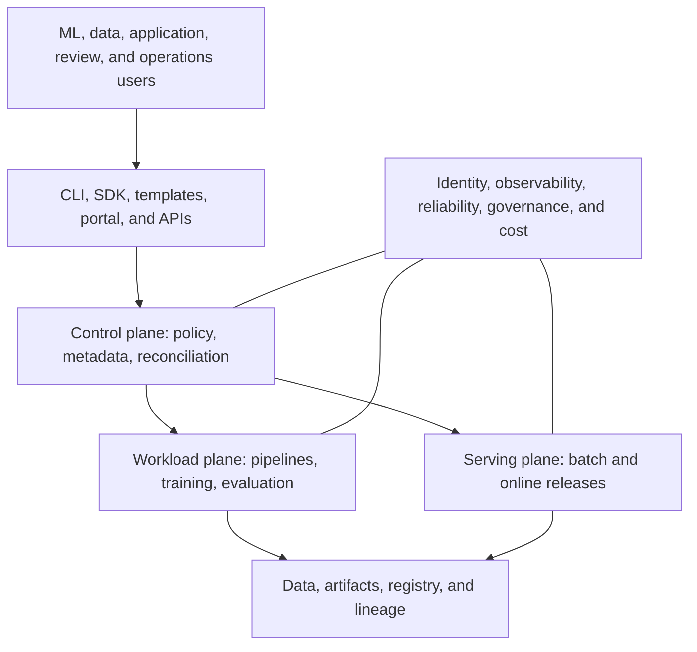

## What An ML Platform Is
<!-- section-summary: An ML platform is an internal product that gives ML teams supported, self-service paths across the model lifecycle. -->

An **ML platform** is an internal product that helps teams develop, train, evaluate, release, serve, and operate models through supported interfaces. It combines workflow services, compute, storage, security, observability, and governance into paths that a model team can use without assembling every system for every project.

A supporting example follows **FreshRoute**, a grocery delivery company with forecasting, search ranking, delivery-time, and support-routing models. Its first teams shared scripts and a tracking server. As the number of models grew, every team created its own buckets, training jobs, deployment manifests, service accounts, and dashboards. The company now needs a platform that keeps useful differences between model workloads while standardizing the repeated engineering work.

The framework in this article has seven connected parts:

| Part | Question it answers |
| --- | --- |
| Platform product and interfaces | How do model teams request and use supported capabilities? |
| Control plane | Which APIs, metadata, policies, and controllers coordinate the lifecycle? |
| Workload plane | Where do pipelines, training, evaluation, and batch jobs run? |
| Data and artifact plane | Where do datasets, features, runs, models, and evidence live? |
| Serving plane | How do approved versions answer online, batch, streaming, or edge requests? |
| Guardrails and operations | How are identity, policy, observability, reliability, and incidents handled? |
| Cost and product feedback | Does the platform improve delivery while using people and compute responsibly? |

This map gives later tool choices a place. Kubernetes can run workloads. Kubeflow Pipelines can coordinate steps. MLflow can record runs and versions. Triton can execute models efficiently. Each tool fills a responsibility inside the platform instead of defining the whole platform.



Users enter through product interfaces instead of manipulating every controller directly. The control plane records intent and policy. Workload and serving planes execute that intent. Shared asset systems preserve evidence, while guardrails apply across every path. This structure helps a platform team define ownership before selecting products.

## Platform Product And Interfaces
<!-- section-summary: Platform teams treat model developers as users and provide supported golden paths, APIs, templates, and documentation around real lifecycle tasks. -->

Platform engineering guidance from the CNCF emphasizes **platform as a product**, **self-service capabilities**, **golden paths**, and **guardrails**. For an ML platform, the users include data scientists, ML engineers, data engineers, application teams, reviewers, and on-call operators. Each group needs an interface that matches its work.

A **golden path** is a supported way to complete a common task. FreshRoute starts with three:

1. Create a training pipeline from a reviewed template.
2. Register an evaluated model and request a release.
3. Deploy an approved model behind a standard online endpoint with logs, metrics, and rollback.

The interface can be a CLI, Python SDK, repository template, portal, Git pull request, or API. The platform should expose the user intent and keep infrastructure details behind the interface where that reduces repeated work. A model owner might submit this small contract:

```yaml
model_workload:
  name: delivery-eta
  owner: logistics-ml
  training:
    image: registry.freshroute.example/delivery-eta-train@sha256:4a12...
    dataset_manifest: delivery-features/2026-07-10
    compute_profile: gpu-l4-small
  release:
    evaluation_policy: customer-eta-v3
    serving_profile: online-cpu-autoscaled
    rollback_window_hours: 24
```

The platform resolves `gpu-l4-small` to a reviewed queue, node pool, quota, and runtime policy. It resolves `online-cpu-autoscaled` to an endpoint template with readiness, telemetry, identity, and traffic controls. The model team still owns the training code, metric choice, data contract, and product decision.

## Control Plane And Workload Plane
<!-- section-summary: The control plane records intent and applies policy, while the workload plane runs the containers and compute that perform ML work. -->

The **control plane** coordinates the platform. It includes APIs, workflow definitions, metadata, registry state, policy checks, queue admission, deployment controllers, and audit events. The control plane answers which version should run, who requested it, which policy applies, and which controller should act.

The **workload plane** performs the compute. It includes data validation jobs, pipeline components, training workers, evaluation jobs, batch scoring, and model-serving replicas. Kubernetes, managed cloud jobs, Ray clusters, Spark, and serverless processing can all provide workload capacity.

Separating the two prevents an important design error. A training container should train and write a candidate. It should not grant itself production approval or update live traffic. The control plane checks evaluation evidence and approval, then a release identity updates a pinned deployment. The workload plane runs that deployment under a serving identity.

FreshRoute records the handoff:

```yaml
release_event:
  model: delivery-eta
  candidate_version: "84"
  evaluation_run: eval-20260712-188
  policy_result: passed
  approved_by: logistics-release
  deployment_target: delivery-eta-prod
  previous_version: "81"
```

The event is control-plane evidence. The running pods or managed endpoint belong to the workload plane. Operations checks both because intended state and live state can differ during a failed rollout.

## Follow One Request Through Reconciliation
<!-- section-summary: A controller repeatedly compares declared workload intent with observed runtime state, performs one safe action, and writes status that users and other controllers can trust. -->

The control plane needs a mechanism that carries a submitted contract all the way to running work. A **controller** watches a kind of request, such as `ModelWorkload`, and a **reconciler** handles one request at a time. Reconciliation means reading the desired specification and the observed state, deciding the next safe action, then recording the result. The controller repeats that work after a request changes, a child workload changes, or a retry timer fires.

This loop matters because API acceptance only proves that the request was stored. It gives no proof that policy allowed it, a Kubernetes Job was created, quota admitted the Job, or training completed. The request therefore needs a durable `spec` for user intent and a controller-owned `status` for observed progress. `status.observedGeneration` tells the reader which revision of the specification the status describes.

A production reconciliation path usually has six stages:

1. The API validates field shape and stores the request with a new generation.
2. Admission policy checks identity, immutable image digests, approved compute profiles, and allowed data locations.
3. The reconciler renders a deterministic child workload and applies it with an owner reference.
4. Kubernetes and the queue place the child workload on capacity.
5. The reconciler observes child conditions and copies a smaller, stable status onto the platform request.
6. Pipeline and user interfaces watch that status instead of guessing progress from pod names.

The following executable planner makes those transitions visible. A real controller would call the Kubernetes API through a typed client and retry conflicts through a work queue. Keeping the decision function pure gives the platform team a fast contract test for policy, child identity, and status transitions.

```python
from hashlib import sha256
import re


COMPUTE_PROFILES = {
    "cpu-medium": {
        "nodeSelector": {"workload": "cpu"},
        "resources": {
            "requests": {"cpu": "4", "memory": "16Gi"},
            "limits": {"cpu": "8", "memory": "24Gi"},
        },
    },
    "gpu-l4-small": {
        "nodeSelector": {"accelerator": "nvidia-l4"},
        "resources": {
            "requests": {"cpu": "8", "memory": "48Gi", "nvidia.com/gpu": "1"},
            "limits": {"cpu": "12", "memory": "64Gi", "nvidia.com/gpu": "1"},
        },
    },
}
IMMUTABLE_IMAGE = re.compile(r"^[a-z0-9./:_-]+@sha256:[0-9a-f]{64}$")


def status(request, phase, reason, message, child_name=None):
    return {
        "observedGeneration": request["metadata"]["generation"],
        "phase": phase,
        "reason": reason,
        "message": message,
        "childRef": child_name,
    }


def render_job(request):
    metadata = request["metadata"]
    training = request["spec"]["training"]
    profile = COMPUTE_PROFILES[training["compute_profile"]]
    suffix = sha256(
        f'{metadata["uid"]}:{metadata["generation"]}'.encode()
    ).hexdigest()[:8]
    child_name = f'{metadata["name"]}-train-{suffix}'
    job = {
        "apiVersion": "batch/v1",
        "kind": "Job",
        "metadata": {
            "name": child_name,
            "namespace": metadata["namespace"],
            "labels": {
                "platform.freshroute.example/request": metadata["name"],
                "platform.freshroute.example/generation": str(
                    metadata["generation"]
                ),
            },
            "ownerReferences": [{
                "apiVersion": "platform.freshroute.example/v1alpha1",
                "kind": "ModelWorkload",
                "name": metadata["name"],
                "uid": metadata["uid"],
                "controller": True,
            }],
        },
        "spec": {
            "backoffLimit": 2,
            "template": {
                "spec": {
                    "restartPolicy": "Never",
                    "serviceAccountName": "ml-training-runner",
                    "nodeSelector": profile["nodeSelector"],
                    "containers": [{
                        "name": "trainer",
                        "image": training["image"],
                        "args": [
                            f'--dataset={training["dataset_manifest"]}',
                            f'--run-id={metadata["uid"]}',
                        ],
                        "resources": profile["resources"],
                    }],
                }
            },
        },
    }
    return child_name, job


def reconcile(request, observed_child=None):
    training = request["spec"]["training"]
    denials = []
    if IMMUTABLE_IMAGE.fullmatch(training["image"]) is None:
        denials.append("training image must use an immutable digest")
    if training["compute_profile"] not in COMPUTE_PROFILES:
        denials.append("compute profile is not approved")
    if not training["dataset_manifest"].startswith(
        "s3://freshroute-ml/manifests/"
    ):
        denials.append("dataset manifest is outside the governed prefix")

    if denials:
        return {
            "action": "WriteStatus",
            "status": status(
                request, "Denied", "PolicyDenied", "; ".join(denials)
            ),
        }

    child_name, desired_job = render_job(request)
    if observed_child is None:
        return {
            "action": "ApplyChild",
            "object": desired_job,
            "status": status(
                request,
                "Creating",
                "ChildApplyRequested",
                "training Job submitted",
                child_name,
            ),
        }

    if observed_child["phase"] == "Pending" and observed_child.get(
        "pending_seconds", 0
    ) > 900:
        return {
            "action": "WriteStatus",
            "status": status(
                request,
                "Stalled",
                "PlacementTimeout",
                observed_child["message"],
                child_name,
            ),
        }

    transitions = {
        "Pending": ("Queued", "WaitingForPlacement"),
        "Running": ("Running", "ChildRunning"),
        "Succeeded": ("Succeeded", "ChildCompleted"),
        "Failed": ("Failed", "ChildFailed"),
    }
    phase, reason = transitions[observed_child["phase"]]
    return {
        "action": "WriteStatus",
        "status": status(
            request, phase, reason, observed_child["message"], child_name
        ),
    }
```

The deterministic child name makes repeated reconciliations **idempotent**, which means the same request can be processed again without creating another training Job. The owner reference lets Kubernetes garbage collection identify the child as part of the platform request. The controller writes only fields under `status`; users continue to own `spec`. Production implementations also use optimistic concurrency, retry temporary API failures, and emit an audit event for each policy or phase change.

The contract test starts with one accepted request, proves that a Job is created exactly once, exercises a policy denial, simulates a placement stall, and then proves recovery after queue capacity is available:

```python
request = {
    "metadata": {
        "name": "delivery-eta",
        "namespace": "logistics-ml",
        "uid": "mw-7f293",
        "generation": 3,
    },
    "spec": {
        "training": {
            "image": "registry.freshroute.example/eta@sha256:" + "a" * 64,
            "dataset_manifest": (
                "s3://freshroute-ml/manifests/eta/2026-07-14.json"
            ),
            "compute_profile": "gpu-l4-small",
        }
    },
}

created = reconcile(request)
assert created["action"] == "ApplyChild"
assert created["object"]["metadata"]["name"] == (
    "delivery-eta-train-fb5e6c6a"
)
pod_spec = created["object"]["spec"]["template"]["spec"]
assert pod_spec["nodeSelector"] == {"accelerator": "nvidia-l4"}
assert pod_spec["containers"][0]["resources"]["requests"][
    "nvidia.com/gpu"
] == "1"
assert created["object"]["metadata"]["ownerReferences"][0]["uid"] == (
    request["metadata"]["uid"]
)
assert reconcile(request)["object"] == created["object"]

mutable_image = {
    **request,
    "spec": {"training": {**request["spec"]["training"], "image": "eta:latest"}},
}
denied = reconcile(mutable_image)
assert denied["status"]["phase"] == "Denied"
assert "immutable digest" in denied["status"]["message"]

stalled = reconcile(request, {
    "phase": "Pending",
    "pending_seconds": 1_200,
    "message": "insufficient nvidia.com/gpu quota in logistics-gpu",
})
assert stalled["status"]["reason"] == "PlacementTimeout"

recovered = reconcile(request, {
    "phase": "Running",
    "pending_seconds": 0,
    "message": "1 of 1 worker ready after quota admission",
})
assert recovered["status"]["phase"] == "Running"
print(recovered["status"])
```

The expected output is a status record with generation `3`, phase `Running`, reason `ChildRunning`, and the same child reference created during the first reconciliation. The policy denial creates no child workload. The stalled state keeps the request and its evidence visible while the queue owner adds capacity or corrects placement policy. Once the child reports `Running`, the next reconciliation replaces the stalled condition with current progress. A controller restart causes no special recovery sequence because the durable request and child state supply everything the loop needs.

This mechanism also defines the control-plane failure boundary. A rejected request needs a user correction. A valid request stuck before child creation points to the platform API or controller. A child stuck in placement points to queue, quota, node, or scheduling policy. A running child that later fails points to workload code or runtime. Status reasons route each failure to the right owner without exposing every low-level event through the platform API.

## Data, Artifact, And Serving Planes
<!-- section-summary: Persistent ML evidence and live prediction paths have different storage, latency, consistency, and operating needs. -->

The **data and artifact plane** keeps durable evidence. It usually includes object storage for large files, warehouse or lakehouse tables for datasets, a metadata store for runs and lineage, a model registry for named versions and release intent, and a catalog for discovery and ownership. Immutable identifiers connect dataset snapshot, code commit, image digest, run, model version, evaluation, and deployment.

The **serving plane** delivers predictions. It may provide online APIs, batch jobs, stream processors, edge packages, or embedded libraries. Online serving needs request validation, latency and availability targets, scaling, traffic control, fallback, and version telemetry. Batch serving needs partitioning, restartability, output manifests, and cost control. A platform can support several profiles without pretending one runtime fits every model.

FreshRoute publishes a small service contract:

```yaml
serving_profile:
  name: online-cpu-autoscaled
  request_timeout_ms: 250
  minimum_replicas: 2
  authentication: workload_identity
  required_endpoints:
    - /predict
    - /ready
    - /version
  telemetry:
    - request_count
    - error_count
    - latency_histogram
    - model_version
  rollout:
    strategy: canary
    rollback: previous_pinned_version
```

The profile gives application teams a stable interface and gives the platform team an upgrade boundary. The implementation may move from a raw Deployment to KServe or a managed endpoint while the product contract stays recognizable.

## Guardrails, Reliability, And Cost
<!-- section-summary: Security, policy, observability, reliability, and cost controls cross every platform layer and need named owners. -->

Guardrails work across the platform. Workload identity limits data and artifact access. Network policy limits service paths. Admission policy blocks privileged containers and unpinned production images. Evaluation policy blocks a weak model. Audit events record changes to data, registry state, permissions, and deployments. These controls belong in the supported path so users receive them automatically.

Reliability also crosses layers. The platform team operates the control plane, shared compute, storage integration, queue, and serving templates. Model teams operate model quality, data contracts, use-case alerts, and product fallback with application owners. Shared incident runbooks identify the first owner for pipeline failure, capacity shortage, endpoint error, data drift, and business-quality regression.

Cost needs the same clarity. GPU queue wait time, accelerator utilization, idle endpoint replicas, artifact growth, prediction cost, and platform engineer time all influence the architecture. FreshRoute tags workloads by team and model, sets quotas, records requested and actual resources, and reviews unit measures such as cost per training run and cost per thousand predictions. A cheaper tool that creates months of integration and on-call work can still be an expensive platform decision.

## Measure The Platform As A Product
<!-- section-summary: A platform succeeds when supported paths improve user outcomes, reliability, governance, and cost rather than merely increasing the number of installed tools. -->

FreshRoute measures whether teams use the golden paths and whether those paths help. The platform dashboard includes time from approved change to training run, time from candidate to production, failed-run recovery time, endpoint rollback time, policy failure reasons, platform availability, support load, GPU queue delay, and cost by model.

User feedback supplies the missing context. A high template adoption rate can hide a painful workflow if teams copy the template and then work around it. The platform team interviews model teams, reviews abandoned pipeline runs, tracks repeated support questions, and removes steps that create no useful control or evidence.

The first platform release stays narrow. FreshRoute supports one training template, one evaluation packet, one online-serving profile, one batch profile, and one incident path. It adds a capability after several teams need it and the ownership is clear. This approach keeps the platform smaller than a catalog of every available MLOps product.

## Putting It Together
<!-- section-summary: The platform framework connects user interfaces, lifecycle control, workload execution, persistent evidence, serving, guardrails, operations, cost, and feedback. -->

FreshRoute treats the ML platform as an internal product. Golden paths let teams express training and serving intent. The control plane records that intent, applies policy, and coordinates releases. Workload systems run training and inference. Storage and metadata keep the evidence. Cross-cutting identity, observability, reliability, governance, and cost controls support production operation.

This framework also creates a clear learning path for the rest of the module. The Kubernetes article explains one workload foundation. The tool article maps orchestration, distributed compute, packaging, inference, and serving controllers to their roles. The build-versus-buy article decides which responsibilities the company should operate and which a managed service should own.

## References

- [CNCF Platform Engineering Technical Community Group](https://contribute.cncf.io/community/tcgs/platform-engineering/)
- [CNCF: What is platform engineering?](https://www.cncf.io/blog/2025/11/19/what-is-platform-engineering/)
- [Kubernetes Controllers](https://kubernetes.io/docs/concepts/architecture/controller/) - Official explanation of desired state, observed state, control loops, child resources, and status updates.
- [Google Cloud MLOps architecture and automation](https://docs.cloud.google.com/architecture/mlops-continuous-delivery-and-automation-pipelines-in-machine-learning)
- [Azure Architecture Center: Machine learning operations](https://learn.microsoft.com/en-us/azure/architecture/ai-ml/guide/machine-learning-operations-v2)
