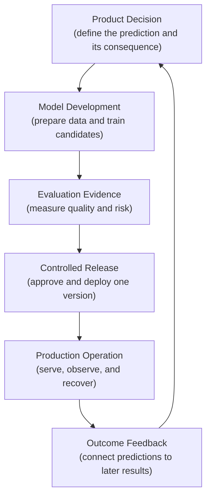
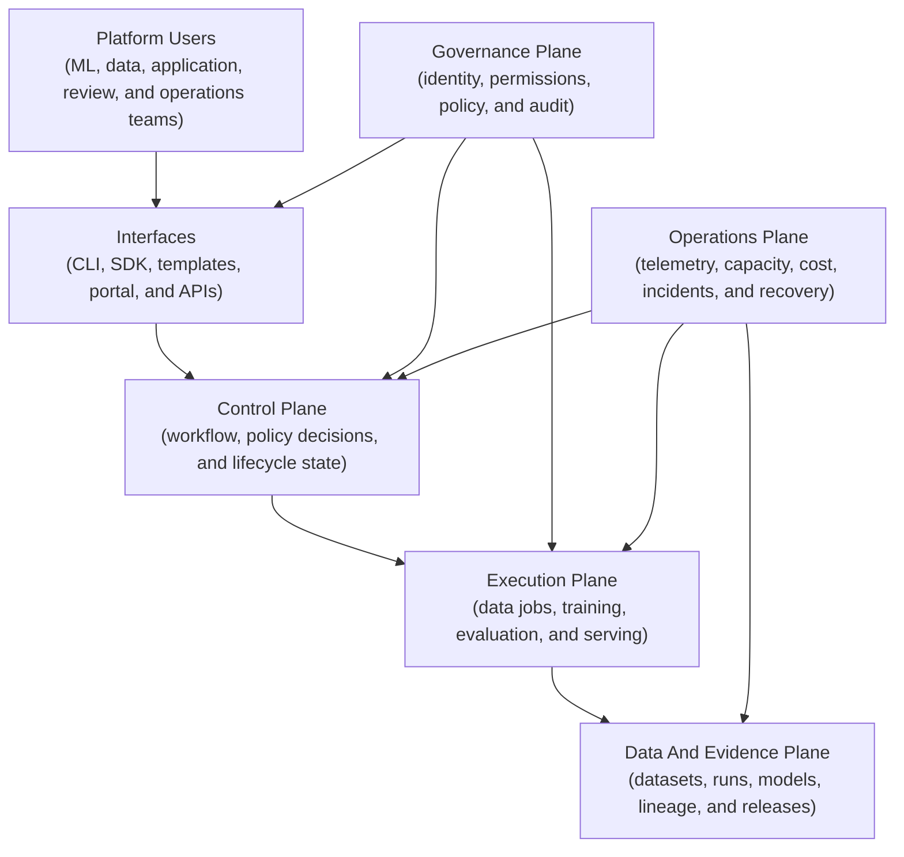
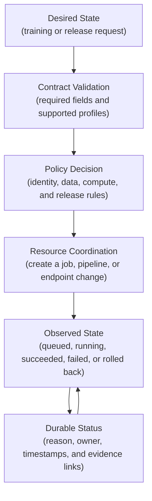
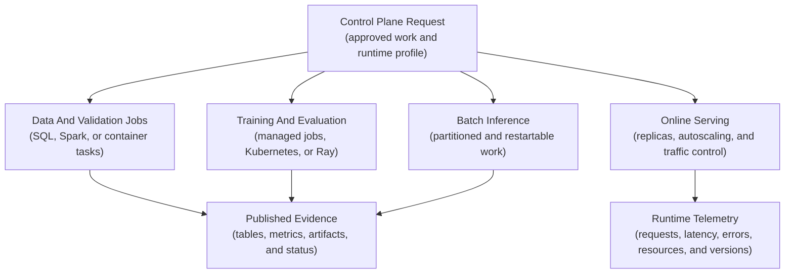
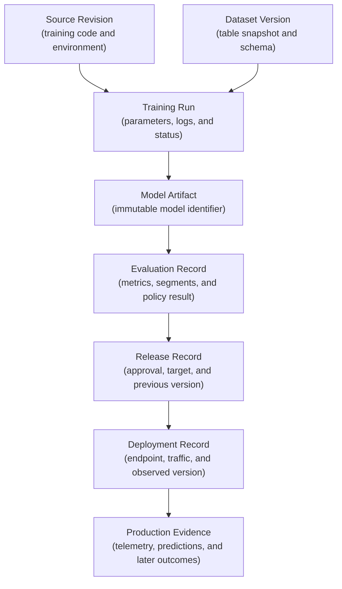
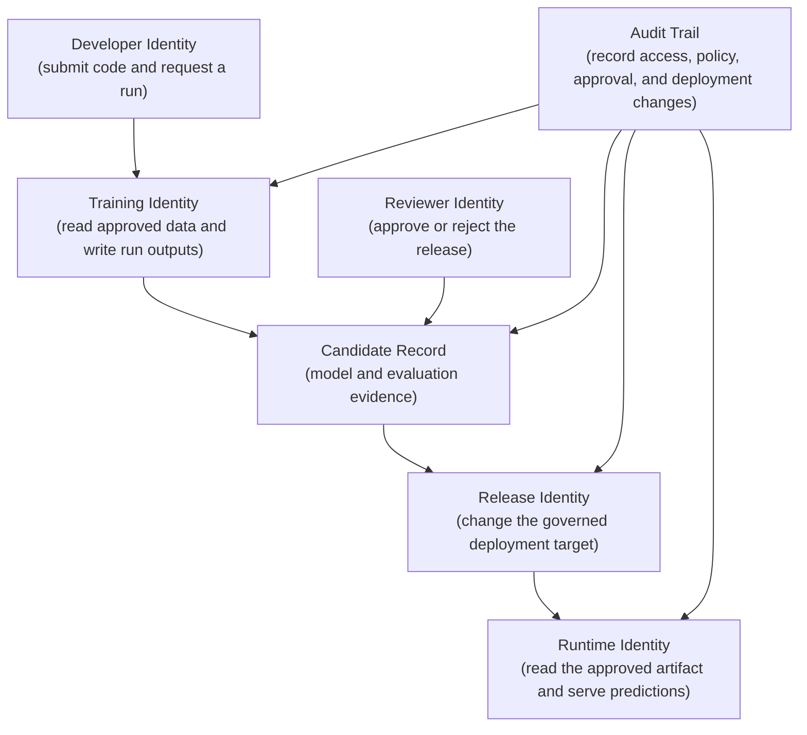
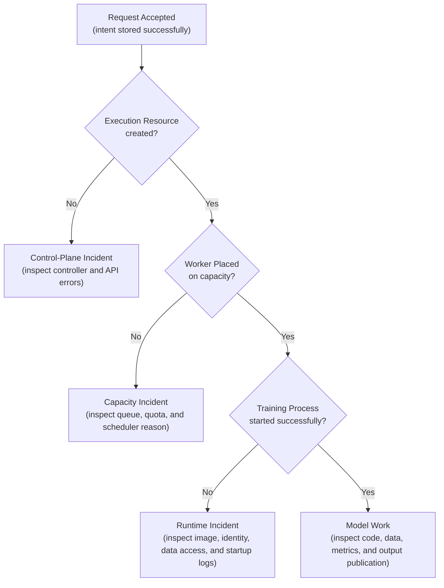
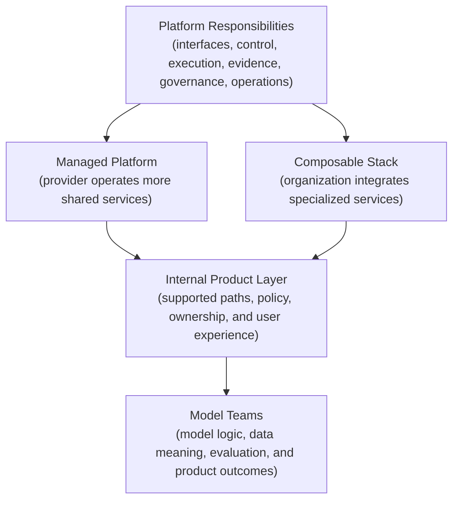

## Table of Contents

1. [What An ML Platform Solves](#what-an-ml-platform-solves)
2. [The Six Jobs Of An ML Platform](#the-six-jobs-of-an-ml-platform)
3. [Give Teams Supported Ways To Train And Release Models](#give-teams-supported-ways-to-train-and-release-models)
4. [Validate And Coordinate Every Platform Request](#validate-and-coordinate-every-platform-request)
5. [Run ML Work On Managed Compute](#run-ml-work-on-managed-compute)
6. [Store ML Data, Models, And Their History](#store-ml-data-models-and-their-history)
7. [Apply Access And Policy Rules Across The ML Lifecycle](#apply-access-and-policy-rules-across-the-ml-lifecycle)
8. [Operate, Monitor, And Recover The Platform](#operate-monitor-and-recover-the-platform)
9. [Choose A Managed Platform Or A Composable Stack](#choose-a-managed-platform-or-a-composable-stack)
10. [Measure Whether The Platform Helps Teams Ship Reliable Models](#measure-whether-the-platform-helps-teams-ship-reliable-models)
11. [Add Platform Capabilities To Solve Repeated Team Problems](#add-platform-capabilities-to-solve-repeated-team-problems)
12. [The Main Idea](#the-main-idea)
13. [References](#references)

## What An ML Platform Solves
<!-- section-summary: An ML platform gives many teams a supported way to train, release, serve, and operate models without rebuilding the same production machinery. -->

One data scientist can train a model from a notebook, save a file, and test a prediction locally. That workflow proves that the model can learn. It says very little about production.

A production team also needs repeatable data and controlled compute. Evaluation evidence must follow the candidate into an approved release. A dependable prediction path and useful telemetry then support daily operation and investigation.

The same requirements repeat across projects. Without a shared platform, each team invents its own training job, storage layout, access policy, deployment script, dashboard, and rollback procedure. The organization then spends more time integrating and repairing the surrounding system. A security fix must be repeated in many repositories. A GPU shortage has no shared queue. An incident responder cannot reliably connect a prediction to the model and data that produced it.

An **ML platform** is the internal product that supplies these repeated capabilities through supported interfaces. It turns production ML from a collection of custom integrations into dependable paths that teams can use and the organization can operate.

Consider a fraud model that has passed evaluation. Releasing it involves much more than copying a model file to a server. The release process identifies the exact artifact and verifies its evaluation evidence. It records the approval, allocates serving capacity, shifts traffic safely, and watches production health. The model team supplies the model-specific meaning. The platform supplies the repeated production machinery.


```mermaid
flowchart TD
    Need["Product Decision<br/>(define the prediction and its consequence)"] --> Build["Model Development<br/>(prepare data and train candidates)"]
    Build --> Evidence["Evaluation Evidence<br/>(measure quality and risk)"]
    Evidence --> Release["Controlled Release<br/>(approve and deploy one version)"]
    Release --> Operate["Production Operation<br/>(serve, observe, and recover)"]
    Operate --> Learn["Outcome Feedback<br/>(connect predictions to later results)"]
    Learn --> Need

    class Need,Build,Learn product
```

The platform supports this lifecycle. Product and model owners decide how to balance fraud loss, false declines, fairness, and customer friction. The platform makes those decisions executable, traceable, and operable.

## The Six Jobs Of An ML Platform
<!-- section-summary: A useful architecture separates interfaces, coordination, execution, evidence, governance, and operations before products are selected. -->

Product names are a poor starting point for architecture. A team can install Kubernetes, MLflow, Airflow, and a model server and still lack a coherent path from an experiment to a safe production release. The first design task is to separate the jobs the platform must perform.

Six responsibilities give the architecture a stable shape:

- **Interfaces** let users request common outcomes through a CLI, SDK, repository template, portal, Git workflow, or API.
- **Control plane** records intent, applies workflow rules, coordinates state changes, and reports progress.
- **Execution plane** supplies the compute that prepares data, trains models, evaluates candidates, scores batches, and serves predictions.
- **Data and evidence plane** preserves datasets, features, parameters, metrics, artifacts, lineage, approvals, and deployment records.
- **Governance plane** applies identity, permissions, policy, environment boundaries, audit, and retention rules.
- **Operations plane** monitors the platform, manages capacity and cost, restores failed services, and gives incidents a clear owner.

You can think of the platform as a railway system. Interfaces are the stations where users state where work should go. The control plane sets routes and checks that a movement is allowed. The execution plane provides the trains and tracks. The evidence plane records the cargo and journey. Governance sets the operating rules. Operations keeps the whole system available and responds to disruptions.


```mermaid
flowchart TD
    Users["Platform Users<br/>(ML, data, application, review, and operations teams)"] --> Interfaces["Interfaces<br/>(CLI, SDK, templates, portal, and APIs)"]
    Interfaces --> Control["Control Plane<br/>(workflow, policy decisions, and lifecycle state)"]
    Control --> Execution["Execution Plane<br/>(data jobs, training, evaluation, and serving)"]
    Execution --> Evidence["Data And Evidence Plane<br/>(datasets, runs, models, lineage, and releases)"]
    Governance["Governance Plane<br/>(identity, permissions, policy, and audit)"] --> Interfaces
    Governance --> Control
    Governance --> Execution
    Operations["Operations Plane<br/>(telemetry, capacity, cost, incidents, and recovery)"] --> Control
    Operations --> Execution
    Operations --> Evidence

    class Governance,Operations guard
```

These are architectural responsibilities rather than mandatory services. A managed cloud platform may implement several of them behind one API. A composable stack may assign them to separate products. Keeping the responsibilities visible prevents gaps and unclear ownership in either design.


*Interfaces, control, execution, and evidence form the working lifecycle. Governance and operations span those responsibilities so identity, policy, health, capacity, cost, and recovery remain part of the platform design.*

## Give Teams Supported Ways To Train And Release Models
<!-- section-summary: Platform interfaces capture user intent in a stable contract and provide a supported path for common ML work. -->

The first part a user sees is the interface. A training interface might accept a source revision, a container image, a governed dataset reference, a compute profile, and an output location. A release interface might accept a model identifier, evaluation evidence, a target environment, and a rollout policy.

A **supported path**, often called a golden or paved path, packages the organization’s preferred way to complete a common task. It combines a stable interface with defaults and documentation. Policy checks, telemetry, ownership, and a working recovery procedure support the path in production. A repository template by itself is only a starting file. The platform team must maintain the complete journey before users can depend on it.

Suppose a team needs a scheduled training run for a risk model. They should be able to describe the workload without choosing a Kubernetes node pool, creating a cloud service account, or rebuilding logging. A compact request could look like this:

```yaml
kind: TrainingRequest
metadata:
  name: checkout-risk-weekly
  owner: risk-ml
spec:
  sourceRevision: 4f93c20
  image: registry.example.com/risk-trainer@sha256:8d2e...
  dataset:
    table: prod_ml.training.checkout_risk
    version: 418
  computeProfile: cpu-large
  output:
    experiment: /production/checkout-risk
```

The request contains the decisions the model team understands. The platform maps `cpu-large` to reviewed infrastructure and submits the job with a workload identity. It captures logs and metrics, records the dataset version, and links the output model to the run.

A GPU workload selects an approved GPU profile. The model team can then request the required capacity without learning every scheduling label.

Good interfaces provide escape hatches with ownership. An uncommon distributed-training job may need extra topology settings. The platform can expose a reviewed extension field or direct that workload to an advanced API. Unlimited pass-through configuration would leak the underlying infrastructure into every user contract and make upgrades dangerous.

The interface is also an operating boundary. A stable `TrainingRequest` can continue to work while the platform team changes the scheduler, moves from one storage backend to another, or introduces a new telemetry collector. Users depend on the contract; the platform team owns its implementation and migration.

## Validate And Coordinate Every Platform Request
<!-- section-summary: The control plane turns a stored request into governed lifecycle changes and maintains trustworthy status throughout the process. -->

The **control plane** is the coordinating layer of the platform. It receives a request, validates it, applies policy, creates or calls the required resources, watches their state, and records the result. Workflow services, model registries, policy engines, metadata services, queues, deployment controllers, and release APIs may all participate in this layer.

The central concept is **intent**. A user declares the result they want: train this revision on this dataset, or release this model to this endpoint. The control plane compares that desired state with the state it can observe and decides the next action. Kubernetes calls this pattern reconciliation. Managed services implement a similar idea behind job and endpoint APIs even if users never see a Kubernetes controller.


```mermaid
flowchart TD
    Request["Desired State<br/>(training or release request)"] --> Validate["Contract Validation<br/>(required fields and supported profiles)"]
    Validate --> Policy["Policy Decision<br/>(identity, data, compute, and release rules)"]
    Policy --> Create["Resource Coordination<br/>(create a job, pipeline, or endpoint change)"]
    Create --> Observe["Observed State<br/>(queued, running, succeeded, failed, or rolled back)"]
    Observe --> Record["Durable Status<br/>(reason, owner, timestamps, and evidence links)"]
    Record --> Observe

    class Create,Observe state
```

This separation matters during failure. An API can accept a training request even though no worker has started. The stored request proves only that the control plane received it. A useful status then distinguishes policy rejection, queue admission, resource placement, container startup, model-code execution, and output publication.

For example, a run can remain queued because the GPU quota is exhausted. The control plane should report a placement or quota reason and retain the request. Retrying the training code would waste time because the code has not run. A failed Python process needs a different owner and a different recovery step. Durable status routes those cases to the right team.

The control plane also protects separation of duties. A training process writes a candidate model and evidence. It should not grant itself permission to update production traffic. A release service verifies the policy and approval, then changes the deployment through a narrower identity. This design limits the effect of a compromised or faulty training job.

Control-plane services should keep their own work small. They coordinate long-running jobs instead of performing the training inside an API process. This keeps user compute failures away from the services that admit and track every team’s work.


*The request carries source, data, and compute intent through five visible stages. Durable status feeds operations, which returns queue, failure, and capacity information to the team.*

## Run ML Work On Managed Compute
<!-- section-summary: The execution plane provides distinct runtime profiles for data preparation, training, evaluation, batch inference, and online serving. -->

The **execution plane** is where ML computation actually runs. It includes SQL or Spark transformations, validation jobs, training containers, distributed workers, evaluation tasks, batch scoring, stream processing, and online inference replicas.

These workloads have different shapes. Training may use a large GPU allocation for two hours and then release it. Batch inference may process thousands of partitions with restartable tasks. Online inference may run continuously with low latency, health checks, autoscaling, and traffic shifting. Treating them as one generic compute pool often produces poor scheduling and unclear reliability targets.


```mermaid
flowchart TD
    Control["Control Plane Request<br/>(approved work and runtime profile)"] --> DataJobs["Data And Validation Jobs<br/>(SQL, Spark, or container tasks)"]
    Control --> Training["Training And Evaluation<br/>(managed jobs, Kubernetes, or Ray)"]
    Control --> Batch["Batch Inference<br/>(partitioned and restartable work)"]
    Control --> Online["Online Serving<br/>(replicas, autoscaling, and traffic control)"]
    DataJobs --> Evidence["Published Evidence<br/>(tables, metrics, artifacts, and status)"]
    Training --> Evidence
    Batch --> Evidence
    Online --> Telemetry["Runtime Telemetry<br/>(requests, latency, errors, resources, and versions)"]

    class Evidence,Telemetry output
```

For ordinary teams, managed training jobs and managed endpoints are a strong default. The provider handles worker provisioning, host maintenance, basic scaling, logs, and service integration.

The model team still supplies reproducible images and data contracts. Evaluation, release policy, and model monitoring also remain part of the production design.

Kubernetes fits organizations that already operate it well and need portable workload contracts, custom scheduling, shared accelerators, or several specialized runtimes. Ray can coordinate Python-native distributed training and batch work. Spark remains common for large data transformations. These choices solve specific execution problems; they do not supply the complete platform lifecycle.

Capacity management belongs here too. A platform should expose named compute profiles, team quotas, queue policy, workload priority, and resource telemetry. An urgent production retraining job may receive a higher priority than an exploratory sweep. The policy must be visible so teams understand why work is waiting and who can change that decision.

## Store ML Data, Models, And Their History
<!-- section-summary: The data and evidence plane connects every production model to the exact inputs, code, run, evaluation, approval, and deployment that created it. -->

ML systems produce two broad kinds of durable material. The first is the large content: tables, feature snapshots, checkpoints, model files, evaluation reports, and prediction outputs. The second is the metadata that explains those objects: identity, owner, schema, version, lineage, parameters, metrics, approval, and lifecycle state.

Object storage, a warehouse, or a lakehouse usually holds the large content. Experiment tracking, catalogs, model registries, lineage systems, and release records hold or connect the meaning. Storing a model file in a bucket preserves bytes. A production evidence chain explains where the model came from and why it was released.


```mermaid
flowchart TD
    Source["Source Revision<br/>(training code and environment)"] --> Run["Training Run<br/>(parameters, logs, and status)"]
    Dataset["Dataset Version<br/>(table snapshot and schema)"] --> Run
    Run --> Model["Model Artifact<br/>(immutable model identifier)"]
    Model --> Evaluation["Evaluation Record<br/>(metrics, segments, and policy result)"]
    Evaluation --> Release["Release Record<br/>(approval, target, and previous version)"]
    Release --> Deployment["Deployment Record<br/>(endpoint, traffic, and observed version)"]
    Deployment --> Outcomes["Production Evidence<br/>(telemetry, predictions, and later outcomes)"]

    class Release,Deployment,Outcomes production
```

Imagine an incident in which approvals fall sharply after a model release. The responder first identifies the deployed model and policy version. From there, they follow the evaluation and training run to the exact dataset snapshot and code revision. A dashboard showing only the endpoint name cannot distinguish a model change from a feature change, routing rule, or broken outcome join.

Stable identifiers make this investigation possible. The training run records an immutable source revision and container digest. The dataset reference points to a table version, snapshot, or manifest rather than a mutable path. Each logged model receives its own identifier.

The release record names the model and its evaluation. It also records the approver, target, and previous production version. Prediction records carry the deployed model and policy identifiers used in later joins.

Current MLflow 3 tracking treats logged models as first-class records, allowing a run to produce several separately identified model artifacts and linking metrics to models and datasets. Databricks adds Unity Catalog governance around registered models and related data. Similar evidence can be built with another registry and catalog. The architectural requirement is the connected chain, not a particular product name.

Retention and recovery also belong in this plane. A model registry is not a backup of every dependent asset. The platform needs retention policies for model artifacts, table history, metadata databases, release records, and telemetry. Recovery tests should prove that the team can reconstruct the evidence required for a rollback or audit.

## Apply Access And Policy Rules Across The ML Lifecycle
<!-- section-summary: Governance gives every platform action an identity, a permitted scope, an auditable policy decision, and a controlled environment boundary. -->

Governance is the system of rules that determines who can perform an action, which assets they can use, and what evidence must exist. It includes identity and access management, secrets, network boundaries, data classification, catalog permissions, policy checks, approvals, audit logs, and retention.

A common mistake is to add governance as a final approval screen. Effective governance starts with the first data access and continues through training, registration, release, serving, and investigation. The supported path should carry these controls automatically so each model team does not rebuild them.


```mermaid
flowchart TD
    Author["Developer Identity<br/>(submit code and request a run)"] --> Training["Training Identity<br/>(read approved data and write run outputs)"]
    Training --> Candidate["Candidate Record<br/>(model and evaluation evidence)"]
    Reviewer["Reviewer Identity<br/>(approve or reject the release)"] --> Candidate
    Candidate --> Release["Release Identity<br/>(change the governed deployment target)"]
    Release --> Runtime["Runtime Identity<br/>(read the approved artifact and serve predictions)"]
    Audit["Audit Trail<br/>(record access, policy, approval, and deployment changes)"] --> Training
    Audit --> Candidate
    Audit --> Release
    Audit --> Runtime

    class Training,Release,Runtime identity
```

The identities in this path should have narrow permissions. A training identity may read governed feature tables and write to its experiment location. A release identity may update a specific production endpoint after policy passes. A runtime identity may read the approved artifact and required online features. None of them needs general administrative access.

Environment boundaries deserve the same care. Development work may use sampled or masked data and flexible compute. Production training may require reviewed code, pinned dependencies, protected data, and an auditable scheduler. Production serving needs a separate release path and runtime identity. Copying a development credential into all three environments removes the boundary the platform was meant to provide.

Policy should explain rejection in language a user can act on. “Denied” is insufficient. A useful result identifies the rule, such as an unapproved data classification, mutable image tag, missing evaluation segment, or forbidden deployment region. The record should also identify the policy version because governance rules change over time.

Managed catalogs and registries can supply integrated permissions and lineage. Cloud IAM can govern jobs, storage, and endpoints. Kubernetes policy tools can restrict workload configuration.

The platform team designs the identities and ownership that connect those systems. It also defines the exception and review process for work outside the normal path.

## Operate, Monitor, And Recover The Platform
<!-- section-summary: Platform operations distinguishes coordination failures, capacity failures, workload failures, serving failures, and model-quality failures so each reaches the right owner. -->

A platform is useful only if teams trust it during routine work and incidents. The **operations plane** supplies telemetry, service objectives, capacity management, cost attribution, alerting, runbooks, recovery tests, and ownership.

Platform telemetry covers more than model APIs. Operators track submission availability, controller errors, queue age, job startup time, worker failures, and artifact publication. They also watch endpoint health, storage errors, and metadata services.

Model teams use a different set of signals. Feature health, prediction distributions, delayed labels, and outcome quality describe the behavior of the ML system itself.

OpenTelemetry is a vendor-neutral framework for generating, collecting, and exporting traces, metrics, and logs. It is an instrumentation layer rather than the storage and visualization backend. A common composable design sends OpenTelemetry data through a collector to cloud monitoring or an observability product, while Prometheus-compatible metrics and Grafana dashboards cover infrastructure and service views.

Consider a training request that was accepted fifteen minutes ago and has not started. The investigation should follow the state transitions instead of immediately rerunning the job:


```mermaid
flowchart TD
    Accepted["Request Accepted<br/>(intent stored successfully)"] --> ChildCheck{"Execution Resource<br/>created?"}
    ChildCheck -->|No| Controller["Control-Plane Incident<br/>(inspect controller and API errors)"]
    ChildCheck -->|Yes| Placement{"Worker Placed<br/>on capacity?"}
    Placement -->|No| Capacity["Capacity Incident<br/>(inspect queue, quota, and scheduler reason)"]
    Placement -->|Yes| Process{"Training Process<br/>started successfully?"}
    Process -->|No| Runtime["Runtime Incident<br/>(inspect image, identity, data access, and startup logs)"]
    Process -->|Yes| Model["Model Work<br/>(inspect code, data, metrics, and output publication)"]

    class Controller,Capacity,Runtime incident
```

This path separates three teams’ concerns. A controller that failed to create the child resource belongs to the platform control-plane owner. A workload waiting for accelerators belongs to the capacity or queue owner. A Python process that exits during feature loading belongs to the model team, with platform support if storage or identity caused the failure.

Service objectives should reflect user journeys. Submission API availability matters, but a healthier measure is the proportion of valid training requests that start within a target time. Endpoint availability matters alongside rollback time and evidence freshness. Cost measures should include accelerator utilization, idle endpoint capacity, artifact growth, and platform-engineering effort. Cheap infrastructure with constant manual recovery is not a cheap platform.

Recovery needs regular proof. Back up metadata stores, protect artifact and table history, and rehearse restoration. Test a release rollback with a pinned previous model. Confirm that the platform can recover its control plane without losing the durable requests and statuses that describe active work.

## Choose A Managed Platform Or A Composable Stack
<!-- section-summary: Managed platforms and composable stacks implement the same responsibilities with different ownership boundaries. -->

After the responsibilities are clear, products can be placed deliberately. The main distinction is ownership. A managed platform operates more of the control and execution machinery. A composable stack gives the organization more control and more integration work.

### Use A Managed Platform

Amazon SageMaker AI supplies managed training jobs, pipelines, a model registry, projects, and managed deployment capabilities. Azure Machine Learning supplies jobs, components, registries, pipelines, and managed online endpoints through its current v2 CLI and SDK. Google Cloud now calls its platform **Gemini Enterprise Agent Platform**, formerly Vertex AI. Its managed ML pipelines, training, metadata, model management, and endpoint capabilities now live under that platform. Databricks connects lakehouse data, Lakeflow Jobs, MLflow 3, Models in Unity Catalog, and Model Serving.

These services cover substantial parts of the framework, but their boundaries differ. A managed training API still depends on a source and data strategy. A managed endpoint still depends on release policy, product fallback, and outcome monitoring. A registry still depends on clear candidate, approved, and deployed states. The platform team turns provider capabilities into an organization-specific path.

For a team already centered on one cloud, the practical default is usually the provider’s managed jobs, storage, identity, registry, and endpoints. Databricks is often a strong managed center for organizations whose data, feature engineering, governance, and ML work already live in its lakehouse. This reduces the number of control planes the organization must operate.

### Build A Composable Stack

A composable platform may use GitHub Actions for repository automation, Airflow or Dagster for workflows, managed cloud jobs or Kubernetes for execution, Ray for specialized distributed Python work, object storage with Delta Lake or Apache Iceberg for durable data, MLflow 3 for experiment and model records, and OpenTelemetry with cloud monitoring or Prometheus and Grafana for operations. Terraform commonly manages cloud resources, while Argo CD or Flux commonly manages Kubernetes delivery.

This design can support portability, existing enterprise integrations, or specialized scheduling. It also creates seams. The platform must connect identity, workload status, dataset and model identifiers, release evidence, telemetry, and recovery across several APIs. Installing each product does not create those contracts automatically.


```mermaid
flowchart TD
    Framework["Platform Responsibilities<br/>(interfaces, control, execution, evidence, governance, operations)"] --> Managed["Managed Platform<br/>(provider operates more shared services)"]
    Framework --> Composable["Composable Stack<br/>(organization integrates specialized services)"]
    Managed --> ProductLayer["Internal Product Layer<br/>(supported paths, policy, ownership, and user experience)"]
    Composable --> ProductLayer
    ProductLayer --> Teams["Model Teams<br/>(model logic, data meaning, evaluation, and product outcomes)"]

    class ProductLayer product
```

Both approaches need the internal product layer. A cloud console exposes resources. A platform exposes a supported journey with clear defaults, evidence, ownership, and recovery. Every chosen service must have a named responsibility and owner.

## Measure Whether The Platform Helps Teams Ship Reliable Models
<!-- section-summary: Platform measures should show whether supported paths improve delivery, reliability, governance, cost, and the daily work of model teams. -->

An internal platform succeeds through user and production outcomes rather than the number of installed tools. Adoption is useful only if teams complete real work through the supported path. Reliability is useful only if failures can be understood and recovered. Governance is useful only if controls protect the system without turning every change into a manual project.

Start with a few journey measures:

- **Time to first successful run** measures the effort needed for a new project to use governed data and compute.
- **Candidate-to-production lead time** shows how long evaluation, review, and release take.
- **Valid-request start time** exposes control-plane, queue, and capacity delays.
- **Failure recovery time** shows whether status, logs, ownership, and runbooks help teams restore work.
- **Rollback time** tests the release path under pressure.
- **Supported-path adoption** shows which capabilities teams trust and where they build workarounds.
- **Unit cost** connects resource use to a useful output, such as a completed training run or one thousand predictions.

Suppose most training jobs succeed, yet users wait two days for a service account and then thirty minutes for a worker. Job success hides the largest friction. Time to first run and queue delay reveal it. If teams frequently bypass the release interface, support tickets and user interviews may reveal a missing batch-serving path or an approval rule that has no clear owner.

The platform team should review quantitative measures alongside user research. Repository forks, abandoned runs, repeated manual commands, and copied deployment manifests are evidence that the official path does not cover real work. The response may be an interface that exposes the missing operation, a safer extension point, a new runtime profile, or removal of a control that produces no decision evidence.

## Add Platform Capabilities To Solve Repeated Team Problems
<!-- section-summary: A platform should begin with one complete production path and add capabilities after repeated needs and ownership are understood. -->

The first useful platform can be small. One reviewed training path, one evidence record, one release path, one serving profile, and one incident route may help more than a large catalog of partially connected tools.

Start by tracing one real model from source data to production outcome. Mark each manual handoff, repeated integration, missing identifier, unclear approval, and incident dead end. Choose the friction shared by several teams. Build a supported path around it, assign an owner, document the contract, instrument the journey, and measure adoption. Add the next capability after the first path works in routine operation and recovery.

This sequence keeps platform work connected to demand. A feature store belongs on the roadmap after teams repeatedly need consistent online and offline features. A Kubernetes-based training layer belongs there after managed jobs cannot meet scheduling, portability, or runtime needs. A new portal belongs there after it can simplify a proven workflow rather than hide an unfinished one.

Platform capabilities also need retirement plans. Interfaces accumulate over time, and every supported version carries operational cost. Publish compatibility boundaries, measure remaining use, provide migrations, and remove old paths after their consumers have moved.

## The Main Idea
<!-- section-summary: ML platform architecture is the deliberate separation and connection of user paths, lifecycle coordination, computation, evidence, governance, and operations. -->

An ML platform gives teams a dependable route from model work to production operation. Its architecture starts with six responsibilities: interfaces, control, execution, data and evidence, governance, and operations. Each responsibility has a clear contract and owner.

Managed services and open tools can implement those responsibilities in many combinations. The platform itself is the connected product: users can request work, policy can govern it, compute can execute it, evidence can explain it, and operators can recover it. Product selection follows that framework.

The practical test is a complete journey. A team can submit a governed workload, see why it is waiting, identify the exact output, release it through policy, observe the production version, and reach the correct owner during failure. An architecture that cannot support that journey still has a missing connection, even if every individual service is healthy.


*Model and product teams enter through supported interfaces. The platform team operates the complete path, providers operate selected managed machinery, and the combined system supports reliable delivery and recovery.*

## References

- [CNCF Platform Engineering Technical Community Group](https://contribute.cncf.io/community/tcgs/platform-engineering/)
- [CNCF: What is platform engineering?](https://www.cncf.io/blog/2025/11/19/what-is-platform-engineering/)
- [Kubernetes Controllers](https://kubernetes.io/docs/concepts/architecture/controller/)
- [Amazon SageMaker AI: Train a model](https://docs.aws.amazon.com/sagemaker/latest/dg/train-model.html)
- [Amazon SageMaker AI Pipelines](https://docs.aws.amazon.com/sagemaker/latest/dg/pipelines-overview.html)
- [Amazon SageMaker AI Projects](https://docs.aws.amazon.com/sagemaker/latest/dg/sagemaker-projects-whatis.html)
- [Azure Machine Learning pipelines](https://learn.microsoft.com/en-us/azure/machine-learning/concept-ml-pipelines?view=azureml-api-2)
- [Azure Machine Learning registries for MLOps](https://learn.microsoft.com/en-us/azure/machine-learning/concept-machine-learning-registries-mlops?view=azureml-api-2)
- [Azure Machine Learning managed online endpoints](https://learn.microsoft.com/en-us/azure/machine-learning/concept-endpoints-online?view=azureml-api-2)
- [Google Cloud Gemini Enterprise Agent Platform naming changes](https://docs.cloud.google.com/gemini-enterprise-agent-platform/release-notes)
- [Google Cloud Gemini Enterprise Agent Platform Pipelines](https://docs.cloud.google.com/gemini-enterprise-agent-platform/machine-learning/pipelines/introduction)
- [Databricks MLflow](https://docs.databricks.com/aws/en/mlflow/)
- [Databricks Lakeflow Jobs](https://docs.databricks.com/aws/en/jobs/)
- [Databricks Models in Unity Catalog](https://docs.databricks.com/aws/en/machine-learning/manage-model-lifecycle/)
- [Databricks Model Serving](https://docs.databricks.com/aws/en/machine-learning/model-serving)
- [MLflow 3 Tracking](https://mlflow.org/docs/latest/ml/tracking/)
- [OpenTelemetry overview](https://opentelemetry.io/docs/what-is-opentelemetry/)
