## Build Versus Buy Decides Who Owns The Platform
<!-- section-summary: A platform decision assigns responsibilities to a managed vendor, composable services, or an internal engineering team. -->

An ML platform supplies shared capabilities for data access, development, training, artifacts, evaluation, registry, serving, monitoring, security, and governance. **Build versus buy** decides who delivers and operates those capabilities.

The choice is a spectrum:

- A **managed platform** provides an integrated control plane and managed runtime services.
- A **composable platform** combines managed cloud services, commercial products, and open-source components.
- An **internal platform** builds opinionated workflows on infrastructure the organization operates.

Few teams build every underlying component. A Kubernetes-based internal platform still buys cloud compute, storage, identity, networking, and often databases. A managed platform still leaves model quality, data contracts, access policy, release decisions, and incident ownership with the customer.

The decision framework has seven stages: map responsibilities, identify hard constraints and service objectives, choose plausible delivery models, assign ownership and on-call burden, evaluate integration and economics, run a proof of concept, and design migration and exit.

```mermaid
flowchart LR
    Needs["Platform responsibilities and users"] --> Constraints["Hard constraints and service objectives"]
    Constraints --> Options["Managed, composable, and internal options"]
    Options --> Ownership["Operating and support ownership"]
    Ownership --> Economics["Three-year cost and opportunity cost"]
    Economics --> Proof["Representative proof of concept"]
    Proof --> Decision["Architecture and operating commitment"]
    Decision --> Exit["Export, migration triggers, and exit path"]
```

An option that fails a hard constraint leaves the decision before feature scoring. The remaining options move through ownership, economics, and proof together because a cheaper component can require more engineering and an integrated service can create stronger coupling. The exit path closes the loop by testing whether the organisation can recover its important assets and workflows if the chosen platform later stops fitting.

## Map Responsibilities Before Products
<!-- section-summary: A responsibility map reveals which capabilities need a common platform and which can remain with existing systems. -->

Start from the platform architecture: workspace and identity, data and features, compute and training, pipelines, experiment evidence, artifact and model registry, serving, observability, cost, governance, and developer experience.

For each responsibility, record the current system, required service level, consumers, data sensitivity, owner, and pain. Some capabilities may already be strong. A company with a governed warehouse and reliable Kubernetes platform should not replace them merely to adopt an “end-to-end” ML suite.

The map also prevents feature-count comparisons. A vendor may advertise monitoring while the team needs delayed-label quality by segment. An open-source registry may store versions while the organization needs cross-region approval, audit, and retention. Requirements should be expressed as outcomes and evidence.

## Hard Constraints Remove Invalid Options
<!-- section-summary: Data residency, latency, availability, workload, identity, network, regulation, and existing estate define the feasible set. -->

Hard constraints are conditions an option must satisfy. They may include data residency, private networking, customer-managed keys, identity provider integration, audit retention, GPU type, custom runtime, online latency, regional availability, or existing warehouse access.

Service-level objectives should cover training job start and completion, pipeline recovery, registry availability, endpoint latency and availability, rollback time, and support response. Workload shape matters: notebook research, scheduled batch training, distributed GPU training, low-latency inference, and many small models place different demands on a platform.

Data gravity can dominate architecture. Moving large governed datasets across clouds or into a vendor-managed copy adds cost, latency, privacy, and lifecycle complexity. The platform should meet data near its authoritative home unless a measured benefit justifies movement.

Hard constraints must be tested rather than accepted from sales language. “Private” can describe several network models. “Portable” can mean only the model artifact. “Managed monitoring” may omit the product outcomes the team needs.

## Delivery Models Trade Control For Operating Work
<!-- section-summary: Managed, composable, and internal platforms differ in customization, integration, portability, and operational ownership. -->

Managed platforms can shorten setup for training jobs, pipelines, registries, endpoints, permissions, and monitoring. They also impose provider APIs, supported runtimes, regional availability, quotas, upgrade cadence, and cost structure.

Composable platforms select the strongest component for each responsibility. They preserve existing data and operations investments but require well-designed handoff contracts and unified identity, metadata, and observability.

Internal platforms provide the most opinionated integration with company workflows and constraints. They require product management, documentation, support, upgrades, reliability, security, and a long-term engineering team. Internal platform code is a product, not a one-time project.

The correct level of control follows differentiating constraints. Custom scheduling, specialized accelerators, strict multi-tenancy, or a unique release workflow may justify internal work. Rebuilding ordinary experiment tracking or endpoint orchestration without a concrete advantage usually consumes scarce engineering attention.

## Ownership Includes The Night And Weekend
<!-- section-summary: A responsibility assignment names who patches, supports, scales, secures, audits, and recovers each platform layer. -->

For every capability, assign a responsible owner, service owner, security reviewer, cost owner, and escalation path. A managed service still requires customer ownership for configuration, access, data, model behaviour, integration, quotas, and vendor escalation.

For internal components, include cluster and database upgrades, dependency vulnerabilities, backup and recovery, telemetry, user support, SDK compatibility, documentation, capacity, and incident response. The relevant question is not whether the team can build a demo. It is whether the organization will fund continuous operation.

Skills and hiring matter. A small team with strong data engineering and weak Kubernetes operations should account for that mismatch. Existing platform teams can reduce incremental ownership if the ML layer follows their standards.

## Security And Governance Need End-To-End Evidence
<!-- section-summary: Platform choice is evaluated through identity, network, data, artifact, release, audit, and supplier controls. -->

Compare single sign-on, workload identity, least privilege, tenant isolation, network paths, secrets, encryption, audit exports, data retention, model and artifact integrity, approval enforcement, and incident evidence.

A vendor's certifications support supplier review but do not automatically make the customer's model use compliant. The organization still owns data selection, evaluation, human oversight, production monitoring, and business decisions.

Open-source components also create supplier and patching obligations. The team needs version policy, vulnerability response, provenance, upgrade testing, and end-of-life planning. A broad stack can increase supply-chain surface faster than it increases product value.

## Three-Year Economics Include Opportunity Cost
<!-- section-summary: Total cost includes vendor consumption, infrastructure, engineers, support, migration, downtime risk, and work the team cannot do. -->

Managed cost includes subscriptions, compute, storage, network transfer, endpoint idle capacity, observability, support, and premium governance features. Internal cost includes infrastructure plus engineering for build, operation, upgrades, security, on-call, and user support.

Estimate cost under realistic growth and utilization. GPU list price means little without idle time, queueing, reservation, and workload scheduling. A managed endpoint may cost more per hour and reduce engineering delay. An internal cluster may lower unit compute cost and require several platform engineers.

Opportunity cost is often decisive. Engineers building a generic pipeline UI are not improving data quality, model evaluation, or product integration. Conversely, a vendor limitation that blocks a critical workload can impose recurring workaround cost.

Use ranges and sensitivity analysis rather than one precise three-year number. Identify which assumptions—traffic, team size, storage growth, vendor discount, or migration—can change the decision.

## Proof Of Concept Tests The Riskiest Claims
<!-- section-summary: A proof of concept uses representative workloads and an evidence scorecard rather than a polished demo. -->

Select two or three real workflows: one ordinary training pipeline, one difficult workload, and one production serving or governance path. Use real identity, network, data volume, artifact size, and approval constraints in a safe environment.

Measure time to first successful run, developer effort, reproducibility evidence, failure recovery, queue and startup time, performance, permissions, audit export, deployment and rollback, observability, and estimated cost. Include an upgrade or version change if platform lifecycle is a concern.

The scorecard weights hard constraints separately from preferences. A failed data-residency or latency requirement disqualifies an option regardless of notebook polish. User research with ML engineers and operators captures workflow friction the technical benchmark misses.

Vendors such as SageMaker, Vertex AI, Azure Machine Learning, and Databricks should be compared through these dimensions. An open-source Kubernetes stack receives the same test. Product categories do not determine the result.

The scorecard needs testable acceptance criteria. It should describe one workload and its expected evidence rather than copy a vendor feature list.

| Capability under test | Representative action | Passing evidence |
| --- | --- | --- |
| Private data path | train from governed data with public egress blocked | network and audit logs show the approved private path |
| Failed-step recovery | stop a training worker after useful work | pipeline resumes safely without duplicating a dataset or model version |
| Release trace | deploy a reviewed candidate to a small canary | endpoint reports the expected run, model, image, and schema identities |
| Rollback | trigger a stop rule during canary | previous complete release serves fixtures inside the recovery objective |
| Audit export | reconstruct one approval and deployment | exported evidence identifies actor, decision, artifact, and traffic change |
| Cost attribution | run ordinary and accelerator workloads | spend maps to team, model, environment, and idle or queued capacity |

The failed-worker exercise exposes **idempotency**, which means that repeating one logical operation leaves one final result. A platform that reruns validation and creates another dataset snapshot needs an operation ID or a compensating design. The release trace checks whether training evidence survives into serving. The rollback drill measures restoration and prediction behaviour rather than accepting a successful control-plane response.

Run the same scorecard against every plausible option and retain raw logs, resource identities, timings, and operator notes. A failure report should identify the pipeline state before injection, the resumed step, duplicate side effects, the final run identity, and the platform work required to pass. That evidence reveals hidden ownership. A managed service may recover the worker and still leave the customer responsible for idempotent publication. An internal stack may offer full control and require the team to build the entire reconciliation path.

The proof also establishes a baseline for future review. If production scale later violates the same recovery, cost, or latency criteria, the team can compare the new result with the original evidence and decide whether to tune the system, replace one layer, or exercise the exit plan.

## Adoption Tests The Platform As A Product
<!-- section-summary: Platform adoption measures whether real users can complete supported paths safely and whether the operating team can sustain the service. -->

A technically capable platform can fail because users cannot discover the supported path, migrate existing runs, debug failures, or obtain help. The decision therefore needs an adoption plan with target users, paved workflows, migration support, documentation, service ownership, and success measures.

Start with a small number of representative teams. Give them a complete path from data access through training, review, deployment, monitoring, and recovery. Record where they leave the platform for manual work, copy credentials, create untracked artifacts, or require platform engineers to repair ordinary runs. Those observations show missing interfaces and ownership more clearly than a satisfaction score alone.

Measure adoption through outcomes: lead time for a safe model change, percentage of releases with complete lineage, recovery time, support volume, repeated custom exceptions, idle accelerator cost, and the number of teams using the paved path without platform intervention. High signup counts can hide a workflow that teams abandon before production.

The rollout should include an exception process. A research workload may need an unsupported accelerator or library. The platform team can approve a bounded escape hatch, capture its owner and risk, and decide whether repeated exceptions justify a new shared capability. Without this path, teams either wait for the platform or build invisible parallel systems.

Adoption evidence feeds the build-versus-buy decision after launch. Persistent vendor limitations may support replacing one layer. Repeated internal support load may justify buying a managed capability. The platform remains an operating product whose fit requires regular review.

## Architecture Often Combines Buy And Build
<!-- section-summary: Many organizations buy commodity control planes and build a thin opinionated layer for company-specific workflows. -->

A practical platform may keep the warehouse and identity systems, use managed training and registry, deploy custom low-latency serving on Kubernetes, and provide an internal CLI or portal that hides provider differences. Another may use a data platform for features and experiments, then a cloud model endpoint for regulated deployment.

The internal layer should encode company-specific contracts: project templates, data access, approved runtimes, required evaluation, artifact identity, deployment policy, observability, and cost tags. It should avoid reimplementing generic scheduling, storage, or dashboards unless the proof of concept showed a real gap.

Handoff contracts preserve flexibility. Versioned datasets, OCI images, portable model formats where appropriate, OpenTelemetry, and exported metadata can reduce coupling. Portability has a cost and should protect a plausible migration, not an imaginary future.

## Exit Strategy Is Part Of The Initial Design
<!-- section-summary: A platform decision records export, data and artifact ownership, contract boundaries, migration triggers, and dual-run options. -->

Identify which metadata, models, datasets, reports, lineage, audit records, and configurations can be exported. Test the export. Record proprietary runtime or feature dependencies that would require redesign.

Contract and pricing changes, regional requirements, service retirement, reliability, or strategy may trigger migration. A staged exit can move one responsibility at a time if handoffs are clear. Dual-running critical release or serving paths may provide evidence before cutover.

Internal platforms need exit plans too. Components lose maintainers, open-source projects enter limited maintenance, and custom abstractions can trap teams as effectively as vendor APIs.

## The Decision Is An Operating Commitment
<!-- section-summary: A sound platform choice connects responsibilities, constraints, owners, economics, proof, and a reversible architecture. -->

Build versus buy cannot be answered by one vendor matrix. The organization maps the platform responsibilities, removes infeasible options, assigns long-term ownership, tests security and integration, models economics, and proves risky claims with real workloads.

The selected platform should reduce repeated work while keeping the company's differentiating ML and governance responsibilities explicit. That is the value of the framework: products implement the decision after the organization knows which problem and ownership model it is choosing.

## References

- [AWS SageMaker documentation](https://docs.aws.amazon.com/sagemaker/)
- [Google Vertex AI documentation](https://cloud.google.com/vertex-ai/docs)
- [Azure Machine Learning documentation](https://learn.microsoft.com/en-us/azure/machine-learning/)
- [Databricks machine learning documentation](https://docs.databricks.com/aws/en/machine-learning/)
- [CNCF Cloud Native Landscape](https://landscape.cncf.io/)
- [FinOps Framework](https://www.finops.org/framework/)
