## Table of Contents

1. [What Build Versus Buy Actually Decides](#what-build-versus-buy-actually-decides)
2. [List The ML Workloads The Platform Must Support](#list-the-ml-workloads-the-platform-must-support)
3. [Decide Which Capabilities Need Custom Design](#decide-which-capabilities-need-custom-design)
4. [Decide What The Provider And Internal Team Will Operate](#decide-what-the-provider-and-internal-team-will-operate)
5. [Compare Total Cost With Team Capacity](#compare-total-cost-with-team-capacity)
6. [Check Every Integration Between Platform Components](#check-every-integration-between-platform-components)
7. [Protect Data And Compliance Boundaries](#protect-data-and-compliance-boundaries)
8. [Test How The Team Would Leave Or Replace The Platform](#test-how-the-team-would-leave-or-replace-the-platform)
9. [Compare Four Practical Platform Delivery Models](#compare-four-practical-platform-delivery-models)
10. [Run A Fair Platform Pilot](#run-a-fair-platform-pilot)
11. [Define Who Owns And Operates The Platform](#define-who-owns-and-operates-the-platform)
12. [Adopt The Platform In Stages](#adopt-the-platform-in-stages)
13. [The Main Idea](#the-main-idea)
14. [References](#references)

## What Build Versus Buy Actually Decides
<!-- section-summary: Build versus buy decides where the organization places the operating boundary for each ML platform capability. -->

A team can train its first model with a notebook, a storage bucket, and a few scripts. As more models reach production, the same questions appear repeatedly. Who provisions compute? Who records experiments? Who controls releases? Who patches the serving runtime? Who answers an alert at two in the morning?

**Build versus buy is the decision about which of those responsibilities the organization will operate and which it will ask a provider to operate.** It is an operating-boundary decision. The boundary can sit in a different place for training, orchestration, model records, serving, monitoring, and governance.

Building rarely means writing every component from scratch. An internal platform may still use cloud object storage, managed databases, Kubernetes, MLflow, and commercial observability. The organization builds the product layer and owns the integration. Buying places more shared machinery behind a managed API. The customer still owns its data meaning, model quality, access rules, release decisions, and product outcomes.

Consider a team choosing an online prediction platform. A managed endpoint can provision replicas, apply host patches, autoscale, and expose service metrics. The team still defines the request contract, selects the approved model, tests prediction behaviour, chooses a fallback, and investigates bad outcomes. A self-managed Kubernetes service moves replica health, upgrades, autoscaling, and more of the incident path onto the internal team.

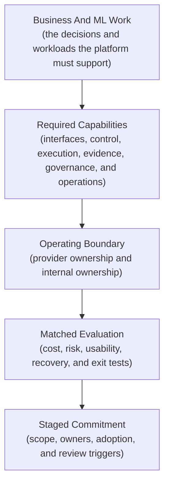
```mermaid
flowchart TD
    Need["Business And ML Work<br/>(the decisions and workloads the platform must support)"] --> Capabilities["Required Capabilities<br/>(interfaces, control, execution, evidence, governance, and operations)"]
    Capabilities --> Boundary["Operating Boundary<br/>(provider ownership and internal ownership)"]
    Boundary --> Evidence["Matched Evaluation<br/>(cost, risk, usability, recovery, and exit tests)"]
    Evidence --> Decision["Staged Commitment<br/>(scope, owners, adoption, and review triggers)"]
```

The choice therefore comes after the required work is understood. Starting from a vendor comparison encourages feature shopping. Starting from operating responsibilities reveals which capabilities matter, who can own them, and how the decision can be tested.


*The organization can place a different operating boundary around training, evidence, serving, governance, and operations. The four delivery models describe common ownership patterns rather than one universal answer.*

## List The ML Workloads The Platform Must Support
<!-- section-summary: A workload inventory and capability map describe real user journeys, constraints, evidence, and service expectations before products enter the discussion. -->

The evaluation starts with a **workload inventory**. This is a short record of the ML work the organization expects the platform to support. It describes workload shape rather than listing every existing script.

Suppose the organization has three common journeys. A weekly CPU training pipeline reads governed warehouse tables and publishes one candidate model. A distributed GPU job fine-tunes a large model and needs checkpoint recovery. A low-latency endpoint serves thousands of requests per second and must roll back within ten minutes. These journeys need different compute, orchestration, evidence, and reliability.

For each journey, capture who uses it and how often it runs. Record where its data lives and how large the workload is. Add the accelerator and runtime requirements, output, production consequence, recovery target, and current pain.

Include difficult work that is likely to influence the architecture. A platform pilot built only around a small scikit-learn notebook will reveal little about private networking, large artifacts, queue policy, or serving recovery.

Next, translate the journeys into a **capability map**. The map describes outcomes the platform must provide:

- **Development interface** gives a team a reviewed way to define and test its work.
- **Lifecycle control** coordinates data preparation, training, evaluation, release, and status.
- **Execution** supplies suitable CPU, GPU, distributed, batch, and online runtimes.
- **Evidence** connects source, data, runs, models, evaluations, approvals, and deployments.
- **Governance** applies identity, data access, policy, audit, and environment boundaries.
- **Operations** covers telemetry, capacity, cost, recovery, support, and service ownership.

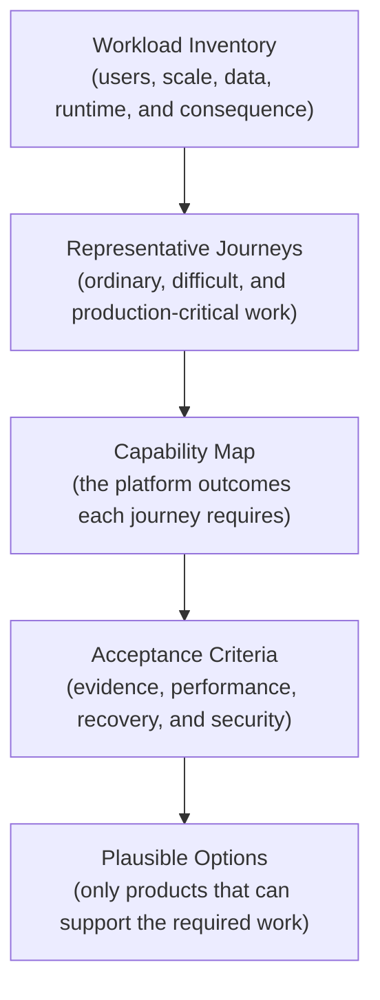
```mermaid
flowchart TD
    Inventory["Workload Inventory<br/>(users, scale, data, runtime, and consequence)"] --> Journeys["Representative Journeys<br/>(ordinary, difficult, and production-critical work)"]
    Journeys --> Capabilities["Capability Map<br/>(the platform outcomes each journey requires)"]
    Capabilities --> Criteria["Acceptance Criteria<br/>(evidence, performance, recovery, and security)"]
    Criteria --> Options["Plausible Options<br/>(only products that can support the required work)"]
```

Write acceptance criteria as observable results. “Has monitoring” is too vague. “Exports endpoint latency, error, saturation, model version, and request correlation into the operating team’s telemetry system” can be demonstrated. Private data access, separate identities, an approval record, and an exportable audit trail provide a concrete governance test.

This map also prevents unnecessary replacement. A team may already have strong identity, lakehouse data, workflow orchestration, and observability. The platform decision can preserve those systems and fill the missing ML lifecycle connections.

## Decide Which Capabilities Need Custom Design
<!-- section-summary: The organization should invest internal engineering in capabilities that express unique product or risk needs and prefer proven services for repeated infrastructure work. -->

Some platform capabilities express how the organization competes or manages a distinctive risk. Others solve common infrastructure problems that many providers already handle well.

A capability is **differentiating** if its behaviour is closely tied to the product, operating model, or a constraint that standard services cannot satisfy. A marketplace may need a release policy that evaluates quality separately for buyers and sellers. A medical workflow may require a reviewed evidence packet and a human decision before a model can influence care. A trading system may require a specialized latency path and deterministic fallback.

Commodity work is repeated machinery whose details rarely create product value. Provisioning an ordinary training worker, storing an immutable artifact, rotating service credentials, or keeping a metadata database available often fits this category. Mature managed services can reduce setup and operating work here.

The label depends on the organization. GPU scheduling can be ordinary for a team that runs a few managed jobs. It may be strategic for a research lab with thousands of accelerators, custom network topology, and a scheduler that directly affects research throughput. The same technical capability belongs on a different side of the boundary because the scale and consequence differ.

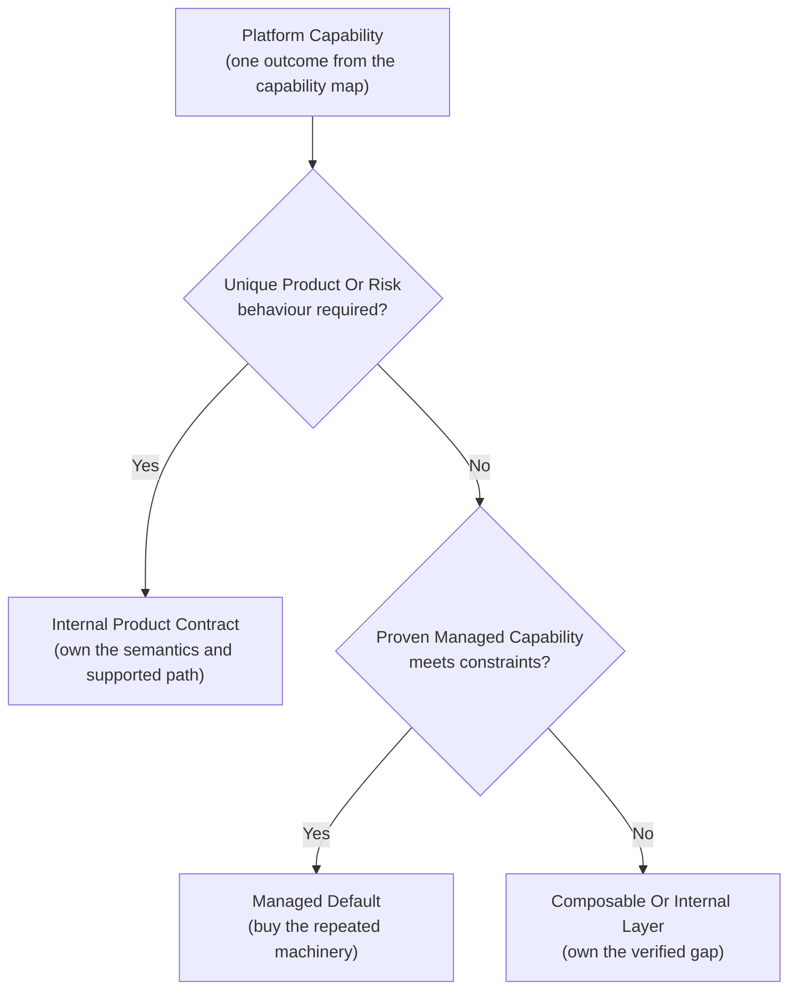
```mermaid
flowchart TD
    Capability["Platform Capability<br/>(one outcome from the capability map)"] --> ProductFit{"Unique Product Or Risk<br/>behaviour required?"}
    ProductFit -->|Yes| InternalContract["Internal Product Contract<br/>(own the semantics and supported path)"]
    ProductFit -->|No| ProvenService{"Proven Managed Capability<br/>meets constraints?"}
    ProvenService -->|Yes| ManagedDefault["Managed Default<br/>(buy the repeated machinery)"]
    ProvenService -->|No| Compose["Composable Or Internal Layer<br/>(own the verified gap)"]

    class InternalContract,Compose custom
```

This analysis should name the exact gap. “We need flexibility” gives no design direction. “The managed trainer cannot schedule our required accelerator topology” identifies a testable reason to operate a different execution layer. Internal work then stays focused on the gap instead of recreating an entire suite.

## Decide What The Provider And Internal Team Will Operate
<!-- section-summary: The operating boundary assigns configuration, patching, scaling, security, recovery, support, and product responsibilities for every capability. -->

The **operating boundary** separates provider work from customer work. Marketing categories such as fully managed or cloud native do not define that boundary precisely enough. The evaluation must examine each capability.

Take managed model serving. The provider may provision hosts, replace failed machines, autoscale replicas, and expose endpoint metrics. The customer usually supplies the model package and dependency contract. It configures network access, authentication, scaling limits, traffic policy, alerts, and cost controls. The model team owns prediction quality and the application owns user-facing fallback.

Now take self-managed MLflow on Kubernetes. The project supplies tracking and registry software. The internal team owns the database, artifact store, identity integration, upgrades, backups, availability, SDK compatibility, monitoring, and incident response. Open-source licensing removes a subscription fee; it does not remove those operating duties.

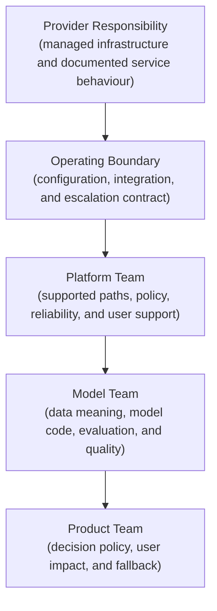
```mermaid
flowchart TD
    Provider["Provider Responsibility<br/>(managed infrastructure and documented service behaviour)"] --> Boundary["Operating Boundary<br/>(configuration, integration, and escalation contract)"]
    Boundary --> PlatformTeam["Platform Team<br/>(supported paths, policy, reliability, and user support)"]
    PlatformTeam --> ModelTeam["Model Team<br/>(data meaning, model code, evaluation, and quality)"]
    ModelTeam --> ProductTeam["Product Team<br/>(decision policy, user impact, and fallback)"]

    class Boundary boundary
```

For every capability, name who handles setup, routine operation, security patches, and capacity. Assign backups, user support, incident response, and recovery testing too.

Add vendor escalation where a managed service is involved. An internal owner still needs enough evidence to decide whether the fault lies in customer configuration or provider infrastructure.

Ownership includes time. A team may have the skill to build a controller during a quarter and lack the staffing to maintain it for three years. The credible boundary is the one the organization can fund through upgrades, staff changes, security events, and production incidents.

## Compare Total Cost With Team Capacity
<!-- section-summary: Total cost combines consumption, infrastructure, engineering, support, migration, reliability risk, and the work delayed by platform ownership. -->

Subscription price and cloud compute are only part of platform cost. A useful comparison covers the complete operating period, often three years, and models growth rather than the first pilot month.

For a managed option, include subscription or consumption charges, storage, network transfer, idle endpoint capacity, observability, premium security features, support, and internal integration. For an internal option, include infrastructure plus platform engineers, security work, upgrades, on-call, user support, backup and recovery, and capacity planning.

Team capacity turns those numbers into a delivery decision. Four platform engineers assigned to a custom training layer are four engineers unavailable for data quality, evaluation, monitoring, or product integration. That **opportunity cost** may dominate the invoice difference.

Consider two serving options. A managed endpoint costs more per replica-hour and gives the team autoscaling, host recovery, deployment APIs, logs, and provider support. A Kubernetes service has a lower raw compute rate because it shares an existing cluster. The internal cost also includes serving-controller upgrades, image patching, accelerator scheduling, traffic management, dashboards, and on-call. A fair model compares the complete service delivered to users.

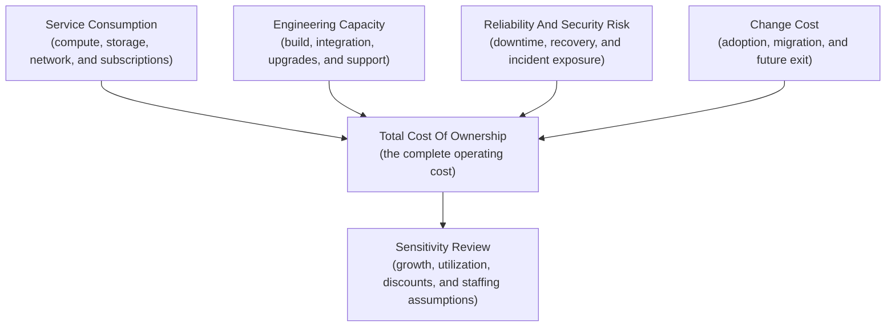
```mermaid
flowchart TD
    Consumption["Service Consumption<br/>(compute, storage, network, and subscriptions)"] --> TCO["Total Cost Of Ownership<br/>(the complete operating cost)"]
    Engineering["Engineering Capacity<br/>(build, integration, upgrades, and support)"] --> TCO
    Risk["Reliability And Security Risk<br/>(downtime, recovery, and incident exposure)"] --> TCO
    Migration["Change Cost<br/>(adoption, migration, and future exit)"] --> TCO
    TCO --> Sensitivity["Sensitivity Review<br/>(growth, utilization, discounts, and staffing assumptions)"]
```

Use ranges instead of one precise number. Model low, expected, and high workload growth. Test GPU utilization, endpoint idle time, storage retention, vendor discounts, support load, and staffing assumptions. The decision should identify which assumption could reverse the result.

## Check Every Integration Between Platform Components
<!-- section-summary: Integration seams are the handoffs where identity, state, data, evidence, and ownership move between platform components. -->

A **seam** is the handoff between two parts of the platform. Composable platforms have visible seams between the orchestrator, compute service, experiment tracker, registry, deployment system, and observability backend. Integrated managed platforms have seams too, especially where they meet the organization’s source control, data platform, identity provider, application, and incident process.

The important question is what must survive each handoff. A training request carries source and data identity into the execution service. The completed run carries its model and metrics into evaluation. A release carries the approved model into serving. Production telemetry carries the deployed version and request identity into investigation.

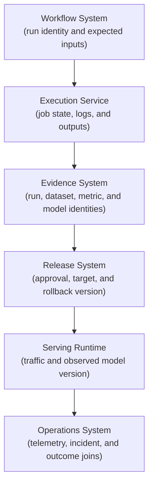
```mermaid
flowchart TD
    Workflow["Workflow System<br/>(run identity and expected inputs)"] --> Compute["Execution Service<br/>(job state, logs, and outputs)"]
    Compute --> Tracking["Evidence System<br/>(run, dataset, metric, and model identities)"]
    Tracking --> Release["Release System<br/>(approval, target, and rollback version)"]
    Release --> Serving["Serving Runtime<br/>(traffic and observed model version)"]
    Serving --> Operations["Operations System<br/>(telemetry, incident, and outcome joins)"]

    class Compute,Release seam
```

Suppose a managed training job succeeds, yet its artifact upload fails. The orchestrator may show a green compute step while the registry has no usable model. The seam needs an output contract and a publication status. A retry must avoid creating two competing model versions. The incident also needs a named owner across the workflow and artifact services.

Evaluate seams through failure, not only the happy path. Expire a credential during a job. Block artifact storage. Cancel a workflow during checkpoint publication. Remove endpoint capacity during rollout. The evidence should identify the failed boundary, retain the operation identity, and support a safe retry or rollback.

Integration effort continues after launch. APIs change, SDKs move, identity policies evolve, and each system follows its own maintenance cycle. A composable design earns its flexibility only if the organization can operate these contracts reliably.

## Protect Data And Compliance Boundaries
<!-- section-summary: Platform evaluation must trace sensitive data, identities, network paths, encryption, audit evidence, and decision responsibility through the complete lifecycle. -->

Data location can remove options before a pilot begins. Large governed datasets often live in a warehouse, lakehouse, or object store with established permissions and retention. Copying them into another cloud or vendor-controlled store adds transfer cost, lifecycle work, and another security boundary.

Trace the data path from authoritative source through feature preparation, training, artifacts, serving, prediction logs, and outcomes. Record which system stores each copy, which identity reads it, which region processes it, how long it remains, and which audit trail proves the access.

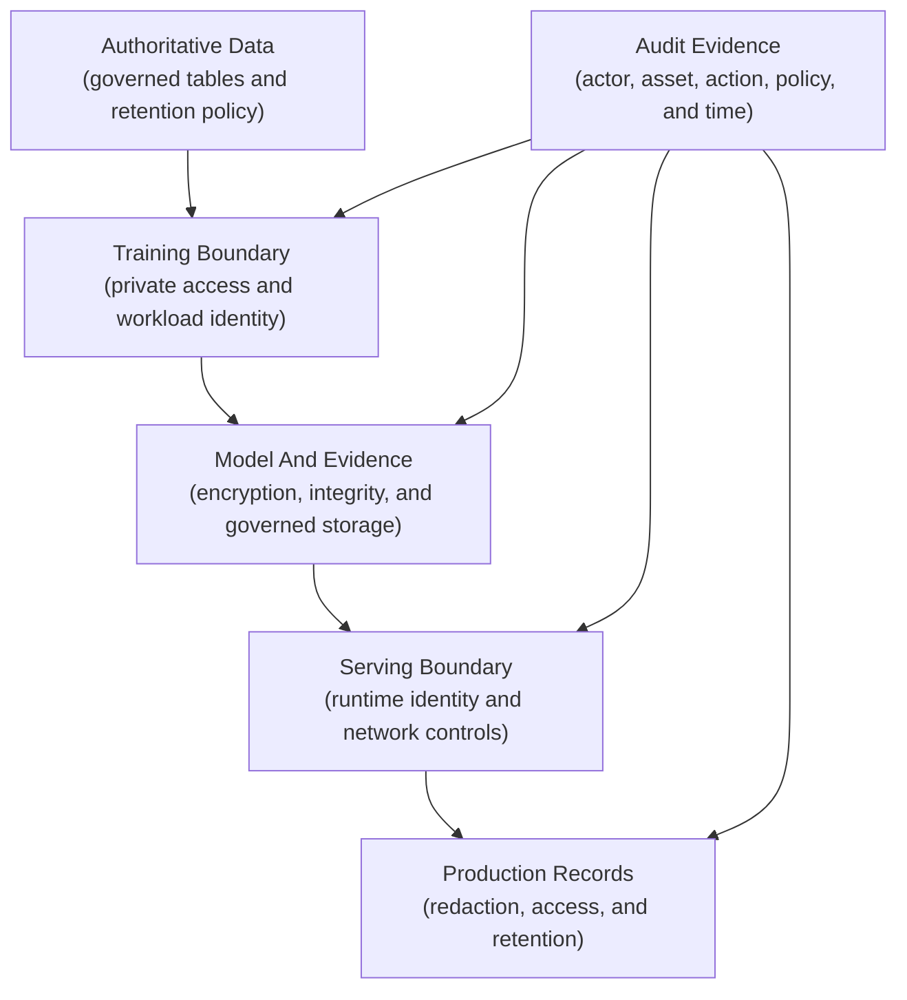
```mermaid
flowchart TD
    Source["Authoritative Data<br/>(governed tables and retention policy)"] --> Training["Training Boundary<br/>(private access and workload identity)"]
    Training --> Artifact["Model And Evidence<br/>(encryption, integrity, and governed storage)"]
    Artifact --> Serving["Serving Boundary<br/>(runtime identity and network controls)"]
    Serving --> Logs["Production Records<br/>(redaction, access, and retention)"]
    Audit["Audit Evidence<br/>(actor, asset, action, policy, and time)"] --> Training
    Audit --> Artifact
    Audit --> Serving
    Audit --> Logs
```

Supplier certifications support vendor review. The organization still decides whether a particular data use, model, approval process, and production action meets its obligations. Cloud shared-responsibility guidance makes the same boundary explicit: the provider secures managed infrastructure, while the customer owns content, configuration, access, and service-specific use.

Test concrete controls. Verify private network paths with egress blocked. Use workload identity instead of long-lived keys. Confirm customer-managed encryption requirements, regional availability, audit export, deletion, backup, and legal retention. Review subprocessors and incident-notification terms through the organization’s supplier process.

Open-source components change the supplier shape. The internal team owns vulnerability response, provenance, patching, version policy, and end-of-life planning. A larger stack increases the number of components that security and operations must follow.

## Test How The Team Would Leave Or Replace The Platform
<!-- section-summary: Lock-in is the measured cost of moving data, metadata, runtime behaviour, workflows, identities, and operating knowledge to another implementation. -->

**Lock-in** is the cost and difficulty of changing the chosen platform. Every production system creates some coupling. The useful question is which coupling protects valuable capability and which coupling creates an expensive future constraint.

Data lock-in appears through proprietary storage or difficult export. Metadata lock-in appears if runs, lineage, approvals, or audit history cannot be reconstructed elsewhere. Runtime lock-in appears through provider-specific model packaging, feature services, endpoint behaviour, or accelerators. Operational lock-in appears through dashboards, alerts, runbooks, and staff knowledge.

Standards can reduce specific parts of the move. OCI images can preserve a container package. OpenTelemetry can preserve an instrumentation interface. Delta Lake or Apache Iceberg can make table data accessible through multiple engines. MLflow APIs can preserve common experiment and model interactions. Each standard protects one boundary; the team must still test semantics, permissions, history, and production behaviour.

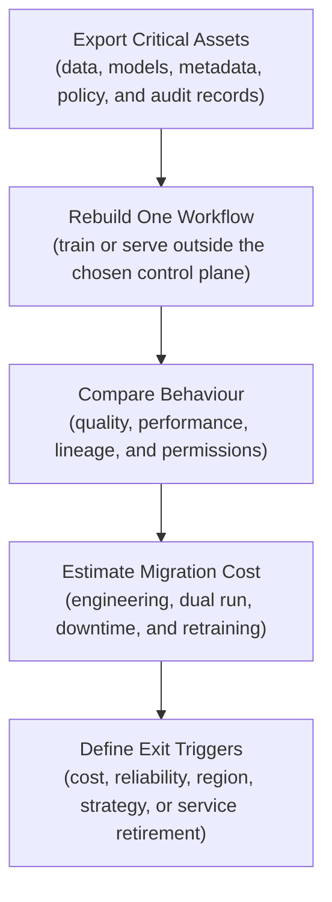
```mermaid
flowchart TD
    Export["Export Critical Assets<br/>(data, models, metadata, policy, and audit records)"] --> Rebuild["Rebuild One Workflow<br/>(train or serve outside the chosen control plane)"]
    Rebuild --> Compare["Compare Behaviour<br/>(quality, performance, lineage, and permissions)"]
    Compare --> Estimate["Estimate Migration Cost<br/>(engineering, dual run, downtime, and retraining)"]
    Estimate --> Trigger["Define Exit Triggers<br/>(cost, reliability, region, strategy, or service retirement)"]

    class Rebuild,Compare test
```

Run a small exit test during evaluation. Export one model with its environment and evidence. Reconstruct one training run or serve the model through a second runtime. Compare predictions, schema handling, latency, identity, and audit records. Record the manual conversion work.

The exit plan can move one layer at a time. An organization may keep managed training and replace serving, or keep lakehouse data and replace the workflow control plane. Clear seams and stable identifiers make staged migration possible. Internal platforms need the same plan because maintainers can leave and open-source projects can change direction.

## Compare Four Practical Platform Delivery Models
<!-- section-summary: Managed, composable, internal, and hybrid platforms place the operating boundary differently and fit different constraints. -->

A **delivery model** describes how platform responsibilities are bundled and who operates the bundle. It gives the evaluation a small set of plausible architectures instead of a long list of products. Managed, composable, internal, and hybrid models place the boundary differently.

The earlier analysis determines which models deserve a pilot. A team with governed lakehouse data and ordinary training may test an integrated managed platform. A team with a mature Kubernetes estate and specialized accelerators may test a composable execution layer. Product selection now answers a defined ownership problem.

### Use A Managed Platform

A managed platform places more control and execution services with one provider. Current examples include Amazon SageMaker AI, Azure Machine Learning, Google Cloud’s Gemini Enterprise Agent Platform (formerly Vertex AI), and Databricks. They provide different combinations of managed training, pipelines, model records, governance, and endpoints.

This model fits teams centered on one cloud or lakehouse whose ordinary workloads match the provider’s supported paths. It can reduce infrastructure operation and connect identity, storage, telemetry, and support through existing enterprise agreements. Provider limits, quotas, regions, pricing, and lifecycle APIs become part of the design.

### Build A Composable Platform

A composable platform selects services by responsibility. A common stack may use GitHub Actions for repository automation, Airflow or Dagster for workflows, managed cloud jobs or Kubernetes for execution, Ray for specialized distributed work, MLflow 3 for experiment and model records, and object storage with Delta Lake or Apache Iceberg. OpenTelemetry with cloud monitoring or Prometheus and Grafana commonly supports operations. Terraform manages cloud resources; Argo CD or Flux often manages Kubernetes delivery.

This model fits a strong existing platform estate, a need for specialized runtimes, or a genuine portability requirement. The internal team owns more seams, upgrades, and end-to-end reliability.

### Add An Internal Product Layer

An internal product layer gives users company-specific interfaces over either managed or composable services. A CLI might submit a governed training request to SageMaker AI today and another execution backend later. The internal contract can enforce ownership, data references, evaluation evidence, cost tags, and release policy.

This layer is often the part worth building because it captures the organization’s workflow and risk decisions. It should stay thin enough to preserve the provider capabilities underneath.

### Combine Provider And Internal Systems

Many organizations use a hybrid boundary. They may keep data and features in Databricks, run specialized training on Kubernetes, store model evidence in MLflow 3, and use a cloud managed endpoint for production. Another team may use managed training and registry while retaining an existing internal serving platform.

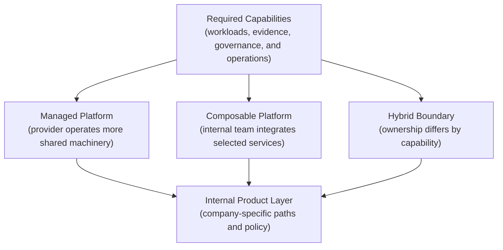
```mermaid
flowchart TD
    Requirements["Required Capabilities<br/>(workloads, evidence, governance, and operations)"] --> Managed["Managed Platform<br/>(provider operates more shared machinery)"]
    Requirements --> Composable["Composable Platform<br/>(internal team integrates selected services)"]
    Requirements --> Hybrid["Hybrid Boundary<br/>(ownership differs by capability)"]
    Managed --> Product["Internal Product Layer<br/>(company-specific paths and policy)"]
    Composable --> Product
    Hybrid --> Product

    class Product product
```

The hybrid design should have a reason for each boundary. A collection of tools assembled through historical accident creates operating cost without deliberate flexibility.

## Run A Fair Platform Pilot
<!-- section-summary: A fair pilot runs the same representative work, failure tests, evidence requirements, and exit exercise across every plausible option. -->

A polished demo proves that a happy path can work. A useful pilot tests the claims most likely to change the decision.

Choose a small set of representative journeys from the workload inventory. Include one ordinary pipeline so daily usability is visible. Include the hardest expected workload, such as distributed GPU training or a strict private-data path. Include one production release, serving, or governance journey that exercises approval, telemetry, and recovery.

Keep the comparison matched. Use the same model, data volume, source revision, network restrictions, quality checks, service targets, failure injections, and team time. Give each option the same opportunity to use its supported path. Record provider help and internal engineering separately because expert assistance can hide the steady-state support burden.

The pilot should collect evidence in five passes:

1. **Complete the journey.** Measure setup effort, time to first run, repeatability, and user intervention.
2. **Inspect the records.** Connect source, data, run, model, evaluation, approval, deployment, and telemetry.
3. **Inject failure.** Exhaust quota, stop a worker, block artifact publication, or trigger a rollout stop rule. Measure diagnosis and recovery.
4. **Operate the service.** Inspect alerts, capacity, unit cost, support path, and the work required for an upgrade.
5. **Exercise exit.** Export one complete asset chain and run part of the workflow through another implementation.

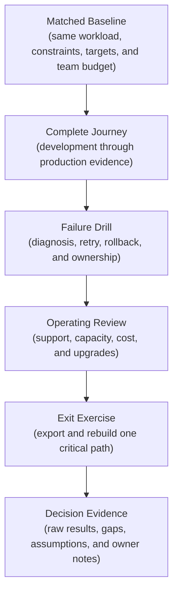
```mermaid
flowchart TD
    Baseline["Matched Baseline<br/>(same workload, constraints, targets, and team budget)"] --> Journey["Complete Journey<br/>(development through production evidence)"]
    Journey --> Failure["Failure Drill<br/>(diagnosis, retry, rollback, and ownership)"]
    Failure --> Operations["Operating Review<br/>(support, capacity, cost, and upgrades)"]
    Operations --> Exit["Exit Exercise<br/>(export and rebuild one critical path)"]
    Exit --> Evidence["Decision Evidence<br/>(raw results, gaps, assumptions, and owner notes)"]

    class Failure,Exit test
```

Define pass criteria before running the options. A private path passes only after network and audit evidence proves the required route. A rollback passes only after the previous complete release serves known fixtures within the recovery target. A traceability test passes only after an operator can reconstruct the release without consulting the people who built the pilot.

Record raw timings, logs, resource identities, support interactions, duplicate side effects, and manual steps. Feature checkmarks cannot show how much integration or operational work the organization inherits.


*A fair pilot gives both options the same workload, data, constraints, targets, and team budget. Decision evidence is collected only after both options complete the same five checks.*

## Define Who Owns And Operates The Platform
<!-- section-summary: The final decision records scope, ownership, evidence, exceptions, costs, exit triggers, and review dates so the commitment can be operated. -->

Every platform choice has an **operating model**. This names the platform product owner and service owners. It assigns the security partner, cost owner, support route, on-call boundary, vendor escalation, and model-team responsibilities.

The operating model also describes which paths receive full support and how teams request an exception.

The decision record should explain why the selected boundary fits the current workloads and team. It should preserve rejected options, pilot evidence, key assumptions, and the trigger for review. A concise record might use this structure:

```yaml
decision:
  scope: training-and-model-evidence
  selectedBoundary: managed-training-with-internal-release-path
  providerOwns:
    - worker-provisioning
    - host-recovery
  platformTeamOwns:
    - workload-contract
    - identity-integration
    - release-policy
    - support-and-escalation
  evidence:
    pilotRun: platform-evaluation-17
    exitTest: artifact-and-run-export-passed
  reviewTriggers:
    - unsupported-accelerator-demand
    - queue-slo-missed-for-two-review-periods
    - forecast-cost-exceeds-approved-range
```

The record avoids a vague declaration such as “we chose managed MLOps.” It identifies which responsibilities moved to the provider and which stayed inside. A different serving decision can live beside it without changing the training boundary.

Exceptions need owners and expiry. If one research team receives direct cluster access for an unsupported accelerator, record the risk, support limit, and review point. Repeated exceptions are evidence that the capability map or chosen boundary needs revision.

## Adopt The Platform In Stages
<!-- section-summary: Staged adoption proves one complete path, expands through measured demand, and keeps migration and reversal manageable. -->

Start with one complete journey for a small group of representative teams. Give them governed data access, training, evidence, release, telemetry, support, and recovery. A narrow complete path teaches more than ten disconnected platform features.

Measure where users leave the path, copy credentials, create untracked artifacts, or wait for platform engineers. Improve those gaps before inviting the whole organization. Migrate a second workload with a different shape to test whether the interfaces generalize.

Expand through repeated demand. Add a feature-store capability after several teams need consistent online and offline features. Add specialized Kubernetes scheduling after managed jobs fail a proven topology or capacity requirement. Add another serving profile after a production workload demonstrates a distinct latency or scaling need.

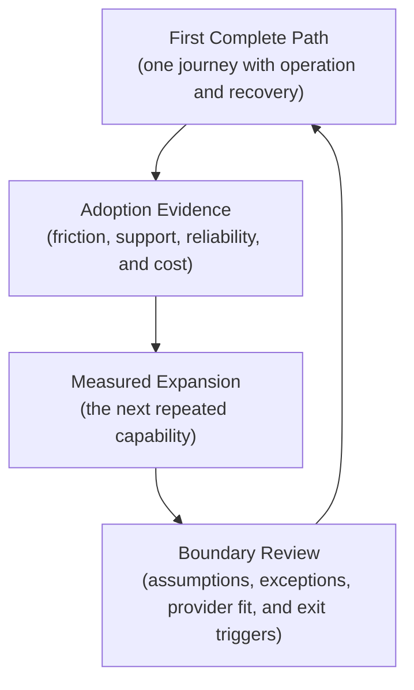
```mermaid
flowchart TD
    First["First Complete Path<br/>(one journey with operation and recovery)"] --> Observe["Adoption Evidence<br/>(friction, support, reliability, and cost)"]
    Observe --> Expand["Measured Expansion<br/>(the next repeated capability)"]
    Expand --> Review["Boundary Review<br/>(assumptions, exceptions, provider fit, and exit triggers)"]
    Review --> First

    class Review review
```

Review the operating boundary on a regular cadence and after major triggers. Workload scale may change. A managed service may add a missing capability. An internal component may lose maintainers. The decision remains useful because its evidence and assumptions show exactly what should be reconsidered.

## The Main Idea
<!-- section-summary: A sound platform choice assigns each capability to an owner through workload evidence, operating cost, boundary constraints, and a tested exit path. -->

Build versus buy has no single answer for the whole ML platform. The organization chooses an operating boundary for each capability. Required workloads and evidence define the problem. Differentiation, constraints, team capacity, total cost, integration seams, compliance, and exit cost shape the plausible options.

A matched pilot then tests the risky claims through real work, failure, recovery, operation, and export. The final decision names who owns each responsibility and stages adoption around complete user journeys. This approach produces a platform the organization can operate, rather than a collection of products it has purchased or installed.


*The decision process identifies the required work, assigns a practical boundary, tests it through a matched pilot, compares total cost, records ownership and exit triggers, and expands only after one complete path works.*

## References

- [CNCF Platform Engineering Technical Community Group](https://contribute.cncf.io/community/tcgs/platform-engineering/)
- [Amazon SageMaker AI security and shared responsibility](https://docs.aws.amazon.com/sagemaker/latest/dg/security.html)
- [Amazon SageMaker AI training](https://docs.aws.amazon.com/sagemaker/latest/dg/train-model.html)
- [Azure Machine Learning pipelines](https://learn.microsoft.com/en-us/azure/machine-learning/concept-ml-pipelines?view=azureml-api-2)
- [Azure Machine Learning managed online endpoints](https://learn.microsoft.com/en-us/azure/machine-learning/concept-endpoints-online?view=azureml-api-2)
- [Google Cloud Gemini Enterprise Agent Platform training pipelines](https://docs.cloud.google.com/gemini-enterprise-agent-platform/machine-learning/training/create-training-pipeline)
- [Google Cloud Gemini Enterprise Agent Platform Pipelines](https://docs.cloud.google.com/gemini-enterprise-agent-platform/machine-learning/pipelines/introduction)
- [Databricks machine learning](https://docs.databricks.com/aws/en/machine-learning/)
- [Databricks reference architectures](https://docs.databricks.com/aws/en/lakehouse-architecture/reference)
- [MLflow 3 Tracking](https://mlflow.org/docs/latest/ml/tracking/)
- [OpenTelemetry overview](https://opentelemetry.io/docs/what-is-opentelemetry/)
- [Open Container Initiative specifications](https://specs.opencontainers.org/)
- [Delta Lake](https://docs.delta.io/)
- [Apache Iceberg](https://iceberg.apache.org/docs/latest/)
- [FinOps Framework](https://www.finops.org/framework/)
