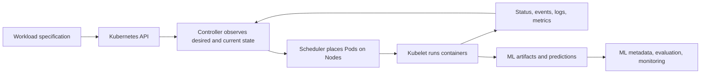
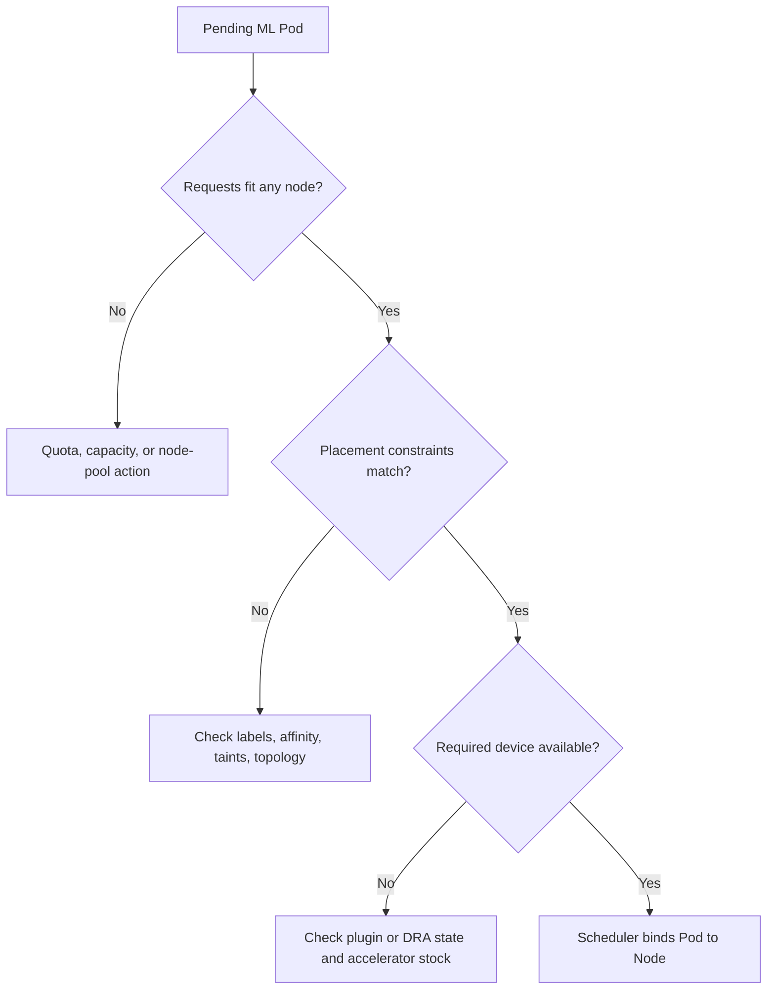

**Kubernetes** is a platform for declaring and operating containerized workloads across a cluster of machines. It can run training jobs, data preparation, batch inference, model APIs, notebook environments, and ML platform services on one programmable control plane.

Kubernetes does not understand model quality, datasets, experiments, or approvals on its own. It understands API objects, containers, resources, scheduling, networking, storage, and desired state. An ML platform adds the domain layer around those primitives: pipeline metadata, artifact identity, model registry, evaluation gates, feature contracts, and prediction monitoring.

This boundary explains both the appeal and the cost. Kubernetes gives a team powerful, portable infrastructure abstractions. The team has to assemble them into a coherent ML developer and operator experience.

## Start With The Control Loop
<!-- section-summary: Kubernetes continuously reconciles declared workload state with cluster state, while ML systems add data, model, and release semantics around that loop. -->

Kubernetes is built around **reconciliation**. You submit an object that describes desired state. Controllers observe the current state and take actions that move it toward the declaration.



The Kubernetes loop answers infrastructure questions: did the Pod start, did a Job finish, are enough serving replicas ready, did the container exceed memory, can a replacement run? The ML layer answers domain questions: which data trained the model, did evaluation pass, which version is loaded, are predictions useful, should the release continue?

A green Kubernetes Deployment can serve a bad model. A failed training Job can leave a valid checkpoint in object storage. A restarted Pod can repeat a side effect if the application was not designed for retries. Kubernetes keeps infrastructure converging; application and ML correctness remain explicit engineering work.

## Match The Controller To The Workload Lifecycle
<!-- section-summary: Jobs, CronJobs, and Deployments encode different completion and availability goals, so the workload's lifecycle should choose the object. -->

The first design decision is the workload's desired end state.

| ML workload | Desired state | Main Kubernetes object | Important semantics |
| --- | --- | --- | --- |
| One training run | Complete successfully once | `Job` | retries, deadline, completion, cleanup |
| Scheduled scoring or retraining | Create Jobs on a schedule | `CronJob` | concurrency policy, missed runs, time zone, idempotency |
| Online model API | Keep replicas available | `Deployment` | readiness, rolling update, scaling, rollback |
| Stable identity or attached volume per replica | Preserve ordered identity | `StatefulSet` | stable network identity and persistent volumes |
| Node-level driver or telemetry | Run on selected nodes | `DaemonSet` | one Pod per matching node |

A **Pod** is the smallest deployable compute unit, but production systems usually declare a higher-level controller. If a training Pod disappears after a node failure, a bare Pod does not express the desired completion behaviour as clearly as a Job. If an inference Pod fails, a Deployment maintains the desired replica count and supports rollout strategies.

This is the first ML-specific lesson: retries happen at several layers. Kubernetes may replace a Pod. A workflow engine may retry the task. The training program may resume from a checkpoint. Each layer needs a distinct policy, and the combined maximum must stay bounded.

## A Training Job Is An Execution Contract
<!-- section-summary: A training Job declares completion, resources, identity, inputs, outputs, and recovery behaviour around a containerized training program. -->

A training Job should answer six questions:

1. Which immutable container runs?
2. Which data snapshot and configuration does it consume?
3. Which CPU, memory, and accelerators does it request?
4. Which identity may read inputs and write outputs?
5. Where do checkpoints and final artifacts survive Pod loss?
6. When should the platform retry, stop, or clean up?

One focused manifest shows those boundaries:

```yaml
apiVersion: batch/v1
kind: Job
metadata:
  name: demand-train-20260715-a1b2c3d
  namespace: ml-training
  labels:
    ml.example.com/run-id: demand-20260715-a1b2c3d
spec:
  backoffLimit: 2
  activeDeadlineSeconds: 14400
  ttlSecondsAfterFinished: 86400
  template:
    spec:
      serviceAccountName: demand-trainer
      restartPolicy: Never
      containers:
        - name: trainer
          image: registry.example.com/demand-trainer@sha256:7c8d...
          args:
            - --dataset=s3://ml-prod/demand/snapshots/2026-07-14/
            - --output=s3://ml-prod/demand/runs/demand-20260715-a1b2c3d/
          resources:
            requests:
              cpu: "4"
              memory: 16Gi
              nvidia.com/gpu: "1"
            limits:
              memory: 24Gi
              nvidia.com/gpu: "1"
```

The manifest pins the image by digest, names an immutable-looking input and run-specific output, sets a deadline and retry bound, requests a GPU, and assigns a dedicated service account. It deliberately keeps model hyperparameters outside the Kubernetes explanation; they belong in a versioned training configuration linked to the same run ID.

`backoffLimit` controls Job-level retries after failed Pods. A retry is useful only if the program can safely run again. Write artifacts to a run-specific prefix, use atomic completion markers, and check existing checkpoints before recomputing. Avoid appending duplicate rows or overwriting a shared `latest` path on every attempt.

## Scheduling Is A Resource-Matching Problem
<!-- section-summary: Kubernetes schedules Pods from declared requests and cluster availability; accelerators, topology, and queues add constraints that the platform must expose clearly. -->

The scheduler places a Pod on a node that can satisfy its **resource requests** and placement constraints. CPU and memory requests influence placement. Limits constrain runtime consumption; memory overuse can lead to `OOMKilled`, while CPU is generally throttled.

ML workloads make scheduling harder because resources are heterogeneous. GPU type, GPU memory, local storage, interconnect, architecture, and zone can affect whether a job can run efficiently. Device plugins have traditionally advertise resources such as `nvidia.com/gpu`. Kubernetes is also developing **Dynamic Resource Allocation (DRA)** for richer device requests. Current feature maturity varies by Kubernetes release and cluster provider, so production platform contracts should state which mechanism and APIs they support.



Requests should come from measurements. Under-requesting memory makes scheduling look efficient until processes are killed. Over-requesting GPUs leaves expensive capacity idle and delays other work. Record actual use, queue time, failure rate, and cost by workload class, then tune platform defaults.

Placement tools have different purposes:

- **node selectors and node affinity** choose compatible node characteristics;
- **taints and tolerations** reserve specialised pools and prevent accidental placement;
- **pod affinity or anti-affinity** expresses relationships between Pods;
- **topology spread constraints** distribute replicas across failure domains;
- **priority classes** influence which workloads run first under pressure.

These controls can interact. A Pod requesting a GPU, requiring one zone, tolerating only a specialised taint, and demanding strict affinity may be unschedulable even when the cluster has spare GPUs elsewhere. The platform should expose the reason through events and queue status.

## Queues Turn Scarce Compute Into A Policy
<!-- section-summary: Queueing separates workload admission from Pod placement so teams can share scarce accelerators using quotas, priorities, and fair access. -->

The default scheduler answers “where can this Pod run now?” An ML platform also needs “which workload should receive scarce capacity next?” Submitting every training Pod directly can create first-come-first-served contention, unpredictable wait times, and poor accelerator use.

**Kueue** adds admission and quota management for batch, AI, and HPC workloads. A workload can remain suspended until its queue has capacity. Cluster queues, local queues, resource flavours, cohorts, and priorities express organisational policy. After admission, the normal scheduler places the Pods.

Distributed training may require several workers to start together. If only some start, allocated GPUs can wait idle while the remaining workers are unscheduled. Higher-level controllers such as Kubeflow Trainer, JobSet, and Ray operators combine with queueing and gang-scheduling mechanisms to manage these groups. Kubernetes 1.36 also includes alpha native Workload and PodGroup integration for qualifying parallel Jobs; alpha features should not be assumed as the baseline for every managed cluster.

Queue policy belongs in the platform's product design. Users should know the queue, priority, requested resources, admission reason, expected wait, and how to cancel. Platform owners should know utilisation, fairness, preemption impact, and which teams consume reserved or borrowed quota.

## Serving Uses Availability And Readiness Contracts
<!-- section-summary: A model-serving Deployment keeps interchangeable replicas available, while readiness, traffic policy, and model-version evidence protect releases. -->

An online model server usually runs as a **Deployment** behind a Service or gateway. The Deployment maintains replicas and replaces Pods during updates. Kubernetes readiness decides when a Pod may receive traffic; it should stay false until the model and required runtime state are loaded.

```yaml
apiVersion: apps/v1
kind: Deployment
metadata:
  name: demand-api
  namespace: ml-serving
spec:
  replicas: 3
  strategy:
    type: RollingUpdate
    rollingUpdate:
      maxUnavailable: 0
      maxSurge: 1
  template:
    metadata:
      labels:
        app: demand-api
        ml.example.com/model-version: "42"
    spec:
      serviceAccountName: demand-api
      containers:
        - name: server
          image: registry.example.com/demand-api@sha256:91ab...
          readinessProbe:
            httpGet:
              path: /ready
              port: 8080
          resources:
            requests: {cpu: "1", memory: 2Gi}
            limits: {memory: 4Gi}
```

Readiness should validate that the server can answer with the intended model, not merely that the process opened a port. Liveness should detect an unrecoverable process state without causing restart loops during slow model loading. Startup probes can protect slow initialisation.

A plain rolling update controls replica replacement. It does not provide semantic canary analysis. Traffic splitting and automated analysis may come from a service mesh, gateway, progressive-delivery controller, or application router. Keep the previous model and deployment state available until model and product guardrails pass.

Horizontal Pod Autoscaling can react to CPU, memory, or custom metrics. For inference, queue depth, concurrent requests, or tokens per second may track demand better than CPU. Scaling also depends on model load time and accelerator availability. A target that asks for ten replicas is ineffective when the node pool needs fifteen minutes to add GPUs.

## Keep Durable Artifacts Outside Ephemeral Pods
<!-- section-summary: Pods are replaceable, so datasets, checkpoints, model artifacts, and run metadata need durable stores and explicit identities. -->

Container filesystems and `emptyDir` volumes are ephemeral. Use object storage for datasets, checkpoints, model artifacts, evaluation reports, and batch outputs where possible. Run-specific prefixes and completion markers make retries and audit safer.

PersistentVolumes fit workloads that need mounted filesystem semantics, caches, or stateful platform services. They add binding, zone, access-mode, snapshot, and recovery concerns. A distributed job cannot assume one volume supports read-write mounting from many nodes unless the storage class provides that mode.

Keep control metadata separate from large artifacts. A metadata service records run identity, lineage, status, and artifact URIs. Object storage holds the bytes. Kubernetes labels can carry small operational identities such as run ID, model version, owner, and workload class, yet they should not replace a model registry or lineage store.

## Identity And Isolation Follow The Workload
<!-- section-summary: Namespaces, service accounts, workload identity, network policy, secrets, and admission controls limit what ML containers can access and change. -->

Use a dedicated Kubernetes **ServiceAccount** for each workload class and map it to a narrow cloud identity through the provider's workload-identity mechanism. Training may read curated data and write its run prefix. Serving may read only approved models and runtime reference data. Neither needs cluster-admin access.

Namespaces provide a policy and quota boundary, not a complete security boundary. Add RBAC, network policies, Pod Security controls, image policy, secrets management, and admission rules. Scan and sign images, pin them by digest, and avoid putting credentials into images or environment files stored in Git.

Untrusted or multi-tenant ML code raises stronger isolation needs. Separate node pools or clusters, sandboxed runtimes, and controlled egress may be appropriate. GPU sharing can leak capacity and performance information even when memory isolation is supported. The threat model should decide the boundary.

## Observe The Cluster And The Model
<!-- section-summary: Kubernetes events and resource metrics explain infrastructure state, while run and prediction telemetry explain ML behaviour. -->

Debugging starts by separating the layer:

| Symptom | First evidence | Likely layer |
| --- | --- | --- |
| Pod stays `Pending` | scheduling events, requests, quota, nodes | capacity or placement |
| `ImagePullBackOff` | Pod events and registry identity | image reference or access |
| `OOMKilled` | container status and memory metrics | resource sizing or program behaviour |
| Job retries forever | Job conditions, exit code, retry policy | application failure plus unsafe bounds |
| Serving Pod never reaches ready state | probe output, model-load logs, artifact access | runtime contract |
| API is healthy but predictions degrade | model version, prediction records, labels | data or model quality |

Export logs, metrics, and traces with stable run and release identities. GPU telemetry commonly comes from the vendor stack, while Kubernetes state metrics expose object status. Prediction telemetry should connect request ID, model version, schema version, latency, safe feature summaries, and later outcomes.

Infrastructure and ML dashboards need a shared release identity. Otherwise a platform operator sees a CPU spike while an ML engineer sees a quality drop, and neither can prove they came from the same model rollout.

## Decide Whether Kubernetes Is The Right Foundation
<!-- section-summary: Kubernetes is valuable when a team needs a shared programmable compute plane and can fund the platform engineering required to make it usable. -->

Kubernetes fits organisations with many containerised workloads, heterogeneous compute, established cluster operations, custom runtime needs, or a desire to share one infrastructure plane across ML and application teams.

It can add excessive weight for a small team with a few scheduled training jobs or a simple model API. Managed training and serving services may provide a shorter path. Kubernetes also does not remove the need for an orchestrator, registry, experiment tracker, data platform, or model-quality loop; those capabilities must be integrated or provided by an ML platform layer.

Evaluate the whole operator path: image build, data access, queue admission, scheduling, checkpointing, logs, cost attribution, deployment, autoscaling, rollback, and incident diagnosis. A successful proof shows that an engineer can understand and recover a workload without becoming a Kubernetes specialist.

## The Durable Picture
<!-- section-summary: Kubernetes supplies reconciliation, scheduling, and isolation primitives; an ML platform turns them into traceable training and serving workflows. -->

Jobs express work that should complete. Deployments express services that should stay available. The scheduler matches declared requests to nodes. Device mechanisms expose accelerators. Queues turn scarce capacity into policy. Storage preserves artifacts beyond Pod lifetime. Identity and admission controls limit capability. Telemetry explains what the cluster did.

The ML system still needs stable data and model identities, evaluation gates, lineage, prediction evidence, and recovery policy. Kubernetes is the infrastructure substrate. The platform built above it determines whether beginners and operators can use that substrate safely.

## References

- [Kubernetes controllers](https://kubernetes.io/docs/concepts/architecture/controller/)
- [Kubernetes workload management](https://kubernetes.io/docs/concepts/workloads/controllers/)
- [Kubernetes Jobs](https://kubernetes.io/docs/concepts/workloads/controllers/job/)
- [Kubernetes Deployments](https://kubernetes.io/docs/concepts/workloads/controllers/deployment/)
- [Resource management for Pods and containers](https://kubernetes.io/docs/concepts/configuration/manage-resources-containers/)
- [Schedule GPUs](https://kubernetes.io/docs/tasks/manage-gpus/scheduling-gpus/)
- [Kubernetes device plugins](https://kubernetes.io/docs/concepts/extend-kubernetes/compute-storage-net/device-plugins/)
- [Dynamic Resource Allocation](https://kubernetes.io/docs/concepts/scheduling-eviction/dynamic-resource-allocation/)
- [Kueue concepts](https://kueue.sigs.k8s.io/docs/concepts/)
- [JobSet](https://jobset.sigs.k8s.io/)
- [Kubeflow Trainer](https://www.kubeflow.org/docs/components/trainer/)
- [Kubernetes ServiceAccounts](https://kubernetes.io/docs/concepts/security/service-accounts/)
- [Persistent volumes](https://kubernetes.io/docs/concepts/storage/persistent-volumes/)
- [Autoscaling workloads](https://kubernetes.io/docs/concepts/workloads/autoscaling/)
