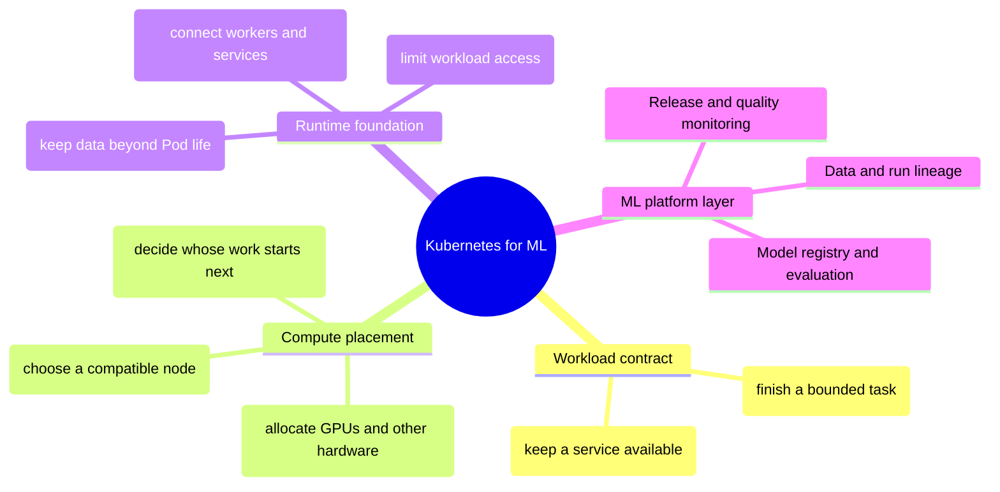
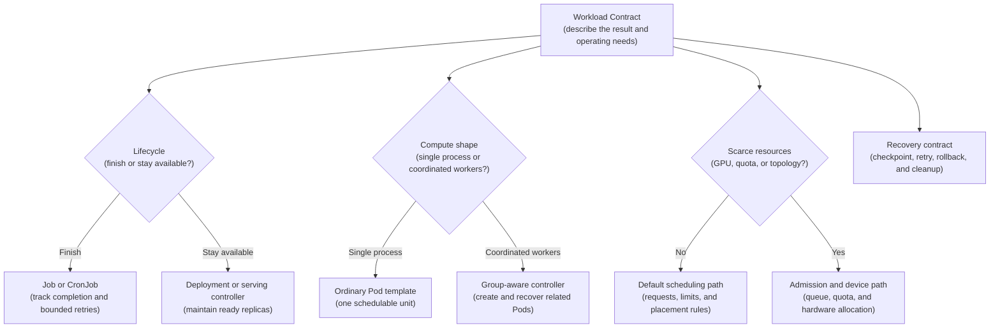
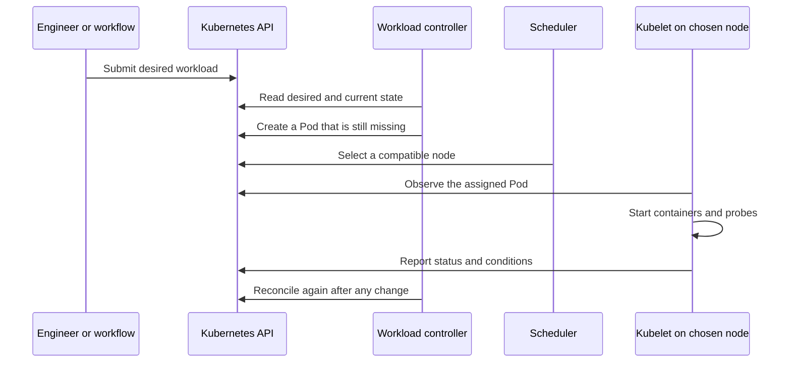
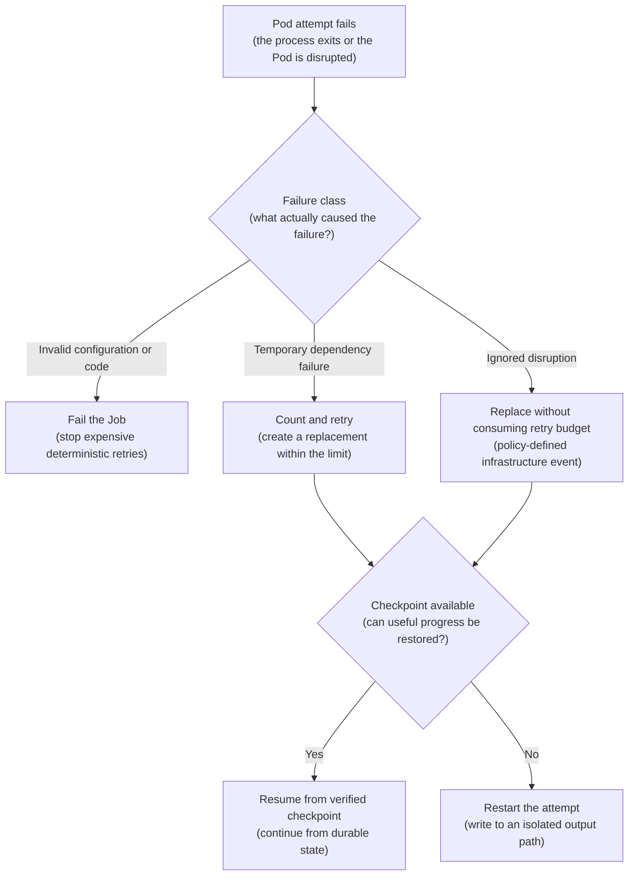
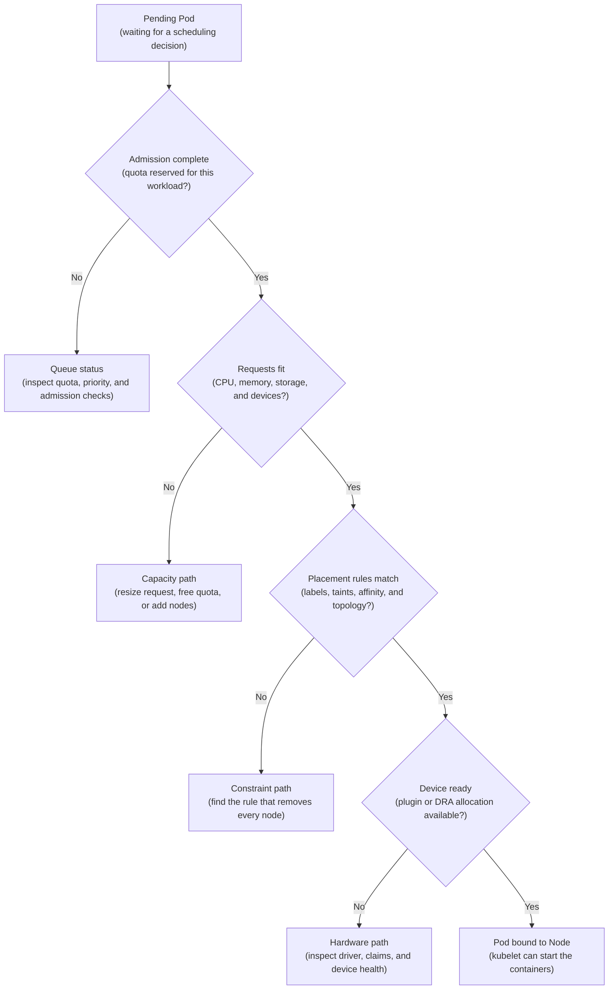
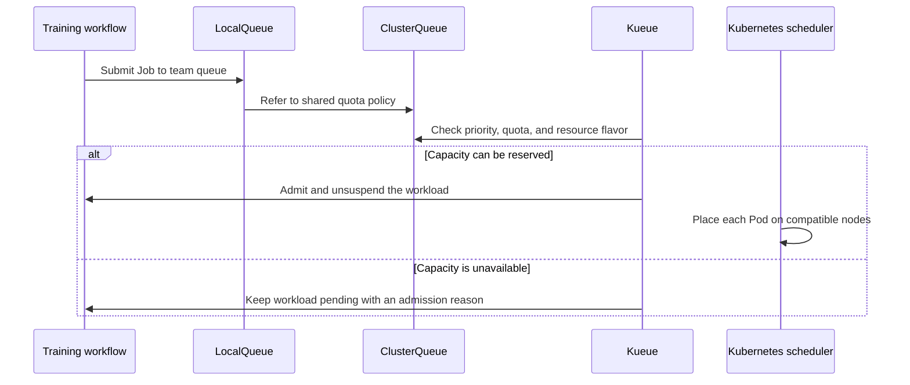
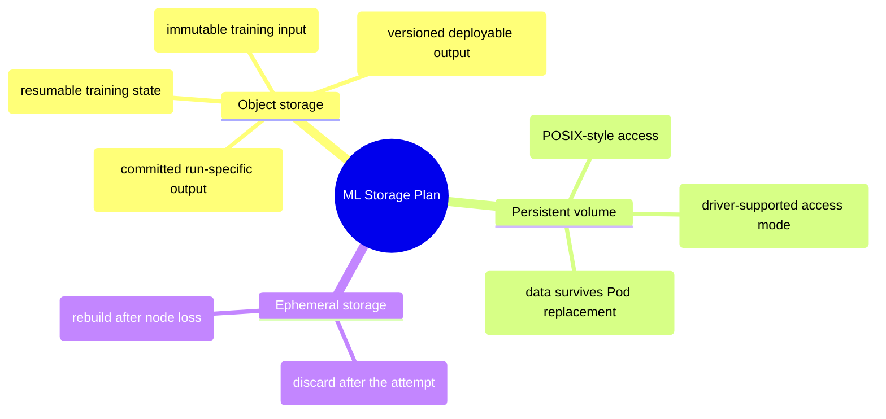
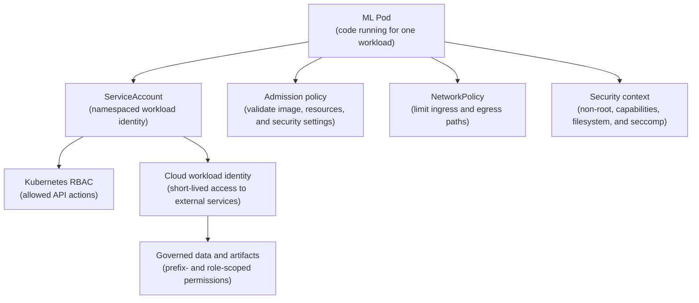
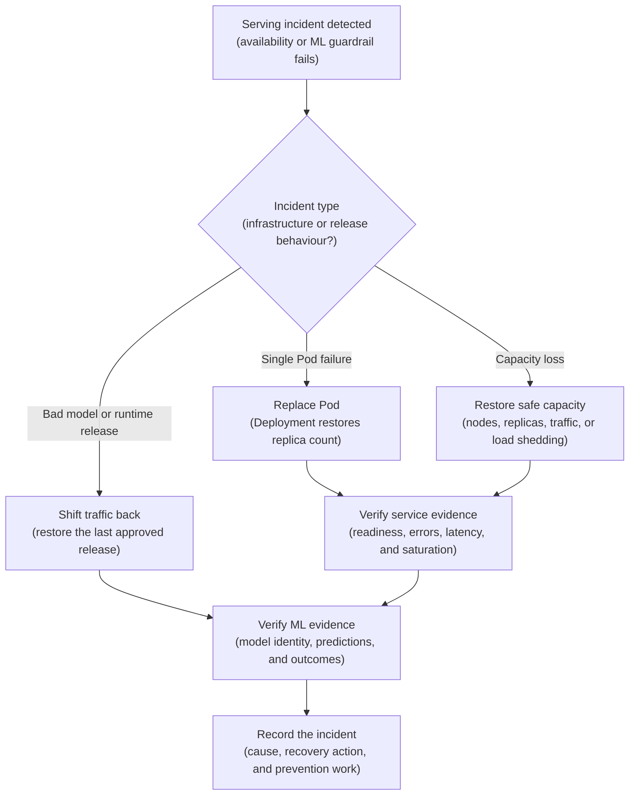
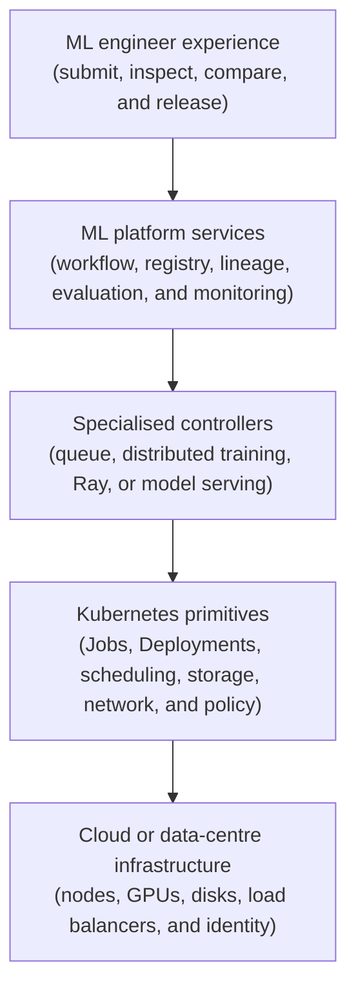

## Table of Contents

1. [What Kubernetes Changes for ML Workloads](#what-kubernetes-changes-for-ml-workloads)
2. [Decide What The ML Workload Must Do](#decide-what-the-ml-workload-must-do)
3. [How Kubernetes Keeps The Requested Workload Running](#how-kubernetes-keeps-the-requested-workload-running)
4. [Jobs Run Work That Must Finish](#jobs-run-work-that-must-finish)
5. [Deployments Keep Model Services Available](#deployments-keep-model-services-available)
6. [Schedule ML Workloads On Nodes With The Required Hardware](#schedule-ml-workloads-on-nodes-with-the-required-hardware)
7. [Use Queues To Share Scarce GPUs And Batch Capacity](#use-queues-to-share-scarce-gpus-and-batch-capacity)
8. [Storage and Networking Must Survive Pod Replacement](#storage-and-networking-must-survive-pod-replacement)
9. [Give Each ML Workload A Narrow Identity And Security Boundary](#give-each-ml-workload-a-narrow-identity-and-security-boundary)
10. [Use Kubernetes Status, Logs, Metrics, And Traces To Investigate ML Workloads](#use-kubernetes-status-logs-metrics-and-traces-to-investigate-ml-workloads)
11. [Recover Training And Serving Without Corrupting ML State](#recover-training-and-serving-without-corrupting-ml-state)
12. [Understand What Kubernetes Provides And What MLOps Still Needs](#understand-what-kubernetes-provides-and-what-mlops-still-needs)
13. [The Main Idea](#the-main-idea)
14. [References](#references)

## What Kubernetes Changes for ML Workloads
<!-- section-summary: Kubernetes gives ML teams a common way to request compute and keep workloads running, while the ML platform still owns data, model, and release meaning. -->

At a high level, **Kubernetes is a system for running containers across a group of machines**. An engineer describes the result they want, such as “run this training program once on a GPU” or “keep three copies of this prediction API available.” Kubernetes decides where the containers can run, starts them, watches their condition, and replaces them after many common infrastructure failures.

You can think of a Kubernetes cluster as a pool of computers with a control system in front of it. The pool may contain ordinary CPU machines, memory-heavy machines, several GPU models, and nodes in different availability zones. Instead of signing in to one machine and starting a process manually, a workload submits a structured request to the control system.

That request covers infrastructure facts:

- the container image and command;
- the amount of CPU, memory, storage, and accelerator capacity;
- the number of processes or service replicas;
- the network ports and storage mounts;
- the workload identity and security restrictions;
- the conditions for retry, completion, health, and cleanup.

The request contains no evidence about model accuracy, training-data approval, or product impact. Those decisions belong to the MLOps layer around the cluster. Experiment tracking and a model registry preserve learning history and model identity. Evaluation gates control promotion. Data lineage, prediction logs, and model monitoring explain what happened before and after release.

Consider one ordinary production journey. A workflow submits a training run that requests one GPU. Kubernetes finds a compatible node and starts the container. The program reads a versioned dataset from object storage and writes checkpoints outside the container. After evaluation approves the resulting model, a deployment controller starts serving replicas for that model version. A readiness check keeps each replica away from live traffic until the model is loaded. Kubernetes operates the compute; the surrounding ML platform preserves the meaning of the dataset, run, model, and release.


```mermaid
mindmap
  root((Kubernetes for ML))
    Workload contract
      Job<br/>(finish a bounded task)
      Deployment<br/>(keep a service available)
    Compute placement
      Scheduler<br/>(choose a compatible node)
      Devices<br/>(allocate GPUs and other hardware)
      Queue<br/>(decide whose work starts next)
    Runtime foundation
      Storage<br/>(keep data beyond Pod life)
      Networking<br/>(connect workers and services)
      Identity<br/>(limit workload access)
    ML platform layer
      Data and run lineage
      Model registry and evaluation
      Release and quality monitoring
```

The diagram separates two responsibilities that are often mixed together. Kubernetes is the compute foundation. An ML platform turns that foundation into a safe path from data to a monitored model release.

This distinction also explains the operational cost. A team that chooses Kubernetes accepts responsibility for cluster upgrades, node pools, device drivers, networking, storage integration, policies, observability, and incident response. Managed ML services remove part of that burden. Kubernetes earns its place where shared infrastructure, heterogeneous compute, custom runtimes, or existing cluster expertise justify the extra platform work.

## Decide What The ML Workload Must Do
<!-- section-summary: The workload contract describes the lifecycle, resources, data path, and recovery needs that determine which Kubernetes primitives belong in the design. -->

Before choosing a Kubernetes object or an ML operator, write down the **workload contract**. In essence, this contract states what the workload must accomplish and what conditions it requires from the platform.

The first question concerns lifecycle: should the work finish, or should it stay available? Model training, feature computation, and batch inference usually have a defined completion point. Online inference and notebook gateways usually remain available until an operator removes them. Kubernetes uses different controllers for those two goals because their failure and scaling behaviour is different.

The next questions concern execution:

- Can one process perform the work, or do several workers need to communicate?
- Can a retry repeat the operation safely?
- Does the program resume from a checkpoint after interruption?
- How long may the work run before the platform stops it?
- Can it use cheaper interruptible capacity, or does interruption destroy too much progress?

Then describe the resource shape. A small preprocessing task may need two CPUs and no accelerator. A deep-learning run may need eight identical GPUs with fast communication between them. A model server may need one GPU per replica, enough memory to load its weights, and several minutes of startup time. “Needs a GPU” is therefore too vague for reliable placement or cost planning.

Finally, map the data path. The contract should name the immutable input snapshot, the output location, the checkpoint location, the model or dataset access identity, and any mounted filesystem requirement. A Pod can disappear. The useful work must survive that event.


```mermaid
flowchart TD
    W["Workload Contract<br/>(describe the result and operating needs)"] --> L{"Lifecycle<br/>(finish or stay available?)"}
    L -->|Finish| J["Job or CronJob<br/>(track completion and bounded retries)"]
    L -->|Stay available| D["Deployment or serving controller<br/>(maintain ready replicas)"]
    W --> C{"Compute shape<br/>(single process or coordinated workers?)"}
    C -->|Single process| S["Ordinary Pod template<br/>(one schedulable unit)"]
    C -->|Coordinated workers| G["Group-aware controller<br/>(create and recover related Pods)"]
    W --> R{"Scarce resources<br/>(GPU, quota, or topology?)"}
    R -->|No| P["Default scheduling path<br/>(requests, limits, and placement rules)"]
    R -->|Yes| Q["Admission and device path<br/>(queue, quota, and hardware allocation)"]
    W --> E["Recovery contract<br/>(checkpoint, retry, rollback, and cleanup)"]
```

### Use Jobs For Work That Must Finish

A **Job** represents a task that should complete successfully and then stop. One training run is the usual example. A **CronJob** creates Jobs on a schedule, which suits nightly batch scoring or periodic feature refreshes. The schedule controls creation time; each created Job still needs its own input snapshot, idempotency, retry limit, and late-run policy.

A distributed training controller may sit above Jobs or Pods. Its job is to understand worker roles, rendezvous, coordinated completion, and group recovery. Plain Kubernetes objects can support simple parallel work, yet repeated distributed-training patterns usually benefit from a controller that understands the group as one workload.

### Use Deployments For Services That Must Stay Available

A **Deployment** represents interchangeable replicas that should keep running. It fits stateless model APIs whose model artifacts come from an image, object store, or startup process. The Deployment controls replica replacement and rolling updates. A **Service** gives those changing Pods a stable network destination.

A **StatefulSet** serves a narrower purpose: each replica receives a stable identity and can receive its own persistent volume. It may support stateful platform components, but it is rarely the first choice for a stateless prediction API. A **DaemonSet** runs a Pod on each selected node and commonly hosts node-level device, networking, log, or telemetry agents.

The controller follows the lifecycle. The presence of machine learning code does not require a special Kubernetes object by itself.

## How Kubernetes Keeps The Requested Workload Running
<!-- section-summary: Kubernetes controllers repeatedly compare desired state with observed state and take bounded actions to close the gap. -->

Kubernetes is built around **reconciliation**. The word sounds abstract, but the mechanism is straightforward: the control plane compares the state declared in an API object with the state currently observed in the cluster. A controller takes another action if those states differ.

Suppose a model-serving Deployment declares three replicas. The controller sees only two healthy Pods after a node fails, so it creates a replacement. The scheduler chooses a node that satisfies the replacement Pod's requests and placement rules. The kubelet on that node starts the containers and reports their status. The controller continues checking because the cluster can change again.

The important concepts are:

- An **API object** stores desired state and reported status.
- A **controller** watches a kind of object and manages its lifecycle.
- A **Pod** groups one or more containers that share a network namespace and attached volumes.
- The **scheduler** selects a node for an unscheduled Pod.
- A **kubelet** is the node agent that asks the container runtime to run the Pod and reports what happened.
- A **Node** is a machine that supplies CPU, memory, storage, and possibly devices such as GPUs.


```mermaid
sequenceDiagram
    participant E as Engineer or workflow
    participant A as Kubernetes API
    participant C as Workload controller
    participant S as Scheduler
    participant K as Kubelet on chosen node

    E->>A: Submit desired workload
    C->>A: Read desired and current state
    C->>A: Create a Pod that is still missing
    S->>A: Select a compatible node
    K->>A: Observe the assigned Pod
    K->>K: Start containers and probes
    K->>A: Report status and conditions
    C->>A: Reconcile again after any change
```

This loop gives Kubernetes its self-healing behaviour, within defined boundaries. A Deployment can replace a crashed serving Pod. A Job can create another Pod after a failed attempt. Kubernetes cannot decide whether retrying would duplicate a batch output, whether a checkpoint is valid, or whether the replacement loaded the correct model. The application and ML platform must supply those semantics.

That gap appears during incidents. A serving Deployment may show every replica as Ready while the loaded model produces poor decisions. A training Job may show Failed even though its latest checkpoint is usable. Infrastructure status and ML status must remain connected but distinct.

Custom controllers extend the same pattern. Kueue reconciles admission and quota objects. Kubeflow Trainer reconciles training resources. KubeRay reconciles Ray clusters and jobs. KServe reconciles model-serving resources. Each extension introduces another API and another controller, so teams should add one only for a repeated operational need that ordinary Kubernetes objects handle poorly.

## Jobs Run Work That Must Finish
<!-- section-summary: A Job wraps a training or batch program with completion, retry, deadline, resource, identity, and cleanup rules. -->

A Kubernetes **Job** represents a bounded piece of work. The Job controller creates one or more Pods and records whether the required number completed successfully. For ML teams, that makes a Job a useful wrapper around model training, batch inference, evaluation, or dataset preparation.

The container still performs the actual ML work. The Job adds operating rules around it. A useful training Job declares an immutable image, a versioned input, a run-specific output, measured resource requests, a workload identity, a deadline, and a retry policy.

The focused manifest below runs one training process. It uses a neutral object-store path for a fixed dataset version and a separate path for the run output. The image digest is abbreviated here; a real manifest contains the complete digest.

```yaml
apiVersion: batch/v1
kind: Job
metadata:
  name: churn-train-v37
  namespace: ml-training
  labels:
    ml.platform/run-id: churn-train-v37
    kueue.x-k8s.io/queue-name: gpu-training
spec:
  backoffLimit: 2
  activeDeadlineSeconds: 14400
  ttlSecondsAfterFinished: 86400
  template:
    spec:
      serviceAccountName: model-trainer
      restartPolicy: Never
      containers:
        - name: trainer
          image: registry.example.com/ml/trainer@sha256:<complete-digest>
          args:
            - --dataset-uri=s3://ml-data/churn/snapshots/v37/
            - --output-uri=s3://ml-artifacts/churn/runs/churn-train-v37/
          resources:
            requests:
              cpu: "4"
              memory: 16Gi
            limits:
              memory: 24Gi
              nvidia.com/gpu: "1"
```

This small example contains several production decisions:

- `restartPolicy: Never` leaves failed containers visible as failed Pods and lets the Job controller apply the Job retry policy.
- `backoffLimit: 2` limits replacement attempts. The default is higher and may waste expensive accelerators on a deterministic software error.
- `activeDeadlineSeconds` bounds the total Job duration, including retries.
- `ttlSecondsAfterFinished` removes old Job objects and Pods after an evidence-retention period. Logs and run metadata must already exist in durable systems.
- The service account gives the trainer a workload identity. Cloud IAM should allow it to read the curated snapshot and write only to approved artifact locations.
- CPU and memory requests give the scheduler a truthful minimum. The GPU limit asks the device plugin for one whole device; Kubernetes treats that limit as the request for this extended resource.

### Match The Retry Policy To The Failure

Kubernetes Job retries handle infrastructure disruptions and transient process failures. They are dangerous for non-idempotent work. An **idempotent** operation can run more than once without producing a different final result solely because it repeated.

For example, a batch inference task that writes to a shared file called `predictions.csv` may corrupt or duplicate output after a retry. A safer design writes each attempt to a run-specific temporary location, validates the result, and publishes one completion marker or atomic table commit. Downstream consumers read only committed output.

Kubernetes also supports a stable `podFailurePolicy` for Jobs. A policy can fail the Job immediately for a known non-retriable exit code, count an ordinary failure, or ignore a disruption so it does not consume the retry budget. This avoids spending hours retrying an invalid dataset schema while still allowing recovery from a node eviction.


```mermaid
flowchart TD
    F["Pod attempt fails<br/>(the process exits or the Pod is disrupted)"] --> C{"Failure class<br/>(what actually caused the failure?)"}
    C -->|Invalid configuration or code| X["Fail the Job<br/>(stop expensive deterministic retries)"]
    C -->|Temporary dependency failure| T["Count and retry<br/>(create a replacement within the limit)"]
    C -->|Ignored disruption| I["Replace without consuming retry budget<br/>(policy-defined infrastructure event)"]
    T --> P{"Checkpoint available<br/>(can useful progress be restored?)"}
    I --> P
    P -->|Yes| R["Resume from verified checkpoint<br/>(continue from durable state)"]
    P -->|No| B["Restart the attempt<br/>(write to an isolated output path)"]
```

### Save Training Checkpoints In Durable Storage

Kubernetes can replace the Pod, but the training code or framework must create and save model checkpoints. A useful checkpoint contains the model weights and the current training position. Optimiser and random-state data may also be required for a consistent resume. Its metadata should link to the exact configuration and data version.

Choose the checkpoint interval from recovery cost. A long GPU run on interruptible nodes may checkpoint every few minutes because losing an hour is expensive. A ten-minute CPU task may simply restart. On resume, the program should verify checkpoint completeness before loading it and must keep final model publication separate from intermediate files.

### Start Distributed Workers As A Coordinated Group

Several training processes often need to start together. They must discover one another and agree on completion. A plain parallel Job creates multiple similar Pods, yet it has no ML-specific understanding of worker roles or parameter servers. It also leaves rendezvous and elastic membership to the application.

Use a higher-level controller for group behaviour that appears across many workloads. Kubeflow Trainer v2 provides resources such as `TrainJob` and `TrainingRuntime`; its current API documentation still uses alpha-versioned custom resources, so cluster and client compatibility must be pinned and tested. KubeRay provides `RayJob` for a job-scoped Ray cluster. JobSet groups related Jobs with explicit relationships. The following article compares these tools in more depth.

The underlying rule stays the same: the controller should own a real lifecycle problem. It should not hide the dataset version, retry limit, output identity, or evidence required to reproduce the run.

## Deployments Keep Model Services Available
<!-- section-summary: A Deployment maintains model-serving replicas, while probes, Services, autoscaling, and release controls determine whether those replicas can safely receive traffic. -->

Online inference has a different goal from training. A training run should finish. A model API should keep answering requests while Pods fail, nodes drain, traffic changes, and new versions roll out.

A **Deployment** maintains a requested number of interchangeable Pods. A **Service** selects the ready Pods and gives clients a stable network address. Together they form the basic Kubernetes serving pattern. A gateway or ingress layer can expose the Service outside the cluster and apply routing, TLS, authentication, or traffic policy.

The most important serving concept is **readiness**. A running process is not automatically ready to serve the intended model. A model server may need to download several gigabytes, allocate accelerator memory, warm kernels, load tokenizers, or validate a model checksum. Its readiness endpoint should report success only after the complete serving path can accept requests.

The excerpt below shows the parts of a Deployment that protect a slow-starting model server:

```yaml
spec:
  replicas: 3
  strategy:
    type: RollingUpdate
    rollingUpdate:
      maxUnavailable: 0
      maxSurge: 1
  template:
    metadata:
      labels:
        app: churn-api
        ml.platform/model-version: "churn-model-42"
    spec:
      containers:
        - name: server
          image: registry.example.com/ml/churn-api@sha256:<complete-digest>
          startupProbe:
            httpGet: {path: /startup, port: 8080}
            failureThreshold: 60
            periodSeconds: 5
          readinessProbe:
            httpGet: {path: /ready, port: 8080}
            periodSeconds: 5
          livenessProbe:
            httpGet: {path: /live, port: 8080}
            periodSeconds: 10
```

A **startup probe** gives model initialisation its own time window. Kubernetes waits for it before running readiness and liveness probes. A **readiness probe** controls traffic eligibility. A **liveness probe** asks whether restarting the container can recover it. These probes need different meanings. Pointing all three at one shallow “process is alive” endpoint removes most of their value.

For example, suppose a new Pod can open port 8080 after five seconds but needs two minutes to load the model. The startup probe permits that loading period. Readiness remains false, so the Service sends no requests to the Pod. The readiness endpoint reports success after loading and a local validation pass. If the server later deadlocks, the liveness probe can trigger a restart. A temporary downstream outage should usually affect readiness or request handling rather than cause every replica to restart together.

### Use Rollouts To Protect Service Availability

The rolling-update settings above allow one additional Pod and require all existing replicas to remain available during replacement. This protects service capacity. It does not judge prediction quality or business impact.

A safe model release needs two evidence paths. Infrastructure evidence covers readiness and restart behaviour. It also measures errors, latency, and saturation. ML evidence identifies the loaded model and feature contract. Prediction distributions, outcome quality, and policy guardrails complete that path. Traffic should expand only after both paths meet their release criteria.

Kubernetes Deployments support revision history and rollback of the Pod template. Progressive traffic splitting usually comes from Gateway API implementations, a service mesh, a progressive-delivery controller, an application router, or a serving platform. Keep the previous image and model artifact available until the rollback window closes.

### Understand The Three Autoscaling Loops

Serving teams often say “autoscaling” as if one mechanism adds all required capacity. In practice, three loops may be involved:

1. The Horizontal Pod Autoscaler changes the number of replicas.
2. A node autoscaler adds or removes machines for Pods that cannot fit.
3. The model server manages work inside each replica, such as batching, concurrency, or accelerator memory.

The Horizontal Pod Autoscaler can use CPU or memory through resource metrics. Kubernetes metrics adapters can also supply custom or external metrics. Inference often needs a demand signal such as queue depth or requests in flight. Generative inference may use time to first token or the number of tokens waiting. CPU can remain low while a GPU-backed server is saturated.

Scale targets must reflect startup time and available hardware. Asking for ten Pods does not create ten GPUs. If new GPU nodes take fifteen minutes to arrive, the service needs headroom, admission protection, request queues, or a minimum warm capacity. Scale-down policies also need stabilisation so a brief traffic dip does not unload an expensive model that will immediately be needed again.

KServe can package these serving concerns behind an `InferenceService`. Current KServe documentation describes a Standard mode that creates Deployments, Services, networking resources, and an HPA, with optional KEDA support for custom signals. Knative mode adds request-driven scale-to-zero for suitable workloads. Advanced LLM resources still use alpha APIs, so teams should pin versions and validate upgrades. Ordinary Deployments remain a sound baseline for a small, well-understood model API.

## Schedule ML Workloads On Nodes With The Required Hardware
<!-- section-summary: The scheduler places each Pod by comparing declared resource needs and placement rules with the capacity and properties of available nodes. -->

The Kubernetes scheduler answers a practical question: **which node can run this Pod?** It first filters out nodes that cannot satisfy the Pod. It then scores the remaining choices and binds the Pod to one of them.

For CPU and memory, **requests** describe the capacity reserved during scheduling. **Limits** describe the maximum enforced at runtime. CPU pressure usually causes throttling. Exceeding a memory limit can cause the container to be killed with `OOMKilled`. Honest requests therefore matter for both placement and reliability.

Suppose a training Pod requests 4 CPUs and 16 GiB of memory but regularly uses 40 GiB. The scheduler may place several such Pods on one node because the declaration says they fit. Memory pressure then kills processes during training. Raising the memory limit alone does not fix the false placement signal; the request also needs to reflect measured working-set demand.

### Expose GPUs And Other Accelerators To Kubernetes

GPUs and other specialised hardware are exposed as extended resources. With the long-established device-plugin path, a cluster administrator installs the vendor driver and device plugin on compatible nodes. The plugin advertises a resource such as `nvidia.com/gpu`. A container asks for a whole-number GPU in `limits`; Kubernetes uses the same value as the request and does not overcommit that extended resource by default.

Kubernetes also provides **Dynamic Resource Allocation**, usually shortened to DRA. DRA is a richer device-allocation model. A `DeviceClass` describes a device category. `ResourceSlice` objects advertise what a driver can supply, and a `ResourceClaim` records a workload request. In another term, the workload describes the device it needs while a driver exposes and prepares a matching device.

Core DRA is stable and enabled by default in Kubernetes 1.35. The surrounding capabilities do not all share that maturity. For example, current Kubernetes 1.36 documentation marks workload-level ResourceClaims as alpha and several advanced device features as beta. Managed-cluster support also depends on the provider and device driver. A platform contract should state the exact Kubernetes version, driver, supported API fields, and fallback path before exposing DRA to users.

### Place Workloads By Hardware And Failure-Domain Needs

Capacity alone may be insufficient. A training run may require a particular GPU model, a compatible CPU architecture, or nodes connected through a fast fabric. A serving replica may need to spread across zones so one failure cannot remove every copy.

- **Node selectors** provide a simple exact match against node labels.
- **Node affinity** expresses richer required or preferred label rules.
- **Taints and tolerations** keep general workloads away from specialised pools unless they explicitly opt in.
- **Pod affinity and anti-affinity** place Pods near or away from other Pods.
- **Topology spread constraints** distribute replicas across zones, nodes, or another topology domain.


```mermaid
flowchart TD
    P["Pending Pod<br/>(waiting for a scheduling decision)"] --> A{"Admission complete<br/>(quota reserved for this workload?)"}
    A -->|No| Q["Queue status<br/>(inspect quota, priority, and admission checks)"]
    A -->|Yes| R{"Requests fit<br/>(CPU, memory, storage, and devices?)"}
    R -->|No| C["Capacity path<br/>(resize request, free quota, or add nodes)"]
    R -->|Yes| M{"Placement rules match<br/>(labels, taints, affinity, and topology?)"}
    M -->|No| V["Constraint path<br/>(find the rule that removes every node)"]
    M -->|Yes| D{"Device ready<br/>(plugin or DRA allocation available?)"}
    D -->|No| H["Hardware path<br/>(inspect driver, claims, and device health)"]
    D -->|Yes| B["Pod bound to Node<br/>(kubelet can start the containers)"]
```

A Pending Pod is often behaving correctly. The scheduler may be protecting the workload from an incompatible node. Investigation should read the scheduling event and eliminate causes in order: admission, quota, resource fit, placement constraints, storage binding, and device state. Adding nodes blindly can leave the same Pod pending if its affinity requests a label that no new node receives.

### Measure Workloads Before Changing Platform Defaults

Platform defaults should come from observed workload classes. Track requested capacity, peak and sustained use, queue time, runtime, OOM failures, accelerator utilisation, and cost. A CPU preprocessing class, a single-GPU experiment class, and an eight-GPU distributed class should rarely share one default template.

Over-requesting creates its own failure mode. A job that reserves four GPUs while using only one blocks other work and makes cluster utilisation look healthy on paper. Right-sizing, quotas, and queue policy must use actual device telemetry rather than requested capacity alone.

## Use Queues To Share Scarce GPUs And Batch Capacity
<!-- section-summary: Queue admission chooses which complete workload may claim scarce capacity before the scheduler decides where its Pods run. -->

The scheduler handles placement for a Pod that is allowed to run. A shared ML platform needs another decision before placement: **which workload should receive limited GPU or batch capacity next?**

Without queue admission, every submitted Job can create Pods immediately. The scheduler leaves the Pods Pending until capacity appears. That behaviour has no team quota, borrowing policy, fair sharing, or whole-workload view. A large distributed job can also occupy some GPUs while waiting indefinitely for the rest.

Kueue adds this admission layer for batch, AI, and high-performance workloads. Its main concepts have distinct jobs:

- A **LocalQueue** is the queue a team or user sees inside one namespace.
- A **ClusterQueue** owns quota and admission policy across namespaces.
- A **ResourceFlavor** represents a variation such as one GPU model, CPU architecture, or spot node pool.
- A **Cohort** lets related ClusterQueues borrow unused quota according to policy.
- A **Workload** is Kueue's internal representation of the complete resource request it is considering for admission.

The Job submits to a LocalQueue through one label:

```yaml
metadata:
  labels:
    kueue.x-k8s.io/queue-name: gpu-training
```

Kueue's webhook manages the Job's suspension. The Job remains admitted to no capacity until the ClusterQueue can reserve a matching flavor and quota. After Kueue admits it, the ordinary Kubernetes scheduler places the Pods on real nodes.


```mermaid
sequenceDiagram
    participant U as Training workflow
    participant L as LocalQueue
    participant C as ClusterQueue
    participant K as Kueue
    participant S as Kubernetes scheduler

    U->>L: Submit Job to team queue
    L->>C: Refer to shared quota policy
    K->>C: Check priority, quota, and resource flavor
    alt Capacity can be reserved
        K->>U: Admit and unsuspend the workload
        S->>S: Place each Pod on compatible nodes
    else Capacity is unavailable
        K->>U: Keep workload pending with an admission reason
    end
```

Queue admission and Pod placement have separate owners and evidence. A workload with `Admitted=False` is still waiting on queue policy; adding a toleration to its Pod cannot grant quota. After admission, Pending Pods point to scheduling, storage, or device allocation. The status condition directs the operator to the responsible layer instead of one generic “Kubernetes problem.”

### Reserve Capacity For All Distributed Workers Together

Synchronous distributed training may make no progress until every required worker is ready. Starting four of eight workers can reserve four expensive GPUs without performing useful training. This is the problem addressed by all-or-nothing or **gang scheduling**.

Kueue's `waitForPodsReady` option watches an admitted workload until every required Pod is scheduled, running, and ready. Kueue can evict and requeue the group after the configured timeout. Volcano provides a scheduler and `PodGroup` mechanism as another established gang-scheduling path. Choose between them from the existing batch platform and controller integrations. Topology requirements and operating experience also matter.

Queue policy is a product interface as well as an administrator configuration. Users need to see their queue and requested resources. They also need the priority and admission reason. An estimate of expected wait helps them plan other work. Platform dashboards should show quota use and borrowing. Separate views should expose preemption and queue age. Admitted-workload failures and accelerator utilisation reveal whether admitted capacity produced useful work. Cancellation and priority changes need clear ownership because they affect other teams.

## Storage and Networking Must Survive Pod Replacement
<!-- section-summary: Durable stores preserve ML state beyond a Pod, while Kubernetes networking gives changing Pods stable ways to communicate. -->

Pods are replaceable. Their local container filesystem disappears with them, and a replacement may start on another node. This is healthy infrastructure behaviour, provided the workload keeps important data elsewhere.

### Choose Storage That Survives Pod Replacement

Object storage is the common default for large ML assets. It holds immutable dataset snapshots and model artifacts. Checkpoints, evaluation reports, and batch outputs also fit this store. It scales independently from the cluster and remains available after every Pod in a Job disappears. The workload identity should grant access to specific prefixes or governed buckets rather than broad storage access.

PersistentVolumes support filesystem semantics. A **PersistentVolumeClaim**, or PVC, asks for a size and access mode from a StorageClass. The cluster binds the claim to a PersistentVolume supplied through a Container Storage Interface driver. This path suits tools that require a mounted filesystem. It can also support shared caches and stateful platform services if the storage implementation meets their requirements.

The choice involves more than capacity. Storage classes differ in performance, snapshot support, and availability zone. They also define reclaim policy and access modes. `ReadWriteOnce` permits read-write mounting from one node at a time; it does not grant cluster-wide shared writing. A distributed training job that expects a shared writable filesystem needs a storage system and access mode that actually supply that behaviour.

Node-local SSD can provide fast scratch space or caches. Treat it as disposable unless a replication or checkpoint design says otherwise. A model downloaded into one node's cache may shorten future startup on that node, but it is not the durable source of truth.


```mermaid
mindmap
  root((ML Storage Plan))
    Object storage
      Dataset snapshot<br/>(immutable training input)
      Checkpoint<br/>(resumable training state)
      Model artifact<br/>(versioned deployable output)
      Batch result<br/>(committed run-specific output)
    Persistent volume
      Mounted filesystem<br/>(POSIX-style access)
      Shared cache<br/>(driver-supported access mode)
      Stateful service<br/>(data survives Pod replacement)
    Ephemeral storage
      Temporary files<br/>(discard after the attempt)
      Local cache<br/>(rebuild after node loss)
```

For a long training run, a practical design writes checkpoints to a run-specific object-store prefix and records the latest verified checkpoint in run metadata. The replacement Pod reads that record, verifies the checkpoint, and resumes. It does not depend on finding the same node or the previous container filesystem.

### Use Services To Reach Changing Pods

Every Pod receives an address, but Pods are created and removed continuously. A Kubernetes **Service** selects Pods by labels and exposes a stable name and virtual address. An inference client calls the Service instead of storing individual Pod addresses. Readiness affects the Service's eligible endpoints, so a model-loading Pod remains outside normal traffic.

Distributed training also needs networking. Workers may need stable discovery, known ports, low-latency communication, and enough network bandwidth between the selected nodes. A controller or headless Service can provide discovery, while topology-aware scheduling places workers near the required fabric. Kubernetes can establish connectivity; the training framework still manages rendezvous and collective communication.

Gateway API or an ingress implementation exposes online inference outside the cluster. It may terminate TLS, authenticate callers, route by hostname or path, and shift traffic between backends. The route configuration and model release evidence should share a release identity so an operator can prove which model received a request.

NetworkPolicy restricts Pod ingress and egress, provided the cluster's network plugin implements it. Kubernetes allows traffic by default until policies select and isolate Pods. A production namespace commonly starts with deny-by-default policies, then permits the specific paths required for object storage, metadata services, telemetry, DNS, and worker communication. Test the policy with the actual CNI because enforcement details sit in that implementation.

## Give Each ML Workload A Narrow Identity And Security Boundary
<!-- section-summary: Workload identity, least-privilege access, admission policy, and runtime isolation limit the damage that an ML container can cause. -->

ML containers often touch sensitive datasets, cloud storage, model registries, and expensive accelerators. The workload's identity and required actions define the first security boundary.

A Kubernetes **ServiceAccount** gives a Pod an identity inside the cluster. RBAC controls which Kubernetes API resources that identity can read or change. On managed clouds, a workload-identity integration can exchange that identity for short-lived cloud credentials. This avoids placing a long-lived cloud key in the container image or source repository.

Use separate identities for separate capabilities. A training workload may read approved feature tables and write into its own run prefix. A serving workload may read only released models and runtime configuration. An evaluation job may read a candidate artifact and write an assessment without gaining permission to deploy it. These boundaries make mistakes and compromised containers less powerful.


```mermaid
flowchart TD
    P["ML Pod<br/>(code running for one workload)"] --> S["ServiceAccount<br/>(namespaced workload identity)"]
    S --> R["Kubernetes RBAC<br/>(allowed API actions)"]
    S --> W["Cloud workload identity<br/>(short-lived access to external services)"]
    P --> A["Admission policy<br/>(validate image, resources, and security settings)"]
    P --> N["NetworkPolicy<br/>(limit ingress and egress paths)"]
    P --> C["Security context<br/>(non-root, capabilities, filesystem, and seccomp)"]
    W --> D["Governed data and artifacts<br/>(prefix- and role-scoped permissions)"]
```

Namespaces group resources and provide a scope for RBAC and NetworkPolicy. ResourceQuota and LimitRange also operate within this scope. A namespace supplies an administrative boundary rather than complete isolation. Two tenants may still share the control plane and worker nodes. The kernel, network implementation, and devices can also remain shared.

For ordinary trusted workloads, enforce the Kubernetes Restricted Pod Security Standard where compatible. Run as a non-root user and prevent privilege escalation. Drop unnecessary Linux capabilities. Use an approved seccomp profile. Mount the root filesystem read-only where the application permits it. Admission policies can require signed images and approved registries. They can also enforce resource requests and immutable image references. Standard labels provide ownership and traceability.

Untrusted notebook or training code needs a stronger threat model. Separate node pools and strict egress reduce some exposure. Sandboxed runtimes such as gVisor or Kata Containers add a different runtime boundary. High-risk cases may require separate clusters and dedicated cloud accounts. GPU sharing needs vendor-specific review of memory isolation, telemetry exposure, and performance interference. Namespaces alone cannot make arbitrary code safe for multi-tenant execution.

ResourceQuota limits aggregate resource requests or object counts within a namespace. LimitRange can set or constrain per-object requests and limits. These controls prevent accidental consumption but do not provide fair queue ordering. Kueue or another batch admission system still owns the “who starts next?” decision.

Kubernetes Secrets deserve careful wording. Their values are base64-encoded in manifests and API responses; base64 is not encryption. Enable encryption at rest for cluster data, restrict Secret access through RBAC, avoid unnecessary token mounting, and prefer an external secrets or workload-identity path for high-value credentials.

## Use Kubernetes Status, Logs, Metrics, And Traces To Investigate ML Workloads
<!-- section-summary: Operators diagnose ML workloads by moving from Kubernetes status and events to application telemetry and then to run or release evidence. -->

Kubernetes offers several layers of operational evidence. Object status shows the controller's current view. Events explain recent decisions such as failed scheduling or image pulls. Container logs expose application output. Metrics describe resource use and control-plane behaviour. Traces connect requests across services.

ML systems add another evidence layer. It starts with the dataset version, run ID, and model version. Evaluation results record pre-release evidence. Prediction records and later outcomes explain production behaviour. A production investigation needs a stable way to join these layers.

For example, suppose an inference endpoint still returns HTTP 200 responses but latency has doubled after a release. Kubernetes metrics may show GPU saturation. Traces may locate time in the model server. The serving record should reveal the loaded model version and runtime image. Release evidence can then distinguish a larger model from a cluster capacity change. Without shared identifiers, each dashboard tells a partial story.

### Investigate Kubernetes Failures In A Consistent Order

Start with the controller object, then the Pods it owns, then the relevant events and logs. These commands provide a small first pass for a training Job:

```bash
kubectl -n ml-training describe job churn-train-v37
kubectl -n ml-training get pods -l job-name=churn-train-v37 -o wide
FAILED_POD=churn-train-v37-abcde
kubectl -n ml-training describe pod "$FAILED_POD"
kubectl -n ml-training logs "$FAILED_POD" --all-containers
```

The output should guide the next investigation:

| Observed symptom | What it means first | Next evidence |
| --- | --- | --- |
| Pod remains `Pending` | No valid placement has completed | queue admission, scheduler event, requests, constraints, PVC, device state |
| `ImagePullBackOff` | The node cannot obtain the image | image reference, registry reachability, pull identity, signature policy |
| `OOMKilled` | A container exceeded available or limited memory | working-set metrics, memory request and limit, input size, application profile |
| Job reaches `Failed` | A termination policy or retry bound ended the run | Job conditions, exit codes, Pod failure policy, checkpoint status |
| Serving Pod stays unready | It must not receive traffic yet | startup logs, artifact access, readiness response, model load time |
| Service is healthy but decisions degrade | Infrastructure availability is insufficient evidence | model identity, prediction logs, feature health, labels, outcome metrics |

The table points to investigations; it does not replace them. A Pending Pod, for instance, may be waiting for Kueue admission, a GPU node, a PVC in the correct zone, or a label that no node has. The event message usually narrows the path.

### Use Shared Run And Release IDs Across Telemetry

Attach low-cardinality operational labels such as workload class, owner, run ID, model version, and release ID to the appropriate Kubernetes objects. Propagate run and release identifiers into logs, traces, and ML metadata. Avoid placing user IDs, raw features, prompts, or other high-cardinality sensitive values into metric labels.

Prometheus and cloud monitoring systems commonly collect Kubernetes and application metrics. `kube-state-metrics` exposes object-state information such as desired replicas or Job conditions. Vendor telemetry exports accelerator utilisation and memory use. It may also report temperature and health. OpenTelemetry provides a standard path for application traces, metrics, and logs. Prediction quality still needs governed prediction and outcome records in the model-monitoring path.

Alert on symptoms with clear user or workload impact. A model API alert might combine elevated request failure, tail latency, and unavailable replicas. A batch platform alert might cover old admitted workloads, repeated Job failures, or queue age beyond an objective. GPU utilisation by itself is a capacity signal, not proof of an incident.

## Recover Training And Serving Without Corrupting ML State
<!-- section-summary: Recovery combines Kubernetes replacement with application checkpoints, isolated outputs, bounded retries, and serving rollback. -->

Kubernetes recovery creates replacement compute. Correct ML recovery also protects the meaning and integrity of the work. In practice, recovery joins infrastructure actions with application rules. The controller may replace a Pod, while the training program decides which checkpoint is safe. A serving controller may restore replica count, while the release system decides whether traffic should return to an earlier model. The following sections separate those two common paths.

### Recover A Failed Training Run

A training recovery plan should define four stages:

1. Classify the failure as retriable, non-retriable, or an ignored disruption.
2. Preserve evidence from the failed attempt, including logs, exit status, node and device context, and the last verified checkpoint.
3. Start a bounded replacement from a known input and checkpoint.
4. Publish the final artifact only after validation and atomic completion.

Suppose an interruptible GPU node disappears halfway through a long run. The Job controller creates another Pod within the retry limit. The new process reads the run ID, finds the latest complete checkpoint in object storage, verifies its checksum and metadata, and resumes. It writes new checkpoints to the same run namespace with unique attempt metadata. The model registry receives a candidate only after the training program writes a final completion record and evaluation passes.

Contrast that with an invalid configuration that makes the program exit immediately. Retrying on two more GPU nodes produces the same result and extra cost. A distinct exit code plus `podFailurePolicy` can fail the Job at once. The workflow then reports a configuration failure to the owner rather than labelling it a capacity incident.

### Recover A Failed Model Service

Serving recovery protects availability and release safety. A Deployment replaces crashed replicas, readiness removes unhealthy replicas from normal Service traffic, and rolling-update limits protect capacity during change. Spread replicas across failure domains so one node or zone does not remove every copy.

A PodDisruptionBudget limits how many replicas can be voluntarily disrupted at once, such as during a node drain. Its scope excludes node crashes and other involuntary failures. A bad model release also sits outside that protection. Replicas and topology protect failure domains. Readiness and rollback protect traffic during serving changes.


```mermaid
flowchart TD
    I["Serving incident detected<br/>(availability or ML guardrail fails)"] --> T{"Incident type<br/>(infrastructure or release behaviour?)"}
    T -->|Single Pod failure| P["Replace Pod<br/>(Deployment restores replica count)"]
    T -->|Capacity loss| C["Restore safe capacity<br/>(nodes, replicas, traffic, or load shedding)"]
    T -->|Bad model or runtime release| R["Shift traffic back<br/>(restore the last approved release)"]
    P --> V["Verify service evidence<br/>(readiness, errors, latency, and saturation)"]
    C --> V
    R --> M["Verify ML evidence<br/>(model identity, predictions, and outcomes)"]
    V --> M
    M --> E["Record the incident<br/>(cause, recovery action, and prevention work)"]
```

Imagine a new model version loads successfully and passes readiness, but its request memory is too low under realistic traffic. Pods start receiving `OOMKilled`, and the Deployment keeps replacing them. Immediate recovery routes traffic to the previous release and restores stable capacity. The follow-up fixes measured memory requests, load tests the new version, and updates the release gate. Raising `backoffLimit` or liveness thresholds would address the wrong layer.

### Practise The Recovery Path

Run controlled drills for the failures the platform claims to handle: delete a training Pod after a checkpoint, drain a serving node, revoke artifact access in a test environment, submit an unschedulable accelerator request, and roll back a canary. Measure lost work, time to diagnosis, time to recovery, and evidence completeness.

A successful drill ends with more than a green workload. The team should prove which input and model version ran, which checkpoint or release was restored, whether outputs remained consistent, and whether alerts guided the operator to the correct layer.

## Understand What Kubernetes Provides And What MLOps Still Needs
<!-- section-summary: Kubernetes operates container infrastructure; higher-level systems add ML workflows, metadata, policy, and specialised lifecycle controllers. -->

Kubernetes gives a team powerful primitives. A complete MLOps platform also needs domain systems that understand data, experiments, models, releases, and production quality.

The boundary matters because teams often expect a cluster installation to solve lifecycle problems that sit above compute. Kubernetes can report that a container finished successfully. It cannot infer that the resulting model passed evaluation or belongs in production. Higher-level systems preserve that meaning and turn infrastructure actions into an engineer-facing workflow.

Kubernetes can create Pods, place them on nodes, attach storage, connect services, enforce policies, and report runtime status. It has no native concept of a training dataset version, experiment comparison, model approval, prediction quality, or product outcome. Those concepts belong above the cluster.

Higher-level tools fill specific gaps:

- **Kueue** adds batch admission, quotas, resource flavors, borrowing, and queue policy before normal Pod placement.
- **Kubeflow Trainer** adds a training-oriented API and runtime templates for distributed jobs. Its API version and controller compatibility must be pinned because current resources remain alpha-versioned.
- **KubeRay** adds `RayCluster`, `RayJob`, and `RayService` lifecycle management for Ray workloads.
- **KServe** adds model-serving resources, runtime integration, networking, autoscaling, and serving-specific rollout features.
- Workflow systems such as Argo Workflows, Airflow, Dagster, Prefect, or managed ML pipelines coordinate multi-step data and ML processes. They do not replace Kubernetes scheduling or queue admission.
- MLflow or a managed ML platform records runs, artifacts, evaluation, and governed model versions. It does not replace the Job or Deployment controller.

The gaps observed in real workloads determine which integrations belong in the platform. Add Kueue because direct submission cannot express fair GPU admission. Add a training controller because teams repeatedly rebuild worker roles and group recovery. Add KServe because model-serving lifecycle and traffic policy are creating duplicated platform code. Each controller expands the upgrade, security, compatibility, and observability surface.


```mermaid
flowchart TD
    U["ML engineer experience<br/>(submit, inspect, compare, and release)"] --> P["ML platform services<br/>(workflow, registry, lineage, evaluation, and monitoring)"]
    P --> X["Specialised controllers<br/>(queue, distributed training, Ray, or model serving)"]
    X --> K["Kubernetes primitives<br/>(Jobs, Deployments, scheduling, storage, network, and policy)"]
    K --> I["Cloud or data-centre infrastructure<br/>(nodes, GPUs, disks, load balancers, and identity)"]
```

### Choose Kubernetes Only When Its Operating Cost Is Justified

Managed training jobs and managed endpoints are often the practical default. They reduce cluster engineering and provide integrated identity, logs, autoscaling, and upgrade paths. A small team with a few models may gain little from operating Kubernetes controllers and GPU node pools.

Kubernetes fits several recurring needs. It can coordinate many containerised workloads across mixed CPU and accelerator fleets. It also supports custom networking and runtimes. Existing Kubernetes operations and a strong internal platform team lower the adoption cost. Some organisations use it to share one infrastructure plane between application and ML teams.

Evaluate the complete operator path before deciding:

- How does an engineer build and scan the image?
- How does the workload receive a narrow identity?
- How are dataset, run, model, and release IDs connected?
- How does queue admission work during GPU contention?
- How are checkpoints, logs, and final artifacts preserved?
- How does an operator understand a Pending Pod or failed distributed group?
- How do serving replicas scale, receive traffic, and roll back?
- Who upgrades the cluster, device drivers, CRDs, and controllers?
- What is the cost of idle headroom and the people required to operate it?

A successful platform hides routine complexity while keeping important evidence visible. An engineer should be able to submit a workload, understand why it is waiting, inspect its run or release identity, and recover it through an approved path without becoming a cluster administrator.

## The Main Idea
<!-- section-summary: Kubernetes can run ML reliably after lifecycle, resource, storage, identity, observability, and recovery contracts are made explicit. -->

Kubernetes gives machine learning workloads a shared compute control plane. Jobs express work that should finish. Deployments express services that should remain available. Controllers reconcile declared intent. The scheduler matches Pods to real capacity. Device plugins and DRA expose specialised hardware. Kueue adds admission policy before placement. Storage preserves useful state beyond a Pod. Services and gateways connect changing replicas. Identities and policies limit access.

The workload contract anchors the dependable design. Define the lifecycle and compute shape first. Then capture the data path, security boundary, retry behaviour, and recovery evidence before selecting a controller or writing YAML. Add higher-level ML controllers only for repeated gaps that Kubernetes primitives do not express well.

Kubernetes can recover infrastructure. The surrounding ML platform must preserve data and model meaning. Production reliability comes from connecting both layers through stable run, model, and release identities.

## References

- [Kubernetes components](https://kubernetes.io/docs/concepts/overview/components/)
- [Kubernetes controllers](https://kubernetes.io/docs/concepts/architecture/controller/)
- [Pods](https://kubernetes.io/docs/concepts/workloads/pods/)
- [Jobs](https://kubernetes.io/docs/concepts/workloads/controllers/job/)
- [CronJobs](https://kubernetes.io/docs/concepts/workloads/controllers/cron-jobs/)
- [Deployments](https://kubernetes.io/docs/concepts/workloads/controllers/deployment/)
- [Services](https://kubernetes.io/docs/concepts/services-networking/service/)
- [Liveness, readiness, and startup probes](https://kubernetes.io/docs/concepts/workloads/pods/probes/)
- [Horizontal Pod Autoscaling](https://kubernetes.io/docs/concepts/workloads/autoscaling/horizontal-pod-autoscale/)
- [Node autoscaling](https://kubernetes.io/docs/concepts/cluster-administration/node-autoscaling/)
- [Resource management for Pods and containers](https://kubernetes.io/docs/concepts/configuration/manage-resources-containers/)
- [Schedule GPUs](https://kubernetes.io/docs/tasks/manage-gpus/scheduling-gpus/)
- [Dynamic Resource Allocation](https://kubernetes.io/docs/concepts/scheduling-eviction/dynamic-resource-allocation/)
- [Assigning Pods to nodes](https://kubernetes.io/docs/concepts/scheduling-eviction/assign-pod-node/)
- [Taints and tolerations](https://kubernetes.io/docs/concepts/scheduling-eviction/taint-and-toleration/)
- [Kueue ClusterQueue](https://kueue.sigs.k8s.io/docs/concepts/cluster_queue/)
- [Kueue LocalQueue](https://kueue.sigs.k8s.io/docs/concepts/local_queue/)
- [Kueue ResourceFlavor](https://kueue.sigs.k8s.io/docs/concepts/resource_flavor/)
- [Kueue all-or-nothing scheduling](https://kueue.sigs.k8s.io/docs/tasks/manage/setup_wait_for_pods_ready/)
- [JobSet](https://jobset.sigs.k8s.io/docs/overview/)
- [Volcano PodGroup](https://volcano.sh/docs/concepts/podgroup/)
- [Persistent Volumes](https://kubernetes.io/docs/concepts/storage/persistent-volumes/)
- [Network Policies](https://kubernetes.io/docs/concepts/services-networking/network-policies/)
- [ServiceAccounts](https://kubernetes.io/docs/concepts/security/service-accounts/)
- [Pod Security Standards](https://kubernetes.io/docs/concepts/security/pod-security-standards/)
- [Resource Quotas](https://kubernetes.io/docs/concepts/policy/resource-quotas/)
- [Disruptions and PodDisruptionBudgets](https://kubernetes.io/docs/concepts/workloads/pods/disruptions/)
- [Good practices for Kubernetes Secrets](https://kubernetes.io/docs/concepts/security/secrets-good-practices/)
- [kube-state-metrics documentation](https://github.com/kubernetes/kube-state-metrics/tree/main/docs)
- [OpenTelemetry documentation](https://opentelemetry.io/docs/)
- [Kubeflow Trainer overview](https://www.kubeflow.org/docs/components/trainer/overview/)
- [KubeRay getting started](https://docs.ray.io/en/latest/cluster/kubernetes/getting-started.html)
- [KServe control plane](https://kserve.github.io/website/docs/concepts/architecture/control-plane)
