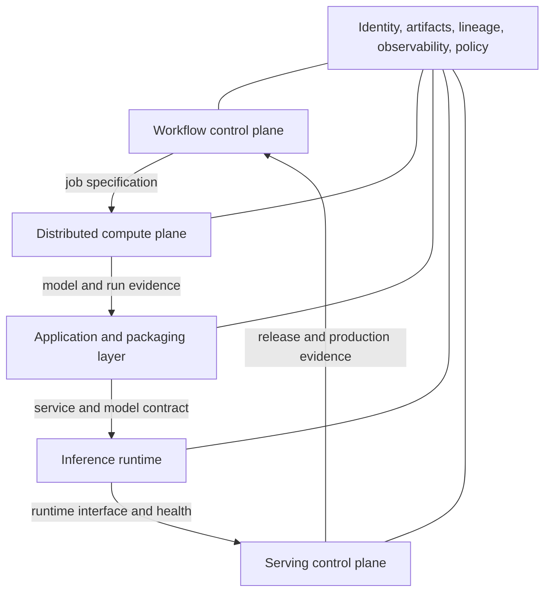
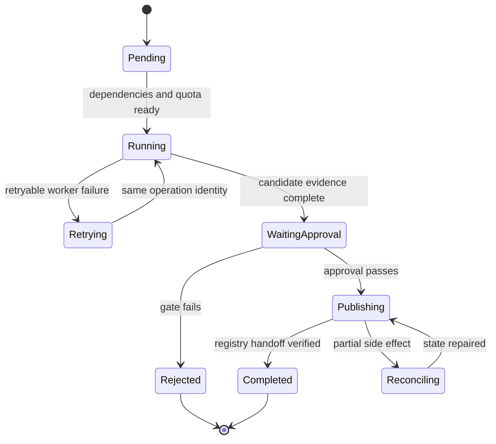
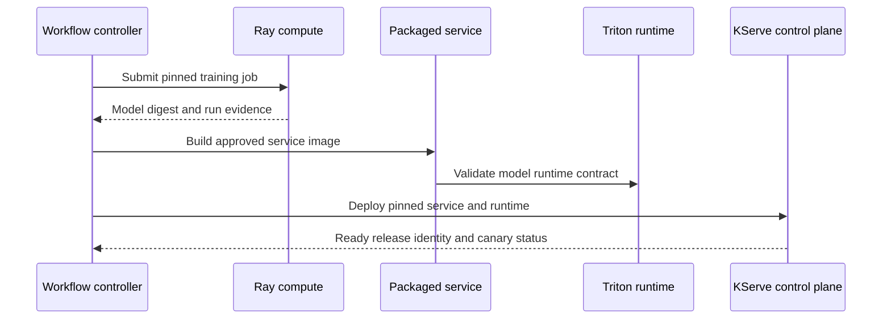

## Platform Tools Implement Different Responsibilities
<!-- section-summary: Workflow, compute, packaging, inference, and serving tools solve different parts of an ML platform and meet through explicit handoffs. -->

Kubeflow Pipelines, Ray, BentoML, NVIDIA Triton Inference Server, KServe, and TorchServe often appear together in MLOps diagrams. They are easy to confuse because several can run containers, deploy models, or expose an API. The useful starting point is the responsibility each tool owns.

An ML platform usually needs five capability layers:

1. A **workflow control plane** records a graph of work and coordinates state, retries, schedules, and approvals.
2. A **distributed compute plane** divides Python or model work across processes, machines, CPUs, and accelerators.
3. An **application and packaging layer** combines preprocessing, model calls, business rules, dependencies, and an API.
4. An **inference runtime** loads model graphs and executes them efficiently with batching, concurrency, and hardware-specific optimization.
5. A **serving control plane** turns a deployment specification into running endpoints, traffic, scaling, policy, and status.

Artifact storage, registry, identity, observability, security, and governance cross every layer. A dashboard inside one product cannot own the meaning of all those systems.



One product can cover several layers. Ray supplies distributed compute and Ray Serve. BentoML packages services and includes deployment capabilities. KServe can select Triton as a runtime. Managed cloud platforms can combine workflow, registry, and endpoints. The architecture remains clear when one owner and one source of truth exist for every responsibility.

## Handoff Contracts Keep Layers Independent
<!-- section-summary: Stable job, artifact, service, and release contracts preserve identity and recovery as work moves between products. -->

A **handoff contract** states what one layer gives the next. It carries identities, inputs, outputs, and guarantees. Without it, integrations often exchange a mutable path such as `models/latest`, and the platform loses the connection between training evidence and production behaviour.

The workflow layer submits a job specification containing code, data, runtime, resources, identity, and retry rules. Compute returns a run record with status, logs, metrics, checkpoints, and output artifact digests. Evaluation attaches a report and decision. Packaging turns the approved inference parts into a service identity. The serving controller pins that identity and reports the runtime version receiving traffic.

| Handoff | Required contract | Important failure |
| --- | --- | --- |
| Workflow to compute | job ID, code and data identity, image, resources, retry policy | retry duplicates side effects or reads moving data |
| Compute to review | model digest, run lineage, metrics, report, schema | report evaluates a different artifact |
| Review to packaging | approved release manifest and runtime requirements | package changes preprocessing after approval |
| Packaging to runtime | model format, tensor or request contract, dependencies | runtime loads model but interprets inputs incorrectly |
| Runtime to serving | health, readiness, capacity, version identity | endpoint routes traffic before the model is ready |
| Serving to operations | release ID, traffic, service and product signals | incident cannot identify the active candidate |

A compact release manifest can connect the tools without turning any product database into the sole evidence store:

```yaml
release_id: catalog-ranker-42
source_run: run-8fb4c32
model_uri: s3://ml-models/catalog-ranker/version=42/
model_sha256: sha256:76ac...
input_contract: catalog-features-v7
service_image: ghcr.io/shop/ranker-api@sha256:31d9...
runtime: triton-validated-profile-v3
approval: review-2026-07-17-1042
rollback_release: catalog-ranker-40
```

Every layer verifies the fields it consumes and carries the release ID forward. Runtime logs and prediction records should report that ID. During rollback, the serving controller restores the complete earlier release rather than swapping only model weights.

## Workflow Control Owns Durable Run State
<!-- section-summary: Workflow systems coordinate dependency graphs and durable transitions, while component authors define meaningful inputs, outputs, retries, and side effects. -->

A **workflow control plane** stores the desired graph and the current state of a run. It knows that data validation must finish before training, evaluation consumes the exact training output, and registration occurs only after a gate passes. Durable state lets a run survive a worker or controller restart.

Kubeflow Pipelines provides a workflow layer for containerized ML components, pipeline definitions, run metadata, caching, and integrations around Kubernetes-based environments. Its value comes from visible component contracts and recorded execution. A component that reads undeclared mutable data, writes into shared paths, or sends the same notification twice on retry still has weak semantics.

The control plane should distinguish pure computation from side effects. Repeating feature calculation into a new run path may be safe. Registering a model, changing an alias, publishing a dataset, or moving traffic modifies shared state. Those operations need an idempotency key and reconciliation: inspect current state, determine whether the intended transition already happened, then complete or compensate it.



Choose a workflow system when durable multi-step state, scheduling, approvals, backfills, lineage, and failure recovery deserve a shared service. A simple scheduled job can stay ordinary code when it has few steps, no long pause, and a clear retry boundary.

## Distributed Compute Owns Parallel Execution
<!-- section-summary: Distributed compute systems schedule and coordinate parallel work, while the workflow layer owns the larger lifecycle and evidence graph. -->

A **distributed compute plane** takes work that exceeds one process or one machine and coordinates it across resources. It manages task placement, worker communication, failure, object movement, and resource requests. The workload may be preprocessing, hyperparameter search, distributed training, batch inference, or a stateful Python application.

Ray provides tasks, actors, datasets, training libraries, tuning, jobs, and Ray Serve around a distributed Python runtime. A workflow controller can submit a Ray Job, wait for its terminal state, and collect output references. Ray then owns the worker topology and distributed execution inside that step. This separation prevents the outer workflow engine and Ray from both retrying the same logical work without coordination.

Distributed execution needs its own evidence: cluster and runtime version, worker topology, CPU and GPU resources, checkpoint identity, data-sharding policy, and output digest. For training, a recovered job may need optimizer, scheduler, scaler, sampler, and random-generator state in addition to weights. A compute system can restart workers, while the training application determines whether the resumed calculation still represents the intended run.

Use distributed compute when the workload needs parallelism or shared state that the ordinary job scheduler does not provide. It adds a cluster runtime, resource model, upgrade path, and observability surface. Small batch jobs and single-node training often fit a simpler managed job or Kubernetes Job.

## Packaging Owns The Prediction Application
<!-- section-summary: The packaging layer joins model execution with preprocessing, validation, policy, dependencies, and a service interface. -->

The model graph rarely owns the whole prediction. The product may need request validation, feature lookup, tokenization, several model calls, thresholds, abstention, policy rules, response shaping, and telemetry. The **application layer** packages those steps into a deployable and testable unit.

BentoML centers this layer. It lets teams define services and APIs around models, package dependencies and model references, build deployment artifacts, and connect to deployment targets. Its role is wider than a tensor runtime because it can hold business-facing Python logic and service contracts.

The application contract should separate deterministic preprocessing and post-processing from external side effects. It should define request and response schemas, timeouts, dependency behaviour, error categories, concurrency limits, and telemetry. Release tests should load the packaged service, run fixtures, verify the model and image digests, and exercise dependency failures.

A FastAPI service in a reviewed OCI image can provide the same responsibility for simple systems. BentoML adds value when its packaging, model management, deployment, and service conventions reduce repeated work across teams. The selection question concerns the shared application lifecycle, rather than the number of decorators in a tutorial.

## Inference Runtimes Own Efficient Model Execution
<!-- section-summary: An inference runtime translates a model representation into efficient CPU or accelerator execution with explicit input, batching, and resource contracts. -->

An **inference runtime** loads a supported model format and executes it. It may optimize graph execution, manage model instances, combine requests into batches, use CPU or accelerator backends, and expose HTTP or gRPC interfaces.

NVIDIA Triton Inference Server supports multiple backends and a model-repository layout. It is useful when teams need high-throughput CPU or GPU inference, dynamic batching, concurrent model instances, ensembles, or a common runtime interface. Its configuration controls model input shapes, batching delay, instance count, and backend. Those settings are product and capacity decisions because batching can improve throughput while adding queue latency.

The runtime contract includes model format and version, input and output names, data types, shapes, maximum batch size, precision, accelerator requirements, warm-up behaviour, and readiness. Representative load tests should measure queue delay, execution time, memory, error rate, and output parity with the reviewed model.

An embedded framework runtime or ONNX Runtime can serve smaller applications. A specialized server helps when model execution is a real performance or fleet-management problem. It cannot supply feature correctness, product policy, release approval, or outcome monitoring.

TorchServe historically supplied PyTorch model archives, handlers, batching, metrics, and serving APIs. Current PyTorch documentation marks TorchServe as **Limited Maintenance** and states that no updates, fixes, new features, or security patches are planned. Existing deployments need an explicit risk and migration plan. New platform designs should avoid treating it as a current strategic default.

## Serving Control Owns Desired Endpoint State
<!-- section-summary: A serving control plane reconciles deployment intent into workloads, networking, traffic, scaling, policy, and observable runtime status. -->

A **serving control plane** accepts an endpoint specification and continually reconciles actual infrastructure toward that state. It selects a runtime, creates workloads, exposes networking, manages traffic, integrates autoscaling, and reports conditions such as model readiness.

KServe provides Kubernetes custom resources for inference services and supports built-in or custom runtimes. A platform can place Triton underneath KServe so Triton owns optimized model execution while KServe owns deployment, network exposure, scaling, and status. This composition is useful when many teams share Kubernetes and need consistent serving conventions.

Readiness must represent the model, rather than only a listening process. A pod can start before weights finish loading or before a remote feature dependency is reachable. The serving controller should route traffic after runtime readiness and fixture validation, then compare desired release identity with telemetry from the loaded service.

KServe adds Kubernetes controllers, runtime configuration, networking, storage integration, upgrades, and policy work. A team with a few services may use a Kubernetes Deployment, a managed container service, or a managed ML endpoint. The control plane earns its cost when it standardizes enough endpoints and removes recurring operator work.

## Compose Layers Without Duplicating Control
<!-- section-summary: A coherent stack assigns each retry, scale, route, publication, and source of truth to one layer. -->

A stack can combine Kubeflow Pipelines for lifecycle control, Ray for distributed training, BentoML for an application service, Triton for model execution, and KServe for endpoint operations. That combination is technically possible and operationally heavy. Each layer needs a clear owner, upgrade policy, interface, and source of evidence.



Common duplication problems include two layers retrying a side effect, two autoscalers changing the same replicas, two systems moving a model alias, and two dashboards claiming authority over deployment truth. Resolve these conflicts in the architecture before implementation. A workflow can retry a deployment reconciliation request, while the serving controller owns replica reconciliation. A registry records candidate identity and approval, while the deployment system owns traffic.

Smaller systems can collapse layers. Ray Jobs and Ray Serve may cover compute and service operation. BentoML may package and deploy a service that loads an embedded runtime. A managed platform may combine workflow, registry, and endpoints. Collapsing layers reduces interfaces and specialist operations. Separating them supports independent scale, specialization, and team ownership.

## Select Tools Through Responsibility And Failure
<!-- section-summary: Tool selection tests the missing responsibility, handoff, failure recovery, ownership, and platform cost rather than comparing feature lists. -->

For each layer, define the workload, durable record, adjacent interface, expected failure, recovery owner, and service objective. Then test a representative path. Kill a worker and inspect retry semantics. Publish a candidate twice with the same operation ID. Start an endpoint with a missing artifact. Trigger a canary stop rule. Verify that the old release returns and that runtime telemetry reports it.

Choose the smallest stack that meets the system’s real constraints. Workflow durability, distributed Python, application packaging, optimized tensor execution, and shared Kubernetes serving are separate needs. A product should enter the architecture because one of those needs exists and because the team accepts its operating cost.

The framework also supports future replacement. Stable job, artifact, service, and release contracts let one layer change without erasing lifecycle evidence. Product names can then evolve while ownership and system behaviour stay understandable.

## References

- [Kubeflow Pipelines documentation](https://www.kubeflow.org/docs/components/pipelines/)
- [Ray Jobs](https://docs.ray.io/en/latest/cluster/running-applications/job-submission/index.html)
- [Ray Core concepts](https://docs.ray.io/en/latest/ray-core/walkthrough.html)
- [Ray Serve](https://docs.ray.io/en/latest/serve/)
- [BentoML documentation](https://docs.bentoml.com/)
- [NVIDIA Triton Inference Server](https://docs.nvidia.com/deeplearning/triton-inference-server/user-guide/docs/)
- [Triton model configuration](https://docs.nvidia.com/deeplearning/triton-inference-server/user-guide/docs/user_guide/model_configuration.html)
- [KServe documentation](https://kserve.github.io/website/)
- [KServe model serving runtimes](https://kserve.github.io/website/docs/model-serving/predictive-inference/frameworks/overview)
- [TorchServe limited-maintenance notice](https://docs.pytorch.org/serve/)
