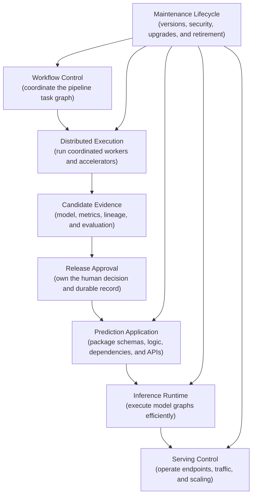
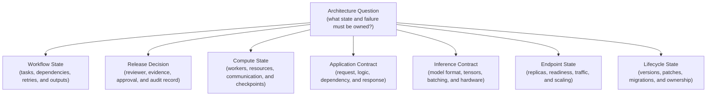
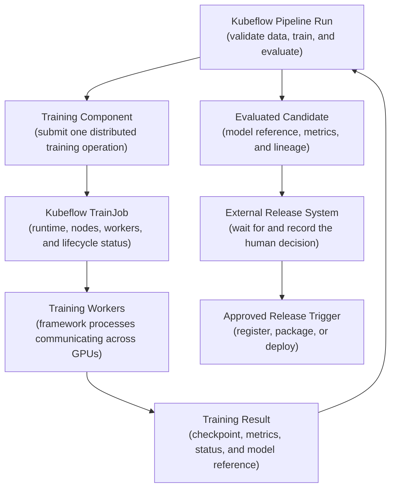
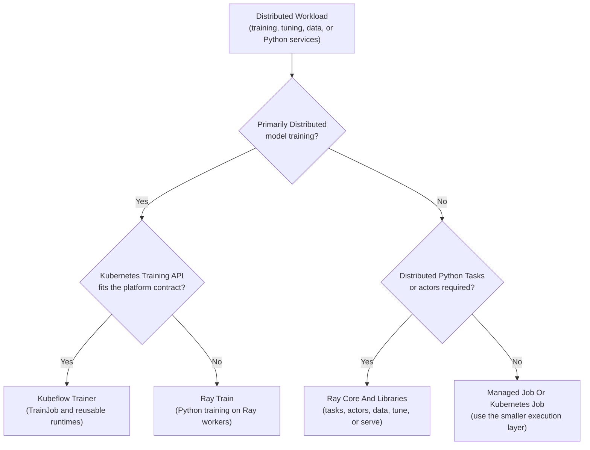
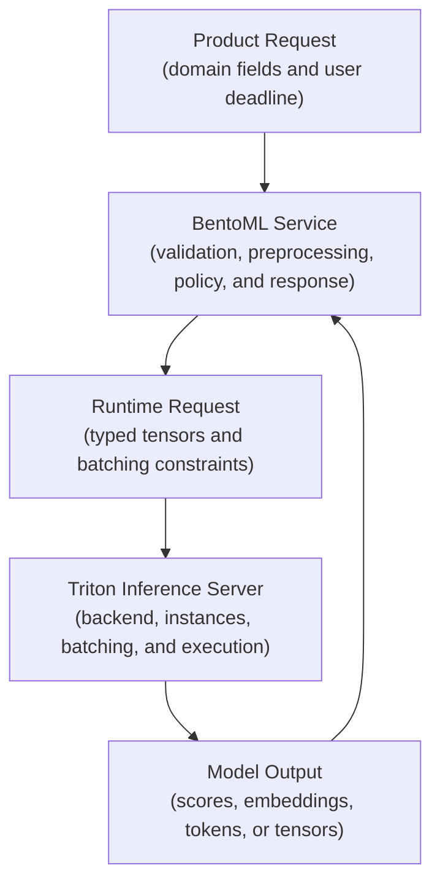
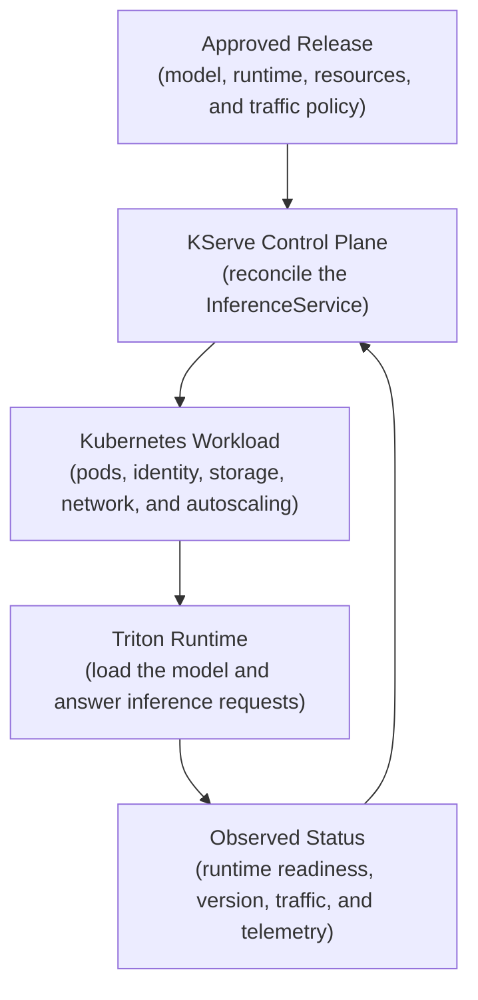
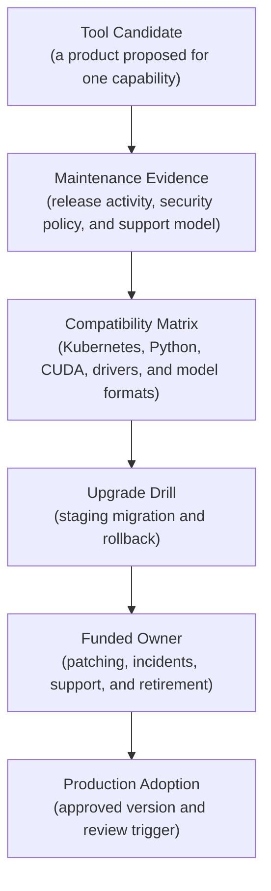
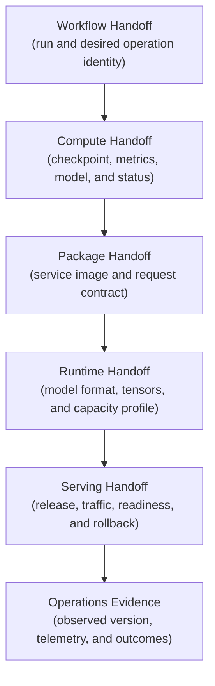
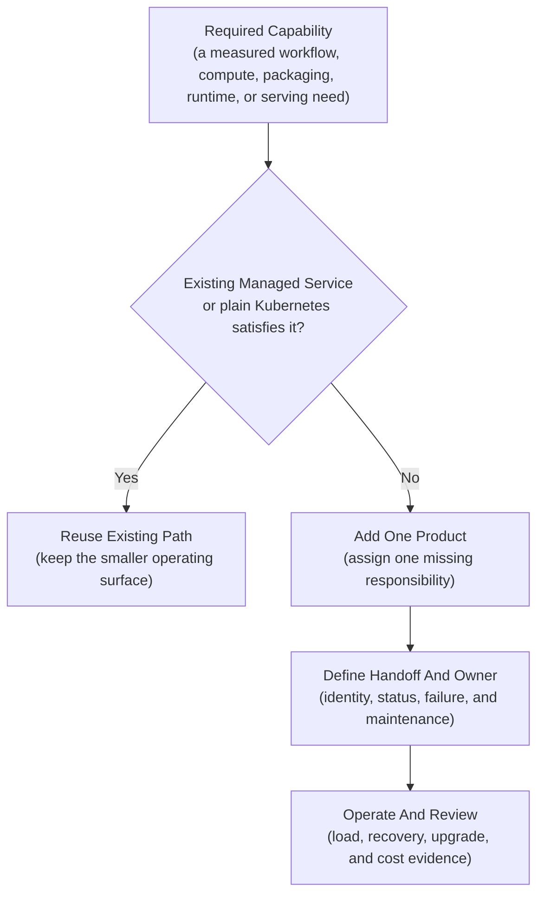
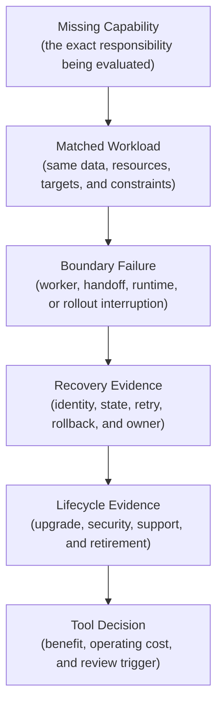

## Table of Contents

1. [What These Tools Actually Solve](#what-these-tools-actually-solve)
2. [Understand The Six Jobs These Tools Can Perform](#understand-the-six-jobs-these-tools-can-perform)
3. [Separate Workflow Orchestration From Distributed Training](#separate-workflow-orchestration-from-distributed-training)
4. [Choose One System To Run Distributed Python Work](#choose-one-system-to-run-distributed-python-work)
5. [Separate Product Request Logic From Model Execution](#separate-product-request-logic-from-model-execution)
6. [Use A Serving Control Plane To Operate Shared Endpoints](#use-a-serving-control-plane-to-operate-shared-endpoints)
7. [Plan Upgrades, Security, And Support For Every Tool](#plan-upgrades-security-and-support-for-every-tool)
8. [Define What Each Tool Passes To The Next](#define-what-each-tool-passes-to-the-next)
9. [Build The Smallest Coherent Stack](#build-the-smallest-coherent-stack)
10. [Test Each Tool Against Real Workloads And Failures](#test-each-tool-against-real-workloads-and-failures)
11. [The Main Idea](#the-main-idea)
12. [References](#references)

## What These Tools Actually Solve
<!-- section-summary: Kubeflow Pipelines, Kubeflow Trainer, Ray, BentoML, Triton, and KServe solve different control, execution, packaging, and serving problems. -->

MLOps diagrams often place Kubeflow, Ray, BentoML, Triton, KServe, and TorchServe in one large box labelled platform. A beginner can reasonably assume that they are alternatives. The products actually sit at different boundaries, and several of them overlap only in part.

Start with an ordinary production journey. A team prepares data, trains a model across four GPUs, and evaluates the candidate. The pipeline then hands the candidate and its evidence to a release system. That system records the human approval decision before packaging and deployment continue. Each part introduces a different operational problem. The workflow records task state. The training runtime coordinates workers. The release system owns the durable approval record. The prediction service applies request validation and product rules. The model runtime executes tensors efficiently. The endpoint platform manages replicas, networking, scaling, and rollout status.

One tool can cover more than one job. Ray provides distributed execution and Ray Serve. BentoML packages services and can deploy them. KServe can deploy Triton as a serving runtime. A managed cloud platform can provide training, workflows, and endpoints behind one control plane. Assign each responsibility to one owner. That map prevents a tool list from turning into a stack with overlapping control planes.


```mermaid
flowchart TD
    Workflow["Workflow Control<br/>(coordinate the pipeline task graph)"] --> Distributed["Distributed Execution<br/>(run coordinated workers and accelerators)"]
    Distributed --> Candidate["Candidate Evidence<br/>(model, metrics, lineage, and evaluation)"]
    Candidate --> Approval["Release Approval<br/>(own the human decision and durable record)"]
    Approval --> Package["Prediction Application<br/>(package schemas, logic, dependencies, and APIs)"]
    Package --> Runtime["Inference Runtime<br/>(execute model graphs efficiently)"]
    Runtime --> Serving["Serving Control<br/>(operate endpoints, traffic, and scaling)"]
    Maintenance["Maintenance Lifecycle<br/>(versions, security, upgrades, and retirement)"] --> Workflow
    Maintenance --> Distributed
    Maintenance --> Package
    Maintenance --> Runtime
    Maintenance --> Serving

    class Maintenance lifecycle
```

This capability map is the spine for tool selection. Product names enter after the job, ownership, and failure boundary are understood.

## Understand The Six Jobs These Tools Can Perform
<!-- section-summary: Six boundaries separate long-running workflow state, distributed workers, service code, optimized inference, endpoint operations, and maintenance ownership. -->

A **capability boundary** tells the team which state a layer owns and which result it promises to the next layer. Six boundaries cover the products in this guide.

**Workflow control** owns the graph of pipeline tasks. It records which task should run, which output feeds the next task, and whether execution is pending, running, retrying, failed, or complete. Kubeflow Pipelines belongs here.

Human release approval is a separate governance boundary. Core KFP does not provide a first-class resumable human-approval pause. A KFP run can finish after producing an evaluated candidate, then hand its evidence to a release or approval system. That external system owns the waiting state, reviewer identity, decision, and audit record. A custom KFP component can call such a service, but the durable approval semantics still belong to that service.

**Distributed execution** owns the workers inside one compute-intensive step. It coordinates processes, machines, accelerators, placement, communication, and worker recovery. Kubeflow Trainer and Ray both address parts of this job through different abstractions.

**Prediction application and packaging** owns the code around the model. Request schemas, preprocessing, feature calls, business rules, dependencies, API behaviour, and response shaping live here. BentoML is designed around this boundary.

**Inference runtime** owns efficient execution of a supported model representation. It loads model files, manages instances, batches compatible requests, and uses CPU or accelerator backends. NVIDIA Triton Inference Server is a prominent example.

**Serving control** owns the desired endpoint. It creates workloads, exposes networking, applies scaling and traffic rules, checks readiness, and reports deployment status. KServe supplies this control plane for Kubernetes.

**Maintenance lifecycle** owns the product after installation. Release tracking, compatibility, security patches, backups, upgrades, deprecation, migration, and on-call all belong here. TorchServe’s Limited Maintenance status shows why this boundary must stay visible.


```mermaid
flowchart TD
    Question["Architecture Question<br/>(what state and failure must be owned?)"] --> Workflow["Workflow State<br/>(tasks, dependencies, retries, and outputs)"]
    Question --> Approval["Release Decision<br/>(reviewer, evidence, approval, and audit record)"]
    Question --> Compute["Compute State<br/>(workers, resources, communication, and checkpoints)"]
    Question --> Application["Application Contract<br/>(request, logic, dependency, and response)"]
    Question --> Inference["Inference Contract<br/>(model format, tensors, batching, and hardware)"]
    Question --> Endpoint["Endpoint State<br/>(replicas, readiness, traffic, and scaling)"]
    Question --> Lifecycle["Lifecycle State<br/>(versions, patches, migrations, and ownership)"]
```

The boundaries prevent ambiguous statements such as “Ray runs the pipeline” or “Triton deploys the service.” Ray can execute distributed work inside a lifecycle step. Triton can serve a model inside an endpoint. The outer workflow and endpoint control still need an owner.

## Separate Workflow Orchestration From Distributed Training
<!-- section-summary: Kubeflow Pipelines coordinates lifecycle steps, while Kubeflow Trainer coordinates the workers inside a distributed training step. -->

The word orchestration causes much of the confusion. A workflow system orchestrates tasks across the ML lifecycle. A distributed-training system orchestrates processes inside one training task. Both coordinate work, but they own different state.

### Use Kubeflow Pipelines To Coordinate ML Workflow Steps

**Kubeflow Pipelines**, usually shortened to KFP, is a Kubernetes-oriented workflow system for ML pipelines. A pipeline declares components, inputs, outputs, execution order, conditions, retries, caching, and exit handling. The backend turns a run into Kubernetes resources and tracks its progress.

Suppose a release includes data validation, training, evaluation, human approval, and registration. KFP coordinates validation, training, and evaluation. It records which artifact connects those tasks and which task failed. After evaluation, the pipeline publishes a candidate reference and evidence bundle to a release system. The release system records who reviewed it and whether it was approved. An approved decision can trigger registration or a second deployment pipeline.

The training task also has a smaller boundary inside it. KFP should not implement collective communication between four training workers. The training component submits that specialized job and returns a model reference plus status.

### Use Kubeflow Trainer For Distributed Training On Kubernetes

**Kubeflow Trainer** is the current Kubernetes-native Kubeflow component for distributed model training and fine-tuning. Trainer v2 uses `TrainJob` and reusable runtime resources to describe distributed work across frameworks. It replaces the older framework-specific Training Operator v1 resources for new designs.

The current Trainer v2 examples use the `trainer.kubeflow.org/v1alpha1` API. In Kubernetes API naming, `alpha` signals that the contract is still early and may change between releases. A platform team should pin the installed version, wrap TrainJob creation behind a versioned template or internal API, and prove manifest and SDK migrations in staging. That boundary protects training users from depending directly on an evolving organization-wide contract.


```mermaid
flowchart TD
    Pipeline["Kubeflow Pipeline Run<br/>(validate data, train, and evaluate)"] --> TrainStep["Training Component<br/>(submit one distributed training operation)"]
    TrainStep --> TrainJob["Kubeflow TrainJob<br/>(runtime, nodes, workers, and lifecycle status)"]
    TrainJob --> Workers["Training Workers<br/>(framework processes communicating across GPUs)"]
    Workers --> Result["Training Result<br/>(checkpoint, metrics, status, and model reference)"]
    Result --> Pipeline
    Pipeline --> Candidate["Evaluated Candidate<br/>(model reference, metrics, and lineage)"]
    Candidate --> Approval["External Release System<br/>(wait for and record the human decision)"]
    Approval --> Publish["Approved Release Trigger<br/>(register, package, or deploy)"]
```

The outer pipeline should submit one stable training operation ID and observe its status. If KFP retries after a timeout, it should reuse the existing TrainJob for that operation. Trainer owns worker creation and training-job status. The training code owns checkpoint completeness and numerical recovery.

A single scheduled training job may need neither product. A managed cloud training job or a Kubernetes Job can be sufficient if the work has one process group, a simple trigger, and a clear output contract. KFP earns its cost through durable multi-step workflows. Trainer earns its cost through repeated distributed-training needs on Kubernetes.

## Choose One System To Run Distributed Python Work
<!-- section-summary: Kubeflow Trainer and Ray can both coordinate distributed ML work, so the architecture should choose one execution owner for each workload. -->

**Ray** is a distributed Python system. Ray Core provides tasks and stateful actors across a cluster. Ray Data, Train, Tune, and Serve add higher-level libraries for data processing, distributed training, tuning, and online serving. A Ray Job submits an application to a Ray cluster and reports its lifecycle.

Ray fits workloads whose internal structure is naturally expressed in Python. A training function can run across Ray Train workers. A tuning job can launch many trials with different resource requests. A batch application can combine tasks and actors without translating every part into separate workflow containers.

Kubeflow Trainer fits teams that want a Kubernetes-native training API with reusable training runtimes and close integration with cluster schedulers. Ray supports a broader distributed Python runtime across training, tuning, data processing, and service applications.

Choose from the workload inward. A platform team already operating Kubernetes admission queues may prefer Trainer for a conventional PyTorch job. A research team building a Python application that launches tuning trials, preprocesses batches, and coordinates stateful workers may get more value from Ray. Team skills and the existing operating model matter alongside raw framework capability.


```mermaid
flowchart TD
    Workload["Distributed Workload<br/>(training, tuning, data, or Python services)"] --> TrainingOnly{"Primarily Distributed<br/>model training?"}
    TrainingOnly -->|Yes| KubernetesFit{"Kubernetes Training API<br/>fits the platform contract?"}
    KubernetesFit -->|Yes| Trainer["Kubeflow Trainer<br/>(TrainJob and reusable runtimes)"]
    KubernetesFit -->|No| RayTrain["Ray Train<br/>(Python training on Ray workers)"]
    TrainingOnly -->|No| PythonGraph{"Distributed Python Tasks<br/>or actors required?"}
    PythonGraph -->|Yes| RayCore["Ray Core And Libraries<br/>(tasks, actors, data, tune, or serve)"]
    PythonGraph -->|No| Simple["Managed Job Or Kubernetes Job<br/>(use the smaller execution layer)"]
```

Avoid two independent retry owners around the same work. If a workflow submits a Ray Job, the workflow owns the lifecycle step and Ray owns its workers. If Ray Train retries workers internally, the outer workflow should not create another logical run for the same temporary worker failure. The operation ID, checkpoint, and terminal status connect the two layers.

Distributed execution also changes observability. Record the outer run ID, Ray Job or TrainJob identity, worker topology, resource allocation, checkpoint identity, and output digest. A “job succeeded” message without those links is weak production evidence.

## Separate Product Request Logic From Model Execution
<!-- section-summary: BentoML packages the product-facing prediction service, while Triton specializes in efficient execution of supported model representations. -->

A trained model usually accepts tensors or framework objects. A product accepts domain requests. The space between them contains validation, feature retrieval, tokenization, thresholds, policy, fallback, and response formatting.

The **prediction application** owns that product-facing behaviour. The **inference server** owns efficient model execution. Small services may combine both in one process. Larger systems often separate them because the application and model runtime scale, fail, and change for different reasons.

### Use BentoML To Package The Prediction Application

**BentoML** is an open-source Python framework for defining and packaging AI services. A BentoML Service can expose APIs, load models, declare resources and timeouts, and include preprocessing or multi-model application logic. A **Bento** packages the source, Python dependencies, model artifacts, and runtime configuration. BentoML can turn that package into an OCI image or deploy it through BentoCloud.

Consider a document classifier that accepts uploaded text. Its service first checks that the request has the expected fields and removes content the model must never receive. It then selects the approved model route, calls that model, applies the product's confidence rule, and returns a typed response. These behaviours define the prediction product. Unit tests and request fixtures can verify them without starting a Kubernetes endpoint controller.

### Use Triton To Optimize Model Execution

**NVIDIA Triton Inference Server** is an inference server with backends for formats and frameworks such as TensorRT, ONNX Runtime, PyTorch, and Python. It loads models from a required repository layout and exposes inference protocols. Its strengths include model instances, concurrent execution, dynamic batching, ensembles, and performance-analysis tooling.

Dynamic batching illustrates the runtime boundary. Triton can hold compatible requests briefly and execute them as a larger batch. This often improves accelerator throughput. The queue delay also consumes part of the endpoint’s latency budget.

```protobuf
name: "risk_model"
platform: "onnxruntime_onnx"
max_batch_size: 16

dynamic_batching {
  preferred_batch_size: [8, 16]
  max_queue_delay_microseconds: 2000
}

instance_group [{
  count: 2
  kind: KIND_GPU
}]
```

This configuration asks Triton to combine requests into batches of up to sixteen, wait no more than two milliseconds for a preferred batch, and run two model instances on GPUs. A load test must verify throughput, queue time, execution time, memory use, and output parity. Copying these values to another model would be unsafe because model size and traffic shape change the result.


```mermaid
flowchart TD
    Request["Product Request<br/>(domain fields and user deadline)"] --> Application["BentoML Service<br/>(validation, preprocessing, policy, and response)"]
    Application --> Tensor["Runtime Request<br/>(typed tensors and batching constraints)"]
    Tensor --> Triton["Triton Inference Server<br/>(backend, instances, batching, and execution)"]
    Triton --> Output["Model Output<br/>(scores, embeddings, tokens, or tensors)"]
    Output --> Application
```

BentoML can also load a model directly, and Triton’s Python backend can contain Python logic. Those options collapse the layers. Use the split only if separate scaling, specialized acceleration, multi-model management, or team ownership justifies another network and deployment boundary.

## Use A Serving Control Plane To Operate Shared Endpoints
<!-- section-summary: KServe reconciles Kubernetes endpoint intent, while the selected serving framework or inference runtime answers prediction requests. -->

An inference server can listen on a port, but that alone does not create a production endpoint. The platform must start the workload, grant access to model storage, expose a network address, and determine whether the model is ready. It also has to change replica counts and move traffic between releases. A **serving control plane** manages this endpoint lifecycle and records its current state.

**KServe** is a Kubernetes model-serving control plane. Its `InferenceService` resource defines predictive inference workloads, and serving-runtime resources describe supported model servers. The KServe controller reconciles the desired resource into Kubernetes or Knative-backed deployments. Current KServe documentation also separates generative workloads through `LLMInferenceService` resources.

KServe can use Triton as a serving runtime. In that composition, KServe owns deployment state, network exposure, scaling, traffic, and readiness integration. Triton owns model loading and inference execution inside the workload.


```mermaid
flowchart TD
    Release["Approved Release<br/>(model, runtime, resources, and traffic policy)"] --> KServe["KServe Control Plane<br/>(reconcile the InferenceService)"]
    KServe --> Kubernetes["Kubernetes Workload<br/>(pods, identity, storage, network, and autoscaling)"]
    Kubernetes --> Triton["Triton Runtime<br/>(load the model and answer inference requests)"]
    Triton --> Status["Observed Status<br/>(runtime readiness, version, traffic, and telemetry)"]
    Status --> KServe
```

Readiness should mean that the correct model can answer a fixture request. A process can open its HTTP port before weights are loaded. The controller and rollout path need the runtime’s model-ready signal and the observed release identity before sending production traffic.

KServe adds controllers, custom resources, runtime definitions, network integrations, autoscaling behaviour, storage credentials, and upgrades. A plain Kubernetes Deployment may suit a small number of stable services. A managed ML endpoint or container service may suit a team that wants the provider to own the control plane. KServe is valuable after shared Kubernetes serving conventions remove repeated operator work across enough models.

## Plan Upgrades, Security, And Support For Every Tool
<!-- section-summary: Production adoption requires evidence that each tool receives compatible releases, security fixes, migration support, and a funded internal owner. -->

Installing a product starts its operating lifecycle. The platform team must follow releases, compatibility, vulnerabilities, backups, upgrades, deprecations, and incident ownership. This work grows quickly in a stack with several controllers and runtimes.

Compatibility crosses products. A Kubernetes upgrade can affect KServe and Kubeflow controllers. A CUDA or driver change can affect Ray workers and Triton backends. A model-format or framework change can affect packaging and numerical output. An SDK upgrade can change compiled pipeline or training resources. Test the supported combinations as one platform release.

TorchServe is the clearest maintenance warning in this tool family. **TorchServe** was a PyTorch model server with model archives, custom handlers, batching, metrics, and management APIs. Its official documentation now marks the project as **Limited Maintenance**. It states that active maintenance has ended and that no updates, bug fixes, new features, or security patches are planned.

For an existing TorchServe deployment, the immediate task is risk ownership. Inventory models, handlers, custom native dependencies, traffic, network exposure, and unresolved vulnerabilities. Pin the current environment, restrict exposure, and define a migration target. Test output parity and load behaviour on the replacement before shifting traffic.

For a new platform, Limited Maintenance confines TorchServe to legacy compatibility. Current alternatives depend on the required boundary: Triton for optimized multi-backend execution, BentoML or an ordinary API framework for Python service packaging, KServe or a managed endpoint for deployment control, and specialized LLM servers for generative workloads.


```mermaid
flowchart TD
    Candidate["Tool Candidate<br/>(a product proposed for one capability)"] --> Status["Maintenance Evidence<br/>(release activity, security policy, and support model)"]
    Status --> Compatibility["Compatibility Matrix<br/>(Kubernetes, Python, CUDA, drivers, and model formats)"]
    Compatibility --> Upgrade["Upgrade Drill<br/>(staging migration and rollback)"]
    Upgrade --> Owner["Funded Owner<br/>(patching, incidents, support, and retirement)"]
    Owner --> Adopt["Production Adoption<br/>(approved version and review trigger)"]

    class Owner owner
```

Maintenance status can change, so the platform decision should link to the official status page and record a review trigger. A project with a healthy release cadence still needs an internal owner; community activity does not operate the organization’s deployment.

## Define What Each Tool Passes To The Next
<!-- section-summary: Job, model, service, runtime, and release identities preserve evidence as work moves between independently owned layers. -->

A handoff contract states exactly what one layer gives the next. It carries immutable identities, required inputs, produced outputs, and a status that the receiver can verify.

The workflow submits a distributed job with a run ID, source revision, dataset reference, image digest, resource profile, and retry identity. The execution layer returns a model identifier, checkpoint, metrics, and terminal status. The packaging layer binds approved prediction code and dependencies to a service image. The serving layer deploys that image with a runtime profile and reports the version receiving traffic.

A small release record can connect these layers:

```yaml
release:
  id: risk-model-r42
  sourceRun: run-8fb4c32
  model:
    uri: s3://ml-models/risk-model/version=42/
    digest: sha256:76ac...
  serviceImage: registry.example.com/risk-api@sha256:31d9...
  runtimeProfile: triton-gpu-reviewed-v3
  approval: review-risk-r42
  rollbackRelease: risk-model-r40
```

The workflow does not need to understand how Triton schedules model instances. KServe does not need to understand how Ray workers trained the model. Each system verifies the fields it consumes and carries the release ID into status, logs, metrics, and prediction records.


```mermaid
flowchart TD
    Workflow["Workflow Handoff<br/>(run and desired operation identity)"] --> Compute["Compute Handoff<br/>(checkpoint, metrics, model, and status)"]
    Compute --> Package["Package Handoff<br/>(service image and request contract)"]
    Package --> Runtime["Runtime Handoff<br/>(model format, tensors, and capacity profile)"]
    Runtime --> Serving["Serving Handoff<br/>(release, traffic, readiness, and rollback)"]
    Serving --> Operations["Operations Evidence<br/>(observed version, telemetry, and outcomes)"]
```

Failure tests should target the handoffs. Retry the outer workflow after it loses the TrainJob response. Block model publication after workers succeed. Start Triton with a missing model version. Route a canary to a service that is process-ready and model-unready. The operation identity and durable status should prevent duplicate training, incomplete releases, and premature traffic.

## Build The Smallest Coherent Stack
<!-- section-summary: The smallest coherent stack assigns every required responsibility once and avoids extra controllers for capabilities the workload does not need. -->

A coherent stack covers every required responsibility once and gives each responsibility a clear source of truth. The goal is a system that a team can operate as one path from training request to production endpoint. Adding another controller creates another API, upgrade schedule, failure mode, and handoff to understand. Begin with the capabilities already supplied by the cloud or Kubernetes platform, then add a specialist tool only for a workload the existing stack cannot support well.

### Run Simple Scheduled Training

A weekly single-node training run may use GitHub Actions or a scheduler to submit a managed training job. Object storage and MLflow 3 record outputs. No Kubeflow installation or Ray cluster is necessary if the job has a simple dependency path and the provider already supplies execution status.

### Run Distributed Training On Kubernetes

A Kubernetes-centered platform may use Kubeflow Pipelines for the lifecycle and Kubeflow Trainer for distributed training. Kueue can handle queue admission if the cluster needs shared accelerator policy. The model output can move into an existing registry and managed endpoint. This stack avoids adding Ray unless its broader distributed Python model solves a real workload.

### Run A Distributed Python Application

A team with Python-native data, training, tuning, and service logic may use Ray as the execution platform. Ray Jobs or an outer workflow submits applications, while Ray Train and Tune coordinate internal work. Ray Serve can own the serving application. Adding BentoML or KServe should follow a specific packaging or Kubernetes-control requirement.

### Build An Optimized GPU Endpoint

A latency-sensitive multi-model endpoint may use BentoML for product-facing request logic, Triton for optimized GPU execution, and KServe for shared Kubernetes endpoint control. Each extra layer adds a network hop and maintenance surface. The measured throughput, scaling, and ownership benefits must justify that cost.

### Prefer A Managed Platform When It Covers The Workload

A managed cloud or lakehouse platform may already provide pipelines, training, model records, endpoints, telemetry, and support. Use its supported path if it meets the workload and governance requirements. Open-source components can fill a verified gap without replacing the full managed lifecycle.


```mermaid
flowchart TD
    Need["Required Capability<br/>(a measured workflow, compute, packaging, runtime, or serving need)"] --> Existing{"Existing Managed Service<br/>or plain Kubernetes satisfies it?"}
    Existing -->|Yes| Reuse["Reuse Existing Path<br/>(keep the smaller operating surface)"]
    Existing -->|No| Product["Add One Product<br/>(assign one missing responsibility)"]
    Product --> Contract["Define Handoff And Owner<br/>(identity, status, failure, and maintenance)"]
    Contract --> Verify["Operate And Review<br/>(load, recovery, upgrade, and cost evidence)"]
```

Tool count is not a sign of platform maturity. A small stack with clear status and recovery can serve users better than a feature-rich stack with overlapping controllers.

## Test Each Tool Against Real Workloads And Failures
<!-- section-summary: Tool evaluation proves the missing capability, handoff recovery, operating ownership, maintenance path, and workload economics. -->

Start from the missing capability. If the problem is distributed GPU training, use a representative topology and checkpoint. If the problem is endpoint throughput, use the real model shape and latency target. If the problem is workflow recovery, test the retry after a submitted job loses its response. Test a durable human pause in the external release system that owns approval state.

Run each plausible option with the same workload, data, resource limit, acceptance criteria, and team budget. Capture setup work, steady-state operation, failure diagnosis, recovery, upgrade effort, and cost. A tutorial completion time has little value if the production workload depends on private storage, custom accelerators, or a strict rollback target.

The evaluation should include these failure drills:

1. Stop a distributed worker after a checkpoint and verify that the resumed run has one logical identity.
2. Lose the workflow response after job submission and verify that a retry finds the existing job.
3. Publish an incompatible model format and verify that the runtime rejects it before traffic.
4. Hold runtime readiness false and verify that the serving controller sends no production requests.
5. Upgrade one component in staging and verify the recorded rollback procedure.


```mermaid
flowchart TD
    Capability["Missing Capability<br/>(the exact responsibility being evaluated)"] --> Baseline["Matched Workload<br/>(same data, resources, targets, and constraints)"]
    Baseline --> Failure["Boundary Failure<br/>(worker, handoff, runtime, or rollout interruption)"]
    Failure --> Recovery["Recovery Evidence<br/>(identity, state, retry, rollback, and owner)"]
    Recovery --> Lifecycle["Lifecycle Evidence<br/>(upgrade, security, support, and retirement)"]
    Lifecycle --> Decision["Tool Decision<br/>(benefit, operating cost, and review trigger)"]
```

The final decision names the source of truth for workflow state, worker state, service identity, model runtime status, and endpoint traffic. It also names the patch and on-call owner. Any responsibility with two owners or no owner needs redesign before production.

## The Main Idea
<!-- section-summary: MLOps tools fit together through explicit capability boundaries, small contracts, one source of truth per responsibility, and funded lifecycle ownership. -->

Kubeflow Pipelines, Kubeflow Trainer, Ray, BentoML, Triton, and KServe belong to different parts of an ML platform. Pipelines coordinates the lifecycle. Trainer or Ray coordinates distributed execution. BentoML packages a prediction application. Triton executes supported models efficiently. KServe operates Kubernetes endpoints. Maintenance ownership crosses them all.

Choose the smallest combination that covers the real workload. Then trace one model release through the design. You should be able to identify the workflow run, the distributed job, the immutable model artifact, the prediction-service package, the inference-runtime configuration, and the endpoint revision that received traffic. That chain lets an operator answer what ran, what was deployed, and where a failure occurred.

Connect those layers through small handoff contracts. Test crash recovery and rollback as separate operating procedures, then rehearse version upgrades against the same contracts. TorchServe's Limited Maintenance status offers a practical lesson: production architecture includes the years after installation. Give every selected tool a patch owner and an upgrade path. Record the conditions that would trigger its replacement before support disappears.

## References

- [Kubeflow Pipelines concepts](https://www.kubeflow.org/docs/components/pipelines/concepts/pipeline/)
- [Kubeflow Pipelines component specification](https://www.kubeflow.org/docs/components/pipelines/reference/component-spec/)
- [Kubeflow Trainer overview](https://www.kubeflow.org/docs/components/trainer/overview/)
- [Migrating to Kubeflow Trainer v2](https://www.kubeflow.org/docs/components/trainer/operator-guides/migration/)
- [Ray Core](https://docs.ray.io/en/latest/ray-core/walkthrough.html)
- [Ray Jobs](https://docs.ray.io/en/latest/cluster/running-applications/job-submission/index.html)
- [Ray Train](https://docs.ray.io/en/latest/train/overview.html)
- [Ray Serve](https://docs.ray.io/en/latest/serve/)
- [BentoML Services](https://docs.bentoml.com/en/latest/build-with-bentoml/services.html)
- [BentoML packaging for deployment](https://docs.bentoml.com/en/latest/get-started/packaging-for-deployment.html)
- [NVIDIA Triton Inference Server](https://docs.nvidia.com/deeplearning/triton-inference-server/user-guide/docs/)
- [Triton model repository](https://docs.nvidia.com/deeplearning/triton-inference-server/user-guide/docs/user_guide/model_repository.html)
- [Triton optimization](https://docs.nvidia.com/deeplearning/triton-inference-server/user-guide/docs/user_guide/optimization.html)
- [KServe installation concepts](https://kserve.github.io/website/docs/install/overview)
- [KServe serving runtimes](https://kserve.github.io/website/docs/model-serving/predictive-inference/frameworks/overview)
- [TorchServe Limited Maintenance notice](https://docs.pytorch.org/serve/)
