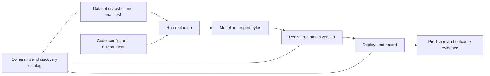

## Why ML Needs Several Storage Responsibilities
<!-- section-summary: Production ML stores large immutable files, structured lifecycle records, searchable ownership data, and links that connect one model version to its evidence. -->

**ML storage systems** keep the files and records that explain how a model was created and where it is used. A model package by itself cannot tell you which data trained it, which code created it, which evaluation reviewed it, or which owner should respond when it fails. Production teams need durable bytes and structured records that stay connected.

A supporting example follows **ParcelPilot**, a delivery platform that predicts whether a package will arrive more than twenty-four hours late. One training run reads Parquet files, uses a feature schema, writes a model package, records metrics, and produces an evaluation report. The team needs to replay the run six months later and investigate a production prediction without searching through personal folders.

This article owns the storage architecture and lineage questions. The next article explains object-storage mechanics such as versioning, integrity, access, and lifecycle rules. The final storage article owns promotion across development, staging, and production. Keeping those responsibilities separate gives the module a progressive path.

## Separate Bytes From Records
<!-- section-summary: A data plane stores large files, while a metadata plane stores identities, relationships, ownership, and lifecycle state. -->

The clearest storage framework starts with two layers. The **data plane** stores large or immutable bytes. The **metadata plane** stores small structured records that help people and automation find, compare, and govern those bytes.

| Layer | Typical content | Useful systems |
| --- | --- | --- |
| Data plane | Dataset files, model weights, tokenizers, plots, reports, and checkpoints (saved intermediate training state for resume) | S3, Azure Blob Storage, Cloud Storage, lakehouse tables, file or volume storage |
| Metadata plane | Run parameters, metrics, owners, schemas, model versions, lineage links, review status | MLflow, W&B, managed ML platforms, model registries, catalogs, relational or warehouse tables |

The layers can share infrastructure. MLflow may store run records in PostgreSQL and artifact files in S3. A lakehouse can store dataset bytes and table metadata together. The design boundary still matters because the team should know which system owns each fact.

ParcelPilot defines four storage responsibilities across those layers:

| Responsibility | Question it answers | Main record |
| --- | --- | --- |
| Artifact storage | Which exact files did a run create? | Immutable Uniform Resource Identifier (URI) plus digest |
| Dataset identity | Which rows and label window trained or evaluated the model? | Snapshot or table version plus manifest |
| Run and model metadata | Which code, parameters, metrics, schema, and model version belong together? | Run ID and registered model version |
| Catalog and lineage | Who owns the asset and how do data, run, model, deployment, and prediction connect? | Stable asset IDs and typed links |

These responsibilities avoid a common category error. A bucket can hold a model file, while it cannot supply a complete approval workflow or searchable lineage by itself. A registry can name a model version, while it usually points to artifact bytes stored elsewhere. A catalog can help people discover assets, while it should link to the systems that own run details and files.



The large bytes can live in object or lakehouse storage while smaller records live in tracking, registry, deployment, and catalog systems. Stable links form the evidence graph. Each fact keeps one authoritative owner, and other systems carry references rather than conflicting copies.

## Give Each Fact One Owner
<!-- section-summary: Storage stays trustworthy when each important fact has one authoritative system and other systems carry links rather than conflicting copies. -->

ParcelPilot writes an ownership table before choosing products:

| Fact | Authoritative system | Referenced by |
| --- | --- | --- |
| Dataset file bytes | Object storage or lakehouse table version | Dataset manifest, training run |
| Dataset schema and label window | Dataset manifest repository | Run metadata, evaluation packet |
| Training parameters and metrics | MLflow run | Model version, catalog |
| Model package bytes | Artifact store | Registered model version |
| Model name and version | Model registry | Evaluation, deployment record |
| Production deployment version | Serving or deployment control plane | Catalog, prediction logs |
| Business owner and risk tier | AI or asset inventory | Registry tags, review packet |

Links should copy stable identifiers instead of duplicating mutable facts. The model registry can store the MLflow run ID. The run can store the dataset snapshot ID. The deployment record can store the immutable model version. Prediction logs can store the deployment and model version. A catalog entry then links to those records rather than copying every metric and configuration field.

This rule prevents conflicting truth. If three systems each hold a manually edited `production_model_version`, an incident responder cannot know which value describes live traffic. The deployment control plane owns live state. The registry owns model identity and lifecycle metadata. The catalog indexes both.

## Build A Small Asset Catalog
<!-- section-summary: A catalog gives every important dataset, run, model, and deployment a stable identity, owner, location, and relationship to other assets. -->

An **asset catalog** is a searchable index of ML assets and their relationships. It can live in a dedicated catalog, a managed platform, or a warehouse table. The first version can stay small as long as it uses stable IDs and points to authoritative evidence.

ParcelPilot records the registered delay model like this:

```yaml
asset_id: ml-model-delay-risk-0042
asset_type: registered_model_version
name: parcelpilot.delay_risk
version: "42"
owner: logistics-ml
artifact_uri: s3://parcelpilot-ml/models/delay-risk/version=42/model/
artifact_sha256: 7f8d3a...
training_run_id: 8f3a2d90e0d94aa9a7c2
dataset_snapshot_id: delay-risk-features-2026-07-01
input_schema_id: delay-features-v6
evaluation_id: delay-eval-2026-07-v42
risk_tier: medium
created_at: 2026-07-05T03:14:00Z
```

The entry identifies the asset and points to evidence. It does not decide whether version `42` may receive production traffic. That decision belongs to the promotion and deployment workflow taught later in the module.

The catalog also needs reverse lookup. If a bad dataset snapshot is discovered, the team should find every run and model version that used it. If an image digest has a critical vulnerability, the team should find every training and serving workload that used the image. Typed relationships make those questions possible:

```markdown
dataset snapshot --used by--> training run
training run --produced--> model version
model version --evaluated by--> evaluation report
model version --loaded by--> deployment
deployment --generated--> prediction event
```

This connected set of records is the **evidence graph**. A graph database is optional. Stable IDs in relational tables, registry tags, manifests, and logs can provide the same relationships when the team validates them consistently.

## Implement And Test The Evidence Graph
<!-- section-summary: A small relational schema can store typed evidence links, traverse upstream dependencies, detect missing lineage or changed bytes, and prove a repair. -->

An evidence graph needs more than asset records with several optional ID columns. The relationships need their own schema because one model can use several datasets, one evaluation can review several models, and one deployment can depend on both a model package and an approval report. A typed edge records which asset was an input, which asset was the output, why they are connected, and which signed event or manifest supplied the relationship.

ParcelPilot starts with a relational implementation. `ml_asset` stores identity and the expected digest for byte-bearing assets. `ml_asset_edge` stores directed relationships. `artifact_verification` stores the digest observed by a verifier after it reads the actual bytes. The following SQLite-compatible test uses the same primary keys, foreign keys, and recursive query that the team deploys in PostgreSQL; the production schema changes the timestamp columns to `TIMESTAMPTZ` and keeps the relationship rules unchanged.

```python
import hashlib
import sqlite3


connection = sqlite3.connect(":memory:")
connection.execute("PRAGMA foreign_keys = ON")
connection.executescript("""
CREATE TABLE ml_asset (
    asset_id TEXT PRIMARY KEY,
    asset_type TEXT NOT NULL CHECK (asset_type IN (
        'dataset_snapshot', 'training_run', 'model_version',
        'evaluation', 'deployment', 'prediction'
    )),
    uri TEXT,
    expected_sha256 TEXT,
    owner TEXT NOT NULL,
    created_at TEXT NOT NULL
);

CREATE TABLE ml_asset_edge (
    input_asset_id TEXT NOT NULL REFERENCES ml_asset(asset_id),
    relation TEXT NOT NULL CHECK (relation IN (
        'USED_BY', 'PRODUCED', 'EVALUATED_AS',
        'APPROVED_FOR', 'LOADED_BY', 'GENERATED'
    )),
    output_asset_id TEXT NOT NULL REFERENCES ml_asset(asset_id),
    evidence_uri TEXT NOT NULL,
    created_at TEXT NOT NULL DEFAULT CURRENT_TIMESTAMP,
    PRIMARY KEY (input_asset_id, relation, output_asset_id),
    CHECK (input_asset_id <> output_asset_id)
);

CREATE TABLE artifact_verification (
    asset_id TEXT PRIMARY KEY REFERENCES ml_asset(asset_id),
    observed_sha256 TEXT NOT NULL,
    verifier_run_id TEXT NOT NULL,
    verified_at TEXT NOT NULL DEFAULT CURRENT_TIMESTAMP
);
""")

approved_model_bytes = b"parcelpilot-delay-risk-v42-approved"
approved_model_sha256 = hashlib.sha256(approved_model_bytes).hexdigest()

connection.executemany(
    "INSERT INTO ml_asset VALUES (?, ?, ?, ?, ?, ?)",
    [
        ("dataset-2026-07-01", "dataset_snapshot", "s3://parcelpilot-ml/datasets/delay/2026-07-01/", None, "logistics-data", "2026-07-01T02:00:00Z"),
        ("run-8f3a2d90", "training_run", "mlflow://runs/8f3a2d90", None, "logistics-ml", "2026-07-05T03:00:00Z"),
        ("model-v42", "model_version", "s3://parcelpilot-ml/models/delay/v42/model.bin", approved_model_sha256, "logistics-ml", "2026-07-05T03:14:00Z"),
        ("evaluation-v42", "evaluation", "s3://parcelpilot-ml/evaluations/delay/v42/report.json", None, "model-risk", "2026-07-05T05:00:00Z"),
        ("deployment-prod-731", "deployment", "k8s://prod/delay-risk/731", None, "ml-platform", "2026-07-06T09:00:00Z"),
        ("prediction-9081", "prediction", "warehouse://prediction_events/9081", None, "logistics-product", "2026-07-06T09:03:00Z"),
    ],
)

# The fixture deliberately omits dataset -> run and records changed model bytes.
connection.executemany(
    "INSERT INTO ml_asset_edge(input_asset_id, relation, output_asset_id, evidence_uri) VALUES (?, ?, ?, ?)",
    [
        ("run-8f3a2d90", "PRODUCED", "model-v42", "mlflow://runs/8f3a2d90"),
        ("model-v42", "EVALUATED_AS", "evaluation-v42", "s3://parcelpilot-ml/evaluations/delay/v42/report.json"),
        ("model-v42", "LOADED_BY", "deployment-prod-731", "deploy://events/731"),
        ("evaluation-v42", "APPROVED_FOR", "deployment-prod-731", "approval://delay-risk/v42"),
        ("deployment-prod-731", "GENERATED", "prediction-9081", "warehouse://prediction_events/9081"),
    ],
)
connection.execute(
    "INSERT INTO artifact_verification(asset_id, observed_sha256, verifier_run_id) VALUES (?, ?, ?)",
    (
        "model-v42",
        hashlib.sha256(b"changed-model-bytes").hexdigest(),
        "verify-before-release-731",
    ),
)


def integrity_failures():
    missing_links = connection.execute("""
        SELECT run.asset_id, 'missing dataset_snapshot USED_BY edge'
        FROM ml_asset AS run
        WHERE run.asset_type = 'training_run'
          AND NOT EXISTS (
              SELECT 1
              FROM ml_asset_edge AS edge
              JOIN ml_asset AS source
                ON source.asset_id = edge.input_asset_id
              WHERE edge.output_asset_id = run.asset_id
                AND edge.relation = 'USED_BY'
                AND source.asset_type = 'dataset_snapshot'
          )
    """).fetchall()
    digest_failures = connection.execute("""
        SELECT asset.asset_id, 'digest mismatch or missing verification'
        FROM ml_asset AS asset
        LEFT JOIN artifact_verification AS verification
          ON verification.asset_id = asset.asset_id
        WHERE asset.expected_sha256 IS NOT NULL
          AND (
              verification.observed_sha256 IS NULL
              OR verification.observed_sha256 <> asset.expected_sha256
          )
    """).fetchall()
    return sorted(missing_links + digest_failures)


def record_verification(asset_id, observed_bytes, verifier_run_id):
    observed_sha256 = hashlib.sha256(observed_bytes).hexdigest()
    connection.execute("""
        INSERT INTO artifact_verification(
            asset_id, observed_sha256, verifier_run_id
        ) VALUES (?, ?, ?)
        ON CONFLICT(asset_id) DO UPDATE SET
            observed_sha256 = excluded.observed_sha256,
            verifier_run_id = excluded.verifier_run_id,
            verified_at = CURRENT_TIMESTAMP
    """, (asset_id, observed_sha256, verifier_run_id))


before = integrity_failures()
assert before == [
    ("model-v42", "digest mismatch or missing verification"),
    ("run-8f3a2d90", "missing dataset_snapshot USED_BY edge"),
]

# Repair lineage from the signed run manifest and restore the protected object version.
connection.execute("""
    INSERT INTO ml_asset_edge(
        input_asset_id, relation, output_asset_id, evidence_uri
    ) VALUES (?, 'USED_BY', ?, ?)
""", (
    "dataset-2026-07-01",
    "run-8f3a2d90",
    "s3://parcelpilot-ml/runs/8f3a2d90/manifest.json",
))
record_verification(
    "model-v42", approved_model_bytes, "verify-after-version-restore-732"
)
assert integrity_failures() == []

upstream = connection.execute("""
    WITH RECURSIVE lineage(
        asset_id, asset_type, depth, via_relation, path
    ) AS (
        SELECT asset_id, asset_type, 0, 'ROOT', '|' || asset_id || '|'
        FROM ml_asset
        WHERE asset_id = ?
        UNION ALL
        SELECT parent.asset_id,
               parent.asset_type,
               child.depth + 1,
               edge.relation,
               child.path || parent.asset_id || '|'
        FROM lineage AS child
        JOIN ml_asset_edge AS edge
          ON edge.output_asset_id = child.asset_id
        JOIN ml_asset AS parent
          ON parent.asset_id = edge.input_asset_id
        WHERE child.depth < 8
          AND instr(child.path, '|' || parent.asset_id || '|') = 0
    )
    SELECT depth, asset_type, asset_id, via_relation
    FROM lineage
    ORDER BY depth, asset_type, asset_id
""", ("prediction-9081",)).fetchall()

assert any(row[2] == "dataset-2026-07-01" for row in upstream)
print("before_repair", before)
print("after_repair", integrity_failures())
for row in upstream:
    print(row)
```

The first audit reports both failures:

```console
before_repair [('model-v42', 'digest mismatch or missing verification'), ('run-8f3a2d90', 'missing dataset_snapshot USED_BY edge')]
after_repair []
(0, 'prediction', 'prediction-9081', 'ROOT')
(1, 'deployment', 'deployment-prod-731', 'GENERATED')
(2, 'evaluation', 'evaluation-v42', 'APPROVED_FOR')
(2, 'model_version', 'model-v42', 'LOADED_BY')
(3, 'model_version', 'model-v42', 'EVALUATED_AS')
(3, 'training_run', 'run-8f3a2d90', 'PRODUCED')
(4, 'dataset_snapshot', 'dataset-2026-07-01', 'USED_BY')
(4, 'training_run', 'run-8f3a2d90', 'PRODUCED')
(5, 'dataset_snapshot', 'dataset-2026-07-01', 'USED_BY')
```

The repeated model and run rows show two valid upstream branches: deployment depends directly on the model and on an evaluation that also points back to that model. A user interface can collapse repeated asset IDs after preserving both paths. The recursive query carries a visited path and depth limit so a bad cycle cannot recurse forever.

The repair rules protect the evidence. The lineage worker adds the missing edge only after checking the signed run manifest. The storage operator restores the approved immutable object version, and the verifier hashes the bytes again. Nobody changes `expected_sha256` to match damaged bytes. If the protected version is unavailable, the model stays quarantined and the deployment rolls back to a version whose evidence graph passes. The integrity test runs before promotion and in a scheduled catalog audit, which catches both incomplete ingestion and storage corruption.

## Record Runs And Model Packages With MLflow
<!-- section-summary: MLflow connects structured run metadata to artifact files and registered model versions through stable run and artifact identifiers. -->

**MLflow Tracking** records parameters, metrics, tags, and artifact locations for one run. Its backend store owns the structured run records. Its artifact store holds larger files. ParcelPilot logs the dataset identity, code revision, container digest, metrics, model signature, and input example:

```python
import mlflow
import mlflow.sklearn
from mlflow.models import infer_signature

with mlflow.start_run(run_name="delay-risk-20260705"):
    model.fit(X_train, y_train)
    scores = model.predict_proba(X_valid)[:, 1]
    signature = infer_signature(X_valid.head(20), scores[:20])

    mlflow.log_params({
        "dataset_snapshot_id": "delay-risk-features-2026-07-01",
        "feature_schema": "delay-features-v6",
        "git_sha": "a1b2c3d",
        "training_image_digest": "sha256:1111222233334444",
    })
    mlflow.log_metrics({
        "auc": float(auc),
        "precision_at_top_10_percent": float(precision_top_10),
    })
    mlflow.sklearn.log_model(
        sk_model=model,
        name="delay-risk-model",
        registered_model_name="parcelpilot.delay_risk",
        signature=signature,
        input_example=X_valid.head(3),
    )
```

The `name` parameter follows current MLflow 3 model-logging guidance. The signature describes the input and output contract. The input example gives validation and serving teams a concrete request shape. The dataset ID and image digest connect the model package to data and runtime evidence.

MLflow still needs operational design. The backend database needs backups and controlled migrations. The artifact store needs versioning, encryption, integrity checks, and retention. The tracking service needs authentication and environment boundaries. A model version whose metadata survives while its artifact files expire is an unusable record.

## Identify Dataset Snapshots And Lineage
<!-- section-summary: Dataset identity records exact files or table versions, schema, label timing, provenance, and validation evidence used by a run. -->

A **dataset snapshot** is a stable identity for the data used at one point in the lifecycle. It can refer to immutable files, a DVC revision, a lakeFS commit, a Delta or Iceberg table version, an object version, or a warehouse snapshot. The important property is that another engineer can resolve the same identity later.

ParcelPilot writes a manifest:

```json
{
  "dataset_snapshot_id": "delay-risk-features-2026-07-01",
  "owner": "logistics-data",
  "source_tables": [
    "warehouse.delivery_events",
    "warehouse.merchant_profiles",
    "warehouse.weather_alerts"
  ],
  "label": {
    "name": "late_by_more_than_24h",
    "maturity_days": 14,
    "cutoff": "2026-06-17T00:00:00Z"
  },
  "schema_id": "delay-features-v6",
  "files": [
    {"path": "part-0000.parquet", "rows": 102938, "sha256": "3a7d9f..."},
    {"path": "part-0001.parquet", "rows": 99821, "sha256": "91c2aa..."}
  ],
  "validation_report": "reports/delay-risk-features-2026-07-01.json"
}
```

The label cutoff matters as much as the file hash. Delay labels need fourteen days to mature, so the manifest shows which outcomes were eligible. The schema ID and validation report explain the expected columns and checks. The hashes show which file bytes belonged to the snapshot.

Lineage has two directions. Upstream lineage explains which sources and transforms created the snapshot. Downstream lineage shows which runs, models, evaluations, and deployments consumed it. ParcelPilot tests both directions during release review and incident exercises.

## Operate The Evidence Graph
<!-- section-summary: Storage operations verify resolvable links, recoverability, access boundaries, retention alignment, and the ability to trace a prediction through the evidence chain. -->

Storage quality is visible through retrieval tests. ParcelPilot selects a recent prediction and follows its model version to the deployment, registry record, MLflow run, dataset manifest, source tables, code commit, and image digest. It also selects a dataset snapshot and lists every model version that used it.

The platform runs these checks:

| Check | Failure it catches |
| --- | --- |
| Every catalog URI resolves | Metadata that points to deleted files |
| Artifact digest matches the catalog | Replaced or corrupted package |
| Run references one dataset snapshot | Training from a moving path |
| Snapshot manifest carries schema and label cutoff | Reproduction without data meaning |
| Model version links to run and evaluation | Registry used as a file list |
| Deployment and prediction logs carry immutable model version | Live behavior cannot be traced |
| Backup restore test covers metadata and artifact indexes | Tracking service cannot recover |
| Retention policy keeps linked evidence together | Model survives after its data or report expires |

Access follows ownership. Training jobs write run artifacts. Dataset pipelines publish snapshots. Registry automation creates model versions from reviewed run outputs. Catalog sync jobs index the relationships. Serving identities read approved artifact locations through the deployment workflow. These boundaries keep storage responsibilities understandable before the next articles add object-store and promotion mechanics.

## References

- [MLflow Tracking](https://mlflow.org/docs/latest/ml/tracking/)
- [MLflow Model Registry](https://mlflow.org/docs/latest/ml/model-registry/)
- [MLflow Model Signatures](https://mlflow.org/docs/latest/ml/model/signatures/)
- [OpenLineage specification](https://openlineage.io/docs/) - Primary reference for stable dataset, job, run, and event relationships across systems.
- [TensorFlow ML Metadata](https://www.tensorflow.org/tfx/guide/mlmd) - Primary reference for artifacts, executions, events, contexts, and recursive lineage queries.
- [DVC data and model versioning](https://dvc.org/doc/use-cases/versioning-data-and-model-files)
- [lakeFS data versioning model](https://docs.lakefs.io/understand/model/)
- [Apache Iceberg time travel](https://iceberg.apache.org/docs/latest/spark-queries/#time-travel)
