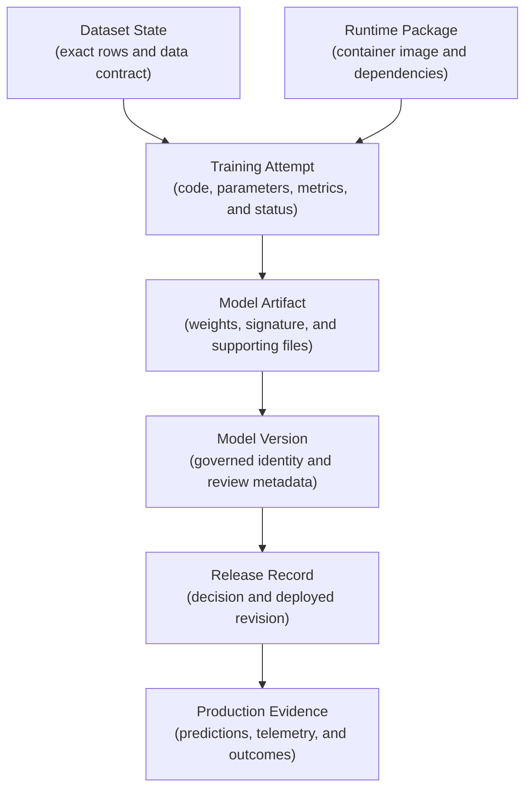
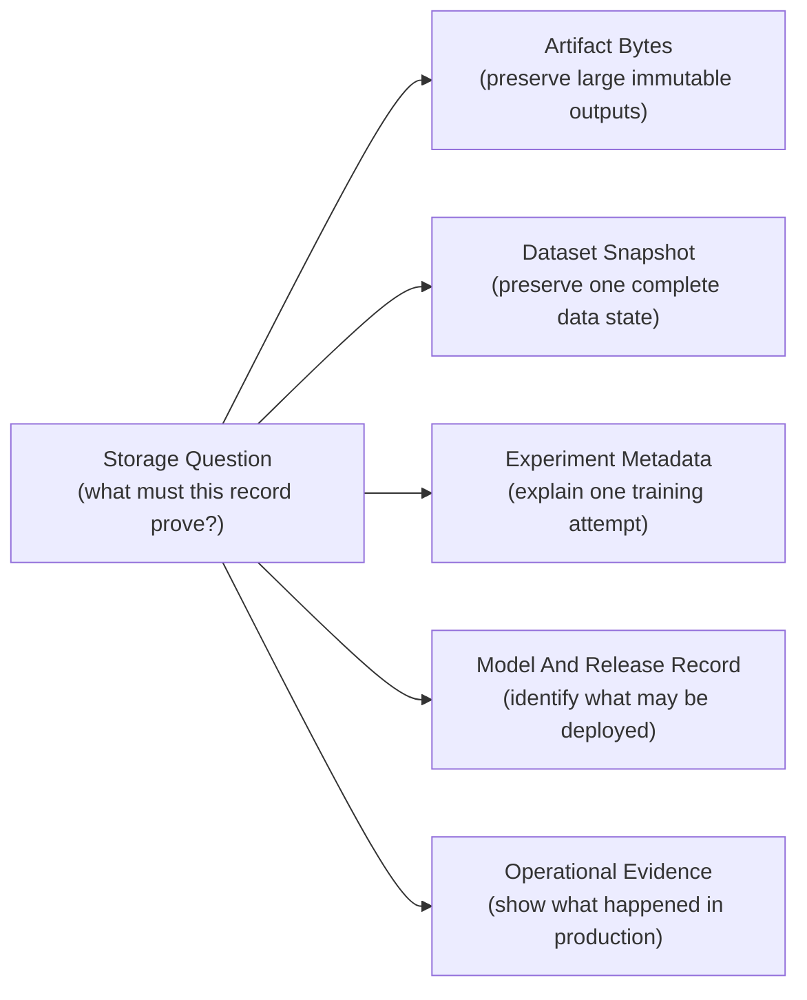
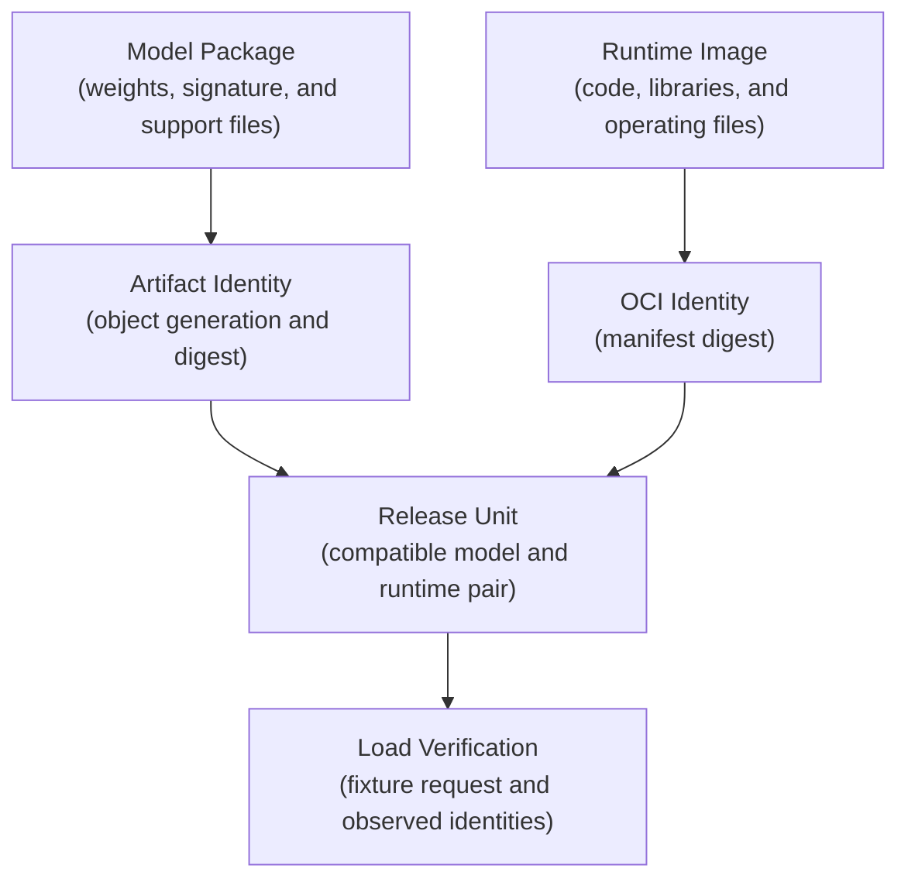
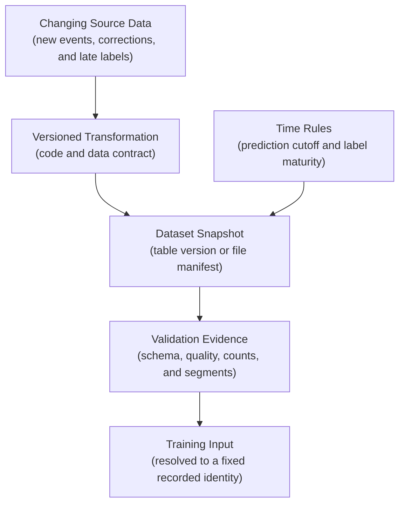
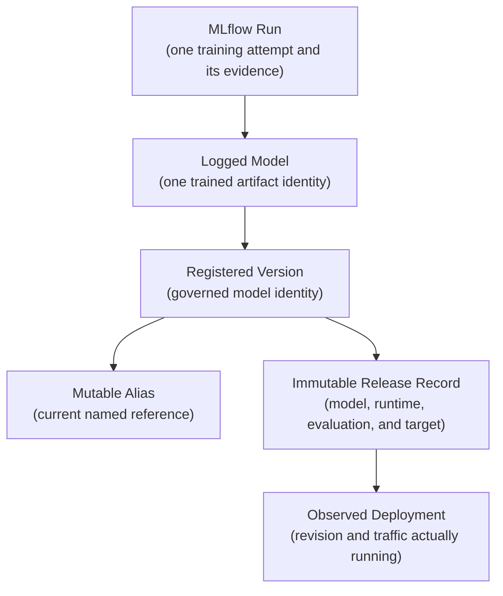
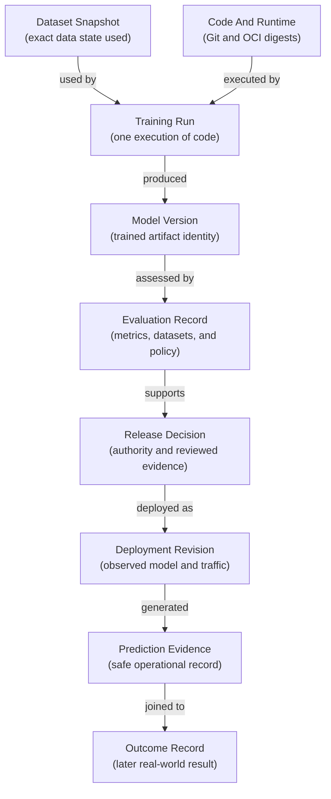
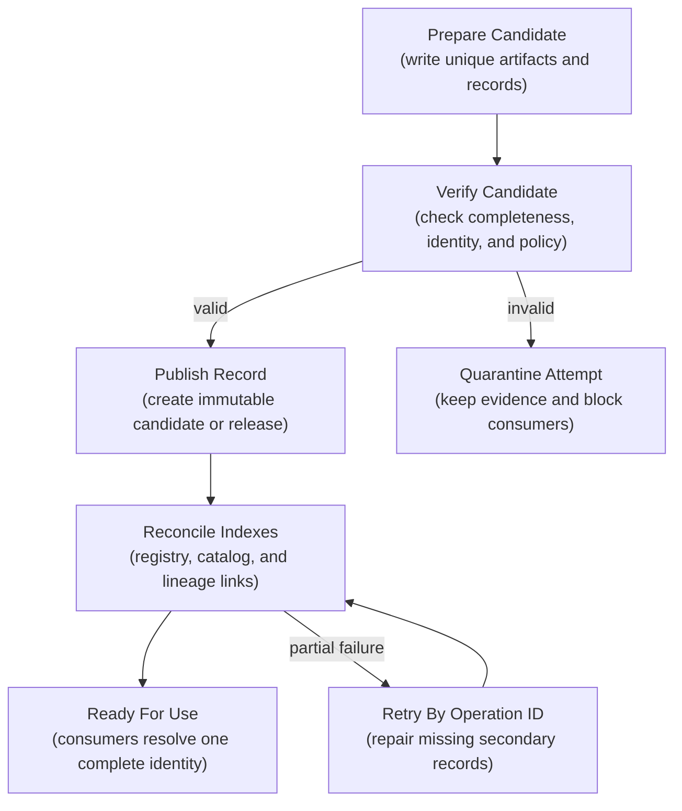
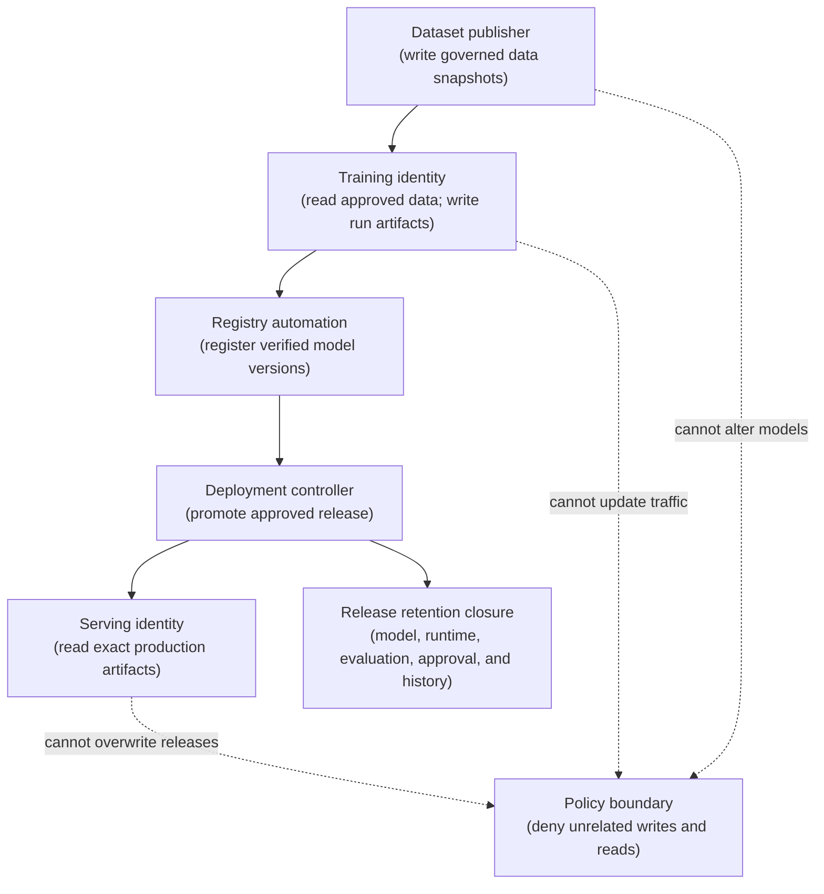
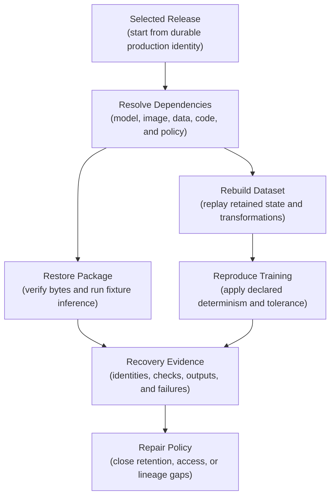

## Table of Contents

1. [What ML Storage Actually Has To Preserve](#what-ml-storage-actually-has-to-preserve)
2. [Understand The Five Storage Jobs In An ML System](#understand-the-five-storage-jobs-in-an-ml-system)
3. [Understand An Asset's Location, Exact Version, Details, And History](#understand-an-assets-location-exact-version-details-and-history)
4. [Keep Model Files And Runtime Images Immutable](#keep-model-files-and-runtime-images-immutable)
5. [Give Every Training Dataset An Exact, Rebuildable Version](#give-every-training-dataset-an-exact-rebuildable-version)
6. [Keep Training Runs, Model Versions, And Production Releases Separate](#keep-training-runs-model-versions-and-production-releases-separate)
7. [Store Approval, Deployment, And Production Evidence](#store-approval-deployment-and-production-evidence)
8. [Link Records Across Storage And Metadata Systems](#link-records-across-storage-and-metadata-systems)
9. [Publish Complete Assets Across Multiple Storage Systems](#publish-complete-assets-across-multiple-storage-systems)
10. [Give Each Workload Narrow Access And Appropriate Retention](#give-each-workload-narrow-access-and-appropriate-retention)
11. [Test That Models And Datasets Can Be Restored](#test-that-models-and-datasets-can-be-restored)
12. [Build A Small Storage Stack That Covers Every Responsibility](#build-a-small-storage-stack-that-covers-every-responsibility)
13. [The Main Idea](#the-main-idea)
14. [References](#references)

## What ML Storage Actually Has To Preserve
<!-- section-summary: An ML release depends on several kinds of durable content and records whose identities must remain connected. -->

Finding a model file is insufficient during an approval review or production incident. The team needs to know which data and code produced it, which environment ran the training, how it was evaluated, and whether it was released. **ML storage systems preserve that complete history, with the model file as one part of the record.**

Imagine one training job that reads a customer-risk table and produces a classifier. By the end of the release, the team may have all of these records:

- a precise version of the training and validation data;
- the Git revision and container image used by the job;
- parameters, metrics, and logs from the training attempt;
- model weights, a signature, and an evaluation report;
- a registered model version;
- a release decision and the endpoint revision that received traffic;
- prediction records and later outcomes.

Each record answers a different question. The object store can return the model bytes. The experiment tracker can explain which run produced them. The dataset platform can recover the rows read by that run. The model registry can identify a reviewed version. The deployment system can report what actually served traffic. Operational evidence can show how that release behaved.

Keeping everything in one folder would preserve some files, although it would leave ownership and relationships implicit. Storing everything in one database would make large model and dataset payloads expensive and awkward. Production systems divide the work across specialized stores, then connect the stores with stable identities.


```mermaid
flowchart TD
    Data["Dataset State<br/>(exact rows and data contract)"] --> Run["Training Attempt<br/>(code, parameters, metrics, and status)"]
    Runtime["Runtime Package<br/>(container image and dependencies)"] --> Run
    Run --> Model["Model Artifact<br/>(weights, signature, and supporting files)"]
    Model --> Registry["Model Version<br/>(governed identity and review metadata)"]
    Registry --> Release["Release Record<br/>(decision and deployed revision)"]
    Release --> Evidence["Production Evidence<br/>(predictions, telemetry, and outcomes)"]
```

The storage architecture succeeds if an operator can move backward and forward through this chain. A production prediction should resolve to the release that served it. That release should resolve to the model, evaluation, run, code, runtime, and dataset state. A damaged dataset should also reveal every model and release that depended on it.


*The dataset and runtime image feed one tracked training run. The run writes a model artifact; the registry assigns a governed model version, and the release system records the production decision. Stable IDs connect those records to later production evidence.*

## Understand The Five Storage Jobs In An ML System
<!-- section-summary: Five storage responsibilities cover durable bytes, dataset states, development evidence, release identity, and production records. -->

One ML system creates several record types because the records change at different speeds and serve different owners. A 12-gigabyte checkpoint behaves differently from a small approval record. A training table receives new rows, while an approved model package should keep the same bytes. A metric is searchable metadata; a prediction archive may contain sensitive business data.

The first responsibility is **artifact storage**. It preserves large outputs such as model weights, tokenizers, checkpoints, plots, and evaluation files. These objects usually live in Amazon S3, Google Cloud Storage, Azure Data Lake Storage, or another durable object store.

The second responsibility is **dataset versioning**. It identifies one complete table state or released file collection. Delta Lake and Apache Iceberg provide transaction-backed table snapshots. Warehouses can provide their own snapshot or time-travel mechanisms. The record needs enough data meaning to explain the rows, schema, cutoff, and label window used for training.

The third responsibility is **experiment and lineage metadata**. A training attempt produces parameters, metrics, status, code identity, dataset references, and output references. MLflow 3 or a managed experiment tracker makes that evidence searchable. Lineage systems connect the attempt to its inputs and outputs.

The fourth responsibility is **model and release identity**. A model registry gives a trained artifact a governed name and version. A release record goes further: it records the decision to deploy a particular model package with a particular runtime configuration. The registry and deployment system may cooperate, while each still owns different facts.

The fifth responsibility is **operational decision and evidence storage**. Approval records, deployment events, prediction summaries, service telemetry, and later outcomes explain production behaviour. Release systems, observability platforms, and governed warehouses are common homes for these records. The model artifact directory remains focused on file payloads.


```mermaid
flowchart LR
    Question["Storage Question<br/>(what must this record prove?)"] --> Bytes["Artifact Bytes<br/>(preserve large immutable outputs)"]
    Question --> Dataset["Dataset Snapshot<br/>(preserve one complete data state)"]
    Question --> Experiment["Experiment Metadata<br/>(explain one training attempt)"]
    Question --> Release["Model And Release Record<br/>(identify what may be deployed)"]
    Question --> Operations["Operational Evidence<br/>(show what happened in production)"]
```

The product choice follows the responsibility. Object storage cannot answer which version served traffic. A registry cannot reconstruct rows that have expired from a table. An observability store should not receive unrestricted copies of training data. The links between these stores matter as much as the stores themselves.

## Understand An Asset's Location, Exact Version, Details, And History
<!-- section-summary: Addresses locate content, identities select an exact state, metadata explains it, and lineage connects it to other records. -->

Four ideas often collapse into one field called `uri` or `model_version`. That shortcut works until a mutable name changes or an investigator needs to explain an old release. Imagine opening a six-month-old deployment record and finding only `model: champion`. The name still resolves, yet it now selects a newer model. The record needs separate answers to four questions: where is the asset, which exact state was used, what does that state mean, and how is it connected to the release?

### Use An Address To Find The Asset

An **address** is a location such as `s3://ml-artifacts/runs/8fb4/model/`, `models:/risk_score/17`, or `prod.features.accounts`. It tells a client which service and name to query.

Addresses can move or resolve to changing content. A model alias such as `@champion` can point to version `17` today and version `18` after a release. A table name normally resolves to its latest state. A container tag such as `stable` can be reassigned. These names help people and automation discover current choices, but they are weak historical evidence by themselves.

### Use An Identity To Select Exact Content

An **identity** distinguishes the exact thing used. Useful identities include an object generation, a cryptographic digest, a Delta table version, an Iceberg snapshot ID, an MLflow Logged Model ID, a registered model version, and an OCI image digest.

Suppose a deployment record stores `registry.example/risk-api:stable`. A later image push can move that tag. The incident investigator then pulls different code from the image that originally served requests. Recording `registry.example/risk-api@sha256:...` protects the historical link because the digest selects the exact OCI manifest.

### Use Metadata To Explain The Asset

**Metadata** is structured information about an asset. It includes the owner, creation time, schema, parameters, metrics, model signature, data classification, retention class, and review status. Metadata lets people search and interpret an identity without downloading every payload.

Metadata should point to sensitive source data instead of copying it freely. A prediction record can retain a governed customer-reference key and a small allowlisted feature summary. Raw customer fields, credentials, complete prompts, and unrestricted exception payloads belong in approved restricted systems under explicit retention policy.

### Record How Data, Runs, Models, And Releases Are Related

**Lineage** records how identities relate. A training run `used` dataset snapshot `842`. The run `produced` Logged Model `m-91`. Evaluation `e-14` `assessed` that model. Release `r-27` `deployed` its registered version. These typed links form a path an investigator can follow.

One compact release record can carry all four ideas:

```yaml
releaseId: risk-score-r27
model:
  address: models:/prod.risk.score/17
  loggedModelId: m-91
  artifactDigest: sha256:76ac...
runtime:
  image: registry.example/risk-api@sha256:31d9...
dataset:
  table: prod.features.risk_training
  deltaVersion: 842
training:
  runId: 8fb4c32
  gitCommit: a1b2c3d
evaluation:
  reportId: e-14
  policyVersion: risk-release-v6
```

The addresses show which systems hold the records. The immutable IDs select exact states. The surrounding fields provide meaning. The nested references preserve lineage. A release system can validate these references before traffic changes.


*An address lets a client find `model.onnx`; a digest or object generation selects the exact bytes. Metadata explains the artifact, and lineage connects its dataset, run, model version, and release.*

## Keep Model Files And Runtime Images Immutable
<!-- section-summary: Model outputs and runtime images use immutable identities so evaluation, deployment, and recovery all refer to the same bytes. -->

Artifacts are the large files created or consumed by ML work. A model release often includes weights and a model signature. Tokenizer files, category labels, or preprocessing assets may also be required for a valid prediction. Evaluation reports preserve the evidence used during review. Training checkpoints serve a different purpose: they usually support recovery during the training job and may follow a shorter retention policy.

### Store Large ML Files In Object Storage

Object storage is the usual industrial home for model artifacts because independent jobs can read the same durable objects after their workers disappear. MLflow artifact stores commonly use S3, Google Cloud Storage, or Azure Blob Storage for this reason. The metadata database retains the run and artifact location; the object store retains the larger payload.

An approved artifact receives an immutable path or object generation plus a digest. Writers use a unique run or attempt prefix. A manifest lists the files that form the complete model package. Consumers verify the manifest and required digests before loading the model. The next storage layer can then refer to one stable package instead of a folder whose contents may still be changing.

### Store Training And Serving Images In An OCI Registry

The model bytes and the serving runtime are separate release inputs. A model may be loaded by Python code, an ONNX runtime, Triton, or a managed endpoint container. The executable environment therefore needs its own identity.

An **OCI registry** stores container images and other artifacts using the Open Container Initiative formats and distribution API. Amazon ECR, Google Artifact Registry, Azure Container Registry, and many independent registries support OCI images. An OCI image manifest points to configuration and filesystem layers by digest, so the image digest identifies the complete runtime package.

Keep the model artifact identity and runtime image identity together in the release record. Updating only the image can change preprocessing or dependencies even if the model weights stay fixed. Updating only the weights can violate the model signature expected by the image. A rollback must restore the compatible pair.

OCI registries can also store non-container artifacts through OCI manifests. That option works well if the organization has tooling for the chosen media type, signatures, access, and garbage collection. Ordinary object storage plus a model registry remains a simpler default for large model files in many ML platforms.


```mermaid
flowchart TD
    Model["Model Package<br/>(weights, signature, and support files)"] --> ModelDigest["Artifact Identity<br/>(object generation and digest)"]
    Image["Runtime Image<br/>(code, libraries, and operating files)"] --> ImageDigest["OCI Identity<br/>(manifest digest)"]
    ModelDigest --> Release["Release Unit<br/>(compatible model and runtime pair)"]
    ImageDigest --> Release
    Release --> Verify["Load Verification<br/>(fixture request and observed identities)"]
```

## Give Every Training Dataset An Exact, Rebuildable Version
<!-- section-summary: A dataset snapshot identifies exact rows and records the data meaning required to reconstruct or validate them later. -->

A table name describes a dataset family. Training needs one particular state of that family. New events can arrive, late labels can mature, and feature logic can change between two runs that read the same table name.

A **dataset snapshot** identifies the complete data state used by a run. For immutable files, that may be a manifest listing object generations and digests. For Delta Lake, it can be a table version. For Apache Iceberg, it can be a snapshot ID or a retained tag. BigQuery table snapshots provide a read-only warehouse table state that can outlive the normal time-travel window.

The storage engine supplies a stable technical state. The ML record must also preserve data meaning. Record the schema or data-contract version and the transformation revision. Add the event-time cutoff and the label definition, including any label-maturity window. Filters and validation results explain which rows were accepted. The privacy classification determines who may use the snapshot and how long its row-level data may remain.

Consider a churn model trained from an accounts table at version `842`. The version fixes the files read from that table. It cannot explain that churn labels require thirty days to mature or that accounts closed after the prediction cutoff must be excluded. Those rules belong in the dataset contract and run evidence.


```mermaid
flowchart TD
    Source["Changing Source Data<br/>(new events, corrections, and late labels)"] --> Transform["Versioned Transformation<br/>(code and data contract)"]
    Transform --> Snapshot["Dataset Snapshot<br/>(table version or file manifest)"]
    Cutoff["Time Rules<br/>(prediction cutoff and label maturity)"] --> Snapshot
    Snapshot --> Validation["Validation Evidence<br/>(schema, quality, counts, and segments)"]
    Validation --> Training["Training Input<br/>(resolved to a fixed recorded identity)"]
```

Snapshot identity only works for as long as the underlying state remains retained. Delta time travel depends on retained transaction history and data files. Iceberg snapshot expiration removes unneeded snapshots and files. BigQuery snapshots can have their own expiration. The retention policy must cover the promised investigation and rebuilding period.

For critical releases, prove the snapshot before training. Resolve the immutable version, read it explicitly, record row counts and validation results, and attach that identity to the run. A later rebuild should use the recorded version directly instead of asking for whichever rows the table contains at that later time.

## Keep Training Runs, Model Versions, And Production Releases Separate
<!-- section-summary: Runs explain attempts, model records identify trained artifacts, registries govern versions, and release records identify deployment decisions. -->

One successful training command can create several related records. The run reports what happened during that execution. The trained model needs an identity that survives after the run finishes. A registry version places that model inside a governed model family. A release record later binds the selected version to a runtime and deployment decision. Keeping these records distinct lets a failed experiment disappear without deleting a production model, and it lets a deployment roll back without rewriting training history.

### Use A Run Record For One Training Attempt

An **experiment run** records one execution of training or evaluation code. MLflow Tracking stores parameters, metrics, tags, start and end times, and references to output artifacts. In MLflow 3, a Logged Model gives a trained model its own first-class ID and can carry metrics tied to specific evaluation datasets.

For a shared self-hosted MLflow deployment, the current architecture separates a database-backed backend store from a remote artifact store. PostgreSQL, MySQL, or another supported database keeps searchable metadata. Object storage keeps large artifacts. The local file backend remains useful for personal work, while current MLflow documentation places it in maintenance mode and recommends a database backend for shared reliability and registry support.

This separation creates a real recovery requirement. A database backup without the artifact objects restores run rows that point to missing models. An object-store restore without the database loses the searchable run and registry identities. Backup and restore procedures must cover both sides and preserve their references.

### Use A Model Registry For Governed Model Versions

A **model registry** groups versions of a model used for the same task. Each version points to an exact trained artifact and can carry a description, signature, tags, aliases, and links to its source evidence. MLflow Model Registry, Models in Unity Catalog, SageMaker AI Model Registry, Gemini Enterprise Agent Platform Model Registry, and Azure Machine Learning registries provide managed forms of this responsibility.

MLflow's fixed model stages are deprecated. Current designs use immutable versions with aliases and tags. An alias such as `champion` or `candidate` is a mutable pointer used for discovery or automation. A deployment or incident record should still store the resolved version because an alias can move later.

Managed catalogs add organizational controls around the model identity. Models in Unity Catalog use governed three-level names and permissions. SageMaker Model Registry organizes versioned model packages into model groups. Agent Platform Model Registry, formerly Vertex AI Model Registry, groups model versions under a model resource and supports mutable aliases. Azure Machine Learning registries can share models and other assets across workspaces. The provider object changes, while the responsibility stays the same: identify and govern a model version without pretending that the registry itself proves what served traffic.

### Use A Release Record For The Production Decision

A **release record** binds a model version to the runtime image, configuration, evaluation, approval, and target environment. The deployment control plane then reports the endpoint revision actually receiving traffic.

This boundary matters during an incident. A registry alias may say version `18` is the champion, while an endpoint still serves version `17` after a failed rollout. The registry owns model identity. The deployment system owns observed traffic state. The release record connects the decision to both systems.


```mermaid
flowchart TD
    Run["MLflow Run<br/>(one training attempt and its evidence)"] --> Logged["Logged Model<br/>(one trained artifact identity)"]
    Logged --> Version["Registered Version<br/>(governed model identity)"]
    Version --> Alias["Mutable Alias<br/>(current named reference)"]
    Version --> Release["Immutable Release Record<br/>(model, runtime, evaluation, and target)"]
    Release --> Deployment["Observed Deployment<br/>(revision and traffic actually running)"]
```

## Store Approval, Deployment, And Production Evidence
<!-- section-summary: Approval, deployment, prediction, telemetry, and outcome records explain why a release ran and whether it worked. -->

Training evidence answers how a candidate was created. It cannot explain why a reviewer accepted its risks, whether the deployment completed, or which version actually handled a request. Production evidence fills that gap. It preserves the decision, the observed deployment state, and the later behaviour of the release. These records let an incident responder distinguish a weak model from a rollout error, a changed decision policy, or a broken outcome feed.

A durable approval record contains the candidate identity, evidence references, policy version, reviewer or automated authority, decision, timestamp, and any expiry or conditions. A registry tag can expose the current review status, but a tag alone is a weak audit record because it may be overwritten. The tag should resolve to the decision record that explains the change.

The deployment record captures desired and observed state. Desired state names the approved release and traffic policy. Observed state reports the endpoint revision, loaded model identity, runtime image digest, and actual traffic split. Recording only the requested model can hide a partial or failed rollout.

Prediction records connect production behaviour to that observed release. A typical record includes a prediction ID, model and release identity, event time, route, response class, policy version, and safe feature or score summaries. Later outcomes join through a governed key. Service telemetry remains in the observability platform; detailed prediction and outcome records usually belong in a governed warehouse or lakehouse.

Suppose an alert shows a rise in false declines for one region. The investigator first checks the outcome join and policy version. They then group affected predictions by observed release ID. If the rise starts only after release `r-27`, the graph identifies its model version, dataset snapshot, and evaluation. This path prevents an unrelated recent training run from becoming the target of the rollback.

Operational stores need strong privacy boundaries. Keep raw inputs and direct identifiers out of general logs. Use allowlisted attributes for routine investigation and retain restricted source data only under an approved purpose. Hashing or encryption can reduce exposure, although those controls do not remove access, deletion, and retention obligations.

## Link Records Across Storage And Metadata Systems
<!-- section-summary: Stable asset identities and typed relationships let teams trace causes upstream and impact downstream without forcing every record into one database. -->

The records now live in several systems. Copying all of them into one database would create another incomplete source of truth. Leaving the links inside dashboards would make automated impact analysis impossible. The storage design therefore needs stable relationships that cross system boundaries. An investigator should be able to start with a model, dataset, deployment, or prediction and follow the relevant evidence without guessing which names happen to match.

An **evidence graph** is the connected set of dataset, run, model, evaluation, release, deployment, prediction, and outcome identities. Each edge has a meaning such as `used`, `produced`, `evaluated`, `approved`, `deployed`, or `generated`. The graph describes the lifecycle without requiring a graph database.


```mermaid
flowchart TD
    Dataset["Dataset Snapshot<br/>(exact data state used)"] -->|used by| Run["Training Run<br/>(one execution of code)"]
    Code["Code And Runtime<br/>(Git and OCI digests)"] -->|executed by| Run
    Run -->|produced| Model["Model Version<br/>(trained artifact identity)"]
    Model -->|assessed by| Evaluation["Evaluation Record<br/>(metrics, datasets, and policy)"]
    Evaluation -->|supports| Decision["Release Decision<br/>(authority and reviewed evidence)"]
    Decision -->|deployed as| Deployment["Deployment Revision<br/>(observed model and traffic)"]
    Deployment -->|generated| Prediction["Prediction Evidence<br/>(safe operational record)"]
    Prediction -->|joined to| Outcome["Outcome Record<br/>(later real-world result)"]
```

Typed links can live in relational tables, catalog relations, registry tags, manifests, or lineage events. OpenLineage provides a standard event model around jobs, runs, and input or output datasets. A run event can carry the job, run ID, dataset versions, schema, and quality facets observed during execution. ML-specific model and release records can link to those same stable run and dataset identities.

Catalogs such as Unity Catalog can capture lineage for supported data and ML objects under governed permissions. Its captured relationships can include tables, jobs, notebooks, and models. External lineage platforms can ingest OpenLineage events from orchestration and processing tools. These systems reduce manual relationship entry, although automated capture still requires verification. Dynamic Python access and external APIs can leave gaps. Custom serving paths may need explicit release and prediction links.

Reverse traversal gives the graph operational value. If snapshot `842` contains a faulty feature, the team asks which runs used it, which models those runs produced, and which releases deployed those models. If a container digest has a critical vulnerability, the team asks which training and serving revisions used that image. A scheduled completeness check can flag released models with no dataset link, missing artifact digest, or unresolved evaluation record.

## Publish Complete Assets Across Multiple Storage Systems
<!-- section-summary: Immutable preparation, verification, publication records, and reconciliation prevent partial multi-store writes from appearing as complete releases. -->

One training attempt may write objects, commit a table, update MLflow, create a registry version, and publish lineage. Those systems do not usually share one database transaction. A worker can succeed in one store and fail before updating the next.

The safe publication path has four stages. **Prepare** writes artifacts under a unique attempt identity and records the intended dataset version. **Verify** checks required files, digests, schema, evaluation, and resolvable links. **Publish** creates an immutable candidate or release record only after verification passes. **Reconcile** retries missing secondary records from the durable publication record.


```mermaid
flowchart TD
    Prepare["Prepare Candidate<br/>(write unique artifacts and records)"] --> Verify["Verify Candidate<br/>(check completeness, identity, and policy)"]
    Verify -->|valid| Publish["Publish Record<br/>(create immutable candidate or release)"]
    Verify -->|invalid| Quarantine["Quarantine Attempt<br/>(keep evidence and block consumers)"]
    Publish --> FanOut["Reconcile Indexes<br/>(registry, catalog, and lineage links)"]
    FanOut --> Ready["Ready For Use<br/>(consumers resolve one complete identity)"]
    FanOut -->|partial failure| Retry["Retry By Operation ID<br/>(repair missing secondary records)"]
    Retry --> FanOut
```

The publication boundary differs by store. A Delta or Iceberg commit exposes one complete table snapshot. A multi-file object package can publish its manifest last. A registry version should be created from a completed model artifact. A release record should reference completed evaluation and approval evidence. Consumers begin from the publication record and verify the identities they load.

Retries use one operation ID. If the registry request times out after creating version `17`, the retry searches for the version associated with that operation before creating another. If the bytes differ under the same operation, the attempt is quarantined and receives a new identity. This pattern prevents a harmless network timeout from creating ambiguous duplicate versions.

Atomic publication does not guarantee every search index updates immediately. The immutable publication record serves as the recovery source. A reconciler can rebuild missing catalog links or lineage events without changing the released identities.

## Give Each Workload Narrow Access And Appropriate Retention
<!-- section-summary: Workload identities constrain who may create or consume each record, while retention preserves the complete evidence needed for recovery and governance. -->

Storage contains both valuable software assets and sensitive data, so a single broad “ML platform” role creates unnecessary risk. The dataset publisher, training job, registry automation, deployment controller, and serving runtime perform different actions. Their credentials should express those differences. This design also improves incident evidence: an object-store audit event identifies the workload responsible for a write instead of reporting one shared service account used by the entire lifecycle.

Access and retention solve connected but separate problems. Access policy prevents one workload from changing records owned by another stage. Retention keeps the complete set of files and metadata needed to explain or restore an approved release. A narrowly scoped serving identity cannot help if lifecycle policy deleted its tokenizer, and long retention cannot protect a model package from an over-privileged training job. The lifecycle needs both controls around the same immutable asset identities.


```mermaid
flowchart TD
    Dataset["Dataset publisher<br/>(write governed data snapshots)"] --> Training["Training identity<br/>(read approved data; write run artifacts)"]
    Training --> Registry["Registry automation<br/>(register verified model versions)"]
    Registry --> Deploy["Deployment controller<br/>(promote approved release)"]
    Deploy --> Serving["Serving identity<br/>(read exact production artifacts)"]
    Dataset -.->|cannot alter models| Deny["Policy boundary<br/>(deny unrelated writes and reads)"]
    Training -.->|cannot update traffic| Deny
    Serving -.->|cannot overwrite releases| Deny
    Deploy --> Retain["Release retention closure<br/>(model, runtime, evaluation, approval, and history)"]
```

### Give Writers Access Only To Their Required Destinations

A dataset pipeline writes new governed snapshots but cannot alter registered models. A training identity reads approved datasets and writes only to its run-specific artifact prefix. Registry automation can create model versions from verified artifacts. Deployment automation can read approved releases and update endpoints. Serving identities receive read access to the exact model location and no permission to overwrite it.

Use the cloud provider's workload identity, an equivalent managed identity, or another short-lived service credential. Static keys embedded in notebooks create long-lived leakage and rotation risk. Separate development and production namespaces if they have different trust boundaries. Residency rules, encryption ownership, or retention policy can also justify that separation.

MLflow deployments require a deliberate artifact-access mode. A tracking server can proxy artifact access using its own storage role, which means users with server access may inherit access to everything that role can read. Direct client access shifts credentials to each client. Choose the mode from the required isolation and audit boundary, then test it with identities from different teams.

### Show Readers Only The Metadata And Files They May Access

Catalog visibility does not imply permission to read every payload. Broad discovery can expose names, owners, and descriptions while restricted datasets and model artifacts keep narrower read policies. Unity Catalog lineage follows catalog permissions and masks objects a user cannot browse. Other catalogs need equivalent filtering so lineage does not leak sensitive asset names.

### Keep Every File Required To Explain A Release

Retention policy should keep a useful release closure: model package, runtime digest, signature, evaluation, approval, deployment history, and enough dataset evidence to meet the reproduction promise. Keeping a registry row after deleting its model artifact creates a broken record. Keeping weights after deleting the required tokenizer creates a broken release.

Some records have a maximum lifetime because of privacy or licensing. Others have a minimum lifetime because of rollback, audit, or legal requirements. Resolve that tension explicitly. A team may retain aggregate validation evidence and transformation code longer than row-level source data, then document that exact row reconstruction expires after the governed retention window.

Deletion is also an event. Tombstone the asset identity, record the authority and policy that allowed deletion, and remove or mark downstream links. Search and release systems should report “expired under policy” instead of presenting an unexplained broken URI.

## Test That Models And Datasets Can Be Restored
<!-- section-summary: Restore and rebuild drills test that retained identities, bytes, permissions, contracts, and software can still produce a usable release. -->

Backups prove that copies exist. Recovery drills prove that the stored records still work together. A registry export can look healthy even though its model objects have expired. A dataset version can remain visible after cleanup removes the files needed to read it. A successful drill starts from the same identity an operator would receive during an incident, uses recovery credentials, and produces evidence that the restored or rebuilt asset is usable.

### Restore An Existing Release

Start from a release ID selected by the release system. Resolve the registered model version, object digest, runtime image digest, signature, and configuration. Retrieve the artifacts using the production recovery identity. Verify each digest, start the runtime, and score a fixed fixture set. The test passes after the service reports the expected release identities and its outputs match the reviewed fixture tolerance.

This drill catches failures hidden by a bucket inventory. The object may exist while its encryption key is disabled. The registry record may survive while the tokenizer expired. The image may remain in the registry while the required architecture variant is missing. The test exercises the complete unit an operator would restore during an incident.

### Rebuild A Training Dataset

Choose a released model and retrieve its dataset identity, transformation revision, data contract, cutoff, label window, and source references. Read the retained Delta or Iceberg snapshot, BigQuery table snapshot, or file manifest. Re-run the transformation into a new verification location. Compare schema, row counts, partitions, validation results, and a content digest or deterministic sample against the recorded evidence.

A snapshot may already contain the final training rows. In that case, the drill proves exact retrieval. A snapshot of upstream sources requires the transformation code and environment to recreate the training table. The release record should state which promise applies.

### Reproduce Training To The Declared Level

Exact model bytes are not always a realistic reproduction promise. GPU kernels, distributed reduction order, and library changes can introduce numerical variation even with saved seeds. Record the environment and determinism settings, then define the expected proof. Some workloads require the same artifact digest. Others require equivalent predictions on a fixture set and metrics inside reviewed tolerances.

Suppose a rebuild finds that the recorded table version has expired. The release cannot honestly claim exact data reproduction. The team should keep the production model available for rollback if policy permits, mark the broken reconstruction link, and adjust retention for future releases. It should not rewrite the old run to point at a newer dataset.


```mermaid
flowchart TD
    Release["Selected Release<br/>(start from durable production identity)"] --> Resolve["Resolve Dependencies<br/>(model, image, data, code, and policy)"]
    Resolve --> Restore["Restore Package<br/>(verify bytes and run fixture inference)"]
    Resolve --> Rebuild["Rebuild Dataset<br/>(replay retained state and transformations)"]
    Rebuild --> Retrain["Reproduce Training<br/>(apply declared determinism and tolerance)"]
    Restore --> Evidence["Recovery Evidence<br/>(identities, checks, outputs, and failures)"]
    Retrain --> Evidence
    Evidence --> Repair["Repair Policy<br/>(close retention, access, or lineage gaps)"]
```

## Build A Small Storage Stack That Covers Every Responsibility
<!-- section-summary: A coherent stack gives every required storage responsibility one owner and adds catalogs or lineage platforms only for repeated organizational needs. -->

A small team can cover the framework without building a metadata platform. Object storage holds run artifacts. An OCI registry holds training and serving images. A warehouse or Delta or Iceberg table provides addressable dataset states. MLflow records runs and registered model versions. The deployment workflow writes a small immutable release record, while prediction evidence lands in a governed analytics table.

A provider-centered team can use the same framework through managed services. SageMaker AI, Gemini Enterprise Agent Platform, Azure Machine Learning, and Databricks each combine parts of tracking, registry, catalog, data, and deployment. Their internal integration reduces plumbing. Git identity, OCI image identity, data retention, production telemetry, and the observed release still cross product boundaries.

Larger organizations add a catalog or lineage service after cross-system questions recur across teams. Those questions include asset discovery, downstream impact, ownership, and policy. OpenLineage provides portable run and dataset events across supported tools. Unity Catalog provides a managed governed catalog inside the Databricks platform. Evaluate connector coverage and permission filtering before adoption. Also prove that lost events can be recovered and links can be rebuilt from authoritative records.

Count responsibilities and handoffs instead of products. A stack with one clear owner for each fact and a tested recovery path has stronger storage architecture than a larger stack with three incomplete catalogs.

## The Main Idea
<!-- section-summary: ML storage works through specialized stores, immutable identities, explicit relationships, controlled publication, and tested recovery. -->

ML systems create several forms of durable evidence because data, model artifacts, metadata, release decisions, and production records have different sizes, lifecycles, and owners. Object and OCI storage preserve immutable bytes. Lakehouse and warehouse snapshots preserve data states. Experiment trackers and registries explain training and model identity. Release and operational stores record production decisions and behaviour.

Addresses help clients find records. Immutable identities select the exact state. Metadata explains its meaning. Lineage connects it to the rest of the lifecycle. Those four ideas let specialized stores cooperate without copying every fact into one database.

The practical test starts from either end of the evidence graph. A production prediction should lead back to the exact release, model, run, runtime, code, and dataset. A faulty dataset or image should reveal every downstream release at risk. Atomic publication, narrow permissions, aligned retention, and regular restore and rebuild drills keep those paths trustworthy.


*Production investigation moves from a prediction toward its exact inputs. Impact analysis moves from a faulty dataset or image toward every affected run, model, release, endpoint, and decision. Publication, access, retention, and restore controls keep both paths usable.*

## References

- [MLflow Tracking](https://mlflow.org/docs/latest/ml/tracking/)
- [MLflow backend stores](https://mlflow.org/docs/latest/self-hosting/architecture/backend-store/)
- [MLflow artifact stores](https://mlflow.org/docs/latest/self-hosting/architecture/artifact-store/)
- [MLflow Model Registry workflows](https://mlflow.org/docs/latest/ml/model-registry/workflow/)
- [OCI Image Manifest Specification](https://github.com/opencontainers/image-spec/blob/main/manifest.md)
- [OCI Distribution Specification](https://github.com/opencontainers/distribution-spec/blob/main/spec.md)
- [Delta Lake time travel and retention](https://docs.delta.io/delta-batch/)
- [Apache Iceberg documentation](https://iceberg.apache.org/docs/latest/)
- [Apache Iceberg branching and tagging](https://iceberg.apache.org/docs/latest/branching/)
- [BigQuery table snapshots](https://docs.cloud.google.com/bigquery/docs/table-snapshots-intro)
- [OpenLineage object model](https://openlineage.io/docs/spec/object-model/)
- [OpenLineage facets](https://openlineage.io/docs/spec/facets/)
- [Models in Unity Catalog](https://docs.databricks.com/aws/en/machine-learning/manage-model-lifecycle/)
- [Unity Catalog lineage](https://docs.databricks.com/aws/en/data-governance/unity-catalog/data-lineage)
- [SageMaker AI Model Registry concepts](https://docs.aws.amazon.com/sagemaker/latest/dg/model-registry-models.html)
- [Gemini Enterprise Agent Platform model aliases](https://docs.cloud.google.com/gemini-enterprise-agent-platform/machine-learning/model-registry/model-alias)
- [Azure Machine Learning registries](https://learn.microsoft.com/en-us/azure/machine-learning/how-to-manage-registries?view=azureml-api-2)
