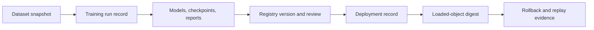
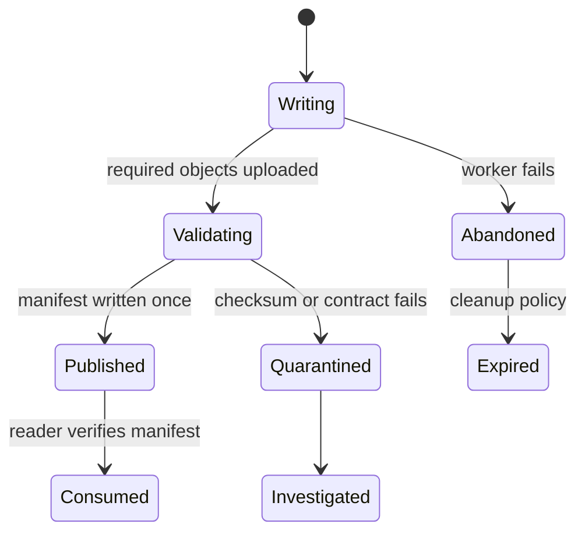
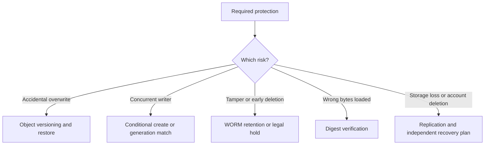

## Object Storage Holds The Durable Bytes
<!-- section-summary: Object storage gives independent ML jobs durable network access to datasets and artifacts that outlive any notebook, container, or worker. -->

**Object storage** stores a payload, called an object, under a key inside a bucket or container. Amazon S3, Azure Blob Storage, and Google Cloud Storage use this design. ML teams rely on it because training data, checkpoints, model packages, reports, and prediction archives can be large and must survive after the machine that created them disappears.

Object storage differs from a local or shared filesystem in ways that shape an ML platform. Clients access objects through service APIs. A key identifies an object, while directory-looking prefixes help people organize keys. Jobs can read and write from different machines without mounting the same disk. Providers manage durability and scale, while teams manage identity, permissions, completion rules, retention, and recovery.

The storage service understands bytes, metadata, and access rules. The wider MLOps system supplies meaning. A bucket cannot decide that a model passed evaluation, that a dataset is safe for training, or that version `42` is the rollback target. Registries, catalogs, run records, and deployment records attach that meaning to stable object identities.



A useful object-storage design therefore has seven responsibilities: namespace and identity, safe publication, integrity, access control, protection from replacement or deletion, lifecycle management, and tested recovery. The following sections follow those responsibilities rather than one provider’s console.

## Namespace Gives Every Asset A Stable Address
<!-- section-summary: Immutable dataset, run, and release identities prevent independent jobs from overwriting or silently reinterpreting the same key. -->

A **namespace** is the naming structure used for buckets and object keys. Human-readable prefixes help operators navigate during an incident, while immutable identifiers prevent ambiguity. A training run should write to its own run ID. A dataset release should have a snapshot ID. An approved model package should resolve to a concrete object generation or content digest.

Consider a document-classification pipeline. Its layout might use these identities:

```yaml
dataset:
  id: document-pages-2026-06-30-r2
  manifest: datasets/document-pages/snapshot=2026-06-30-r2/manifest.json
run:
  id: run-8fb4c32
  prefix: runs/document-classifier/run=8fb4c32/
release:
  id: document-classifier-42
  model: runs/document-classifier/run=8fb4c32/model/model.onnx
  manifest_sha256: sha256:7d13...
```

The prefix structure supports browsing, while the manifest and digest support verification. The dataset ID identifies a released collection rather than a moving folder. The run ID keeps retries and concurrent experiments apart. The release ID connects the model object with its preprocessing assets, schema, evaluation, and runtime.

Names such as `latest/`, `final-model.pkl`, or `current-dataset/` can offer convenient discovery, but they are weak execution inputs. A job should resolve a moving name once, record the concrete identity, and then continue with the immutable reference. This is the same rule used for registry aliases and deployment tags.

Bucket boundaries also carry operational meaning. Separate accounts, projects, buckets, or containers may enforce different permissions, network paths, encryption keys, retention rules, and cost ownership. A small team can use one bucket with carefully designed prefixes. A regulated or multi-team platform may need separate raw-data, curated-data, experiment, and production-release boundaries. More buckets improve isolation and add policy and discovery work, so the separation should follow a real trust or operating boundary.

## Publication Marks A Complete Asset
<!-- section-summary: Producers publish a manifest or completion record only after every required object exists and passes validation, so consumers never treat partial output as a valid asset. -->

Many ML assets contain several files. A model release may include weights, tokenizer data, labels, signatures, and an evaluation report. A dataset release may contain hundreds of partitions plus a manifest. Object stores do not provide a portable atomic rename for an arbitrary multi-object collection.

This creates a failure path. A worker uploads the model, crashes before uploading the tokenizer, and leaves a plausible-looking prefix. A deployment process that checks only for the model file can load an incomplete release. The same risk appears when a data pipeline publishes some partitions before a reader starts training.

The safe pattern separates **writing** from **publication**:



The producer writes objects into a unique attempt location, computes digests, validates required files and schemas, and writes a manifest last. Consumers treat the manifest as the publication boundary. The manifest lists each object identity, size, digest, media type, and release role. A completion file such as `_SUCCESS.json` can work when its semantics are documented and enforced.

The publication write should be create-only or conditional. Amazon S3 supports `If-None-Match: *` for writes that must fail when the current key already exists. Comparable generation-match or lease patterns exist in other stores. The exact API differs, while the invariant stays constant: two workers cannot publish different contents under the same immutable release identity.

Retries need an explicit rule. If the same run retries with identical object digests, publication can return the existing manifest as success. If any digest differs, the retry should fail and receive a new attempt identity. Silent replacement would disconnect earlier evaluation from the bytes later consumers load.

## Integrity Connects A Name To Content
<!-- section-summary: Checksums, manifests, and runtime reporting prove that storage, review, and serving refer to the same bytes. -->

A key tells you where to ask for an object. A **checksum** or cryptographic digest tells you which content arrived. Providers can validate supported checksums during upload and download. The MLOps platform can also record a digest in the dataset manifest, run record, registry version, and release approval.

Integrity serves several failure cases. It catches truncated transfers, accidental replacement, damaged caches, and a deployment request that points to different bytes from the reviewed candidate. It also makes runtime identity observable. A model server can report the release ID and artifact digest it loaded, which lets operators compare desired deployment state with actual state.

An ETag should only be treated as a content digest when the provider’s rules and upload method guarantee that meaning. Multipart uploads and encryption modes can change ETag semantics. Use an explicitly supported checksum or a platform-computed cryptographic digest for release identity.

Signatures and provenance cover a related question: who produced the object and through which build path? A checksum alone proves content equality. It does not establish a trusted producer. Higher-assurance platforms may sign release manifests, retain build provenance, and verify both signature and digest at promotion time.

## Access Follows Workload Responsibilities
<!-- section-summary: Workload identities and least-privilege permissions limit each pipeline, reviewer, and serving runtime to the object operations required for its role. -->

Access policy should follow the job that performs the work. A dataset builder can write curated snapshots. Training can read approved snapshots and write to run-specific output prefixes. Review automation can read evaluation evidence. Production serving can read approved model packages and should have no permission to overwrite them.

Cloud workload identity supplies temporary credentials to a job, pod, function, or managed service. Static access keys in notebooks and configuration files create long-lived leakage and rotation risk. The identity policy should restrict actions, resource prefixes, environment, and sometimes network location. Separate training and deployment identities prevent compromised training code from changing production releases.

Encryption addresses another boundary. Providers encrypt stored data and network transport, with choices around provider-managed or customer-managed keys. Key ownership, rotation, revocation, and regional placement should match the data classification. A customer-managed key adds control and also creates a dependency: disabling or deleting it can make every protected artifact unavailable.

Audit logs show which identity read, wrote, or deleted an object. Run and release records explain why that object was used. Both layers matter. A storage log can show that a training role read a dataset, while the run record connects that read to an approved experiment and model version.

Prediction archives and training data may contain personal, confidential, or licensed material. Logging and artifact design should minimize copied sensitive fields, enforce retention, and record authorized purpose. Moving data into a different prefix does not change its classification.

## Versioning And Immutability Protect Different Risks
<!-- section-summary: Versioning retains earlier object generations, while immutable naming and WORM policies prevent or constrain replacement and deletion. -->

**Object versioning** keeps earlier generations when a key is replaced or deleted. It can recover accidental edits and supplies a concrete generation ID. Versioning is valuable defence in depth, though it should not encourage intentional overwrites of released assets. New datasets, runs, and models should still receive new immutable identities.

**Immutability** can mean an application rule, a policy-enforced create-only namespace, or a write-once-read-many retention control. WORM policies protect critical records from modification or deletion for a declared period. They fit audit evidence and legal retention when the organisation has defined the requirement. Locking the wrong data or retention period can create cost and operational problems, so teams should test policy changes in a safe boundary before locking them.

Provider details differ. Azure Blob versioning creates immutable blob versions, while current documentation notes limits for hierarchical-namespace accounts. Azure immutable storage supports time-based retention and legal holds with specific scope rules. Google Cloud Storage combines object versioning, soft delete, holds, retention policies, and lifecycle rules. Amazon S3 provides versioning, Object Lock, lifecycle policies, and conditional writes. Platform code should encode the required guarantee and document the provider-specific implementation.



These controls complement each other. Versioning cannot recover a deleted storage account. A checksum cannot restore missing bytes. WORM retention cannot prove that the original upload was correct. The recovery design should cover the specific threat and failure boundary.

## Lifecycle Policy Follows Operational Meaning
<!-- section-summary: Retention and storage-tier policy follow an asset’s rollback, replay, audit, privacy, and legal value rather than one age rule for the entire bucket. -->

ML storage grows through dataset snapshots, intermediate features, checkpoints, evaluation outputs, model packages, prediction logs, and repeated experiments. **Lifecycle management** moves objects between storage classes or removes them according to policy. It controls cost and retention only when the asset catalog explains what each object means.

A failed exploratory run may expire after weeks. The current production release and several rollback candidates need complete model and runtime assets. A dataset may have a maximum privacy retention period. Audit evidence may have a minimum retention period or legal hold. A checkpoint used only for resume can expire after training finishes, while the final model and evaluation report remain.

Deletion should follow dependency analysis. Removing a tokenizer while retaining model weights leaves an unusable release. Removing a dataset manifest can make an old run impossible to explain. Removing all previous object generations eliminates the value of versioning. Lifecycle policy should treat the release unit and evidence graph as a group, even when different object types use different storage tiers.

Archive tiers can add retrieval delay and minimum-duration charges. A rollback artifact that takes hours to restore cannot support a ten-minute recovery objective. Teams should match storage class with recovery time and test the actual restore path rather than reading a price table alone.

## Recovery Tests The Whole Chain
<!-- section-summary: Restore drills verify that identities, permissions, keys, manifests, dependencies, and retained bytes can still produce a working old release. -->

A credible recovery test starts from the registry or release record rather than a hand-picked bucket key. The test resolves the previous approved release, retrieves its manifest, verifies every digest, restores protected objects if required, loads the complete runtime assets, and scores a fixture set. It also checks that required identities and encryption keys still work.

The test can fail even when the objects exist. Permissions may have changed. A customer-managed key may be disabled. A lifecycle rule may have removed the environment lock. The runtime may reject an old model format. A cross-region copy may lag behind the registry. Each failure exposes a missing dependency in the evidence graph.

Recovery targets should distinguish durability from availability. Provider durability protects against hardware loss inside the service. Regional or account-level incidents, credential failures, destructive administrator actions, and policy mistakes may require replication, an isolated backup, or a second administrative boundary. The organisation’s threat model and recovery objective decide how far this design goes.

## The Complete Storage Method
<!-- section-summary: Object storage supports reliable ML systems when stable identities, publication, integrity, access, protection, retention, and recovery operate as one framework. -->

Object storage gives ML systems durable, shared access to large bytes. Stable namespaces identify datasets, runs, and releases. A completion manifest protects consumers from partial output. Digests connect reviewed content with loaded content. Workload identities constrain access. Versioning and immutability address replacement and deletion risks. Lifecycle policy follows operational value. Recovery drills prove the full chain still works.

This framework keeps object storage in its proper role. It preserves durable content and exposes reliable storage controls. Run trackers, catalogs, registries, release systems, and governance records connect those objects to the decisions that give them meaning.

## References

- [Amazon S3 consistency model](https://docs.aws.amazon.com/AmazonS3/latest/userguide/Welcome.html#ConsistencyModel)
- [Amazon S3 conditional writes](https://docs.aws.amazon.com/AmazonS3/latest/userguide/conditional-writes.html)
- [Amazon S3 object integrity](https://docs.aws.amazon.com/AmazonS3/latest/userguide/checking-object-integrity.html)
- [Amazon S3 Versioning](https://docs.aws.amazon.com/AmazonS3/latest/userguide/Versioning.html)
- [Azure Blob Storage data protection](https://learn.microsoft.com/en-us/azure/storage/blobs/data-protection-overview)
- [Azure Blob Storage lifecycle management](https://learn.microsoft.com/en-us/azure/storage/blobs/lifecycle-management-overview)
- [Azure immutable storage overview](https://learn.microsoft.com/en-us/azure/storage/blobs/immutable-storage-overview)
- [Google Cloud Storage Object Versioning](https://cloud.google.com/storage/docs/object-versioning)
- [Google Cloud Storage lifecycle management](https://cloud.google.com/storage/docs/lifecycle)
- [MLflow artifact stores](https://mlflow.org/docs/latest/ml/tracking/artifact-stores/)
