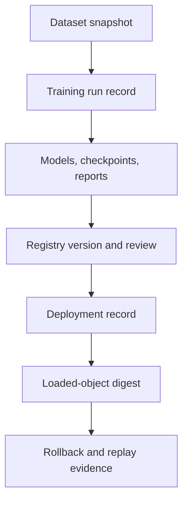
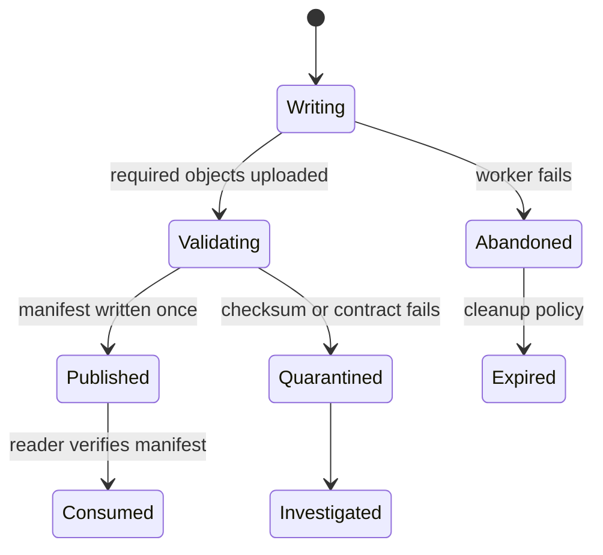
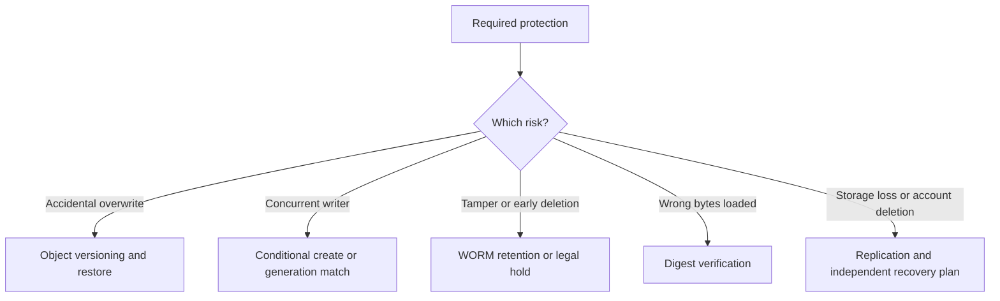
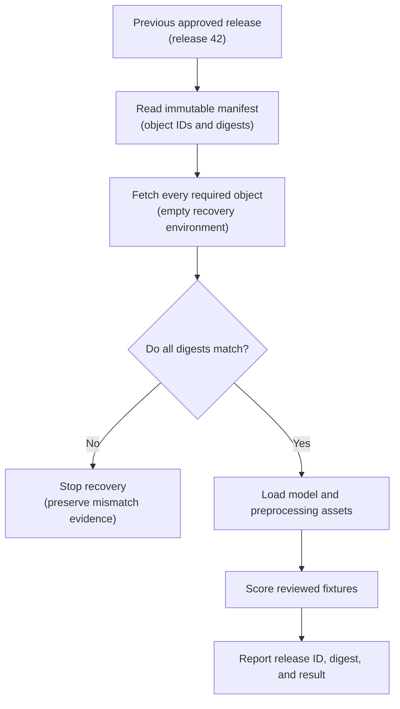

## Table of Contents

1. [Object Storage Holds The Durable Bytes](#object-storage-holds-the-durable-bytes)
2. [Give Every Stored Asset A Stable Name And Address](#give-every-stored-asset-a-stable-name-and-address)
3. [Publish A Manifest Only After Every File Is Ready](#publish-a-manifest-only-after-every-file-is-ready)
4. [Use Checksums To Verify The Stored Content](#use-checksums-to-verify-the-stored-content)
5. [Give Each Workload Only The Storage Access It Needs](#give-each-workload-only-the-storage-access-it-needs)
6. [Versioning And Immutability Protect Different Risks](#versioning-and-immutability-protect-different-risks)
7. [Set Retention And Storage Classes By Asset Purpose](#set-retention-and-storage-classes-by-asset-purpose)
8. [Test Recovery From The Release Record To A Working Model](#test-recovery-from-the-release-record-to-a-working-model)
9. [Follow The Complete Object-Storage Workflow](#follow-the-complete-object-storage-workflow)
10. [References](#references)

## Object Storage Holds The Durable Bytes
<!-- section-summary: Object storage gives independent ML jobs durable network access to datasets and artifacts that outlive any notebook, container, or worker. -->

**Object storage** stores a payload, called an object, under a key inside a bucket or container. Amazon S3, Azure Blob Storage, and Google Cloud Storage use this design. ML teams rely on it because training data, checkpoints, model packages, reports, and prediction archives can be large and must survive after the machine that created them disappears.

Object storage differs from a local or shared filesystem in ways that shape an ML platform. Clients access objects through service APIs. A key identifies an object, while directory-looking prefixes help people organize keys. Jobs can read and write from different machines without mounting the same disk. Providers manage durability and scale, while teams manage identity, permissions, completion rules, retention, and recovery.

The storage service understands bytes, metadata, and access rules. The wider MLOps system supplies meaning. A bucket cannot decide that a model passed evaluation, that a dataset is safe for training, or that version `42` is the rollback target. Registries, catalogs, run records, and deployment records attach that meaning to stable object identities.

This boundary is easy to miss because several systems may show the same asset. A Delta table describes rows, columns, transactions, and table history; its underlying files may live in object storage. An MLflow registry describes a model version and its review state; the model package may also live in object storage. The table and registry answer questions about meaning and lifecycle. The object store answers whether the referenced bytes still exist and whether this workload may read them.


*The storage service protects an object's location, content, access, and lifecycle. Catalogs, trackers, registries, and release records explain what those bytes represent and whether a production process may use them.*


```mermaid
flowchart TD
    Data["Dataset snapshot"] --> Run["Training run record"]
    Run --> Objects["Models, checkpoints, reports"]
    Objects --> Registry["Registry version and review"]
    Registry --> Release["Deployment record"]
    Release --> Runtime["Loaded-object digest"]
    Runtime --> Recovery["Rollback and replay evidence"]
```

The rest of this article follows the path of a durable ML asset. It first receives a stable identity. Its producer uploads every required file and publishes a completion record. Consumers verify the content before use. Access and retention policy protect the asset throughout its life, and a restore drill proves that an old release can still run.

## Give Every Stored Asset A Stable Name And Address
<!-- section-summary: Immutable dataset, run, and release identities prevent independent jobs from overwriting or silently reinterpreting the same key. -->

A **namespace** is the naming structure used for buckets and object keys. Human-readable prefixes help operators navigate during an incident, while immutable identifiers prevent ambiguity. A training run should write to its own run ID. A dataset release should have a snapshot ID. An approved model package should resolve to a concrete object generation or content digest.

Consider a document-classification pipeline. Its layout might use these identities:

```yaml
dataset:
  id: document-pages-2026-06-30-r2
  manifest: datasets/document-pages/snapshot=2026-06-30-r2/manifest.json
run:
  id: run-8fb4c32
  prefix: runs/document-classifier/run=8fb4c32/
release:
  id: document-classifier-42
  model: runs/document-classifier/run=8fb4c32/model/model.onnx
  manifest_sha256: sha256:7d13...
```

The prefix structure supports browsing, while the manifest and digest support verification. The dataset ID identifies a released collection rather than a moving folder. The run ID keeps retries and concurrent experiments apart. The release ID connects the model object with its preprocessing assets, schema, evaluation, and runtime.

Names such as `latest/`, `final-model.pkl`, or `current-dataset/` can offer convenient discovery, but they are weak execution inputs. A job should resolve a moving name once, record the concrete identity, and then continue with the immutable reference. This is the same rule used for registry aliases and deployment tags.

Bucket boundaries also carry operational meaning. A bucket can have its own access and retention policy. It can also use a separate encryption key, network path, and cost owner. A small team may keep development artifacts in one bucket and use prefixes for datasets, runs, and reports. Production releases deserve a stronger boundary if only deployment automation should write them. Regulated data may require another account or project because it has different administrators and deletion rules.

The decision therefore starts with trust rather than folder aesthetics. Use a new prefix for organization inside the same policy boundary. Use a new bucket if access, retention, or encryption must differ. A separate account or project provides a stronger administrative and failure boundary. Every new boundary needs its own operating plan. Create one only if the extra isolation justifies that work.

## Publish A Manifest Only After Every File Is Ready
<!-- section-summary: Producers publish a manifest or completion record only after every required object exists and passes validation, so consumers never treat partial output as a valid asset. -->

Many ML assets contain several files. A model release may include weights, tokenizer data, labels, signatures, and an evaluation report. A dataset release may contain hundreds of partitions plus a manifest. Object stores do not provide a portable atomic rename for an arbitrary multi-object collection.

This creates a failure path. A worker uploads the model, crashes before uploading the tokenizer, and leaves a plausible-looking prefix. A deployment process that checks only for the model file can load an incomplete release. The same risk appears when a data pipeline publishes some partitions before a reader starts training.

The safe pattern separates **writing** from **publication**:


```mermaid
stateDiagram-v2
    [*] --> Writing
    Writing --> Validating: required objects uploaded
    Writing --> Abandoned: worker fails
    Validating --> Published: manifest written once
    Validating --> Quarantined: checksum or contract fails
    Published --> Consumed: reader verifies manifest
    Abandoned --> Expired: cleanup policy
    Quarantined --> Investigated
```

The producer writes objects into a unique attempt location, computes digests, validates required files and schemas, and writes a manifest last. Consumers treat the manifest as the publication boundary. The manifest lists each object identity, size, digest, media type, and release role. A completion file such as `_SUCCESS.json` can work when its semantics are documented and enforced.

The publication write should be create-only or conditional. The example below uploads the final manifest to Amazon S3 only if that key has no current object:

```bash
aws s3api put-object \
  --bucket ml-production-releases \
  --key document-classifier/releases/42/manifest.json \
  --body manifest.json \
  --if-none-match "*" \
  --checksum-algorithm SHA256
```

S3 rejects the write if another worker already published release `42`. The caller must then read the existing manifest and compare its digests; it must not overwrite the key. The checksum option asks S3 to validate the uploaded content, while the manifest records the digests that later systems use as release identity.

The same rule has different names across providers. Google Cloud Storage accepts a generation-match precondition of `0` for “create only if no live object exists.” Azure Blob Storage accepts `If-None-Match: *` for the same purpose. Production libraries should expose one operation such as `publish_if_absent()` and implement it with the provider’s native precondition. A preliminary “does the object exist?” request is insufficient because a second writer can publish between the check and the upload.

Retries need an explicit rule. If the same run retries with identical object digests, publication can return the existing manifest as success. If any digest differs, the retry should fail and receive a new attempt identity. Silent replacement would disconnect earlier evaluation from the bytes later consumers load.


*The manifest is the publication boundary. A consumer ignores an attempt prefix until every required object passes validation and a create-if-absent manifest records the exact object identities and digests.*

## Use Checksums To Verify The Stored Content
<!-- section-summary: Checksums, manifests, and runtime reporting prove that storage, review, and serving refer to the same bytes. -->

A key tells you where to ask for an object. A **checksum** or cryptographic digest tells you which content arrived. Providers can validate supported checksums during upload and download. The MLOps platform can also record a digest in the dataset manifest, run record, registry version, and release approval.

Integrity serves several failure cases. It catches truncated transfers, accidental replacement, damaged caches, and a deployment request that points to different bytes from the reviewed candidate. It also makes runtime identity observable. A model server can report the release ID and artifact digest it loaded, which lets operators compare desired deployment state with actual state.

Suppose evaluation approved a model with digest `sha256:7d13...`, but a new serving pod reports `sha256:91ab...`. Both pods may have loaded a valid ONNX file and passed a health check. The digest mismatch still blocks traffic because the new pod is running bytes that the approval record never reviewed. The team investigates the release manifest, cache, and deployment reference before touching model thresholds.

An ETag should only be treated as a content digest when the provider’s rules and upload method guarantee that meaning. Multipart uploads and encryption modes can change ETag semantics. Use an explicitly supported checksum or a platform-computed cryptographic digest for release identity.

Signatures and provenance cover a related question: who produced the object and through which build path? A checksum alone proves content equality. It does not establish a trusted producer. Higher-assurance platforms may sign release manifests, retain build provenance, and verify both signature and digest at promotion time.

## Give Each Workload Only The Storage Access It Needs
<!-- section-summary: Workload identities and least-privilege permissions limit each pipeline, reviewer, and serving runtime to the object operations required for its role. -->

Access policy should follow the job that performs the work. A dataset builder can write curated snapshots. Training can read approved snapshots and write to run-specific output prefixes. Review automation can read evaluation evidence. Production serving can read approved model packages and should have no permission to overwrite them.

That separation changes the outcome of a compromised training job. The job might corrupt its own experimental output, but it cannot replace release `42` or delete the rollback candidate. Promotion automation performs the narrow publication step after validation. Serving receives read access to the production-release prefix and no write or delete access.

For S3, the serving role can be limited to the operation and prefix it actually needs:

```json
{
  "Effect": "Allow",
  "Action": ["s3:GetObject"],
  "Resource": [
    "arn:aws:s3:::ml-production-releases/document-classifier/releases/*"
  ]
}
```

Equivalent designs use managed identities with Azure role assignments or Google Cloud service accounts with bucket-level IAM. The important test is performed from the real workload identity: it must read an approved package, fail to write into the release prefix, and fail to read a restricted dataset outside its scope.

Cloud workload identity supplies temporary credentials to a job, pod, function, or managed service. Static access keys in notebooks and configuration files create long-lived leakage and rotation risk. The identity policy should restrict actions, resource prefixes, environment, and sometimes network location. Separate training and deployment identities prevent compromised training code from changing production releases.

Encryption addresses another boundary. Providers encrypt stored data and network transport, with choices around provider-managed or customer-managed keys. Key ownership, rotation, revocation, and regional placement should match the data classification. A customer-managed key adds control and also creates a dependency: disabling or deleting it can make every protected artifact unavailable.

Audit logs show which identity read, wrote, or deleted an object. Run and release records explain why that object was used. Both layers matter. A storage log can show that a training role read a dataset, while the run record connects that read to an approved experiment and model version.

Prediction archives and training data may contain personal, confidential, or licensed material. Logging and artifact design should minimize copied sensitive fields, enforce retention, and record authorized purpose. Moving data into a different prefix does not change its classification.

## Versioning And Immutability Protect Different Risks
<!-- section-summary: Versioning retains earlier object generations, while immutable naming and WORM policies prevent or constrain replacement and deletion. -->

**Object versioning** keeps earlier generations when a key is replaced or deleted. It can recover accidental edits and supplies a concrete generation ID. Versioning is valuable defence in depth, though it should not encourage intentional overwrites of released assets. New datasets, runs, and models should still receive new immutable identities.

**Immutability** can mean an application rule, a policy-enforced create-only namespace, or a write-once-read-many retention control. WORM policies protect critical records from modification or deletion for a declared period. They fit audit evidence and legal retention when the organisation has defined the requirement. Locking the wrong data or retention period can create cost and operational problems, so teams should test policy changes in a safe boundary before locking them.

Provider details differ. Azure Blob versioning creates immutable blob versions, with documented limits for hierarchical-namespace accounts. Azure immutable storage adds time-based retention and legal holds. Google Cloud Storage offers object versioning, soft delete, holds, and retention policies. Amazon S3 offers versioning and Object Lock.

Platform code should state the guarantee it needs. Examples include “this release key cannot be replaced” and “this audit record cannot be deleted for seven years.” The platform design can then name the provider control that enforces each guarantee.


```mermaid
flowchart TB
    Intent["Required protection"] --> A{"Which risk?"}
    A -->|Accidental overwrite| V["Object versioning and restore"]
    A -->|Concurrent writer| C["Conditional create or generation match"]
    A -->|Tamper or early deletion| W["WORM retention or legal hold"]
    A -->|Wrong bytes loaded| H["Digest verification"]
    A -->|Storage loss or account deletion| B["Replication and independent recovery plan"]
```

These controls complement each other. Versioning cannot recover a deleted storage account. A checksum cannot restore missing bytes. WORM retention cannot prove that the original upload was correct. The recovery design should cover the specific threat and failure boundary.

## Set Retention And Storage Classes By Asset Purpose
<!-- section-summary: Retention and storage-tier policy follow an asset’s rollback, replay, audit, privacy, and legal value rather than one age rule for the entire bucket. -->

ML storage grows through dataset snapshots, intermediate features, checkpoints, evaluation outputs, model packages, prediction logs, and repeated experiments. **Lifecycle management** moves objects between storage classes or removes them according to policy. It controls cost and retention only when the asset catalog explains what each object means.

A failed exploratory run may expire after weeks. A checkpoint used only to resume an interrupted training job can expire after training finishes. The final model, preprocessing code, environment lock, and evaluation report remain together for every production and rollback release. Prediction logs containing personal data may have a maximum privacy retention period, while approval evidence may have a longer minimum retention period.

A practical policy starts from recovery and compliance questions rather than object age. Which releases must remain deployable? Which datasets must reproduce an audit result? Which records must be deleted by a deadline? How quickly must archived data return? The answers become lifecycle rules only after the team has traced dependencies between the objects.

Deletion should follow dependency analysis. Removing a tokenizer while retaining model weights leaves an unusable release. Removing a dataset manifest can make an old run impossible to explain. Removing all previous object generations eliminates the value of versioning. Lifecycle policy should treat the release unit and evidence graph as a group, even when different object types use different storage tiers.

Archive tiers can add retrieval delay and minimum-duration charges. A rollback artifact that takes hours to restore cannot support a ten-minute recovery objective. Teams should match storage class with recovery time and test the actual restore path rather than reading a price table alone.

## Test Recovery From The Release Record To A Working Model
<!-- section-summary: Restore drills verify that identities, permissions, keys, manifests, dependencies, and retained bytes can still produce a working old release. -->

A credible recovery test starts from the registry or release record rather than a hand-picked bucket key. Assume the current document classifier must roll back from release `43` to `42`. The drill reads release `42` from the registry and follows its immutable manifest reference. It downloads every listed object into an empty environment and verifies each SHA-256 digest. It then loads the model and tokenizer and scores a small reviewed fixture set. The drill passes only if the predictions match the stored expectations and the runtime reports release `42` with the approved digest.

This sequence matters because an operator who already knows the bucket path can accidentally bypass a broken registry reference, missing permission, or expired encryption key. Starting from the same release record used by deployment tests the complete recovery chain.


```mermaid
flowchart TD
    Record["Previous approved release<br/>(release 42)"] --> Manifest["Read immutable manifest<br/>(object IDs and digests)"]
    Manifest --> Fetch["Fetch every required object<br/>(empty recovery environment)"]
    Fetch --> Verify{"Do all digests match?"}
    Verify -->|No| Stop["Stop recovery<br/>(preserve mismatch evidence)"]
    Verify -->|Yes| Load["Load model and preprocessing assets"]
    Load --> Fixture["Score reviewed fixtures"]
    Fixture --> Report["Report release ID, digest, and result"]
```

The test can fail even when the objects exist. Permissions may have changed. A customer-managed key may be disabled. A lifecycle rule may have removed the environment lock. The runtime may reject an old model format. A cross-region copy may lag behind the registry. Each failure exposes a missing dependency in the evidence graph.

Recovery targets should distinguish durability from availability. Provider durability protects against hardware loss inside the service. Regional incidents may require replication. Account deletion or destructive administrator actions may require an isolated backup under a second administrative boundary. The organisation’s threat model and recovery objective decide how far this design goes.

## Follow The Complete Object-Storage Workflow
<!-- section-summary: Object storage supports reliable ML systems when stable identities, publication, integrity, access, protection, retention, and recovery operate as one framework. -->

Object storage is the durable byte layer beneath many ML systems. Reliability comes from the protocol around those bytes. Producers use immutable identities, upload the complete asset, and publish a manifest exactly once. Consumers follow the manifest and verify content before use. Workload identities restrict who can write, retention follows the asset’s recovery and compliance value, and restore drills begin from the same release record used in production.

These controls also clarify the boundary with catalogs and registries. Object storage preserves the model package, dataset partitions, and evidence files. The surrounding MLOps records explain what those objects mean, which release was approved, and which exact content should be running. A production design needs both layers and a tested connection between them.


*Production object storage depends on a complete protocol around the bytes: immutable identities, isolated write attempts, manifest-last publication, digest verification, workload-specific access, purpose-based retention, and restore drills that start from the release record.*

## References

- [Amazon S3 consistency model](https://docs.aws.amazon.com/AmazonS3/latest/userguide/Welcome.html#ConsistencyModel)
- [Amazon S3 conditional writes](https://docs.aws.amazon.com/AmazonS3/latest/userguide/conditional-writes.html)
- [Enforcing Amazon S3 conditional writes](https://docs.aws.amazon.com/AmazonS3/latest/userguide/conditional-writes-enforce.html)
- [Amazon S3 object integrity](https://docs.aws.amazon.com/AmazonS3/latest/userguide/checking-object-integrity.html)
- [Amazon S3 Versioning](https://docs.aws.amazon.com/AmazonS3/latest/userguide/Versioning.html)
- [Azure Blob Storage data protection](https://learn.microsoft.com/en-us/azure/storage/blobs/data-protection-overview)
- [Azure Blob Storage lifecycle management](https://learn.microsoft.com/en-us/azure/storage/blobs/lifecycle-management-overview)
- [Azure immutable storage overview](https://learn.microsoft.com/en-us/azure/storage/blobs/immutable-storage-overview)
- [Google Cloud Storage Object Versioning](https://cloud.google.com/storage/docs/object-versioning)
- [Google Cloud Storage request preconditions](https://cloud.google.com/storage/docs/request-preconditions)
- [Google Cloud Storage lifecycle management](https://cloud.google.com/storage/docs/lifecycle)
- [Azure Blob Storage conditional headers](https://learn.microsoft.com/en-us/rest/api/storageservices/specifying-conditional-headers-for-blob-service-operations)
- [MLflow artifact stores](https://mlflow.org/docs/latest/ml/tracking/artifact-stores/)
