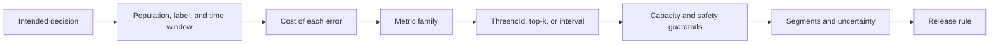

## Metrics Connect Model Output To Product Risk
<!-- section-summary: An evaluation metric is the measurement that turns model predictions into evidence for a product decision. -->

An **evaluation metric** is the number you use to judge whether a model is helping the product safely enough. It might measure how many important cases the model catches, how many alerts it wastes, how far a forecast misses, or how well predicted probabilities match real outcomes. The metric matters because a model can score well on one number and still create the wrong product behavior.

The title answer is simple: **choose evaluation metrics by starting with the decision the model supports, naming the cost of each mistake, and selecting metrics that expose those mistakes before release**. Accuracy, recall, precision, RMSE, and calibration are useful only after you connect them to a real workflow.

The selection framework has an order. First define the intended decision, population, outcome label, and evaluation window. Then choose a metric family that matches the output: classification errors, numeric forecast error, ranking quality, probability quality, or another task-specific measure. Add product utility and capacity constraints, quantify uncertainty, and inspect important segments before writing the release rule. Later articles teach the calculations for classification, regression, ranking, and paired comparisons.

| Framework step | Question | Evidence |
|---|---|---|
| Intended use | Which decision will consume the prediction? | Product workflow and owner |
| Evaluation protocol | Which population, time window, labels, and split answer that question? | Dataset manifest and label definition |
| Metric family | Does the model classify, estimate a number, rank, retrieve, or estimate probability? | Task metric report |
| Decision rule | Which threshold, top-k cutoff, or interval changes the product action? | Operating-point table |
| Utility and constraints | Which mistakes cost users, money, or human capacity? | Primary metric and guardrails |
| Reliability | How uncertain is the result, and where can averages hide failure? | Confidence interval, paired comparison, and segment report |



The order prevents a familiar mistake: selecting a convenient metric and then inventing a product story around it. Every later choice should be traceable to the decision and its costs.

Think about a model that flags patients who may need a nurse review within the next hour. A missed high-risk patient is dangerous. A false alert still matters because it pulls nurses away from other work, yet it carries a different cost. If the team optimizes plain accuracy, the model may look strong because most patients are stable. If the team optimizes recall without watching false alerts, nurses may drown in alerts and start ignoring them. The metric choice shapes the behavior.

This article applies the framework to one binary-classification review. You will see how the team picks primary and guardrail metrics, chooses a threshold, checks calibration, slices results by patient segment, and writes release gates that a reviewer can actually use. The clinical names and numbers are illustrative; a real clinical system needs domain validation, governance, safety review, and evidence for its exact intended use.

Metric selection has six layers. Start with the **decision** the product makes, then describe the **cost of each error**, choose a **measurement family** that represents that cost, define the **operating point** or threshold, inspect **calibration and segments**, and finally encode a **release rule** with uncertainty and comparison data. Starting with a familiar metric reverses this logic: the team optimizes what is easy to calculate and only later asks whether it represents the product.

The layers interact. Changing a threshold changes precision and recall. Segment prevalence changes how those rates translate into workload and harm. Calibration affects whether a score can support a risk-based policy. A release gate needs the candidate-baseline difference and its uncertainty, not a single isolated score. The sections below deepen each layer before combining them into a metric contract.

## A Triage Model As A Supporting Example
<!-- section-summary: A supporting example uses a patient triage model where missed risk and alert overload both have real consequences. -->

Imagine **HarborCare Clinics**, a regional urgent-care network. The data science team trains a model called `triage-escalation-risk` that predicts whether a patient may need urgent nurse escalation during the next hour. The model returns a probability from `0.0` to `1.0`. The triage app turns that score into an alert when the probability crosses a chosen threshold.

The evaluation dataset is `triage_holdout_2026_06`, built from 42,000 visits. Each row has the patient visit ID, age band, clinic site, arrival channel, symptoms, vital signs, model score, and the final label. The label is `1` when a nurse escalation happened within one hour and `0` otherwise. The clinical operations lead cares most about catching high-risk patients, and the nursing manager cares about the number of alerts each shift can handle.

Here is the shape of the evaluation table:

| Field | Example | Why it matters |
|---|---|---|
| `visit_id` | `visit_80231` | Lets reviewers trace predictions to cases |
| `clinic_id` | `harbor-west` | Supports segment checks by site |
| `age_band` | `65_plus` | Supports safety review for older patients |
| `arrival_channel` | `walk_in` | Shows whether phone intake and walk-ins behave differently |
| `symptom_group` | `chest_pain` | Helps inspect clinically important slices |
| `risk_score` | `0.74` | The probability used for thresholding |
| `label_escalated_1h` | `1` | The ground truth for offline evaluation |


*The metric choice starts with the clinical decision, then follows the feared error through recall, guardrails, and a release gate the review team can defend.*

The important part is the workflow around the score. The model never acts alone. It creates a cue for a nurse. That means the metric contract must respect two realities: missing an urgent patient is costly, and alert volume must fit real staffing.

## Name The Error You Fear Most
<!-- section-summary: Metric choice starts by naming false negatives, false positives, and the product cost attached to each one. -->

A classification model creates two kinds of mistakes. A **false negative** is a risky patient the model misses. A **false positive** is a stable patient the model sends to nurse review. Both are errors, and they create different operational problems.

For HarborCare, the team writes the mistake costs in plain language before choosing metrics:

| Error | Triage example | Product cost | Metric that exposes it |
|---|---|---|---|
| False negative | Patient needed escalation, no alert fired | Possible delayed care | Recall, false negative count |
| False positive | Patient was stable, alert fired | Nurse workload and alert fatigue | Precision, alerts per 100 visits |
| Poor ranking | High-risk patients score below lower-risk patients | Weak queue ordering | ROC AUC, average precision |
| Poor probability | A score near `0.80` means real risk near `0.50` | Bad staffing and threshold planning | Calibration curve, Brier score |

**Recall** answers: out of the visits that truly needed escalation, how many did the model catch? **Precision** answers: out of the visits the model alerted, how many truly needed escalation? **Average precision** summarizes precision and recall across thresholds, and it helps when positive cases are rare. **Calibration** checks whether a probability means what it says.

Here is a first metric report at threshold `0.50`:

| Metric | Current production | Candidate |
|---|---:|---:|
| Recall for escalation | 0.78 | 0.88 |
| Precision for alerts | 0.41 | 0.36 |
| Alerts per 100 visits | 8.9 | 12.7 |
| Average precision | 0.46 | 0.52 |
| Brier score | 0.071 | 0.064 |

The candidate catches more urgent cases, which is good. It also creates more alerts, which may break the shift workflow. This is exactly why a metric table needs more than one number. The team now has to choose an operating threshold instead of accepting the default.

## Turn Scores Into Decisions With Thresholds
<!-- section-summary: A threshold turns a probability score into an action, so the threshold must match the real cost and capacity of the workflow. -->

A **threshold** is the cutoff that turns a score into a decision. If the triage threshold is `0.50`, a visit with score `0.51` gets an alert and a visit with score `0.49` does not. The model score may stay the same while the product behavior changes a lot.

For HarborCare, the review team evaluates thresholds from `0.30` to `0.70`. They choose thresholds on a validation set, then keep a separate final holdout for the release packet. This separation matters because a threshold can overfit just like model parameters can.

| Threshold | Recall | Precision | Alerts / 100 visits | Missed escalations / 1,000 visits | Nurse review load |
|---:|---:|---:|---:|---:|---|
| 0.30 | 0.94 | 0.24 | 23.8 | 2.9 | Too high for current staffing |
| 0.40 | 0.91 | 0.30 | 17.4 | 4.4 | High, possible on staffed days |
| 0.50 | 0.88 | 0.36 | 12.7 | 5.8 | Within surge plan |
| 0.60 | 0.82 | 0.44 | 9.4 | 8.7 | Normal staffing |
| 0.70 | 0.73 | 0.53 | 6.7 | 13.1 | Quiet, misses too many cases |


*The threshold panel makes the release choice concrete: threshold `0.50` catches more urgent cases while keeping alert volume inside the pilot staffing plan.*

The threshold table gives the product owner and clinical lead a shared choice. If the clinics can handle around 13 alerts per 100 visits during the pilot, threshold `0.50` may fit. A staffing change cannot silently change a clinical operating threshold because the new cutoff changes both missed cases and alert volume. Any threshold change needs the same domain, safety, capacity, and validation review as the original operating point. The release gate should name the planned threshold and any separately approved fallback policy.

You can compute this table with scikit-learn metrics in a repeatable evaluation job:

```python
import pandas as pd
from sklearn.metrics import precision_score, recall_score, brier_score_loss

def threshold_report(df: pd.DataFrame, thresholds: list[float]) -> pd.DataFrame:
    rows = []
    y_true = df["label_escalated_1h"].to_numpy()
    scores = df["risk_score"].to_numpy()

    for threshold in thresholds:
        y_pred = scores >= threshold
        alerts = y_pred.sum()
        missed = ((y_true == 1) & (y_pred == 0)).sum()
        rows.append(
            {
                "threshold": threshold,
                "recall": recall_score(y_true, y_pred),
                "precision": precision_score(y_true, y_pred, zero_division=0),
                "alerts_per_100_visits": alerts / len(df) * 100,
                "missed_escalations_per_1000": missed / len(df) * 1000,
                "brier_score": brier_score_loss(y_true, scores),
            }
        )

    return pd.DataFrame(rows)
```

This code keeps the operating decision visible. The output is a review artifact, not a notebook side effect. The release packet should attach the table, the dataset version, and the chosen threshold.

## Check Calibration Before Trusting Risk Scores
<!-- section-summary: Calibration checks whether predicted probabilities line up with observed outcome rates. -->

**Calibration** asks whether a predicted probability can be interpreted as a real-world risk estimate. If 100 visits receive scores around `0.80`, a well-calibrated triage model should see close to 80 of those visits escalate. This matters when people use the score for staffing, urgency queues, or risk communication.

HarborCare bins scores into groups and compares the average predicted risk with the observed escalation rate:

| Score bin | Visits | Average predicted risk | Observed escalation rate |
|---|---:|---:|---:|
| 0.00-0.20 | 28,400 | 0.07 | 0.06 |
| 0.20-0.40 | 7,900 | 0.29 | 0.24 |
| 0.40-0.60 | 3,600 | 0.50 | 0.42 |
| 0.60-0.80 | 1,500 | 0.69 | 0.63 |
| 0.80-1.00 | 600 | 0.87 | 0.79 |

The model ranks patients well enough to help triage, yet it overstates risk in the middle and high score bands. That does not automatically kill the release. It changes how the team explains and uses the score. The UI can say "review recommended" instead of "87% risk" until calibration improves. The staffing forecast should use observed rates from calibration bins rather than raw scores.

The Brier score is useful as one calibration-related loss, and a reliability table or calibration plot gives the reviewer the practical picture. For release, HarborCare sets a gate: the candidate Brier score must improve over production, and no high-risk bin may overstate observed risk by more than the approved tolerance.

## Add Segments And Release Gates
<!-- section-summary: Aggregate metrics need segment checks and explicit pass/fail gates before the team can trust a candidate. -->

The overall metric table can hide harm in small groups. HarborCare therefore checks key segments before the release meeting. The team does not add segments randomly. They choose groups tied to clinical workflow, data coverage, and known risk: clinic site, age band, arrival channel, symptom group, and language.

| Segment | Recall | Precision | Alerts / 100 visits | Gate |
|---|---:|---:|---:|---|
| All visits | 0.88 | 0.36 | 12.7 | Pass |
| `65_plus` | 0.91 | 0.34 | 15.2 | Pass |
| `under_18` | 0.76 | 0.31 | 8.1 | Review |
| `phone_intake` | 0.84 | 0.39 | 10.4 | Pass |
| `walk_in` | 0.90 | 0.35 | 13.5 | Pass |
| `limited_english` | 0.72 | 0.28 | 9.7 | Block |

This table changes the decision. The candidate looked ready on overall recall. The `limited_english` segment shows weaker recall and lower precision, which means the model misses more urgent cases while also wasting more reviews when it does alert. The team should block release, inspect input quality, improve interpreter-note handling, and rerun evaluation.

Release gates should be written as code or configuration so every candidate receives the same review:

```yaml
metric_gates:
  model: triage-escalation-risk
  evaluation_dataset: triage_holdout_2026_06
  threshold: 0.50
  primary:
    recall:
      min: 0.86
  guardrails:
    precision:
      min: 0.34
    alerts_per_100_visits:
      max: 14.0
    brier_score:
      max: 0.068
  segments:
    - column: age_band
      recall_min: 0.80
      support_min: 400
    - column: arrival_channel
      recall_min: 0.82
      support_min: 400
    - column: language_access
      recall_min: 0.80
      support_min: 250
```

A gate like this helps the team avoid moving thresholds during a meeting. The reviewer can still use judgment, especially for small segments, but the default path is clear: pass the agreed checks, document exceptions, or hold the model.

## Write The Metric Contract
<!-- section-summary: The final metric contract names the dataset, threshold, metrics, segments, owners, and blocked-release conditions. -->

A **metric contract** is the short agreement that says how the model will be judged. It belongs beside the evaluation code and inside the release packet. For HarborCare, it should name the dataset, label definition, threshold, metrics, segment gates, owners, and rollback plan.

Here is a practical contract:

```yaml
evaluation_contract:
  model: triage-escalation-risk
  owner: clinical-ml-platform
  reviewer_groups:
    - nursing-operations
    - clinical-safety
    - ml-platform
  label:
    name: label_escalated_1h
    definition: nurse escalation recorded within one hour of triage start
  datasets:
    threshold_selection: triage_validation_2026_06
    release_holdout: triage_holdout_2026_06
  chosen_threshold: 0.50
  primary_metric:
    name: recall
    reason: missed escalations carry the highest clinical risk
  guardrail_metrics:
    - precision
    - alerts_per_100_visits
    - brier_score
  blocked_release_conditions:
    - recall below 0.86 overall
    - any approved safety segment below 0.80 recall with support at least 250
    - alerts above 14 per 100 visits without staffing approval
    - high-score calibration bin overstates observed escalation by more than 0.10
```


*The contract turns the metric review into a release decision: the candidate can improve recall overall and still pause when a safety segment fails.*

The contract gives beginners a useful habit: write the metric logic before the leaderboard appears. The team can still learn from the results and revise the contract for the next cycle, yet every candidate in one review round should face the same rules.

## Putting It Together
<!-- section-summary: Metric choice works when the team connects errors, thresholds, calibration, segments, and gates to the real release decision. -->

Evaluation metrics are release evidence. Start with the product decision, write down the mistakes that matter, choose primary and guardrail metrics, inspect threshold tradeoffs, check calibration, slice important segments, and turn the result into a metric contract.

For HarborCare, recall matters because missed escalations are dangerous. Precision and alert volume matter because nurses have finite time. Calibration matters because the score may influence staffing and urgency. Segment gates matter because one weak group can hide behind a strong aggregate. A model ships only when the metric contract says the candidate helps the workflow safely enough.

## References

- [scikit-learn: Metrics and scoring](https://scikit-learn.org/stable/modules/model_evaluation.html) - Official guide to classification and regression metrics.
- [scikit-learn: Tuning the decision threshold](https://scikit-learn.org/stable/modules/classification_threshold.html) - Official guide to post-training threshold selection and `TunedThresholdClassifierCV`.
- [scikit-learn: Probability calibration](https://scikit-learn.org/stable/modules/calibration.html) - Official guide to calibration curves and probability interpretation.
- [scikit-learn: Brier score loss](https://scikit-learn.org/stable/modules/generated/sklearn.metrics.brier_score_loss.html) - Official API reference for probabilistic scoring.
- [MLflow Model Evaluation](https://mlflow.org/docs/latest/ml/evaluation/) - Official guide to classic `mlflow.models.evaluate()` for classification and regression.
- [NIST AI Risk Management Framework 1.0](https://nvlpubs.nist.gov/nistpubs/ai/nist.ai.100-1.pdf) - Primary source for trustworthy AI characteristics and risk management functions.
