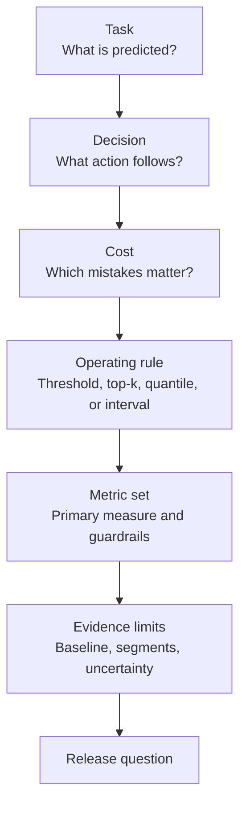
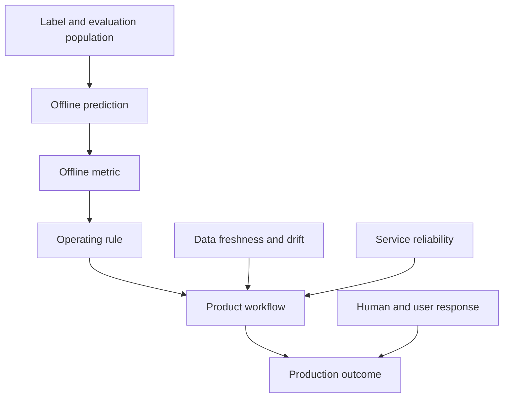

## Table of Contents

1. [What An Evaluation Metric Tells You About A Model](#what-an-evaluation-metric-tells-you-about-a-model)
2. [Start With the Task, Decision, Cost, and Operating Rule](#start-with-the-task-decision-cost-and-operating-rule)
3. [Match the Metric to What the Model Predicts](#match-the-metric-to-what-the-model-predicts)
4. [Choose One Main Metric And Set Limits On Other Harms](#choose-one-main-metric-and-set-limits-on-other-harms)
5. [Choose The Decision Threshold Before Judging The Model](#choose-the-decision-threshold-before-judging-the-model)
6. [Check Whether Predicted Probabilities Match Real Outcomes](#check-whether-predicted-probabilities-match-real-outcomes)
7. [Check Whether Offline Improvements Lead To Better Production Outcomes](#check-whether-offline-improvements-lead-to-better-production-outcomes)
8. [Add Baselines, Segments, and Uncertainty](#add-baselines-segments-and-uncertainty)
9. [Record How Every Model Will Be Evaluated](#record-how-every-model-will-be-evaluated)
10. [The Main Idea](#the-main-idea)
11. [References](#references)

## What An Evaluation Metric Tells You About A Model
<!-- section-summary: An evaluation metric turns predictions and known outcomes into a number that answers one defined question about model behaviour. -->

Imagine a model that selects urgent cases for a review queue. Out of 1,000 cases, 50 are truly urgent. The model catches 45 of them and sends 150 cases to reviewers.

Several descriptions of that same result are true:

- It gets 890 of the 1,000 cases correct, so accuracy is 89 percent.
- It catches 45 of 50 urgent cases, so recall is 90 percent.
- It sends 45 useful cases among 150 alerts, so precision is 30 percent.
- It creates 150 reviews, which may fit the team's capacity or overwhelm it.

No number is universally correct. Accuracy answers how often the predicted class matches the label. Recall answers how much urgent work the model found. Precision answers how concentrated the alerts are. Alert volume describes the workload created by the chosen threshold.

An **evaluation metric** is a rule that summarizes predictions and known outcomes for a particular question. The metric may count correct decisions, measure numeric error, reward useful ranking positions, or judge probability estimates. Its value comes from the question it represents.

A model can improve its accuracy and still make the product worse if the improved cases matter little while costly mistakes increase. **Choosing a metric is a product-decision problem expressed through measurement.** The team first defines what the model predicts and how the product uses that output. It then identifies the costly mistakes and the operating rule that turns predictions into action. A metric can support the intended decision only after those choices are explicit.

You can think of metric selection through five connected layers:

1. **Task:** What output does the model produce, and what outcome should it predict?
2. **Decision:** Which user, workflow, or system action consumes that output?
3. **Cost:** Which errors or missed benefits matter most?
4. **Operating rule:** Which threshold, top-k cutoff, quantile, or interval creates the action?
5. **Evidence:** Which primary metric, guardrails, segments, baselines, and uncertainty checks can support the claim?


```mermaid
flowchart TD
    T["Task<br/>What is predicted?"] --> D["Decision<br/>What action follows?"]
    D --> C["Cost<br/>Which mistakes matter?"]
    C --> O["Operating rule<br/>Threshold, top-k, quantile, or interval"]
    O --> M["Metric set<br/>Primary measure and guardrails"]
    M --> E["Evidence limits<br/>Baseline, segments, uncertainty"]
    E --> R["Release question"]

    class T,D,C purpose
    class O,M mechanism
    class E,R decision
```

The order matters. Starting with a familiar metric can lead a team to optimize what is convenient to calculate. Starting with the decision lets the team choose evidence that represents the real benefit and harm.


*A metric gains meaning from the task, product action, cost of mistakes, and operating rule around it.*

## Start With the Task, Decision, Cost, and Operating Rule
<!-- section-summary: A useful metric contract starts from the prediction target and follows the output through the product action and its consequences. -->

A list of metric names gives little guidance until the reader can picture the decision being measured. Start with one complete use of the prediction: the outcome, the action, the people or system affected, and the practical limits around that action.

Suppose a model estimates the chance that an account will miss a payment in the next thirty days. The product sends high-risk cases to a support team that can contact 2,000 accounts each day. A missed high-risk account loses the chance for early help. An unnecessary contact uses staff time and may frustrate a customer.

This short description reveals four different objects:

- The **task** is probability prediction for a defined outcome and time horizon.
- The **decision** is whether an account enters the contact queue.
- The **costs** include missed high-risk accounts, unnecessary contact, and staff workload.
- The **operating rule** selects accounts from the scores while respecting capacity.

The metric set can now answer a real question. Recall can measure the share of missed-payment cases found. Precision can show how many selected contacts were useful. Recall among the top 2,000 scores can measure performance at the queue's actual daily capacity. Calibration can test whether risk bands behave like the probabilities shown to planners.

### Define the outcome before measuring it

A target label needs a precise meaning. “Churn,” “fraud,” “urgent,” and “successful recommendation” can each hide several definitions.

For the payment case, the team should specify:

- what event counts as a missed payment;
- the population eligible for scoring;
- the thirty-day prediction horizon;
- the time after which the label is considered mature;
- exclusions such as closed or disputed accounts.

A metric cannot repair a label that describes the wrong event. If the product wants to prevent missed payments and the label records only account closure, the evaluation measures another problem.

### Describe error costs in ordinary language

Teams often say that false negatives are “more expensive” than false positives. The useful next step is to explain the expense.

A false negative might mean lost revenue, delayed care, missed fraud, or an urgent ticket buried in a queue. A false positive might mean a blocked payment, unnecessary review, intrusive contact, or wasted inventory. The cost may differ by segment, amount, or time.

Exact money values are helpful if they are trustworthy. Many teams lack a single reliable cost. In that case, a primary metric plus explicit guardrails communicates the trade-off more honestly than an invented weighted score.

### Name the action rule

Models often emit a score or ordered list, while products take discrete actions. A classifier may alert above a threshold. A search system may display ten results. A forecast may drive stock for the predicted median or a high quantile. A risk system may assign different actions to several probability bands.

The operating rule belongs in evaluation because it changes the delivered behaviour. The same model can produce high recall and heavy workload at one threshold, then lower recall and lighter workload at another.

## Match the Metric to What the Model Predicts
<!-- section-summary: Classification, regression, ranking, and probability metrics answer different questions because their outputs and target properties differ. -->

The product question tells the team what matters, and the model output determines how that behaviour can be measured. A class label, numeric forecast, ordered list, and probability preserve different information. Their metrics therefore answer different kinds of questions.

### Class labels and decisions

A classification decision assigns one or more categories. The confusion matrix counts true positives, false positives, false negatives, and true negatives. Accuracy, precision, recall, specificity, balanced accuracy, and F-scores summarize different relationships among those counts.

Use these metrics to judge decisions at a defined threshold or rule. Accuracy can work if classes and mistake costs are reasonably balanced. It can mislead on rare events: a model that predicts “ordinary” for every transaction may exceed 99 percent accuracy and catch no fraud.

A confusion-matrix report should preserve the underlying counts because each rate highlights a different mistake. At selection time, the key question is which error count maps to the product harm and which second metric protects the competing cost.

### Numeric predictions

A regression model predicts a number such as demand, arrival time, energy use, or claim amount.

**Mean absolute error (MAE)** reports the average absolute miss in the target's units. An MAE of 8 minutes has an immediate operational meaning. **Mean squared error (MSE)** and its square root, RMSE, give large misses more influence because error is squared. That can fit a product where a few large errors carry serious cost.

The choice also relates to what the model is trying to estimate. Absolute error is aligned with the conditional median, while squared error is aligned with the conditional mean. Quantile loss evaluates a chosen quantile, which is useful if overprediction and underprediction have different consequences.

Suppose a stock planner wants enough inventory for unusually high demand. An average forecast may be the wrong target. A high-quantile forecast and quantile loss can represent the asymmetric cost of running out. The prediction target determines the metric. Choosing it only for reporting would separate evaluation from the operational goal.

### Ordered results

A ranking or retrieval system produces an ordered list. The user sees the first few positions, so ordinary classification accuracy loses the ordering information.

**Precision at k** asks how many of the first `k` results are relevant. **Recall at k** asks how much of the available relevant set appears there. **Mean reciprocal rank (MRR)** rewards placing the first relevant result early. **Normalized discounted cumulative gain (NDCG)** can reward several graded-relevance results and discounts lower positions.

The product layout determines `k`. A search page showing ten results needs a different cutoff from a recommender displaying three cards. The report should preserve the query groups, relevance labels, and cutoff because all three change the meaning of the score.

### Probabilities and distributions

Some products use the probability itself. Risk bands may control staffing, pricing, human review, or communication. Metrics that judge only the final class can miss poor probability quality.

Log loss and Brier loss are **proper scoring rules**: in expectation, they reward honest probability estimates. Calibration curves compare predicted risk with observed frequency. The loss measures the quality of probabilities across individual cases, while calibration groups similar predictions and checks whether their observed frequency matches the stated risk. For example, roughly 70 out of 100 cases assigned a probability near 0.70 should produce the outcome. Teams inspect both because one summary loss can hide a poorly calibrated range that drives an important product decision.

A compact map helps summarize the choice after the theory is understood:

| Model output | Typical product question | Useful metric family |
|---|---|---|
| Class decision | Which mistakes occur at this operating point? | Confusion-matrix metrics |
| Numeric point | How large are errors, and how should large misses count? | MAE, MSE/RMSE, quantile loss |
| Ordered list | Are useful items placed inside the visible positions? | Precision@k, recall@k, MRR, NDCG |
| Probability | Do scores reward good probability estimates and match observed risk? | Log loss, Brier loss, calibration curve |

## Choose One Main Metric And Set Limits On Other Harms
<!-- section-summary: A primary metric represents the main intended benefit, while guardrails keep other harms, constraints, and important populations visible. -->

Production decisions rarely have one consequence. A model may find more valuable cases and create more customer friction at the same time. Compressing both effects into one unexplained number hides the trade-off that reviewers need to judge.

A **primary metric** represents the main improvement the model is expected to deliver. **Guardrail metrics** protect other outcomes that must stay inside limits.

For a fraud-review queue, recall of fraudulent value might be primary. Precision and reviews per day protect customer friction and analyst capacity. For an arrival-time model, MAE might be primary while p95 absolute error and late-underestimation rate protect the tail. For search, NDCG@10 might be primary while zero-result rate and latency act as guardrails.

This pattern helps reviewers interpret mixed results. If the primary metric improves and a workload guardrail fails, the candidate has found more useful cases through an unaffordable workflow. The team can adjust the operating rule, add capacity, narrow the scope, or reject the release.

### Use a utility score only if its weights have real meaning

A utility or cost function can combine outcomes if the organization understands their relative value. For example:

`utility = recovered fraud value - review cost - customer friction cost`

This measure connects directly to a business decision if each term comes from defensible evidence. Weak estimates can make a precise-looking score fragile. Keep the underlying outcomes visible beside the total so reviewers can see what changed.

### Do Not Trade Away A Safety Limit For A Better Main Score

If one metric selects the model and every other metric is reviewed casually, teams tend to accept regressions after investing in a candidate. Write primary and guardrail limits before the final holdout result appears. The same rule should apply to each candidate in the review round.

Composite leaderboards can still support exploration. Release evidence needs the actual decision dimensions: benefit, harm, capacity, segments, and uncertainty.

## Choose The Decision Threshold Before Judging The Model
<!-- section-summary: A threshold or cutoff turns model outputs into product actions and determines the precision, recall, workload, and harm users experience. -->

A binary classifier often emits a score between zero and one. The threshold turns that score into an action. Lowering it usually selects more cases, which often raises recall and alert volume while reducing precision. Raising it usually selects fewer cases and risks more false negatives.

The default `0.5` threshold has no automatic product meaning. It may be inherited from a library's `predict()` method even though the workflow can handle only a fixed number of cases.

Consider a review team with room for 2,000 cases each day. It receives 20,000 scored cases. The product question is: which threshold captures the most positive cases while keeping selections inside that capacity?

The following code assumes `labels` contains mature binary outcomes and `scores` contains candidate probabilities from a validation set. It evaluates several thresholds, reports the resulting recall, precision, and review volume, then selects the highest-recall row inside capacity. The visible output is a threshold table plus one chosen operating point; the final holdout remains untouched for unbiased release evaluation.

```python
import pandas as pd
from sklearn.metrics import precision_score, recall_score

rows = []
for threshold in [0.20, 0.35, 0.50, 0.65, 0.80]:
    selected = scores >= threshold
    rows.append({
        "threshold": threshold,
        "recall": recall_score(labels, selected),
        "precision": precision_score(labels, selected, zero_division=0),
        "reviews": int(selected.sum()),
    })

report = pd.DataFrame(rows)
feasible = report.loc[report["reviews"] <= 2_000]
chosen = feasible.sort_values("recall", ascending=False).iloc[0]

print(report)
print({"chosen_operating_point": chosen.to_dict()})
```

The important output is the relationship among quality and workload. A threshold with excellent recall and 8,000 reviews is infeasible for the current system. A feasible threshold with poor recall may show that the model or workflow provides too little value.


*The operating point should expose the trade-off among found cases, wasted reviews, and the capacity available to act.*

### Tune on validation data and report on untouched data

Threshold selection is part of model selection. Repeatedly choosing a threshold on the final holdout adapts the decision to that dataset and makes the reported result optimistic.

Use validation data or cross-validation to choose the threshold. Then freeze the rule and evaluate it once on the release holdout. Scikit-learn's `TunedThresholdClassifierCV` can tune a binary classification threshold against a scorer with internal cross-validation. A custom threshold table remains useful if the decision includes hard capacity, segment, or policy constraints that one scorer cannot express clearly.

Top-k ranking and quantile forecasts have equivalent operating choices. The team should select `k` from the visible product surface and choose a forecast quantile from the asymmetric business cost.

## Check Whether Predicted Probabilities Match Real Outcomes
<!-- section-summary: Probability evaluation checks whether scores reward honest estimates and whether groups of similar scores occur at the predicted rate. -->

Suppose 100 cases receive scores near `0.8`. If the score is presented as an 80 percent risk, roughly 80 comparable cases should eventually show the outcome. **Calibration** describes this agreement between predicted probability and observed frequency.

Calibration matters if scores create risk bands, staffing forecasts, prices, or explanations. A model can rank high-risk cases ahead of low-risk cases and still overstate every probability. Its ordering may support a queue, while the displayed risk value would mislead users.

A **calibration curve**, also called a reliability diagram, groups predictions into bins. For each bin, it compares the average predicted probability with the observed positive rate. The count in each bin matters because a point based on twenty cases carries less evidence than a point based on ten thousand.

Log loss and Brier loss assess the full probability prediction. They combine several aspects of quality. Scikit-learn's calibration guidance warns that a lower Brier loss can arise from stronger discrimination even if calibration itself is worse. Use a calibration curve alongside the scalar loss if probability interpretation matters.

### Calibration needs independent data

Fitting a calibrator on the same data used to train the classifier produces optimistic probabilities. Use independent calibration data or a cross-validation approach such as `CalibratedClassifierCV`. Keep the final evaluation set separate.

Calibration can also vary across time and segments. A globally calibrated risk model may overstate risk for one region and understate it for another. Segment calibration and support counts belong in the report if probability meaning influences a consequential action.

## Check Whether Offline Improvements Lead To Better Production Outcomes
<!-- section-summary: Offline metrics measure behaviour on labelled examples, while production outcomes also depend on data freshness, workflow adoption, system reliability, and user response. -->

Offline evaluation asks how predictions compare with known outcomes under a recorded protocol. Production asks whether the complete system improves a real workflow under current data and user behaviour.

The two questions are connected and distinct.

A recommender can improve NDCG on historical relevance labels and reduce user satisfaction after release because the labels favour popular items and hide novelty. A support classifier can improve recall and slow the queue because alert volume rises. A forecast can reduce MAE and increase stockouts if underprediction during peaks carries most of the cost.

Offline metrics are valuable because they provide controlled, repeatable evidence before exposing users. They need a credible path to the production outcome:


```mermaid
flowchart TD
    L["Label and evaluation population"] --> P["Offline prediction"]
    P --> M["Offline metric"]
    M --> R["Operating rule"]
    R --> W["Product workflow"]
    W --> O["Production outcome"]

    D["Data freshness and drift"] --> W
    S["Service reliability"] --> W
    H["Human and user response"] --> O

    class L,P,M offline
    class R,W decision
    class O,D,S,H production
```

The diagram shows the assumptions between a metric and product value. Labels must represent the intended outcome. The operating rule must match the evaluated one. The workflow must have capacity to act. The service must deliver predictions. Users and staff may respond in ways absent from historical data.

Production verification therefore adds service health, input and feature health, decision rates, workload, delayed labels, and product outcomes. A controlled online experiment may be needed to estimate causal product impact. An offline gain remains release evidence, and it should never be presented as proof of an unmeasured business outcome.

### Watch for feedback loops

A production action can change the label later observed. Fraud reviews stop some fraud. Recommendations change which items receive clicks. Human triage changes response time. Historical labels then reflect the old policy and intervention.

Record the policy and treatment that produced the outcome. Where possible, preserve randomized or otherwise defensible evidence for causal questions. Metric selection should acknowledge which outcomes the model can influence and which labels become selective after deployment.

## Add Baselines, Segments, and Uncertainty
<!-- section-summary: A metric value supports a decision only after comparison with meaningful baselines, important segments, and the uncertainty created by finite data. -->

A score in isolation provides little context. An MAE of 12 may beat a naive forecast and lose to the production system. A recall of 0.85 may be useful with 100 alerts and unusable with 100,000.

Use several baselines for different questions:

- A simple heuristic or dummy model shows whether the data and metric reward anything beyond a trivial rule.
- The current production decision shows whether replacement creates useful change.
- A policy-only or human baseline reveals whether the model improves the actual workflow.

The comparison should use the same eligible examples, label policy, operating rule, and metric implementation. Candidate-versus-production decisions work best with paired predictions for the same units.

### Use Segment Results To Limit Broad Claims

Overall averages can hide a failing language, region, device, class, horizon, or workflow route. Choose segments from known harms, product boundaries, incident history, and domain knowledge.

Each segment needs its sample size, candidate and baseline values, coverage, and uncertainty. Sparse evidence should narrow the release claim or trigger targeted collection. Removing the segment from the report would turn missing knowledge into confidence.

### Add Confidence Intervals To Point Estimates

Evaluation data is a sample from the population the team cares about. Another valid sample would produce a different metric. Confidence intervals and paired comparisons show the precision of the estimate.

The resampling or statistical unit should follow the real dependence. Many rows from one patient, user, query, store, or day may need grouped analysis. Treating them as independent can make uncertainty look too small.

The interval should answer a release question: is the improvement large enough to matter, and is the harmful end still acceptable? Multiple metrics and many segment searches also need care because some apparent gains occur by chance.

## Record How Every Model Will Be Evaluated
<!-- section-summary: A metric contract records the target, population, operating rule, primary measure, guardrails, baselines, segments, uncertainty, and release interpretation before final results appear. -->

The team needs a versioned record of how every candidate will be judged. This record is called a **metric contract**. It keeps the product reasoning beside the code that calculates the evidence.

The contract should include:

- intended decision, population, target, horizon, and label maturity;
- model output and operating rule;
- primary metric with its practical improvement margin;
- guardrails for harm, capacity, probability quality, and service cost;
- baselines, segments, and minimum evidence;
- uncertainty method and grouping unit;
- owners and allowed release outcomes.

The following example continues the review-queue situation. It assumes the team has already justified recall as the primary benefit and review volume as a hard operating constraint. The evaluation job reads this configuration, calculates the same report for every candidate, and produces a visible pass, hold, or insufficient-evidence result with the failed rule IDs.

```yaml
decision: prioritize_accounts_for_support_review
population: eligible_accounts_scored_daily
target:
  event: missed_payment
  horizon_days: 30
  maturity_days: 30
operating_rule:
  type: score_threshold
  max_reviews_per_day: 2000
primary_metric:
  name: recall_at_capacity
  minimum_improvement_vs_production: 0.03
guardrails:
  precision_at_capacity_min: 0.30
  feature_coverage_min: 0.995
segments:
  - account_age_band
  - region
uncertainty:
  method: paired_bootstrap
  grouping_unit: account_id
```

The example stays focused on the decision. It avoids dozens of library options and records the facts that change interpretation. A real contract also carries dataset, code, policy, and candidate identities in the release evidence.

### Automate Metric Calculation And Keep Final Judgement With Reviewers

Scikit-learn provides metric functions and scoring interfaces for model selection. Be explicit about `scoring`; estimator defaults are commonly accuracy for classifiers and R² for regressors, which may have little connection to the product decision.

MLflow's classic model evaluation can calculate common classification and regression metrics and produce diagnostic artifacts. `mlflow.validate_evaluation_results()` can apply declared thresholds. Product utility, capacity, segments, and policy-specific outcomes still need explicit metrics and checks.

Teams may use Weights & Biases or cloud-native evaluation and registry tools for the same responsibility. The platform should preserve the dataset and release identity, metrics, tables, plots, code revision, and gate result. Tool choice does not choose the metric logic.

Run the contract in CI or the managed training pipeline, write the evidence to the experiment tracker and governed artifact store, and pass only the exact candidate result into release review. A calculation failure or missing metric should produce an unknown gate result instead of silently passing.

## The Main Idea
<!-- section-summary: Metric choice starts from the product decision and uses task-appropriate measurements, guardrails, operating rules, and evidence limits to support a release claim. -->

An evaluation metric summarizes one question about predictions and outcomes. Its meaning comes from the task, the product action, the cost of mistakes, and the operating rule.

Choose a primary metric for the intended benefit. Add guardrails for competing harms, capacity, probability quality, and cost. Evaluate the threshold, top-k cutoff, quantile, or interval that production will use. Then compare with meaningful baselines across important segments and report uncertainty.

Offline metrics provide controlled release evidence. Production outcomes also depend on current data, reliable delivery, workflow capacity, and human response. A versioned metric contract keeps those assumptions visible and makes each candidate face the same decision.


*The contract preserves the decision context, applies the same checks to every candidate, and keeps missing or uncertain evidence from becoming an automatic pass.*

## References

- [scikit-learn: Metrics and scoring](https://scikit-learn.org/stable/modules/model_evaluation.html)
- [scikit-learn: Tuning the decision threshold](https://scikit-learn.org/stable/modules/classification_threshold.html)
- [scikit-learn: Probability calibration](https://scikit-learn.org/stable/modules/calibration.html)
- [scikit-learn: Brier score loss](https://scikit-learn.org/stable/modules/generated/sklearn.metrics.brier_score_loss.html)
- [MLflow: Model evaluation](https://mlflow.org/docs/latest/ml/evaluation/)
- [MLflow: Model evaluation API](https://mlflow.org/docs/latest/api_reference/python_api/mlflow.models.html)
- [NIST AI Risk Management Framework](https://www.nist.gov/itl/ai-risk-management-framework)
