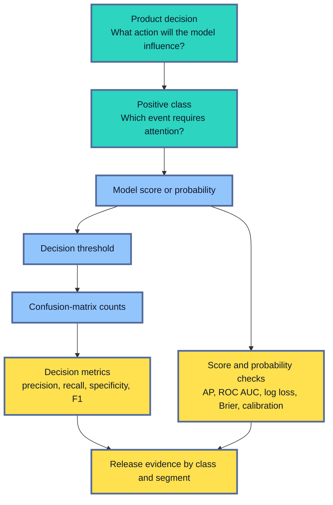
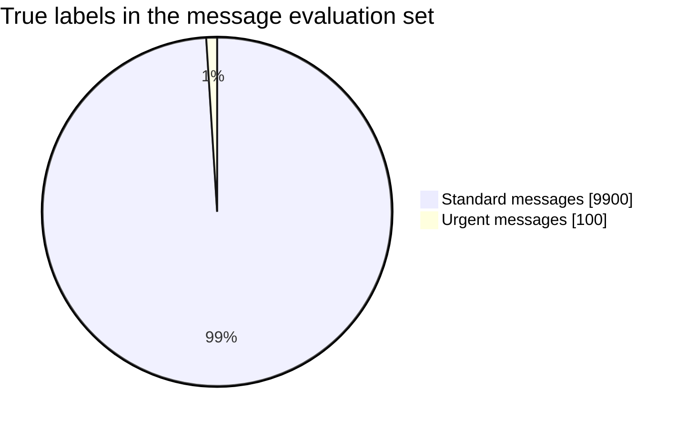
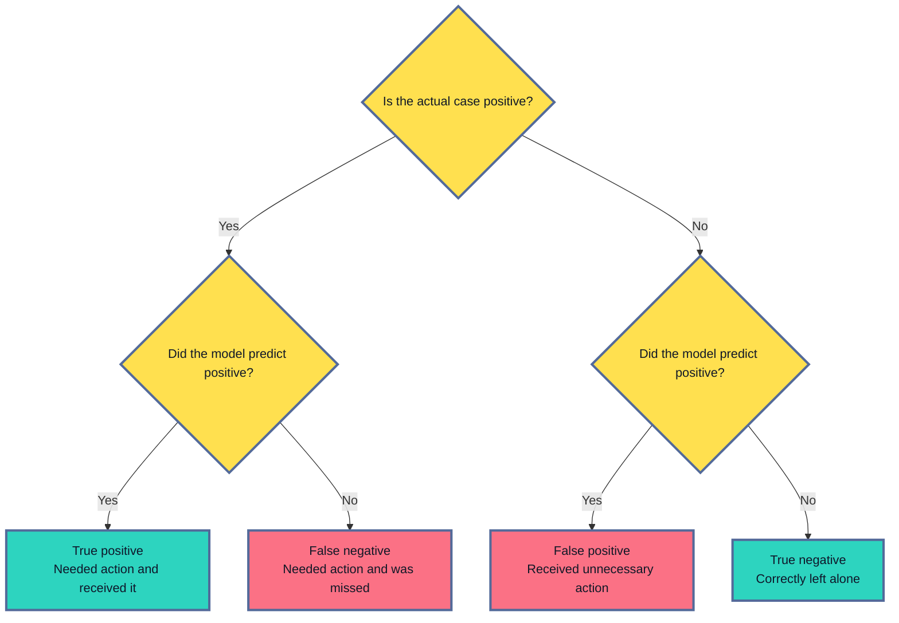
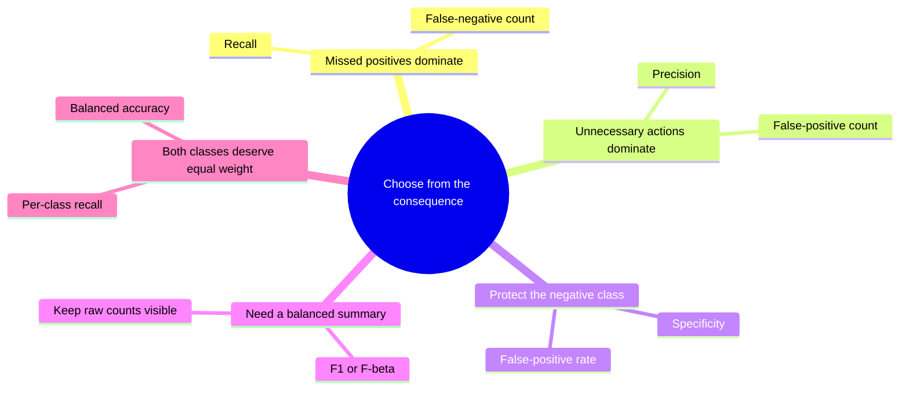
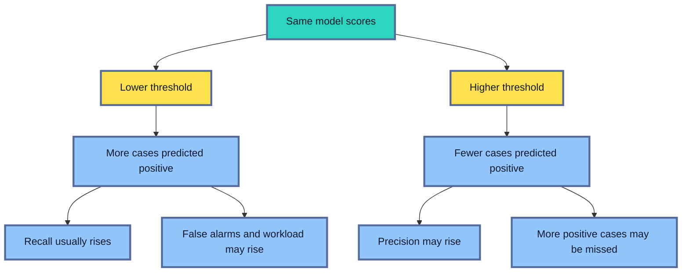
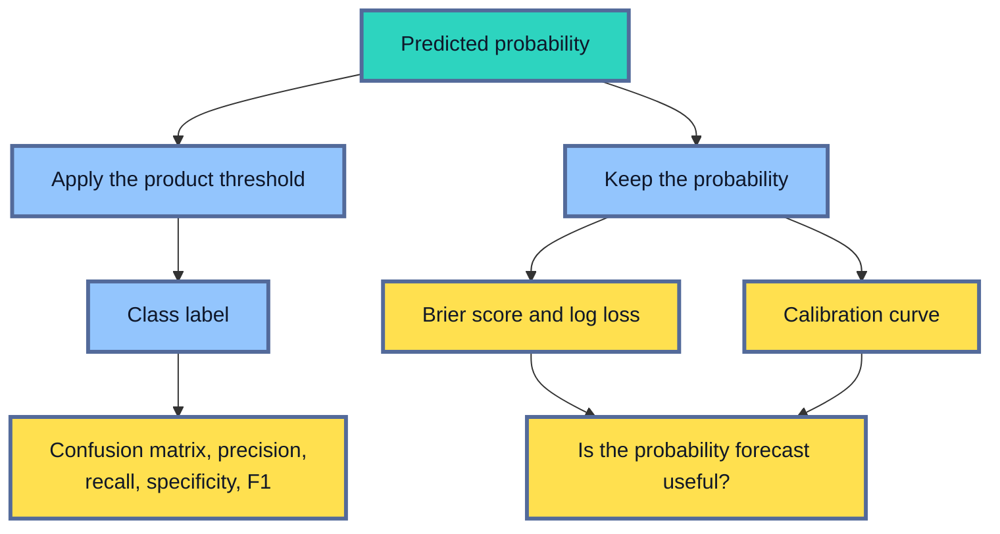
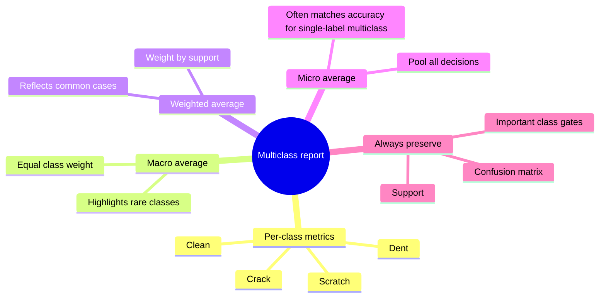
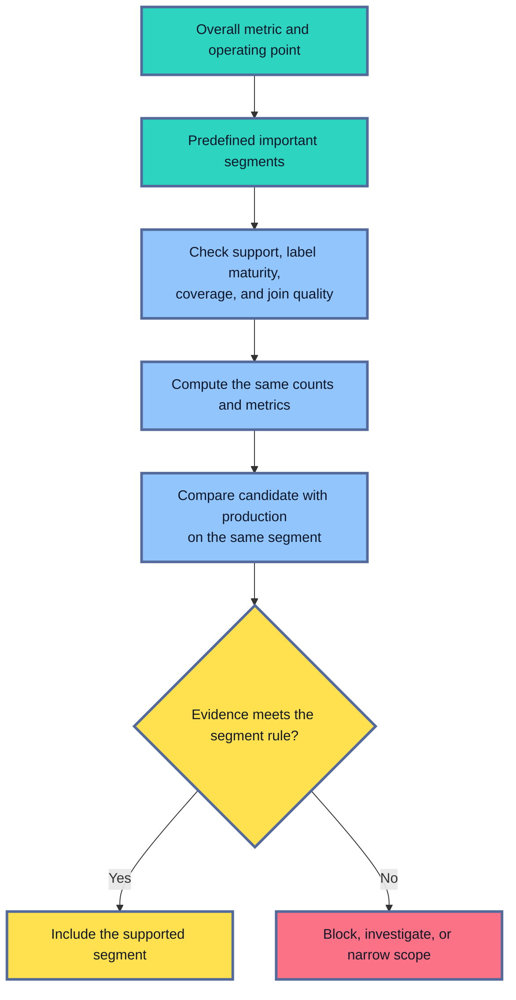

## Table of Contents

1. [Classification Metrics Measure More Than Correct Labels](#classification-metrics-measure-more-than-correct-labels)
2. [Accuracy Can Hide the Error That Matters](#accuracy-can-hide-the-error-that-matters)
3. [The Confusion Matrix Turns Predictions Into Consequences](#the-confusion-matrix-turns-predictions-into-consequences)
4. [Precision, Recall, Specificity, and F1 Answer Different Questions](#precision-recall-specificity-and-f1-answer-different-questions)
5. [The Threshold Decides What the Product Does](#the-threshold-decides-what-the-product-does)
6. [Probability Quality Is a Different Layer of Evaluation](#probability-quality-is-a-different-layer-of-evaluation)
7. [Multiclass Averages Need an Explicit Meaning](#multiclass-averages-need-an-explicit-meaning)
8. [Segment Evaluation Finds Failures Hidden by the Average](#segment-evaluation-finds-failures-hidden-by-the-average)
9. [Build a Repeatable Classification Report](#build-a-repeatable-classification-report)
10. [The Main Idea](#the-main-idea)
11. [References](#references)

## Classification Metrics Measure More Than Correct Labels
<!-- section-summary: Classification evaluation follows the prediction from a score to a class decision, then measures mistakes, probability quality, and effects on important populations. -->

A **classification model** predicts a category. An email filter may choose `spam` or `safe`. A quality-control system may choose `defect` or `pass`. A message-routing model may choose `urgent`, `standard`, or `low_priority`.

At first, evaluation seems like a simple counting exercise: compare the predicted category with the known category and calculate the percentage that match. That percentage is accuracy. It answers a real question, but it answers only one question.

Production teams usually need a richer explanation. They need to know which class the model missed, how many unnecessary actions it created, whether an uncommon class received poor treatment, and what changed after the decision threshold moved. If the output is used as a probability, they also need to know whether a score such as `0.8` carries trustworthy meaning.

You can think of classification evaluation as three connected layers:

- **Score quality:** Does the model place positive cases above negative cases? ROC AUC and average precision examine this layer across many possible thresholds.
- **Decision quality:** After a threshold turns scores into labels, which cases become true positives, false positives, false negatives, and true negatives? Accuracy, precision, recall, specificity, and F1 examine this layer.
- **Probability quality:** If the score claims to be a probability, do confident predictions deserve that confidence? Log loss, Brier score, and calibration curves examine this layer.

These layers feed a product decision. A fraud score may decide which payments enter review. A defect score may decide which parts leave the production line. An urgency score may decide which messages reach an on-call queue. The useful metric follows the consequence of that action.



The positive class deserves an explicit definition before any calculation. In defect detection, `positive` might mean a part that must be removed. In urgent-message triage, it might mean a message that needs a response within fifteen minutes. The words *positive* and *negative* describe the class chosen for measurement; they do not mean good and bad.

The evaluation population matters just as much. A recall score from last month's completed reviews may say little about new regions, new devices, or cases whose labels have not matured. A trustworthy metric report states the label definition, evaluation population, time window, and decision rule beside every result.

## Accuracy Can Hide the Error That Matters
<!-- section-summary: Accuracy counts every correct label equally, so a common class can dominate the result while the model fails on the rare class that drives the product decision. -->

**Accuracy** is the share of examples whose predicted label matches the known label. It gives every evaluated example the same influence on the final percentage.

`accuracy = correct predictions / all predictions`

It is easy to explain and useful for tasks where classes occur at similar rates and mistakes carry similar costs. Handwritten-digit recognition on a balanced evaluation set is one possible case. Predicting the wrong digit still needs inspection, but no single digit automatically owns almost the whole score.

Now consider 10,000 incoming messages. Only 100 are genuinely urgent. A model that labels every message as `standard` gets 9,900 predictions correct.



The model has 99 percent accuracy and zero ability to find urgent work. The common class overwhelms the headline number. This pattern is called **class imbalance**: one class appears far more often than another in the evaluation population.

Class imbalance is part of the explanation, but frequency alone does not choose the metric. The cost of each mistake matters. Missing an urgent message may delay incident response. Flagging a standard message may consume a few minutes of human review. Those consequences point toward high recall for the urgent class, with precision and queue volume protecting the reviewers.

Accuracy can also hide a trade-off after the model improves. Suppose a second model catches 90 of the 100 urgent messages and incorrectly flags 400 standard messages. It makes 410 mistakes, so its accuracy is 95.9 percent. The all-standard model still has higher accuracy. Yet the second model may create a far better service if the team can review 490 alerts and urgent misses carry serious cost.

**Balanced accuracy** gives each class more influence. For binary classification, it averages recall for the positive class and recall for the negative class, which is also called specificity. It helps reveal a model that succeeds mainly through the majority class.

Balanced accuracy still remains a statistical summary. It does not know that a missed urgent message costs more than an unnecessary review. The report should preserve the actual error counts, class-specific rates, and operational workload beside any average.

## The Confusion Matrix Turns Predictions Into Consequences
<!-- section-summary: A confusion matrix records the four possible outcomes of a binary decision and provides the counts used by most threshold-based classification metrics. -->

A **confusion matrix** compares the known class with the class chosen by the model. For a binary decision, every evaluated example falls into one of four cells.

The word *true* means the prediction agrees with the known label. The word *false* means it disagrees. *Positive* and *negative* name the two sides of the decision. Combining those words produces the four outcomes: true positive, false positive, false negative, and true negative.

The matrix makes two perspectives visible at once. Looking across actual positive cases reveals which ones were found or missed. Looking across positive predictions reveals which actions were useful or unnecessary. The diagram below follows one evaluated case through those two questions and ends at its matrix cell.



Suppose a camera system checks 1,000 manufactured parts. A confirmed defect is the positive class. At the chosen threshold, the system produces these counts:

| Actual class | Predicted pass | Predicted defect |
|---|---:|---:|
| Pass | 855 true negatives | 45 false positives |
| Defect | 25 false negatives | 75 true positives |

Read the matrix in operational language:

- **75 true positives:** defective parts were removed.
- **25 false negatives:** defective parts continued down the line.
- **45 false positives:** acceptable parts were stopped for inspection.
- **855 true negatives:** acceptable parts continued without interruption.

The raw counts reveal scale. A recall of 75 percent might sound acceptable until the reader learns that the remaining 25 defects enter a safety-critical assembly each hour. A precision of 62.5 percent might sound weak until the reader learns that the inspection station can cheaply clear the 45 false alarms.

The same metric can describe different consequences in another product. A false positive in spam filtering moves a safe email to a review folder. A false positive in payment risk may delay a legitimate customer. A false negative in defect detection releases a faulty part. Metric names stay constant while their costs change.

Pay close attention to matrix orientation. Scikit-learn's `confusion_matrix(y_true, y_pred, labels=[0, 1])` places true labels on rows and predicted labels on columns. Other tools may display the axes differently. A production report should label both axes, show the class names, and keep the class order explicit. Silent axis reversal can turn a false-negative count into a false-positive count during review.

## Precision, Recall, Specificity, and F1 Answer Different Questions
<!-- section-summary: Precision, recall, specificity, and F1 summarize different relationships among the same four counts, so the product consequence should choose which one leads. -->

The confusion matrix gives the facts. Metrics turn selected parts of those facts into rates that can be compared across evaluation sets.

### Precision asks whether positive predictions deserve action

**Precision** starts from everything the model predicted as positive. It asks: *Of the cases that received the action, how many truly needed it?*

`precision = TP / (TP + FP)`

For the defect system, precision is `75 / (75 + 45) = 0.625`. About 62.5 percent of stopped parts are defective. The remaining 37.5 percent create unnecessary inspection work.

Precision matters if false alarms are expensive. A manual review team has limited capacity. A customer may be harmed by an unnecessary block. An alert stream may lose trust if most alerts lead nowhere.

### Recall asks how much of the positive class was found

**Recall**, also called **sensitivity** or the **true positive rate**, starts from every truly positive case. It asks: *Of all cases that needed action, how many did the model find?*

`recall = TP / (TP + FN)`

The defect system has recall `75 / (75 + 25) = 0.75`. It catches 75 percent of the defects and misses 25 percent.

Recall deserves priority if missing a positive case carries serious cost. Urgent-message routing, disease screening, fraud detection, and safety inspection often fit this pattern. High recall usually creates more positive predictions, so the team watches precision and workload beside it.

### Specificity protects the negative class

**Specificity**, also called the **true negative rate**, starts from every truly negative case. It asks: *Of all cases that should remain untouched, how many did the model leave alone?*

`specificity = TN / (TN + FP)`

The defect system has specificity `855 / (855 + 45) = 0.95`. It lets 95 percent of acceptable parts continue normally.

Specificity deserves attention in products where the negative class represents a large population that should avoid interruption. Screening systems often report sensitivity and specificity together because one protects detection and the other protects people from unnecessary follow-up.

### F1 compresses precision and recall

**F1** is the harmonic mean of precision and recall.

`F1 = 2 × precision × recall / (precision + recall)`

For the example, F1 is about `0.682`. The harmonic mean drops sharply if either precision or recall is weak, so F1 is useful for comparing systems that need a balance between finding positives and limiting false alarms.

F1 leaves true negatives out of its calculation. It also gives precision and recall equal importance. Those choices may fit a search for one balanced summary, but they may conflict with the product. An urgent triage service may care far more about recall. A costly automatic block may place more weight on precision. `F_beta` makes that weighting explicit: values of `beta` above one emphasize recall, while values below one emphasize precision.



No summary should erase support, which is the number of true examples for a class. A recall of 80 percent based on ten positive examples has a different evidence strength from the same rate based on ten thousand. Counts and uncertainty remain part of the release decision.

## The Threshold Decides What the Product Does
<!-- section-summary: A decision threshold converts scores into labels, changing precision, recall, false alarms, misses, and workload without changing the underlying model. -->

Many binary classifiers produce a score or probability before they produce a class label. The **decision threshold** is the cutoff that turns that continuous output into an action.

Suppose an urgent-message model assigns scores from zero to one. A threshold of `0.70` sends only high-scoring messages to the urgent queue. A threshold of `0.30` sends many more messages. The model weights stay the same; the workflow changes.



Scikit-learn classifiers commonly use `0.5` for probabilities or `0` for decision scores in their default binary class prediction. Those defaults have no automatic connection to staffing, safety, customer friction, or financial loss. The product needs an operating point that matches its actual decision.

Consider an alert service with capacity for 800 reviews per day:

| Threshold | Recall | Precision | Alerts per day |
|---:|---:|---:|---:|
| 0.30 | 0.94 | 0.22 | 1,260 |
| 0.45 | 0.88 | 0.31 | 790 |
| 0.60 | 0.76 | 0.46 | 510 |
| 0.75 | 0.58 | 0.64 | 300 |

Threshold `0.30` finds most positive cases and exceeds capacity. Threshold `0.75` creates a clean queue and misses many positives. Threshold `0.45` fits the stated capacity and may become a candidate operating point if its false-negative cost is acceptable.

Threshold selection belongs on validation data. Repeatedly adjusting the cutoff against the final holdout leaks information from the release test into the design. The team can tune the threshold through a versioned rule or a tool such as `TunedThresholdClassifierCV`, then lock it before final evaluation.

Score-based metrics answer a related question before the threshold is fixed. **ROC AUC** measures how often positive cases tend to rank above negative cases across thresholds. **Average precision (AP)** summarizes the precision-recall curve and is often informative for rare positives. Random scores have AP near the positive-class prevalence, so the baseline stays visible.

ROC AUC or AP can show that a candidate orders cases better overall. Neither metric says how many alerts the selected threshold produces. The release report needs the curve summary and the actual operating-point counts.

## Probability Quality Is a Different Layer of Evaluation
<!-- section-summary: Log loss, Brier score, and calibration curves evaluate probability estimates, while confusion-matrix metrics evaluate the labels created by a threshold. -->

A class decision and a probability answer different questions about the same case. The decision says which action to take. The probability describes how uncertain the outcome is.

The label `urgent` answers, “Should this message enter the urgent queue under the current policy?” The probability `0.80` makes a stronger claim: “Messages with similar evidence should be urgent about 80 percent of the time.”

Two models can create identical labels at a threshold of `0.50` and receive identical precision and recall. One may assign positive cases probabilities near `0.55`, while another assigns probabilities near `0.99`. Thresholded metrics treat both as positive. Probability metrics see the difference in confidence.



**Brier score loss** is the mean squared difference between the predicted probability and the binary outcome. A prediction of `0.90` followed by a positive outcome has a small error. The same prediction followed by a negative outcome has a large error. Lower Brier loss is better.

**Log loss**, also called cross-entropy loss, uses the logarithm of the probability assigned to the true class. It penalizes confident wrong predictions heavily. Predicting `0.99` for a positive event that fails is far worse than predicting `0.60` for the same failure. Lower log loss is better.

Both are **proper scoring rules**. In expectation, the model receives the best score by reporting honest probabilities. They measure the probability forecast as a whole, including discrimination and calibration. A lower Brier score by itself is therefore weak proof of better calibration.

A **calibration curve**, or reliability diagram, examines calibration more directly. It groups similar predicted probabilities and compares each group's average prediction with its observed positive rate. If 1,000 cases receive scores near `0.80` and only 600 become positive, the model is overconfident in that region.

Probability quality matters if the number is shown to a person, used to price risk, divided into risk bands, or combined with changing decision costs. If the score is used only to order cases and the threshold is continually set by queue capacity, ranking and operating-point quality may matter more. The report should state how the product consumes the output.

## Multiclass Averages Need an Explicit Meaning
<!-- section-summary: Multiclass precision, recall, and F1 are calculated per class and then combined, so macro, weighted, and micro averages can tell different stories. -->

A binary problem has two classes. A **multiclass** problem chooses one class from three or more options, such as `scratch`, `dent`, `crack`, and `clean`. Precision, recall, and F1 still apply, but each class takes a turn as the positive class while the remaining classes form the comparison group.

This produces one metric value per class. A report may then combine those values:

- **Macro average** gives every class equal weight. The recall of a rare crack class counts as much as the recall of the common clean class. Macro scores help keep infrequent but important classes visible.
- **Weighted average** weights each class by its support. Common classes contribute more. This summarizes the experience of a typical row in the evaluation set, although strong majority-class performance can hide a weak rare class.
- **Micro average** pools the true-positive, false-positive, and false-negative counts before calculating the metric. Each sample-class decision contributes to the same total. For ordinary single-label multiclass classification across every class, micro precision, recall, and F1 match accuracy.



Imagine 10,000 inspected parts: 8,500 are clean, 1,000 have scratches, 450 have dents, and 50 have cracks. A model can perform extremely well on clean parts and scratches while missing most cracks. Its weighted F1 may remain high because the crack class has little support. Macro F1 will fall more sharply because cracks receive equal class weight.

Neither average decides whether crack detection is acceptable. If a missed crack creates a safety risk, the report needs a separate recall gate for that class. The macro average provides a useful warning; the class-level metric carries the release condition.

**Multilabel** classification is different. One example may have several labels at once, such as an image containing both `helmet_missing` and `restricted_area`. Micro averaging is common because it pools label decisions. A samples average can also summarize quality per example. The report should identify whether the task is multiclass or multilabel because the same word *accuracy* can describe different calculations.

## Segment Evaluation Finds Failures Hidden by the Average
<!-- section-summary: Segment evaluation repeats the chosen metrics across meaningful populations so strong overall performance cannot conceal a weak device, language, region, or workflow route. -->

Classes describe what the model predicts. **Segments** describe populations or operating conditions inside the evaluation set. A fraud classifier may predict `fraud` and `legitimate`, while its segments include payment type, device, region, customer tenure, and transaction-value band.

Suppose a fraud model has 87 percent recall overall. The same report shows 91 percent recall on desktop traffic and 61 percent on mobile web. The aggregate score is mathematically correct. It is also incomplete for a rollout that includes mobile web.

Segment evaluation follows a disciplined path:



Support and label quality belong beside every segment metric. A recall of 50 percent based on two positive examples is unstable. A segment with thousands of scored cases and almost no mature labels has a measurement gap. It should not silently inherit the overall result.

Choose segments from the intended use, known harms, product boundaries, incident history, and domain knowledge. For urgent-message triage, language and intake channel may matter. For defect detection, camera station, supplier, material, and lighting regime may matter. For fraud, device, payment rail, geography, and value band may matter.

Searching hundreds of arbitrary segments after seeing the result creates false discoveries and confusing release debates. Predefine the important segments and their rules. Exploratory slicing can still find hypotheses, but a newly discovered weakness needs confirmation on fresh or appropriately held-out evidence.

The comparison should include the production baseline. A candidate with 72 percent recall on a segment may still be an improvement over production at 45 percent. It may also remain below the minimum needed for safe use. Show both the replacement effect and the absolute floor.

## Build a Repeatable Classification Report
<!-- section-summary: A production evaluation job pins the dataset, positive class, threshold, metric definitions, segments, and model identity, then saves machine-readable evidence for release review. -->

A useful report lets another engineer reproduce the same result. The job should pin the candidate identity, evaluation dataset, label policy, positive class, threshold, and library environment. It should produce machine-readable metrics as well as plots for human review.

Scikit-learn provides the standard metric functions needed for a focused report. The example below expects a scored evaluation frame with a mature binary label in `is_positive` and a predicted probability in `score`. It applies one declared threshold, calculates decision and probability metrics, and prints a JSON-ready dictionary. The visible output contains the raw matrix, per-class report, threshold, average precision, ROC AUC, Brier loss, and log loss.

```python
from sklearn import metrics

threshold = 0.45
y_true = eval_df["is_positive"].to_numpy()
y_score = eval_df["score"].to_numpy()
y_pred = (y_score >= threshold).astype("int8")

report = {
    "threshold": threshold,
    "confusion_matrix": metrics.confusion_matrix(
        y_true, y_pred, labels=[0, 1]
    ).tolist(),
    "by_class": metrics.classification_report(
        y_true,
        y_pred,
        labels=[0, 1],
        target_names=["negative", "positive"],
        output_dict=True,
        zero_division=0,
    ),
    "average_precision": metrics.average_precision_score(y_true, y_score),
    "roc_auc": metrics.roc_auc_score(y_true, y_score),
    "brier_loss": metrics.brier_score_loss(y_true, y_score),
    "log_loss": metrics.log_loss(y_true, y_score),
}
print(report)
```

The explicit `labels=[0, 1]` and `target_names` keep the class meaning stable. `y_pred` is derived once from the declared threshold, so the confusion matrix and class report describe the same decision. `y_score` remains available for ranking and probability checks.

This compact calculation belongs inside a wider evaluation contract. In practice, the job should also:

- validate required columns, score range, duplicate identifiers, label maturity, and join coverage;
- compare the candidate with the current production path on the same rows;
- compute the threshold table on validation data and evaluate the locked threshold on the holdout;
- repeat the class metrics for predefined segments and include support counts;
- save curves, failed examples, environment details, and the metric configuration;
- fail the release job if required evidence is missing or a declared gate fails.

An experiment tracker such as MLflow can store the metrics and artifacts beside the model identity. The calculation should stay understandable outside the tracker. A release reviewer needs to see which data, threshold, class mapping, segment rules, and metric implementation produced the result.

Test the evaluation code with small fixtures whose confusion-matrix counts are known. Include a case with no predicted positives to verify the chosen `zero_division` policy. Add a failed segment below its recall floor and confirm that the pipeline blocks. These tests protect the meaning of the report, not just its syntax.

## The Main Idea
<!-- section-summary: Classification metrics are a connected explanation of scores, decisions, errors, probabilities, classes, and segments, all anchored to the product action. -->

Classification quality cannot be reduced to one universal score. Accuracy summarizes all correct labels. The confusion matrix reveals the four outcomes behind that total. Precision, recall, specificity, F1, and balanced accuracy emphasize different parts of those counts.

The threshold turns model scores into product actions, so it changes both the metrics and the workload. ROC AUC and average precision describe score ordering across thresholds. Log loss, Brier score, and calibration curves examine probability quality. Macro, weighted, and micro averages combine multiclass results in different ways, while segment reports show whether important populations share the overall result.

A production report anchors every metric to the decision and its error costs. It preserves raw counts, declares the positive class and threshold, separates decision quality from probability quality, compares against production, and carries class and segment evidence into the release gate.

## References

- [scikit-learn: Metrics and scoring](https://scikit-learn.org/stable/modules/model_evaluation.html) - Official definitions for confusion matrices, accuracy, balanced accuracy, precision, recall, F-measures, average precision, ROC AUC, log loss, Brier score, and multiclass averaging.
- [scikit-learn: Tuning the decision threshold](https://scikit-learn.org/stable/modules/classification_threshold.html) - Official guide to separating probability prediction from product decisions and tuning a threshold after model fitting.
- [scikit-learn: Probability calibration](https://scikit-learn.org/stable/modules/calibration.html) - Official guidance for calibration curves, probabilistic classifiers, Brier score, log loss, and calibration methods.
- [scikit-learn: classification_report](https://scikit-learn.org/stable/modules/generated/sklearn.metrics.classification_report.html) - Official API reference for per-class precision, recall, F1, support, and macro, weighted, micro, and samples averages.
- [scikit-learn: confusion_matrix](https://scikit-learn.org/stable/modules/generated/sklearn.metrics.confusion_matrix.html) - Official API reference for matrix orientation and label ordering.
