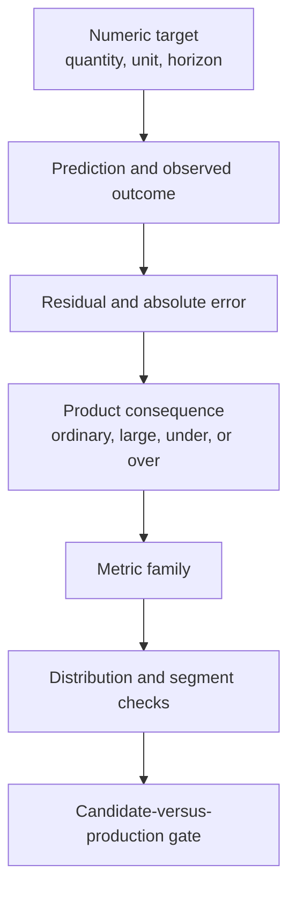
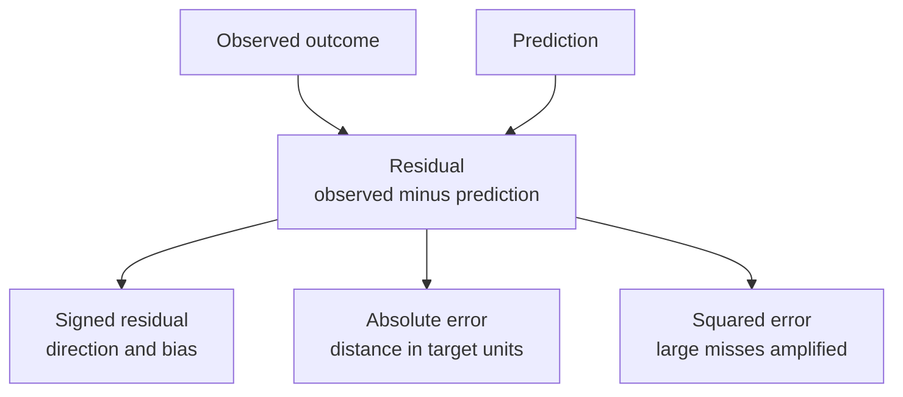
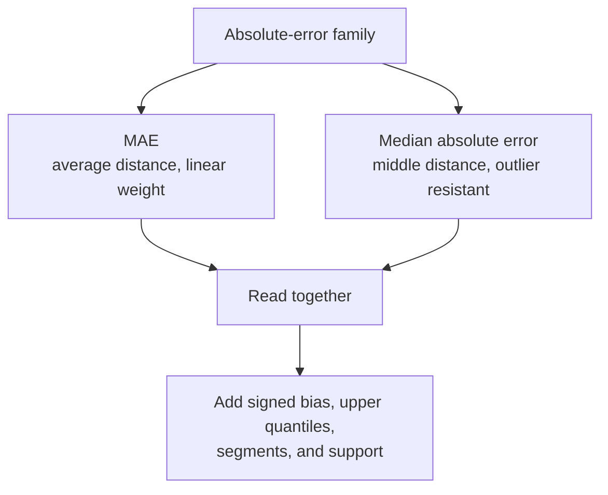
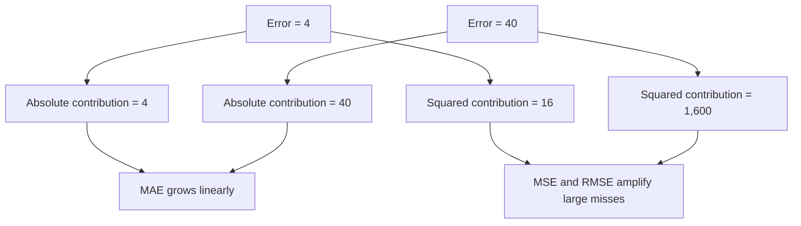
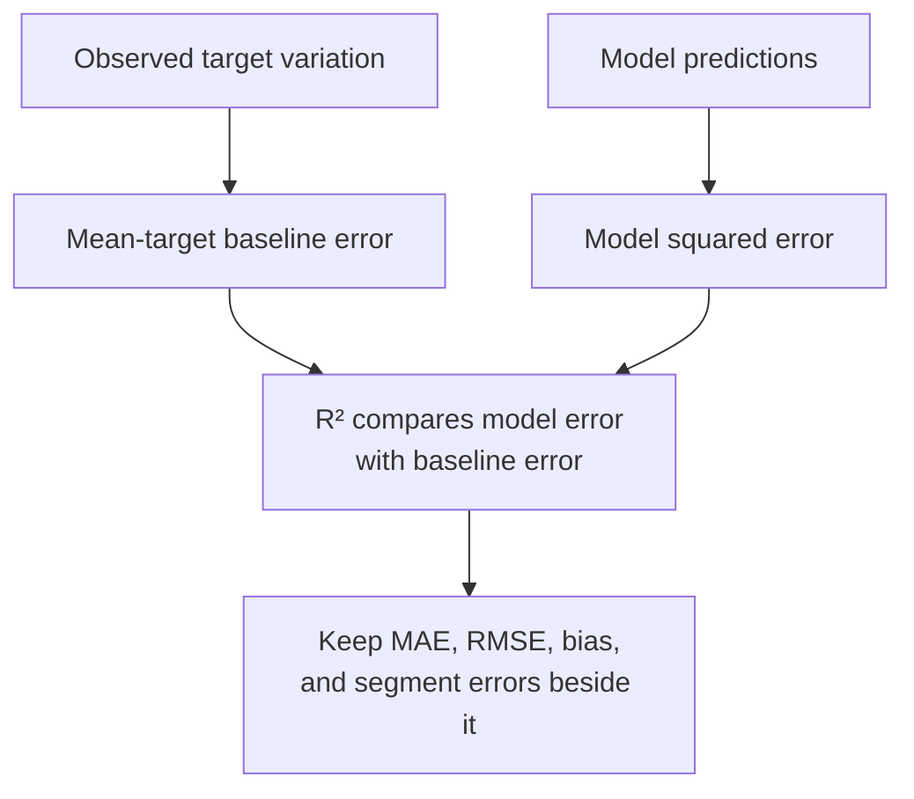
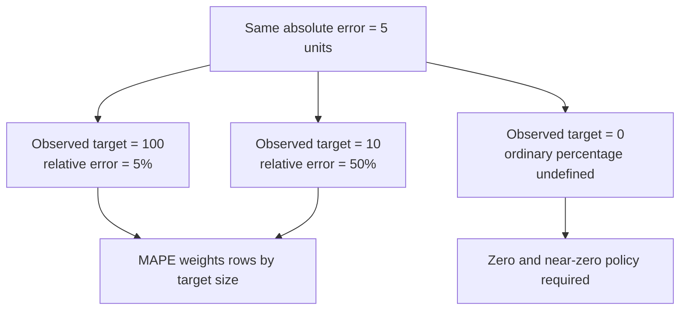
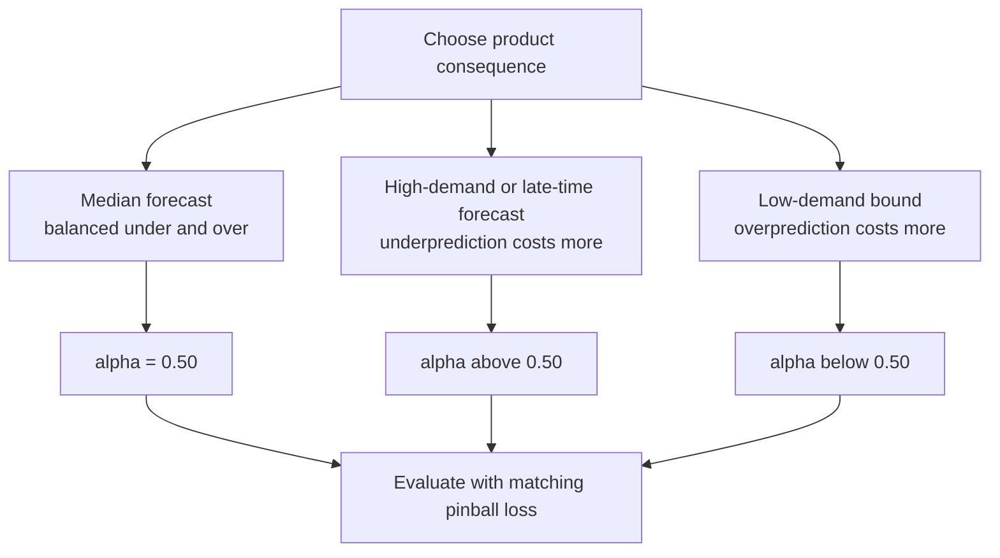
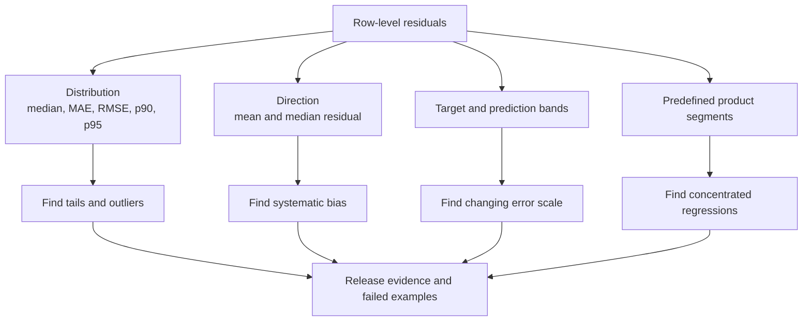

## Table of Contents

1. [Regression Predicts a Number](#regression-predicts-a-number)
2. [A Residual Shows How Far And In Which Direction A Prediction Missed](#a-residual-shows-how-far-and-in-which-direction-a-prediction-missed)
3. [Use MAE And Median Absolute Error To Describe Typical Misses](#use-mae-and-median-absolute-error-to-describe-typical-misses)
4. [MSE And RMSE Penalize Large Errors More Heavily](#mse-and-rmse-penalize-large-errors-more-heavily)
5. [R-Squared and Explained Variance Need Context](#r-squared-and-explained-variance-need-context)
6. [Percentage Error Can Distort Small Targets](#percentage-error-can-distort-small-targets)
7. [Use Quantile Loss When Underprediction And Overprediction Have Different Costs](#use-quantile-loss-when-underprediction-and-overprediction-have-different-costs)
8. [Check Error Distributions And Segments For Concentrated Harm](#check-error-distributions-and-segments-for-concentrated-harm)
9. [Set Release Limits That Match The Cost Of Regression Errors](#set-release-limits-that-match-the-cost-of-regression-errors)
10. [The Main Idea](#the-main-idea)
11. [References](#references)

## Regression Predicts a Number
<!-- section-summary: Regression models predict numeric quantities, and evaluation connects the distance between each prediction and outcome to the consequence experienced by the product. -->

A **regression model** predicts a number. The output might be delivery time in minutes, electricity demand in megawatts, a house price in pounds, or the number of units a warehouse will need tomorrow.

The prediction and the observed outcome live on a numeric scale. A forecast of 42 minutes can miss an actual delivery time of 45 minutes by three minutes. A demand forecast of 42 units can miss the actual demand of 45 units by three units. The arithmetic looks the same, yet the operational consequences differ.

At a high level, **regression evaluation measures the distance between predictions and observed outcomes, then decides how different distances should count**. The first decision is the target and its unit. The second is the direction and cost of error. The third is the aggregation rule that combines thousands of individual misses into release evidence.

You can think of the metric choice through five questions:

1. **Target:** Which numeric quantity and prediction horizon does the product consume?
2. **Unit:** Should reviewers read the error in minutes, pounds, megawatts, units, or a relative scale?
3. **Consequence:** Do ordinary misses, rare large misses, underprediction, or overprediction create the main cost?
4. **Aggregation:** Should every row contribute linearly, should large errors receive extra weight, or should the median describe a typical row?
5. **Evidence:** Which residual plots, target ranges, segments, baselines, and uncertainty checks limit the release claim?



Units come before formulas. A model trained on standardized targets may report a small training loss that has no product meaning. The release evaluation should transform predictions back to the product scale. A log-price model should be inverse-transformed before reviewers read errors in currency. A multi-horizon demand model should report each horizon because an error tomorrow and an error twelve weeks ahead support different decisions.

The label policy also needs a precise meaning. Delivery time might start at checkout, dispatch, or pickup. Energy demand might mean gross load or load after local generation. Two teams can calculate identical MAE code over targets that describe different events. A trustworthy report pins the target definition and unit beside every result. It also records the horizon and eligible population. Label maturity and any target transformation complete the comparison contract.

## A Residual Shows How Far And In Which Direction A Prediction Missed
<!-- section-summary: A residual records the signed gap between an observed value and its prediction, while absolute and squared errors transform that gap for different metric families. -->

Every aggregate regression metric starts from row-level error. The most informative first object is the **residual**. It preserves the gap for one prediction before an average hides its direction or size.

### Choose And Record One Residual Sign Convention

The calculations below use one explicit convention:

`residual = observed outcome - prediction`

A positive residual means the model predicted too low. A negative residual means it predicted too high. Some tools use the opposite sign, so the report should state the convention.

Suppose an order arrives in 50 minutes after a prediction of 42 minutes. Its residual is `50 - 42 = +8 minutes`. The positive sign says the model underestimated the time. A second order arrives in 34 minutes after the same 42-minute prediction. Its residual is `34 - 42 = -8 minutes`, which says the model overestimated.

Both rows have an **absolute error** of eight minutes:

`absolute error = |observed outcome - prediction|`

Absolute error removes direction and preserves distance. **Squared error** also removes direction, then squares the distance:

`squared error = (observed outcome - prediction)²`

The two eight-minute misses each have squared error `64 minutes²`. Squaring makes a 40-minute miss contribute 25 times as much as an eight-minute miss because `40² / 8² = 25`.



Signed residuals reveal systematic bias. If the average residual is `+4 megawatts`, the energy forecast usually runs four megawatts below observed load. Positive and negative residuals can cancel, so a mean residual near zero never proves that the predictions are close. A model that alternates between `+50` and `-50` has zero mean residual and severe error.

The raw residual distribution should remain in the report. Useful summaries include the mean and median signed residual, median absolute error, MAE, upper quantiles of absolute error, and the largest reviewed errors. A histogram or empirical distribution shows whether the aggregate comes from many moderate misses or a small heavy tail.

### Investigate extreme residuals

Individual residuals also expose data problems. A 20,000-minute delivery error may represent a real operational failure, a timestamp bug, or a cancelled order that violates the label policy. The team should investigate the row before excluding it. Removing genuine hard cases narrows the evaluation population and overstates expected production quality.

## Use MAE And Median Absolute Error To Describe Typical Misses
<!-- section-summary: MAE averages absolute errors in product units, while median absolute error describes the middle miss and resists the influence of a small number of extreme values. -->

**Mean absolute error (MAE)** adds the absolute errors and divides by the number of examples. It answers how far a prediction misses on average in the same unit as the target.

`MAE = mean(|observed - predicted|)`

If a delivery model has MAE of six minutes, its absolute miss is six minutes on average over the evaluation rows. The metric keeps the target unit, which makes it easy to connect to product tolerance.

MAE gives each extra unit of error the same incremental weight. A miss growing from two to three minutes adds one unit of loss. A miss growing from forty to forty-one minutes also adds one unit. This linear treatment fits products where cost grows roughly with distance.

**Median absolute error (MedAE)** sorts the absolute errors and takes the middle value.

`MedAE = median(|observed - predicted|)`

MedAE describes the typical middle case and is robust to outliers. Consider five absolute errors: `2, 3, 3, 4, 38`. The median absolute error is three. MAE is ten because the 38-unit miss still contributes to the average.



The difference between MAE and MedAE is evidence. Similar values suggest a relatively compact distribution. A much larger MAE suggests that large errors pull the average upward. The team then inspects p90 or p95 absolute error, a histogram, and the responsible examples.

Median absolute error should not be confused with median signed residual. The first describes the middle distance from the outcome. The second describes the middle direction of error. A model can have median residual near zero and large median absolute error.

MAE also connects to the statistical target. Minimizing expected absolute error estimates the conditional median of the outcome. That is sensible for a central delivery estimate or a typical property price. A product that needs the expected demand for total inventory may prefer a mean-targeting loss such as squared error.

Neither MAE nor MedAE should stand alone as a release gate. MAE can hide a dangerous tail. MedAE can remain excellent while a substantial minority receives severe errors. The primary metric should travel with bias, tail, coverage, and segment guardrails.

## MSE And RMSE Penalize Large Errors More Heavily
<!-- section-summary: MSE squares every residual and RMSE returns the square root to the target unit, so both react strongly to large errors. -->

**Mean squared error (MSE)** averages squared residuals. Squaring changes the influence of every row, so the metric gives large misses far more weight than small misses.

`MSE = mean((observed - predicted)²)`

Squaring increases the influence of large errors. For the five absolute errors `2, 3, 3, 4, 38`, MSE is `296.4`. Its unit is squared, such as minutes squared, which is hard to explain to a product owner.

**Root mean squared error (RMSE)** takes the square root of MSE.

`RMSE = √MSE`

The same example has RMSE about `17.2`, back in the original unit. RMSE remains much larger than MAE of ten because the 38-unit miss receives extra weight.



RMSE deserves attention in systems where one very large miss creates disproportionate cost. Underestimating a peak electricity load can trigger expensive emergency purchases. A severe arrival-time error may cause a customer to miss a connection. A large demand miss can create a stockout across an entire region.

Outlier sensitivity carries a trade-off. A data-entry error can dominate RMSE and produce a false model comparison. A genuine rare event can dominate RMSE and reveal exactly the risk the product needs to control. The evaluation pipeline should validate data integrity, retain a traceable exclusion policy, and publish metrics before and after any approved correction.

Squared error targets the conditional mean. This makes MSE or RMSE aligned with forecasts used for expected totals. MAE targets the conditional median. On a skewed demand distribution, the mean can sit above the median. Two models may therefore optimize different numeric quantities even though both produce one number.

The report should explain that target choice. Selecting RMSE solely because it punishes outliers can distort a product that cares linearly about every unit. Selecting MAE solely because its unit is familiar can understate catastrophic tails. Product cost determines the loss shape.

## R-Squared and Explained Variance Need Context
<!-- section-summary: R-squared and explained variance compare error with target variation, producing scale-free scores that still need unit-based errors, baselines, and bias checks. -->

**R-squared (R²)** compares the model's squared error with a constant baseline that predicts the mean observed target on the evaluation set.

`R² = 1 - model squared error / mean-baseline squared error`

An R² of `1.0` represents perfect predictions. A score of `0.0` matches the mean baseline. A negative score is possible and means the model performs worse than that baseline on the evaluated data.



R² has no target unit. That makes it convenient for a statistical comparison and weak for explaining product impact. An R² of `0.90` cannot tell a dispatcher whether the average ETA miss is three minutes or thirty minutes.

The score also depends on target variation. A model may receive high R² on a nationwide price dataset with a wide price range and lower R² within one narrow neighborhood, even with similar currency error. Compare candidate and production on the same rows and preserve MAE or RMSE in the product unit.

Constant targets need special care. R² is mathematically non-finite if every observed target is the same. Scikit-learn uses `force_finite=True` by default and replaces those cases with `1.0` for perfect predictions or `0.0` otherwise. A segment containing one constant target can therefore produce a convenient score that hides the underlying edge case. Report support, target variance, and unit-based error for each segment.

**Explained variance** compares the variance of residuals with the variance of the target. Its best value is `1.0`. It ignores systematic offsets in the predictions. A model that adds ten units to every prediction can preserve explained variance while creating a serious bias.

Scikit-learn notes that R² and explained variance are identical if residuals have zero mean. R² usually provides the stronger default because it accounts for systematic offset. Mean residual remains visible because neither scale-free summary replaces a bias check.

## Percentage Error Can Distort Small Targets
<!-- section-summary: MAPE scales each absolute error by the observed value, which helps compare target sizes and creates unstable or misleading results near zero. -->

**Mean absolute percentage error (MAPE)** divides each absolute error by the magnitude of its observed target, then averages the ratios.

`MAPE = mean(|observed - predicted| / |observed|)`

A five-unit error against an observed value of 100 contributes five percent. The same five-unit error against an observed value of ten contributes fifty percent. This relative scale can help compare demand across large and small stores.

The denominator creates the main problem. An observed value of zero makes the ordinary ratio undefined. A value close to zero creates an enormous contribution. Scikit-learn divides by a very small positive number and returns a large finite value in the zero case. One zero-demand row can dominate the report.



The library returns a relative value. A result of `0.18` represents 18 percent, so reports that display a percent multiply it by 100. Failing to record this convention can create a hundredfold reporting error.

MAPE also shifts influence toward low-target rows. A store selling one item and missing by one receives 100 percent error. A store selling one thousand items and missing by one hundred receives ten percent. That weighting may fit equal store-level service. It may conflict with inventory cost, where the second miss loses far more units.

Negative targets make percentage meaning harder to defend. Price changes, profit, and energy export can cross zero. The absolute denominator keeps the calculation finite away from zero, yet “percentage error” may no longer match the product's interpretation.

Teams can use unit-based MAE by target band, scale errors by a meaningful capacity or business baseline, or calculate an aggregate ratio such as total absolute error divided by total actual volume for non-negative targets. Every alternative changes the weighting. The report should state the denominator, zero policy, aggregation level, and segments.

## Use Quantile Loss When Underprediction And Overprediction Have Different Costs
<!-- section-summary: Pinball loss evaluates a chosen conditional quantile and assigns different penalties to underprediction and overprediction. -->

Many products experience underprediction and overprediction differently. Underforecasting demand can cause a stockout. Overforecasting can create holding cost and waste. An ETA that is too optimistic frustrates a waiting customer, while a slightly conservative ETA may be acceptable.

A single symmetric point metric gives equal loss to equal-sized misses in both directions. **Quantile regression** targets a chosen percentile of the outcome distribution. **Pinball loss**, also called quantile loss, evaluates that target with asymmetric weights.

For residual `e = observed - predicted`:

- underprediction has `e > 0` and receives loss `alpha × e`;
- overprediction has `e < 0` and receives loss `(1 - alpha) × |e|`.

At `alpha = 0.90`, an equal-sized underprediction receives nine times the loss of an overprediction. The metric is minimized by a model that estimates the conditional 90th percentile.



`alpha = 0.50` treats both directions equally and targets the conditional median, the same central target associated with absolute-error optimization. A 90th-percentile model needs `mean_pinball_loss(..., alpha=0.90)`. Evaluating it with ordinary MAE asks whether it predicts the median well, which is a different question.

Quantiles can also form an interval. A 10th- and 90th-percentile pair describes a central 80 percent range. Coverage and interval width then need evaluation across the full population and important segments. A very wide interval can achieve high coverage and offer little operational value.

The chosen quantile should trace to a product decision. A warehouse may stock to a high demand quantile because the cost of running out exceeds holding cost. A conservative capacity planner may use the upper load quantile. A price estimate shown as the most typical transaction may stay near the median.

## Check Error Distributions And Segments For Concentrated Harm
<!-- section-summary: Residual plots, target bands, time slices, and product segments expose bias, heavy tails, changing variance, and failures hidden by one aggregate metric. -->

An aggregate metric compresses many rows into one number. The compression can hide systematic bias, heavy tails, and failures concentrated in one part of production.

Residual analysis opens that summary again. The team reads the distribution, error direction, target range, and product segments together. The expected result is a map of where the candidate improves, where it regresses, and which examples explain the difference.

Several shapes deserve explicit review:

- **Bias:** residuals sit mainly above or below zero.
- **Heavy tails:** most predictions are close, while a small group has severe misses.
- **Changing variance:** error spread grows with the target, horizon, or forecast value.
- **Multimodality:** several operating regimes produce distinct error clusters.
- **Segment concentration:** one region, device, supplier, route, or time window carries most of the harm.



Plot residuals against predictions, observed targets, and time. A widening fan shape suggests that large targets carry larger error variance. A wave pattern over time may reveal seasonality. A cluster of positive residuals during peak hours indicates systematic underprediction.

Segments should follow the intended use and known failure modes. Delivery-time evaluation may slice by route length, weather, city, and hour. Demand evaluation may slice by store size, category, promotion, and stockout history. Price evaluation may slice by geography, property type, and price band.

Aggregation changes conclusions. Suppose 90,000 common cases improve from MAE `5.0` to `4.5`, while 10,000 high-impact cases worsen from `8.0` to `11.0`. Overall MAE improves from `5.3` to `5.15`. The high-impact segment still adds three units of error per case. A single average rewards the larger easy group.

Every segment row should include support, candidate and production values, coverage, target range, and uncertainty. Sparse rows narrow the claim. Missing predictions or labels create a coverage failure; dropping them from the denominator can make the metric look better.

Segment searches also need discipline. Predefine important slices from product boundaries, domain risk, and incident history. Exploratory slices can reveal hypotheses. Confirm a newly discovered problem with appropriate fresh evidence before granting or denying broad authority.

## Set Release Limits That Match The Cost Of Regression Errors
<!-- section-summary: A regression release gate compares candidate and production on identical rows, combines one primary product metric with bias, tail, segment, and coverage guardrails, and records the supported scope. -->

Release limits for a regression model should start from the product cost of error. Delivery-time promises may use MAE as the primary metric, with underprediction bias and p95 absolute error as safety limits. Energy planning may use RMSE or high-quantile pinball loss because peak misses carry disproportionate cost. Property estimates may use median absolute error, MAE by price band, and a relative metric with an explicit denominator policy.

The candidate and production paths need the same eligible rows, labels, target transformation, horizon, and sample weights. A candidate evaluated only on rows where it returned a prediction can gain an unfair advantage. Join coverage and null-prediction rate belong in the gate.

The focused example below expects one scored table containing the observed demand, production point forecast, candidate point forecast, and a candidate 90th-percentile forecast. It rejects small targets before calculating MAPE, preserves signed residual summaries, and reports several scikit-learn metrics. The visible result is a pair of comparable dictionaries over the same rows.

```python
import numpy as np
from sklearn import metrics

required = [
    "actual_units", "production_units",
    "candidate_units", "candidate_q90_units",
]
frame = eval_df[required].dropna()
if len(frame) != len(eval_df):
    raise ValueError("missing labels or predictions")

y_true = frame["actual_units"].to_numpy()
if np.any(np.abs(y_true) < 10):
    raise ValueError("MAPE policy excludes targets below 10 units")

def summarize(prediction):
    residual = y_true - prediction
    absolute = np.abs(residual)
    return {
        "mean_residual": float(np.mean(residual)),
        "median_residual": float(np.median(residual)),
        "p95_absolute_error": float(np.quantile(absolute, 0.95)),
        "mae": metrics.mean_absolute_error(y_true, prediction),
        "median_absolute_error": metrics.median_absolute_error(y_true, prediction),
        "rmse": metrics.root_mean_squared_error(y_true, prediction),
        "r2": metrics.r2_score(y_true, prediction),
        "explained_variance": metrics.explained_variance_score(y_true, prediction),
        "mape_percent": 100 * metrics.mean_absolute_percentage_error(y_true, prediction),
    }

report = {
    "production": summarize(frame["production_units"].to_numpy()),
    "candidate": summarize(frame["candidate_units"].to_numpy()),
    "candidate_q90_pinball": metrics.mean_pinball_loss(
        y_true, frame["candidate_q90_units"], alpha=0.90
    ),
}
print(report)
```

The input contract makes the comparison fair. `residual = actual - prediction` keeps positive values aligned with underforecasting. MAE, MedAE, RMSE, and residual quantiles stay in demand units. MAPE is labelled as a percent after multiplying scikit-learn's relative output by 100. The 90th-percentile forecast receives a matching pinball loss.

The same job should repeat the metrics for predefined target bands and product segments. It should save residual distributions, the largest reviewed errors, coverage counts, model and dataset identities, library versions, and the gate configuration. MLflow can store these artifacts beside the candidate run; the metric meaning should remain readable without the tracking interface.

A practical gate might require:

- candidate MAE to improve over production by a meaningful margin;
- p95 absolute error and underprediction bias to remain inside product limits;
- no required segment to exceed its MAE, RMSE, or quantile-loss floor;
- prediction and label coverage to meet the declared minimum;
- the largest errors to pass data-integrity review;
- the supported release population to match the evaluated population.

The candidate-versus-production difference comes from a finite sample. Report the paired change and an interval that respects the sampling unit, such as store-day or route-day. The interval shows whether the observed improvement is precise enough for the release claim. It should stay beside the practical margin; a tiny precise gain may still lack product value.

The gate output should state the approved scope. A candidate may improve common demand while failing promoted items. The deployment can retain production for promotions and authorize the candidate elsewhere. Monitoring then uses the same residual sign, target bands, segments, and label policy as the release report.

## The Main Idea
<!-- section-summary: Regression metrics translate numeric misses into evidence by preserving units, direction, error-cost shape, residual distribution, and population scope. -->

Regression predicts a number. Each prediction creates a residual whose sign shows direction and whose magnitude shows distance from the observed outcome.

MAE expresses average distance in the target unit. Median absolute error describes the middle miss and resists extreme rows. MSE and RMSE give large errors more influence. R² and explained variance compare error with target variation, while unit-based metrics and bias preserve product meaning. MAPE introduces a relative scale and needs an explicit policy for zero and small targets. Pinball loss represents asymmetric costs through a chosen quantile.

A production decision uses the full distribution. It compares candidate and production on the same rows, examines bias and tails, repeats the metrics across target bands and product segments, and encodes practical limits with coverage and uncertainty. The result explains who benefits, where error grows, and which traffic the evidence supports.

## References

- [scikit-learn: Metrics and scoring](https://scikit-learn.org/stable/modules/model_evaluation.html) - Official regression metric definitions and guidance connecting the predicted functional to its scoring rule.
- [scikit-learn: mean_absolute_error](https://scikit-learn.org/stable/modules/generated/sklearn.metrics.mean_absolute_error.html) - Official API reference for MAE and multi-output aggregation.
- [scikit-learn: median_absolute_error](https://scikit-learn.org/stable/modules/generated/sklearn.metrics.median_absolute_error.html) - Official definition of the outlier-resistant median absolute error.
- [scikit-learn: root_mean_squared_error](https://scikit-learn.org/stable/modules/generated/sklearn.metrics.root_mean_squared_error.html) - Official API reference for RMSE in the target unit.
- [scikit-learn: r2_score](https://scikit-learn.org/stable/modules/generated/sklearn.metrics.r2_score.html) - Official interpretation of R², negative scores, constant-target behavior, and `force_finite`.
- [scikit-learn: explained_variance_score](https://scikit-learn.org/stable/modules/generated/sklearn.metrics.explained_variance_score.html) - Official explanation of systematic-offset limitations and the relationship to R².
- [scikit-learn: mean_absolute_percentage_error](https://scikit-learn.org/stable/modules/generated/sklearn.metrics.mean_absolute_percentage_error.html) - Official MAPE scaling and zero or near-zero target behavior.
- [scikit-learn: mean_pinball_loss](https://scikit-learn.org/stable/modules/generated/sklearn.metrics.mean_pinball_loss.html) - Official pinball-loss API and quantile interpretation.
