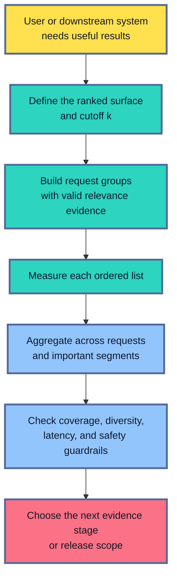
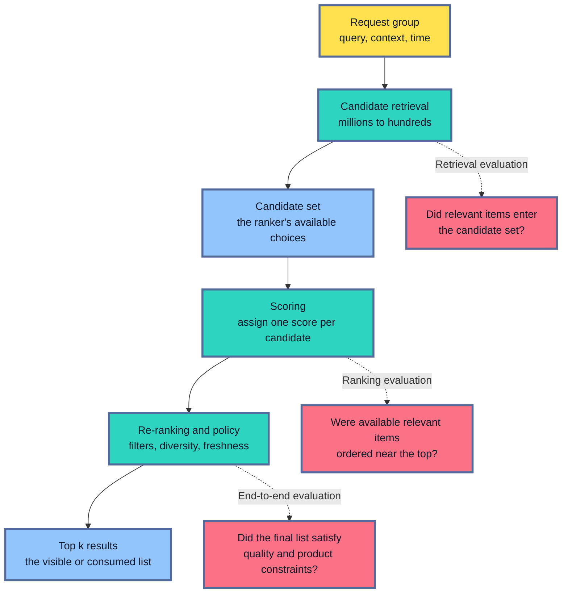
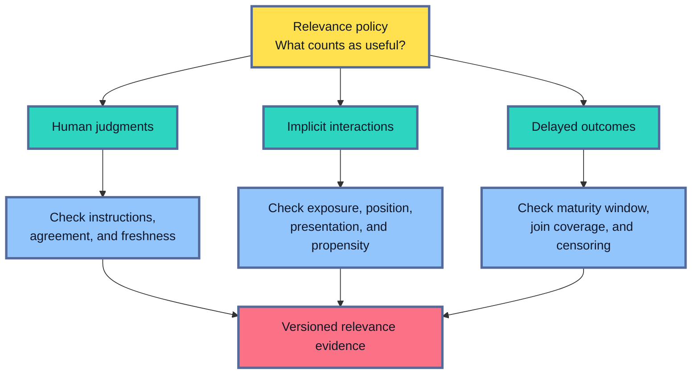
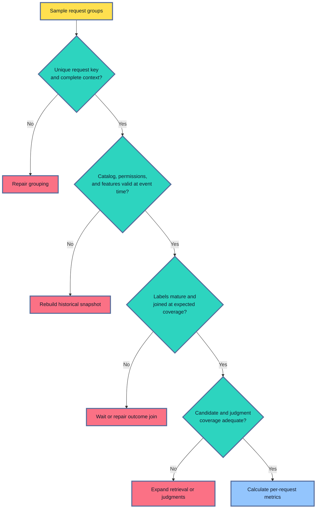
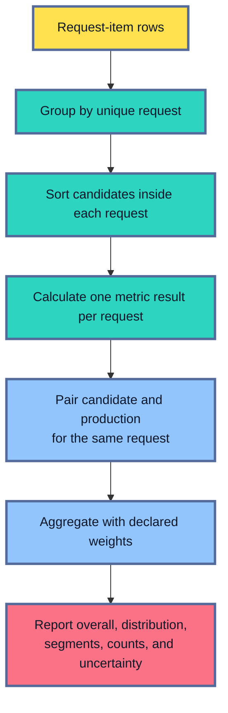
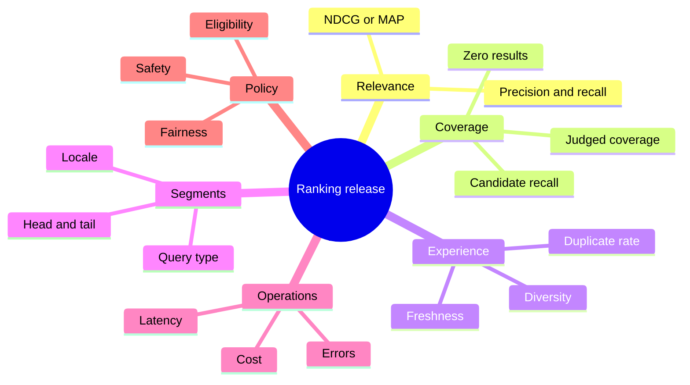
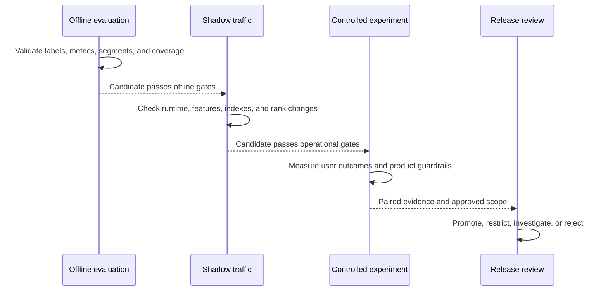
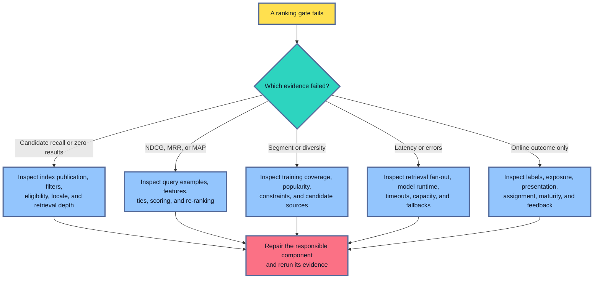

## Table of Contents

1. [Ranking Evaluation Measures An Ordered Experience](#ranking-evaluation-measures-an-ordered-experience)
2. [Understand The Ranking Pipeline Before Choosing A Metric](#understand-the-ranking-pipeline-before-choosing-a-metric)
3. [Define What Relevance Evidence Means](#define-what-relevance-evidence-means)
4. [Build A Time-Valid Evaluation Set](#build-a-time-valid-evaluation-set)
5. [Precision At K And Recall At K Measure Different Misses](#precision-at-k-and-recall-at-k-measure-different-misses)
6. [MRR And MAP Describe Different Search Tasks](#mrr-and-map-describe-different-search-tasks)
7. [NDCG Handles Graded Relevance And Position](#ndcg-handles-graded-relevance-and-position)
8. [Aggregate Per Request And Keep The Weighting Visible](#aggregate-per-request-and-keep-the-weighting-visible)
9. [Guardrails Protect The Rest Of The Product](#guardrails-protect-the-rest-of-the-product)
10. [Offline Evaluation Cannot Recreate A New Ranking Policy](#offline-evaluation-cannot-recreate-a-new-ranking-policy)
11. [Connect The Evaluation Job To Industrial Tooling](#connect-the-evaluation-job-to-industrial-tooling)
12. [Turn The Report Into Release Gates And A Runbook](#turn-the-report-into-release-gates-and-a-runbook)
13. [The Main Idea](#the-main-idea)
14. [References](#references)

## Ranking Evaluation Measures An Ordered Experience
<!-- section-summary: Ranking evaluation asks whether useful items appear early enough in an ordered list for a person or downstream system to use them. -->

At a high level, **ranking evaluation measures the quality of an ordered list**.
Search engines rank documents.
Recommendation systems rank products, videos, or articles.
Retrieval systems rank passages before another model reads them.
Matching systems rank jobs, drivers, or service providers.

The order matters because attention is limited.
A relevant document at position 2 is easy to find.
The same document at position 200 may never be seen.
A row-level classifier can call both documents “relevant” and report two correct labels.
That result says nothing about the order presented to the user.

Consider five results with binary relevance labels:

```text
Position:      1   2   3   4   5
Result:        A   B   C   D   E
Relevant:      no  yes no  yes no
```

A classifier sees five separate rows and may count two positives and three negatives.
Ranking evaluation keeps the rows together as one request.
It asks whether B and D appeared inside the visible area, how early they appeared, and how many other relevant results were left out.

This gives ranking evaluation a natural framework:

1. **System boundary:** identify the retrieval, scoring, and re-ranking stages under review.
2. **Evaluation unit:** preserve each query or request as one ordered group.
3. **Relevance evidence:** define what makes an item useful for that request.
4. **Metric:** choose a measure that matches the user's task and the visible cutoff.
5. **Aggregation:** decide how requests and users contribute to the overall result.
6. **Guardrails:** protect coverage, segments, diversity, latency, and other product needs.
7. **Release evidence:** connect offline results to shadow checks, online experiments, and rollback.



The framework starts with the experience being ranked.
A search box and a three-card recommendation row have different cutoffs, labels, and failure costs.
A retriever that supplies twenty passages to a language model creates another evaluation boundary.
All three can use the same metric names while answering different product questions.

## Understand The Ranking Pipeline Before Choosing A Metric
<!-- section-summary: Candidate retrieval determines which items are available, scoring orders them, and re-ranking applies final product constraints. -->

Most production ranking systems reduce a very large collection in stages. You can think of the pipeline as a funnel.

A **query** or **request group** represents one information need and its context.
A unique request ID keeps two requests with the same text from being merged accidentally.

For search, the context may include query text, locale, active filters, and request time. For recommendation, it may include a user or session, the surface being filled, and the current interaction context.

The **candidate set** contains the items available to the ranking stage.
Candidate retrieval might combine keyword search, approximate nearest-neighbour vector search, collaborative filtering, popularity lists, or business rules.
It narrows millions of possible items to hundreds or thousands.

A **score** is the number used to order candidates.
Higher scores usually mean the ranker expects greater relevance or utility.
A score is often meaningful only inside the same request because score distributions can vary across queries.

A **relevance judgment** says how useful one candidate is for one request.
It may be binary, such as relevant or irrelevant, or graded, such as 0 for irrelevant through 3 for highly relevant.

A **position** is the item's place in the ordered list.
Position 1 is the first result.
The **cutoff `k`** marks the part of the list included in a metric, such as the first 5 cards or first 20 retrieved passages.



This separation prevents the wrong component from receiving the blame.
Suppose ten documents are known to answer a query.
Candidate retrieval supplies only four of them to the ranker.
Even a perfect ranker can place at most those four in the final list.
Retrieval recall sets the ceiling.

Now suppose retrieval supplies all ten, while the ranker places them below irrelevant documents.
The candidate generator did its job.
The scoring or re-ranking stage needs investigation.

Teams usually run two complementary comparisons:

- A **controlled ranker comparison** gives production and candidate rankers the same candidate set. This isolates ordering quality.
- An **end-to-end comparison** lets each complete pipeline generate and rank its own candidates. This measures the release users would actually receive.

Both results belong in a release report. The first helps locate a change. The second supports the production decision.

## Define What Relevance Evidence Means
<!-- section-summary: Relevance labels approximate user usefulness, and every label source brings coverage limits, bias, or delay. -->

A ranking metric needs a reference answer that says which items were useful for each request.
That reference is the **relevance evidence**, and its quality limits every result calculated from it.
Relevance itself is rarely observed directly.

For a knowledge search, relevance might mean that a document answers the question.
For a product search, semantic fit, price, availability, delivery, and user preference may all matter.
For recommendations, a click may indicate curiosity, while a completed view or purchase may provide stronger evidence of satisfaction.

The evaluation policy should state the label meaning before candidates are compared. A graded search policy might use:

- `3`: directly satisfies the request.
- `2`: useful and substantially relevant.
- `1`: related but incomplete.
- `0`: irrelevant or conflicting.

That scale needs examples and judge guidance.
One team may treat availability as part of relevance.
Another may evaluate semantic relevance first and protect availability through a separate guardrail.
Either design can work if the definition matches the product decision and remains stable across candidates.

### Human judgments cover items the old system never exposed

Human assessors can judge a query-item pair without relying on a production click.
This makes judged sets valuable for new items, tail queries, and candidate changes that retrieve previously unseen results.

Judgments still require quality control.
Assessors need the request context and a clear scale.
They also need a way to mark ambiguous cases.

The pipeline should measure agreement and adjudicate important disagreements.
It should preserve the judgment-policy version as well.
A stale judgment can also become invalid after a document, price, inventory state, or policy changes.

### Implicit feedback is abundant and biased by the old experience

Clicks, watch time, saves, add-to-cart events, purchases, reformulations, and successful task completion provide large amounts of behavioural evidence.
They describe what users did, which is valuable.
They also describe what users had an opportunity to do.

An item placed first receives more attention than the same item placed tenth.
This is **position bias**.
The production policy also decides which items receive any exposure.
This is **selection or exposure bias**.
Presentation, price, brand familiarity, image quality, and page speed can influence a click independently of relevance.

For example, an unclicked result at position 40 may be irrelevant, or the user may never have seen it. Turning every unclicked result into a negative label teaches the candidate to copy the exposure pattern of the old ranker.

Controlled exploration can estimate observation propensities for some systems. Inverse-propensity weighting then gives more weight to interactions that were unlikely to be observed. This approach needs logged propensities, adequate overlap between policies, variance controls, and careful review of its assumptions. It is a specialised correction with narrow assumptions and cannot repair every problem in click data.

### Delayed outcomes need time to mature

A click arrives quickly. A purchase, repayment, completed course, retained subscriber, or resolved support case may arrive much later. Evaluation should wait until the defined outcome window closes.

Suppose a recommendation is labelled successful if a user completes a course within 30 days. Requests from the last week have had less opportunity to become positive. Treating them as failures creates a false recent decline. The dataset should record event time, label maturity time, and join coverage so reviewers can distinguish a model result from an incomplete outcome feed.



Strong evaluation sets often combine sources. Human judgments provide controlled relevance coverage. Mature outcomes connect ranking to product value. Carefully collected interaction data supplies scale and current behaviour. The report keeps the sources separate so disagreement remains visible.

## Build A Time-Valid Evaluation Set
<!-- section-summary: A valid dataset reconstructs each request, eligible candidate universe, features, labels, and policies using information available at the relevant time. -->

An evaluation row usually contains a request ID, item ID, candidate score, relevance grade, event time, and segment fields. The rows must remain grouped by request. Repeated query text alone is too weak because two users can issue the same query under different locales, filters, permissions, or catalog states.

Time validity means that every part of the evaluation represents a possible production decision at that time. A document published next week cannot appear in today's candidate set. A feature calculated from tomorrow's purchase cannot help rank yesterday's request. A current access policy cannot silently replace the policy that controlled the historical request.

A useful dataset manifest records:

- request sampling window and inclusion rules.
- unique request-group key.
- corpus, index, catalog, and eligibility snapshot.
- feature and preprocessing versions.
- relevance-policy and judgment-set versions.
- outcome maturity window and join coverage.
- candidate-generation and ranker identities.
- cutoff values and metric conventions.
- exclusions, deduplication, and missing-label policy.

Candidate-set validity deserves a separate check. For a controlled ranker comparison, both rankers should score the same eligible candidates. For an end-to-end comparison, each pipeline produces its own candidates, and the report measures retrieval coverage before ranking quality.

Judgment coverage also limits interpretation. Search evaluation commonly uses a judged pool collected from several systems. A new candidate may return unjudged items. Counting every unjudged item as irrelevant can punish genuine discoveries, while ignoring all of them can inflate precision. The report should publish the chosen policy and an **unjudged rate** at each cutoff. High unjudged coverage triggers more judgments before a release claim.

The following validation path catches common dataset failures before metrics run:



Metric changes from an invalid dataset describe the data pipeline. They provide no reliable conclusion about the candidate, so evidence-integrity checks belong ahead of the leaderboard.

## Precision At K And Recall At K Measure Different Misses
<!-- section-summary: Precision@k measures how much of the top list is relevant, while recall@k measures how much known relevant material the list recovered. -->

Two simple metrics answer complementary questions about the visible list. **Precision at `k`** measures how much of that space contains relevant items. **Recall at `k`** measures how much known relevant material reached that space.

Precision at `k` asks: “Of the first `k` results, how many are relevant?”

Suppose the first five results are:

```text
Ranked list:       [A, B, D, C, E]
Relevant items:   {B, D, F, G}
Top five matches:     B  D
```

Two of the five visible results are relevant, so precision@5 is `2 / 5 = 0.40`. Precision protects scarce display positions. A three-card carousel filled with irrelevant items has poor precision even if useful items exist deeper in the catalog.

**Recall at `k`** asks: “Of all known relevant items, how many appeared in the first `k` results?”

The same request has four known relevant items: B, D, F, and G. The top five recover B and D, so recall@5 is `2 / 4 = 0.50`. Recall is especially important for candidate retrieval. A later ranker cannot recover F or G if they never enter its candidate set.

The formulas follow the examples:

$$
\text{Precision@k}(q)=\frac{\text{relevant items in the first }k}{k}
$$

$$
\text{Recall@k}(q)=\frac{\text{relevant items in the first }k}{\text{all known relevant items for }q}
$$

The cutoff should match a real boundary. Search may report precision@10 for the first page and recall@100 for candidate retrieval. A recommendation row may use precision@5. A RAG retriever might use recall@20 because twenty passages enter the next stage.

Precision and recall treat the top `k` as a set. Moving the only relevant result from position 1 to position 5 leaves both values unchanged. MRR, MAP, and NDCG add sensitivity to order.

Edge cases need an explicit contract:

- A request with no known relevant item has undefined recall under the formula above. Report these requests as a separate population. Assigning them zero or one silently changes the metric's meaning.
- A system that returns fewer than `k` items needs a denominator policy. Dividing by `k` treats empty slots as misses; dividing by returned count measures the purity of available results.
- Duplicate item IDs should be rejected or deduplicated before scoring. Repeating one relevant item must not create extra credit.
- Incomplete judgments require an unjudged-item policy and coverage report.

A focused implementation can keep these decisions visible:

```python
def precision_recall_at_k(ranked_ids, relevant_ids, k):
    top_k = ranked_ids[:k]
    unique_hits = len(set(top_k) & relevant_ids)

    precision = unique_hits / k
    recall = unique_hits / len(relevant_ids) if relevant_ids else None
    return {"precision": precision, "recall": recall}

result = precision_recall_at_k(
    ranked_ids=["A", "B", "D", "C", "E"],
    relevant_ids={"B", "D", "F", "G"},
    k=5,
)
# {"precision": 0.4, "recall": 0.5}
```

The short function illustrates the metric. Production code should also validate uniqueness, returned-list length, and the no-known-relevant policy.

## MRR And MAP Describe Different Search Tasks
<!-- section-summary: MRR rewards the first relevant result, while MAP rewards finding multiple relevant results early across the list. -->

Some tasks end as soon as the user finds one good answer. Others require several useful results. MRR and MAP represent those two shapes.

### MRR focuses on the first success

For one request, **reciprocal rank** is `1 / r`, where `r` is the position of the first relevant item.

```text
Ranked list:      [A, C, B, D]
Relevance:         0  0  1  1
First relevant:    position 3
Reciprocal rank:   1 / 3 = 0.333
```

**Mean reciprocal rank (MRR)** averages reciprocal rank over requests. A request with no relevant result inside the evaluated cutoff usually contributes zero.

$$
\text{MRR}=\frac{1}{|Q|}\sum_{q \in Q}\frac{1}{\text{rank of first relevant result for }q}
$$

MRR fits a navigational query, known-answer retrieval, or support lookup where one early success satisfies the need. It ignores every relevant item after the first. Two systems receive the same reciprocal rank if both place their first answer at position 2. Additional useful results receive no MRR credit.

### MAP rewards repeated success through the list

**Average precision (AP)** looks at every position containing a relevant item. At each such position, it calculates precision up to that point and then averages those precision values.

```text
Ranked list:       [B, A, D, C, F]
Relevant items:   {B, D, F}

Rank 1: B is relevant -> precision@1 = 1/1
Rank 3: D is relevant -> precision@3 = 2/3
Rank 5: F is relevant -> precision@5 = 3/5

AP = (1 + 2/3 + 3/5) / 3 = 0.756
```

**Mean average precision (MAP)** averages AP across requests.

$$
\text{AP}(q)=\frac{1}{R_q}\sum_i \text{Precision@i}(q)\cdot \text{rel}_i
$$

$$
\text{MAP}=\frac{1}{|Q|}\sum_{q \in Q}\text{AP}(q)
$$

Here, \(R_q\) is the number of known relevant items and \(\text{rel}_i\) is 1 for a relevant result at position \(i\). Truncated AP variants differ in their denominator and treatment of relevant items beyond `k`. The evaluation configuration should name the exact AP@k convention.

MAP fits tasks with multiple binary-relevant results, such as legal-document search or retrieving several useful knowledge passages. It assumes binary relevance. NDCG is usually a better fit once “excellent,” “useful,” and “partly useful” need different credit.

## NDCG Handles Graded Relevance And Position
<!-- section-summary: NDCG gives more credit to highly relevant items near the top and normalizes against the best possible order for the same request. -->

**Normalized discounted cumulative gain (NDCG)** measures an ordered list whose relevance labels have meaningful grades. It rewards putting the strongest results near the top and gives progressively less credit to useful items placed lower down.

NDCG combines two ideas:

1. relevance can have several grades;
2. a high grade contributes more near the top of the list.

Suppose four results have relevance grades:

```text
Current order:   [A, B, C, D]
Grades:           3  0  2  1

Ideal order:     [A, C, D, B]
Grades:           3  2  1  0
```

The current list starts well with grade 3, wastes the second position on grade 0, and places useful items below it. **Discounted cumulative gain (DCG)** adds the gain from each item and discounts lower positions. **Ideal DCG (IDCG)** calculates the same quantity for the best possible order. NDCG divides the current DCG by IDCG.

$$
\text{DCG@k}=\sum_{i=1}^{k}\frac{G(\text{relevance}_i)}{\log_2(i+1)}
$$

$$
\text{NDCG@k}=\frac{\text{DCG@k}}{\text{IDCG@k}}
$$

The gain function \(G\) is part of the metric definition. A linear gain uses the relevance grade directly. Another common convention uses \(2^{\text{relevance}}-1\) to give high grades more separation. Scikit-learn's `ndcg_score` uses the supplied relevance values as gains and a logarithmic discount. The library also averages tied predicted scores by default.

NDCG normally falls between 0 and 1 for non-negative relevance grades. A score near 1 means the ranking is close to the best order available for that request. It does not say that the labels are complete, that the user was satisfied, or that the candidate set contained every useful item.

The metric protocol should therefore record:

- relevance grades and gain function.
- logarithm base and cutoff `k`.
- tie handling.
- treatment of requests with zero ideal gain.
- treatment of unjudged results.
- library and version used for computation.

The core scikit-learn call is small. The important work happened earlier in grouping and label design:

```python
import numpy as np
from sklearn.metrics import ndcg_score

relevance = np.array([[3, 0, 2, 1]])
candidate_scores = np.array([[0.95, 0.80, 0.70, 0.60]])

ndcg_at_4 = ndcg_score(
    y_true=relevance,
    y_score=candidate_scores,
    k=4,
    ignore_ties=False,
)
```

Each row passed to `ndcg_score` represents one request group. A production evaluation usually calculates or preserves per-request results so poor queries and segments remain inspectable.

The metric choice now follows the user task:

| Task shape | Strong starting metric | Main question |
|---|---|---|
| One early answer satisfies the request | MRR@k | How early is the first relevant result? |
| Several binary-relevant items matter | MAP or AP@k | Are relevant items repeatedly placed early? |
| Relevance has meaningful grades | NDCG@k | Are the best items concentrated near the top? |
| Retrieval supplies another stage | Recall@k | Did the candidate set contain the needed items? |

The table summarizes the theory. Product guardrails and online outcomes still complete the decision.

## Aggregate Per Request And Keep The Weighting Visible
<!-- section-summary: Ranking metrics are calculated within requests and then aggregated with an explicit policy for queries, users, traffic, and uncertainty. -->

Ranking metrics start inside a request group. Averaging item rows first destroys the ordering and gives requests with many candidates more influence.

The simplest summary is a **macro average**: calculate one metric for each request and give every request equal weight. This answers, “How well does the system perform for a typical sampled request?”

A traffic-weighted average answers a different question: “What metric would we observe across the current request mix?” Frequent queries or heavy users receive more influence. That may represent present business volume, while also hiding weak tail queries.

A user-weighted report gives each user equal influence before averaging across users. This can prevent a small number of highly active users from dominating the result. Session-level aggregation may fit products where several requests form one task.

For example, suppose one head query appears 10,000 times with NDCG 0.95, while 1,000 distinct tail queries each have NDCG 0.30. A traffic-weighted result looks excellent. A unique-query macro result exposes the poor tail experience. Neither view is automatically correct; they answer different questions.

A mature report often includes:

- macro average across request groups.
- traffic-weighted average.
- user- or session-weighted result if repeated activity matters.
- distribution percentiles and count of zero-score requests.
- segments for query type, locale, device, and frequency.
- candidate minus production difference for the same request.
- confidence interval at the dependency-carrying unit.

Candidate and production results should be paired by request. Each pair faced the same information need, labels, and eligible context. Resampling those paired differences preserves the shared-request dependence. If many requests come from the same user or session, a user- or session-level block may provide the more honest resampling unit.



Counts belong beside every average. A locale with ten judged requests provides weaker evidence than one with ten thousand. Missing labels, excluded requests, and zero-candidate groups should remain visible throughout aggregation.

## Guardrails Protect The Rest Of The Product
<!-- section-summary: Ranking quality needs segment, coverage, diversity, latency, safety, and business guardrails because one relevance average cannot represent the whole system. -->

A candidate can improve NDCG and still damage the product. It may slow every request, repeatedly show the same popular items, exclude new content, violate eligibility rules, or fail badly for one language.

Segment reports ask who receives the improvement. Search teams often examine navigational, broad, exact-title, head, tail, zero-result, locale, and device groups. Recommendation teams may examine new users, returning users, new items, content categories, subscription tiers, and surface types. Product risk and system architecture determine which segments deserve gates.

Coverage measures whether the system has enough material to rank:

- **retrieval recall** checks how many known relevant items enter the candidate set.
- **zero-candidate rate** counts requests where retrieval returns nothing.
- **eligible-catalog coverage** measures how much valid inventory can be surfaced.
- **judgment coverage** reports how much of the evaluated top `k` has labels.
- **feature coverage** catches candidates missing values needed by the ranker.

Diversity checks whether the list offers meaningfully different choices. One recommendation row may achieve high relevance by showing near-duplicates from the same category. Category coverage, intra-list similarity, provider concentration, and duplicate rate describe different diversity concerns. The final re-ranking stage often applies diversity, freshness, eligibility, or fairness constraints, so evaluation should measure the final output after those rules.

Operational guardrails protect delivery. Stage-level measurements separate candidate-generation latency from scoring latency. End-to-end p95 or p99 latency represents the delay users experience.

Timeouts and errors reveal failed requests. Index freshness catches delayed content. Cost per request shows whether the new pipeline can operate at the planned traffic level. A larger retrieval depth may raise recall and exceed the latency budget, so the release decision needs both effects.

Concrete product constraints also belong in the report. Examples include unavailable items in commerce, unsafe content in recommendations, permission leaks in enterprise search, stale passages in a knowledge retriever, or overexposure of one provider in a marketplace.



This guardrail set keeps the primary metric focused. NDCG can represent ordered relevance while separate measures preserve the other responsibilities of the product.

## Offline Evaluation Cannot Recreate A New Ranking Policy
<!-- section-summary: Historical logs describe outcomes under the old ranking policy, so shadow traffic and controlled experiments provide evidence that offline replay cannot supply. -->

Offline evaluation is a screening tool. It offers fast, reproducible comparison across a fixed request set. It cannot fully answer how users will react to a ranking they have never seen.

Historical interaction data was produced by the logging policy, usually the current production ranker. That policy controlled exposure and position. A candidate that promotes different items changes which items are seen, clicked, purchased, or labelled in the future. This is the **counterfactual problem**. The team wants to know what would have happened under another ranking, while the log contains outcomes from the old ranking.

Judged sets reduce reliance on old clicks, but they still simplify the real experience. Assessors may view one result at a time, while users compare items, scan snippets, reformulate queries, and react to latency. Recommendation changes can alter discovery and future preferences. A RAG retriever can improve document recall while the downstream generator uses the new context poorly.

Shadow traffic is the next operational check. The candidate processes copied requests without controlling the visible result. It can reveal latency, errors, candidate counts, score distributions, feature gaps, index mismatches, and large rank changes. Since users still see production results, shadow traffic supplies no direct evidence of user benefit.

A controlled online experiment assigns eligible users or requests to production and candidate policies. It measures outcomes such as successful sessions, task completion, reformulation, abandonment, conversion, retained use, complaints, or downstream answer quality. Stable assignment, sample-size planning, mature outcome windows, and predeclared guardrails protect the interpretation.



Offline and online metrics should tell a coherent story without being identical. NDCG@10 can justify testing a candidate. The experiment may use successful-search rate or task completion as its primary outcome. A disagreement triggers investigation into label meaning, exposure bias, presentation, latency, novelty, or experiment implementation.

Counterfactual estimators such as inverse-propensity scoring can help in systems with logged action probabilities and adequate policy overlap. Large weights can create unstable estimates, and missing support cannot be repaired statistically. High-impact releases still need controlled production evidence.

## Connect The Evaluation Job To Industrial Tooling
<!-- section-summary: Production evaluation combines metric libraries, versioned datasets, experiment artifacts, and search-platform relevance tools without giving any vendor ownership of the framework. -->

The framework stays the same across tools. It preserves request groups, versions relevance evidence, calculates per-request metrics, publishes segments and examples, and compares a candidate against production.

Python libraries provide focused metric implementations. Scikit-learn includes `ndcg_score` and explicit tie behaviour. Teams often implement precision@k, recall@k, MRR, and MAP in a small tested evaluation library because edge-case policies vary. Tests should cover duplicates, ties, short lists, missing judgments, no-known-relevant requests, and multiple request groups.

MLflow Tracking can store the evaluation identity and artifacts. The primary metrics are small scalar values. Query-level results, segment reports, worst regressions, and configuration belong in tables or files. Dataset metadata can identify the source and digest without copying sensitive raw data into the tracking server.

```python
import mlflow

with mlflow.start_run(run_name="ranking-candidate-review"):
    mlflow.log_params({
        "candidate_model": candidate_version,
        "production_model": production_version,
        "candidate_index": index_version,
        "judgment_policy": judgment_policy_version,
        "cutoff_k": 10,
    })
    mlflow.log_metrics({
        "macro_ndcg_at_10": summary["macro_ndcg_at_10"],
        "recall_at_100": summary["recall_at_100"],
        "unjudged_at_10": summary["unjudged_at_10"],
    })
    mlflow.log_table(segment_report, "evaluation/segments.json")
    mlflow.log_table(worst_regressions, "evaluation/worst_queries.json")
```

The run should also identify the evaluation dataset, feature or query configuration, code revision, and metric-policy version. Access controls still apply because query text, user context, and judgments may contain sensitive data.

Search platforms can run part of the evaluation close to the retrieval engine. Elasticsearch's ranking evaluation API accepts representative search requests and per-query document ratings. It returns metrics such as precision, recall, MRR, and normalized DCG with per-query details. OpenSearch Search Relevance Workbench organizes query sets, search configurations, judgment lists, and evaluation experiments, with aggregate and individual-query views.

These platform tools are especially practical for comparing lexical, vector, hybrid, filter, and query-rewrite configurations against judged queries. A broader MLOps job still owns time-valid dataset construction and model or index lineage. It also owns product segments, operational guardrails, confidence intervals, online experiment links, and release authority.

Amazon Personalize provides another managed example: its offline recommender reports include coverage, MRR, NDCG, and precision at defined cutoffs. Its documentation also separates offline metrics from online interaction outcomes. Managed metrics can accelerate evaluation, while the team remains responsible for label meaning, data comparability, and release thresholds.

In practice, the stack may look like:

- object storage, a lakehouse, or warehouse for request, judgment, and outcome data.
- Spark, SQL, Polars, or pandas for time-valid joins and query grouping.
- a tested Python metric layer or search-platform evaluation API.
- MLflow or managed experiment tracking for identity, metrics, tables, and artifacts.
- orchestration through Airflow, Dagster, or a managed ML pipeline.
- a controlled experimentation platform for online outcomes.
- dashboards and alerting for release and production guardrails.

The components can change. The evidence contract should survive those changes.

## Turn The Report Into Release Gates And A Runbook
<!-- section-summary: Release gates translate ranking evidence into enforceable thresholds, an approved scope, stop conditions, and component-specific recovery actions. -->

A release report should lead to a decision. “NDCG improved” is too weak because it omits uncertainty, retrieval coverage, affected segments, runtime behaviour, and the scope users will receive.

Start with a declared release question. For example: does the candidate improve NDCG@10 for eligible search traffic? Does it also preserve exact-match success, tail-query quality, retrieval recall, result diversity, permission correctness, and p95 latency?

The gate then binds that question to measurable limits:

```yaml
ranking_release_gate:
  identity:
    model_version: "ranker-v42"
    index_version: "hybrid-index-v18"
    relevance_policy: "judgments-v6"

  primary:
    metric: "macro_ndcg_at_10"
    candidate_minus_production_lower_ci_min: 0.004

  retrieval:
    recall_at_100_min: 0.96
    zero_candidate_rate_max: 0.002
    unjudged_at_10_max: 0.08

  guardrails:
    exact_match_mrr_at_10_regression_max: 0.002
    tail_query_ndcg_at_10_regression_max: 0.005
    duplicate_at_10_max: 0.01
    permission_violation_count: 0
    p95_latency_ms_max: 150

  rollout:
    initial_traffic_percent: 5
    rollback_model: "ranker-v41"
    rollback_index: "hybrid-index-v17"
```

The numbers illustrate the schema. Production limits come from the product objective, baseline variation, harm analysis, service objective, and the amount of risk the first rollout can safely contain.

The release packet should contain:

- exact model, index, query, feature, and re-ranking identities.
- dataset and judgment manifests.
- overall paired effects with uncertainty.
- per-request artifact and worst regressions.
- segment, coverage, diversity, policy, and latency results.
- shadow evidence and online experiment plan or result.
- approved traffic, population, duration, and stop conditions.
- rollback pair and owner.

The rollback pair matters because model and index changes can depend on each other. Restoring the old ranker while keeping an incompatible candidate index may preserve the incident.

Investigation starts from the failed boundary:



This runbook separates candidate retrieval, ranking, final policy, runtime, and online interpretation. Each path produces a different repair. Expanding traffic repeats the decision with the larger capacity and exposure, using current evidence from the approved scope.

## The Main Idea
<!-- section-summary: Reliable ranking evaluation connects ordered relevance to valid evidence, system boundaries, product guardrails, and controlled release decisions. -->

Ranking evaluation starts from one simple observation: users and downstream systems consume an ordered list. The evaluation unit is therefore the complete request group, with positions and a product-relevant cutoff.

The team first separates candidate retrieval from final ranking. It defines relevance, examines the bias and delay in each label source, and reconstructs a time-valid candidate and judgment set. Precision@k and recall@k measure visible purity and recovered material. MRR focuses on the first success, MAP rewards multiple binary-relevant results placed early, and NDCG supports graded relevance with position discounting.

Per-request aggregation keeps weighting and uncertainty honest. Segment, coverage, diversity, policy, latency, and cost guardrails protect responsibilities outside the primary relevance metric. Offline results screen the candidate, shadow traffic validates operation, and controlled experiments measure behaviour under the new policy.

The final release gate grants only the scope supported by that evidence. It identifies the exact ranker and index, names stop conditions, and retains a tested rollback pair. That chain turns ranking metrics into a production decision people can understand, inspect, and reverse.

## References

- [scikit-learn: Normalized discounted cumulative gain](https://scikit-learn.org/stable/modules/generated/sklearn.metrics.ndcg_score.html)
- [Google for Developers: Recommendation systems overview](https://developers.google.com/machine-learning/recommendation/overview/types)
- [Google for Developers: Scoring in recommendation systems](https://developers.google.com/machine-learning/recommendation/dnn/scoring)
- [Google for Developers: Re-ranking recommendations](https://developers.google.com/machine-learning/recommendation/dnn/re-ranking)
- [Google Research: Position Bias Estimation for Unbiased Learning to Rank in Personal Search](https://research.google/pubs/position-bias-estimation-for-unbiased-learning-to-rank-in-personal-search/)
- [Elasticsearch: Ranking evaluation API](https://www.elastic.co/docs/reference/elasticsearch/rest-apis/search-rank-eval)
- [OpenSearch: Search Relevance Workbench](https://docs.opensearch.org/latest/search-plugins/search-relevance/using-search-relevance-workbench/)
- [OpenSearch: Exploring search evaluation results](https://docs.opensearch.org/latest/search-plugins/search-relevance/explore-experiment-results/)
- [MLflow: Experiment tracking](https://mlflow.org/docs/latest/tracking/)
- [MLflow: Dataset tracking](https://mlflow.org/docs/latest/dataset/)
- [Amazon Personalize: Evaluating a recommender](https://docs.aws.amazon.com/personalize/latest/dg/evaluating-recommenders.html)
