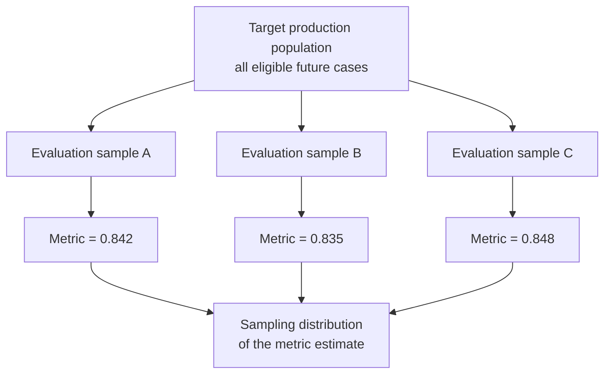
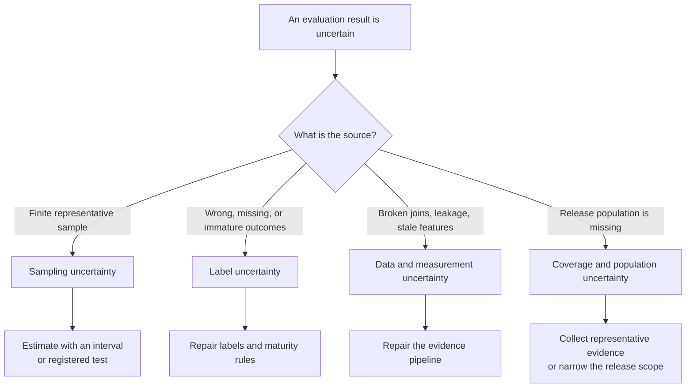
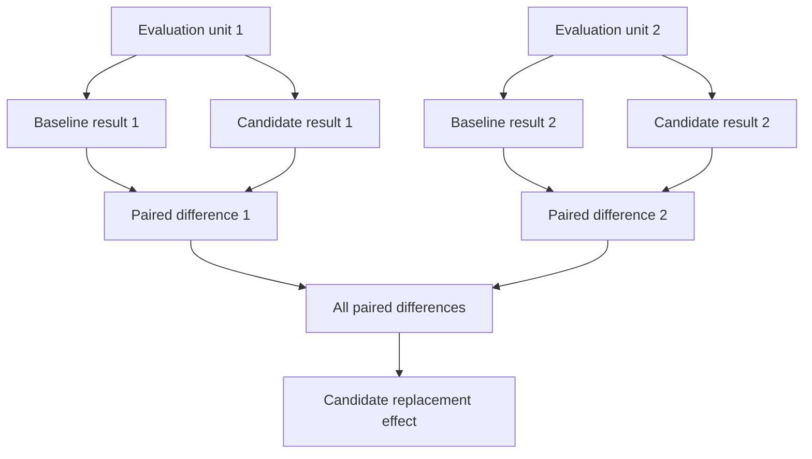
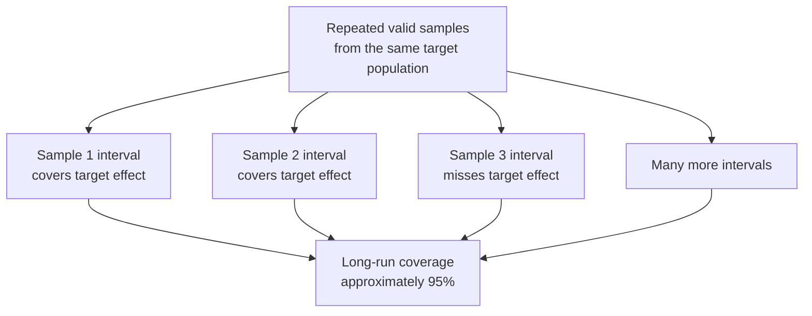
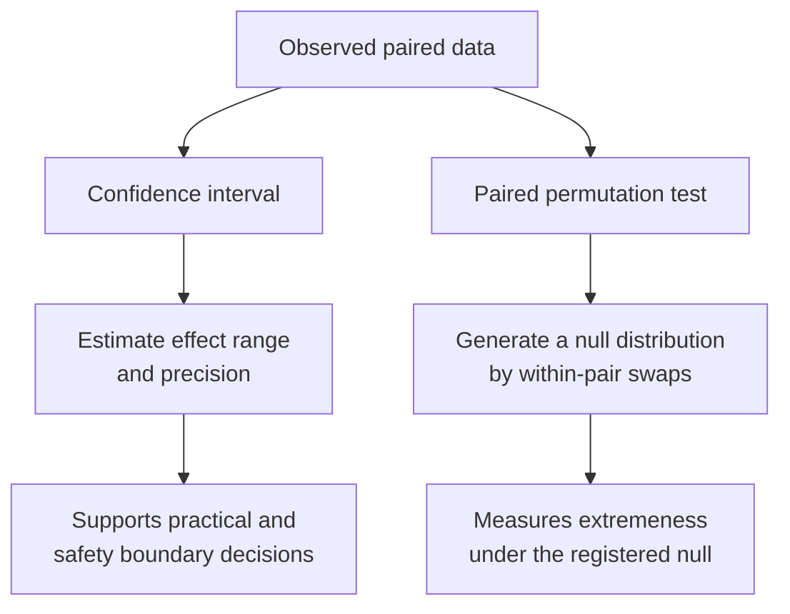
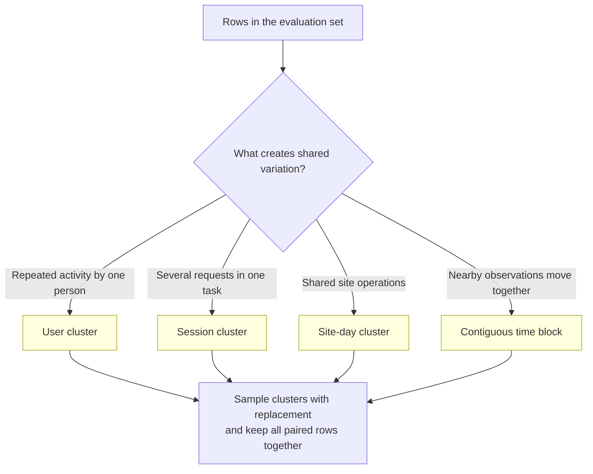
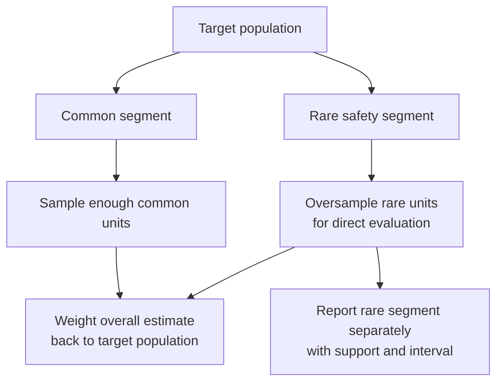
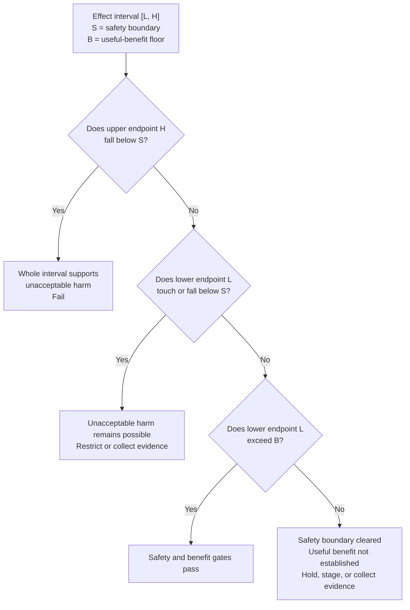
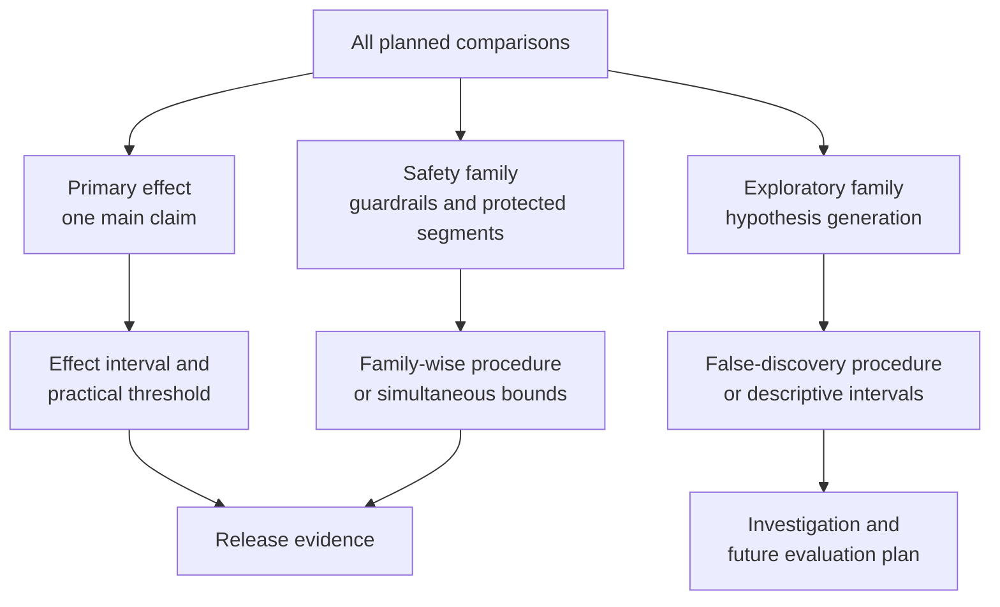
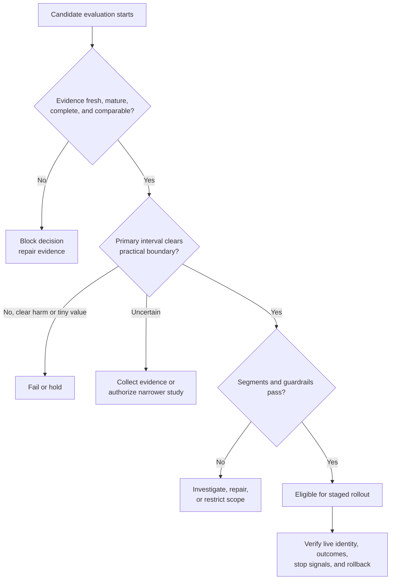

## Table of Contents

1. [One Offline Score Is An Estimate](#one-offline-score-is-an-estimate)
2. [Separate Sample Variation From Broken Or Biased Evidence](#separate-sample-variation-from-broken-or-biased-evidence)
3. [Define The Exact Quantity And Difference You Want To Measure](#define-the-exact-quantity-and-difference-you-want-to-measure)
4. [Compare Candidate And Baseline On The Same Units](#compare-candidate-and-baseline-on-the-same-units)
5. [Understand Confidence Intervals Through Repeated Samples](#understand-confidence-intervals-through-repeated-samples)
6. [How A Paired Bootstrap Estimates The Range Of Effects](#how-a-paired-bootstrap-estimates-the-range-of-effects)
7. [What A Paired Permutation Test Can Tell You](#what-a-paired-permutation-test-can-tell-you)
8. [Resample Whole Users, Sessions, Or Sites When Rows Are Related](#resample-whole-users-sessions-or-sites-when-rows-are-related)
9. [Sample Important Rare Groups Deliberately](#sample-important-rare-groups-deliberately)
10. [Separate Practical Importance From Statistical Evidence](#separate-practical-importance-from-statistical-evidence)
11. [Account For The Extra False Alarms Created By Many Comparisons](#account-for-the-extra-false-alarms-created-by-many-comparisons)
12. [Record Everything Needed To Reproduce The Comparison](#record-everything-needed-to-reproduce-the-comparison)
13. [Use Uncertainty To Pass, Fail, Or Delay A Release](#use-uncertainty-to-pass-fail-or-delay-a-release)
14. [The Main Idea](#the-main-idea)
15. [References](#references)

## One Offline Score Is An Estimate
<!-- section-summary: An offline metric estimates behaviour in a target population from a finite evaluation sample, so another valid sample can produce a different value. -->

A holdout score such as 0.842 looks exact, although another valid sample may produce 0.835 for the same model. **Statistical uncertainty describes how much an evaluation result can vary because the team observed a sample instead of every future case.**
A model may have an accuracy of 0.842 on one valid holdout and 0.835 on another.
The model did not necessarily change.
The two samples contained different cases.

An offline score therefore has two roles.
It summarizes what happened in the evaluation data, and it estimates what might happen in the
target production population.
The first role is exact: 842 of 1,000 labelled examples were correct.
The second role is uncertain: future traffic will contain another mixture of easy, difficult,
common, and rare cases.

Imagine repeatedly drawing evaluation samples from the same production population.
Every sample is prepared with the same eligibility rules, label definition, and metric code.
The model receives a slightly different set of cases each time, so the score moves.
That pattern of possible scores is the **sampling distribution**.



Production review usually compares two systems.
A candidate may improve recall by 0.7 percentage points over the current model.
That observed difference is also an estimate.
Another representative sample might show 0.2 points, 1.1 points, or a small regression.

The release question is therefore larger than “Which score is higher?”
Reviewers need the estimated change, the precision of that estimate, the assumptions behind it,
and the amount of change that matters to the product.

## Separate Sample Variation From Broken Or Biased Evidence
<!-- section-summary: Resampling quantifies variation from finite sampling, while label errors, leakage, stale data, and unrepresentative coverage require evidence repair. -->

Uncertainty is a broad word.
Several problems can make an evaluation result doubtful, and a confidence interval handles only
part of that doubt.

**Sampling uncertainty** comes from observing a finite set of evaluation units.
A valid random or representative sample still contains chance variation.
Bootstrap intervals and other inferential methods are designed to describe this source.

### Fix Label, Data, And Measurement Problems Before Calculating Uncertainty

**Label uncertainty** comes from imperfect ground truth.
A fraud label may arrive late.
Two human assessors may disagree about document relevance.
A medical outcome may be missing for patients treated outside the observed network.
Repeated resampling preserves those label problems because it keeps drawing from the same
recorded evidence.

**Data and measurement uncertainty** includes broken joins, missing predictions, stale features,
duplicate requests, changing schemas, and incorrect timestamps.
An interval calculated from a biased join can be impressively narrow and completely misleading.

**Population uncertainty** appears if the evaluation set represents a different population from
the release scope.
A model tested on one language, device type, or season has weak evidence for unobserved groups.
More bootstrap repetitions cannot create those missing groups.



Suppose an outcome table joins to only 62 percent of predictions.
A paired bootstrap can accurately describe variation inside that joined subset.
It says nothing reliable about the missing 38 percent unless the missingness process is
understood.
The first action is to repair or characterize the join.

This separation prevents statistical machinery from giving a data-quality failure the appearance
of scientific confidence.
Evidence validity comes first.
Sampling uncertainty is measured after the dataset, labels, and release population pass their
own checks.

## Define The Exact Quantity And Difference You Want To Measure
<!-- section-summary: The estimand names the exact production quantity under study, and the effect size measures how much the candidate changes it relative to the baseline. -->

Before calculating uncertainty, the team needs to state the exact quantity it wants to learn
about. Statisticians call that quantity the **estimand**.

An estimand joins the metric to a population and an operating policy.
“Candidate recall” is incomplete.
“Candidate minus baseline recall for eligible transactions, at a threshold that sends 2 percent
of cases to review, under the current label policy” is far more precise.

The **effect size** is the measured size of the candidate's change.
For a higher-is-better metric, a common definition is:

$$
\widehat{\Delta}=\widehat{M}_{candidate}-\widehat{M}_{baseline}
$$

For an error or loss where lower is better, teams often reverse the subtraction:

$$
\widehat{\Delta}=\widehat{L}_{baseline}-\widehat{L}_{candidate}
$$

Both conventions make a positive value mean improvement.
The report should state the direction so a sign error cannot change the release decision.

A useful estimand contract can be short:

```yaml
estimand:
  population: "eligible completed delivery requests"
  metric: "mean absolute arrival-time error"
  operating_policy: "current clipping and fallback rules"
  effect: "baseline_mae - candidate_mae"
  unit: "minutes"
  weighting: "one completed request, one vote"
  label_maturity: "actual arrival recorded and quality-checked"
```

This contract prevents several common switches.
The team cannot quietly move from MAE to RMSE after seeing a favourable result.
It cannot compare raw model outputs in one report and policy-adjusted customer estimates in
another.
It cannot claim evidence for all requests from a sample restricted to completed deliveries.

Effect size also keeps the result understandable.
An MAE improvement of 0.4 minutes has a product meaning.
A recall improvement of 0.8 percentage points can be translated into additional positive cases
found per week.
Statistical evidence describes the precision of that effect; product owners decide whether its
size justifies cost and risk.

## Compare Candidate And Baseline On The Same Units
<!-- section-summary: Pairing keeps each candidate result attached to the baseline result for the same case, preserving shared difficulty and producing a direct replacement effect. -->

A candidate replaces or modifies a running system.
The fairest offline comparison gives both systems the same examples, labels, eligibility rules,
and policy boundary.
This creates a **paired comparison**.

Suppose four requests have per-request absolute errors:

| Request | Baseline error | Candidate error | Improvement |
|---|---:|---:|---:|
| 1 | 2 min | 1 min | +1 min |
| 2 | 18 min | 16 min | +2 min |
| 3 | 4 min | 6 min | -2 min |
| 4 | 10 min | 7 min | +3 min |

Request 2 is difficult for both models.
Pairing keeps that shared difficulty inside one comparison: the candidate reduced its error by 2
minutes.
Drawing unrelated baseline and candidate samples would mix model change with differences in
request difficulty.



The pair can be a row, query, patient, user, session, store-day, or another valid evaluation
unit.
Its identifier must be unique at the chosen level.
The evaluation job checks that both systems have a result for every included pair.

Missing candidate predictions need explicit treatment.
Dropping candidate failures from the joined table rewards the candidate for failing.
The protocol may count failures as the worst valid outcome, apply the production fallback, or
fail an operational guardrail.
The same rule must represent the release behaviour.

Pairing still applies to metrics such as AUC, F1, and NDCG that cannot be reduced to a simple
average of row-level differences.
Each resample keeps the same labels and units for both systems, recalculates both complete
metrics, and then subtracts them.

## Understand Confidence Intervals Through Repeated Samples
<!-- section-summary: A confidence interval comes from a procedure designed to cover the fixed target effect at a stated rate across repeated valid samples. -->

A **confidence interval** gives a range around the estimated effect.
Its width reflects how precisely the evaluation procedure has estimated the target quantity from
the available sample.

The repeated-sample picture gives the clearest interpretation.
Imagine drawing many valid evaluation samples from the same target population.
For every sample, run the same pairing, metric, and interval procedure.
The resulting intervals differ because the samples differ.

For a 95 percent confidence procedure, about 95 percent of those intervals would contain the
fixed target effect under the method's assumptions.
The interval computed from the current sample either covers that target or it does not.
Frequentist confidence does not assign a 95 percent probability to the fixed target after the
interval has been observed.



Suppose candidate minus baseline recall is estimated at `+0.009`, with a 95 percent interval
from `+0.003` to `+0.015`.
The point estimate says the candidate found 0.9 percentage points more positives in the sample.
The interval shows that the data and registered procedure support effects ranging from a small
positive gain to a larger one.

The confidence level is only one input.
The interval also depends on the sampling design, resampling unit, statistic, label quality, and
population coverage.
A narrow interval from duplicated users or leaked labels is weak evidence.

One-sided intervals can support a predeclared lower-bound decision, such as showing that a
regression is no worse than an approved margin.
Two-sided intervals show plausible movement in both directions.
The choice belongs in the evaluation plan before candidate results are reviewed.

## How A Paired Bootstrap Estimates The Range Of Effects
<!-- section-summary: A paired bootstrap repeatedly samples evaluation units with replacement, applies the same indices to both systems, and recalculates the effect. -->

The **bootstrap** approximates the sampling distribution by resampling the observed evaluation
units with replacement.
Some units appear several times in a bootstrap sample, while others do not appear.
Each resample has the same number of units as the original sample.

A paired bootstrap follows five steps:

1. Start with `n` evaluation units containing baseline and candidate results.
2. Draw `n` unit indices with replacement.
3. Apply those same indices to both systems, preserving every pair.
4. Recalculate the baseline metric, candidate metric, and effect.
5. Repeat many times and form an interval from the bootstrap effect distribution.

For arrival-time predictions, absolute error provides a focused example.
Positive improvement means the candidate reduced mean absolute error:

```python
import numpy as np
from scipy.stats import bootstrap

baseline_loss = np.abs(actual_minutes - baseline_prediction)
candidate_loss = np.abs(actual_minutes - candidate_prediction)

def mean_improvement(baseline_loss, candidate_loss, axis=-1):
    return np.mean(baseline_loss - candidate_loss, axis=axis)

result = bootstrap(
    data=(baseline_loss, candidate_loss),
    statistic=mean_improvement,
    paired=True,
    vectorized=True,
    n_resamples=20_000,
    confidence_level=0.95,
    method="BCa",
    rng=np.random.default_rng(42),
)

effect = mean_improvement(baseline_loss, candidate_loss)
interval = result.confidence_interval
```

SciPy's `paired=True` applies the same resampled indices to both arrays.
Its BCa method adjusts interval endpoints for estimated bias and skew.
Percentile and basic intervals are also available.
The method choice and library version belong in the evaluation configuration because interval
methods can differ.

### Recalculate The Entire Metric Inside Every Resample

For recall, F1, AUC, or NDCG, the statistic should receive labels and both prediction sets.
It recalculates each whole metric inside every resample.
Reusing a formula designed for mean row losses can give the wrong uncertainty for a
non-decomposable metric.

The number of resamples controls Monte Carlo noise in the computation.
Increasing 2,000 resamples to 20,000 can stabilize the estimated endpoints.
It does not add independent users, positive labels, sites, or time periods to the evaluation
evidence.

Bootstrap intervals also rely on the observed sample representing the target population and on
an appropriate resampling scheme.
Small samples, rare outcomes, boundary statistics, and very few independent clusters deserve
extra statistical review.
The bootstrap is a method with assumptions, not a certificate attached to any metric.

## What A Paired Permutation Test Can Tell You
<!-- section-summary: A paired permutation test measures how unusual the observed effect would be under a registered exchangeability null, while an interval estimates effect size and precision. -->

A confidence interval and a paired permutation test use the same paired evidence to answer
different questions.
Keeping those questions separate prevents a p-value from replacing the effect size, its
precision, and the product decision.

The interval asks: **What range of candidate effects is compatible with this sample and
procedure?**
It keeps effect size visible.

A paired permutation or randomization test asks: **How extreme would the observed statistic look
if baseline and candidate assignments were exchangeable within each pair under the null
hypothesis?**
For two systems, the procedure randomly swaps their values inside each pair and recalculates the
statistic.



SciPy represents this paired assignment question with `permutation_type="samples"`:

```python
from scipy.stats import permutation_test

test = permutation_test(
    data=(baseline_loss, candidate_loss),
    statistic=mean_improvement,
    permutation_type="samples",
    alternative="two-sided",
    n_resamples=20_000,
    rng=np.random.default_rng(42),
)
```

The p-value is the proportion of null-distribution statistics at least as extreme as the
observed statistic, using the implementation's stated convention.
It is not the probability that the null hypothesis is true.
It is not the probability that the candidate will succeed in production.
It also says little about whether the effect is large enough to matter.

A huge evaluation set can produce a small p-value for a tiny effect.
A confidence interval plus a practical threshold communicates that situation more directly.
A predeclared permutation test can still serve as a useful consistency check or support a formal
hypothesis-testing policy.

The exchangeability assumption matters.
Within-pair swaps should represent the null assignment mechanism.
Clustered or time-dependent data may require cluster-level swaps or another design-specific
procedure.

## Resample Whole Users, Sessions, Or Sites When Rows Are Related
<!-- section-summary: The resampling unit should match the source of independent variation so repeated users, sessions, sites, and nearby time periods remain together. -->

Ordinary row bootstrap treats rows as independent draws.
Production data often violates that picture.
The resulting interval can look far more precise than the evidence supports.

One user can create hundreds of requests.
Requests inside a session share intent and device conditions.
Predictions from the same store-day share staffing and inventory.
Traffic from nearby hours shares campaigns, weather, and outages.
Treating those related rows as hundreds of independent facts usually makes an interval too
narrow.

The resampling unit should carry the dependence.
For repeated users, sample users with replacement and include all selected users' rows.
For session-level dependence, sample sessions.
For a site-day effect, sample site-day clusters.
For serial dependence, resample contiguous time blocks long enough to preserve the relevant
correlation.



### How Cluster Bootstrap Keeps Related Rows Together

This is a **cluster bootstrap**.
It preserves dependence inside each sampled cluster while treating clusters as the independent
units represented by the evaluation design.
Candidate and baseline results stay paired inside every cluster.

Cluster choice also changes the estimand's weighting.
If users are sampled and every request is concatenated, users with more requests still
contribute more to a request-weighted metric.
If each user should receive one vote, calculate a user-level effect first and resample those
user effects.
The evaluation contract must say whether it estimates an average request, average user, average
site, or another target.

### Few clusters still mean limited evidence

Nested and crossed dependence can need more specialised methods.
Sessions may sit inside users, while requests also share calendar-day conditions.
A subject-matter expert and statistician should choose a design that reflects the dominant
source or uses an appropriate multi-level method.

Very few clusters limit what resampling can learn.
Ten thousand rows from six sites still provide only six site-level units.
More resamples repeat those six sites in different combinations.
Additional sites, longer time coverage, or a narrower release claim supplies stronger evidence.


*Pairing preserves the replacement comparison, while the resampling unit preserves the users, sessions, sites, or time blocks that share variation.*

## Sample Important Rare Groups Deliberately
<!-- section-summary: Stratified evaluation preserves important population groups, while weighting and segment-specific reports keep oversampling from distorting the overall effect. -->

An evaluation sample can be representative overall and still contain too little evidence for an
important rare segment.
A language group may account for 1 percent of traffic.
A severe positive outcome may occur in 0.2 percent of cases.
Random sampling alone can leave only a handful of examples.

**Stratification** divides the population into declared groups and samples within each group.
It can ensure that every important region, language, outcome class, or device type appears in
the evaluation set.
Resampling then occurs within those strata so the bootstrap respects the sampling design.

Oversampling a rare segment changes its share in the evaluation data.
The overall estimate should use weights that restore the intended production population.
The segment report can present the segment's own unweighted effect and interval.
The sampling manifest records both the selection probability and the target weight.



Duplicating the same rare rows creates no new independent evidence.
It may make a naive row count look large while preserving the same few people or events.
The report needs unique-unit counts, positive-label counts, cluster counts, and label coverage.

Rare-segment intervals can remain wide even after careful sampling.
That result is informative.
The team can collect more evidence, narrow the initial release scope, retain a fallback for that
segment, or require human review.
An unstable segment estimate should remain visible instead of disappearing inside a strong
overall average.

## Separate Practical Importance From Statistical Evidence
<!-- section-summary: Statistical evidence describes precision and compatibility, while practical thresholds define the amount of benefit or harm that matters to the product. -->

**Statistical significance** concerns how compatible the observed result is with a formal null
hypothesis under a chosen procedure.
**Practical significance** asks whether the effect is large enough to change a product or
operational decision.

With millions of independent requests, an improvement of 0.01 percentage points may have a tiny
p-value and a very narrow interval.
The change may still be too small to justify a slower model, migration risk, additional GPUs, or
retraining cost.

The reverse situation also occurs.
A candidate may show a meaningful 4-point improvement for a rare high-risk segment, with a wide
interval because only a small number of mature outcomes exist.
The right action may be more targeted evidence or a guarded pilot.
Calling the result “no effect” would ignore its practical size and uncertainty.

A release policy can use two product boundaries:

- The **minimum useful effect** is the smallest gain that justifies the change.
- The **non-inferiority or safety margin** is the largest regression the product can tolerate for a protected outcome.

Assume the effect is defined so positive values mean improvement.
Set the unacceptable-harm boundary at `-0.2` minutes and the minimum useful improvement at `+0.5`
minutes.
These boundaries create four decisions.

An interval of `[-1.1, -0.4]` lies wholly below the safety boundary.
It supports an unacceptable regression and fails the gate.

An interval of `[-0.5, +0.8]` crosses the safety boundary.
Useful improvement remains possible, but the interval also includes unacceptable harm.
The evaluation cannot rule out that harm, so the team restricts exposure or collects more
evidence.

An interval of `[0.0, +0.3]` lies entirely above the safety boundary and entirely below the
minimum useful effect.
It supports safety at the registered margin, while the gain is too small for the benefit gate.
An interval of `[-0.1, +1.1]` also clears the safety boundary, yet its lower bound does not clear
the useful-effect floor.
That wider result leaves the amount of benefit unresolved.

Only an interval whose lower bound exceeds `+0.5` supports the benefit gate.
For example, `[+0.7, +1.4]` shows that even the lower endpoint exceeds the minimum useful
improvement.


*The interval supports a decision only after the safety boundary and minimum useful benefit are declared on the effect scale.*



The exact decisions depend on risk.
A safety-critical guardrail may require a one-sided non-inferiority bound.
A low-risk ranking improvement may proceed to a small online experiment after clearing a looser
offline screen.
The thresholds should be declared before the final holdout result appears.

## Account For The Extra False Alarms Created By Many Comparisons
<!-- section-summary: Predeclared comparison families and appropriate multiplicity control reduce the chance of selecting an attractive result from many noisy tests. -->

Every additional metric, threshold, time window, and segment creates another opportunity for a
chance extreme result.
If a team tries twenty independent null tests at the 5 percent level, the chance of at least one
false rejection is much larger than 5 percent.
This is the **multiple-comparisons problem**.

### Group The Planned Comparisons Before Applying A Correction

Beginners do not need a catalogue of correction formulas to make a sound release review.
They need a clear comparison hierarchy:

1. Declare one primary effect that can support the main positive claim.
2. Declare protected guardrails and safety segments with explicit failure boundaries.
3. Mark extra slices and diagnostics as exploratory.
4. Report the complete family, including weak and inconvenient results.

Formal control depends on the decision.
The Holm procedure controls the family-wise error rate across a set of tests and works as a
strong default for a small safety family.
The Benjamini-Hochberg procedure controls the false discovery rate under its assumptions and may
fit large exploratory screening families.
Statsmodels exposes both through `statsmodels.stats.multitest.multipletests`.



### A Statistical Correction Cannot Repair Weak Or Cherry-Picked Evidence

Multiplicity control does not repair post-hoc metric shopping.
A team that tests hundreds of unrecorded variants and presents one adjusted result has hidden
the real search process.
Candidate generation, threshold tuning, segment discovery, and final evaluation need separate
data or a method that accounts for the full selection procedure.

Support still matters after adjustment.
A corrected p-value cannot make five positive cases represent a stable segment.
Every segment report needs support counts beside its effect and interval.
Include the number of units, clusters, and outcomes.
The report also states the comparison family.

## Record Everything Needed To Reproduce The Comparison
<!-- section-summary: A reproducible uncertainty report versions the dataset, labels, models, estimand, resampling procedure, code, and query-level or unit-level artifacts. -->

Another engineer needs the full evaluation setup to reproduce a statistical comparison.
The same predictions can produce different conclusions after a label revision, threshold change,
weighting rule, cluster definition, or interval method.

The evaluation run should identify:

- candidate and baseline model versions;
- feature, preprocessing, threshold, fallback, and policy versions;
- dataset source, immutable snapshot, and content digest;
- label definition, maturity window, and join coverage;
- estimand, weighting, and effect direction;
- resampling unit, strata, interval method, resample count, and random seed;
- primary, guardrail, and exploratory comparison families;
- code revision and locked dependency environment;
- per-unit results, segment reports, intervals, and gate outcome.

MLflow Tracking can store the compact identity, metrics, and review artifacts.
Dataset tracking can record source and digest metadata while governed storage retains sensitive
row-level evidence.

```python
import mlflow

with mlflow.start_run(run_name="paired-candidate-evaluation"):
    mlflow.log_params({
        "candidate_model": candidate_version,
        "baseline_model": baseline_version,
        "estimand": "baseline_mae_minus_candidate_mae",
        "resampling_unit": "user_id",
        "interval_method": "paired_cluster_bootstrap_bca",
        "confidence_level": 0.95,
    })
    mlflow.log_metrics({
        "effect": effect,
        "ci_low": ci_low,
        "ci_high": ci_high,
        "label_join_coverage": label_join_coverage,
    })
    mlflow.log_table(segment_results, "evaluation/segments.json")
    mlflow.log_table(worst_pairs, "evaluation/worst_pairs.json")
```

The run record should point to the exact evaluation manifest and release candidate.
Mutable labels such as `candidate` or `champion` help discovery, while the decision record needs
immutable versions or digests.

Random seeds support replay of an approximate resampling run.
Reproducibility also requires the same row ordering, statistic implementation, library version,
and missing-data policy.
Two matching seeds cannot reconcile different datasets.

Security and privacy boundaries remain active.
Per-user paired results and worst-case examples may contain sensitive identifiers or outcomes.
Store detailed artifacts in governed locations and log access-controlled references where
appropriate.

## Use Uncertainty To Pass, Fail, Or Delay A Release
<!-- section-summary: An uncertainty-aware gate checks evidence validity, paired effects, practical bounds, protected segments, operational readiness, and rollback before authorizing a scope. -->

A production gate converts uncertainty into an action.
It needs at least three outcomes: pass, fail, and inconclusive.
The inconclusive state protects teams from forcing weak evidence into a confident decision.

A versioned gate might look like:

```yaml
paired_release_gate:
  identity:
    baseline_model: "arrival-model-v17"
    candidate_model: "arrival-model-v18"
    evaluation_manifest: "arrival-eval-v9@sha256:..."

  evidence:
    label_join_coverage_min: 0.98
    labels_mature: true
    minimum_independent_clusters: 200

  primary:
    estimand: "baseline_mae_minus_candidate_mae_minutes"
    resampling_unit: "user_id"
    confidence_level: 0.95
    lower_bound_min: 0.5

  guardrails:
    p95_absolute_error_regression_max: 0.2
    protected_segment_method: "holm"
    minimum_segment_outcomes: 100

  rollout:
    initial_traffic_percent: 5
    rollback_model: "arrival-model-v17"
    stop_on_label_or_join_failure: true
```

The sample values illustrate the contract.
Production thresholds come from user value, risk, operating cost, baseline variation, and the
amount of exposure a canary can safely contain.

The gate evaluates evidence in order:



An unexpectedly wide interval starts an investigation.
Check the number of independent clusters, outcome prevalence, label maturity, missing
predictions, weighting, threshold stability, and population mixture.
Increasing the resample count only reduces simulation noise.
Additional representative units improve the evidence.

A surprising disagreement between row-level and cluster-level intervals points to shared user,
site, session, or time conditions.
The cluster-aware result should drive a gate designed around that dependence.
The gap itself is useful diagnostic evidence.

Passing an offline uncertainty gate usually authorizes the next evidence stage.
Shadow traffic checks feature, latency, scoring, and identity behaviour.
A limited canary tests outcomes under current production conditions.
Live evidence can still reveal feedback effects, changed traffic, dependency failures, or
label-pipeline problems.

Rollback restores the complete retained decision path.
That path can include the baseline model, feature definitions, preprocessing image, threshold
policy, and fallback.
The release record names the rollback identity and stop signals before traffic moves.

## The Main Idea
<!-- section-summary: Reliable model comparison combines a precise effect, same-unit pairing, valid resampling, practical boundaries, and an explicit action for uncertainty. -->

One offline score is an estimate from a finite sample.
Its uncertainty deserves measurement only after labels, joins, time boundaries, and population
coverage are trustworthy.

The estimand defines the exact production quantity under study.
The effect size says how much the candidate changes it.
Pairing gives candidate and baseline the same cases, which isolates the replacement effect from
shared case difficulty.

A confidence interval describes effect precision through a repeated-sample procedure.
A paired bootstrap estimates that interval by applying the same resampled units to both systems.
A paired permutation test answers a registered null question through within-pair swaps.
The interval and test serve different purposes.

Users, sessions, sites, and time blocks can carry dependence.
Cluster-aware and stratified resampling preserve that design.
Rare segments retain their own support counts and uncertainty.
Practical thresholds keep tiny statistical effects from controlling product decisions, while
multiplicity rules keep large comparison families honest.

The final gate can pass, fail, or remain inconclusive.
It connects immutable evidence to a staged release, investigation path, and complete rollback
identity.
That structure lets a team say what the evaluation supports, what it cannot yet support, and
what evidence should come next.


*An uncertainty-aware gate can pass, fail, or remain inconclusive, and every outcome keeps the evidence and rollback identity reproducible.*

## References

- [SciPy: Bootstrap confidence intervals](https://docs.scipy.org/doc/scipy/reference/generated/scipy.stats.bootstrap.html)
- [SciPy: Permutation tests](https://docs.scipy.org/doc/scipy/reference/generated/scipy.stats.permutation_test.html)
- [NIST/SEMATECH: What are confidence intervals?](https://www.itl.nist.gov/div898/handbook/prc/section1/prc14.htm)
- [NIST/SEMATECH: Bootstrap plots and uncertainty estimates](https://www.itl.nist.gov/div898/handbook/eda/section3/bootplot.htm)
- [Cheng, Yu, and Huang: Cluster bootstrap consistency in generalized estimating equations](https://doi.org/10.1016/j.jmva.2012.09.003)
- [statsmodels: Multiple-testing corrections](https://www.statsmodels.org/stable/generated/statsmodels.stats.multitest.multipletests.html)
- [MLflow: Experiment tracking](https://mlflow.org/docs/latest/tracking/)
- [MLflow: Dataset tracking](https://mlflow.org/docs/latest/dataset/)
