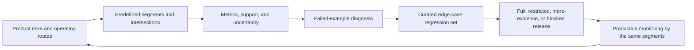

## Why the Average Can Mislead You

<!-- section-summary: Segment evaluation measures important groups and situations separately so a good overall score cannot hide a harmful product failure. -->

A **segment** is a meaningful slice of evaluation data, such as a language, customer tier, device type, product category, or time period. An **edge case** is a rare or awkward input that still matters because the product must handle it correctly. Segment metrics estimate behaviour across a defined population, while an edge-case suite preserves specific high-consequence examples and past incidents.

The evaluation framework separates five ideas:

| Idea | Purpose | Failure when omitted |
|---|---|---|
| **Aggregate baseline** | Describes overall task performance under one protocol | Reviewers lack a stable reference for the candidate |
| **Risk-derived segments** | Measures groups tied to user consequence, data coverage, or operating routes | Large groups hide concentrated failures |
| **Uncertainty and support** | Shows how much evidence each segment contains | Tiny samples produce confident pass or fail labels |
| **Example diagnosis** | Connects a weak metric to labels, features, preprocessing, or product policy | The repair targets the model when the failing layer sits elsewhere |
| **Edge-case regression set** | Replays rare incidents and policy-critical inputs | A later candidate repeats a known failure that barely moves averages |
| **Enforceable release scope** | Matches traffic authority to the evidence that passed | A report excludes a group while deployment still serves it |

These parts answer different questions. Segment metrics estimate how often a failure occurs. Individual examples explain plausible causes. Edge cases verify known obligations. None replaces the representative holdout, and passing a fixture set cannot establish population quality.



The flow keeps discovery and decision separate. Product risks justify the main segments before result review. Metrics locate a difference, examples explain possible causes, and regression cases preserve known failures. The release system then enforces the scope that the evidence supports.

HelpHub illustrates the framework with a support-ticket model whose overall macro F1 rises from `0.71` to `0.76`. Spanish outage tickets still enter the normal queue. The average improvement is real, while the segment evidence shows that the proposed general release is unsafe.

## Choose Segments From Product Consequences

<!-- section-summary: Useful segments come from customer impact, operating rules, known incidents, data coverage, and places where the model encounters different input patterns. -->

Useful segments come from a written risk map rather than an unrestricted scan of every column. The map names the decision, affected population, harmful error, operating condition, data-coverage concern, and owner. This reduces noisy discoveries and connects each result to a product action.

HelpHub could split its data by every available column, but that would create a large report without a clear decision. The team starts from the routing workflow instead.

Account tier matters because enterprise customers have stricter service commitments. Language matters because vocabulary and training coverage differ. Channel matters because a chat message is usually shorter than an email. Product area matters because a billing outage creates a different response than a feature question. Weekend-night tickets matter because fewer people are available to catch a bad route manually.

These segments connect directly to consequences that product and support teams understand. They also point to different remedies. Weak Spanish performance may need better multilingual labels or model support. Weak weekend performance may expose a staffing or escalation problem in addition to a model problem.

The team checks how many examples each segment contains before using it as a release gate. A slice with eight urgent tickets can reveal an important risk, but its metric has high uncertainty. HelpHub reviews those examples and collects more data instead of treating `75%` recall from six correct cases as a stable population estimate.

Overlapping segments need care. Language, channel, account tier, and message length can interact, so a weak language result may actually concentrate in short chat messages. The team predefines important intersections where the product has a reason to care, reports the denominator, and treats broad exploratory slicing as hypothesis generation. This avoids converting hundreds of noisy comparisons into arbitrary release blockers.

Segment review uses two modes. **Confirmatory segments** have predefined metrics, thresholds, and release consequences because product risk already identified them. **Exploratory segments** help the team discover unexpected patterns. A surprising exploratory result deserves investigation and repetition on independent evidence before it turns into a permanent gate.

This distinction helps with multiple comparisons. Searching hundreds of slices will produce some extreme values through chance. Teams should preserve the discovery and test it on another time window, targeted sample, or later candidate. High-consequence examples can still justify immediate caution, while the report should state that population size and uncertainty remain unresolved.

Segment definitions also need versioning. A category such as `enterprise`, `Spanish`, or `weekend night` can change when product tiers, language detection, or calendars change. The evaluation report stores the exact definition and data source so later monitoring measures the same population.

## Follow the Candidate Into the Slices

<!-- section-summary: A segment report keeps the main decision metric, sample size, errors, and release status together for the groups that matter. -->

HelpHub evaluates `ticket-priority-router:v12` on 64,000 human-reviewed tickets. Overall urgent recall is `0.86`, meaning the model finds 86 percent of the tickets labelled urgent. The team then calculates the same measure for the product segments chosen earlier.

| Segment | Tickets | Urgent recall | Urgent precision | Urgent misses | Result |
| --- | ---: | ---: | ---: | ---: | --- |
| All tickets | 64,000 | 0.86 | 0.49 | 438 | Pass |
| Enterprise | 9,200 | 0.90 | 0.52 | 41 | Pass |
| Spanish | 4,600 | 0.74 | 0.40 | 72 | Block |
| Weekend night | 3,800 | 0.79 | 0.43 | 49 | Review |
| Short messages | 6,100 | 0.70 | 0.35 | 118 | Block |

The table tells a coherent story. The candidate works well for enterprise tickets overall, while Spanish tickets and short messages fall below HelpHub’s reviewed operating rules. Weekend-night performance needs investigation because the slice is close to the boundary and the operational consequence is high.

The thresholds are product decisions rather than universal ML standards. HelpHub chose them with support operations after studying queue capacity and the harm caused by urgent misses. Another company could make a different choice for a different workflow.

The team creates this report from saved predictions so every candidate uses the same calculation:

```sql
SELECT
  language,
  COUNT(*) AS ticket_count,
  SAFE_DIVIDE(
    COUNTIF(label_priority = 'urgent' AND predicted_priority = 'urgent'),
    COUNTIF(label_priority = 'urgent')
  ) AS urgent_recall,
  SAFE_DIVIDE(
    COUNTIF(label_priority = 'urgent' AND predicted_priority = 'urgent'),
    COUNTIF(predicted_priority = 'urgent')
  ) AS urgent_precision,
  COUNTIF(
    label_priority = 'urgent' AND predicted_priority != 'urgent'
  ) AS urgent_misses
FROM ml_eval.ticket_priority_predictions
WHERE model_version = 'ticket-priority-router:v12'
  AND eval_dataset = 'support_priority_holdout_2026_06'
GROUP BY language;
```

Keeping the predictions lets reviewers move from one weak number to the exact tickets behind it.

The report needs a gate that preserves sample size and the failed examples. A small Python step can turn the saved rows into a review artifact:

```python
import pandas as pd
from sklearn.metrics import precision_score, recall_score

rows = pd.read_parquet("ticket-priority-router-v12.parquet")
rules = {
    "all": {"query": "index == index", "min_recall": 0.84, "min_rows": 10_000},
    "spanish": {"query": "language == 'es'", "min_recall": 0.82, "min_rows": 2_000},
    "short": {"query": "message_length < 40", "min_recall": 0.80, "min_rows": 2_000},
}

report = []
for name, rule in rules.items():
    part = rows.query(rule["query"])
    actual = part.label_priority.eq("urgent")
    predicted = part.predicted_priority.eq("urgent")
    recall = recall_score(actual, predicted, zero_division=0)
    precision = precision_score(actual, predicted, zero_division=0)
    report.append({
        "segment": name,
        "rows": len(part),
        "recall": recall,
        "precision": precision,
        "status": "pass" if len(part) >= rule["min_rows"] and recall >= rule["min_recall"] else "block",
        "miss_ids": part.loc[actual & ~predicted, "ticket_id"].head(25).tolist(),
    })

pd.DataFrame(report).to_json("segment-report.json", orient="records", indent=2)
assert all(item["status"] == "pass" for item in report), report
```

`min_rows` keeps a tiny slice from receiving false certainty. A small important segment remains visible and receives `block` or a separately defined `needs_more_evidence` state. `miss_ids` gives reviewers concrete rows instead of asking them to diagnose a percentage. The rules live in version control, so a threshold change receives review alongside the candidate.

For version 12, the assertion fails and the pipeline keeps the model out of general release. A rerun after the repair must produce the same segment names, dataset identity, and rule version. The team verifies the output by recalculating one segment from source rows and by testing the gate with a fixture in which exactly one urgent Spanish ticket is changed to a miss.

## Read the Failed Examples

<!-- section-summary: Individual errors reveal whether a weak segment comes from missing data, label ambiguity, model behavior, or a mismatch in the product workflow. -->

HelpHub opens the 72 missed urgent Spanish tickets. Many contain short phrases such as “No podemos cobrar clientes” and “Todos los usuarios están bloqueados.” The labels are consistent, and human reviewers agree that these are urgent billing and login outages. The candidate has learned strong English outage phrases but weaker Spanish equivalents.

The short-message slice reveals a related failure. Messages such as “API down. prod. now.” carry little grammatical context, yet they contain strong operational meaning. Longer training examples made the model rely too heavily on complete sentences.

This review changes the repair plan. The team does not lower the urgent threshold for every ticket, which would flood the on-call queue with false alarms. It adds representative multilingual and short outage examples, checks the text preprocessing, and tests whether a multilingual model or language-aware route improves the weak slices without damaging precision.

Some failures point outside the model. If weekend tickets are mislabelled because reviewers used a different policy, the team needs to repair the label process. If one channel truncates the first line of messages, the serving pipeline needs a fix. Segment evaluation shows where to investigate; reading examples identifies the responsible layer.

## Keep Important Rare Cases

<!-- section-summary: An edge-case suite preserves real incidents and high-consequence inputs that are too rare to influence aggregate metrics reliably. -->

HelpHub now keeps a small edge-case suite beside the larger holdout. It includes the short production outage, a Spanish billing failure, an enterprise single sign-on lockout, a long staging stack trace that should remain normal priority, and an angry cancellation request that should not enter the urgent incident queue.

Each case has a reason for existing and an expected routing outcome reviewed by support operations. These examples come from incidents and escalations, so they represent failures the team has already paid to learn about. Every candidate must face them again.

The suite stays small enough for a person to read. It supplements the representative holdout and segment metrics. A model can memorize a handful of fixtures while remaining weak across the broader population. HelpHub uses the suite as a focused regression check and the holdout as evidence about general performance.

When an edge case fails, the report links to the model output and the rule it violated. The Spanish billing case explains why the Spanish segment blocks release. The staging stack trace catches the opposite problem: a model that marks every technical-looking message urgent would overload the on-call team.

Every fixture needs an owner and a reason for remaining in the suite. Policy changes can make an expected outcome obsolete, and duplicated cases can create a false sense of coverage. HelpHub reviews the suite when routing policy changes, preserves the incident link, and removes or updates a case only with support-operations approval.

The edge-case file carries more than input and expected class:

```yaml
- case_id: INC-1842-spanish-billing-outage
  input: "No podemos cobrar clientes desde esta mañana"
  expected_priority: urgent
  policy: support-routing-v7
  owner: support-operations
  added_from: incident/INC-1842
  failure_action: block_general_release
- case_id: staging-stacktrace-normal
  input: "Staging stack trace attached; production is healthy"
  expected_priority: normal
  policy: support-routing-v7
  owner: support-operations
  added_from: false-escalation/2026-05-18
  failure_action: review_precision_regression
```

The policy and owner fields keep the expected result tied to a current operating rule. When the first case fails, the report links the prediction, score, preprocessing output, and model version. The release action comes from the reviewed consequence rather than the rarity of the example.

## Decide What Happens to the Release

<!-- section-summary: A failed segment needs an owner, a scoped release decision, a repair, and a retest on both the weak slice and the rest of the product. -->

HelpHub holds the full rollout of `v12`. The model team owns the multilingual and short-message repair. Support operations review the edge cases and confirm that the expected labels match the current routing policy. The data team checks whether production traffic contains similar language distributions to the evaluation set.

The team could still run a carefully scoped experiment on English traffic if the routing and monitoring systems can enforce that boundary. It cannot call the model generally production-ready while excluding the failed groups only in a report. The release configuration must match the evidence.

After retraining, HelpHub reruns the complete evaluation. Spanish and short-message recall need to recover, and the team also checks that urgent precision, enterprise performance, and normal-ticket queue volume remain acceptable. A local repair can create a regression elsewhere, so the candidate must pass the whole product decision again.

## What the Segment Review Added

<!-- section-summary: The segment review turned a promising average score into a precise release decision and a repair tied to real examples. -->

The original macro F1 improvement was real, but incomplete. Segment evaluation showed that the candidate failed two important input patterns. Example review explained why, and the edge-case suite preserved those lessons for later candidates.

This is the practical role of segments and edge cases. They connect model metrics to the people, inputs, and operating conditions that the product actually serves. The result is a release decision that names where the model works, where it does not, and what evidence the next version must improve.

## References

- [scikit-learn: Metrics and scoring](https://scikit-learn.org/stable/modules/model_evaluation.html)
- [scikit-learn: Classification report](https://scikit-learn.org/stable/modules/generated/sklearn.metrics.classification_report.html)
- [TensorFlow Model Analysis](https://www.tensorflow.org/tfx/guide/tfma)
- [Google Responsible AI practices](https://ai.google/responsibility/responsible-ai-practices/)
- [NIST AI Risk Management Framework](https://www.nist.gov/itl/ai-risk-management-framework)
