## Table of Contents

1. [Why One Average Can Hide a Production Failure](#why-one-average-can-hide-a-production-failure)
2. [Segment, Slice, Cohort, and Edge Case Mean Different Things](#segment-slice-cohort-and-edge-case-mean-different-things)
3. [Define Which Cases The Model Is Allowed To Handle](#define-which-cases-the-model-is-allowed-to-handle)
4. [Choose Groups From Real Product, Data, Policy, And System Boundaries](#choose-groups-from-real-product-data-policy-and-system-boundaries)
5. [Check Important Group Combinations Without Flooding The Dashboard](#check-important-group-combinations-without-flooding-the-dashboard)
6. [Interpret Every Segment Metric With Counts And Uncertainty](#interpret-every-segment-metric-with-counts-and-uncertainty)
7. [Collect Better Evidence for Rare and High-Harm Segments](#collect-better-evidence-for-rare-and-high-harm-segments)
8. [Treat Edge Cases as Boundary Conditions and Failure Modes](#treat-edge-cases-as-boundary-conditions-and-failure-modes)
9. [Group Similar Errors To Find Which Layer Is Failing](#group-similar-errors-to-find-which-layer-is-failing)
10. [Separate Planned Release Checks From Newly Discovered Groups](#separate-planned-release-checks-from-newly-discovered-groups)
11. [Compare Candidate and Production Models on Identical Slices](#compare-candidate-and-production-models-on-identical-slices)
12. [How Current Tools Calculate And Record Segment Results](#how-current-tools-calculate-and-record-segment-results)
13. [Use Segment Results To Approve, Limit, Or Reject A Release](#use-segment-results-to-approve-limit-or-reject-a-release)
14. [Monitor The Same Segments After Release](#monitor-the-same-segments-after-release)
15. [The Main Idea](#the-main-idea)
16. [References](#references)

## Why One Average Can Hide a Production Failure
<!-- section-summary: An overall score combines easy, hard, common, and rare cases, so important failures can disappear inside a strong average. -->

At a high level, **segment evaluation asks where a model works and where it fails**.
An overall metric describes the evaluation population as one group.
A segment metric repeats the same measurement for a smaller, meaningful part of that population.

Suppose 95 percent of requests belong to a familiar input group and the model is 95 percent accurate there.
The remaining 5 percent come from a less familiar group where accuracy is only 40 percent.
The weighted overall accuracy is still above 92 percent:

`(0.95 × 0.95) + (0.05 × 0.40) = 0.9225`

The overall result sounds strong.
The smaller group receives wrong predictions six times out of ten.
That failure may affect a new product route, a particular document format, a rare medical finding, or the traffic handled by one region.

This happens because an average gives more influence to common examples.
The calculation treats every row according to its frequency, even if some mistakes carry greater harm or some operating conditions deserve separate attention.

You can think of the overall metric as the view from far away.
It shows the general direction.
Segment metrics move closer and reveal the terrain hidden inside that view.

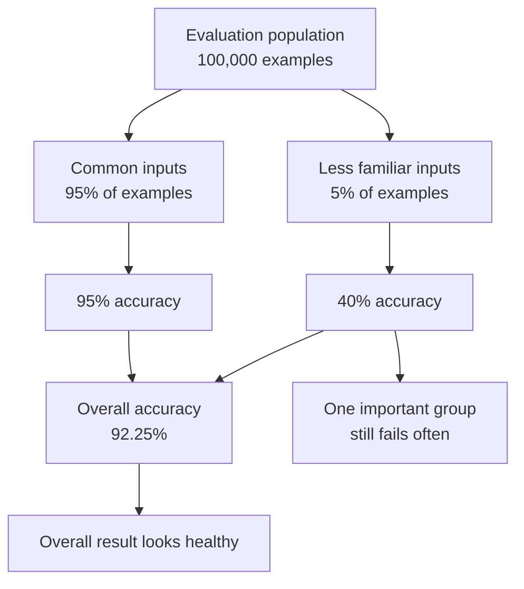
```mermaid
flowchart TD
    A["Evaluation population<br/>100,000 examples"] --> B["Common inputs<br/>95% of examples"]
    A --> C["Less familiar inputs<br/>5% of examples"]
    B --> D["95% accuracy"]
    C --> E["40% accuracy"]
    D --> F["Overall accuracy<br/>92.25%"]
    E --> F
    F --> G["Overall result looks healthy"]
    E --> H["One important group<br/>still fails often"]

    class A population
    class B,C group
    class D,E,F,G result
    class H risk
```

Segment evaluation adds detail to the overall result and keeps that broad result visible.
The full-population metric still describes broad performance.
The segment report reveals concentrated failures, and an edge-case suite checks specific situations that deserve an explicit guarantee.

A production-readiness review therefore asks three connected questions:

1. Does the candidate improve the intended population overall?
2. Does it remain acceptable across the populations and operating conditions that matter?
3. Does it handle known boundary conditions and high-consequence cases?

Those questions lead to different evidence.
The overall holdout answers the first.
Segment metrics answer the second.
Reviewed edge cases and robustness tests contribute to the third.

## Segment, Slice, Cohort, and Edge Case Mean Different Things
<!-- section-summary: Segment, slice, cohort, and edge case describe related forms of focused evaluation, yet each one answers a different question. -->

These terms are often used as if they were interchangeable.
Clear definitions let the team choose the right evidence and explain exactly what each result represents.

A **segment** is a product-relevant group of cases.
It has a reason to exist beyond the evaluation table.
Examples include new users, mortgage applications submitted through a broker, searches written in a supported language, or images produced by a particular scanner model.

A **slice** is the subset of evaluation rows used to calculate a metric.
In another term, it is the technical expression of a group.
The segment may be “short voice queries,” while the slice rule is `channel = voice AND token_count < 5`.
Evaluation tools usually work with slices because a rule can be applied consistently to a dataset.

A **cohort** groups cases through a shared starting event, exposure, or time period.
For example, users who first saw a new recommendation policy during one rollout week form a cohort.
Following that cohort over the next month can reveal delayed effects that a simple region or device segment would miss.

An **edge case** is a specific boundary condition or failure mode that the system must handle.
An empty optional field, an unseen category, and a request exactly on a policy threshold are all edge cases.
So are a daylight-saving transition and a feature-store timeout.
An edge case may affect only one fixture today and become common after a product or traffic change.

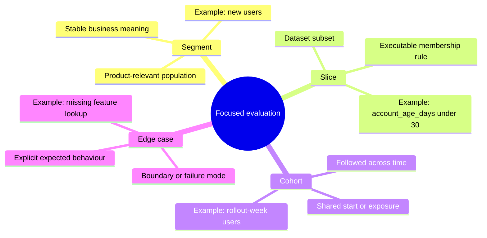
```mermaid
mindmap
  root((Focused evaluation))
    Segment
      Product-relevant population
      Stable business meaning
      Example: new users
    Slice
      Dataset subset
      Executable membership rule
      Example: account_age_days under 30
    Cohort
      Shared start or exposure
      Followed across time
      Example: rollout-week users
    Edge case
      Boundary or failure mode
      Explicit expected behaviour
      Example: missing feature lookup
```

The distinctions affect the kind of claim a team can make.
A slice metric estimates performance for rows matching a rule.
A cohort analysis studies behaviour after a shared event.
An edge-case test verifies a particular expected outcome.
Passing ten curated examples verifies those ten cases without estimating performance for the whole segment.
A segment average estimates group behaviour without proving that every known boundary case works.

Consider a document classifier:

- “Invoices from small suppliers” is a segment with product meaning.
- `supplier_size = small AND document_type = invoice` is its slice definition.
- “Suppliers onboarded through the new portal” is a cohort whose behaviour may change over time.
- “A scanned invoice rotated by 90 degrees” is an edge case that can be kept as a regression fixture.

A good review therefore needs meaningful groups, executable definitions, time-aware cohorts where relevant, and a small set of concrete failure conditions.

## Define Which Cases The Model Is Allowed To Handle
<!-- section-summary: The release population defines which cases the model is expected to serve, so every segment result has a clear denominator and scope. -->

Before choosing segments, define the **release population**.
This is the complete set of cases the proposed model is allowed to handle.

For an online risk model, the release population might include active accounts in two countries that are scored through the real-time API.
The definition could also require complete identity features and a decision horizon of thirty days.
For a forecasting model, it might include stocked products in established stores with at least twelve weeks of history.
For an image model, it might include specific device families and acquisition protocols approved for production use.

This definition sets the denominator for the overall result.
It also prevents a subtle form of overclaiming.
A model tested only on English text and modern mobile clients supplies evidence for those conditions.
Other languages and older clients remain outside the measured scope, even if they can reach the endpoint.

The release population should state:

- which entities or requests are eligible;
- which product routes and channels are included;
- which regions, languages, devices, or data sources are covered;
- which time window and label-maturity rule produced the outcomes;
- which exclusions are intentional;
- which serving policy turns the model output into an action.

The exclusions matter because the deployment must enforce them.
If low-resolution scans were excluded from evaluation, the production router needs a rule that sends those scans to a supported fallback.
An exclusion written only in a report leaves production traffic unchanged.

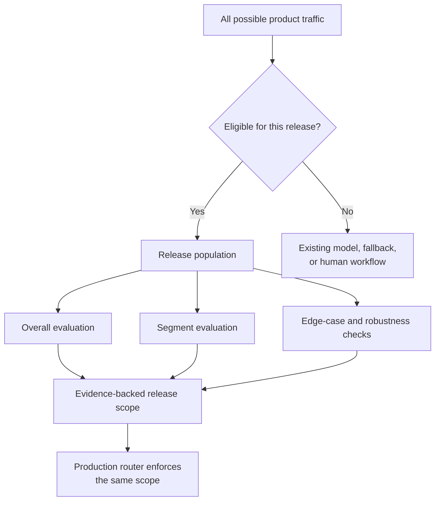
```mermaid
flowchart TD
    A["All possible product traffic"] --> B{"Eligible for this release?"}
    B -->|"Yes"| C["Release population"]
    B -->|"No"| D["Existing model, fallback,<br/>or human workflow"]
    C --> E["Overall evaluation"]
    C --> F["Segment evaluation"]
    C --> G["Edge-case and robustness checks"]
    E --> H["Evidence-backed release scope"]
    F --> H
    G --> H
    H --> I["Production router enforces<br/>the same scope"]

    class A,B traffic
    class C scope
    class E,F,G evidence
    class D,H,I action
```

In essence, release scope is a contract between evaluation and deployment.
The evaluation says where the evidence applies.
The router, policy engine, or batch selection query keeps production traffic inside that boundary.

Store the population definition with an identifier and version.
The identifier lets the candidate report, approval record, deployment configuration, and monitoring jobs refer to the same meaning.
If the business expands the population later, the team evaluates that added scope as a new question.
The older metric keeps its original meaning.

## Choose Groups From Real Product, Data, Policy, And System Boundaries
<!-- section-summary: A segment taxonomy organizes the product, data, policy, and system boundaries that can change model behaviour or user consequences. -->

After defining the release population, choose the groups that deserve separate evidence.
The strongest choices come from how the product works, how the data is produced, how decisions are made, and how the system serves predictions.

This organized set of segment dimensions is a **segment taxonomy**.
You can think of it as a map of the meaningful ways the release population can differ.
The taxonomy keeps teams from selecting whichever columns look interesting after seeing the results.

Four perspectives uncover most useful segments.

### Group Cases By Different Product Uses And Consequences

Product segments include use case, customer journey, account stage, item category, language, geography, and new-versus-returning behaviour.

For a search model, navigational queries and research queries may need different measures.
For a demand forecast, newly launched products have less history than established products.
For a triage model, a missed urgent case may carry a different consequence from a missed routine case.

The question is straightforward: **could this group experience a different benefit, harm, or workflow?**
If the answer is yes, the group may deserve separate evaluation.

### Group Cases By How The Evidence Was Produced

Data segments include source system, missingness pattern, input length, image resolution, label source, feature age, unseen-category status, and confidence in an upstream detector.

Suppose a speech model receives both studio recordings and telephone audio.
The same words appear in both groups, while the signal quality differs sharply.
An audio-source slice can reveal that the model succeeds on studio data and fails on telephone calls.

Feature availability also deserves attention.
A fraud model may behave well with complete account history and rely heavily on a fallback score for newly created accounts.
Separating complete, partially missing, and fallback-feature cases reveals that dependency.

### Group Cases By How Scores Become Actions

Policy segments include threshold bands, eligibility rules, manual-review routes, automatic-action routes, fallback paths, and different capacity constraints.

Imagine a risk score with three actions:
low scores pass automatically, middle scores receive human review, and high scores are blocked.
Errors near the two thresholds deserve explicit analysis because a small score change can alter the action.

This perspective connects model behaviour to the actual decision.
Two cases with similar prediction errors can have very different consequences if one crosses a policy boundary.

### Group Cases By Their Production Route

System segments include model route, client version, serving region, feature-source route, hardware type, and fallback status.

A candidate may appear healthy overall while one region repeatedly uses stale features.
A new mobile client may serialize an optional field differently.
A GPU route and CPU fallback may return slightly different outputs after preprocessing.

These groups often explain failures that look like model quality problems.
They also make the later production investigation much faster.

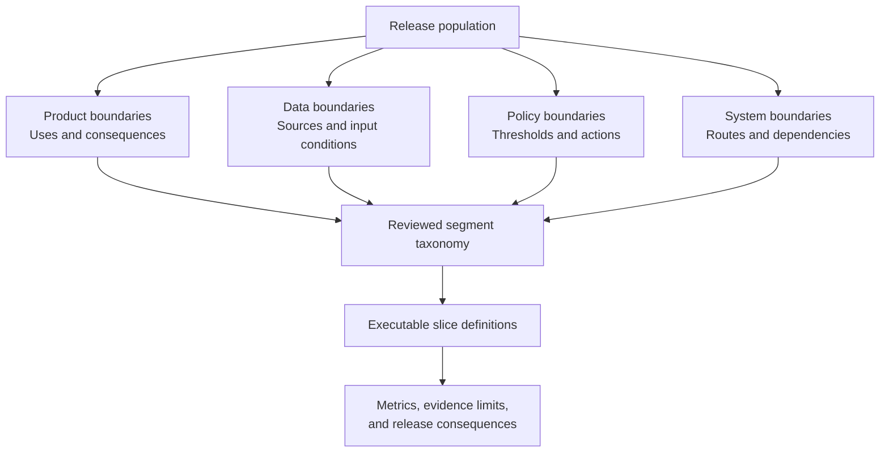
```mermaid
flowchart TD
    A["Release population"] --> B["Product boundaries<br/>Uses and consequences"]
    A --> C["Data boundaries<br/>Sources and input conditions"]
    A --> D["Policy boundaries<br/>Thresholds and actions"]
    A --> E["System boundaries<br/>Routes and dependencies"]
    B --> F["Reviewed segment taxonomy"]
    C --> F
    D --> F
    E --> F
    F --> G["Executable slice definitions"]
    G --> H["Metrics, evidence limits,<br/>and release consequences"]

    class A root
    class B,C,D,E boundary
    class F,G,H result
```

Each taxonomy entry needs an owner and an executable rule.
“New user” is too vague until the team decides whether it means fewer than 7, 30, or 90 days since registration.
“Long document” needs a unit and a boundary.
“Fallback route” needs a field recorded consistently in offline data and production telemetry.

Stable definitions make comparisons possible.
They also expose important unknown groups.
If 4 percent of requests have `language = unknown`, dropping those rows would hide a real production condition.
Treat unknown and missing values as visible categories until the team understands them.

## Check Important Group Combinations Without Flooding The Dashboard
<!-- section-summary: Intersections reveal failures caused by interacting conditions, while deliberate limits keep the review understandable and statistically credible. -->

A model can pass every one-dimensional segment and still fail on a meaningful combination.
This is why segment reviews sometimes need **intersections**, also called crossed slices.

Suppose an intent classifier performs well for Spanish queries overall and for voice queries overall.
The model may still struggle with short Spanish voice queries because speech recognition, limited context, and language coverage combine.
The intersection describes a mechanism that neither single dimension captures.

The useful rule is to cross dimensions for a reason.
Start with one-dimensional slices.
Then add a small set of two-dimensional intersections suggested by product risk, data generation, previous incidents, or a plausible failure mechanism.

Good examples include:

- locale × input-length band for a text model;
- device family × image-resolution band for a vision model;
- new-versus-returning user × missing-history status for a recommender;
- serving region × feature-source route for a real-time model;
- product category × forecast horizon for a demand model.

Crossing every available dimension creates a different problem.
Ten dimensions with several values each can produce thousands of cells.
Most will contain little evidence, some extreme results will appear by chance, and reviewers will struggle to find the few combinations that matter.

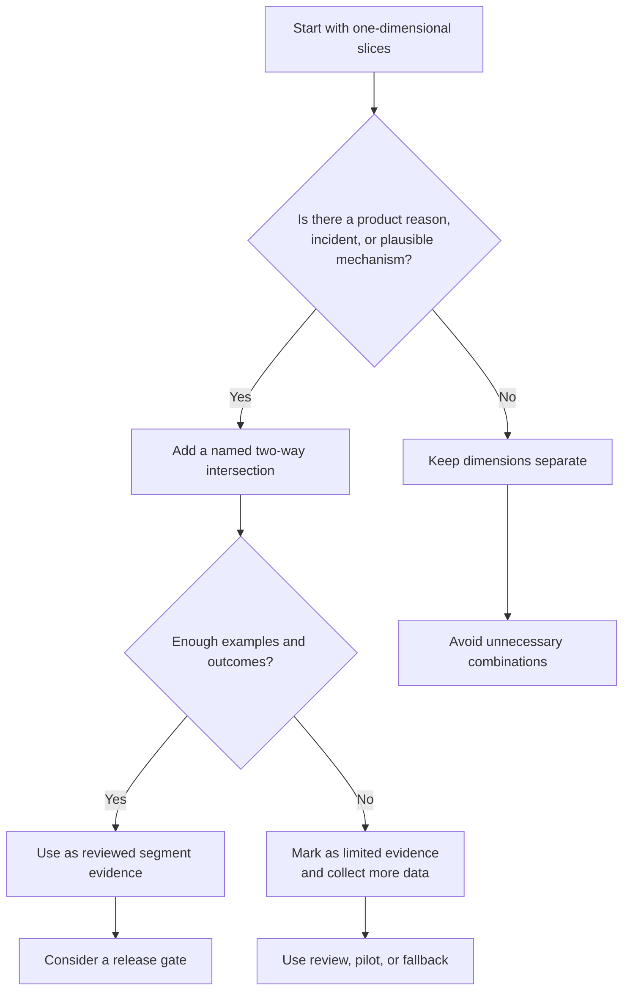
```mermaid
flowchart TD
    A["Start with one-dimensional slices"] --> B{"Is there a product reason,<br/>incident, or plausible mechanism?"}
    B -->|"Yes"| C["Add a named two-way intersection"]
    B -->|"No"| D["Keep dimensions separate"]
    C --> E{"Enough examples and outcomes?"}
    E -->|"Yes"| F["Use as reviewed segment evidence"]
    E -->|"No"| G["Mark as limited evidence<br/>and collect more data"]
    F --> H["Consider a release gate"]
    G --> I["Use review, pilot, or fallback"]
    D --> J["Avoid unnecessary combinations"]

    class A start
    class B,E question
    class C,D,F,G,J evidence
    class H,I action
```

Exploratory tools can still search more broadly for unexpected weak slices.
Those results begin as hypotheses.
A later section explains how to confirm them on fresh evidence before turning them into permanent gates.

Keep the reviewed intersection set small enough that a release reviewer can understand why each one exists.
A practical taxonomy usually carries many single dimensions and a focused group of justified intersections.
The exact number depends on the product and evidence volume.
Every retained intersection should have a traceable purpose.

## Interpret Every Segment Metric With Counts And Uncertainty
<!-- section-summary: A segment score needs counts, coverage, uncertainty, and a comparison point before it can support a release decision. -->

A segment metric can look precise even though it rests on very little evidence.
The score should therefore travel with the information needed to interpret it.

Suppose two slices both report recall of 0.84.
The first contains 1,200 positive outcomes and misses 192 of them.
The second contains 19 positive outcomes and misses 3.
The displayed recall is similar, yet the confidence in future behaviour is very different.

For each segment, preserve:

- the total number of eligible examples;
- the number of positive outcomes or other task-relevant events;
- the count behind the metric, such as true positives and false negatives;
- prediction coverage, including cases that produced no usable prediction;
- label coverage and prediction-to-outcome join coverage;
- the estimate and its uncertainty interval;
- the production or baseline result calculated on the same examples;
- the segment-definition version and evaluation-population identifier.

These fields form an **evidence bundle**.
In essence, the metric says what happened in the sample, while the surrounding evidence says how much trust that result deserves.

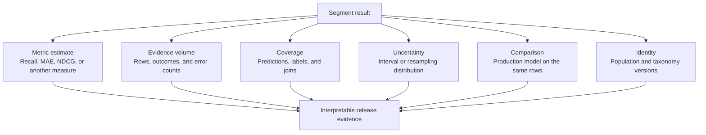
```mermaid
flowchart TD
    A["Segment result"] --> B["Metric estimate<br/>Recall, MAE, NDCG, or another measure"]
    A --> C["Evidence volume<br/>Rows, outcomes, and error counts"]
    A --> D["Coverage<br/>Predictions, labels, and joins"]
    A --> E["Uncertainty<br/>Interval or resampling distribution"]
    A --> F["Comparison<br/>Production model on the same rows"]
    A --> G["Identity<br/>Population and taxonomy versions"]
    B --> H["Interpretable release evidence"]
    C --> H
    D --> H
    E --> H
    F --> H
    G --> H

    class A result
    class B,C,D,E,F,G context
    class H decision
```

Coverage is easy to overlook.
Imagine 10,000 eligible documents, 9,700 successful predictions, and 8,100 mature labels.
If the quality report uses only the 8,000 rows that have both values, its result applies to that joined subset.
It leaves the other eligible traffic unmeasured.
The missing 2,000 rows may concentrate in one source system or document type.

Report the flow explicitly:

`eligible rows → successful predictions → mature outcomes → joined evaluation rows`

A quality metric calculated after silent row loss can look better than the service users experienced.
Failed predictions, abstentions, and unmatched outcomes need visible counts and a defined treatment.

Uncertainty also matters beyond a minimum-row rule.
The number of positive outcomes can be much smaller than the total sample.
A fraud slice with 20,000 transactions and only 12 confirmed fraud cases still provides weak evidence about recall.
For common classification rates, confidence intervals or bootstrap intervals communicate that limitation.
For ranking, regression, and repeated entities, the resampling unit should respect the data structure, such as query, user, store, or patient.

A release gate should react to uncertainty deliberately.
One policy might require the lower confidence bound to exceed a minimum.
Another may classify a small high-harm slice as `needs_more_evidence` and keep it on the existing model.
The important point is that a sparse estimate should not receive false certainty simply because a pipeline can calculate it.

## Collect Better Evidence for Rare and High-Harm Segments
<!-- section-summary: Rare and high-harm segments need targeted evidence collection, careful estimation, and safer release routes because a tiny sample cannot support a confident quality claim. -->

Some important groups will always be small in ordinary traffic.
A severe adverse event or a rare fraud pattern may appear too infrequently for a stable metric in the general holdout.
The same problem affects an unusual equipment type or a newly launched market.

The solution is to improve the evidence collection strategy.
Several methods can work together.

**Targeted sampling** deliberately collects more cases from the underrepresented group.
A document team might sample extra handwritten forms.
A vision team might collect more images from the device model associated with poor contrast.
A forecasting team might preserve more promotion weeks because ordinary weeks dominate the calendar.

**Stratified evaluation** ensures that every important segment appears in the review set.
If the sampling rate differs from production, calculate each segment metric directly.
Use sampling weights for an estimate intended to represent the full production mix.
An oversampled holdout can measure a rare segment well, while an unweighted overall average from that holdout would misrepresent normal traffic.

**Outcome maturation** waits until the truth is observable.
A credit outcome, customer renewal, or equipment failure may take weeks or months to arrive.
Declaring the small amount of early labelled data representative can create a misleading pass.

**Controlled pilots** send a bounded amount of traffic to the candidate and preserve a safe fallback.
This provides fresh evidence from the real serving path while limiting exposure.
The pilot needs monitoring, an owner, a stop condition, and a clear route back to the existing system.

**Expert review and scenario testing** help with high-harm cases that remain too rare for conventional estimates.
They can verify expected behaviour on known conditions and inspect plausible failure modes.
They do not turn a handful of examples into a population-level performance estimate.

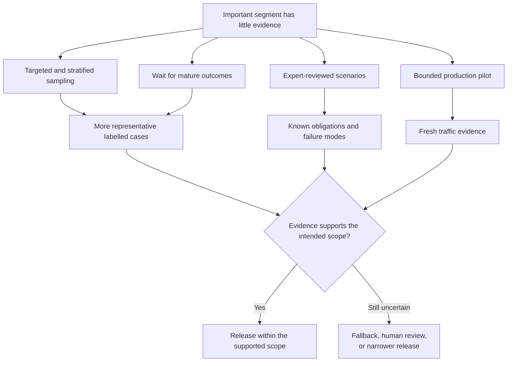
```mermaid
flowchart TD
    A["Important segment has little evidence"] --> B["Targeted and stratified sampling"]
    A --> C["Wait for mature outcomes"]
    A --> D["Expert-reviewed scenarios"]
    A --> E["Bounded production pilot"]
    B --> F["More representative labelled cases"]
    C --> F
    D --> G["Known obligations and failure modes"]
    E --> H["Fresh traffic evidence"]
    F --> I{"Evidence supports the intended scope?"}
    G --> I
    H --> I
    I -->|"Yes"| J["Release within the supported scope"]
    I -->|"Still uncertain"| K["Fallback, human review,<br/>or narrower release"]

    class A risk
    class B,C,D,E method
    class F,G,H,I evidence
    class J,K action
```

Consider a model that detects a rare manufacturing defect.
The general holdout contains only nine defective items from one production line.
The team can collect historical defect images across several lines and ask specialists to review the labels.
A shadow pilot can then compare model alerts with the current inspection process.
Until that evidence is strong enough, the model can assist inspectors while a person retains the final acceptance decision.

The release action follows both consequence and evidence strength.
A small low-consequence segment may justify a monitored pilot.
A small high-consequence segment may require the existing workflow, an abstention, or human review.
The same numerical uncertainty leads to different operational choices because the cost of a wrong decision differs.

## Treat Edge Cases as Boundary Conditions and Failure Modes
<!-- section-summary: Edge cases represent specific boundaries and failure modes that deserve an explicit expected behaviour in every candidate review. -->

An edge case is broader than an unusual demographic group.
It is any condition near the boundary of what the product, data pipeline, model, or serving system must handle correctly.

Common families include:

- empty, missing, duplicated, or out-of-order inputs;
- maximum-length text and extremely large or small numeric values;
- Unicode, mixed-language text, unusual punctuation, and right-to-left scripts;
- unseen categories and values outside the training range;
- exact ties or scores immediately around a policy threshold;
- stale features, missing feature lookups, and dependency timeouts;
- daylight-saving changes, leap days, and time-zone boundaries;
- corrupted images, unusual aspect ratios, and unsupported file metadata;
- fallback-model activation and partial batch retries.

The goal is to preserve an expected **invariant**.
An invariant is a behaviour that should remain true across model versions.
For example, a missing optional feature should trigger the reviewed fallback and keep the endpoint available.
A payment risk score at an approval boundary should follow the current policy version.
A duplicated batch record should not produce two downstream actions.

Each edge-case fixture should record the smallest amount of context needed to keep that expectation meaningful:

```yaml
case_id: missing-realtime-balance
condition:
  feature_status: unavailable
  request_shape: valid
expected:
  route: reviewed_fallback_model
  action: manual_review
  response_schema: valid
owner: risk-platform
policy_version: decision-policy-v6
failure_action: block_automatic_release
```

This fixture avoids coupling the test to one exact prediction score.
It verifies the business and system behaviour that matters: the request stays valid, follows the approved fallback, and receives human review.

Another fixture can preserve a model-specific regression.
Suppose a text classifier once treated the phrase “production is unaffected” as a severe incident.
The model had focused on the word “production.”
The reviewed fixture can require a non-urgent result and preserve the original text, expected class, incident reference, and explanation.

Edge cases come from several places:

- incidents and customer escalations;
- policy and safety reviews;
- data-schema boundaries;
- robustness tests;
- failed examples discovered during segment analysis;
- known serving and dependency failure modes.

Keep the suite readable.
Hundreds of near-duplicate cases make ownership and interpretation difficult.
Group fixtures by failure mode, preserve why each case exists, and review expectations after product policy changes.

An edge-case suite complements representative evaluation.
Passing a curated case proves that the candidate handled that case under the tested conditions.
The wider population still needs representative data before the team can estimate its error rate.

## Group Similar Errors To Find Which Layer Is Failing
<!-- section-summary: An error taxonomy turns weak segment metrics into concrete investigations across labels, data, models, policies, and serving paths. -->

A weak segment score tells the team where to look.
The cause remains unknown until the team follows the affected examples through their data and decision paths.

The next step is **example review**: inspect representative errors, correct predictions, and cases near important decision boundaries.
The review uses an error taxonomy to group observations into recurring failure patterns.

A practical taxonomy follows the prediction path:

1. **Outcome or label problem:** the recorded truth is missing, delayed, ambiguous, or based on inconsistent reviewer policy.
2. **Data capture problem:** the source omitted, truncated, corrupted, or encoded the input incorrectly.
3. **Feature or preprocessing problem:** a transformation, lookup, imputation, or category mapping changed the information.
4. **Model problem:** the model lacks coverage, relies on a shortcut, or produces poorly ranked or calibrated scores.
5. **Threshold or policy problem:** the score is reasonable, while the action boundary creates an unacceptable trade-off.
6. **Serving or fallback problem:** production uses the wrong artifact, stale features, a different preprocessing path, or an unreviewed fallback.
7. **Evaluation-join problem:** predictions and outcomes were matched incorrectly or sampled under different rules.

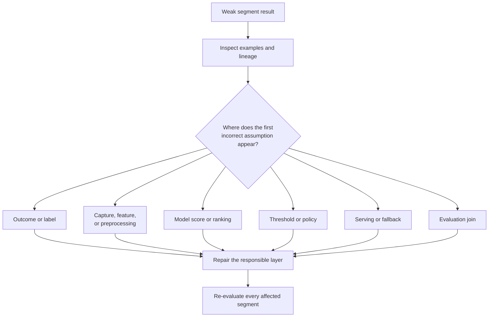
```mermaid
flowchart TD
    A["Weak segment result"] --> B["Inspect examples and lineage"]
    B --> C{"Where does the first<br/>incorrect assumption appear?"}
    C --> D["Outcome or label"]
    C --> E["Capture, feature,<br/>or preprocessing"]
    C --> F["Model score or ranking"]
    C --> G["Threshold or policy"]
    C --> H["Serving or fallback"]
    C --> I["Evaluation join"]
    D --> J["Repair the responsible layer"]
    E --> J
    F --> J
    G --> J
    H --> J
    I --> J
    J --> K["Re-evaluate every affected segment"]

    class A result
    class B,C inspect
    class D,E,F,G,H,I layer
    class J,K action
```

Suppose a recommendation model has poor click-through prediction for new users.
Reviewing only the largest errors may suggest that the model needs more capacity.
A broader sample reveals that many new-user rows have an empty interest history, and the serving system replaces that history with a popular-items fallback.
The investigation may point to the cold-start route as the responsible layer.

Now consider a loan-risk segment with unusually high false negatives.
Reviewers find that outcome labels arrive later for this segment, so many recent defaults still appear as non-defaults.
Retraining on those labels would strengthen the measurement error.
The repair belongs in outcome maturation and evaluation data, followed by a fresh model comparison.

Sample deliberately during review.
Include false positives, false negatives, correct cases, missing predictions, and scores just above and below important thresholds.
Compare several cases from the weak segment with similar cases from a strong segment.
This helps reviewers find differences in data and decision paths instead of explaining only the most dramatic failures.

Record the assigned error category, relevant feature or lineage evidence, reviewer confidence, and proposed owner.
The summary can then show that most errors come from one preprocessing rule or that several independent mechanisms are mixed inside the same segment.

## Separate Planned Release Checks From Newly Discovered Groups
<!-- section-summary: Predeclared slices can support release gates, while newly discovered slices need confirmation on fresh evidence before they become permanent rules. -->

Suppose a release report searches hundreds of possible slices after the candidate has been scored.
One small group will often appear unusually weak simply because the search created many chances to find an extreme result.
The team still wants to discover unexpected failures, yet a release gate needs stronger evidence than one surprising search result.

Segment analysis therefore has two useful modes.

**Predeclared analysis** defines the segment, metric, minimum evidence, and release consequence before the final result is reviewed.
These slices come from known product risks, policy boundaries, operating routes, and previous incidents.
They can support release gates because the decision rule was not chosen to fit the candidate’s results.

**Exploratory analysis** searches for unexpected patterns.
It may inspect more features, thresholds, and intersections than the reviewed taxonomy.
This is valuable for discovery, yet broad searches naturally produce some unusually good or bad results through chance.

Imagine scanning 500 possible slices.
One small slice shows a 15-point recall drop.
That is a useful clue.
The evidence grows stronger if the same pattern appears in a later time window, a newly labelled sample, or an untouched holdout.

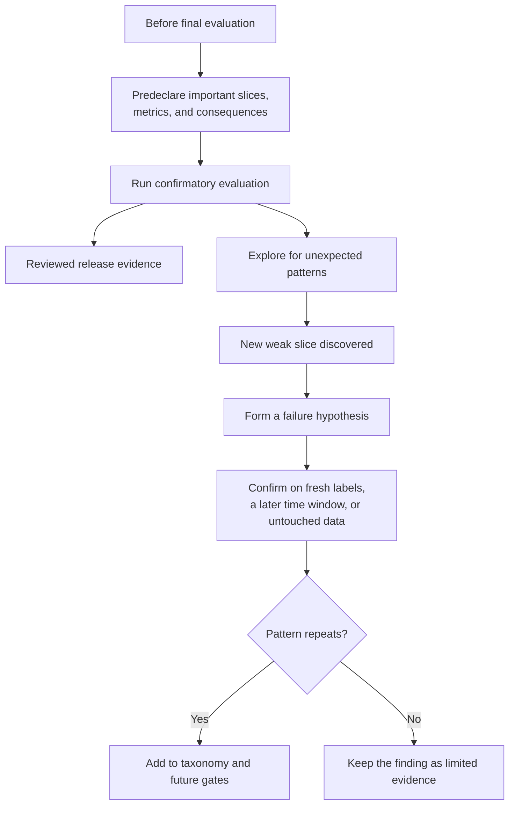
```mermaid
flowchart TD
    A["Before final evaluation"] --> B["Predeclare important slices,<br/>metrics, and consequences"]
    B --> C["Run confirmatory evaluation"]
    C --> D["Reviewed release evidence"]
    C --> E["Explore for unexpected patterns"]
    E --> F["New weak slice discovered"]
    F --> G["Form a failure hypothesis"]
    G --> H["Confirm on fresh labels,<br/>a later time window, or untouched data"]
    H --> I{"Pattern repeats?"}
    I -->|"Yes"| J["Add to taxonomy and future gates"]
    I -->|"No"| K["Keep the finding as limited evidence"]

    class A before
    class B,C,D confirm
    class E,F,G,H discover
    class I,J,K decision
```

High-consequence discoveries still deserve immediate care.
If reviewers find a plausible severe failure, the team can restrict the release or add human review.
The existing model can continue serving that route while the team gathers evidence.
The report should describe the finding honestly: a serious observed failure with uncertain population frequency.

After confirmation, promote the slice into the governed taxonomy.
Give it an owner, a stable definition, an evidence requirement, and a release consequence.
This turns one discovery into a repeatable protection for future candidates.

## Compare Candidate and Production Models on Identical Slices
<!-- section-summary: A fair segment comparison scores the candidate and production model on the same examples, definitions, labels, and operating policy. -->

A candidate-versus-production comparison should change one main object: the model or reviewed decision policy under consideration.
The surrounding evaluation rules stay aligned.

For every segment, use the same:

- eligible examples and outcome definitions;
- segment-membership function and taxonomy version;
- label-maturity and join rules;
- weighting and missing-value treatment;
- threshold or top-k policy being compared;
- metric implementation and uncertainty method.

This creates a **paired comparison**.
Each example receives a production prediction and a candidate prediction.
The segment delta comes from the same rows, so traffic mix and sample difficulty do not create the apparent difference.

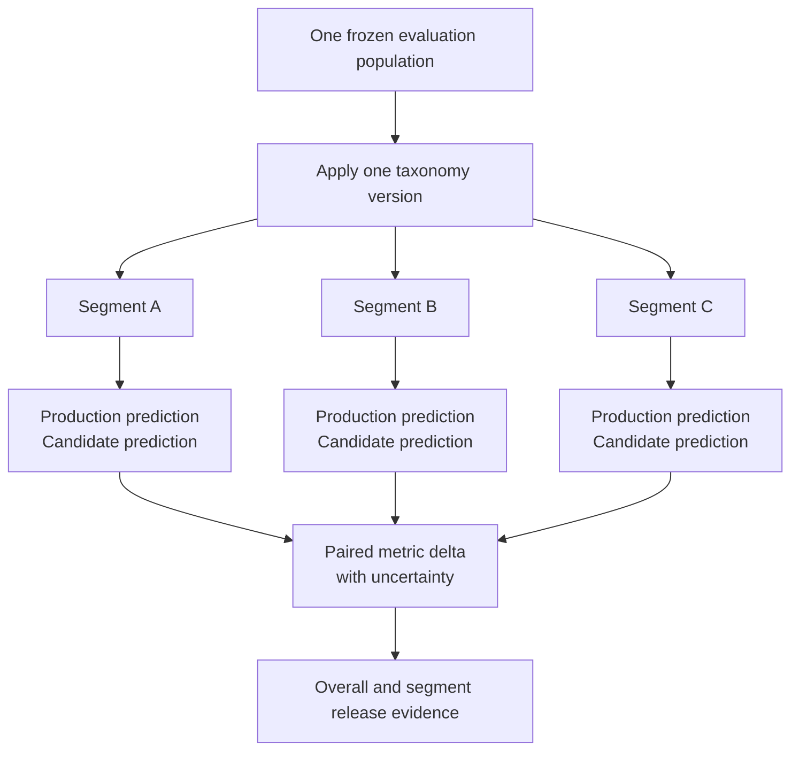
```mermaid
flowchart TD
    A["One frozen evaluation population"] --> B["Apply one taxonomy version"]
    B --> C["Segment A"]
    B --> D["Segment B"]
    B --> E["Segment C"]
    C --> F["Production prediction<br/>Candidate prediction"]
    D --> G["Production prediction<br/>Candidate prediction"]
    E --> H["Production prediction<br/>Candidate prediction"]
    F --> I["Paired metric delta<br/>with uncertainty"]
    G --> I
    H --> I
    I --> J["Overall and segment release evidence"]

    class A,B population
    class C,D,E slice
    class F,G,H,I compare
    class J result
```

Suppose the candidate’s overall recall improves by two points.
On long documents, it improves by six points.
On scanned documents, it falls by eight points.
Both models used the same document rows and slice rules.
The scanned-document regression therefore reflects changed model behaviour instead of a different sample.

Coverage changes need explicit handling.
Suppose the production model covers 99.8 percent of a segment and the candidate covers 94 percent.
Calculating quality only on successful candidate predictions hides the failed 6 percent.
Report prediction coverage beside the metric and define how abstentions or failures enter the release rule.

The candidate may intentionally change the operating point.
For example, a new threshold can increase recall and review volume together.
Evaluate the complete candidate policy and keep the old policy result visible.
Reviewers can then separate a model change from a threshold change.

## How Current Tools Calculate And Record Segment Results
<!-- section-summary: TFMA, MLflow, Evidently, and managed evaluation services can automate slice calculations after the population and taxonomy are defined. -->

The release population, group definitions, evidence fields, and decision rules form a repeatable evaluation design.
Current tools can run that design across a large dataset and keep the result with the candidate model.

Evaluation tools automate those responsibilities.
They apply declared slice rules, calculate metrics, retain per-example evidence, and publish artifacts for a release workflow.
The tool receives definitions that the team has already justified; it cannot discover the product meaning on the team's behalf.

### TensorFlow Model Analysis for declared slices and model validation

TensorFlow Model Analysis, usually shortened to **TFMA**, evaluates TensorFlow models over large datasets and can calculate metrics for declared slices.
Its `EvalConfig` records the label, metrics, models, and slicing rules used by the evaluation.

The following focused example asks for the overall result and two single dimensions: locale and input-length band.
It also asks for one deliberate intersection between locale and length:

```python
from google.protobuf import text_format
import tensorflow_model_analysis as tfma

eval_config = text_format.Parse(
    """
    model_specs { label_key: "label" }
    metrics_specs {
      metrics { class_name: "ExampleCount" }
      metrics { class_name: "Recall" }
    }
    slicing_specs {}
    slicing_specs { feature_keys: ["locale"] }
    slicing_specs { feature_keys: ["input_length_band"] }
    slicing_specs {
      feature_keys: ["locale", "input_length_band"]
    }
    """,
    tfma.EvalConfig(),
)
```

The empty slicing specification represents the overall population.
The single-feature specifications calculate every observed value for the named feature.
The final specification creates crossed slices.
TFMA documentation warns that broad crosses can be expensive, which reinforces the earlier design rule: add intersections deliberately.

TFMA can also evaluate a candidate and baseline model, apply value or change thresholds, and produce validation results.
The threshold still needs a product justification, and sparse slices still need an explicit evidence policy.

### MLflow for evaluation runs and inspectable examples

MLflow can evaluate classic machine-learning models through `mlflow.models.evaluate`.
The result exposes aggregate metrics, artifacts, and an evaluation-results table containing per-row outputs.

That table gives the team the rows needed for segment work.
The evaluation job applies governed slice definitions, calculates the report, and preserves the exact examples behind weak results.
The report can be logged with the run alongside the dataset, model, code revision, and taxonomy version.

The team still chooses the meaningful product segments.
MLflow provides a durable place to keep the evaluation run and its artifacts.
If the team creates custom metrics, aggregate values belong in run metrics and per-example values belong in evaluation tables or artifacts.

### Evidently for grouped reports and explicit tests

Evidently reports can calculate metrics over current and reference data.
Its `GroupBy` metric can split a measure by a categorical column, which works well for bounded dimensions such as region, route, or document type.

```python
from evidently import Report
from evidently.metrics import MaxValue
from evidently.metrics.group_by import GroupBy

report = Report([
    GroupBy(
        MaxValue(column="absolute_error"),
        "forecast_horizon",
    )
])
result = report.run(evaluation_data, None)
```

This example shows the largest absolute error for each forecast-horizon group.
A real release report would usually add a central error measure, counts, coverage, and uncertainty through its surrounding evaluation pipeline.

Current Evidently documentation notes that automatically generated test conditions are unavailable inside `GroupBy`.
For release gates, define reviewed conditions explicitly in the pipeline and store the result with the report.

### Managed services follow the same framework

SageMaker AI, Gemini Enterprise Agent Platform (formerly Vertex AI), Azure Machine Learning, and Databricks provide managed evaluation, registry, monitoring, and workflow capabilities.
Their APIs and integration details differ.
The design questions remain the same:

- What is the release population?
- Which segment taxonomy is governed?
- Which rows and outcomes support each metric?
- How are candidate and production results paired?
- Which release action follows a failed or uncertain segment?

Choose a tool that fits the platform already responsible for models, data, and approvals.
Avoid duplicating the same segment definitions independently across notebooks, dashboards, and deployment code.
A shared library, versioned SQL view, or governed feature transformation can keep the membership rules consistent.

## Use Segment Results To Approve, Limit, Or Reject A Release
<!-- section-summary: Segment results become useful after they lead to an enforceable release scope, fallback, review path, or request for more evidence. -->

A segment report should end with an operational decision.
The decision combines performance, uncertainty, consequence, and the system’s ability to control traffic.

Four outcomes cover many reviews:

1. **Full release:** the overall population and every required segment meet the reviewed rules.
2. **Scoped release:** the candidate passes for a defined subset, and production routing can enforce that boundary.
3. **More evidence:** an important segment has too few mature outcomes for a reliable claim.
4. **Block or fallback:** a required segment fails, a known high-consequence edge case breaks, or the deployment cannot enforce the proposed scope.

Human review is a concrete operating route with capacity and failure behaviour.
The release plan should name which cases enter review and what reviewers see.
It should also protect review capacity and define the action taken after the queue reaches its limit.

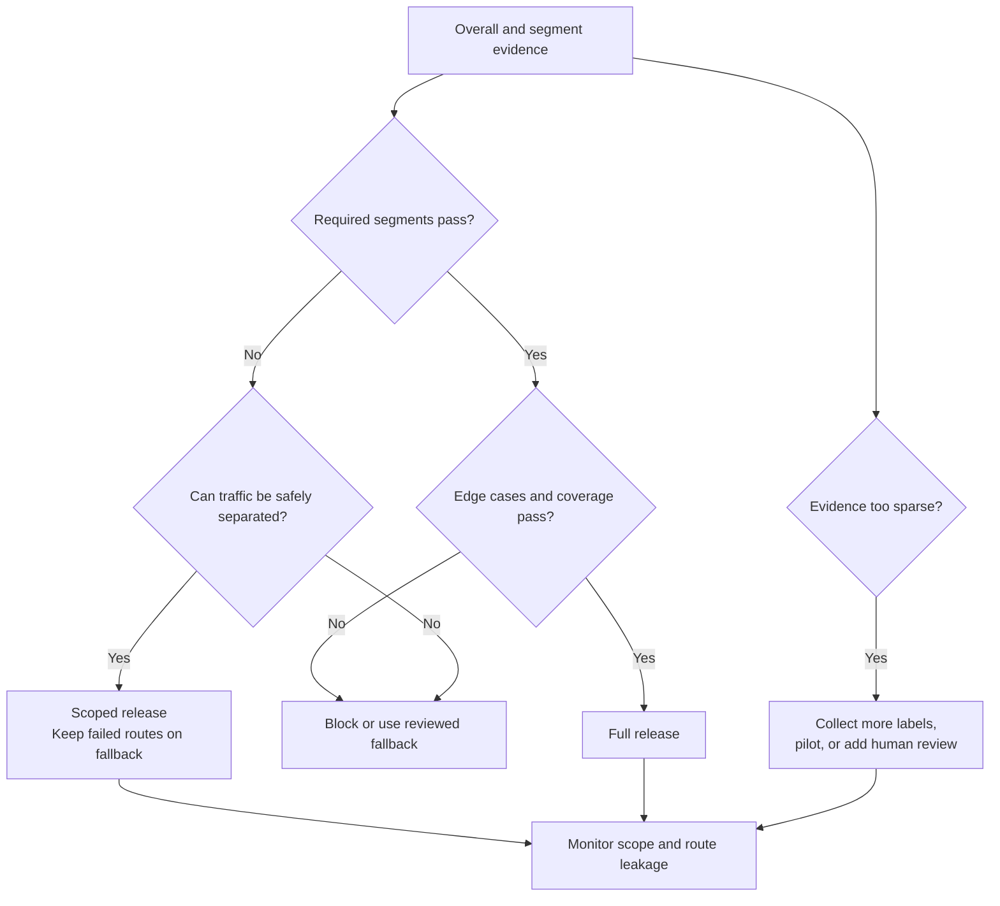
```mermaid
flowchart TD
    A["Overall and segment evidence"] --> B{"Required segments pass?"}
    B -->|"Yes"| C{"Edge cases and coverage pass?"}
    B -->|"No"| D{"Can traffic be safely separated?"}
    C -->|"Yes"| E["Full release"]
    C -->|"No"| F["Block or use reviewed fallback"]
    D -->|"Yes"| G["Scoped release<br/>Keep failed routes on fallback"]
    D -->|"No"| F
    A --> H{"Evidence too sparse?"}
    H -->|"Yes"| I["Collect more labels,<br/>pilot, or add human review"]
    G --> J["Monitor scope and route leakage"]
    E --> J
    I --> J

    class A evidence
    class B,C,D,H question
    class E,F,G,I,J action
```

Consider a vision model that passes every required segment except low-resolution images from one older device family.
The service already records device type and can route that family to the current model.
A scoped release is credible because the technical boundary matches the evaluation boundary.

Now consider a language segment inferred by an unreliable detector after the model has already run.
The report proposes excluding one language, yet the serving system cannot identify it reliably before routing.
That scope is not enforceable.
The team needs a dependable routing signal, a model repair, or a broader block.

Release configuration should refer to the population and taxonomy versions used in evaluation.
It should also define rollback or fallback behaviour.
This closes the gap between “the report excluded those rows” and “production actually protects those users.”

## Monitor The Same Segments After Release
<!-- section-summary: Production monitoring reuses the evaluation taxonomy so teams can see traffic mix, coverage, model quality, and route changes for the same populations. -->

Offline evaluation is a snapshot.
Production traffic, data sources, policies, and model routes continue to change after release.
The same segment definitions should therefore appear in production telemetry.

At prediction time, record bounded, governed fields such as:

- model and policy versions;
- release-population identifier;
- segment-taxonomy version;
- product route and model route;
- important input-condition bands;
- fallback or abstention status;
- a governed prediction identifier for later outcome joining.

The fields support two monitoring layers.

The first layer is available immediately.
It tracks traffic volume, unknown-category rate, prediction coverage, fallback rate, and route leakage by segment.
For example, a scoped release can alert if the excluded device family starts reaching the candidate route.

The second layer arrives after outcomes mature.
It repeats the relevant quality metrics by the same segment definitions and compares them with release evidence.
This reveals model decay, traffic changes, and segments whose live behaviour differs from the offline sample.

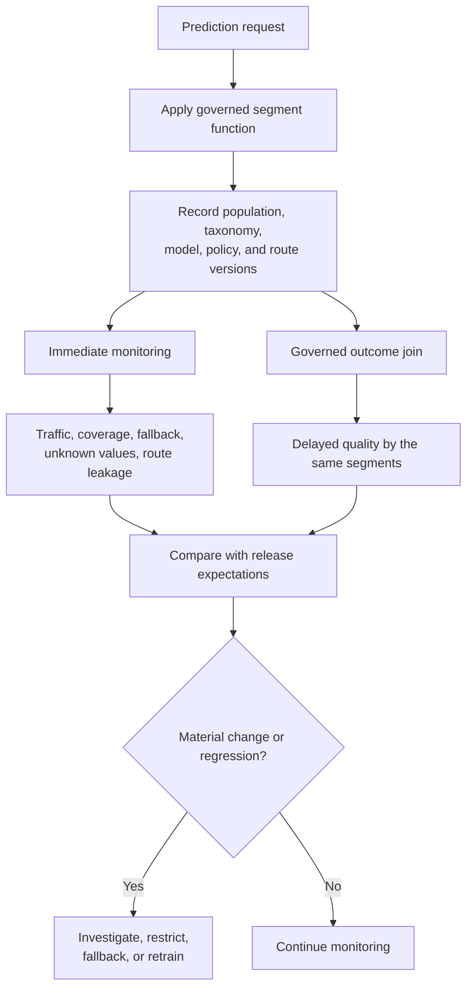
```mermaid
flowchart TD
    A["Prediction request"] --> B["Apply governed segment function"]
    B --> C["Record population, taxonomy,<br/>model, policy, and route versions"]
    C --> D["Immediate monitoring"]
    C --> E["Governed outcome join"]
    D --> F["Traffic, coverage, fallback,<br/>unknown values, route leakage"]
    E --> G["Delayed quality by the same segments"]
    F --> H["Compare with release expectations"]
    G --> H
    H --> I{"Material change or regression?"}
    I -->|"Yes"| J["Investigate, restrict,<br/>fallback, or retrain"]
    I -->|"No"| K["Continue monitoring"]

    class A request
    class B,C record
    class D,E,F,G,H,I monitor
    class J,K action
```

Keep metric dimensions bounded.
Fields such as route, region, model version, and a small set of reviewed segment values can work as metric labels.
Customer IDs, raw text, prediction IDs, and other high-cardinality or sensitive values belong in governed logs, traces, or decision records.

Taxonomy changes need migrations.
If “new user” changes from 30 days to 60 days, create a new version and run both definitions during an overlap period where practical.
This prevents a definition change from looking like a sudden model improvement or regression.

The production feedback loop also improves the taxonomy.
Unknown values, growing fallback traffic, and repeated incidents can reveal a missing segment or edge case.
The team investigates the pattern, confirms it with fresh evidence, and adds a reviewed definition for future candidates.

## The Main Idea
<!-- section-summary: Segment evaluation turns one overall score into evidence about the populations, operating conditions, and boundary cases a release must actually support. -->

An overall metric answers how the model performs across the evaluation population as a whole.
Segment evaluation asks where that result holds and where it breaks.
Edge-case testing protects specific boundaries and known failure modes.

The release population sets the first boundary for the method.
A governed taxonomy then turns product, data, policy, and system boundaries into executable slices.
Each segment result carries counts, coverage, uncertainty, and a paired production comparison.
Rare and high-harm groups receive targeted evidence collection and safer operating routes.
Example review identifies the failing layer, while edge-case fixtures preserve the expected behaviour.

TFMA, MLflow, Evidently, and managed cloud platforms can automate calculations and keep artifacts.
The product meaning, evidence policy, and release consequence still come from the team.

A complete review produces more than a dashboard.
It states where the candidate may serve, which routes need fallback or human review, and what remains uncertain.
It also tells production monitoring which definitions to continue measuring.

## References

- [TensorFlow Model Analysis: Getting started](https://www.tensorflow.org/tfx/model_analysis/get_started)
- [TensorFlow Model Analysis: Setup and slicing](https://www.tensorflow.org/tfx/model_analysis/setup)
- [TensorFlow Model Analysis: Model validations](https://www.tensorflow.org/tfx/model_analysis/model_validations)
- [MLflow: Model evaluation](https://mlflow.org/docs/latest/ml/evaluation/)
- [MLflow: Metrics API](https://mlflow.org/docs/latest/api_reference/python_api/mlflow.metrics.html)
- [Evidently: Reports](https://docs.evidentlyai.com/docs/library/report)
- [Evidently: Classification quality](https://docs.evidentlyai.com/metrics/preset_classification)
- [Evidently: Tests](https://docs.evidentlyai.com/docs/library/tests)
- [Google Cloud: Gemini Enterprise Agent Platform name changes](https://docs.cloud.google.com/gemini-enterprise-agent-platform/vertex-ai-name-changes)
- [NIST AI Risk Management Framework](https://www.nist.gov/itl/ai-risk-management-framework)
