## Table of Contents

1. [What a Fairness Review Is Trying to Learn](#what-a-fairness-review-is-trying-to-learn)
2. [Overall Quality, Group Performance, Allocation, and Representation Ask Different Questions](#overall-quality-group-performance-allocation-and-representation-ask-different-questions)
3. [Define the People, Attributes, and Intersections in Scope](#define-the-people-attributes-and-intersections-in-scope)
4. [Map the Decision and Harm Before Choosing a Metric](#map-the-decision-and-harm-before-choosing-a-metric)
5. [The Evidence Can Carry Bias Before the Model Trains](#the-evidence-can-carry-bias-before-the-model-trains)
6. [Choose Fairness Metrics From the Harm](#choose-fairness-metrics-from-the-harm)
7. [Fairness Criteria Can Conflict](#fairness-criteria-can-conflict)
8. [Read Group Results With Counts and Uncertainty](#read-group-results-with-counts-and-uncertainty)
9. [Thresholds and Product Policies Shape the Outcome](#thresholds-and-product-policies-shape-the-outcome)
10. [A Disparity Identifies a Problem, Not Its Cause](#a-disparity-identifies-a-problem-not-its-cause)
11. [Mitigation Can Change the Data, Model, Policy, or Product](#mitigation-can-change-the-data-model-policy-or-product)
12. [Use Current Fairness Tooling After the Framework Is Clear](#use-current-fairness-tooling-after-the-framework-is-clear)
13. [Handle Sensitive Attributes With Purpose and Control](#handle-sensitive-attributes-with-purpose-and-control)
14. [Turn the Review Into Governance and a Release Decision](#turn-the-review-into-governance-and-a-release-decision)
15. [Continue the Review in Production](#continue-the-review-in-production)
16. [The Main Idea](#the-main-idea)
17. [References](#references)

## What a Fairness Review Is Trying to Learn
<!-- section-summary: A fairness review asks how an ML-supported decision affects different people, why those effects differ, and whether the remaining risk is acceptable. -->

At a high level, **a fairness review asks whether an ML-supported decision distributes benefits, errors, and harms responsibly across the people it affects**.
The review studies the whole decision path: the data collected, the label chosen, the model score, the product rule, the human response, and the outcome experienced by a person.

Consider a model that prioritizes applications for limited appointments.
The model may have strong overall accuracy and still send qualified applicants from one group to the back of the queue more often.
That pattern matters because the prediction changes access to a useful service.

Now consider speech recognition.
Every user receives access to the same transcription feature, although the word error rate is much higher for one accent group.
The harm appears through poorer service quality even though appointment access is unchanged.

A third system generates profile images from text.
Its outputs may repeatedly portray leadership roles through one narrow identity.
Classification accuracy and false-negative rates provide little insight into that representation harm.
The team needs qualitative review and representation-specific measures.

These situations share a concern about unfair impact, yet they require different evidence.
Fairness is therefore a **socio-technical** question.
“Socio” refers to people, institutions, history, power, policy, and consequences.
“Technical” refers to data, models, metrics, interfaces, and production controls.
The two sides interact throughout the system.

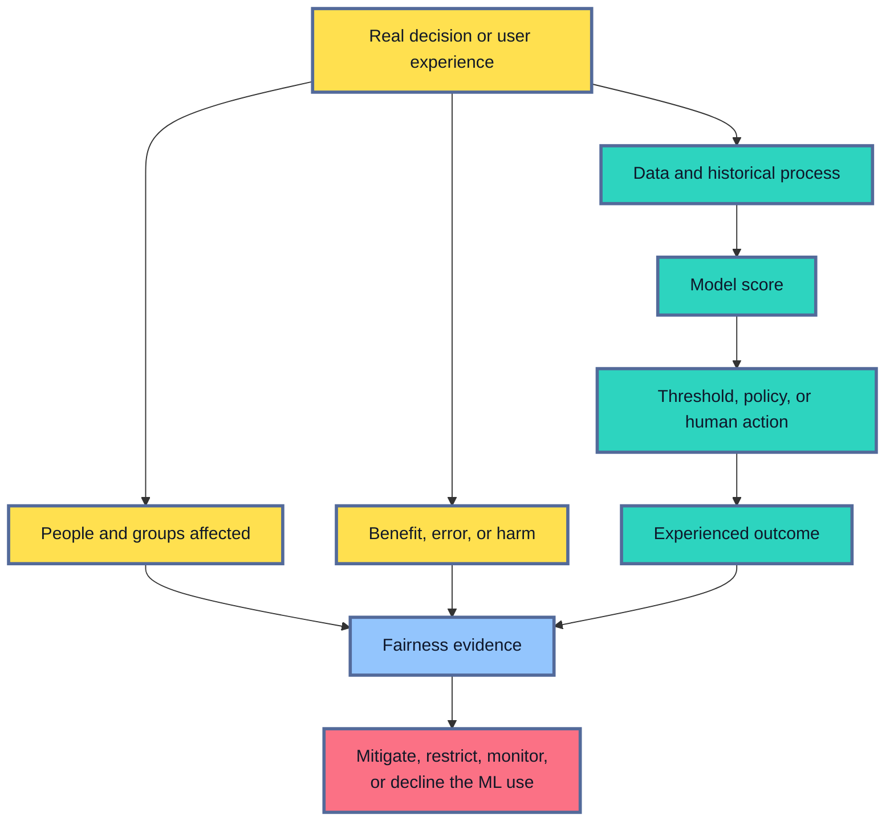

The previous segment-evaluation framework supplies the mechanics for calculating metrics on defined groups.
Fairness review adds a different responsibility.
It asks which groups and harms matter, whether the observed labels deserve trust, which fairness idea fits the decision, and who has authority to accept the remaining risk.

A numerical gap starts an investigation.
It cannot settle every fairness question by itself.
Responsible review combines quantitative evidence with domain knowledge, policy and legal analysis, feedback from affected people, and an enforceable release decision.

## Overall Quality, Group Performance, Allocation, and Representation Ask Different Questions
<!-- section-summary: Fairness concerns can involve model quality, service quality, access to benefits, exposure to burdens, or how people are represented. -->

Suppose a team sees a five-point difference between two groups.
That number could describe prediction quality, access to a benefit, exposure to a burden, or representation in generated output.
Each concern points to different evidence and a different repair.

Before choosing metrics, separate the four questions that are often mixed together.

### Overall quality describes the population as one group

Overall accuracy, recall, mean error, or ranking quality describes broad model performance.
It answers whether the model supports its main task across the evaluation population.

This remains necessary evidence.
A system with poor overall quality has a general reliability problem.
Fairness metrics cannot rescue a model that fails almost everyone.

Overall quality also hides distribution.
A speech recognizer with a 7 percent word error rate can average a 4 percent rate for one accent group and a 20 percent rate for another.
The overall score says little about the second group’s experience.

### Group performance asks who receives weaker predictions

**Group performance** compares quality or error rates across groups.
For speech recognition, the team may compare word error rate.
For a medical image classifier, it may compare sensitivity and false-positive rate.
For a demand forecast, it may compare absolute error across neighbourhoods if forecast quality shapes service levels.

This question often describes **quality-of-service harm**.
People can access the same feature while receiving substantially different quality.

### Allocation asks who receives a benefit or burden

An **allocation harm** occurs when a system helps decide who receives an opportunity, resource, service, review, restriction, or cost.
Examples include an interview, a loan review, an insurance investigation, a school place, extra identity verification, or access to a promotion.

Selection rate describes how often each group receives the positive action.
Error rates add crucial context.
If qualified applicants from one group are rejected more often, false-negative rate reveals a lost-opportunity pattern that overall selection alone cannot explain.

### Representation asks how a system depicts or recognizes people

A **representation harm** concerns visibility, stereotyping, denigration, erasure, or the way identities and cultures appear in system outputs.
Search results that repeatedly associate one group with low-status roles provide one example.
A generative system that sexualizes some identities more often provides another.

Representation review may use rating rubrics, counterfactual prompt sets, content taxonomies, expert review, and feedback from affected communities.
Confusion-matrix parity covers only the parts that can be expressed as labelled prediction errors.

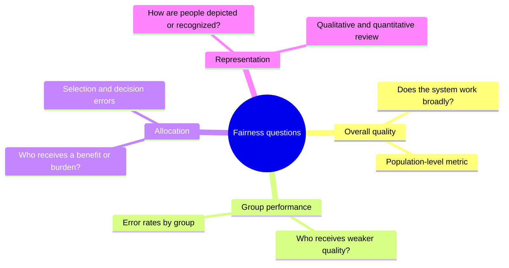

A single product can create several kinds of harm.
A content-moderation model may remove harmless posts from one community more often, which is a quality and allocation concern.
Its labels may also treat reclaimed identity language as inherently abusive, which reflects a representation and label-design concern.

Naming the concern keeps the review focused.
It also prevents a team from declaring the system fair because one convenient parity metric passed.

## Define the People, Attributes, and Intersections in Scope
<!-- section-summary: Fairness groups need a clear relationship to affected people, the decision context, and the governed attributes used for evaluation. -->

A fairness review needs to know who can benefit, who can be harmed, and who may be missing from the data.
Direct users form only part of that picture.
A fraud model affects account holders whose transactions are blocked.
A hiring tool affects applicants.
A delivery forecast can affect workers and neighbourhoods even if planners are the only people who open the software.

The group definitions usually involve **sensitive attributes**.
This broad term covers characteristics that require special care because they relate to identity, vulnerability, social disadvantage, privacy, or the harm under review.

A **protected attribute** has a legal meaning tied to a jurisdiction and context.
The applicable list and permitted uses differ across countries, sectors, and decisions.
Engineering teams should get qualified legal and privacy guidance instead of copying one generic list into every system.

The attribute used for fairness analysis also needs an honest meaning.
Self-identified gender, a category inferred from a name, and a reviewer’s perception of gender describe different things.
An image classifier that estimates perceived age supplies evidence about appearance, not a person’s verified age.
The data documentation should state how the attribute was collected, who supplied it, and which values remain unknown.

### Proxies can carry group information

A model may exclude a protected attribute and still reproduce group differences.
A **proxy** is another feature correlated with the sensitive characteristic.
Postcode can reflect residential segregation.
School name can carry information about geography and socioeconomic conditions.
Language, browsing pattern, or device type may also correlate with group membership.

Removing one column therefore leaves a wider investigation.
The team examines data history, feature meaning, model reliance, and outcome differences.
Proxy analysis needs context because correlation alone supplies no proof of an unfair mechanism.

### Intersections reveal experiences hidden by broad groups

People belong to several groups at once.
An overall result for women and an overall result for older adults can both pass while older women experience a concentrated failure.
The combined group is an **intersection**.

Fairlearn can create intersections from multiple sensitive features, and TFMA can calculate crossed slices.
The statistical challenge is the same one introduced in segment evaluation: each added dimension creates smaller groups.
Predeclare important intersections from the decision and harm map, preserve unknown values, report counts, and gather more evidence where the sample is sparse.

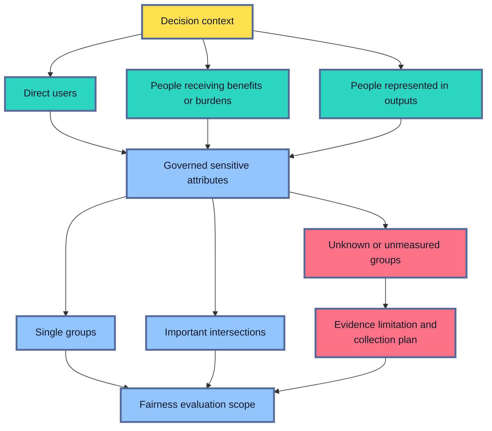

Missing attribute data creates a genuine limitation.
Inferring identity from names, images, or geography can introduce another biased model and may create privacy or legal risk.
Sometimes the responsible result is a narrower claim: the available evidence cannot measure the intended groups reliably.
The team can then pursue approved data collection, qualitative research, external evaluation, or a more cautious product scope.

## Map the Decision and Harm Before Choosing a Metric
<!-- section-summary: A fairness question connects one product decision to the affected people, beneficial action, harmful error, and human or automated response. -->

Metric names feel abstract until they are tied to a real action.
Start with one complete path from prediction to consequence.

Suppose a model scores requests for a limited support program.
High scores receive automatic priority, middle scores receive human review, and low scores enter the ordinary queue.
A false negative can delay a person who genuinely needs the program.
A false positive can consume limited capacity and delay others.
The harm may grow if the human reviewer sees only the model score and assumes it is objective.

This situation gives the fairness review several concrete objects:

- the affected population and eligibility rule;
- the beneficial action and any burdens;
- the outcome label and the time needed to observe it;
- the model score and decision thresholds;
- the false positive and false negative consequences;
- the human role, fallback, appeal, and correction path;
- the groups that may experience these effects differently.

The team can now write a plain fairness question:

“Among eligible people who genuinely need the service, how often does each reviewed group receive priority, and which groups are delayed by false negatives?”

That wording suggests true-positive rate, false-negative rate, selection rate, support counts, and review volume.
A different harm would produce another metric set.

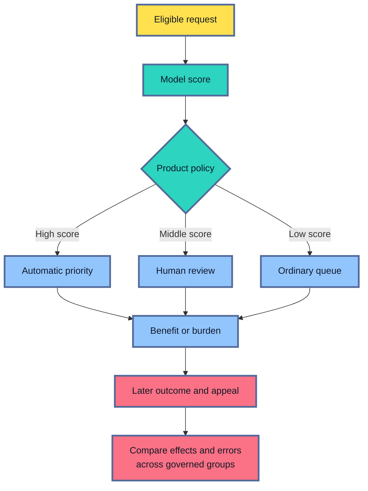

The review should also ask whether ML belongs in the decision.
A highly consequential use with unreliable labels, no appeal, and no safe fallback may deserve a manual or rules-based workflow.
NIST AI RMF treats the choice to proceed with an AI system as part of risk management, including the option to avoid or transfer risk.

Fairness requirements should be set before the final candidate result appears.
Product, domain, policy, privacy, legal, and affected-stakeholder perspectives may all be needed.
The result is a reviewed harm-and-measurement plan, not a metric chosen by whichever model currently scores best.

## The Evidence Can Carry Bias Before the Model Trains
<!-- section-summary: Historical decisions, labels, sampling, and measurement can create group differences that a model learns or that an evaluation hides. -->

A model learns from records created by an earlier process.
Those records can already contain unequal treatment or incomplete observation.
Training faithfully on them may reproduce the process with greater scale and consistency.

### Historical decisions can shape the label

Suppose a hiring dataset uses “received a strong annual review” as the target.
Only people who were hired and remained long enough can receive that label.
Previous screening, team assignments, manager support, workplace access, and promotion opportunities all influenced the recorded outcome.

The label therefore describes success inside a historical system.
It is not a pure measurement of talent available before hiring.

The same issue appears in lending.
Repayment is observed for approved applicants and usually unknown for rejected applicants.
This is sometimes called a **selective-label problem**: the old decision controls which outcomes become visible.
A model trained on approved loans alone may have weak evidence about people whom the older policy excluded.

### Labels can encode inconsistent judgment

Human labels often represent policy and interpretation.
Content reviewers may disagree about sarcasm, reclaimed slurs, or dialect.
Medical labels can vary across facilities because testing and diagnosis access differs.
Customer-risk labels may treat a delayed payment and a fraudulent payment as the same event.

Measure agreement and disagreements by group where possible.
Review the label guide, annotator coverage, escalation rules, and policy versions.
A fairness gap built from inconsistent labels may describe the labelling process as much as the model.

### Sampling can leave some experiences almost invisible

Training and evaluation data may underrepresent a device, language, disability-related interaction, or service channel.
The number of rows alone provides limited reassurance.
The sample also needs the relevant range of conditions and enough positive outcomes to measure the harmful error.

Targeted collection and stratified evaluation can strengthen the evidence.
Sampling weights may be needed for full-population estimates if the fairness set intentionally oversamples smaller groups.

### Measurement can work differently across groups

A feature or outcome may have unequal measurement quality.
Wearable sensors can perform differently across skin tones or movement patterns.
Address history may be less complete for people with unstable housing.
A resume parser may recognize one credential format and miss another.

These are measurement problems in the system feeding the model.
Feature importance alone will not reveal whether the source measurement is valid.

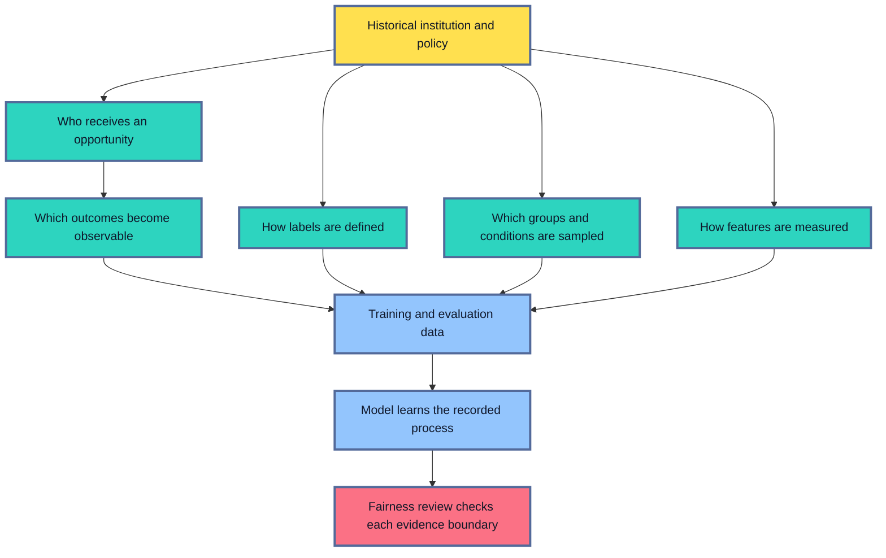

An evidence review records where each field came from, who was excluded, how outcomes mature, and which historical policy produced the labels.
If the label cannot support the fairness question, another metric calculation will not repair the foundation.
The team needs better outcomes, a different study design, a narrower use, or a decision to avoid the model.

## Choose Fairness Metrics From the Harm
<!-- section-summary: Fairness metrics compare different aspects of decisions, so the appropriate measure follows the benefit, burden, and harmful error in the product. -->

Suppose two groups receive positive decisions at different rates.
The gap alone cannot tell the team whether to align selection rates, qualified-person recall, false-positive rates, precision, or probability meaning.
The decision and its harmful errors determine which comparison deserves priority.

Fairness metrics express a specific idea about which quantities should align across groups.
Each one protects a different concern.

### Selection-rate parity focuses on access to the predicted action

**Demographic parity** asks whether groups receive the positive prediction at similar rates.
In probability notation, it compares `P(prediction = positive | group)`.
The calculation uses predictions and group membership without an outcome label.

This can be informative if the positive prediction directly allocates a benefit and the allocation rate itself is under review.
For example, a team may examine who receives invitations to a limited opportunity.

Selection parity alone leaves qualification and error patterns unexplained.
Groups may have different observed outcome rates because of history, measurement, or other causes.
A matching selection rate can also hide higher false negatives in one group.

### Equal opportunity focuses on qualified people who receive the benefit

**Equal opportunity** compares true-positive rates across groups.
Among people labelled positive, it asks how often the system predicts positive.

For an appointment-priority model, this can represent how often people who genuinely need the service receive priority.
The complementary false-negative rate shows how often each group loses that opportunity.

This criterion depends on the label.
If “genuinely needs the service” is measured inconsistently across groups, equal-opportunity results inherit that problem.

### Equalized odds protects both types of classification error

**Equalized odds** asks for similar true-positive rates and false-positive rates across groups.
It therefore considers missed benefits and incorrectly assigned benefits or burdens.

A fraud system may use it to examine both missed fraud and legitimate payments incorrectly blocked.
The criterion is demanding because threshold changes often move the two error rates in opposite directions.

### Predictive parity asks what a positive decision means

**Predictive parity** compares precision across groups.
Among people who receive a positive prediction, it asks how often the positive outcome occurs.

This matters when a score or alert carries a claim of risk.
If two groups receive the same “high risk” label and the observed event rate differs sharply, downstream reviewers may interpret the alert differently.

### Calibration asks whether probabilities keep the same meaning

A score is **calibrated within groups** if cases assigned a probability near 0.7 experience the outcome about 70 percent of the time in each group.
Calibration matters when the probability itself drives pricing, staffing, communication, or several thresholds.

Calibration should be checked across the score range.
One average calibration error can hide a poorly calibrated band near the action boundary.

### Individual and representation questions need other evidence

**Individual fairness** asks whether similar people receive similar decisions.
Its difficulty lies in defining “similar” without encoding the same unfair assumptions under review.

Representation harms may need structured human evaluation, output taxonomies, counterfactual prompt tests, and community feedback.
Their evidence rarely reduces to one confusion-matrix statistic.

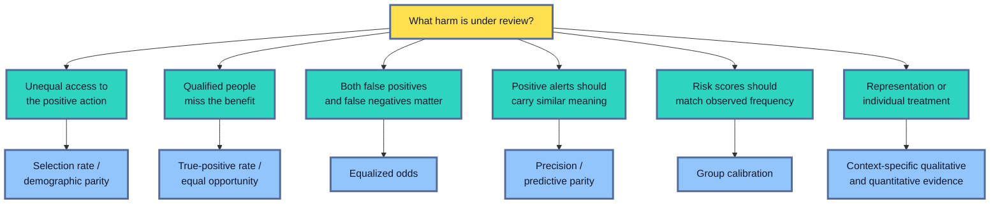

Differences and ratios summarize gaps.
A difference of zero means the compared rates match.
A ratio of one means they match.
Neither value supplies a universal fairness threshold.
The release rule needs a justification based on consequence, uncertainty, policy, legal requirements, and the limits of the metric.

## Fairness Criteria Can Conflict
<!-- section-summary: Several fairness criteria cannot generally hold together when groups have different observed outcome rates and the model makes errors. -->

Teams often hope to choose every fairness metric and require all of them to match.
That goal can be mathematically impossible unless the model is nearly perfect or groups have the same observed outcome rate.

Imagine two groups with different recorded base rates for an outcome.
The model is calibrated in both groups, so a score of 0.8 corresponds to an outcome rate near 80 percent in each group.
Now apply one threshold.
The score distributions can produce different false-positive and false-negative rates.

Changing group thresholds can align error rates.
Those changes may break calibration among the people receiving the positive decision or change selection rates.
Improving one parity criterion can therefore move another criterion away from equality.

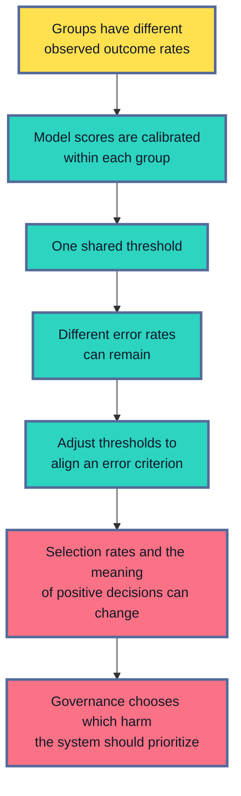

The conflict is a reason to make the value choice explicit.
For a screening tool, reviewers may prioritize equal opportunity because missed qualified people carry the central harm.
For a fraud alert used by investigators, false-positive parity may receive more weight because unnecessary investigation creates a serious burden.
A risk score used as a probability may need calibration as a core requirement.

The observed base rates also deserve investigation.
They may reflect genuine differences relevant to the decision, unequal access to earlier opportunities, selective labels, or measurement bias.
Treating the rate as unquestioned ground truth can make the metric choice appear more objective than it is.

A responsible report therefore presents the chosen criterion, competing metrics, overall utility, and who accepted the trade-off.
It avoids a leaderboard where the “fairest” candidate is simply the model that wins one selected number.

## Read Group Results With Counts and Uncertainty
<!-- section-summary: Fairness gaps need denominators, outcome counts, coverage, and uncertainty before they can support a release claim. -->

Group metrics inherit every evidence requirement from segment evaluation.
Fairness adds greater stakes because small or missing groups may represent people whose experience is already overlooked.

Suppose a report shows true-positive rates of 0.82 and 0.68 for two groups.
The first rate comes from 2,400 positive outcomes.
The second comes from 19.
The observed gap deserves attention, while the second estimate has substantial sampling uncertainty.

Every group row should carry:

- total eligible cases;
- positive and negative outcome counts;
- true positives, false positives, true negatives, and false negatives;
- prediction, attribute, label, and join coverage;
- the metric estimate and uncertainty interval;
- the comparison group or overall result;
- the attribute source and group-definition version.

Intersectional groups can quickly become sparse.
A group with no positive outcomes cannot supply a meaningful true-positive rate.
Reporting `0`, silently dropping the row, and treating the metric as “not applicable” communicate different things.
Use an explicit insufficient-evidence state and preserve the counts.

Fairlearn’s `MetricFrame` supports bootstrap confidence intervals.
Bootstrap resampling repeatedly samples evaluation rows and recalculates the metric, which estimates how much the result changes across similar samples.
Repeated observations from one person or institution require cluster-aware resampling outside a simple row bootstrap.

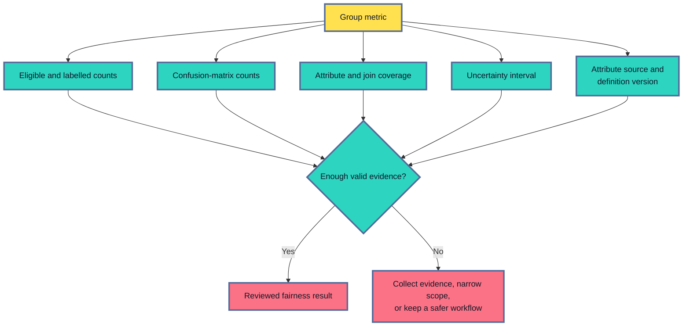

Small samples should not receive an automatic pass.
They also should not receive a confident population-level failure label from a few rows.
A high-consequence observed failure can justify precautionary containment while targeted collection, external review, or a controlled pilot strengthens the estimate.

Broad exploratory searches create another uncertainty problem.
If hundreds of groups and intersections are scanned, some extreme gaps will appear through chance.
Predeclared fairness groups can support gates.
Newly discovered groups need confirmation on fresh data, with immediate containment available for plausible high-severity harm.

## Thresholds and Product Policies Shape the Outcome
<!-- section-summary: The model score, decision threshold, human workflow, and fallback policy jointly determine who receives a benefit or burden. -->

A model commonly produces a score.
The product decides what that score does.
The same model can create different fairness outcomes under different thresholds and workflow rules.

Suppose a support program prioritizes cases above 0.7.
One group’s qualified cases cluster between 0.60 and 0.72, while another group’s qualified cases cluster between 0.75 and 0.90.
A shared threshold creates a larger false-negative rate for the first group.

Lowering the threshold can recover more qualified cases from both groups.
It may also increase false positives and overwhelm human reviewers.
Changing the model without testing the queue would move the harm into a capacity failure.

Group-specific thresholds can align one parity criterion in some settings.
They require sensitive attributes at decision time and can change how otherwise similar cases are treated.
Their use may conflict with law, policy, privacy constraints, or the product’s fairness goals.
Qualified legal and governance review is essential before adopting them.

The surrounding product offers other controls:

- send uncertain cases to a trained reviewer;
- use a common fallback for groups with insufficient evidence;
- add an appeal and correction route;
- hide the model score from reviewers if it creates automation bias;
- enforce review capacity and queue-age limits;
- remove automatic rejection while retaining model-assisted prioritization;
- decline the model if no acceptable policy can control the harm.

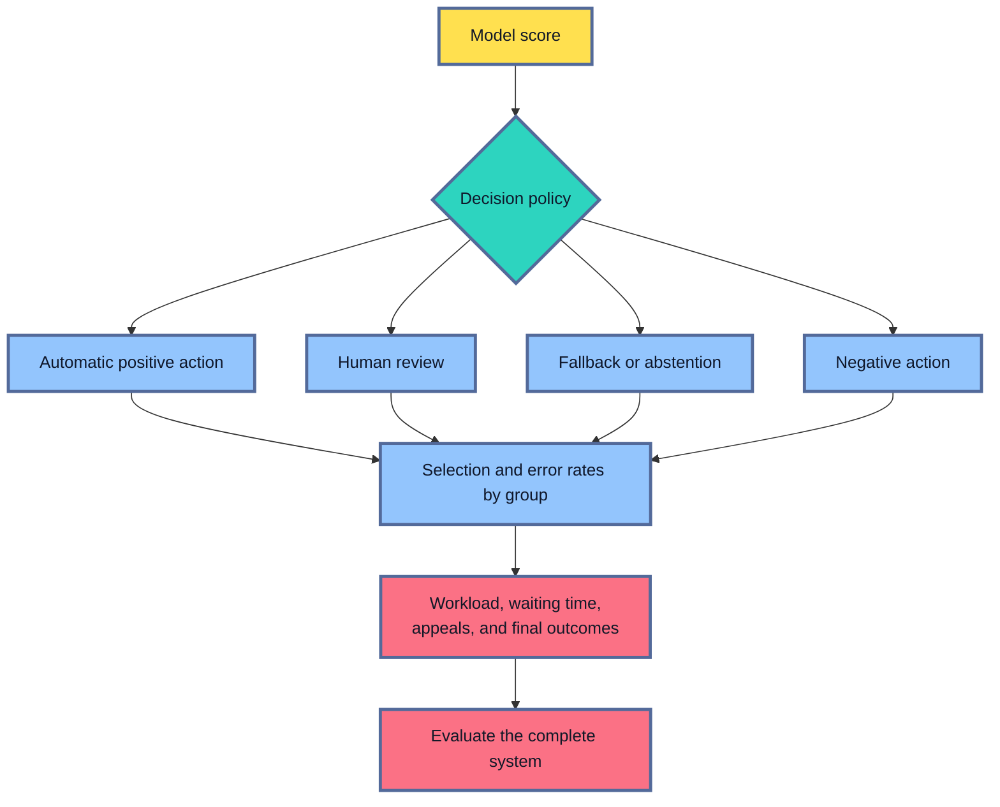

Evaluate the candidate with the exact production policy.
Compare group metrics, overall utility, workload, deferrals, coverage, and appeal outcomes.
If a mitigation relies on human review, load-test the review queue and define the safe response after capacity is exhausted.

The policy version belongs in the fairness report.
A threshold change, staffing change, or new fallback can alter experienced fairness even if the model artifact stays fixed.

## A Disparity Identifies a Problem, Not Its Cause
<!-- section-summary: Group gaps are descriptive evidence, so diagnosis follows the data, labels, model, policy, and human workflow before choosing a repair. -->

A group gap says that outcomes differ under the evaluated system.
The mechanism remains unknown until the team traces the affected examples through the system.

Suppose a resume classifier has a higher false-negative rate for applicants using one language.
Several causes are possible:

- the training set has fewer examples in that language;
- the parser drops qualifications expressed through an unfamiliar format;
- the label guide rewards one style of work history;
- a proxy feature reflects an earlier unequal screening process;
- the threshold interacts with less calibrated scores;
- reviewers correct errors for one group more often;
- the evaluation join loses outcomes from one application channel.

The investigation traces examples through each layer.
Review false positives, false negatives, correct cases, missing predictions, and scores near the action boundary.
Compare similar cases across groups and inspect feature lineage, parser output, label provenance, model explanations, policy route, and final human action.

Explanations such as SHAP values show how model features contributed to a prediction under the fitted model.
They can reveal reliance on school name or document format.
They do not prove that the feature caused the real-world outcome or that removing it will improve fairness.

Counterfactual testing also needs care.
Changing an identity word in a text prompt can reveal model sensitivity to that token.
Changing a recorded protected attribute in a tabular row leaves the person’s lived history and social context untouched.
Many associated experiences, opportunities, and measurements remain unchanged.

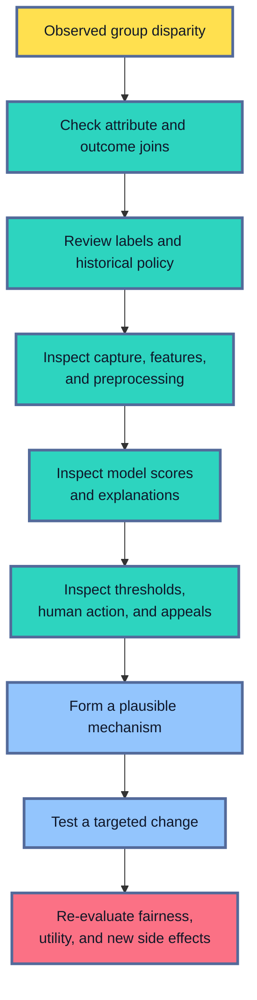

Quantitative analysis should be joined by domain knowledge and feedback from affected people.
A community may identify a burden that the current telemetry never records.
Appeals and complaints can expose harmful edge cases, confusing explanations, and missing groups.

Diagnosis ends with a testable mechanism and an owner.
“The model is biased” is too broad for remediation.
“The parser omits contractor credentials used more often in this group” names a data transformation, a concrete repair, and evidence that can prove recovery.

## Mitigation Can Change the Data, Model, Policy, or Product
<!-- section-summary: Fairness mitigation targets the layer that creates the harm and then verifies both the intended improvement and any new trade-offs. -->

Suppose the investigation finds that a parser drops qualifications written in one credential format.
Retraining with a fairness constraint would leave that information missing.
Changing the parser and rebuilding the evaluation rows targets the responsible layer.

Fairness mitigation follows the same principle across the system.
The repair should match the mechanism found during diagnosis.

### Data and label mitigation repairs the evidence

Data work can add underrepresented conditions, improve attribute coverage, correct parsing, revise a label guide, use multiple reviewers, or gather outcomes that the old policy never observed.

Reweighting and resampling can give underrepresented group-and-label combinations more influence during training.
These techniques change the training objective.
They cannot correct an invalid label or create information absent from the source.

Suppose a speech model underperforms on a device-and-accent intersection because the training set contains little audio from that combination.
Targeted collection, audio-quality review, and a stratified evaluation set address the identified coverage gap.
Recovery evidence includes improved word error rate for the intersection, stable performance elsewhere, and production tests on the actual device route.

### Model mitigation changes the optimization problem

Fairlearn includes reduction algorithms such as `ExponentiatedGradient`.
They turn constraints such as demographic parity or equalized odds into a sequence of weighted learning problems for a compatible estimator.
AIF360 also provides in-processing algorithms that incorporate fairness objectives during training.

The chosen constraint encodes a value decision.
The team should compare the resulting fairness metric, overall utility, calibration, group-specific errors, and operational cost.

### Post-processing changes decisions after scoring

Fairlearn’s `ThresholdOptimizer` and AIF360 post-processing algorithms can adjust decisions to satisfy a selected parity constraint.
This can work with an existing model and avoids retraining.

The trade-offs are substantial.
The decision path may need sensitive attributes at inference time.
The transformation can change calibration, selection volume, and treatment near the boundary.
Deployment must reproduce the post-processing rule exactly, and governance must approve its use.

### Product mitigation changes the surrounding workflow

Some harms are best controlled through the product.
The system can abstain on unsupported cases, route them to a trusted workflow, present uncertainty to trained reviewers, add an appeal, or remove automation from a high-consequence action.

For a small group with weak evidence, keeping the existing manual process may provide safer containment while approved data collection continues.
The release router must enforce that boundary, and monitoring must detect route leakage.

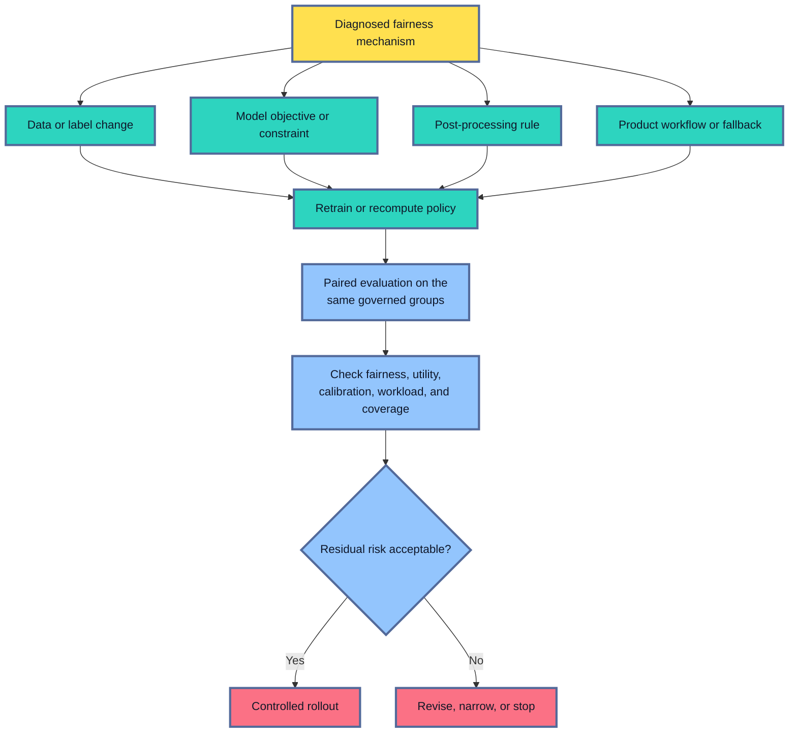

Every mitigation needs a regression review.
Improving true-positive-rate parity can increase false positives or lower overall benefit.
Improving one intersection can hurt another.
A fairer model score can still produce unfair outcomes if the product policy, human workflow, or access barriers remain unchanged.

Roll out the complete change through a bounded pilot or staged release.
Define success, stop conditions, fallback, review capacity, and the mature outcomes needed for confirmation.

## Use Current Fairness Tooling After the Framework Is Clear
<!-- section-summary: Fairlearn, TFMA Fairness Indicators, AIF360, and managed platforms automate group evidence and mitigation after the team has defined the fairness question. -->

Once the team has defined the decision, harms, groups, metrics, evidence limits, and release consequences, tools can run the analysis consistently.
They calculate group results and preserve artifacts.
They cannot choose the ethical or legal meaning of fairness for the product.

### Fairlearn supports assessment and mitigation

Fairlearn’s `MetricFrame` calculates ordinary performance metrics for each sensitive group and important intersection.
It can also report differences, ratios, worst-group values, and bootstrap confidence intervals.

The following example evaluates selection rate, true-positive rate, and false-positive rate across the intersection of two approved attributes.
The output contains one row for every observed combination, plus bootstrap intervals.

```python
from fairlearn.metrics import (
    MetricFrame,
    count,
    false_positive_rate,
    selection_rate,
    true_positive_rate,
)

assessment = MetricFrame(
    metrics={
        "count": count,
        "selection_rate": selection_rate,
        "true_positive_rate": true_positive_rate,
        "false_positive_rate": false_positive_rate,
    },
    y_true=evaluation["outcome"],
    y_pred=evaluation["decision"],
    sensitive_features=evaluation[["review_group", "age_band"]],
    n_boot=500,
    ci_quantiles=[0.025, 0.975],
    random_state=42,
)

group_metrics = assessment.by_group
lower, upper = assessment.by_group_ci
largest_gaps = assessment.difference()
```

The `count` column shows evidence volume.
`by_group_ci` returns the requested lower and upper bootstrap quantiles.
The release artifact should also include outcome counts, coverage, the attribute source, and the policy version because `MetricFrame` receives only the joined rows supplied to it.

Fairlearn also provides mitigation algorithms including reductions and threshold optimization.
Use them after the team has justified a fairness constraint and can deploy the resulting policy.
The old Fairlearn notebook dashboard is no longer developed; current Fairlearn guidance points dashboard users toward the Responsible AI Toolbox while retaining the metrics and plotting APIs.

### TFMA Fairness Indicators fits repeated pipeline evaluation

Fairness Indicators is built on TensorFlow Model Analysis, or **TFMA**.
It computes classification metrics across declared slices and several thresholds, which helps teams see how a decision boundary changes group outcomes.
TFMA can run distributed evaluation over large datasets and fit into a TFX or other orchestrated pipeline.

The slice configuration should come from the governed fairness plan.
Use the overall slice, reviewed sensitive groups, and justified intersections.
Preserve counts and confidence intervals, and keep the resulting report with the candidate model and evaluation data identity.

Fairness Indicators focuses on quantitative classifier evidence.
Representation harms, historical-label validity, lawful attribute use, and product governance still require other methods and owners.

### AIF360 offers a broad assessment and mitigation toolkit

IBM’s AI Fairness 360, usually called **AIF360**, provides datasets, group and individual fairness metrics, explainers, bias detectors, and algorithms across preprocessing, in-processing, and post-processing.
Its scikit-learn-compatible APIs can fit familiar experimental workflows.

AIF360 is useful for comparing mitigation families and investigating how a metric changes under different interventions.
The production data pipeline still validates and versions the inputs.
CI reruns the chosen evaluation, while the approval workflow records the result.
Deployment and monitoring then reproduce the reviewed model and policy.

### Managed cloud tools need a lifecycle check

Azure Machine Learning’s Responsible AI dashboard includes cohort analysis, error analysis, model performance, interpretability, and fairness assessment for supported models.
It can help teams inspect sensitive groups and share reviewed evidence inside an Azure ML workflow.
Its fairness assessment uses categorical sensitive attributes, so continuous or more complex identity measures need a separate evaluation design.
The fairness metric and target still come from the team’s harm analysis.

Amazon SageMaker Clarify can calculate pre-training and post-training bias metrics and model explanations for existing customers.
AWS has closed Clarify to new customer access and states that the service will receive no new features.
New AWS designs should use an available open-source evaluation job or another supported service and store governed results with the model approval evidence.

Managed dashboards reduce integration work.
An exported scorecard or chart remains an artifact from one evaluation.
The organization still owns data validity, privacy, metric choice, release authority, mitigation, and production follow-through.

## Handle Sensitive Attributes With Purpose and Control
<!-- section-summary: Sensitive attributes need a documented purpose, lawful handling, restricted access, safe reporting, and deletion or retention rules. -->

Fairness evaluation may need attributes that the prediction service should never use as model features.
That creates a deliberate separation between the **decision path** and the **evaluation path**.

The prediction service can operate on approved model features.
A restricted evaluation job joins prediction records, mature outcomes, and sensitive attributes inside a governed environment.
Only authorized reviewers receive approved aggregate results.

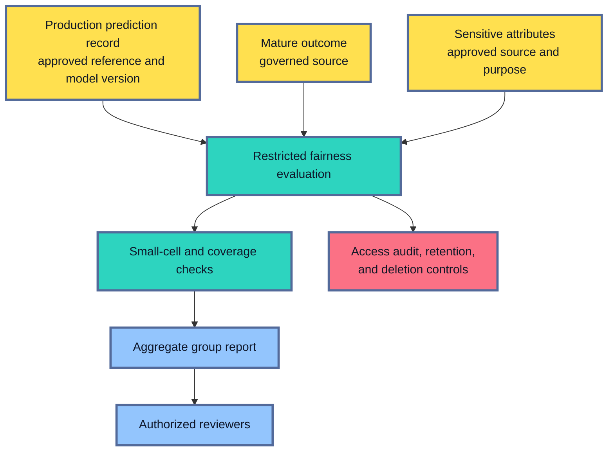

The data plan should answer:

- why each attribute is needed;
- which legal basis, consent, policy, or research approval applies;
- whether the attribute was self-reported, inferred, or observed;
- who can access row-level values;
- where joining and aggregation run;
- which small-group outputs are suppressed;
- how long source and derived data remain;
- how corrections and deletion requests propagate;
- which audit records prove that the controls operated.

Use governed identifiers to join approved sources.
Avoid placing raw sensitive attributes, names, free text, or prediction payloads in broad MLflow artifacts, logs, traces, or metric labels.
Encryption and hashing reduce some exposure while leaving purpose, access, retention, and re-identification risks to manage.

Aggregate reporting also needs care.
A table with three people in one intersection can reveal sensitive information even without names.
Apply reviewed minimum-cell rules and role-based access.
Record suppressed groups as evidence limitations.
Without that record, privacy protection can accidentally appear as a fairness pass.

Local law and organizational obligations vary.
Privacy, legal, security, domain, and affected-stakeholder review should shape collection and use before the evaluation pipeline is deployed.

## Turn the Review Into Governance and a Release Decision
<!-- section-summary: Fairness evidence needs accountable owners, documented trade-offs, an enforceable product scope, and authority to stop or narrow a release. -->

A fairness report has little force if every gap ends with “monitor after launch.”
The review needs owners and release authority.

NIST AI RMF organizes risk work through four connected functions:

- **Govern** establishes policies, roles, accountability, and oversight.
- **Map** describes the use context, affected people, benefits, harms, and risk tolerance.
- **Measure** evaluates documented risks with quantitative and qualitative evidence.
- **Manage** prioritizes responses, tracks residual risk, and decides whether deployment should proceed.

The functions describe a continuing risk process.
They also show why metric calculation alone is incomplete.
NIST describes the framework as voluntary and is revising it, so governance teams should track the current NIST material while keeping their internal controls versioned.

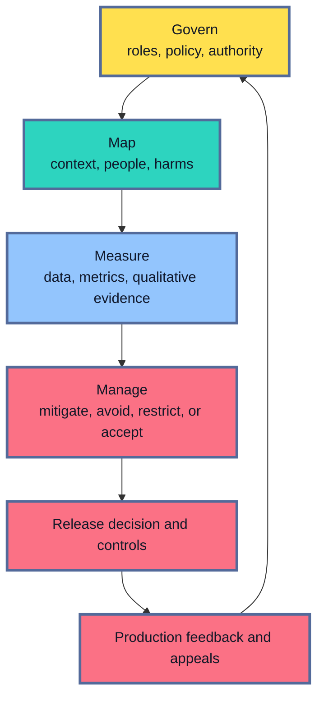

Ownership normally spans several roles.
Product and domain owners explain the decision and consequence.
Data owners defend provenance and coverage.
ML engineers produce reproducible model evidence.
Privacy, legal, security, compliance, or model-risk functions review obligations and residual risk.
Independent reviewers and affected communities can surface assumptions missed by the development team.

The decision record should contain:

- intended and prohibited uses;
- affected people and reviewed groups;
- the harm analysis and chosen metrics;
- data and attribute provenance;
- group counts, uncertainty, and missing evidence;
- candidate-versus-current results;
- diagnosed mechanisms and tested mitigations;
- utility, workload, privacy, and competing-metric trade-offs;
- release scope, fallback, appeal, monitoring, and stop conditions;
- named approvers and recorded residual risk.

Possible outcomes include full release, scoped release, more evidence, human-only handling for a route, continued use of the current system, or no ML deployment.
A scoped release is credible only if the product can identify and route the supported scope reliably.

High-impact failures, invalid labels, weak attribute evidence, unlawful data handling, absent appeals, or unenforceable scope can each block release.
The candidate’s overall improvement leaves those control failures unresolved.

## Continue the Review in Production
<!-- section-summary: Production monitoring follows the fairness plan through traffic, decisions, delayed outcomes, appeals, and changes to policy or population. -->

Offline evaluation studies a bounded sample and one system version.
Production introduces new people, changing traffic, delayed outcomes, human responses, and policy updates.

Immediate monitoring can track:

- group and intersection coverage within approved aggregation rules;
- unknown or missing attribute rates;
- selection, deferral, abstention, and fallback rates;
- route leakage outside the approved release scope;
- review-queue volume and waiting time;
- appeal, override, and complaint volume.

Quality and error metrics arrive after outcomes mature.
The production job then calculates the same reviewed fairness metrics with the same group definitions, outcome rules, and policy versions.
It compares current values with release evidence and shows the counts and uncertainty.

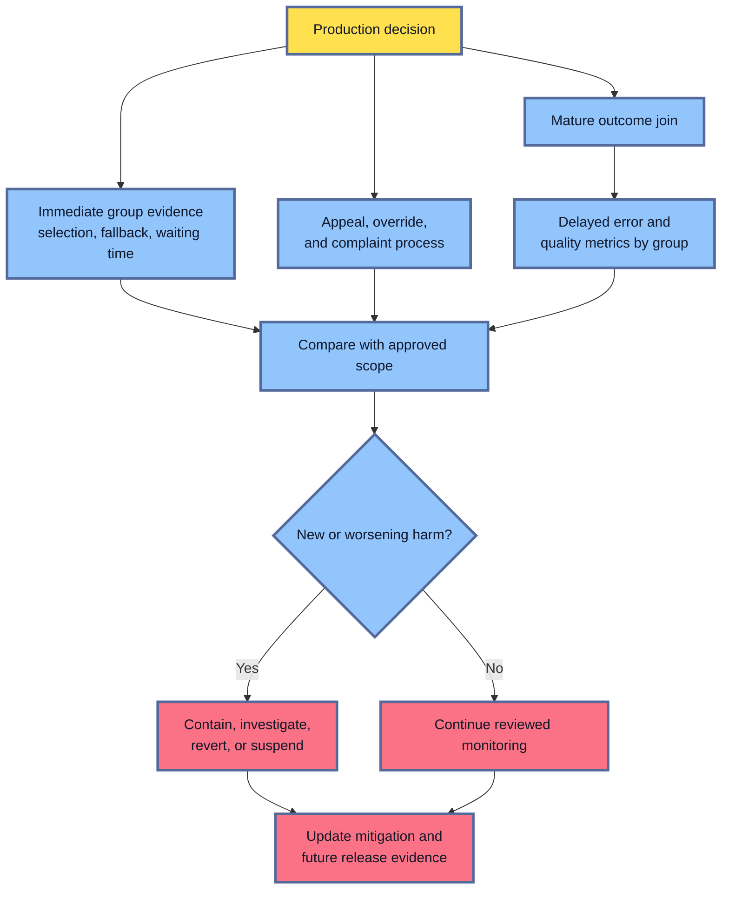

Product monitoring should also check whether the mitigation itself operates.
A human-review route needs queue-age and override analysis.
A post-processing rule needs policy-version and parity checks.
A data-collection change needs coverage and measurement-quality checks.

Alerts should connect to an action.
Route leakage can trigger an immediate fallback.
A large selection-rate change can pause rollout while the team checks traffic and policy.
A mature-outcome regression can open a fairness incident with domain and governance owners.

Appeals and affected-user feedback belong in the evidence loop.
They can reveal harms outside the current metric set, including confusing explanations, inaccessible review processes, and representation failures.
New findings update the harm map, group taxonomy, test suite, and next release decision.

## The Main Idea
<!-- section-summary: Fairness review connects group evidence to the decision, history, harm, mitigation, governance, and production controls around a model. -->

Fairness evaluation studies the ML system in its social and product context.
Overall quality, group performance, allocation harms, and representation harms answer different questions.
The right evidence follows the people affected and the consequence under review.

Group metrics can reveal unequal selection, errors, or score meaning.
Their interpretation depends on labels, historical decisions, sampling, measurement, uncertainty, and the product policy around the score.
Several fairness criteria can conflict, so governance must explain which harm receives priority and which trade-offs remain.

Fairlearn, TFMA Fairness Indicators, AIF360, and managed platforms can calculate and preserve evidence.
They implement an evaluation plan; they do not decide what fairness requires.

A responsible outcome may change the data, model, threshold, human workflow, product scope, or decision to use ML.
The release record names the owners, evidence, mitigation, residual risk, fallback, appeal, and production monitoring.
That complete path turns fairness from a dashboard metric into an accountable engineering and product practice.

## References

- [Fairlearn: Performing a fairness assessment](https://fairlearn.org/main/user_guide/assessment/perform_fairness_assessment.html)
- [Fairlearn: Common fairness metrics](https://fairlearn.org/main/user_guide/assessment/common_fairness_metrics.html)
- [Fairlearn: MetricFrame](https://fairlearn.org/main/api_reference/generated/fairlearn.metrics.MetricFrame.html)
- [Fairlearn: Mitigation](https://fairlearn.org/main/user_guide/mitigation/index.html)
- [TensorFlow Responsible AI: Fairness Indicators](https://www.tensorflow.org/responsible_ai/fairness_indicators/guide/guidance)
- [TensorFlow Responsible AI: Fairness Indicators tutorial](https://www.tensorflow.org/responsible_ai/fairness_indicators/tutorials/Fairness_Indicators_Example_Colab)
- [IBM AI Fairness 360 documentation](https://aif360.readthedocs.io/en/latest/)
- [SHAP documentation](https://shap.readthedocs.io/en/latest/)
- [NIST AI Risk Management Framework](https://airc.nist.gov/airmf-resources/airmf/)
- [Azure Machine Learning: Responsible AI](https://learn.microsoft.com/en-us/azure/machine-learning/concept-responsible-ai)
- [Azure Machine Learning: Machine learning fairness](https://learn.microsoft.com/en-us/azure/machine-learning/concept-fairness-ml)
- [Amazon SageMaker AI: Clarify bias and explainability](https://docs.aws.amazon.com/sagemaker/latest/dg/clarify-configure-processing-jobs.html)
