## Table of Contents

1. [What Robustness Means Beyond Ordinary Accuracy](#what-robustness-means-beyond-ordinary-accuracy)
2. [Expected Variation and Distribution Shift Need Different Responses](#expected-variation-and-distribution-shift-need-different-responses)
3. [Define Invariance, Expected Sensitivity, and Graceful Degradation](#define-invariance-expected-sensitivity-and-graceful-degradation)
4. [Build the Test Plan From Production Risk](#build-the-test-plan-from-production-risk)
5. [Create Realistic Perturbation Tests](#create-realistic-perturbation-tests)
6. [Use Metamorphic Tests When Exact Labels Are Hard](#use-metamorphic-tests-when-exact-labels-are-hard)
7. [Measure Degradation Across Severity and Slices](#measure-degradation-across-severity-and-slices)
8. [Test Load, Dependencies, and Fallback Behaviour Together](#test-load-dependencies-and-fallback-behaviour-together)
9. [Add Adversarial Tests From a Threat Model](#add-adversarial-tests-from-a-threat-model)
10. [Detect Unsupported Inputs and Abstain Safely](#detect-unsupported-inputs-and-abstain-safely)
11. [Turn Tests Into a Reproducible Robustness Suite](#turn-tests-into-a-reproducible-robustness-suite)
12. [Use Current Industrial Tools for Each Test Layer](#use-current-industrial-tools-for-each-test-layer)
13. [Turn Robustness Results Into Release Evidence](#turn-robustness-results-into-release-evidence)
14. [Carry Failed Cases and Boundaries Into Production](#carry-failed-cases-and-boundaries-into-production)
15. [The Main Idea](#the-main-idea)
16. [References](#references)

## What Robustness Means Beyond Ordinary Accuracy
<!-- section-summary: Robustness describes whether an ML system keeps acceptable behaviour under specified variations and failures inside its intended operating conditions. -->

At a high level, **robustness testing asks whether an ML system keeps doing the right thing after realistic conditions become less tidy**.
The change might affect the input, an upstream dependency, traffic load, available compute, or the way a user expresses the same intent.

Suppose an image classifier reaches 96 percent accuracy on a clean holdout set.
The score says how often the candidate predicted the right class on that sample.
It says little about compressed camera images, dim lighting, partial occlusion, a slow feature lookup, or an unfamiliar device.

Robustness adds those questions deliberately.
The team defines the variation the product expects, applies controlled tests, measures how behaviour changes, and checks the fallback for conditions outside the model's support.

This makes robustness broader than “accuracy on noisy data.”
It covers three connected properties:

1. **Behavioural robustness:** the prediction remains correct or changes in an approved way under realistic input variation.
2. **Operational robustness:** the complete service preserves valid output, latency, coverage, and fallback behaviour under load or dependency failure.
3. **Decision robustness:** the threshold, policy, and downstream action remain safe as model confidence or data quality deteriorates.

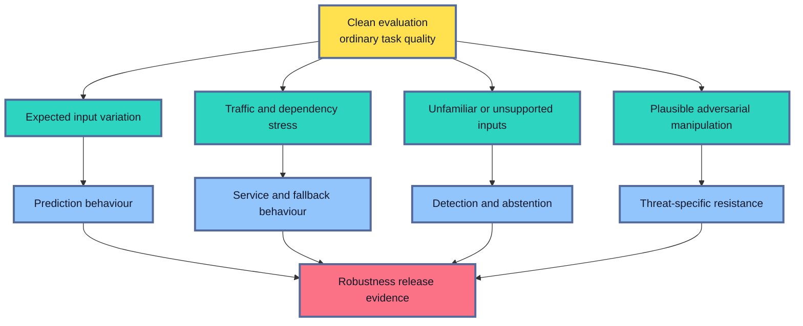

The word “specified” matters.
No finite suite proves that a model works under every possible change.
A useful robustness claim names the deployment envelope, tested conditions, severity range, metrics, limits, and recovery path.

For example, a document model may be approved for scans above a minimum resolution, with tested JPEG compression and rotation ranges.
Images outside that envelope go to another workflow.
The release claim is precise enough for production routing and monitoring to enforce.

## Expected Variation and Distribution Shift Need Different Responses
<!-- section-summary: Expected variation belongs inside the tested deployment envelope, while distribution shift signals that the population or prediction relationship has moved beyond prior evidence. -->

Production inputs vary even when the underlying task stays the same.
People make typing mistakes, cameras produce noise, optional fields go missing, networks add delay, and batch sizes change.
The system should anticipate a reviewed range of this variation.

This is **expected variation**.
It sits inside the deployment envelope.
A user writing “payment failed” and “PAYMENT FAILED!” expresses the same intent.
A product image saved at two common compression settings still depicts the same object.
A feature service responding 150 milliseconds later changes service timing without changing the meaning of the account.

A **distribution shift** changes the population or the relationship the model learned.
A new product line may introduce categories absent from training.
A remote-work change may alter the relationship between location and housing demand.
A new medical device may produce an image style outside the approved acquisition protocols.

Robustness tests can prepare the system for known shifts and reveal sensitivity to plausible ones.
Unknown future populations remain outside measured evidence.
A sustained shift outside the evaluated envelope calls for investigation, new labels, reevaluation, retraining, or a narrower route.

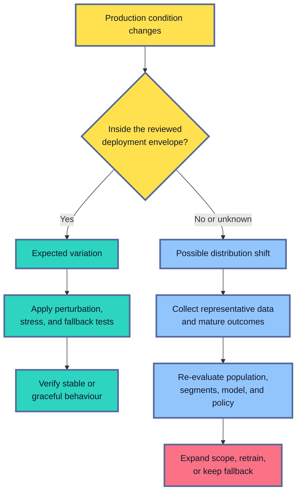

The boundary comes from the product and data-generating process.
For a voice assistant, background noise and supported accents may be expected variation.
A language outside the product’s declared support may be outside the envelope.
For a global product, the same language could be a required segment, which changes the obligation.

Write the boundary into the robustness plan.
Record the allowed schema, input ranges, source devices, supported languages, expected missingness, normal dependency latency, and traffic range.
Production monitoring can then distinguish a tested condition from a new one.

## Define Invariance, Expected Sensitivity, and Graceful Degradation
<!-- section-summary: Robustness starts by stating which input changes should preserve the output, which should change it, and how behaviour may degrade near the system boundary. -->

A perturbation has meaning only if the team knows how the output should respond.
Some changes should leave the decision stable.
Other changes carry real information and should change the prediction.

An **invariance** is a change the system should ignore for the task under review.
Trimming harmless whitespace should not change the intent of a support message.
Reordering unrelated rows in a batch should not change each row’s prediction.
Converting a numeric feature from an integer representation to the equivalent floating-point value should preserve the result within the approved tolerance.

An **expected sensitivity** is a change the model should notice.
If a demand forecast receives a genuine price increase, the output may need to change.
If an image rotates and the system returns bounding-box coordinates, the boxes should rotate with the object.
That predictable transformation is sometimes called **equivariance**.

The distinction prevents a common testing mistake.
Randomly changing a medically meaningful value and requiring the same risk score would reward a model for ignoring useful evidence.
The domain owner must approve the relationship between the original and changed input.

Some conditions call for **graceful degradation**.
The model may lose quality as blur, noise, missingness, or load increases.
The decline should stay within reviewed limits, and the system should switch to abstention or fallback before a safety limit is crossed.

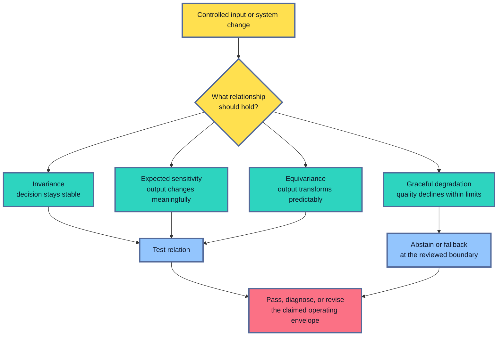

Write the expected relationship in ordinary language before generating cases.
“Adding whitespace preserves the predicted intent” is clearer than “text robustness.”
“Doubling every value after converting dollars to cents preserves the forecast after unit conversion” names both transformations.

The expected relationship acts as the test oracle.
An **oracle** is the rule that decides whether the result is acceptable.
It may be an exact label, a numeric tolerance, a ranking constraint, a schema guarantee, a monotonic relationship, or a required fallback route.

## Build the Test Plan From Production Risk
<!-- section-summary: A robustness plan maps realistic failure sources to an oracle, severity range, metric, owner, and release action. -->

A long list of transformations can create activity without useful coverage.
The test plan should come from the ways the product receives data and delivers decisions.

Start with evidence already available:

- production incidents and support escalations;
- data contracts and upstream service guarantees;
- segment and fairness findings;
- device, channel, language, and source-system documentation;
- serving architecture and dependency diagrams;
- load tests and capacity limits;
- abuse cases and the security threat model;
- human-review and fallback capacity.

These sources usually reveal several layers.

**Contract tests** cover schema, required fields, types, ranges, and response shape.
**Perturbation tests** cover realistic input noise and formatting.
**Semantic tests** cover paraphrases, aliases, unit conversions, and meaningful feature changes.
**Corruption tests** measure behaviour across increasing blur, missingness, compression, or noise.
**Operational tests** cover load, timeouts, stale data, partial results, and dependency loss.
**OOD tests** cover inputs outside the supported distribution.
**Adversarial tests** cover deliberate manipulation justified by an attacker model.

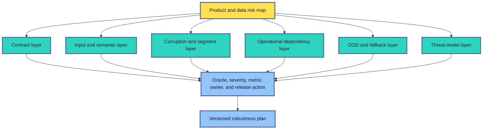

For each risk family, name the owner and control boundary.
A data-platform owner may control feature freshness.
The model team controls training and preprocessing.
The serving team controls timeouts and fallbacks.
The product owner controls the action policy.
Security owns the adversarial threat model with the ML team.

The plan also records what the suite leaves untested.
A text classifier tested for typos and paraphrases has supplied no evidence about prompt injection, training-data poisoning, or another language.
Explicit gaps prevent a narrow test from creating a broad robustness claim.

## Create Realistic Perturbation Tests
<!-- section-summary: Perturbation tests reproduce plausible changes from the real data-generating process and preserve the task meaning under an approved oracle. -->

A **perturbation** is a controlled change to an input or environment.
The most useful perturbations resemble conditions the deployed system will actually encounter.

For text, realistic changes can include casing, whitespace, common keyboard errors, supported abbreviations, Unicode normalization, or a paraphrase reviewed as meaning-preserving.
For images, they can include compression, lighting, blur, crop, sensor noise, or an acquisition artifact from a supported device.
For tabular data, they can include approved missing-value patterns, unit conversions, boundary values, delayed features, or unseen categories.
For time series, they can include missing intervals, late events, duplicate events, holiday effects, and time-zone transitions.

The source process determines the transformation.
Gaussian pixel noise may be convenient to generate, while motion blur from a moving camera could be the real production failure.
Randomly deleting tabular fields may miss the correlated missingness caused by one upstream outage.

Every generated case needs an oracle.
There are three common ways to obtain one:

1. **Label-preserving transformation:** a domain reviewer confirms that the target stays unchanged.
2. **Re-labelling:** a reviewer supplies a new expected label after the transformation changes meaning.
3. **Relational oracle:** the test checks a relationship between outputs instead of one exact label.

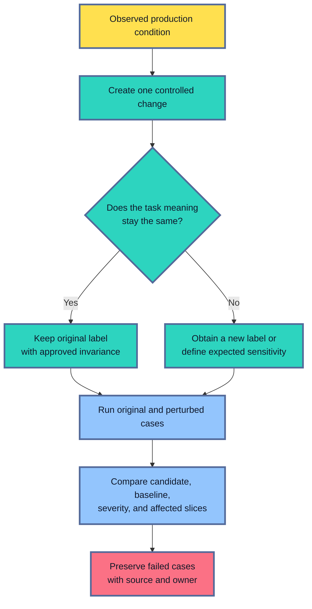

Change one mechanism at a time during diagnosis.
An image changed through crop, blur, colour, and compression in one step reveals that the combined case failed.
Separate variants show which transformation and severity caused the decline.

Combined tests still matter after the single-mechanism behaviour is understood.
Real traffic can contain a compressed, dim, partially cropped image.
Add reviewed combinations that match common production conditions, then keep each component in the metadata.

## Use Metamorphic Tests When Exact Labels Are Hard
<!-- section-summary: Metamorphic tests check expected relationships between related inputs and outputs when a single exact answer is unavailable or expensive to label. -->

Some ML outputs have no simple exact answer.
A ranking can contain several good orders.
A forecast can be reasonable within a range.
A generative response may have many acceptable wordings.
Even a classifier may lack labels for every transformed input.

**Metamorphic testing** handles this problem by checking a relationship between multiple runs.
The relationship is called a **metamorphic relation**.

Several relations are useful in ML systems:

- **Invariance:** harmless formatting leaves the class unchanged.
- **Monotonicity:** an approved increase in a risk factor must preserve or raise the risk score, within the domain rule.
- **Equivariance:** rotating an image rotates detected coordinates consistently.
- **Permutation consistency:** reordering independent batch rows preserves row-level results.
- **Subset consistency:** two existing items keep their reviewed ordering after irrelevant candidates are added.
- **Implementation consistency:** batch and online paths return equivalent predictions for the same model, preprocessing, and input.

Hypothesis is a current property-based testing library for Python.
It generates inputs from described ranges, searches for a failing example, and can replay saved failures.
The following focused test checks a reviewed whitespace invariance for an intent classifier:

```python
from hypothesis import given, strategies as st


@given(st.sampled_from(["payment failed", "reset my password", "cancel order"]))
def test_whitespace_preserves_intent(text):
    original = predict_intent(text)
    transformed = predict_intent(f"  {text.replace(' ', '   ')}  ")

    assert transformed.label == original.label
    assert abs(transformed.score - original.score) <= 0.05
```

The label assertion captures the invariant.
The score tolerance prevents large confidence swings from hiding behind a stable class.
The allowed texts, transformation, and tolerance still come from a reviewed product rule.

Property-based generation expands coverage around a valid relation.
Domain judgement still determines whether whitespace, feature order, a synonym, or another transformation should preserve meaning.
Store counterexamples as ordinary regression fixtures after the failure is confirmed.

For a forecast, a metamorphic test might convert every input amount from dollars to cents and convert the output back.
The two forecasts should agree within a numerical tolerance.
This catches unit-handling and preprocessing defects without requiring a new future outcome label.

## Measure Degradation Across Severity and Slices
<!-- section-summary: Severity curves show where quality starts to decline and whether particular product or data slices reach the failure boundary first. -->

A binary clean-versus-corrupted result hides the shape of failure.
A model may handle mild blur well, degrade steadily, and collapse after a specific point.
Another model may stay stable through moderate blur and then fail suddenly.

Define **severity levels** from real operating conditions.
For an image pipeline, levels might correspond to measured blur or compression ranges seen across supported devices.
For a tabular model, they might represent one missing optional feature, a missing feature family, and a complete online-store timeout.
For an LLM application, they might represent retrieval sets with increasing irrelevant context or tool latency.

Each level needs a reproducible transformation and a meaningful unit.
Labels such as `mild`, `medium`, and `severe` are useful only after the configuration records the actual parameters.

Measure:

- the primary task metric at every severity;
- the change from clean performance;
- candidate-versus-production difference on the same cases;
- prediction coverage, abstention, and fallback;
- latency and resource effects where the transformation changes cost;
- important segment and intersection results.

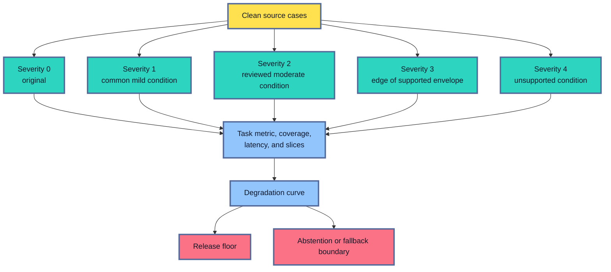

Slices matter because one average degradation curve can hide a concentrated collapse.
A speech model may degrade modestly under background noise overall and sharply for one device-and-language intersection.
Use the governed segment definitions, counts, and uncertainty from the earlier production-readiness work.

Predeclare release rules.
For example, the candidate may need to preserve at least 95 percent of its clean recall through severity 2, remain above an absolute recall floor for every required slice, and enter fallback at severity 3.
Those numbers come from product consequences and the defined severity scale.

## Test Load, Dependencies, and Fallback Behaviour Together
<!-- section-summary: Operational robustness checks whether the service preserves valid predictions and approved fallback semantics while traffic or dependency health deteriorates. -->

A model can pass every offline perturbation and still fail through its production path.
Feature retrieval can time out.
A queue can grow.
The service can run out of GPU memory.
A batch retry can duplicate decisions.

Operational testing should check more than HTTP success.
Suppose a feature lookup exceeds its timeout.
The endpoint may return `200 OK` through a fallback model.
The service stayed available, while prediction quality and route changed.
The test must verify the response schema, fallback identifier, policy action, latency, and telemetry.

Useful fault conditions include:

- feature-store latency, timeout, stale values, and partial keys;
- unavailable model artifact or slow model loading;
- queue saturation and rejected traffic;
- GPU or CPU memory pressure and batch-size limits;
- duplicate, delayed, and out-of-order batch messages;
- partial batch writes and retry behaviour;
- fallback-model activation and recovery;
- cold starts and autoscaling delay.

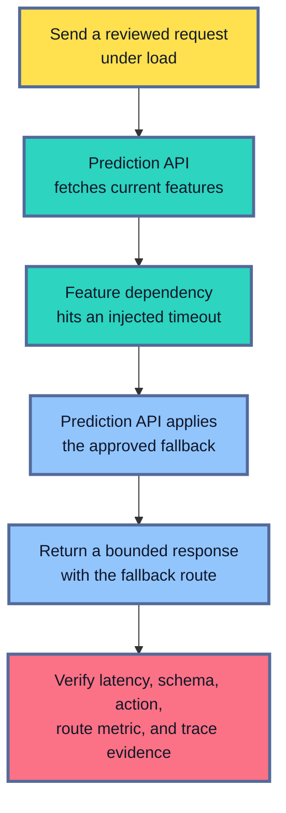

Grafana k6 can generate traffic and turn latency or error expectations into pass/fail thresholds.
Toxiproxy can place a TCP proxy in front of a dependency and inject latency, timeouts, bandwidth limits, or connection resets in development and CI.
Managed chaos tools can provide similar fault injection inside a chosen cloud.

Run these tests in an isolated release environment with production-like topology and safe data.
That environment can reproduce useful load and faults while protecting live traffic.
Any test against a shared or production system needs explicit operational approval.

Recovery is part of the test.
After the dependency returns, the primary route should resume under the reviewed health rule.
Queued work should drain without duplicate actions.
Fallback and error metrics should return to baseline.

## Add Adversarial Tests From a Threat Model
<!-- section-summary: Adversarial robustness tests deliberate manipulation that matches a documented attacker goal, access level, capability, and product consequence. -->

Ordinary corruption is accidental.
An **adversarial input** is deliberately shaped to cause a harmful result.
The testing method should therefore start from a threat model.

A threat model names:

- the asset or behaviour being protected;
- the attacker’s goal;
- the attacker’s knowledge of the model;
- the access available to inputs, outputs, training data, or model files;
- realistic constraints on the manipulated input;
- the product consequence of a successful attack.

For a public image classifier, an attacker may be able to submit many inputs and observe labels.
For a fraud model, transaction fields must still describe a valid transaction.
For a training pipeline, a supplier may control a small part of the incoming data.
These situations lead to different tests.

NIST’s adversarial-ML taxonomy covers attack families such as evasion, poisoning, extraction, inference, and generative-system misuse.
This article uses that taxonomy to scope release evidence.
Secure development, red teaming, privacy attacks, and incident response require their own deeper security controls.

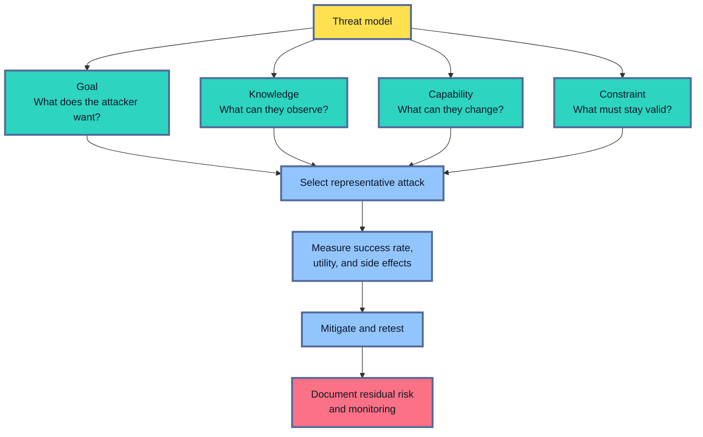

The Adversarial Robustness Toolbox, or **ART**, supports evaluation against evasion, poisoning, extraction, and inference attacks across common ML frameworks and data types.
Its catalogue is broad.
Choose attacks that match the threat model and valid input constraints.

An image perturbation bounded by pixel distance may still be physically impossible for the product.
A tabular attack that changes age or transaction total independently may violate the data contract.
Attack success on invalid inputs gives weak production evidence.

Adversarial training or another defense can improve one attack benchmark and reduce clean accuracy or fail against another adaptive attack.
Evaluate clean performance, realistic corruptions, representative attacks, and operational cost together.
Record the residual threat after mitigation.

## Detect Unsupported Inputs and Abstain Safely
<!-- section-summary: OOD handling detects inputs outside the supported evidence and routes them through abstention, fallback, or human review before confidence crosses a safety limit. -->

Some inputs fall outside the data the model was built to handle.
These are commonly called **out-of-distribution**, or **OOD**, inputs.

An OOD case is defined relative to a reference distribution.
A new sensor can be OOD for an image model trained on two older sensors.
A luxury property can be OOD for a price model trained on ordinary homes.
A French request can be OOD for an English-only intent model.

OOD detection tries to identify that unfamiliarity.
Possible signals include distance in a learned representation, density or novelty scores, ensemble disagreement, conformal prediction-set size, or task-specific quality checks.
Ordinary classifier confidence is often unreliable on unfamiliar inputs.
Pair a softmax probability with a detector or rule that was validated on relevant unsupported examples.

Scikit-learn distinguishes **outlier detection**, where training data may contain anomalies, from **novelty detection**, where a clean reference set defines normality and later unseen inputs are scored for novelty.
The distinction helps choose and validate a detector.

An OOD detector is another model or rule with its own errors.
False acceptance sends unsupported inputs to the candidate.
False rejection sends supported traffic to a slower or more expensive route.
Evaluate both rates on representative in-distribution, near-boundary, and OOD sets.

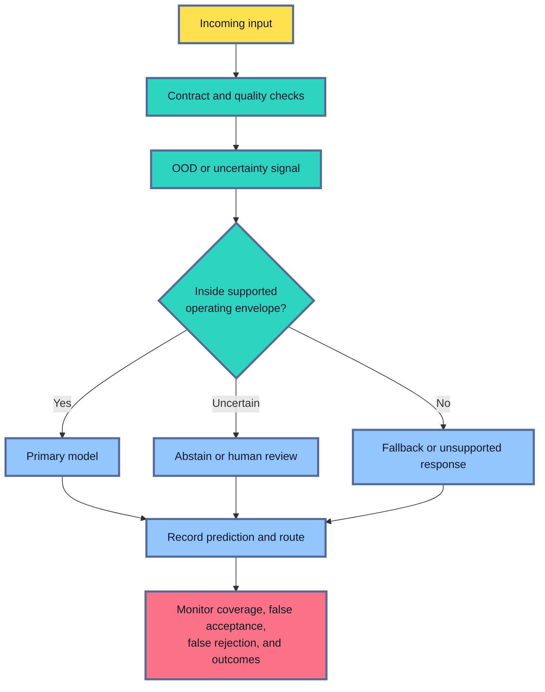

**Abstention** means the system declines to make the ordinary automated decision.
The product still needs a response.
It may use the current model, a conservative rule, a human reviewer, a request for better input, or a clear unsupported-case message.

Set the abstention threshold with product costs and route capacity.
A lower threshold may protect quality and send too much traffic to review.
A higher threshold may preserve automation while accepting more unsupported cases.
The release report should show quality-versus-coverage curves and the fallback workload.

## Turn Tests Into a Reproducible Robustness Suite
<!-- section-summary: A robustness suite versions source cases, transformations, seeds, oracles, severities, and expected actions so every candidate faces the same evidence. -->

One-off notebook experiments are hard to compare and easy to lose.
A **robustness suite** turns the reviewed plan into versioned test data and code.

The suite combines:

- representative source cases from a governed evaluation set;
- incident and regression fixtures;
- deterministic perturbation functions;
- property-based or metamorphic generators;
- corruption configurations and severity levels;
- dependency and load scenarios;
- OOD reference and challenge sets;
- threat-model-selected adversarial tests.

Each case needs enough identity to reproduce the result.
Store a case ID, risk family, source reference, transformation version, random seed, severity, oracle, slice membership, owner, and expected action.
Keep sensitive or raw source data in its governed system and use approved references in broad artifacts.

A compact suite contract can look like this:

```yaml
suite:
  id: document-routing-robustness
  population: supported-document-traffic-v4
  baseline_model: production
  candidate_model: candidate

test_family:
  id: jpeg-compression
  source_query: approved_scans
  transform: jpeg_roundtrip_v2
  severity:
    - {level: 1, quality: 85}
    - {level: 2, quality: 60}
    - {level: 3, quality: 35}
  oracle:
    relation: label_invariant
    score_delta_max: 0.08
  release_rule:
    minimum_recall_through_level: 2
    fallback_from_level: 3
  owner: document-ml
```

The population and model references identify what is being compared.
The transformation and parameters make severity reproducible.
The oracle states the expected relationship.
The release rule connects a failure to an action.

Use several execution tiers.
A small deterministic subset can run on every pull request.
The full suite can run before model approval.
Expensive load and adversarial tests can run in a controlled release environment.
Scheduled runs keep the suite compatible with dependency and platform changes.

Preserve confirmed failures as regression cases.
Review them after product policy or data contracts change.
An obsolete oracle can create a false failure, while deleting a fixture without its incident context can erase a lesson.

## Use Current Industrial Tools for Each Test Layer
<!-- section-summary: Industrial robustness testing combines task-native transformations, property testing, evaluation tracking, load and fault injection, and threat-specific security tools. -->

Robustness testing covers several different kinds of work: checking input contracts, generating meaningful variations, comparing model behaviour, stressing the serving path, and preserving evidence for review.
Each responsibility needs a tool that fits the job.
In practice, teams usually connect a small set of established tools through CI or a managed ML pipeline instead of expecting one platform to perform every test.

The goal is a coherent suite supported by only the tools it needs.
Every tool should produce evidence against a named test rule, and the suite should retain enough version information to reproduce the result.
The following choices show how common industrial tools fit into that structure.

### Data contracts and task-native transformations

Pandera, Great Expectations, Soda, warehouse constraints, or provider-native validation can enforce schema and data rules before the model runs.
Use the organization’s existing data-quality path where it can express the required contract.

Task-native libraries generate realistic transformations.
Torchvision and other image libraries can apply documented image changes.
Audio, text, tabular, and time-series teams often maintain small domain-specific transformation libraries because valid perturbations depend on the source process.

### Property and metamorphic tests

Hypothesis generates Python inputs from declared strategies, finds edge cases, shrinks a failing example, and replays saved failures.
It fits invariance, monotonicity, boundary, and implementation-consistency tests.

Pytest can run the deterministic fixtures and Hypothesis properties in CI.
Keep expensive model loading in fixtures and separate fast contract tests from full inference tests.

### Evaluation and evidence tracking

MLflow’s classic evaluation path uses `mlflow.models.evaluate` for classification and regression, supports custom `EvaluationMetric` objects, and exposes per-row evaluation tables and artifacts.
Teams can calculate severity and slice summaries from those rows and log the reviewed suite report with the candidate.

MLflow’s generative-AI evaluation uses `mlflow.genai.evaluate` and `Scorer` objects.
The two APIs use different metric abstractions, so choose the path that matches the model type.

An ordinary object store plus a CI artifact and registry record can also hold the evidence.
MLflow is useful where it already owns model identity and evaluation history.

### Load and dependency faults

Grafana k6 turns request rate, duration, error, and custom metrics into automated pass/fail thresholds.
Use it for the service path and include custom checks for fallback and prediction validity.

Toxiproxy injects network latency, timeouts, bandwidth limits, and connection resets between the service and a dependency.
Cloud chaos services or service-mesh fault injection can serve the same responsibility in an established platform.

### OOD and adversarial evaluation

Scikit-learn supplies novelty and outlier detectors for suitable tabular problems and explains the difference between those two tasks.
Deep-learning systems often need representation- or task-specific OOD methods whose thresholds are validated on their own challenge sets.

ART provides a broad adversarial-ML test library.
NIST AI 100-2 supplies current attack terminology and a risk frame.
Use both after security owners have defined the relevant threat.

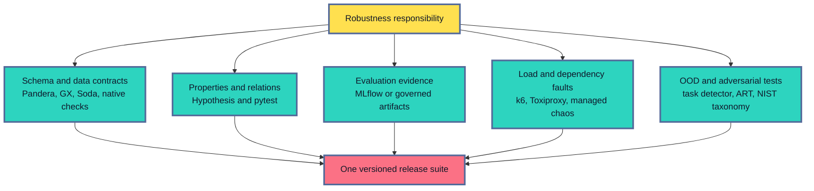

Tool choice follows the existing platform, model type, risk, data sensitivity, and operating cost.
A small tabular API may need pytest, Hypothesis, MLflow, and one k6 script.
A safety-critical vision service may justify a larger corruption corpus, device lab, OOD system, and adversarial evaluation environment.

## Turn Robustness Results Into Release Evidence
<!-- section-summary: A release packet compares candidate and production behaviour on the same robustness suite and connects every failed condition to an enforceable action. -->

Test output qualifies as release evidence after it is organised around a decision.
A reviewer needs to see the conditions the candidate faced, how its behaviour compares with the production model, and which protection takes over outside the approved boundary.
This turns hundreds of individual checks into a short, auditable argument for promotion, limited rollout, or rejection.

The release report should let a reviewer answer four questions:

1. Which operating conditions were tested?
2. How did candidate and production behaviour differ?
3. Where did quality, coverage, latency, or safety cross a reviewed limit?
4. Which route protects failed or untested conditions?

Run candidate and production models on the same source cases, transformations, seeds, severity levels, and serving policy.
This paired design separates a model change from a different challenge set.

For each test family, report:

- source and transformation versions;
- case and outcome counts;
- primary task metric by severity and slice;
- paired change from the production model;
- invariance or metamorphic failure count;
- abstention, fallback, and prediction coverage;
- latency, errors, queueing, and resource use for operational tests;
- adversarial success under the stated threat model;
- representative failed case IDs;
- uncertainty where the suite samples a population.

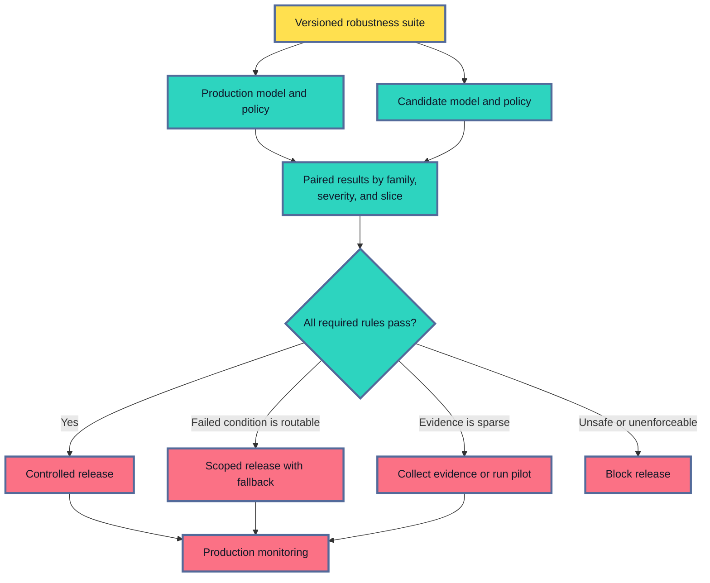

A failure needs an owner and a containment path.
If the candidate fails low-resolution scans and device metadata can identify them before inference, keep those devices on the production model.
A report-only exclusion provides no protection unless the service can identify the unsupported condition reliably.

Retest the complete suite after a repair.
Training on blurred images can improve corruption performance and reduce clean accuracy.
A tighter OOD threshold can protect quality and overwhelm human review.
A faster fallback can return valid responses with weaker prediction quality.
The release decision covers the whole system trade-off.

## Carry Failed Cases and Boundaries Into Production
<!-- section-summary: Production monitoring watches the operating envelope, fallback routes, and failed-case families so robustness assumptions remain visible after release. -->

The robustness plan defines production signals before launch.
The service should record the model, policy, route, testable input-condition bands, fallback status, and approved references needed for later outcome analysis.

Monitor:

- traffic approaching or crossing the supported input envelope;
- schema violations, unknown categories, and missingness patterns;
- corruption or quality bands available from source metadata;
- OOD, abstention, and fallback rates;
- dependency latency, timeout, stale-data, and recovery metrics;
- prediction quality by the same robustness slices after labels mature;
- recurrence of incident-derived failure families.

Avoid raw payloads and high-cardinality identifiers in metric labels.
Use bounded categories for dashboards and governed logs or traces for exact investigation references.

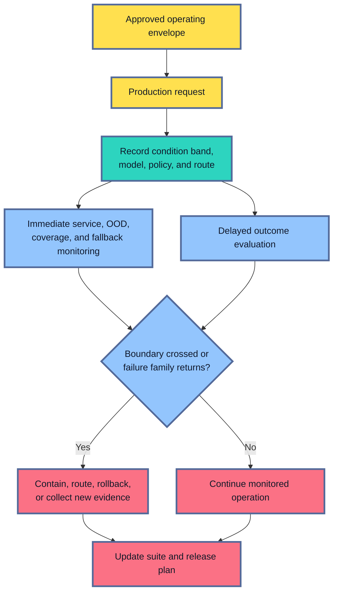

A new incident can add a regression fixture.
A growing OOD rate can trigger a new data-collection and evaluation cycle.
A dependency change can update the fault scenario.
Version each change so old model approvals keep their original meaning.

Robustness evidence expires as the product, population, and serving path change.
Scheduled tests and production feedback keep the suite aligned with the real system.

## The Main Idea
<!-- section-summary: Robustness testing defines the behaviour an ML system should preserve, measures degradation and failure, and proves that unsupported conditions reach a safe route. -->

Ordinary evaluation measures task quality on a representative sample.
Robustness testing asks how that quality and the surrounding decision behave under realistic variation, corruption, stress, dependency failure, unfamiliar inputs, and plausible manipulation.

The framework starts with the expected relationship.
Some changes should preserve the output.
Some should alter it.
Some permit controlled degradation before abstention or fallback.

Perturbation and metamorphic tests make those relationships concrete.
Severity curves and slices reveal where behaviour collapses.
Operational tests verify the complete service path.
OOD controls protect the edge of the deployment envelope.
Threat-model-selected adversarial tests cover deliberate manipulation without turning the article into a general security checklist.

Hypothesis, MLflow, k6, Toxiproxy, ART, data-validation tools, and managed equivalents each implement one part of the strategy.
The versioned suite connects them through source cases, transformations, oracles, severity, owners, and release rules.

A robust release claim is bounded and enforceable.
It names the tested conditions, failed or untested areas, degradation limits, fallback, and production signals that keep those assumptions visible.

## References

- [NIST AI 100-2: Adversarial Machine Learning Taxonomy and Terminology](https://csrc.nist.gov/pubs/ai/100/2/e2025/final)
- [NIST AI Risk Management Framework Core](https://airc.nist.gov/airmf-resources/airmf/5-sec-core/)
- [Hypothesis documentation](https://hypothesis.readthedocs.io/en/latest/)
- [MLflow: Model evaluation](https://mlflow.org/docs/latest/ml/evaluation/)
- [Scikit-learn: Novelty and outlier detection](https://scikit-learn.org/stable/modules/outlier_detection.html)
- [Adversarial Robustness Toolbox documentation](https://adversarial-robustness-toolbox.readthedocs.io/en/latest/)
- [Grafana k6: Thresholds](https://grafana.com/docs/k6/latest/using-k6/thresholds/)
- [Shopify Toxiproxy](https://github.com/Shopify/toxiproxy)
- [Pandera documentation](https://pandera.readthedocs.io/en/stable/)
- [Great Expectations documentation](https://docs.greatexpectations.io/)
