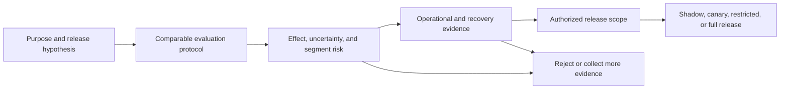
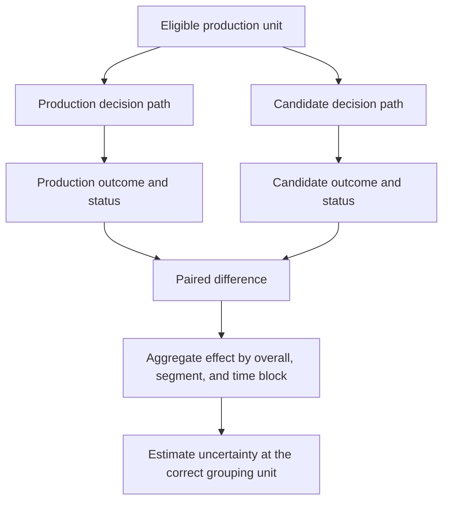
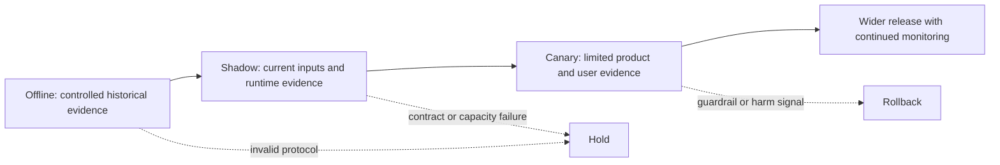

## A Candidate Has to Improve a Running Decision System
<!-- section-summary: Candidate review compares two complete decision paths and decides whether the evidence justifies changing production. -->

A **candidate model** is a model version proposed for release. The **production model** is the version currently influencing users, staff, or downstream software. Candidate-versus-production review decides whether replacing the current production path creates enough value, with acceptable uncertainty and risk, to justify that change.

The comparison covers more than two sets of model weights. Production usually includes feature definitions, preprocessing, thresholds, post-processing rules, fallbacks, runtime dependencies, and product policy. A candidate that scores well with a new feature can still fail if the online feature arrives late. A classifier can report higher recall while sending twice as many cases to a review team. A smaller model can preserve quality and cut serving cost enough to justify release. The unit under review is therefore the complete **decision system**.

The framework has five connected questions:

1. **Purpose:** Which production outcome should improve, and which outcomes must remain protected?
2. **Comparability:** Did both systems receive the same eligible examples, labels, policies, and time boundaries?
3. **Effect:** How large and uncertain is the candidate's change overall and for important segments?
4. **Operability:** Can the candidate run within the required contract, latency, capacity, monitoring, and recovery limits?
5. **Authority:** Which scope does the evidence support: more offline work, shadow, canary, restricted traffic, or full promotion?

Each question protects a different failure boundary. Strong statistics cannot repair an invalid data comparison. Good offline quality cannot prove that the candidate will survive production load. A successful canary cannot authorize traffic outside the population that the canary tested.

This flow prevents a common review mistake: jumping from one improved metric directly to promotion. The evidence accumulates, and every later decision relies on the earlier conditions remaining valid.

*The five-question framework keeps purpose, comparison validity, measured effect, operability, and release authority connected.*

## Define the Status Quo and Release Hypothesis
<!-- section-summary: A release hypothesis states the expected benefit, protected outcomes, intended population, and acceptable decision outcomes before results are reviewed. -->

The **status quo** is the decision path users receive today. It may use a production model, a rules engine, a human queue, or a combination of all three. The comparison has to include those parts because the proposed release changes their joint behaviour.

Suppose a grocery delivery service predicts arrival time. Its production path uses model version 42, clips extreme predictions to a policy range, and falls back to a route estimate when features are missing. Candidate version 43 adds weather features. Comparing raw model predictions would ignore the clipping and fallback that customers actually experience. The review should compare the two complete paths under the intended production policy.

A **release hypothesis** states the useful change before the team examines the candidate result. It contains four parts:

| Part | Example | Why it matters |
|---|---|---|
| Primary benefit | Reduce delivery ETA MAE by at least 0.3 minutes | Prevents promotion for a trivial difference |
| Protected outcomes | Rainy-weather late underestimation remains below 12% | Prevents a global gain from hiding a harmful regression |
| Operating limits | p95 latency stays below 75 ms at expected concurrency | Connects predictive quality to a service users can receive |
| Proposed scope | Ten-percent canary in two cities | Keeps the decision aligned with the evidence and blast radius |

The improvement margin should reflect product value. A metric change can be statistically detectable and still too small to pay for migration cost, extra features, higher latency, or new operational complexity. Some comparisons use **superiority**, where the candidate must improve by a declared amount. Others use **non-inferiority**, where the candidate may lose no more than a small quality margin because it provides another benefit such as lower cost, stronger privacy, or much faster inference.

The hypothesis also names allowed outcomes. A review can reject the candidate, request more data, authorize shadow traffic, approve a limited canary, approve a restricted population, or approve full promotion. These choices give mixed evidence somewhere useful to go. A candidate with valid offline quality and incomplete rollback evidence may proceed to shadow testing while remaining blocked from decisioning traffic.

## Build One Comparison Protocol for Both Systems
<!-- section-summary: A shared protocol holds evaluation units, labels, time boundaries, features, policies, metrics, and grouping rules constant. -->

A **comparison protocol** is the recorded method used to evaluate both systems. It identifies the evaluation dataset, label definition, eligibility rules, time window, feature availability, post-processing policy, metric implementation, segment definitions, and statistical unit. Both versions must produce predictions for the same eligible units so the analysis can calculate their difference row by row.

Using the same file is insufficient when the surrounding paths differ. The candidate may use a feature calculated after the prediction timestamp. The production export may contain predictions after policy overrides while the candidate export contains raw scores. One path may silently drop rows that fail validation. These differences create a biased comparison even though the final tables have matching columns.

The protocol should preserve a row for every eligible request and record the outcome of each path: success, timeout, validation failure, fallback, or missing prediction. If failed candidate calls disappear from the evaluation table, the candidate receives credit only for requests it completed.

Three datasets usually answer different questions:

- A **frozen holdout** supports stable comparisons across candidates.
- A **recent time-based set** checks whether the result still fits current traffic.
- A **known-failure suite** preserves incidents, rare cases, and product commitments that an average sample may miss.

Teams can add geographic or entity holdouts when a model must generalize to new customers, stores, devices, or sites. Time-series systems often need rolling backtests because performance depends on season and forecast horizon. The protocol should match the way the production problem changes.

Before scoring, the evaluation job should verify coverage. It records how many units each path attempted, completed, rejected, and handled through fallback. Coverage differences deserve investigation before metric comparison because they can change which rows reach the final report.

## Measure the Replacement Effect and Its Uncertainty
<!-- section-summary: Paired effects estimate what changes when the candidate replaces production on the same evaluation units. -->

Two isolated scores tell you how each system performed on average. A **paired effect** measures the candidate-minus-production difference for the same unit. Pairing matters because some orders, patients, queries, or devices are difficult for both systems. The direct difference removes part of that shared variation and describes the replacement decision more clearly.

For the ETA example, each order has an actual arrival time, a production prediction, and a candidate prediction. The evaluation calculates each system's absolute error and then the difference. A mean difference of `-0.7 minutes` says the candidate reduced absolute error by 0.7 minutes on average. The effect size reports practical magnitude.

Sampling produces uncertainty because the evaluation contains a finite set of orders. A paired bootstrap can resample orders and estimate an interval for the effect. When many orders share a store, route, customer, or day, resampling individual rows can understate uncertainty. The **resampling unit** should follow the dependency: store-day blocks, patient, query, or another unit that captures shared conditions.

The interval should support the declared release question. A superiority rule may require the whole interval to exceed the practical improvement margin. A non-inferiority rule may require the lower bound to remain inside the acceptable loss. These rules should be written before result review so the team cannot move the threshold after seeing an attractive candidate.

Statistical uncertainty covers only one source of doubt. Stale labels, an unrepresentative time window, measurement error, and missing segments create **evidence uncertainty** that a narrow confidence interval cannot remove. Reviewers should record those limitations separately.

*A paired comparison measures the replacement effect on the same units, then examines its size, uncertainty, and uneven segment impact.*

## Inspect Segments, Harms, and Trade-offs
<!-- section-summary: Segment analysis tests whether the candidate distributes errors and benefits acceptably across important users and operating conditions. -->

An overall improvement can coexist with a serious regression. Weather, language, region, device, customer type, class, and workflow state may each reveal a different failure. Segment selection should follow product consequences, known incidents, domain knowledge, policy commitments, and traffic routing rather than every available column.

Each segment report needs sample size, effect size, uncertainty, and the relevant product outcome. Sparse segments create unstable percentages. An important group with little data may need targeted collection, longer observation, or a restricted release. Low sample size should lead to narrower claims instead of silent exclusion.

Metrics should describe the harm that the product creates. In fraud screening, teams may track missed fraud value and the share of legitimate customers sent to review. In triage, missed urgent cases and reviewer workload both matter. In search, top-result quality and zero-result rate can matter more than an average score over all ranks.

Trade-offs should remain visible. Lowering a classifier threshold can improve recall while increasing false positives and human workload. Adding a remote feature can improve quality while raising latency and outage dependence. A release decision should state which trade-off the product accepts, who owns it, and which production signal will reveal if the assumption was wrong.

## Prove the Candidate Can Operate Safely
<!-- section-summary: Operational evidence covers contracts, runtime compatibility, capacity, observability, fallback, and recovery for the exact release unit. -->

The candidate needs a complete **release identity**: model digest, serving image digest, feature and schema versions, thresholds, policy configuration, and evaluation report. This identity lets reviewers connect an offline result to the process that will receive traffic.

Operational evidence checks the input and output contract, dependency compatibility, startup behaviour, resource use, latency distribution, throughput, timeouts, failure rates, and fallback path. A load test should use representative request sizes and concurrency. A readiness check should confirm that a process has loaded the intended model before it accepts traffic.

Telemetry must expose the release identity on prediction events. Operators should be able to answer which model, image, feature view, policy, and traffic role produced a decision. Missing identity weakens both incident response and later label joins.

Recovery deserves a real drill. The team directs test or canary traffic to the candidate, invokes rollback, and verifies that new events show the retained production release. Moving a registry alias may leave running workers with a model already loaded in memory. The test therefore checks the version handling requests rather than trusting the control-plane command.

## Use Offline, Shadow, and Canary Evidence for Different Questions
<!-- section-summary: Offline evaluation supports controlled comparison, shadow traffic checks current inputs and runtime, and canary traffic measures limited real-world effects. -->

Evidence stages answer different questions. **Offline evaluation** uses recorded examples and mature labels to compare behaviour under a controlled protocol. **Shadow traffic** copies current requests to the candidate while the production result remains authoritative. **Canary traffic** lets the candidate influence a small, identifiable share of real decisions.

Shadow testing reveals schema compatibility, current feature coverage, latency, errors, prediction divergence, and resource pressure. It cannot directly measure every product outcome because users still receive the production decision. Shadow infrastructure must isolate candidate resource use so a slow candidate cannot harm the production path.

Canary testing observes product outcomes, workload changes, support contacts, delayed labels, and feedback effects. It creates real exposure, so stop signals and rollback need to work before the first request. Stable assignment matters when repeated users or entities could otherwise move between versions and contaminate the comparison.

Teams should avoid treating this as a mandatory ladder for every change. A low-risk batch model may rely on offline replay and output review. A high-impact automated decision may require shadow, canary, human oversight, and a longer label window. The evidence path follows the potential harm and the ability to contain it.

## Convert Evidence Into a Scoped Decision
<!-- section-summary: The final decision binds an exact release to authorized traffic, conditions, owners, monitoring, stop signals, and expiry. -->

The decision record should identify the candidate and baseline, protocol, effect and uncertainty, important segment findings, operational evidence, approved scope, stop conditions, rollback target, owners, and expiry. It should distinguish artifact status from deployed state. Registry tags and aliases help people find a version, while deployment and routing systems control actual traffic.

A useful decision table keeps the possible outcomes explicit:

| Outcome | Evidence pattern | Production authority |
|---|---|---|
| Reject | Invalid evidence or unacceptable known harm | None |
| More evidence | Important uncertainty remains unresolved | Offline work only |
| Shadow | Offline result is credible; runtime evidence remains incomplete | No decisioning traffic |
| Limited canary | Evidence supports an enforceable population and small exposure | Declared segment and traffic cap |
| Full promotion | Predictive, segment, operational, and recovery gates pass | Approved production scope |

Suppose the ETA candidate improves overall error and passes load testing, while rain underestimation exceeds its limit. A shadow approval lets the team collect current weather evidence without changing customer estimates. A city-only canary is defensible only if routing can enforce that scope and the relevant rain condition receives its own guardrail. If the system cannot enforce the boundary, the candidate remains outside decisioning traffic.

Modern MLflow registry guidance uses model versions, tags, and aliases rather than the deprecated fixed model stages. A tag can record comparison status, and an alias can provide a movable reference such as `candidate`. Release automation should still pin the exact approved version and verify the serving identity after deployment. A mutable alias helps discovery; it should never replace the release decision.

*Offline, shadow, and canary evidence answer different questions, while identity, segment limits, stop signals, and recovery protect every release outcome.*

## Candidate Review Protects Both Change and Stability
<!-- section-summary: Reliable review gives useful candidates a controlled route to production while preserving a known production baseline. -->

Candidate-versus-production review compares complete decision paths under one declared protocol. The release hypothesis states the benefit and protected outcomes. Paired effects and uncertainty describe the replacement. Segment and harm analysis limit broad claims. Operational tests prove that the candidate can run, identify itself, and recover. Offline, shadow, and canary stages add evidence for different parts of the decision.

The result can authorize a precise scope, ask for more evidence, or stop the release. Each outcome supports progress when it keeps production authority aligned with what the evidence actually proves.

## References

- [scikit-learn model evaluation](https://scikit-learn.org/stable/modules/model_evaluation.html)
- [SciPy bootstrap](https://docs.scipy.org/doc/scipy/reference/generated/scipy.stats.bootstrap.html)
- [MLflow Model Registry workflows](https://mlflow.org/docs/latest/ml/model-registry/workflow/)
- [MLflow model signatures](https://mlflow.org/docs/latest/ml/model/signatures/)
- [Google SRE Workbook: Canarying Releases](https://sre.google/workbook/canarying-releases/)
- [NIST AI RMF Core](https://airc.nist.gov/airmf-resources/airmf/5-sec-core/)
