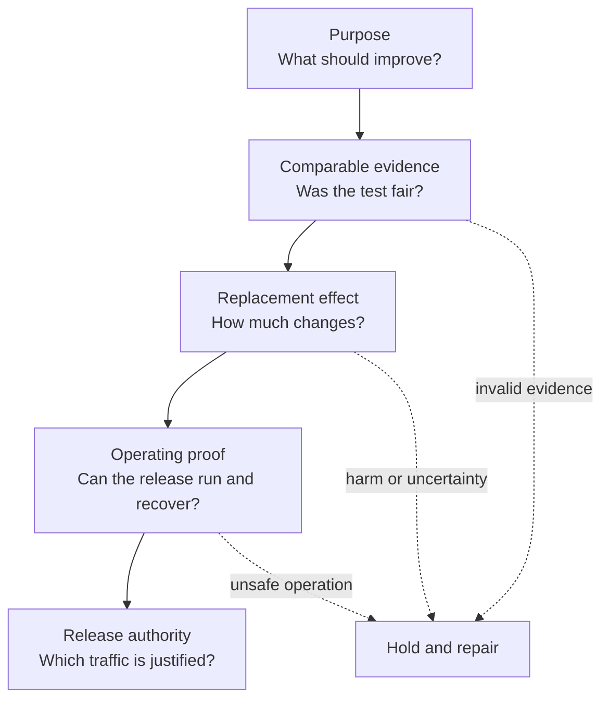
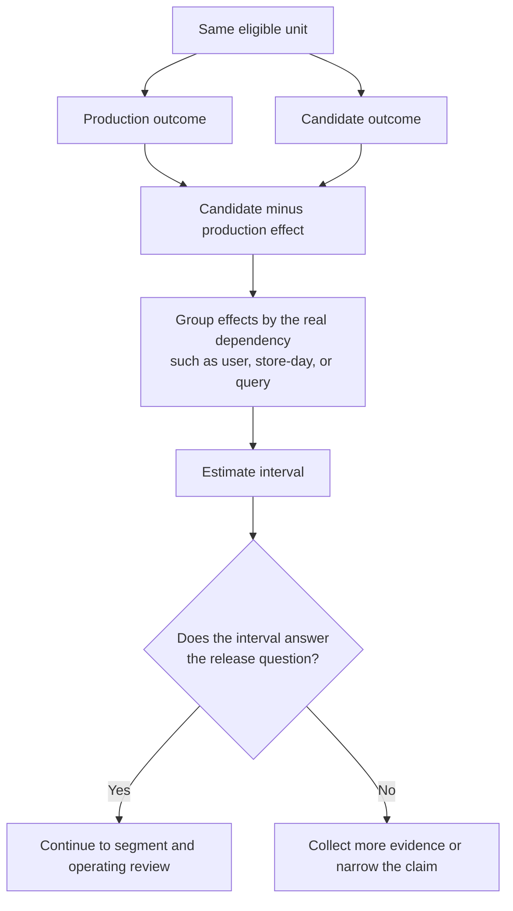
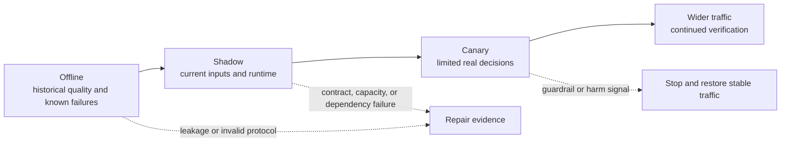

## Table of Contents

1. [Compare A New Model With The Complete System Running Today](#compare-a-new-model-with-the-complete-system-running-today)
2. [Start With the Current System and a Release Question](#start-with-the-current-system-and-a-release-question)
3. [Give Both Systems a Fair Comparison](#give-both-systems-a-fair-comparison)
4. [Measure What Changes If The New Model Replaces The Current System](#measure-what-changes-if-the-new-model-replaces-the-current-system)
5. [Find Who Benefits and Who Carries the Errors](#find-who-benefits-and-who-carries-the-errors)
6. [Test the Complete Release Under Production Conditions](#test-the-complete-release-under-production-conditions)
7. [Test Offline First, Then With Shadow And Limited Live Traffic](#test-offline-first-then-with-shadow-and-limited-live-traffic)
8. [Choose The Smallest Release Scope Justified By The Results](#choose-the-smallest-release-scope-justified-by-the-results)
9. [Verify The Release After It Starts Receiving Traffic](#verify-the-release-after-it-starts-receiving-traffic)
10. [The Main Idea](#the-main-idea)
11. [References](#references)

## Compare A New Model With The Complete System Running Today
<!-- section-summary: Candidate review asks whether replacing the current production decision path creates enough useful improvement to justify the change. -->

Suppose a delivery service already gives customers an estimated arrival time. The running model predicts the time, a policy clips extreme estimates, and a route-based fallback supplies an answer if live features are missing. A new model reduces average error in a notebook.

That result gives the team a promising **candidate model**, which is a model proposed for release. It has not yet shown that customers would receive a better service. The current **production model** operates inside a larger path that includes feature retrieval, preprocessing, thresholds, policy rules, fallbacks, infrastructure, and human workflows. Releasing the candidate changes that whole path.

At a high level, **candidate-versus-production evaluation asks what will change if the candidate replaces the decision system running today**. The answer needs more than two headline scores. First, the team establishes a fair comparison. It then measures the size and uncertainty of the change and looks for uneven effects. Operating tests and a scoped release decision complete the evidence.

You can think of the review as five connected responsibilities:

1. **Purpose:** define the useful improvement and the outcomes that must remain protected.
2. **Comparability:** give the candidate and production paths the same eligible cases, labels, time boundaries, and decision policy.
3. **Effect:** measure how much the replacement changes quality, cost, and harm, including uncertainty and important segments.
4. **Operability:** test the exact release identity under realistic contracts, load, dependencies, monitoring, and recovery.
5. **Authority:** choose whether the evidence supports more investigation, shadow traffic, a limited canary, a restricted population, or broad release.

These responsibilities depend on one another. A confidence interval cannot repair leaked evaluation data. Excellent offline quality says little about a feature lookup that times out under production load. A successful city canary provides evidence about that city and traffic level; it provides no evidence for an untested country or a hundred-percent rollout.


```mermaid
flowchart TD
    P["Purpose<br/>What should improve?"] --> C["Comparable evidence<br/>Was the test fair?"]
    C --> E["Replacement effect<br/>How much changes?"]
    E --> O["Operating proof<br/>Can the release run and recover?"]
    O --> A["Release authority<br/>Which traffic is justified?"]

    C -. "invalid evidence" .-> H["Hold and repair"]
    E -. "harm or uncertainty" .-> H
    O -. "unsafe operation" .-> H

    class P,C,E,O question
    class A decision
    class H hold
```

The diagram shows why one improved metric cannot carry the decision. Each stage adds a different kind of confidence, and a failure sends the candidate back to the boundary that needs repair.


*Purpose, comparison validity, measured effect, operability, and release authority form one evidence path.*

## Start With the Current System and a Release Question
<!-- section-summary: A release question defines the current decision path, intended improvement, protected outcomes, population, and smallest useful scope before results are examined. -->

The first task is to describe the **status quo**: the decision users receive today. Sometimes that is one production model. It may also include a rules engine, a human review queue, a threshold chosen by product policy, or a fallback used during missing data and outages.

Return to the arrival-time example. The running path clips estimates to a sensible range and falls back to a route estimate if weather features are unavailable. The candidate adds weather data. Comparing the two raw model outputs would remove the clipping and fallback that shape the customer experience. The fair subject is the complete production path against the complete proposed path.

Once the baseline is clear, the team writes a **release question**. This is a short, testable statement of the improvement the candidate is expected to deliver. It should name:

- the population and decision that may change;
- the primary outcome and a practically useful margin;
- outcomes, segments, and operating limits that must remain protected;
- the first release scope under consideration.

For example, the team may ask whether the candidate reduces arrival-time mean absolute error by at least 0.3 minutes for completed urban deliveries, while rainy-weather underestimation, p95 latency, fallback rate, and infrastructure cost stay inside declared limits. The first requested authority might be a small city canary rather than broad traffic.

The improvement margin matters because a detectable difference can still be commercially useless. Saving 0.02 minutes may be real in a huge dataset, yet the extra feature service could cost more, add latency, and create another outage dependency.

Two common release questions make this trade-off explicit:

- **Superiority** asks the candidate to improve an outcome by at least a useful amount. A fraud candidate might need to recover more fraudulent value without exceeding the review team's daily capacity.
- **Non-inferiority** allows a small, predeclared quality loss because the candidate brings another important benefit. A compact model might be acceptable if recall falls by no more than one percentage point while latency and serving cost drop substantially.

The margin comes from product consequences, operational capacity, safety requirements, and migration cost. It should be written before reviewers see the candidate result. Choosing it afterwards lets an attractive result redefine success.

A compact comparison plan can summarize the decision after the reasoning is clear:

| Decision part | Arrival-time example | What it protects |
|---|---|---|
| Primary improvement | Reduce mean absolute error by at least 0.3 minutes | Avoid a release for a trivial gain |
| Protected behaviour | Rainy-weather underestimation remains below its limit | Prevent an average gain from hiding a known harm |
| Operating limits | p95 latency, feature-miss rate, and cost stay within budget | Keep the improvement deliverable |
| Initial authority | Small canary on an enforceable city route | Keep exposure aligned with the evidence |

This plan creates more than pass or fail. Mixed evidence can lead to offline revision, shadow traffic, a limited canary, or a restricted population. Those outcomes become important after the team has produced a fair comparison.

## Give Both Systems a Fair Comparison
<!-- section-summary: A shared protocol holds eligible cases, labels, prediction times, policies, and metric calculations constant and keeps failed requests in the denominator. -->

A comparison is fair if both decision paths face the same question under the same rules. In technical terms, the team records a **comparison protocol**: the eligible cases, label definition, prediction timestamp, feature cutoff, evaluation period, policy settings, metric implementation, segment definitions, and statistical grouping unit.

The protocol starts with the unit that receives a decision. It might be one delivery, patient, account, query, device, or store-week. Both systems should produce an outcome for the same eligible units. This row-level pairing reveals what would actually change after replacement.

Using the same CSV file does not guarantee fairness. Several hidden differences can distort the result:

- the candidate reads a feature created after the historical prediction time;
- production predictions include a policy override while candidate predictions are raw scores;
- one system evaluates mature labels and the other includes labels still changing;
- failed candidate requests disappear before metrics are calculated;
- repeated observations from the same user are split as if they were independent.

Coverage deserves attention before quality. Imagine 10,000 eligible requests. Production completes 9,980 and the candidate completes 9,710. If the report scores only the 9,710 shared successes, the candidate receives no penalty for 290 extra failures. The evaluation table should keep every eligible unit and record `success`, `validation_failure`, `timeout`, `fallback`, or `missing_prediction` for each path.

The following focused example assumes a Pandas DataFrame named `eval_rows`. Each row contains one eligible delivery, its mature outcome, both predictions, and both completion statuses. The code first reports coverage, then calculates paired absolute-error change only for rows completed by both paths. The expected output is a coverage warning alongside a negative paired change such as `-0.40`; the candidate is more accurate on shared successes while completing less traffic.

```python
eligible = eval_rows.loc[eval_rows["eligible"]].copy()

coverage = {
    "production": eligible["production_ok"].mean(),
    "candidate": eligible["candidate_ok"].mean(),
}

paired = eligible.loc[
    eligible["production_ok"] & eligible["candidate_ok"]
].copy()

paired["production_loss"] = (
    paired["actual_minutes"] - paired["production_minutes"]
).abs()
paired["candidate_loss"] = (
    paired["actual_minutes"] - paired["candidate_minutes"]
).abs()
paired["loss_change"] = paired["candidate_loss"] - paired["production_loss"]

print(coverage)
print({"paired_mae_change": paired["loss_change"].mean()})
```

The two outputs answer separate questions. Coverage shows whether each path served the intended population. The paired change shows the quality difference where both paths produced a result. A release report needs both; one cannot substitute for the other.

### Use Different Evaluation Sets For Different Release Questions

One dataset rarely answers every release question. Teams commonly combine:

- a **frozen holdout** for stable comparisons across successive candidates;
- a **recent time-based set** for current products, traffic, and behaviour;
- a **known-failure suite** containing past incidents, rare cases, and contractual expectations;
- rolling backtests for forecasting or other time-dependent systems;
- entity or location holdouts if the model must generalize to new customers, devices, stores, or sites.

The sets have different jobs. Repeatedly consulting the frozen holdout during tuning weakens its independence. A recent set may contain labels that have not matured. A known-failure suite can prove that specific regressions stay fixed, although its hand-selected cases do not estimate ordinary production frequency.

The report should keep those roles visible instead of blending all rows into one score. The protocol also records dataset versions, code revision, model and policy identities, and exclusions so another reviewer can reconstruct the comparison.

## Measure What Changes If The New Model Replaces The Current System
<!-- section-summary: Paired effects describe the change caused by replacement, while uncertainty shows how precisely the evaluation estimates that change. -->

After the comparison is valid, the next question is how much the replacement changes the outcome. Two isolated scores answer, “How did each system perform on average?” A **paired effect** answers, “What changed for the same unit after switching from production to the candidate?”

Suppose one delivery has an absolute error of 6 minutes under production and 4 minutes under the candidate. Its paired loss change is `4 - 6 = -2 minutes`; negative is an improvement because lower error is better. Calculating this difference for every shared delivery creates a distribution of replacement effects.

Pairing removes some noise from cases that are difficult for both systems. A snowstorm may make every route hard. Comparing the two errors on the same deliveries isolates the candidate's contribution more directly than comparing unrelated averages.

The effect size still comes from a finite sample. A confidence interval describes the range of replacement effects compatible with that sample and method. Paired resampling keeps the candidate and production results for each evaluation unit together, so every resampled difference preserves the fact that both systems faced the same case.

If many deliveries share the same store and day, row-level resampling treats correlated events as independent and can produce an interval that is too narrow. A store-day block, user, patient, query, or another grouped unit may represent the real source of variation. The protocol should state that choice and explain why it fits the product.


```mermaid
flowchart TD
    U["Same eligible unit"] --> P["Production outcome"]
    U --> C["Candidate outcome"]
    P --> D["Candidate minus production effect"]
    C --> D
    D --> G["Group effects by the real dependency<br/>such as user, store-day, or query"]
    G --> I["Estimate interval"]
    I --> Q{"Does the interval answer<br/>the release question?"}
    Q -- "Yes" --> S["Continue to segment and operating review"]
    Q -- "No" --> M["Collect more evidence or narrow the claim"]

    class U,P,C input
    class D,G,I analysis
    class Q,S decision
    class M hold
```

For a superiority decision, the whole interval may need to exceed the practical improvement margin. For non-inferiority, the harmful end of the interval must remain within the accepted loss. A result can therefore be:

- clearly useful;
- clearly harmful;
- too small to matter;
- promising but too uncertain for the requested scope.

The last outcome is common. It may lead to more data or a smaller release, depending on the risk and whether that smaller scope can be enforced.

Statistical precision covers only sampling variation. **Evidence uncertainty** includes stale traffic, incomplete labels, measurement error, unobserved segments, and a policy change that happened after the evaluation window. A narrow interval cannot correct those problems. Reviewers should record them as limitations and decide which production claims remain defensible.


*Paired effects measure the proposed replacement on the same units. Group-aware uncertainty and segment analysis then limit how broadly the result can be claimed.*

## Find Who Benefits and Who Carries the Errors
<!-- section-summary: Segment and trade-off analysis shows whether an average improvement hides harm, unstable evidence, or unaffordable work for a particular population or condition. -->

An average describes the centre of a population. It can hide a region whose upstream data changed or a device that takes a different fallback path. Language, product route, class, and operating conditions can also change the consequence of an error. The release question therefore needs a second view: where does the candidate improve, regress, or remain uncertain?

Choose segments from product consequences and known failure boundaries. Incident history may show that missing device identifiers cause a fraud model to fall back. Domain experts may identify high-risk clinical symptoms. A routing system may need separate results by language and queue. Generating hundreds of arbitrary slices creates false alarms and review noise; the useful segments have a reason to exist.

Consider a classifier that prioritizes cases for a team able to review 2,000 alerts each day. The candidate raises recall from 0.78 to 0.84 by lowering its threshold. It also produces 6,500 alerts. The model metric improved, while the delivered workflow now leaves thousands of alerts unread. The meaningful comparison includes recall at the real capacity, precision among reviewed alerts, missed-case cost, and queue delay.

Every important segment report should include:

- the number of eligible and labelled units;
- production and candidate outcomes at the same operating policy;
- the paired effect and its uncertainty;
- coverage, fallback, and missing-label rates;
- the product consequence of the observed errors.

Sparse segments require careful wording. Ten examples cannot support the same claim as ten thousand. The response may be targeted data collection, longer observation, human review, shadow traffic, or a release restricted to the population with adequate evidence. Quietly removing the segment would turn missing evidence into broad authority.

Trade-offs should remain visible across responsibilities. A remote feature may improve prediction quality and add 80 milliseconds of latency plus an outage dependency. A compact model may lose a small amount of accuracy and cut GPU cost enough to make regional redundancy affordable. Calibration may improve resource allocation even if ranking stays almost unchanged.

The release report should state which trade-off is accepted, who owns the consequence, and which production signal will reveal a wrong assumption. That statement prepares the operating review.

## Test the Complete Release Under Production Conditions
<!-- section-summary: Operational review proves that the exact model, code, data contract, policy, and runtime can serve the intended workload, identify itself, and recover. -->

Offline evaluation can compare predictions without proving that the candidate can run inside production. The candidate may require more memory than the serving fleet provides. A new feature may be absent for a region. The container may load the wrong preprocessing code. A fallback may return a well-formed response that changes the product decision.

The team therefore creates a complete **release identity**. The model and serving image each receive an immutable version or digest. Feature definitions and the input schema identify the data contract. Thresholds, preprocessing, and post-processing identify the policy around the model. The evaluation report then points back to that exact combination. This is the subject of the decision. A change to any part that can alter predictions needs new evidence or an explicit compatibility rule.

The operational tests should recreate the intended workload:

### Check Inputs, Dependencies, And Fallbacks

Representative requests should pass through input validation, feature lookup, preprocessing, inference, post-processing, and fallback. The test covers missing optional fields, invalid types, large payloads, dependency timeouts, and model startup. A model signature from MLflow or a provider registry helps describe inputs and outputs; application-level tests still verify policy and fallback behaviour around the model.

### Capacity and cost checks

Load tests should use realistic request sizes, concurrency, traffic shape, and hardware. Review p50, p95, and p99 latency, throughput, queue time, error rate, memory, accelerator utilization, cold starts, and cost per useful prediction. Averages can hide the tail experienced by users.

### Check Release Identity, Monitoring, And Rollback

Prediction events need enough safe metadata to identify the release. The model and deployment IDs show which runtime produced the result. Feature and policy versions explain the surrounding decision logic. A traffic role distinguishes candidate, control, and shadow events, while a correlation ID connects approved operational records. Sensitive raw inputs belong in governed storage only if policy permits them.

The recovery drill sends identifiable test traffic, activates the rollback or fallback, and confirms that new events report the retained production release. Moving a mutable registry alias is insufficient proof because running workers may have already loaded the candidate into memory.

Industrial stacks divide these responsibilities across several tools:

| Responsibility | Common implementation | Evidence the reviewer should see |
|---|---|---|
| Model and evaluation identity | MLflow, Weights & Biases, or a managed model registry | Pinned model version or digest, dataset reference, metrics, signature |
| Repeatable checks | GitHub Actions, GitLab CI, Jenkins, or a managed ML pipeline | Versioned test command, logs, report, and pass/fail result |
| Serving and traffic control | Managed endpoints first; Argo Rollouts for established Kubernetes platforms | Exact deployment identity, traffic route, capacity result |
| Service evidence | OpenTelemetry, Prometheus and Grafana, or cloud-native monitoring | Release-labelled latency, errors, saturation, and dependency signals |
| Recovery | Managed endpoint rollback, retained stable deployment, or platform runbook | Drill record plus post-action serving identity |

The registry organizes evidence and provides model versions. The CI or managed pipeline repeats checks. The serving platform controls traffic. The monitoring system observes the running release. Combining those responsibilities into a single `approved=true` tag hides important boundaries.

For ordinary teams, a managed endpoint is the practical starting point. Amazon SageMaker AI provides model approval status plus managed canary and rollback controls; Azure Machine Learning supports versioned assets and traffic across endpoint deployments. Kubernetes teams with an existing platform can use Argo Rollouts to combine canary traffic with metric analysis. The operating cost of Kubernetes rarely makes sense solely to gain a canary controller.

## Test Offline First, Then With Shadow And Limited Live Traffic
<!-- section-summary: Offline, shadow, and canary stages answer different questions, so the release path should match the model's risk and delivery pattern. -->

No test environment reproduces every part of production. A historical replay can use mature labels and still miss a feature-service timeout introduced yesterday. Sending the candidate real requests reveals that timeout, although it says nothing about user outcomes if the candidate's answer remains hidden. Teams build confidence in stages because each stage exposes a different part of the production path.

**Offline evaluation** compares candidate and production behaviour on recorded examples with mature labels. It gives the most controlled view of prediction quality, paired effects, and known failure cases. It cannot reveal every current schema, dependency, latency, or feedback effect.

**Shadow traffic** copies current requests to the candidate while the production result remains authoritative. It can reveal current feature coverage, schema failures, prediction divergence, latency, resource pressure, and dependency behaviour. It provides no direct product authority, and many final outcomes still reflect the production decision. The shadow path should be isolated so a slow candidate cannot consume production capacity or trigger side effects.

**Canary traffic** lets the candidate influence a small, identifiable share of real decisions. It can measure service behaviour, user response, workload changes, support contacts, and eventually mature outcomes. It also creates real exposure. Stable assignment, stop signals, a retained production path, and working rollback should exist before the first canary request.


```mermaid
flowchart LR
    O["Offline<br/>historical quality and known failures"] --> S["Shadow<br/>current inputs and runtime"]
    S --> C["Canary<br/>limited real decisions"]
    C --> W["Wider traffic<br/>continued verification"]

    O -. "leakage or invalid protocol" .-> H["Repair evidence"]
    S -. "contract, capacity, or dependency failure" .-> H
    C -. "guardrail or harm signal" .-> R["Stop and restore stable traffic"]

    class O,S evidence
    class C,W live
    class H,R hold
```

This sequence is a menu rather than a compulsory ladder. A monthly batch forecast may start with historical replay. The team can then generate the old and new outputs in parallel and let a planner inspect the difference before publication. A high-impact automated decision may first use shadow traffic. Its canary can stay small and under human oversight until the full label-maturity window has passed.

Progressive-delivery tooling applies the same principle in different environments. SageMaker AI can shift a canary portion to a new fleet and use CloudWatch alarms to trigger rollback. Azure managed online endpoints can keep blue and green deployments behind one endpoint and move traffic explicitly. Argo Rollouts can run Prometheus-backed analysis during Kubernetes canaries. Each tool controls exposure; the team still defines the ML quality, segment, and product signals that determine success.

## Choose The Smallest Release Scope Justified By The Results
<!-- section-summary: A release outcome binds an exact candidate to the population, traffic level, conditions, owners, stop signals, and expiry justified by its evidence. -->

After the evidence stages, the team decides how much authority the candidate has earned. “Approved” by itself is too vague. Approval for isolated shadow traffic carries no permission to change user decisions. Approval for five percent of one route carries no permission for another region or broad traffic.

The useful outcomes are:

| Outcome | Evidence condition | Authority |
|---|---|---|
| Reject | The candidate has an invalid premise or known unacceptable harm | No release authority |
| Collect more evidence | A material uncertainty remains unresolved | Offline work or another approved evidence stage |
| Shadow | Offline evidence is credible and runtime evidence remains incomplete | Copy traffic with no candidate decision |
| Limited canary | Evidence supports a small enforceable population and exposure | Declared route, segment, and traffic cap |
| Restricted release | One population has adequate evidence and another does not | Only the enforceable supported population |
| Broad release | Predictive, segment, operational, and recovery evidence supports the intended scope | Declared production traffic with continuing guardrails |

Suppose the arrival-time candidate improves overall error and passes its load test. Rainy-weather underestimation still crosses the protected limit. Shadow traffic can collect current weather and runtime evidence without changing customer estimates. A dry-weather canary is defensible only if routing can identify that condition safely, policy can enforce the boundary, and monitoring can detect leakage into excluded traffic. If those controls are absent, the candidate remains outside decisioning traffic.

The decision record should identify:

- the exact candidate and production baseline;
- the comparison protocol and evidence locations;
- overall and segment effects with uncertainty;
- operating and recovery evidence;
- authorized population, route, traffic cap, and duration;
- stop conditions, rollback target, and responsible owners;
- known limitations and evidence required for expansion.

Modern MLflow Registry workflows use model versions, tags, and aliases; fixed model stages are deprecated. A tag can help people find a reviewed candidate, and an alias can provide a convenient reference such as `candidate` or `champion`. Aliases are movable. Deployment automation should resolve and pin the approved version or digest, then verify the identity serving traffic.


*Different evidence supports different authority. Identity, routing, stop signals, and recovery preserve that boundary after release.*

The scope must be technically enforceable. A written city-only approval has little value if the router cannot keep other traffic out. The release record, deployment policy, and traffic controller should describe the same boundary.

## Verify The Release After It Starts Receiving Traffic
<!-- section-summary: Post-release verification checks the serving identity, traffic boundary, early operating signals, mature outcomes, and rollback path before authority expands. -->

A release decision is a claim about future production behaviour. Traffic provides the first chance to test that claim against current inputs, dependencies, users, and feedback effects.

Verification starts with facts available immediately:

- Is the approved model, image, feature, and policy version serving?
- Is the candidate receiving only the approved route and traffic percentage?
- Are requests being assigned consistently?
- Are schema failures, missing features, latency, errors, saturation, decision rates, and fallback use inside their limits?
- Can operators restore the retained production path and see that identity on new events?

These early signals can stop a broken release quickly. They cannot prove prediction quality if labels arrive days or weeks later. Outcome-based verification should wait for the label definition and maturity window used by the comparison protocol.

Consider a payment-risk model whose label means a missed payment within thirty days. Outcomes observed after one week contain many cases that still have time to become positive. Treating those provisional negatives as mature labels can make the canary appear unusually accurate. The release dashboard should show label volume, maturity, and join coverage beside quality metrics.

Compare candidate and control over the same period and decision policy. A global market event can hurt both paths at once, so relative comparison alone is insufficient. Absolute product and service limits still matter. Google SRE's canary guidance makes the same operational point: compare the canary with the control and retain absolute service objectives because both groups can deteriorate together.

If a stop condition fires, the team contains exposure, verifies stable traffic, preserves evidence, and investigates the responsible boundary. A bad feature feed may require a feature fallback rather than a different model. A capacity failure may require smaller traffic or more resources. A segment regression may return the candidate to data and model work.

Expansion is another release decision. More traffic changes sample size, capacity, queue pressure, cost, and user exposure. The next step should use the same framework: confirm the comparison still holds, review new evidence, state the larger scope, and verify it after traffic moves.

## The Main Idea
<!-- section-summary: Candidate review replaces leaderboard thinking with a fair, risk-aware comparison between two complete production decision paths. -->

A candidate deserves release because the complete decision path creates a useful, credible improvement over the system running today. The team defines that improvement before seeing results, gives both paths the same comparison, measures paired effects and uncertainty, examines important segments, and proves that the exact release can operate and recover.

Offline, shadow, and canary stages add different evidence. The final outcome grants the smallest scope that evidence can support and the platform can enforce. Production verification then checks the serving identity, traffic boundary, operating signals, and mature outcomes before the scope grows.

This approach protects useful change and the known production baseline at the same time. A candidate can move forward without asking one attractive score to carry more authority than it has earned.

## References

- [scikit-learn: Model evaluation](https://scikit-learn.org/stable/modules/model_evaluation.html)
- [SciPy: Bootstrap confidence intervals](https://docs.scipy.org/doc/scipy/reference/generated/scipy.stats.bootstrap.html)
- [MLflow: Model evaluation](https://mlflow.org/docs/latest/ml/evaluation/)
- [MLflow: Model Registry workflows](https://mlflow.org/docs/latest/ml/model-registry/workflow/)
- [MLflow: Model signatures](https://mlflow.org/docs/latest/ml/model/signatures/)
- [Amazon SageMaker AI: Canary traffic shifting](https://docs.aws.amazon.com/sagemaker/latest/dg/deployment-guardrails-blue-green-canary.html)
- [Azure Machine Learning: Progressive rollout of MLflow models to online endpoints](https://learn.microsoft.com/en-us/azure/machine-learning/how-to-deploy-mlflow-models-online-progressive?view=azureml-api-2)
- [Argo Rollouts: Analysis and progressive delivery](https://argo-rollouts.readthedocs.io/en/stable/features/analysis/)
- [Google SRE Workbook: Canarying releases](https://sre.google/workbook/canarying-releases/)
- [NIST AI Risk Management Framework Core](https://airc.nist.gov/airmf-resources/airmf/5-sec-core/)
