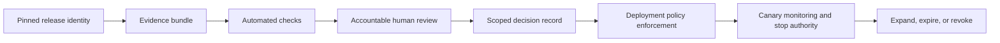

## What an Approval Gate Does

<!-- section-summary: An approval gate prevents a model release from advancing until required evidence and accountable owners support the proposed production use. -->

An **approval gate** is a release control that keeps a model from advancing until required evidence passes and the responsible people accept the remaining risk. The gate applies to one exact candidate, configuration, and release scope. It should influence the deployment system rather than existing only as a meeting note.

The gate has six connected layers:

| Layer | Main question | Failure when omitted |
|---|---|---|
| **Identity** | Which model, data, code, policy, image, and release scope are under review? | Approval attaches to a moving alias or different runtime |
| **Evidence** | Does the candidate pass the intended-use, metric, uncertainty, segment, robustness, and compatibility requirements? | A headline score receives authority beyond what it proves |
| **Automation** | Which objective conditions can the pipeline verify reproducibly? | Reviewers spend time on missing files or inconsistent calculations |
| **Accountability** | Which owners judge product, domain, data, platform, privacy, and operational risk? | One team accepts risk that belongs to another owner |
| **Operational control** | Can the release be observed, limited, stopped, and rolled back? | A canary sends traffic without a usable stop path |
| **Enforcement and expiry** | How does the deployment system apply the approved scope, and when must evidence be refreshed? | Meeting notes drift away from production state |

Automation and human judgement serve different purposes. Exact schema, metric, digest, and smoke-test rules belong in automation. Residual user harm, uncertain segment evidence, operational capacity, and domain acceptability require accountable people. A gate fails when either side is missing: manual review cannot repair an invalid artifact, and a green pipeline cannot accept social or product risk on behalf of an owner.



The diagram shows why an approval gate is a control path rather than a single meeting. Evidence has to refer to an immutable release identity. Automation checks repeatable rules before reviewers judge remaining risk. The resulting decision grants a defined scope, and the deployment system enforces that scope. Monitoring keeps the decision under review after traffic starts.


*Approval connects exact release identity, evidence, accountable review, enforceable scope, and live monitoring through one control path.*

CityCart illustrates the framework with version 43 of a delivery-time model proposed for a ten-percent canary. The candidate has passed offline evaluation, and the gate now connects that evidence to serving compatibility, monitoring, rollback, product scope, and named ownership.

## A Gate Follows the Release Through a Lifecycle

<!-- section-summary: Approval moves through proposed, checked, reviewed, active, expired, and revoked states as evidence and production conditions change. -->

The gate lifecycle starts when a team proposes an exact release and intended scope. The proposal remains **pending** while required evidence is collected. Automated checks can move individual requirements to passed, failed, or unknown. Human reviewers then decide whether the remaining risk supports a specific authority such as shadow testing or a limited canary.

An approved decision enters **active** state only when deployment matches its subject and scope. The gate should confirm the model digest, serving image, configuration, traffic percentage, population filter, and monitoring plan. If any of those values differ, the release returns to review because the approval describes another system.

Active approval can later expire or be revoked. Expiry handles evidence that ages naturally. Recent-traffic evaluation, capacity tests, privacy assessments, and supplier reviews can lose relevance as data and dependencies change. Revocation handles an incident, newly discovered vulnerability, invalid label source, or another event that makes the prior decision unsafe.

This lifecycle separates three ideas that teams often mix together:

- **Registration** records that a model version exists and links it to lineage.
- **Approval** grants a declared production authority based on reviewed evidence.
- **Deployment** applies that authority to a real environment and traffic route.

A model can remain registered after a denial or revocation because its history still matters. An approved model can remain undeployed because a capacity window has not opened. A deployed version can lose approval during an incident and require containment. Keeping these states separate gives operators and auditors an accurate account of what happened.

## The Candidate Arrives With Its Evidence

<!-- section-summary: Reviewers need the pinned model artifact, evaluation protocol, candidate-baseline results, segment evidence, and proposed release scope. -->

CityCart’s release record identifies model version 43, its artifact digest, training run, dataset snapshot, feature definitions, evaluation code, serving image, and proposed canary. Reviewers can trace every chart back to the same artifact.

The main report compares version 43 with production version 42 on the same time-based holdout. It includes median absolute error, tail error, calibrated interval coverage, latency, and performance for rain, city, rural, restaurant, and courier segments. The team also opens examples from the largest regressions.

This identity prevents a common failure: approving one model while the deployment later loads another. If the artifact, feature contract, threshold, or serving image changes after review, CityCart creates a new release decision.

The proposed scope is equally specific. Approval for a ten-percent online canary grants authority only to that canary; immediate full traffic and batch planning require their own evidence. Evidence and controls are tied to the decision the model will influence.

Identity also includes mutable policy. A threshold, feature default, prompt, post-processing rule, or fallback can change product behaviour without changing model weights. The gate must either pin those values or define the allowed range. Otherwise, the deployment can satisfy the approved model version while running a decision system that reviewers never saw.

## Automated Gates Protect Objective Boundaries

<!-- section-summary: CI verifies reproducible metrics, schema compatibility, artifact integrity, and required evidence before people spend time on judgement. -->

Before the meeting, automation reruns the release checks. Version 43 must beat or match the approved error boundaries, keep interval coverage inside its reviewed range, and avoid blocking segment regressions. The model signature must match the serving request, and the feature pipeline must supply every required field with the correct type and freshness.

The pipeline verifies the artifact digest and serving-image digest, then runs a small load test and prediction fixture. It also confirms that evaluation reports, model card updates, and lineage links exist. A missing report fails the gate instead of becoming a promise to upload evidence later.

Automation works well for exact rules. It can compare a metric with a threshold, validate a schema, and check that the rollback target exists. It cannot decide whether a rural-delivery regression is acceptable for the product or whether the monitoring plan gives operations enough protection. Those questions need accountable reviewers.

The pipeline should expose three states rather than hiding every failure behind one red badge. A **failed** check has evidence that violates a rule. An **unknown** check lacks trustworthy evidence, perhaps because a label window has not matured or a report is missing. A **passed** check ran against the pinned release and met its rule. Unknown evidence blocks the affected release scope because absence of measurement cannot be converted into a pass.

Exceptions need the same discipline. A temporary waiver records the failed rule, business reason, compensating control, owner, expiry, and narrower scope. For example, a low-volume canary may proceed with a manual review guard while a non-critical dashboard is repaired. A waiver should never bypass missing artifact identity, an invalid evaluation protocol, or a rollback path required to protect users.

The automated result should preserve each check as data. This example makes `unknown` a real state instead of quietly dropping a missing result:

```json
{
  "release_id": "delivery-eta-43-city-canary",
  "model_sha256": "7d6a...",
  "image_digest": "sha256:ac31...",
  "checks": [
    {"id": "overall_mae", "state": "passed", "value": 5.91, "limit": 6.10},
    {"id": "rural_evening_mae", "state": "failed", "value": 8.42, "limit": 7.80},
    {"id": "rollback_drill", "state": "passed", "evidence": "drill/RB-882"},
    {"id": "label_maturity", "state": "unknown", "reason": "7-day labels reach maturity on 2026-07-19"}
  ]
}
```

A gate evaluator reads this document together with the requested scope. General traffic fails because one segment check failed and one required result is unknown. A city-only shadow request may proceed if its policy excludes rural traffic, requires no mature outcome labels, and the router can enforce the scope. The evaluator emits the rule IDs that granted or denied authority so reviewers can challenge the decision.

Test the evaluator with tampering and missing-evidence cases. Changing `model_sha256` after approval must fail. Removing `label_maturity` must produce `unknown`, not `passed`. Replacing the ten-percent scope with full traffic must fail because the decision granted less authority. These tests protect the mechanism that connects evidence to deployment.


*The gate evaluates evidence against the requested authority; missing or uncertain proof cannot silently grant a broader release.*

## Reviewers Own Different Risks

<!-- section-summary: Product, ML, data, platform, and operations reviewers evaluate the parts of the release for which they hold real responsibility. -->

The ML reviewer explains the evaluation and uncertainty. The data reviewer confirms the feature and label windows. Platform engineering verifies that the serving image can load the artifact and that the canary route is isolated. Operations checks dashboards, alerts, and rollback. Product decides whether the user impact and remaining segment risk fit the proposed canary.

Version 43 slightly worsens ETA error for rural evening deliveries. The overall metric still improves, and the affected slice has enough examples for the difference to be credible. Product and operations discuss the consequence: these customers already experience longer journeys, so another five-minute miss could create support contacts and missed delivery promises.

The team does not hide this result inside an average. It narrows the canary to cities while the model team investigates the rural feature coverage. The routing system can enforce this scope, and monitoring can report the excluded and included traffic separately.

This is a legitimate approval outcome because the release changed to match the evidence. If CityCart could not enforce the boundary, the candidate would remain blocked.

Reviewer disagreement is information about unresolved risk. The gate should name who has final authority for each category instead of taking a majority vote. Product owns whether the proposed behaviour helps the workflow. A domain owner judges domain harm. Platform and operations own whether the release can run and recover. Privacy and governance owners judge data use and required controls. One owner can request a narrower scope, while another may still block it if that scope cannot be enforced.

## Serving and Monitoring Must Be Ready Before Traffic

<!-- section-summary: The release needs compatible input contracts, model identity in telemetry, user-impact alerts, a safe fallback, and a tested rollback. -->

CityCart deploys the candidate to staging using the same request schema and feature service used in production. A prediction event includes request ID, model version, feature-set version, route assignment, ETA, interval, latency, and later delivery outcome. This identity lets the team measure candidate quality after labels mature.

The canary dashboard separates service health from model behaviour. It shows latency and errors, and it also shows ETA residuals once deliveries complete, interval coverage, support contacts, cancellations, and important segments. Early alerts use proxy signals such as missing features and prediction distribution; mature quality alerts use actual arrival outcomes.

The application has a fallback if the model service is unavailable. It can use the production model or a conservative rules-based estimate according to the incident policy. The interface does not invent an ETA from a failed response.

Operations also runs rollback before approval. The drill moves canary traffic back to version 42 and confirms that new prediction events show the old model. A registry alias change is insufficient if the running service has already loaded version 43, so the test checks actual serving state.

## The Meeting Produces an Enforceable Decision

<!-- section-summary: The final decision records the approved scope, conditions, owners, stop signals, and exact candidate, then updates the release system. -->

CityCart approves version 43 for a ten-percent city-only canary. The decision names the model and image digests, traffic scope, monitoring window, stop signals, rollback target, and on-call owners. Rural traffic remains on version 42.

The deployment pipeline reads this decision before promotion. It cannot send version 43 to broader traffic because the approved scope is encoded in the release configuration. If the model team creates version 44, it needs another review.

Enforcement should fail closed for production influence. If the decision record is missing, expired, refers to another digest, or grants only shadow authority, the promotion job stops. This keeps release authority in the same system that applies traffic rather than relying on a reviewer to notice drift after deployment.

During the canary, a segment alert or user-impact signal can stop the release without waiting for another committee meeting. Operations has authority to return traffic to version 42. Product and ML review the evidence before any later expansion.

Approval also has an expiry. If CityCart waits months while data, features, or serving dependencies change, the old decision no longer describes the environment. The team reruns the evidence rather than treating approval as permanent.

The decision record should support a small state machine: `blocked`, `approved_shadow`, `approved_canary`, `approved_limited_scope`, `approved_full`, `expired`, and `revoked`. Promotion moves only to the state that reviewers granted. A later traffic increase is another decision because label volume, queue capacity, tail latency, and user exposure all change with scale. Revocation gives operations a durable way to stop authority after an incident even when the artifact remains registered.

CityCart stores the result as a signed, immutable decision. The `p95_latency_ms` condition refers to 95th-percentile latency: 95 percent of requests complete in that time or less.

```yaml
decision_id: DEC-2026-0714-43
release_id: delivery-eta-43-city-canary
state: approved_limited_scope
subject:
  model_sha256: 8b6d...
  image: ghcr.io/citycart/delivery-eta@sha256:bd71...
  policy_sha256: 199a...
evidence:
  evaluation_uri: s3://ml-evidence/delivery-eta/43/report.json
  evaluation_sha256: 3f82...
scope:
  geography_type: city
  traffic_percent_max: 10
stop_conditions:
  - metric: p95_latency_ms
    operator: ">"
    value: 75
    window: 10m
  - metric: prediction_error_rate
    operator: ">"
    value: 0.005
    window: 10m
  - metric: mature_mae_minutes
    operator: ">"
    value: 6.10
    minimum_mature_labels: 5000
rollback_release: delivery-eta-42-prod
approvals:
  ml: {owner: ml-release, approved_at: 2026-07-14T09:18:00Z}
  product: {owner: delivery-product, approved_at: 2026-07-14T09:24:00Z}
  operations: {owner: serving-oncall, approved_at: 2026-07-14T09:31:00Z}
expires_at: 2026-07-21T09:31:00Z
signature_bundle: s3://ml-decisions/DEC-2026-0714-43.sigstore.json
```

The deployment job verifies the signature, release ID, subject and evidence digests, current time, requested traffic, and geography selector. Each stop condition now states its comparison direction and evidence window; the mature-label gate cannot fire from an unstable handful of outcomes. The job records the decision ID in the deployment and prediction events. When latency breaches the stop condition, operations can revoke `DEC-2026-0714-43`; the controller returns city traffic to version 42 and verifies new events report the rollback release.


*Registration records that a model exists, approval grants scoped authority, and deployment applies that authority until it expires, changes, or is revoked.*

## What the Gate Added

<!-- section-summary: The gate connected model quality to product scope, serving compatibility, observability, recovery, and named ownership. -->

Version 43 arrived with a good overall result, while the approval process found a meaningful rural regression. CityCart narrowed the canary to a scope it could enforce and monitor. It verified the serving contract, prediction identity, fallback, and rollback before users received traffic.

That is the purpose of an approval gate. It turns evaluation into a controlled release decision and makes sure the exact system entering production has evidence, operational support, and accountable owners.

## References

- [MLflow Model Registry](https://mlflow.org/docs/latest/ml/model-registry/)
- [MLflow Model Evaluation](https://mlflow.org/docs/latest/ml/evaluation/)
- [MLflow model signatures](https://mlflow.org/docs/latest/ml/model/signatures/)
- [NIST AI Risk Management Framework](https://www.nist.gov/itl/ai-risk-management-framework)
- [Google SRE: Canarying releases](https://sre.google/workbook/canarying-releases/)
