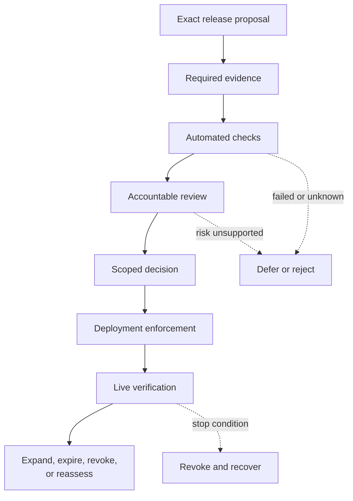
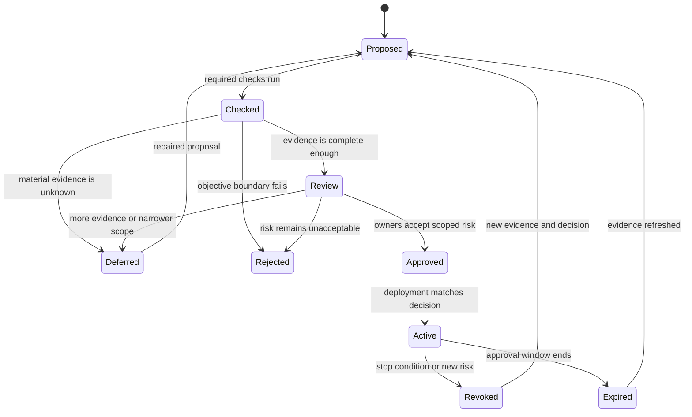

## Table of Contents

1. [What An Approval Gate Checks Before Deployment](#what-an-approval-gate-checks-before-deployment)
2. [Identify the Exact Proposal Before Review](#identify-the-exact-proposal-before-review)
3. [Require Evidence That Matches The Intended Use](#require-evidence-that-matches-the-intended-use)
4. [Automate the Checks With Objective Answers](#automate-the-checks-with-objective-answers)
5. [Give Human Reviewers Clear Decision Authority](#give-human-reviewers-clear-decision-authority)
6. [Keep Passed, Failed, Unknown, and Deferred Separate](#keep-passed-failed-unknown-and-deferred-separate)
7. [Make Exceptions Narrow and Temporary](#make-exceptions-narrow-and-temporary)
8. [Block Deployment Unless The Approved Release Matches The Request](#block-deployment-unless-the-approved-release-matches-the-request)
9. [Verify The Deployed Release And Expire Stale Approvals](#verify-the-deployed-release-and-expire-stale-approvals)
10. [The Main Idea](#the-main-idea)
11. [References](#references)

## What An Approval Gate Checks Before Deployment
<!-- section-summary: An approval gate decides whether one exact release may influence a declared production population and makes the deployment path enforce that decision. -->

Imagine a model that prioritizes incoming support messages. A new version finds more urgent messages on the approved evaluation set. The team proposes a five-percent canary for English-language web tickets. It brings the exact model and serving-image identities, the candidate comparison, segment results, a load test, monitoring queries, and a successful rollback drill.

The release process checks that every piece of evidence refers to the same candidate. ML, product, and operations reviewers examine the risks they own. They approve only the proposed canary, keep other traffic on the current release, and record the stop conditions. The deployment job reads that decision. A request for full traffic or a different model digest stops before deployment.

That is a small, complete approval gate: it receives an identified proposal and evidence, applies automated and human decisions, produces a scoped authority, and controls what the delivery system may do.

At a high level, **an approval gate is the control that turns model evidence into permission for a particular production use**. It answers four plain questions:

1. Which exact release is being considered?
2. Which evidence must support this use?
3. Who has authority to accept the remaining risk?
4. Which deployment action is allowed, for how long, and under which stop conditions?

The gate covers a lifecycle rather than one meeting. A proposal first collects checks and review. Approval can then authorize an active deployment. Production evidence may support expansion, while stale assumptions cause expiry and harmful evidence causes revocation. Each state should have a precise operational meaning.


```mermaid
flowchart TD
    P["Exact release proposal"] --> E["Required evidence"]
    E --> A["Automated checks"]
    A --> H["Accountable review"]
    H --> D["Scoped decision"]
    D --> F["Deployment enforcement"]
    F --> V["Live verification"]
    V --> X["Expand, expire, revoke,<br/>or reassess"]

    A -. "failed or unknown" .-> Q["Defer or reject"]
    H -. "risk unsupported" .-> Q
    V -. "stop condition" .-> R["Revoke and recover"]

    class P,E,A evidence
    class H,D decision
    class F,V,X operation
    class Q,R hold
```

Automation and human judgement have different jobs. Software can compare the request schema with the model contract. It can also verify identities and calculate declared metrics. People judge the consequence of a segment regression or an uncertain workflow effect. A reliable gate needs both.


*Approval connects exact identity and evidence to a decision that the deployment system can enforce and production monitoring can revisit.*

## Identify the Exact Proposal Before Review
<!-- section-summary: The proposal pins every release component that can change predictions, runtime behaviour, or the population receiving the result. -->

A reviewer can approve only a stable subject. A model name such as `priority_model_latest` can move to a different version after the meeting. A container tag such as `main` can point to another build. A threshold can change how many messages reach the urgent queue even if the model weights stay fixed.

The **release identity** therefore covers the complete decision path. It should pin:

- the model version and artifact digest;
- the serving image or environment digest;
- feature definitions and the input contract;
- preprocessing and post-processing code;
- thresholds, routing rules, and fallback policy;
- the evaluation report and its data and code references.

These parts answer different identity questions. The model digest identifies the trained artifact. The image digest identifies the runtime around it. Feature and schema versions describe the data arriving at the model. Policy versions describe how scores turn into product actions. The evidence reference shows what reviewers actually assessed.

The proposal also describes intended use. It names the population, decision, automation level, environment, delivery pattern, and requested authority. Approval for a batch report reviewed by an analyst carries a different risk from approval for immediate automated action, even if both load the same model.

### Registration, approval, and deployment are different states

A registry records that a model version exists. Approval grants a defined authority. Deployment places a release into a real environment and route.

Keeping these states separate prevents several common mistakes. A rejected model can remain registered because its history and evidence still matter. An approved canary can wait undeployed until capacity is available. A deployed release can lose authority after an incident and require rollback even though its registry record remains intact.

Modern MLflow Model Registry workflows use immutable model versions plus tags and aliases; fixed model stages are deprecated. Tags can describe review state, and aliases can help people find a candidate or current model. An alias remains a movable reference. The approval subject and deployment input should use the exact version or digest.

Managed registries expose similar concepts with different names. A SageMaker AI model package starts in `PendingManualApproval`. Review can move it to `Approved` or `Rejected`, and configured projects can react to that change through CI/CD. The status remains one part of the control. The surrounding decision still defines the scope and evidence, while named owners accept the operating conditions.

## Require Evidence That Matches The Intended Use
<!-- section-summary: Evidence requirements follow the proposed decision, population, harm, and operating environment instead of using one universal model checklist. -->

An approval gate should ask for evidence that can answer the proposed production question. A low-risk weekly demand forecast reviewed by a planner needs a different packet from an automated clinical prioritization system. A universal checklist either blocks small changes with irrelevant work or gives high-impact changes too little scrutiny.

The intended use tells the team what to require:

- A decision with delayed labels needs a maturity rule and enough time for outcomes to settle.
- A system serving several languages needs evidence for the languages included in the release scope.
- A model that controls a human queue needs workload and capacity analysis.
- An online endpoint needs a contract test and a representative load test. Dependency behaviour, monitoring, and rollback complete its operating evidence.
- A batch pipeline needs to prove that it found the complete input and published the complete output. Deadline and rerun tests show that operators can deliver and recover the batch.

The candidate comparison supplies the central quality evidence. The production baseline and shared protocol establish what was compared. Effect size and uncertainty explain the change. Segment and robustness results show where that claim may narrow, and recorded limitations show what remains unknown. The gate also receives the exact requested scope so reviewers can tell whether the evidence reaches that far.

### Organize Checks Around The Failures They Prevent

Requirements make more sense to beginners and reviewers if each one protects a visible failure boundary:

| Evidence area | Question it answers | Example failure |
|---|---|---|
| Intended use | What decision and population may change? | A ranking model starts closing cases automatically |
| Data and labels | Did the evaluation represent prediction-time reality? | A feature includes information created after the decision |
| Behaviour | Are overall, segment, robustness, and workload outcomes acceptable? | Higher recall overwhelms the review queue |
| Release identity | Does the report describe the artifact entering production? | The endpoint loads a newer container than the reviewed one |
| Operations | Can the exact release serve, identify itself, and recover? | A registry update leaves old workers handling requests |
| Governance | Are privacy, security, domain, and policy controls satisfied? | Sensitive data enters telemetry without approved retention |

This organization also clarifies missing evidence. If labels have not matured, the model-quality requirement is unknown. A passing load test says nothing about that missing outcome. Evidence from another category cannot cancel the gap.

## Automate the Checks With Objective Answers
<!-- section-summary: CI and managed pipelines repeat objective checks against the pinned proposal and preserve each result as evidence for review. -->

People should spend review time on judgement rather than discovering that a file is missing or a schema is incompatible. CI or a managed ML pipeline can repeat the objective part of the gate each time a candidate is proposed.

Typical automated checks include:

- resolve the exact model, image, data, code, and policy identities;
- reproduce required metrics and compare them with declared limits;
- verify segment floors and minimum sample requirements;
- validate input and output contracts;
- run smoke, integration, load, and fallback tests;
- confirm that dashboards, alerts, and the rollback target exist;
- produce a machine-readable result with links to the evidence.

The sequence matters. Identity and protocol checks run before performance checks because a metric has little value if it belongs to another artifact or invalid dataset. Contract and recovery tests run before traffic because production cannot safely discover those failures for the first time.

Suppose a payment-risk candidate requires thirty days for its outcome label to mature. The pipeline can calculate service metrics immediately, while the quality check has no trustworthy answer after one week. The output should record that quality result as `unknown`. Omitting the check would make the packet appear more complete than it is.

### Record Enough Detail To Reproduce Every Automated Check

Each result should record the check ID, policy version, state, observed value, required limit, evidence URI, and subject identity. Reviewers can then see which rule failed and rerun the same check.

A single green badge loses this detail. It can also hide a gate implementation that silently skipped a test after a dependency error. The pipeline should distinguish a test that ran and passed from a test that never produced valid evidence.

MLflow evaluation can generate standard classic-ML metrics and artifacts. After evaluation, `mlflow.validate_evaluation_results()` can apply metric thresholds. Product outcomes and segment rules still come from the application. Workload, release identity, and operating tests also need separate checks. Weights & Biases and cloud-native tracking platforms can preserve equivalent evidence. The tool records results; the release policy decides what those results authorize.

## Give Human Reviewers Clear Decision Authority
<!-- section-summary: Reviewers judge the residual risk in areas they genuinely own, and their decision applies to the exact release scope under review. -->

Automated checks can show that urgent-message recall fell by three percentage points for one language. They cannot decide whether that loss is acceptable for the support workflow. The decision belongs to people who understand the consequence and hold authority for that risk.

Different reviewers usually own different questions:

- ML or data science owns the evaluation method, uncertainty, and modelling limitations.
- Data owners confirm feature meaning, label validity, and permitted use.
- Product or domain owners judge the effect on users and workflows.
- Platform and operations own capacity, observability, containment, and recovery.
- Security, privacy, legal, or responsible-AI reviewers own the controls in their areas.

These are decision rights rather than a voting panel. Three approvals cannot overrule the operations owner if rollback is broken. A product owner cannot certify that a label pipeline is valid without the data owner. Each required reviewer should state `approve`, `reject`, or `request narrower scope` for the area they own.

Consider a triage model that improves overall prioritization and loses recall for a high-consequence symptom group. The domain reviewer can block automated use for that group. A limited release may remain possible if routing can reliably identify the supported population, excluded cases follow a safe path, and monitoring proves the boundary. If the system cannot enforce that separation, a narrower sentence in the meeting notes provides no protection.

NIST's AI Risk Management Framework organizes work through Govern, Map, Measure, and Manage. An approval gate puts those ideas into a delivery decision: governance establishes roles, mapping defines the use and harm, measurement produces evidence, and management chooses and monitors the response.

## Keep Passed, Failed, Unknown, and Deferred Separate
<!-- section-summary: Clear evidence states prevent a missing or inconclusive result from silently granting the authority requested by a release. -->

Suppose a pipeline cannot read the mature-label table because its service identity lost permission. The quality rule did not pass, and the evidence never proved that it failed. Treating that execution as either result would hide the real problem: the gate has no trustworthy answer.

A robust gate therefore uses more than pass and fail:

- **Passed** means the check ran against the pinned proposal and met its rule.
- **Failed** means trustworthy evidence violated the rule.
- **Unknown** means trustworthy evidence is missing or inconclusive.
- **Deferred** is a release outcome: the requested authority waits while the team resolves a material unknown.

Unknown deserves its own state because it leads to different work. A failed segment floor may require new data, a model change, or a smaller scope. An unknown label result may require time for maturity or repair of an outcome join. Calling both “failed” hides the repair. Calling unknown “passed” creates unsupported production authority.


```mermaid
stateDiagram-v2
    [*] --> Proposed
    Proposed --> Checked: required checks run
    Checked --> Review: evidence is complete enough
    Checked --> Deferred: material evidence is unknown
    Checked --> Rejected: objective boundary fails
    Review --> Approved: owners accept scoped risk
    Review --> Deferred: more evidence or narrower scope
    Review --> Rejected: risk remains unacceptable
    Approved --> Active: deployment matches decision
    Active --> Revoked: stop condition or new risk
    Active --> Expired: approval window ends
    Deferred --> Proposed: repaired proposal
    Revoked --> Proposed: new evidence and decision
    Expired --> Proposed: evidence refreshed
```

The release response should state which work remains allowed. A candidate with credible offline quality and unknown runtime behaviour may receive isolated shadow authority. It still lacks permission to influence decisions. A model with an invalid evaluation protocol should return to offline work because later runtime evidence cannot repair the comparison.

Some progressive-delivery tools represent uncertainty explicitly. Argo Rollouts analysis runs can succeed, fail, or remain inconclusive. An inconclusive analysis can pause the rollout for human judgement. The ML gate should preserve the same distinction for delayed labels, missing segments, or a monitoring query that returned no trustworthy data.


*A production request proceeds only if the evidence state, subject identity, scope, and time window all support it.*

## Make Exceptions Narrow and Temporary
<!-- section-summary: An exception accepts one identified residual risk for a limited scope, period, and owner while adding compensating controls and a clear exit. -->

Release pressure sometimes meets a real constraint. A non-critical dashboard may be unavailable during a low-volume canary. A supplier assessment may need renewal while an existing integration continues under extra monitoring. An **exception** is the explicit decision to accept that residual risk under tighter conditions.

An exception should record:

- the exact failed or missing requirement;
- why the requested work cannot wait;
- the owner accepting the residual risk;
- the smallest traffic and population scope;
- a compensating control;
- an expiry or earlier stop condition;
- the evidence required to close the exception.

For example, a small non-decisioning shadow run might proceed while a quality dashboard is repaired. Raw outputs remain isolated, no user action changes, and an operator reviews error logs. The exception expires after the evidence-collection window or as soon as the dashboard is restored.

Some boundaries should remain ineligible for exception. A high-impact release with ambiguous artifact identity gives reviewers no stable subject. A leaked evaluation protocol provides no valid quality evidence. A missing recovery path leaves operators unable to contain known harm. Policy owners should declare these non-waivable conditions before schedule pressure appears.

Exceptions should remain separate from ordinary approval. Otherwise, a temporary risk decision can slowly turn into the default production path. Expiry, alerts, and an owner make the temporary nature operationally visible.

## Block Deployment Unless The Approved Release Matches The Request
<!-- section-summary: The delivery system compares the requested action with the active decision and fails closed on mismatched identity, scope, state, or expiry. -->

A meeting record has little effect if the deployment pipeline can ignore it. The **enforcement point** is the place where a production-changing request is allowed or denied. It may be a managed ML deployment pipeline, a CI/CD job, a GitOps admission step, or an internal release service.

The input is a requested action: deploy this exact release to this environment, population, and traffic percentage. The enforcement point retrieves the active decision and checks subject identity, granted authority, scope, conditions, and expiry. The visible result is an allow or deny response with rule IDs. A denial stops before traffic changes.

The following compact decision record describes one active canary. It assumes all referenced evidence has already been reviewed. A deployment request can use it to verify the model and image digests, English web-ticket route, five-percent cap, stop policy, and rollback target.

```yaml
decision_id: support-priority-candidate-17-canary
state: active
subject:
  model_version: "17"
  model_sha256: "4b1f..."
  image_digest: "sha256:91cd..."
  policy_sha256: "128a..."
authority:
  kind: canary
  population: english_web_tickets
  traffic_percent_max: 5
stop_policy: support-priority-canary-v3
rollback_release: support-priority-production-16
expires_after: 7d
```

This record grants a capability, not a description. It authorizes one action inside fixed boundaries. A full-traffic request, another population, or a different digest must receive a denial.

### Use policy as code if several pipelines share the rule

A small team can implement the checks in a reviewed deployment script with tests. As platforms grow, Open Policy Agent (OPA) offers a common policy decision point. The deployment pipeline remains the enforcement point: it supplies structured input, asks OPA for a decision, and obeys the result.

The next rule assumes a trusted release service has already checked the decision's expiry and set its state. The input contains the active decision plus the release action requested by the deployment job. Matching canary authority, model digest, population, and traffic cap return `true`; a broader or mismatched request returns `false`.

```rego
package ml.release

import rego.v1

default allow := false

allow if {
    input.decision.state == "active"
    input.request.authority == input.decision.authority.kind
    input.request.model_sha256 == input.decision.subject.model_sha256
    input.request.population == input.decision.authority.population
    input.request.traffic_percent <= input.decision.authority.traffic_percent_max
}
```

OPA separates policy decision from policy enforcement. It does not deploy a model, verify a dashboard, or operate rollback. The CI/CD or serving platform performs those actions and records the result.

Provider-native status can participate in the same path. A SageMaker AI model package can remain `PendingManualApproval` until review and move to `Approved` before configured CI/CD deploys it. MLflow tags can expose review state to automation. Those flags are useful discovery and trigger mechanisms. A full gate still verifies the exact subject, scope, expiry, and live deployment.


*Registration records an artifact, approval grants scoped authority, deployment applies it, and verification keeps that authority tied to the running release.*

## Verify The Deployed Release And Expire Stale Approvals
<!-- section-summary: Active approval remains valid only while deployment identity, traffic scope, evidence assumptions, monitoring, and accountable ownership continue to hold. -->

The deployment job should verify the result it created. It checks that the endpoint or batch job is running the approved model, image, feature, and policy versions. It confirms the traffic percentage and population route. Prediction events should carry the decision ID and safe release identity so monitoring can separate candidate and control.

The first production checks use immediate evidence: schema failures, feature coverage, latency, error rate, saturation, fallback use, decision rates, and route leakage. Outcome quality arrives according to the label-maturity policy. A stop condition should name the metric, direction, window, minimum evidence, and recovery action.

If a stop condition fires, operations needs authority to revoke the decision and restore the retained release without waiting for another review meeting. Verification follows the data path: send a new request or inspect a new batch output, then confirm that the production identity has returned. The incident record preserves why authority was revoked.

### Require Another Review After Important Evidence Becomes Stale

Some evidence ages quickly. Recent-traffic comparisons lose relevance after a major product change. Capacity tests can become stale after a serving-image update. Privacy assessments can depend on a supplier or data use that later changes.

An approval therefore needs an expiry rule. It might be a fixed duration, the arrival of enough mature labels, a model or policy change, a dependency change, or the end of a canary stage. Expiry removes authority; it does not delete the model or its history.

Expansion also requires a new decision. Raising traffic changes capacity, label volume, queue pressure, cost, and exposure. The team can reuse valid evidence while adding the proof required by the larger scope.

### Record What Was Approved And What Reached Production

The audit trail should preserve:

- the proposal and exact subject identity;
- evidence and policy versions;
- each automated result, including unknowns and errors;
- reviewer identity, role, decision, and rationale;
- exceptions, compensating controls, and expiry;
- the enforced deployment request and result;
- activation, verification, expansion, revocation, rollback, and expiry events.

Access controls should prevent the release writer from silently changing the approval record or policy. Retention should match incident, governance, and legal needs. Sensitive evaluation rows remain in governed data storage; the decision can reference them without copying private payloads into a broad release log.

The resulting lifecycle is inspectable from both directions. A production prediction can lead back to the decision that authorized its release. A decision can lead forward to the deployment, traffic, monitoring, and eventual expiry or revocation that followed.

## The Main Idea
<!-- section-summary: A reliable approval gate binds one exact ML release to evidence, accountable authority, enforceable scope, live verification, and a recorded lifecycle. -->

An approval gate gives evidence operational force. It identifies the complete release and intended use, asks for evidence that fits the risk, repeats objective checks, and gives residual decisions to the people who own them.

Passed, failed, and unknown evidence remain distinct. A defer outcome creates time or work for missing proof. Exceptions stay narrow and temporary. The deployment boundary enforces the granted scope, and production verification confirms that the approved system is the one receiving traffic.

Approval remains a living control. It can expand after new evidence, expire as assumptions age, or be revoked after a stop condition. The audit trail connects every state to the people, evidence, policy, and production action that created it.

## References

- [MLflow: Model evaluation](https://mlflow.org/docs/latest/ml/evaluation/)
- [MLflow: Model Registry workflows](https://mlflow.org/docs/latest/ml/model-registry/workflow/)
- [Amazon SageMaker AI: Update model approval status](https://docs.aws.amazon.com/sagemaker/latest/dg/model-registry-approve.html)
- [Amazon SageMaker AI: Canary traffic shifting](https://docs.aws.amazon.com/sagemaker/latest/dg/deployment-guardrails-blue-green-canary.html)
- [Azure Machine Learning: Progressive rollout of MLflow models to online endpoints](https://learn.microsoft.com/en-us/azure/machine-learning/how-to-deploy-mlflow-models-online-progressive?view=azureml-api-2)
- [Argo Rollouts: Analysis and progressive delivery](https://argo-rollouts.readthedocs.io/en/stable/features/analysis/)
- [Open Policy Agent: CI/CD policy enforcement](https://www.openpolicyagent.org/docs/cicd)
- [Open Policy Agent: Deployment patterns](https://www.openpolicyagent.org/docs/deploy)
- [NIST AI Risk Management Framework Core](https://airc.nist.gov/airmf-resources/airmf/5-sec-core/)
