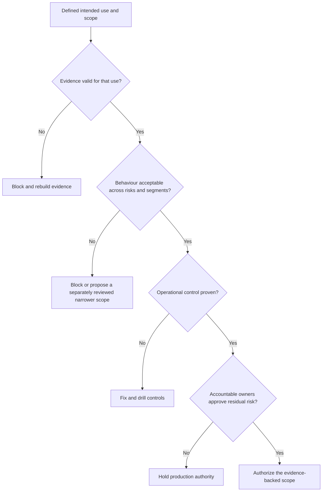

## Keep a Model Out of Production When Its Use Exceeds Its Evidence
<!-- section-summary: A no-ship decision protects users when the intended use, evidence, behaviour, operations, or ownership cannot support the proposed release. -->

You should **keep a model out of production** when its evidence and controls cannot support the exact use being proposed. A better average metric cannot repair leaked evaluation data, a serious regression for an important group, a missing fallback, an untested rollback, or an unresolved domain risk.

A no-ship review tests five independent conditions:

1. **Defined use:** The decision, population, automation level, and release scope are explicit.
2. **Valid evidence:** The data, labels, time boundaries, code, and artifact identity represent that use.
3. **Acceptable behaviour:** Metrics, uncertainty, segments, robustness, and human workload stay inside reviewed limits.
4. **Operational control:** Operators can identify, monitor, contain, fall back, and recover the exact release.
5. **Accountable authority:** The owners of remaining product, domain, privacy, security, and operational risk support the proposed scope.

These conditions act as separate gates. Teams should avoid combining them into one weighted readiness score. Excellent latency cannot compensate for labels copied from the future. A strong overall metric cannot cancel a high-consequence segment failure. An approval meeting cannot create a rollback path that engineering has never tested.



The outcome can still be precise. Offline research, non-decisioning shadow traffic, a restricted canary, and full production carry different authority. A candidate may continue collecting shadow evidence while remaining blocked from changing user decisions.


*Defined use, valid evidence, acceptable behaviour, operational control, and accountable authority are independent production conditions.*

## Stop When the Intended Use Is Ambiguous or Expands
<!-- section-summary: Evaluation can support only the population, decision, automation level, and environment that reviewers actually assessed. -->

**Intended use** describes what the system will do, whose cases it will process, which environment it will run in, and how people or software will use its result. A message-priority model that orders a nurse queue has a different intended use from a model that closes messages automatically. Evidence for the first use cannot authorize the second.

Scope drift often happens in small steps. A pilot expands to another country with a new language. A recommendation score starts controlling eligibility. A human reviewer loses time to inspect every decision and begins accepting outputs automatically. Each change alters the potential harm, data distribution, or control structure.

The review should stop when the proposal lacks a stable answer to these questions:

- Which population and traffic route will receive the result?
- Which action can the result trigger?
- Which human can inspect, override, or appeal the action?
- Which data and features are allowed for this purpose?
- Which release stage is requested, and what exposure does it create?

A narrower proposal can be valid when routing and policy can enforce it. A model with adequate English-language evidence and weak Spanish-language evidence may support an English-only shadow study. A canary for that scope requires a reliable language boundary, separate monitoring, product approval, and safe handling for excluded traffic. Reviewers should treat the narrower use as its own decision rather than inventing it during a meeting.

## Stop When the Evidence Cannot Represent Production
<!-- section-summary: Invalid labels, leakage, stale samples, missing coverage, or ambiguous artifact identity make later metric results unsuitable for release. -->

Evidence validity asks whether the evaluation measures the proposed production system. The review checks label definition and maturity, prediction-time feature availability, dataset selection, time boundaries, row coverage, baseline reconstruction, metric code, and release identity.

**Data leakage** occurs when evaluation uses information that would not exist at prediction time or allows training information into the test set. A support-priority model may accidentally use the final resolution category, which staff add hours after the first prediction. The offline result then describes a system production cannot run.

Stale or selective samples create another problem. A model evaluated before a pricing change, policy change, or product migration may face different traffic at release time. A candidate path that drops validation failures can appear more accurate because difficult requests vanish. Reports should show the denominator at every stage: eligible, attempted, completed, failed, and joined to mature labels.

Artifact identity must connect the report to the proposed runtime. A label such as `latest` or `best` can move after review. The decision should pin the model digest or registry version, serving image, feature definitions, thresholds, preprocessing, and policy configuration. Any change that can alter decisions requires new evidence or a declared compatibility rule.

When evidence is invalid, the team should rebuild the protocol and rerun both the production baseline and candidate. Threshold tuning and extra charts cannot rescue a comparison whose rows, labels, or identities are wrong.

## Stop When Important Behaviour Is Unacceptable
<!-- section-summary: A candidate must meet the chosen operating point and protect important groups, conditions, edge cases, and human workflows. -->

Model quality depends on an **operating point**, the threshold or policy that turns scores into actions. A fraud model can raise recall by sending more legitimate purchases to review. A triage model can detect more urgent cases while overwhelming staff with false alarms. The review has to evaluate the complete outcome at the proposed operating point.

Overall metrics provide a summary, and segment analysis shows who or what carries the errors. Teams should choose segments from known harms, product routes, domain conditions, incident history, and policy obligations. Each result needs a denominator and uncertainty. An important sparse group may require targeted data collection or a limited release rather than a broad safety claim.

Some reasons to block on behaviour include:

- a practical improvement margin has not been met;
- an uncertainty interval still includes a harmful regression;
- a protected segment or critical operating condition crosses its limit;
- robustness tests expose unsafe schema, missing-data, or stress behaviour;
- calibration fails where scores drive resource or risk decisions;
- the candidate increases human workload beyond available capacity;
- error review finds a repeated high-consequence failure that the aggregate metric hides.

CareBridge provides a focused example. Its model prioritises patient portal messages for nurse review. Candidate version 14 improves the main ranking metric, while urgent-message recall for Spanish-language messages falls to `0.74` against a reviewed `0.92` requirement. Error review finds valid urgent messages about breathing problems and medication reactions. The candidate should remain outside queue-ordering traffic. The team can continue offline work and isolated shadow analysis while it improves data coverage, labels, routing, or model design.

This example also shows why threshold changes need review. Lowering the threshold may recover urgent messages and send far more routine messages to nurses. Queue capacity and delayed review then create another patient risk. The operating point joins model behaviour to the real workflow.

## Stop When the Release Cannot Be Observed or Recovered
<!-- section-summary: Production authority requires complete identity, user-impact signals, containment, fallback, and a recovery path that works against actual serving state. -->

Offline evidence says how a model behaved on recorded data. Operational control says whether the team can keep that behaviour inside a safe boundary after deployment. A release should remain blocked until operators can identify the exact version on prediction events, see service and user-impact signals, limit exposure, invoke a fallback, and restore a known release.

Service dashboards need latency, errors, saturation, and resource use. Model operations also need feature quality, prediction distributions, decision rates, segment outcomes, mature labels, and workload impact. Early signals such as missing features can detect a broken pipeline quickly. Delayed outcome labels confirm whether the product quality actually changed.

A rollback drill should change the system that handles requests. Moving a registry alias may leave processes with a candidate already loaded in memory. The drill sends identifiable traffic, performs the documented recovery action, and verifies that new events report the retained release. If the old model depends on an incompatible feature schema or container, the rollback unit must include those pieces too.

Containment can be smaller than full rollback. Teams may route affected traffic to the prior model, disable one feature, move to a rules-based fallback, require human review, or pause automated action. The chosen control should match the failure boundary and preserve evidence for investigation.

CareBridge's shadow logs provide another blocker: 18 percent of events lack `model_version`, and the rollback drill moves an alias without changing the loaded model. Operators cannot attribute failures reliably or prove that containment worked. These controls require repair even if a later candidate resolves the segment problem.

## Stop When Nobody Can Accept the Remaining Risk
<!-- section-summary: Different owners judge different residual risks, and every required authority must support the exact release scope. -->

Metrics and tests reduce uncertainty, while every release still carries **residual risk**, the risk left after the planned controls. Named owners decide whether that remainder is acceptable for the intended use. ML engineering owns the evaluation method. Data owners confirm feature and label validity. Domain and product owners judge workflow consequences. Platform and operations own capacity, monitoring, containment, and recovery. Privacy, security, and governance owners judge the controls in their areas.

The decision should follow authority rather than a majority vote. Five approvals cannot cancel the objection of the owner responsible for an unresolved safety control. A reviewer should state the exact finding, the affected scope, and the evidence required for reconsideration. This keeps disagreement technical and traceable.

An exception is a separate, time-limited risk decision. It needs a narrow scope, accountable owner, compensating controls, expiry, and monitoring. Some failures should remain ineligible for exception, such as ambiguous artifact identity, an invalid evaluation protocol, or a missing recovery path for high-impact traffic. Policy should define those boundaries before release pressure appears.

## Turn a No-Ship Decision Into Enforceable Work
<!-- section-summary: A useful block records the exact subject, denied authority, evidence, owners, repair work, and conditions for another review. -->

A no-ship record should remain attached to the exact release it evaluated. It names the artifact and configuration, proposed scope, failed conditions, evidence links, owners, and allowed work. A later retraining run creates a new candidate and decision. Editing the old record into a pass would erase why that artifact never received traffic.

The record can allow offline evaluation and non-decisioning shadow work while denying canary and production authority:

```yaml
decision_id: CB-NS-2026-0714-14
release_id: carebridge-urgent-message-14
artifact_sha256: 2c99...
state: blocked
allowed_authority: [offline_evaluation, isolated_shadow]
blocked_authority: [canary, production]
findings:
  - id: spanish_urgent_recall
    observed: 0.74
    required: 0.92
    owner: clinical-data
  - id: prediction_identity_coverage
    observed: 0.82
    required: 1.00
    owner: platform-operations
  - id: rollback_loaded_version
    observed: failed
    required: passed
    owner: platform-operations
```

Release automation requests a specific authority and submits the release ID and digest. Missing decisions, mismatched identities, expired exceptions, or authorities absent from the allowed list should fail closed. Tests should attempt every authority and verify that isolated shadow work passes while canary and production fail.


*A no-ship decision can preserve offline learning and isolated shadow work while denying canary and production authority for the exact release.*

Each finding needs a route back to review. The clinical-data team can improve language coverage and label quality. The model team can compare multilingual modelling, a routed architecture, or another operating point. Platform operations can make release identity mandatory and repair rollback. The next candidate then repeats the same evaluation protocol, including the earlier failure cases.

This repair loop keeps a block productive. The team preserves the decision history, fixes the actual failure boundary, and returns with a new subject and fresh evidence.

## Recognize Weak Reasons for Shipping Anyway
<!-- section-summary: Schedule pressure, sunk cost, one improved metric, or a planned future fix cannot substitute for a release condition that still fails. -->

Release meetings often happen after a team has spent weeks training, tuning, and integrating a candidate. That investment can create pressure to reinterpret a blocker as a minor concern. The review should keep the decision tied to evidence rather than effort already spent.

Several arguments deserve explicit challenge. “The overall score improved” says nothing about whether the test was valid or important segments remain safe. “The first canary is small” reduces exposure, while it still requires identity, monitoring, and working containment. “We can fix it after launch” asks users to carry a risk that the team already understands. “A human remains involved” provides protection only when that person has enough information, time, authority, and a tested escalation path.

Another weak argument uses a competitor or industry trend as release evidence. External adoption can show that a technique is practical, while the local decision still depends on local data, workflow, users, and controls. A vendor benchmark cannot prove that the model meets the product's operating point.

The review should also avoid indefinite perfectionism. Every release carries uncertainty, and a blocker should identify a material failure condition rather than a vague discomfort. A strong block states the affected harm, evidence, enforceable scope, owner, and next test. This standard helps teams stop unsafe releases without turning review into an open-ended search for certainty.

## A Clear Block Protects Users and Future Releases
<!-- section-summary: No-ship decisions keep production authority aligned with valid evidence and give the next candidate a repeatable path back to review. -->

A model should remain out of production when its intended use is unclear, its evidence cannot represent production, an important behaviour is unacceptable, operators cannot control the release, or accountable owners cannot approve the residual risk. These conditions protect different parts of the system and should remain visible rather than collapsing into one readiness number.


*A useful block identifies the failed boundary and the next safe test, then sends a new candidate through every release condition again.*

A strong no-ship decision states which authority is denied, preserves the exact evidence, assigns repair work, and identifies the next test. The model team can continue learning without exposing users to a decision that the current evidence cannot support.

## References

- [NIST AI Risk Management Framework](https://www.nist.gov/itl/ai-risk-management-framework)
- [NIST AI RMF Core](https://airc.nist.gov/airmf-resources/airmf/5-sec-core/)
- [MLflow Model Registry workflows](https://mlflow.org/docs/latest/ml/model-registry/workflow/)
- [MLflow model signatures](https://mlflow.org/docs/latest/ml/model/signatures/)
- [scikit-learn model evaluation](https://scikit-learn.org/stable/modules/model_evaluation.html)
- [Google SRE Workbook: Canarying Releases](https://sre.google/workbook/canarying-releases/)
