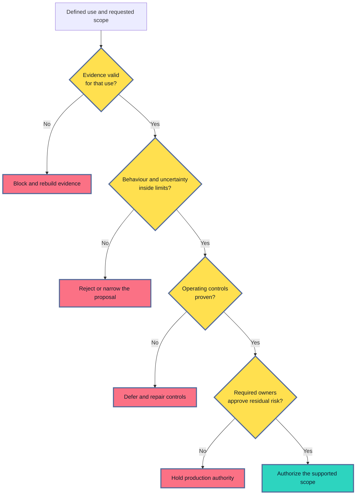
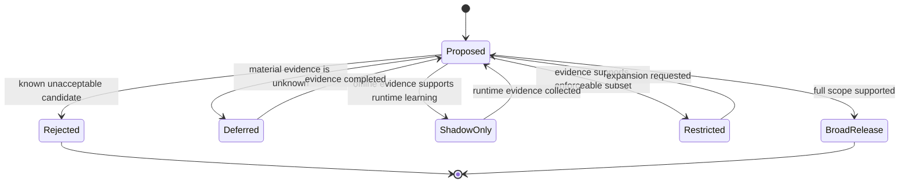
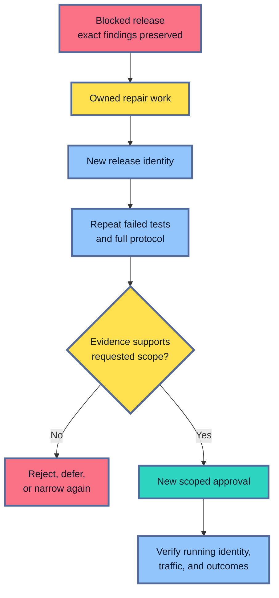

## Table of Contents

1. [A No-Ship Decision Keeps Authority Behind the Evidence](#a-no-ship-decision-keeps-authority-behind-the-evidence)
2. [Choose Reject, Defer, Shadow, or Restricted Release Deliberately](#choose-reject-defer-shadow-or-restricted-release-deliberately)
3. [Block a Release With an Unclear or Expanding Use](#block-a-release-with-an-unclear-or-expanding-use)
4. [Block a Release Built on Invalid Evidence](#block-a-release-built-on-invalid-evidence)
5. [Block Unacceptable Behaviour and Unresolved Harm](#block-unacceptable-behaviour-and-unresolved-harm)
6. [Block a Release That Operators Cannot Control](#block-a-release-that-operators-cannot-control)
7. [Block a Release Without Accountable Authority](#block-a-release-without-accountable-authority)
8. [Turn the Block Into Enforceable Repair Work](#turn-the-block-into-enforceable-repair-work)
9. [Return a New Candidate to the Full Review](#return-a-new-candidate-to-the-full-review)
10. [The Main Idea](#the-main-idea)
11. [References](#references)

## A No-Ship Decision Keeps Authority Behind the Evidence
<!-- section-summary: A no-ship decision denies production influence if the proposed use exceeds the release's evidence, behaviour, controls, or accountable approval. -->

Imagine a model that prioritizes patient messages for nurse review. The candidate improves the overall ranking score. The same evaluation shows that it misses too many urgent messages in one language, and the rollback drill cannot prove which version handles new requests after recovery.

The team has useful evidence and a serious boundary. It keeps the candidate out of queue-ordering traffic. Offline work may continue, and an isolated shadow can collect current runtime evidence without changing the order seen by nurses. The release record names the segment failure, broken recovery proof, responsible owners, and tests required from a new candidate.

That is a complete no-ship outcome. The team makes a precise decision, preserves safe learning, and keeps production authority with the current system.

At a high level, **a model should stay out of the requested production scope if its intended use, evidence, behaviour, operating controls, or accountable approval cannot support that scope**. These are independent conditions:

1. **Defined use:** the decision, population, automation level, and release scope are stable.
2. **Valid evidence:** the data, labels, comparison, and release identity represent that use.
3. **Acceptable behaviour:** quality, uncertainty, segments, robustness, and workload stay inside reviewed limits.
4. **Operational control:** operators can identify, observe, contain, fall back, and recover the exact release.
5. **Accountable authority:** the owners of the remaining product, domain, data, security, privacy, and operational risk accept the proposed scope.

Each condition protects a different failure boundary. Better latency cannot repair evaluation leakage. A higher average score cannot cancel a severe regression for an important group. Review approval cannot create a rollback path that the platform has never tested.


```mermaid
flowchart TD
    U["Defined use and requested scope"] --> E{"Evidence valid<br/>for that use?"}
    E -- "No" --> B1["Block and rebuild evidence"]
    E -- "Yes" --> Q{"Behaviour and uncertainty<br/>inside limits?"}
    Q -- "No" --> B2["Reject or narrow the proposal"]
    Q -- "Yes" --> O{"Operating controls<br/>proven?"}
    O -- "No" --> B3["Defer and repair controls"]
    O -- "Yes" --> A{"Required owners<br/>approve residual risk?"}
    A -- "No" --> B4["Hold production authority"]
    A -- "Yes" --> R["Authorize the supported scope"]

    classDef question fill:#FFE04F,stroke:#536A9A,stroke-width:3px,color:#111827
    classDef block fill:#FB7185,stroke:#536A9A,stroke-width:3px,color:#111827
    classDef release fill:#2DD4BF,stroke:#536A9A,stroke-width:3px,color:#0F172A
    class E,Q,O,A question
    class B1,B2,B3,B4 block
    class R release
```

The flow preserves the reason for the block. Invalid evidence returns to the evaluation protocol. Unacceptable behaviour returns to data, modelling, product policy, or scope. Missing controls return to platform work. Missing authority returns to the owner of that risk.


*Defined use, valid evidence, acceptable behaviour, operating control, and accountable authority each have the power to hold production influence.*

## Choose Reject, Defer, Shadow, or Restricted Release Deliberately
<!-- section-summary: Different evidence failures lead to different release outcomes, and each outcome grants a distinct level of authority. -->

“Do not ship” can describe several decisions. Keeping them separate helps the team choose the right repair and prevents a limited approval from quietly widening.

**Reject** closes the current candidate for the requested use. The model may depend on a prohibited feature, repeatedly fail a safety-critical segment, or offer too little value to justify its cost. Further work creates a new candidate and a new decision.

**Defer** pauses the decision because material evidence is missing or still changing. Labels may need another maturity window. A privacy review may be incomplete. A load-test environment may have failed before producing a trustworthy result. The team preserves the proposal and returns after the unknown is resolved.

**Shadow-only authority** allows the candidate to receive isolated copies of real inputs while the production result remains authoritative. This can answer questions about current schemas, feature coverage, runtime, and prediction divergence. It gives the candidate no permission to change the user or workflow outcome.

**Restricted release** authorizes an enforceable subset. Evidence may support one language, region, product route, or low-risk decision while another remains blocked. The router, policy, monitoring, and fallback must preserve that boundary.


```mermaid
stateDiagram-v2
    [*] --> Proposed
    Proposed --> Rejected: known unacceptable candidate
    Proposed --> Deferred: material evidence is unknown
    Proposed --> ShadowOnly: offline evidence supports runtime learning
    Proposed --> Restricted: evidence supports enforceable subset
    Proposed --> BroadRelease: full scope supported
    Deferred --> Proposed: evidence completed
    ShadowOnly --> Proposed: runtime evidence collected
    Restricted --> Proposed: expansion requested
    Rejected --> [*]
    BroadRelease --> [*]
```

These outcomes grant different levels of authority. Shadow traffic can be the correct destination for a promising candidate with incomplete runtime evidence. Rejection can be the correct destination for a well-measured candidate whose harm exceeds the limit. Restricted release works only if the boundary is real.

Consider a multilingual support classifier with strong English evidence and sparse evidence for two other languages. An English-only shadow may be reasonable if language routing is reliable and copied predictions create no side effects. An English-only automated release needs stronger product and operating evidence because its predictions now change a queue. A broad release remains unsupported.

The decision should always state the requested authority and the granted authority. This prevents “approved for shadow” from being read later as “approved.”

## Block a Release With an Unclear or Expanding Use
<!-- section-summary: Evaluation can authorize only the decision, population, automation level, data use, and environment that reviewers actually assessed. -->

**Intended use** describes what the model's output will influence. It includes the population, product action, level of automation, human oversight, environment, and data permitted for that purpose.

A message-priority score used to order a human review queue has one intended use. Using the same score to close low-priority messages creates another. The second use gives the model more authority, changes the harm of a mistake, and may need different metrics, appeal paths, and domain review.

Scope can expand gradually:

- a pilot moves into a country with another language and policy;
- a recommendation score starts controlling eligibility;
- a reviewer loses time to inspect every output and begins accepting it automatically;
- a batch report turns into an API called during live decisions;
- a feature approved for fraud prevention appears in a marketing model.

Each change alters the question that the evidence must answer. A previous report can remain informative, although it cannot authorize an untested action.

### Ask what will happen to one real case

A practical scope review follows one case through the proposed system:

1. Which person, account, item, or event enters the model?
2. Which data is read at prediction time?
3. Which score or output is produced?
4. Which policy turns that output into an action?
5. Who can inspect, override, or appeal the action?
6. Which route receives the release, and which route remains on the current system?

This walkthrough exposes ambiguity quickly. “Decision support” sounds limited until the team learns that staff are expected to accept the top-ranked action without review. “Internal analytics” sounds low risk until the report starts controlling customer eligibility.

A narrower proposal can return to review if the platform can enforce it. For example, evidence may support English-language cases under human review. The release policy must identify that language reliably, route other cases to a safe path, monitor both populations, and prevent the approved route from gaining automatic authority. If any of those controls are missing, the narrow proposal still exceeds its evidence.

## Block a Release Built on Invalid Evidence
<!-- section-summary: Leakage, immature labels, stale samples, missing coverage, unfair baselines, and ambiguous release identity invalidate the comparison before metric quality matters. -->

Evidence is valid if it measures the production decision being proposed. A polished report can still describe the wrong system.

**Data leakage** occurs if training or evaluation uses information unavailable at prediction time, or if information crosses between training and test groups. A support-priority model might use the final resolution category, which staff add hours after the first prediction. The model can score extremely well offline because the feature reveals part of the answer. Production cannot reproduce that result.

Immature labels create a quieter error. Suppose the target is “missed payment within thirty days.” Cases evaluated after one week include many apparent negatives that still have time to become positive. A candidate can look unusually accurate even though the label window has not closed.

Coverage can also distort the comparison. If the candidate drops invalid or difficult requests before scoring, it receives credit only for cases it completed. The report should preserve the denominator from eligible traffic through attempted predictions, successful outputs, fallbacks, errors, and mature-label joins.

### Identity determines which system the evidence describes

The decision should pin the model artifact, serving image, feature definitions, schema, preprocessing, threshold, and policy. A movable name such as `latest` or `candidate` can point elsewhere after review. If the deployed combination differs from the evaluated combination, the evidence describes another release.

Modern MLflow Registry guidance uses model versions, tags, and aliases because fixed model stages are deprecated. A tag can record a no-ship finding, and an alias can help people locate a candidate. The decision and deployment should still pin the exact version or digest.

### Repair the failing comparison directly

Extra plots and threshold tuning cannot rescue leaked features or incorrect labels. The team repairs the failing boundary:

- remove the unavailable feature and rebuild historical examples at their true prediction times;
- wait for label maturity or redefine the target explicitly;
- reconstruct both production and candidate paths under the same policy;
- restore failed and fallback cases to the denominator;
- pin the complete release identity and rerun the evaluation.

Verification uses a fresh report from the corrected protocol. It should include the earlier failure as a test: the prohibited feature is absent, labels meet the maturity rule, coverage reconciles to eligible traffic, and the report points to the proposed release.

## Block Unacceptable Behaviour and Unresolved Harm
<!-- section-summary: A candidate remains outside production influence if practical gains, uncertainty, segments, robustness, calibration, or workflow effects cross reviewed limits. -->

Valid evidence can deliver an unacceptable answer. Imagine a fraud candidate that catches more fraud overall and wrongly blocks many more legitimate payments from one region. The evaluation is fair, and the result still crosses a product harm limit. A release decision must judge the consequence as well as the validity of the measurement.

The operating point matters because thresholds and policies turn scores into actions. A fraud model can raise recall by sending many more legitimate purchases to review. A triage model can find more urgent cases and overwhelm staff with false alarms. A ranking model can raise average relevance while removing all useful results for a small query class.

The team should block or narrow a release if:

- the improvement fails to reach the practical margin;
- the uncertainty interval still contains a harmful regression;
- a critical segment or operating condition crosses its limit;
- robustness tests expose unsafe missing-data, schema, stress, or adversarial behaviour;
- calibration fails where a probability controls resources or risk;
- human workload exceeds available capacity;
- error review reveals a repeated high-consequence failure hidden by the average.

### Separate known harm from missing knowledge

Known harm and uncertainty need different responses. If urgent-message recall is credibly below its required floor, the candidate has failed that condition. If the segment contains twelve mature labels, the result may be too uncertain to support broad authority.

The second case still blocks the broad release. Its repair is evidence collection. Treating the small sample as a pass would grant authority without proof. The team might run isolated shadow traffic, improve label coverage, extend the observation window, or keep the segment on the current path.

Consider an automated review queue that can process 2,000 alerts each day. A new threshold raises recall and produces 7,000 alerts. The metric gain is real, while the delivered system leaves thousands of cases unread. The proposed operating point fails the workflow constraint.

The team may raise the threshold and accept lower recall, or it may fund more review capacity. A safe routing rule could reserve human attention for the highest-risk cases. Rejection is appropriate if none of those changes produce a useful system. Every option needs a new comparison at the policy that production will actually use.

### Inspect the consequence, then choose the repair

A segment regression may come from weak data coverage, label error, the model, the threshold, or a product route. The owner should inspect representative errors and upstream evidence before choosing a remedy.

Adding more training data is appropriate if the missing pattern is real and labels can be improved. A routed model may help if populations have distinct mechanisms and enough evidence. A conservative fallback may protect a rare high-consequence case. A narrower release may work if traffic boundaries are reliable. The next test should show that the chosen change repaired the observed harm without breaking workload, latency, or another segment.

## Block a Release That Operators Cannot Control
<!-- section-summary: Production authority requires observable release identity, enforceable containment, a safe fallback, and a recovery path proven against the data plane. -->

Offline evidence describes recorded predictions. Production adds live dependencies and a running process that may keep the model in memory. A team can issue a successful rollback command and still leave the candidate serving requests. Operations must control and verify what happens in the data path.

A release should remain blocked until operators can answer:

- Which model, image, feature, and policy version produced this decision?
- Which traffic and population received the candidate?
- Which service and model-quality signals show harm?
- Which control limits exposure or selects the fallback?
- Which retained release can take traffic back?
- Which evidence proves recovery in the running system?

Suppose a rollback drill changes a registry alias from the candidate to the production version. New prediction events still report the candidate because each worker loaded it during startup. The control-plane command succeeded, while the data plane continued serving the blocked version. The team needs a recovery action that restarts or reroutes the actual workers and verification based on new events.

### Containment should match the failure boundary

Full rollback is one option. A feature incident may call for disabling the feature and using a reviewed default. A failure limited to one route may send that route to the retained release. A high-risk action may return to human review. A broken batch output may remain unpublished while the prior complete dataset stays available.

The response needs an owner, trigger, action, and proof. “Roll back if needed” leaves every important detail unresolved.

Service monitoring shows whether requests arrive, finish on time, fail, or approach a resource limit. Dependency signals reveal whether the problem sits outside the model process. ML monitoring adds feature health and the rates of predictions and product decisions. Mature labels and segment outcomes later show whether prediction quality changed. Workload signals reveal pressure transferred to people.

Prometheus with Grafana can provide service metrics and alerts. OpenTelemetry can connect a request across dependencies, and cloud-native monitoring can cover managed endpoints. The release policy still defines which signal requires a stop and which action follows.

Managed endpoints can reduce the amount of custom control code. SageMaker AI deployment guardrails can use canary traffic shifting and CloudWatch alarms to return traffic to the previous fleet. Azure Machine Learning supports blue-green deployments behind one endpoint with explicit traffic allocation. Kubernetes platforms can use Argo Rollouts analysis to pause or abort a canary. The team must test the chosen path with the exact release and dependencies.

## Block a Release Without Accountable Authority
<!-- section-summary: Named owners accept residual risk within their decision rights, and a missing required approval keeps the requested production authority closed. -->

Every evaluated model retains **residual risk**, the risk left after planned controls. Someone with real authority must decide whether that remainder is acceptable for the proposed use.

Responsibility usually spans several owners. ML engineering owns the evaluation method. Data owners confirm the feature and label evidence. Product and domain owners judge workflow and user consequences. Platform and operations own capacity, monitoring, containment, and recovery. Security, privacy, legal, and responsible-AI reviewers judge the controls in their areas.

Decision rights follow responsibility. Five approvals cannot repair a missing decision from the owner of a safety-critical workflow. A schedule owner cannot accept privacy risk on behalf of the privacy owner. Each reviewer should state the finding, affected scope, and evidence required for reconsideration.

NIST's AI Risk Management Framework connects these responsibilities through Govern, Map, Measure, and Manage. Governance defines roles and authority. Mapping clarifies the use and possible harm. Measurement produces the evidence. Management selects, monitors, and revises the response. A no-ship decision is one legitimate risk response.

Disagreement should produce a precise record. One reviewer may support an English-language shadow while another blocks any storage of raw shadow inputs. The resulting proposal can use approved summaries, strict retention, and no user-facing action if those controls answer both concerns. If they do not, the shadow remains blocked.

## Turn the Block Into Enforceable Repair Work
<!-- section-summary: A useful no-ship record binds exact findings and denied authority to owners, allowed work, corrective action, and evidence required for re-entry. -->

A no-ship decision should stay attached to the exact release it evaluated. Editing the old record into a pass would erase why that artifact lacked authority. Retraining, changing a threshold, repairing telemetry, or altering the scope creates a new proposal with new evidence.

The record should explain:

- which release and requested scope were reviewed;
- which conditions failed or remained unknown;
- which authorities are denied;
- which safe activities may continue;
- who owns each repair;
- what evidence is required for another review.

The following YAML represents a candidate that failed one segment floor and a rollback drill. Offline work and isolated shadow remain allowed. The release controller should visibly deny canary and production requests for this model digest.

```yaml
decision_id: priority-router-18-no-ship
state: blocked
subject:
  model_version: "18"
  model_sha256: "c31a..."
requested_authority: broad_production
allowed_authority:
  - offline_evaluation
  - isolated_shadow
denied_authority:
  - canary
  - production
findings:
  - id: urgent_language_recall
    state: failed
    owner: model-and-label-team
    required_evidence: rerun_segment_protocol
  - id: rollback_serving_identity
    state: failed
    owner: platform-operations
    required_evidence: passed_data_plane_drill
```

This record does two useful things. It keeps unsafe authority closed, and it preserves a safe route for collecting evidence. The deployment system checks the requested action against `allowed_authority` and the pinned digest. A request using another digest also needs its own decision.

### Map every finding to a production-depth repair

“Improve recall” is too vague. The owner should inspect the failed cases and label process, decide whether the problem belongs to data, modelling, threshold, or routing, and record the chosen change. A revised candidate reruns overall, segment, robustness, workload, and operating tests so a local repair does not create another regression.

“Fix rollback” is equally incomplete. Platform operations should identify the data-plane control, retain a known release, automate the action, send identifiable traffic, activate recovery, and prove from new events that the retained identity is serving. The fallback should remain available during the next canary.

The same pattern applies to evidence repairs. A broken outcome join needs a concrete key or time-window correction, a backfill under governed access, reconciliation against expected label volume, and a report showing join coverage by segment. The next evaluation should fail closed if coverage drops again.

### Keep release pressure from changing the rule

Weeks of sunk effort provide no evidence about a failed condition. A deadline changes the schedule and leaves the risk unchanged. One attractive metric answers only the question that metric measured.

A small canary reduces exposure and still needs identity, monitoring, and recovery. Human review protects users only if reviewers have enough time and information to act. They also need authority plus a working escalation path.

External adoption is also weak local evidence. A technique used by another organization may be practical. The local decision still depends on local data, workflows, users, policies, and controls.

The block should remain material and testable. Vague discomfort can create endless review. A strong finding identifies the possible harm, evidence, denied scope, owner, and next test.


*A no-ship record can preserve offline and isolated-shadow work while denying every authority that changes production decisions.*

## Return a New Candidate to the Full Review
<!-- section-summary: Re-entry uses a new release identity and fresh evidence, repeats every gate, and proves the original failure plus adjacent risks are controlled. -->

Repairing the named blocker earns another review. Approval still depends on the complete evidence because the candidate may have changed other metrics, segments, dependencies, or costs.

The re-entry packet should contain:

1. a new immutable release identity;
2. the original findings and their owners;
3. evidence that directly repeats the failed tests;
4. the complete comparison and operating packet;
5. the new requested authority and scope.

Suppose additional multilingual data repairs the urgent-message segment. The model now meets its recall floor. That change may also increase false urgent alerts and nurse workload. The review repeats the operating-point and capacity checks. One repaired score cannot close the surrounding release decision.

If the rollback path was repaired, operators repeat the drill against the new release. They verify the candidate identity before the action, activate recovery, and verify the retained production identity afterwards. A screenshot of the control-plane command provides weak proof; new request or batch events show what the system actually served.


```mermaid
flowchart TD
    B["Blocked release<br/>exact findings preserved"] --> W["Owned repair work"]
    W --> N["New release identity"]
    N --> T["Repeat failed tests<br/>and full protocol"]
    T --> D{"Evidence supports<br/>requested scope?"}
    D -- "No" --> B2["Reject, defer,<br/>or narrow again"]
    D -- "Yes" --> A["New scoped approval"]
    A --> V["Verify running identity,<br/>traffic, and outcomes"]

    classDef blocked fill:#FB7185,stroke:#536A9A,stroke-width:3px,color:#111827
    classDef work fill:#FFE04F,stroke:#536A9A,stroke-width:3px,color:#111827
    classDef evidence fill:#93C5FD,stroke:#536A9A,stroke-width:3px,color:#0F172A
    classDef approved fill:#2DD4BF,stroke:#536A9A,stroke-width:3px,color:#0F172A
    class B,B2 blocked
    class W,D work
    class N,T,V evidence
    class A approved
```

Provider tools can reflect the outcome without owning the whole decision. An MLflow model-version tag can record `release_decision=blocked`, while the full report stays in governed evidence storage. SageMaker AI can set a model package to `Rejected`. CI/CD or a policy service then denies canary and production for the exact subject. Registry status improves discovery; the decision record preserves scope, findings, owners, and re-entry conditions.

After approval, production monitoring keeps the original failure visible. The repaired language segment gets its own label-volume, join-coverage, quality, and workload view. Teams add the rollback drill to the repeatable release suite. A later regression can revoke authority and restore the retained release.


*The path back to release creates a new candidate, repeats the failed evidence and adjacent checks, and grants authority through a new decision.*

## The Main Idea
<!-- section-summary: A no-ship decision protects users by denying unsupported authority and helps the team progress through precise findings, owners, safe work, and repeatable re-entry tests. -->

A candidate stays out of production if the proposed use is unclear, the evidence cannot represent that use, important behaviour is unacceptable, operators cannot control the release, or required owners cannot accept the residual risk.

The outcome should be precise. Rejection closes the current candidate. Deferral waits for material evidence. Shadow-only authority permits isolated runtime learning. Restricted release grants an enforceable subset. None of these outcomes quietly grants broader production influence.

A strong block pins the release identity, states the denied authority, preserves the evidence, assigns production-depth repair work, and names the tests required for reconsideration. A new candidate then returns through the complete review and proves both the original fix and the surrounding system.

## References

- [MLflow: Model Registry workflows](https://mlflow.org/docs/latest/ml/model-registry/workflow/)
- [MLflow: Model signatures](https://mlflow.org/docs/latest/ml/model/signatures/)
- [Amazon SageMaker AI: Update model approval status](https://docs.aws.amazon.com/sagemaker/latest/dg/model-registry-approve.html)
- [Amazon SageMaker AI: Canary traffic shifting](https://docs.aws.amazon.com/sagemaker/latest/dg/deployment-guardrails-blue-green-canary.html)
- [Azure Machine Learning: Progressive rollout of MLflow models to online endpoints](https://learn.microsoft.com/en-us/azure/machine-learning/how-to-deploy-mlflow-models-online-progressive?view=azureml-api-2)
- [Argo Rollouts: Analysis and progressive delivery](https://argo-rollouts.readthedocs.io/en/stable/features/analysis/)
- [Prometheus: Alerting practices](https://prometheus.io/docs/practices/alerting/)
- [Google SRE Workbook: Canarying releases](https://sre.google/workbook/canarying-releases/)
- [NIST AI Risk Management Framework Core](https://airc.nist.gov/airmf-resources/airmf/5-sec-core/)
