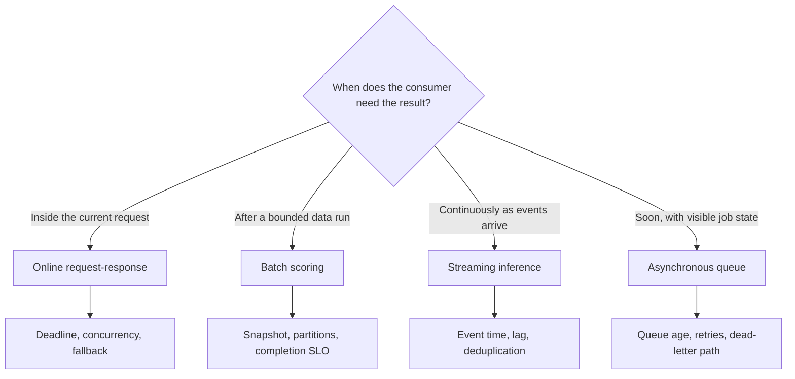

## What a Serving Pattern Decides
<!-- section-summary: A serving pattern is the production shape of prediction: request path, freshness, runtime, cost, and failure behavior. -->

Choosing a serving pattern means deciding **how your product asks a model for predictions in production**. The pattern covers the request path, the freshness of the features, the latency target, the runtime that loads the model, the scaling mechanism, and the fallback your product uses when prediction fails.

Think about a marketplace called StyleLoop. It sells second-hand clothing and runs three models. A **search ranking model** orders products while a shopper types. A **daily demand model** scores which items will likely sell this week. A **listing moderation model** reviews uploaded images and text before the listing goes live. Each model produces a prediction, yet each one needs a different production shape.

The search model needs an answer during a live user request, so it fits online serving. The demand model can score millions of rows overnight, so it fits batch scoring. The moderation model can wait a few seconds after upload, so it fits an asynchronous queue. If StyleLoop forces every model through one endpoint shape, the system either spends too much money, misses freshness needs, or adds latency to product flows that do not need it.

The useful question is practical: **who needs the prediction, how soon do they need it, and what happens if the model cannot answer?** Once you answer that question, the serving pattern starts to show itself.



The four branches express different delivery contracts. They can use the same model family, yet they need different state, retry, scaling, and recovery designs.


*StyleLoop picks the serving pattern from the product promise: live search needs an online endpoint, demand planning fits a batch job, and moderation can move through an asynchronous queue.*

## The Concepts You Will Connect
<!-- section-summary: The decision uses a few repeatable concepts: latency, freshness, throughput, ownership, runtime, scaling, and fallback. -->

Before you choose a pattern, it helps to name the pieces you are balancing. These words show up in every serving design review, so let us connect them to the StyleLoop example before looking at tools.

| Concept | Plain-English meaning | StyleLoop example |
|---|---|---|
| **Latency** | How long the user or downstream system waits for one prediction. | Search ranking needs a response in the request path, usually inside a few hundred milliseconds. |
| **Freshness** | How current the input data and prediction result must be. | Search ranking needs current inventory and user context. Weekly demand can use last night's data. |
| **Throughput** | How many predictions the system handles per second, minute, or batch. | Search has traffic spikes. Demand scoring processes the full catalog on a schedule. |
| **Trigger** | The event that starts prediction. | A web request, a scheduled job, a Kafka event, or an upload queue message. |
| **Runtime** | The service or job that loads the model and runs inference. | FastAPI, BentoML, KServe, Ray Serve, Spark, or a workflow job. |
| **Fallback** | The safe answer when prediction is unavailable or too slow. | Search can use a rules-based ranker. Moderation can send a listing to manual review. |
| **Owner** | The team that operates the serving path. | Platform owns KServe, search owns ranking logic, data engineering owns batch jobs. |

These concepts connect because serving is a product promise, not just a deployment choice. If the promise is "the shopper sees ranked products now," the model has to live close to the request path. If the promise is "merchandising sees a refreshed forecast every morning," a scheduled batch table is a cleaner shape. If the promise is "the seller receives a moderation result soon," a queue gives the product a good waiting room.

## Online Request-Response Serving
<!-- section-summary: Online serving runs a model during a live request, so the design starts with latency, validation, and fallback. -->

**Online serving** means the application sends a request to a model service and waits for the response before finishing the user workflow. A checkout fraud check, search ranker, delivery ETA, support-ticket router, or real-time personalization endpoint often uses this pattern.

For StyleLoop, the search page calls a ranking endpoint after the search service retrieves candidate products. The endpoint receives the shopper context, product candidates, and features such as price, category, seller quality, and inventory status. It returns the same products with scores and reason fields the product team can log.

The design review records the endpoint contract, maximum candidate count, end-to-end deadline, expected peak requests per second, and a fallback based on text relevance and seller quality. It also records `request_id` and `model_version` so product events can be joined to the exact prediction. The later **Batch and Online Inference** article implements both paths; the Serving APIs and Serving Performance submodules own the HTTP code, validation, capacity tests, and autoscaling details.

## Batch Scoring
<!-- section-summary: Batch scoring runs predictions for many records on a schedule or data event, then stores results for later use. -->

**Batch scoring** means the system predicts for many records at once and writes the results somewhere another workflow can read them later. The trigger can be a schedule, a completed data pipeline, a model promotion event, or a backfill request. The user usually waits for the data product, not for each individual prediction.

StyleLoop's demand model is a good batch example. Merchandising wants a table every morning that estimates which listings will sell in the next seven days. The input table has product metadata, price history, search impressions, seasonality features, and seller history. The output table powers dashboards, discount recommendations, and inventory operations. Nobody needs this result inside a live web request.

The batch shape has four reviewable pieces:

| Piece | What it does | Example |
|---|---|---|
| Input snapshot | Freezes the records and features used for scoring. | `warehouse.features.product_demand_snapshot_2026_07_05` |
| Scoring job | Loads the model and scores all records. | Spark, Ray batch job, Kubernetes Job, Airflow task, or warehouse UDF path |
| Output table | Stores predictions with versions and timestamps. | `warehouse.predictions.product_demand_daily` |
| Quality checks | Verifies row counts, nulls, score ranges, and freshness. | dbt tests, SQL checks, or orchestration gates |

The practical value is replay. A failed job can run again from the same input snapshot with the same model version, and the product can keep yesterday's predictions under a written staleness limit. A product that needs today's inventory should read the inventory system directly rather than treating yesterday's batch score as current availability. The next article shows the actual batch job and output checks.

## Streaming and Event-Driven Inference
<!-- section-summary: Streaming inference runs predictions as events arrive, which fits near-real-time workflows that do not sit inside a user request. -->

**Streaming inference** means new events trigger predictions continuously. The model consumes events from a stream or message system, enriches them with features, writes predictions to another stream or store, and lets downstream consumers react. This pattern fits near-real-time systems where seconds matter, while the prediction can happen outside the user's direct request.

StyleLoop can use this for seller risk signals. Every listing upload, seller profile change, payment dispute, and buyer complaint lands as an event. A streaming job scores seller risk as those events arrive and writes the latest risk state to an online store. The listing upload service can then read the latest risk state during moderation instead of recomputing the full seller history in the request.

Streaming design centers on event lag, event time, duplicate handling, retry behavior, and output freshness. Every score needs `feature_time`, `scored_at`, and `model_version` so a caller can reject stale state. The dedicated Streaming Inference article owns event contracts, Kafka offsets, **Kubernetes Event-driven Autoscaling (KEDA)** from consumer lag, replay, and **idempotency**, which means retrying one event leaves one final prediction instead of duplicates.

## Asynchronous Queue-Based Serving
<!-- section-summary: Queue-based serving accepts work quickly, processes predictions in workers, and returns the result through status polling or callbacks. -->

**Asynchronous serving** means the product accepts a request, places prediction work on a queue, and lets workers process it outside the immediate user response. The user or downstream service receives a status page, webhook, callback, notification, or updated database row later.

StyleLoop's listing moderation model fits this pattern. A seller uploads photos and a description. The product does not need to block the upload request while an image model, text model, and policy checks run. The upload service can store the listing as `pending_review`, enqueue a moderation job, and show the seller a clear status.

The queue absorbs spikes while workers scale, and it gives the moderation team time to route selected jobs to manual review. Each job needs an idempotency key, artifact references, model versions, retry limit, and dead-letter policy. The product promise is a visible status and maximum review time, so queue age matters more than HTTP latency.

The four patterns can carry the same model identity while changing the delivery contract. StyleLoop records those contracts explicitly:

```yaml
search_ranker:
  pattern: online
  trigger: POST /v1/rank
  deadline_ms: 180
  failure: return_text_relevance_ranking
demand_forecast:
  pattern: batch
  trigger: snapshot_ready
  completion_slo: "06:00 Europe/London"
  failure: retain_previous_partition_for_24h
seller_risk:
  pattern: streaming
  trigger: kafka://seller-events
  maximum_event_lag_seconds: 30
  failure: mark_risk_state_stale
listing_moderation:
  pattern: asynchronous_queue
  trigger: queue://listing-moderation
  completion_slo_seconds: 120
  retry_limit: 3
  failure: dead_letter_and_manual_review
```

The online path fails inside one request and must return a safe answer before its deadline. The batch path fails a partition and can reuse a previous partition only inside a declared staleness window. The streaming path keeps processing offsets and must expose stale state when lag exceeds its promise. The queue path owns a durable job state and moves exhausted work to a dead-letter queue plus human review.

A pattern test injects one failure into each path. It delays the ranker beyond 180 milliseconds and expects the fallback ranker. It terminates the batch worker after half the partitions and expects an idempotent restart from the same input snapshot. It pauses the stream consumer and expects stale risk state after thirty seconds. It sends a poison moderation job and expects exactly three attempts followed by one dead-letter record. These tests prove the delivery semantics that distinguish the patterns.

## Framework Choices in Production
<!-- section-summary: Frameworks shape packaging, scaling, routing, and operations, so the tool should match the serving pattern. -->

Once the pattern is clear, the serving framework choice gets simpler. The framework should support the request shape, packaging style, scaling behavior, and ownership your team can operate. This overview records the fit; later articles own installation, service code, runtime packaging, autoscaling, and release configuration.


*The framework choice comes after the pattern decision: each tool helps with a different mix of HTTP contracts, Kubernetes rollout controls, packaging, and traffic-aware scaling.*

| Framework or platform | Strong first fit | Ownership question before adoption |
|---|---|---|
| FastAPI | A custom HTTP contract around one model or workflow | Who owns model loading, validation, worker tuning, and Kubernetes resources? |
| KServe | A platform-standard Kubernetes inference endpoint using reviewed runtimes | Does the platform support the required runtime, networking mode, storage access, and rollout controller? |
| BentoML | Python service code packaged closely with preprocessing and model artifacts | Will the team deploy locally, on Kubernetes, or through BentoCloud, and who owns each scaling control? |
| Ray Serve | A Python serving application with composed deployments and separate scaling behavior | Can the team operate Ray clusters, per-deployment capacity, and end-to-end tracing? |
| Scheduled job or data engine | Batch scoring that writes a governed table | Who owns snapshots, retries, partitions, data quality, and backfills? |

The framework never removes the product decision. StyleLoop still needs a latency promise, artifact identity, capacity evidence, fallback, security boundary, and rollback path no matter which implementation it chooses.

## Serving-Pattern Decision Matrix
<!-- section-summary: The matrix turns product requirements into a first serving choice and records the reason behind the choice. -->

A decision matrix keeps the review honest. It prevents the team from choosing the newest platform feature when the product only needs a scheduled table. It also records the tradeoff for future maintainers who wonder why the model landed in a queue instead of a live endpoint.

| Product need | Best first pattern | Good fit | Watch carefully |
|---|---|---|---|
| User waits for an answer during a page, checkout, API call, or workflow | Online request-response | Search ranking, fraud check, ETA, support routing | 95th percentile latency, input validation, timeouts, fallback |
| Many records need predictions on a schedule | Batch scoring | Demand forecasts, churn lists, price recommendations, backfills | Data snapshot, output freshness, row counts, replay path |
| Events change the score continuously | Streaming inference | Risk state, device telemetry, real-time personalization state | Event lag, late events, duplicate events, state store freshness |
| Work can finish after the user receives a status | Asynchronous queue | Listing moderation, document classification, image review | Queue depth, retry policy, idempotency, user status copy |
| Multiple models compose inside one Python service | Ray Serve or similar serving graph | Feature fetcher plus ranker, router plus specialist models | Per-deployment autoscaling, tracing across deployments |
| Kubernetes platform should own common model serving behavior | KServe | Standardized model endpoint, canary rollout, shared runtimes | Runtime support, artifact access, networking, scale-to-zero mode choices |
| Python package should ship service logic with the model | BentoML | Custom inference API, model-specific preprocessing, BentoCloud deployment | Concurrency value, packaging dependencies, load-test evidence |
| Result can be safely reused for repeated inputs | Cache in front of online serving | Stable recommendations, category scores, expensive deterministic predictions | Cache key, TTL, invalidation, privacy, model version |

The first column describes the user or system requirement. The second column gives the serving pattern to try first. The last column names the thing that usually breaks. That last column matters because every serving choice creates an operations checklist.

## Operational Checks Before You Commit
<!-- section-summary: A serving pattern is ready only after the team proves latency, freshness, scale, fallback, observability, and rollout behavior. -->

Before a team commits to a pattern, it should run a small design review with concrete evidence. The review should include the product owner, model owner, service owner, and on-call owner because each person owns a different failure path.

| Check | Evidence to bring | Example acceptance bar |
|---|---|---|
| Latency | Load-test report with 50th, 95th, and 99th percentile latency | Search ranker 95th percentile under 180 ms at peak traffic |
| Freshness | Feature timestamp and prediction timestamp in logs or output table | Online features less than 5 minutes old for live ranking |
| Throughput | Requests per second, batch rows per hour, or queue jobs per minute | Batch demand job scores 5 million products in 45 minutes |
| Fallback | Product behavior when prediction fails, times out, or returns invalid output | Search uses text relevance ranker after 150 ms timeout |
| Observability | Metrics, logs, traces, and model version fields | Every prediction log includes `request_id`, `model_version`, and `feature_time` |
| Rollout | Canary, shadow, or batch comparison plan | KServe canary starts at 10 percent traffic with rollback criteria |
| Cost | Expected replica count, job runtime, or stream worker count | Peak online serving stays under the approved monthly compute budget |

The rollout row should name the actual traffic controller and KServe version. KServe 0.18 documentation shows `canaryTrafficPercent` for predictive `InferenceService` rollouts, while its Standard-mode control-plane documentation recommends Gateway API for traffic splitting. Teams should verify the exact deployment mode, KServe release, gateway, and controller instead of assuming one field provides traffic splitting everywhere. A rollout setting that the selected mode ignores cannot protect users.


*A pattern review is ready when the team can prove latency, freshness, scale, fallback, observability, and rollback before the first real launch.*

## Runbook: The Pattern Is Causing Trouble
<!-- section-summary: A serving-pattern incident runbook starts by naming the failing promise, then isolates latency, freshness, queue, runtime, and rollout issues. -->

Serving incidents often sound vague at first. Someone says "the model is slow," "the predictions are old," or "the queue is backed up." The runbook should turn that into a specific broken promise.

| Symptom | First checks | Likely action |
|---|---|---|
| Online endpoint latency crosses the product budget | Check 95th percentile latency, replica count, CPU or GPU saturation, request payload size, downstream feature-store latency | Enable fallback, reduce max candidates, scale replicas, roll back new model, or move heavy work out of the request |
| Batch predictions are missing or late | Check orchestration status, input row count, model artifact path, output table partition, warehouse or cluster quota | Re-run from last good snapshot, keep yesterday's predictions, page data pipeline owner |
| Streaming predictions are stale | Check event lag, consumer errors, state-store write failures, late-event rate | Pause dependent rollout, increase workers, replay from the last saved checkpoint (durable progress position), expose freshness warning |
| Queue-based moderation waits too long | Check queue depth, worker count, retry storm, poison messages, model service errors | Scale workers, move poison messages to dead-letter queue, route high-risk jobs to manual review |
| Canary performs worse than baseline | Compare latency, error rate, prediction distribution, business guardrail metrics by model version | Set canary traffic back to zero, keep last good revision, open model-quality incident |

The runbook should include ownership. The product owner decides whether fallback is acceptable for users. The platform owner changes replica limits and ingress behavior. The model owner investigates prediction distributions and feature changes. The data owner checks freshness and training-serving skew. Without clear ownership, the team can spend the first thirty minutes deciding who is allowed to act.

## Putting It Together
<!-- section-summary: The right serving pattern follows the product promise, then the tooling and operations plan support that promise. -->

Choosing a serving pattern starts with the product promise. If the user needs the answer inside a request, use an online endpoint and design for latency, validation, fallback, and rollout. If the business needs many predictions on a schedule, use batch scoring and design for snapshots, output checks, and replay. If events should update a score continuously, use streaming inference and design for lag and state freshness. If work can happen after the request, use a queue and design for retries, idempotency, and status.

Frameworks support that decision after the product promise is clear. The next two articles implement batch, online, and streaming mechanics. Later submodules then own model packaging, API security and validation, capacity, caching, hardware, and release evidence without repeating the serving-pattern decision.

## References

- [KServe: Deploy Your First Predictive Inference Service](https://kserve.github.io/website/docs/getting-started/predictive-first-isvc)
- [KServe: ServingRuntime](https://kserve.github.io/website/docs/concepts/resources/servingruntime)
- [KServe: Canary Rollout Strategy](https://kserve.github.io/website/docs/model-serving/predictive-inference/rollout-strategies/canary)
- [KServe: Standard deployment architecture](https://kserve.github.io/website/docs/concepts/architecture/control-plane)
- [BentoML: Create online API Services](https://docs.bentoml.com/en/latest/build-with-bentoml/services.html)
- [BentoML: Concurrency and autoscaling](https://docs.bentoml.com/en/latest/scale-with-bentocloud/scaling/autoscaling.html)
- [Ray Serve: Serve Config Files](https://docs.ray.io/en/latest/serve/production-guide/config.html)
- [Ray Serve: Autoscaling](https://docs.ray.io/en/latest/serve/autoscaling-guide.html)
- [FastAPI: Lifespan Events](https://fastapi.tiangolo.com/advanced/events/)
