## Table of Contents

1. [What A Serving Pattern Decides](#what-a-serving-pattern-decides)
2. [Start With The Decision And Its Deadline](#start-with-the-decision-and-its-deadline)
3. [How Requests Arrive And How Much Work They Contain](#how-requests-arrive-and-how-much-work-they-contain)
4. [The Six Serving Patterns](#the-six-serving-patterns)
5. [Use Freshness And Computation Time To Narrow The Choice](#use-freshness-and-computation-time-to-narrow-the-choice)
6. [How Traffic And Scale Affect Cost](#how-traffic-and-scale-affect-cost)
7. [Decide Where Inference Runs](#decide-where-inference-runs)
8. [Plan Failure And Fallback Behaviour](#plan-failure-and-fallback-behaviour)
9. [Choose The Pattern In A Deliberate Order](#choose-the-pattern-in-a-deliberate-order)
10. [Map The Pattern To A Current Production Stack](#map-the-pattern-to-a-current-production-stack)
11. [Understand The Operating Work For Each Pattern](#understand-the-operating-work-for-each-pattern)
12. [Revisit The Choice As The Product Changes](#revisit-the-choice-as-the-product-changes)
13. [The Main Idea](#the-main-idea)
14. [References](#references)

## What A Serving Pattern Decides
<!-- section-summary: A serving pattern defines how a prediction reaches a product decision, including timing, input arrival, result delivery, failure behavior, and runtime ownership. -->

Training produces a model artifact, but the artifact still needs a path to the person or system that will use its prediction. A **serving pattern** describes that path. It defines how work arrives, how long the consumer can wait, where the result goes, and what the product does after a failure.

Several familiar situations show why one pattern rarely suits every model:

A support team wants a priority score for every open case before the morning shift. The full population is known ahead of time, and supervisors consume a finished list. A scheduled batch run fits that promise.

A payment service needs a fraud score before it authorizes a card transaction. One request is already in progress, and a late score has no value for that transaction. A synchronous online endpoint fits that promise.

A user uploads a long document for classification. Processing may take a minute, so the application accepts the upload, returns a job ID, and displays progress. An asynchronous queue fits that promise.

A stream of sensor events may reveal a fault as it develops. Each new event updates state and can trigger a fresh anomaly score. Streaming inference fits that promise.

A field device may lose its network connection for hours. Local inference keeps image or audio classification available and can reduce the amount of sensitive data sent to a server. Edge or on-device inference fits that promise.

These patterns answer the same broad question—how does a model support a decision?—through different delivery contracts. A synchronous API promises a response inside a live request. A queue promises durable progress and a result later. A batch job promises a complete result set by a cutoff. A stream promises continuously updated state. A device runtime promises local availability within its hardware limits.

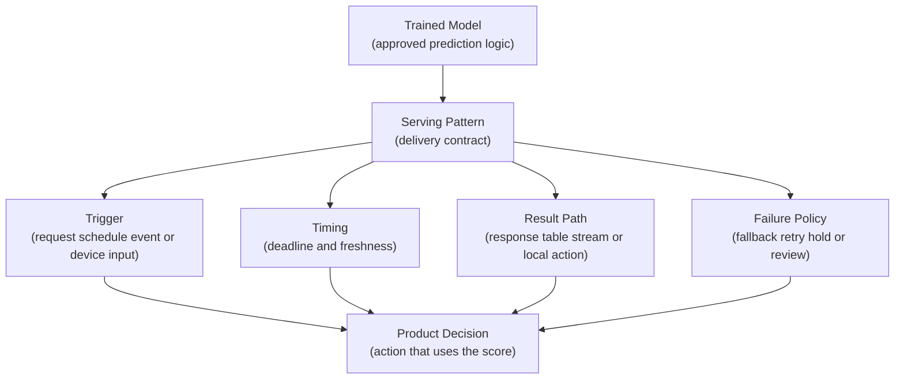
```mermaid
flowchart TD
    A["Trained Model<br/>(approved prediction logic)"] --> B["Serving Pattern<br/>(delivery contract)"]
    B --> C["Trigger<br/>(request schedule event or device input)"]
    B --> D["Timing<br/>(deadline and freshness)"]
    B --> E["Result Path<br/>(response table stream or local action)"]
    B --> F["Failure Policy<br/>(fallback retry hold or review)"]
    C --> G["Product Decision<br/>(action that uses the score)"]
    D --> G
    E --> G
    F --> G

    class A input
    class B,C,D,E,F,G process
```

The contract comes first in a strong design. Tool selection follows after the team understands the decision it must support.

## Start With The Decision And Its Deadline
<!-- section-summary: The actor, action, and latest useful answer determine whether prediction belongs inside a request, behind a queue, in a data run, in an event processor, or on a device. -->

The first design question is about the product: **who uses the prediction, and what action changes because of it?** A numerical score has no deadline by itself. The action determines how soon the score must arrive.

For a morning case-review queue, supervisors need a ranked list before their shift starts. A score produced several hours earlier may be perfectly useful, provided the input data meets the agreed cutoff. Making every score available in 100 milliseconds would add infrastructure without improving the review decision.

For payment authorization, the actor is the transaction service. Its action can approve the transaction, decline it, or send it for review. The fraud model receives only part of the end-to-end request budget. Network calls and account checks need time too. Policy evaluation and response delivery consume the remaining budget. A model endpoint with low average latency can still fail this product if its slowest requests consume the whole budget.

For document classification, the user may accept a result after a minute if the interface clearly shows `queued`, `processing`, `complete`, or `failed`. The deadline describes total completion time. The initial HTTP response only acknowledges the durable job. Holding the upload request open would couple the user connection to a long-running model process.

The **latest useful answer** is the final moment at which the prediction can still influence its intended action. It is more precise than “real time” or “fast.” A live request might allow 80 milliseconds. An investigation alert might allow 20 seconds. A planning table might need publication before a daily cutoff. The serving pattern should match that product clock.

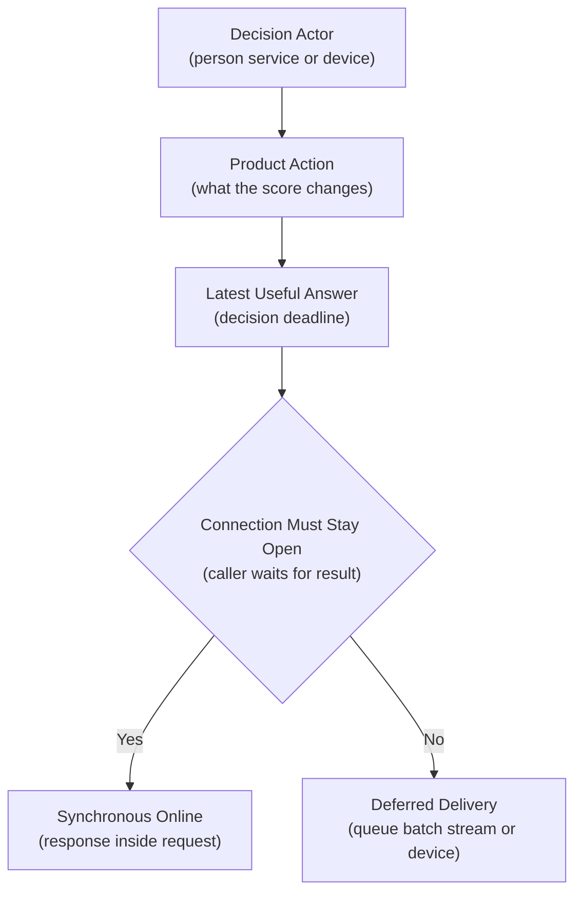
```mermaid
flowchart TD
    A["Decision Actor<br/>(person service or device)"] --> B["Product Action<br/>(what the score changes)"]
    B --> C["Latest Useful Answer<br/>(decision deadline)"]
    C --> D{"Connection Must Stay Open<br/>(caller waits for result)"}
    D -->|Yes| E["Synchronous Online<br/>(response inside request)"]
    D -->|No| F["Deferred Delivery<br/>(queue batch stream or device)"]

    class A,B input
    class C,E,F process
    class D gate
```

## How Requests Arrive And How Much Work They Contain
<!-- section-summary: Known populations, individual requests, durable jobs, continuous events, and local device inputs create different units of work and recovery boundaries. -->

After the deadline, examine how inputs arrive. The arrival shape tells the platform what it must schedule, scale, retry, and observe.

A **known population** already exists as a table, a set of objects, or a bounded collection. Every active account at a cutoff is one example. The system can split that population into partitions, score it in parallel, validate coverage, and publish one result generation. Batch inference follows this shape.

An **individual live request** appears at an unpredictable moment. The request usually carries a small payload or references online features. The serving system needs ready capacity and bounded concurrency because another service is waiting. Synchronous online inference follows this shape.

A **durable job request** also arrives individually, though it can finish after the initial connection closes. A document URI, media file, or large feature payload can enter a queue. Workers claim jobs, record attempts, and publish results through status storage or callbacks. Asynchronous serving follows this shape.

A **continuous event flow** has no natural end. Each event may update keyed state or contribute to a time window. Sensor readings, clicks, payments, and account changes can drive this flow. Streaming inference follows this shape if the model output must update as the events arrive.

A **local device input** starts on a phone, browser, vehicle, camera, or embedded controller. The device runtime owns preprocessing and model execution. Edge inference follows this shape if network, privacy, or response requirements make a server round trip unsuitable.

Arrival shape and volume are separate. Ten million records in one bounded table can still be batch work. Ten events per second can still need a stream if each event must update durable state. A single long document can still need a queue because processing outlives a sensible request connection.

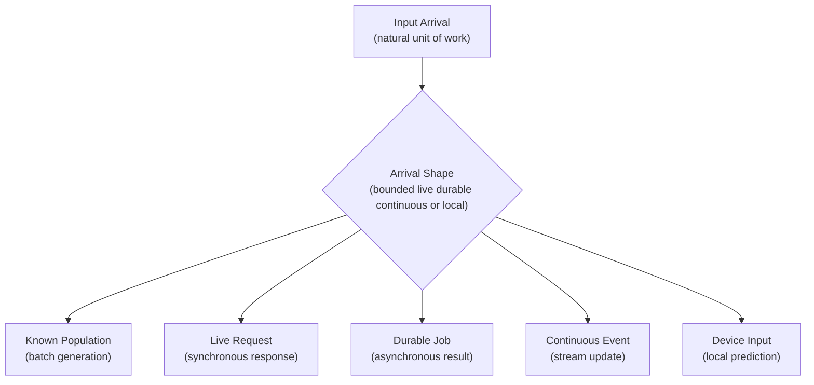
```mermaid
flowchart TD
    A["Input Arrival<br/>(natural unit of work)"] --> B{"Arrival Shape<br/>(bounded live durable continuous or local)"}
    B --> C["Known Population<br/>(batch generation)"]
    B --> D["Live Request<br/>(synchronous response)"]
    B --> E["Durable Job<br/>(asynchronous result)"]
    B --> F["Continuous Event<br/>(stream update)"]
    B --> G["Device Input<br/>(local prediction)"]

    class A input
    class B gate
    class C,D,E,F,G process
```

## The Six Serving Patterns
<!-- section-summary: Six common patterns cover immediate responses, deferred jobs, bounded populations, continuous events, local devices, and products that combine more than one path. -->

Production teams commonly use six delivery shapes. Each shape places waiting and durable state in a different part of the system. It also gives operators a different unit to scale and recover. The definitions below describe those contracts independently of any vendor.

### Synchronous online inference

**Synchronous online inference** returns a prediction inside the same request that asked for it. A product API calls the model path, waits, and continues only after receiving a result or fallback.

A fraud check inside payment authorization is a clear example. The request path needs input validation, a strict timeout, ready capacity, and a reviewed action for model failure. The endpoint's p95 and p99 latency matter because slow-tail requests affect real transactions even if the average remains low.

This pattern fits immediate decisions with small enough payloads and computation to stay inside the product deadline. It creates an always-available service responsibility.

### Asynchronous request and queue inference

**Asynchronous inference** accepts work quickly, records it durably, and completes it through a worker later. The initial response contains a job ID or accepted status. The final result reaches the caller through polling, a webhook, a notification, or a result record.

Long document processing illustrates the difference. The user uploads a file and receives a visible status. A worker can spend a minute extracting text and running several models. A retry can resume from durable input, and a poison job can move to a dead-letter queue for investigation.

This pattern fits large payloads, longer computation, bursty arrivals, and products that can show progress. Queue age and completion time replace request latency as the main timing signals.

### Batch inference

**Batch inference** scores a known population and publishes a complete result set for later use. The trigger may be a schedule, a completed upstream dataset, or an approved model release.

A morning support queue can read all open cases from a governed snapshot, calculate priority scores, validate coverage, and publish the new ranking before the shift starts. A failed partition can be replayed under the same run identity while the interface retains the last complete generation.

This pattern fits bounded data, repeatable snapshots, high total throughput, and decisions that consume results after publication. Completion time, coverage, and output freshness define success.

### Streaming and event-driven inference

**Streaming inference** consumes an ongoing event flow and updates predictions or state continuously. The runtime may evaluate one event at a time or combine events into windows. Event time records the source occurrence. Processing time records the platform's handling of that event.

An anomaly detector can update its score from recent sensor readings. Apache Kafka can carry the durable event log, and Apache Flink can maintain keyed windows or state, execute the scoring logic, and recover from checkpoints. The output can enter another topic, alerting system, or low-latency state store.

This pattern fits decisions that need state updated by each event or short window. Consumer lag, late events, replay behavior, state checkpoints, and idempotent sinks become central responsibilities.

### Edge and on-device inference

**Edge inference** runs the model close to the data source, often on a phone, browser, gateway, camera, vehicle, or embedded device. The prediction can continue through poor connectivity and may keep raw data local.

An inspection tablet can classify equipment images in a remote facility. The device needs a model small enough for its memory and storage, an acceptable battery and thermal cost, and a signed update path. It may upload only the prediction and selected evidence after connectivity returns.

LiteRT and ONNX Runtime Mobile are current cross-platform runtime choices. Platform-native runtimes such as Core ML can offer close integration with device hardware. Edge inference shifts effort toward model compression, hardware testing, version rollout, and fleet observability.

### Intentional hybrid inference

**Hybrid inference** divides one product decision across two or more patterns. The division should reduce total work or satisfy a constraint beyond one path's reach.

A recommendation system can generate user embeddings and candidate items in batch. A synchronous endpoint then applies current context and re-ranks a small candidate set. A mobile application can run a local classifier during disconnection and request a larger cloud model for uncertain cases after connectivity returns.

Hybrid design is valuable because expensive stable work can move out of the live path. It also creates a consistency obligation: model versions, feature meaning, freshness limits, and fallback rules must line up across the paths.

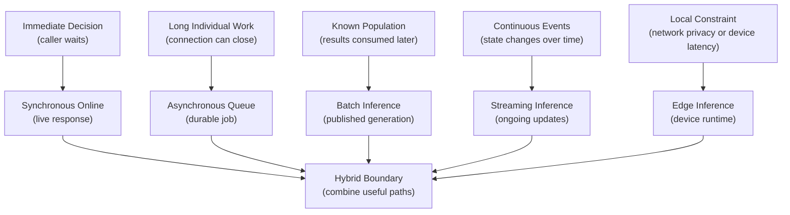
```mermaid
flowchart TD
    A["Immediate Decision<br/>(caller waits)"] --> B["Synchronous Online<br/>(live response)"]
    C["Long Individual Work<br/>(connection can close)"] --> D["Asynchronous Queue<br/>(durable job)"]
    E["Known Population<br/>(results consumed later)"] --> F["Batch Inference<br/>(published generation)"]
    G["Continuous Events<br/>(state changes over time)"] --> H["Streaming Inference<br/>(ongoing updates)"]
    I["Local Constraint<br/>(network privacy or device latency)"] --> J["Edge Inference<br/>(device runtime)"]
    B --> K["Hybrid Boundary<br/>(combine useful paths)"]
    D --> K
    F --> K
    H --> K
    J --> K

    class A,C,E,G,I input
    class B,D,F,H,J,K process
```

*The useful pattern follows the actor, deadline, and arrival shape: a payment caller waits, a document enters a durable job queue, a known population runs as a batch, events update state, a disconnected device runs locally, and hybrid work crosses deliberate boundaries.*

## Use Freshness And Computation Time To Narrow The Choice
<!-- section-summary: Source-data age, prediction age, processing duration, and result deadline remove serving patterns unable to satisfy the product promise. -->

Freshness describes how old the evidence or prediction may be before it loses value. Computation time describes how long the model path needs to produce a result. These two constraints often remove unsuitable patterns quickly.

Suppose a customer-support priority model uses case age, recent messages, and escalation status. A batch score from the start of the shift may remain useful for several hours. A new urgent message can trigger a small event-driven update for that case. The product has accepted a hybrid freshness policy: batch supplies the baseline, and important events refresh selected entities.

Now consider a video model that needs forty seconds to process a large clip. A synchronous endpoint would keep a connection and request worker occupied for too long. A queue allows the product to acknowledge the upload, store the input durably, and expose progress. The model can still run on an endpoint behind the worker; the user-facing delivery contract remains asynchronous.

Three clocks deserve separate limits. **Data freshness** measures the age of input facts. **Prediction freshness** measures the age of a stored score. **Delivery delay** measures the time from trigger to usable result. A 50-millisecond endpoint can return a stale prediction, while a 15-minute batch job can meet a daily planning deadline with current data.

Computation can also be divided. Batch or streaming pipelines can precompute embeddings and aggregates. The online path then executes only the final ranker or policy calculation. This boundary reduces live latency while preserving current request context.

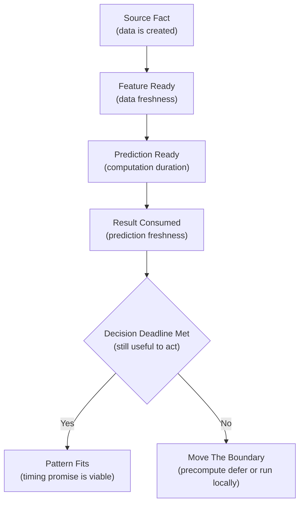
```mermaid
flowchart TD
    A["Source Fact<br/>(data is created)"] --> B["Feature Ready<br/>(data freshness)"]
    B --> C["Prediction Ready<br/>(computation duration)"]
    C --> D["Result Consumed<br/>(prediction freshness)"]
    D --> E{"Decision Deadline Met<br/>(still useful to act)"}
    E -->|Yes| F["Pattern Fits<br/>(timing promise is viable)"]
    E -->|No| G["Move The Boundary<br/>(precompute defer or run locally)"]

    class A input
    class B,C,D,F process
    class E gate
    class G failure
```

## How Traffic And Scale Affect Cost
<!-- section-summary: Traffic variability, work size, accelerator utilization, and idle capacity determine how each serving pattern spends compute. -->

Traffic volume matters, though its shape matters just as much. A system can process the same daily number of predictions through a concentrated batch run or through live requests spread across the day. The infrastructure cost will look different.

Synchronous online endpoints keep enough capacity ready for live traffic. Steady demand can justify provisioned replicas because predictable capacity protects tail latency. Intermittent demand may suit a serverless endpoint if the product accepts cold-start variation. Sudden bursts need autoscaling headroom, bounded queues, or admission control; scaling begins only after demand is observed.

Asynchronous queues absorb bursts and let workers process at a sustainable rate. The queue separates arrival rate from processing rate. This helps a media-processing service survive a sudden upload spike without provisioning every worker for the peak. The trade is visible waiting time, so queue age and completion SLOs must reach the product interface.

Batch jobs concentrate compute into a bounded window. Vectorized scoring and large accelerator batches can improve utilization. The team can release workers after publication. Cost still depends on data scans, partition layout, model loading, shuffle, and output writes.

Streaming systems keep consumers and state available continuously. Their baseline cost can exceed a periodic batch job even at modest traffic. The pattern earns that cost only if continuous updates change the product decision. Kafka partitions and Flink parallelism must match event volume and state size, while checkpoints protect recovery.

Edge inference moves compute cost onto devices and adds fleet engineering. A small quantized model can provide excellent local latency. A model that drains a battery, overheats low-end devices, or exceeds application size budgets is still a failed serving design.

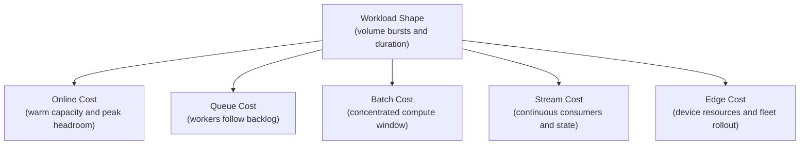
```mermaid
flowchart TD
    A["Workload Shape<br/>(volume bursts and duration)"] --> B["Online Cost<br/>(warm capacity and peak headroom)"]
    A --> C["Queue Cost<br/>(workers follow backlog)"]
    A --> D["Batch Cost<br/>(concentrated compute window)"]
    A --> E["Stream Cost<br/>(continuous consumers and state)"]
    A --> F["Edge Cost<br/>(device resources and fleet rollout)"]

    class A input
    class B,C,D,E,F process
```

## Decide Where Inference Runs
<!-- section-summary: Network availability, data-movement rules, local response needs, and device limits can make edge or hybrid inference the only practical delivery contract. -->

A central endpoint assumes the caller can reach it, send permitted inputs, and wait for a round trip. Some products lack one or more of those conditions.

Connectivity matters across industrial sites and field operations. Moving vehicles and ships can lose reliable links too. A camera that detects a safety hazard may need to act during a network outage. Local inference keeps the essential decision available. The device can synchronize predictions and diagnostics after the connection returns. Approved evidence can follow the same delayed path.

Privacy and data residency can also favor local processing. An audio feature extractor can run on a phone and transmit a compact approved representation. A hospital device may keep raw sensor data inside a controlled boundary. Local inference still leaves governance work. Consent and retention need explicit policies. Access, model updates, and incident response need owners.

Hardware then sets a hard budget. The exported model must fit device storage and memory. Inference must meet its latency target across the oldest supported hardware. Battery use and thermal pressure add separate limits. Quantization or pruning can reduce the model, while a smaller architecture may offer a stronger improvement. Hardware accelerators help only after quality and compatibility tests pass.

ONNX Runtime Mobile runs ONNX models on iOS and Android. Its execution providers include CPU, XNNPACK, NNAPI, and Core ML. LiteRT targets mobile, web, desktop, and embedded platforms with hardware acceleration. The runtime choice follows the model format and device fleet. Product-specific testing remains necessary.

An edge design also needs model delivery. Signed artifacts protect the update source. Staged rollout and local version reporting show which devices received the release. Rollback and minimum-supported application versions give the team control after devices leave the lab. A cloud endpoint can handle uncertain cases or larger models. It can also centralize policy checks, creating a deliberate hybrid.

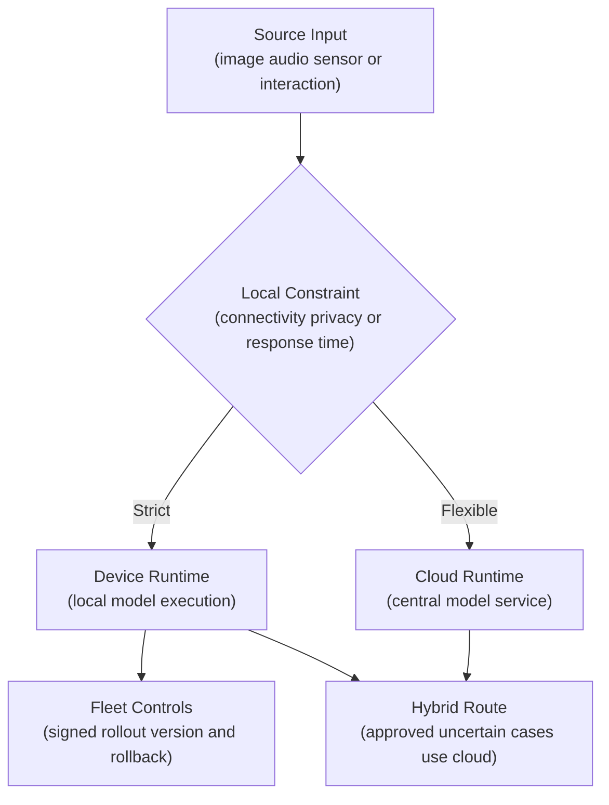
```mermaid
flowchart TD
    A["Source Input<br/>(image audio sensor or interaction)"] --> B{"Local Constraint<br/>(connectivity privacy or response time)"}
    B -->|Strict| C["Device Runtime<br/>(local model execution)"]
    B -->|Flexible| D["Cloud Runtime<br/>(central model service)"]
    C --> E["Fleet Controls<br/>(signed rollout version and rollback)"]
    C --> F["Hybrid Route<br/>(approved uncertain cases use cloud)"]
    D --> F

    class A input
    class B gate
    class C,D,E,F process
```

## Plan Failure And Fallback Behaviour
<!-- section-summary: A pattern is incomplete until the team defines its failure unit, safe fallback, retry boundary, and evidence for recovery. -->

Every serving pattern fails at a different unit. The fallback should protect the product decision first and preserve enough evidence for investigation.

A synchronous online failure affects one live request. A short timeout can route to a cached score, smaller model, conservative rule, or manual-review state. The caller needs a stable response contract and a signal that fallback was used. Unbounded retries amplify overload and consume the remaining deadline.

An asynchronous failure affects a durable job. The worker can retry transient errors under the same idempotency key. Exhausted jobs move to a dead-letter queue, and the product displays a failed or review-required state. Losing the job record would strand the user with no trustworthy status.

A batch failure affects a partition or result generation. Consumers can keep the last complete output while the team repairs and replays failed partitions. Publication advances only after coverage and quality checks pass, unless a reviewed partial-publication policy explicitly allows missing entities.

A streaming failure affects consumer progress and state. Kafka retains replayable events, and Flink checkpoints operator state plus source positions. End-to-end exactly-once behavior also requires transactional or idempotent sinks. After recovery, consumer lag and state freshness show how far the system remains behind.

An edge failure affects a device or fleet segment. The application can fall back to a rule or disable the feature. It may call a cloud path if connectivity exists. Fleet telemetry should expose the model version and rollout cohort. Supported hardware and inference-failure counts help isolate the affected segment. Raw user inputs stay outside general fleet telemetry.

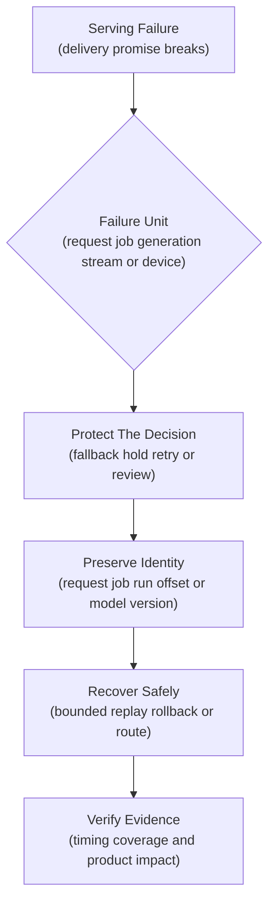
```mermaid
flowchart TD
    A["Serving Failure<br/>(delivery promise breaks)"] --> B{"Failure Unit<br/>(request job generation stream or device)"}
    B --> C["Protect The Decision<br/>(fallback hold retry or review)"]
    C --> D["Preserve Identity<br/>(request job run offset or model version)"]
    D --> E["Recover Safely<br/>(bounded replay rollback or route)"]
    E --> F["Verify Evidence<br/>(timing coverage and product impact)"]

    class A input
    class B gate
    class C,D,E,F process
```

## Choose The Pattern In A Deliberate Order
<!-- section-summary: A reliable selection process moves from product action to deadline, arrival shape, freshness, computation, constraints, failure policy, and only then to a serving runtime. -->

Serving-pattern reviews work best in a fixed order because each answer removes options. The order also keeps the discussion anchored to the product. A team first defines the decision and timing, then narrows the delivery shape, and only later debates frameworks or cloud services.

Start with the actor and action. Identify the person, service, or device that consumes the result. State the action the score changes and the consequence of a missing or late answer.

Set the latest useful answer. A caller waiting inside the current request points toward synchronous online inference. A durable individual task with a later completion promise points toward a queue. A known population with a publication cutoff points toward batch. Continuous events that must update state point toward streaming. Local availability, privacy, or round-trip needs point toward edge inference.

Define acceptable data and prediction age. A reusable score with a long freshness window may move into batch or cache. Request-time facts may keep a small final stage online. Event-driven refresh can update only entities affected by important changes.

Measure computation and payload size. A long model run or large media object often belongs behind durable storage and a queue. Small bounded payloads and predictable execution suit synchronous endpoints. Device models must fit memory, energy, and hardware-operator support.

Describe traffic and scale. The team should estimate steady rate, peaks, concurrency, total population, event partitions, and device fleet size. These measurements shape capacity and cost; they rarely change the underlying delivery contract on their own.

Finish with failure behavior. Name the last good result and the permitted fallback. Define the retry unit, human-review route, and product status. A design with no safe failure path remains incomplete.

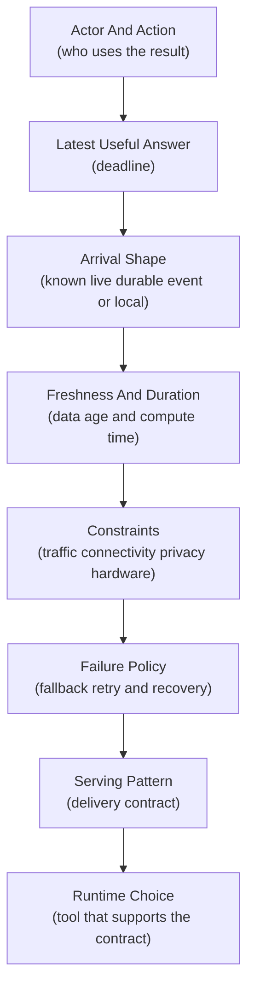
```mermaid
flowchart TD
    A["Actor And Action<br/>(who uses the result)"] --> B["Latest Useful Answer<br/>(deadline)"]
    B --> C["Arrival Shape<br/>(known live durable event or local)"]
    C --> D["Freshness And Duration<br/>(data age and compute time)"]
    D --> E["Constraints<br/>(traffic connectivity privacy hardware)"]
    E --> F["Failure Policy<br/>(fallback retry and recovery)"]
    F --> G["Serving Pattern<br/>(delivery contract)"]
    G --> H["Runtime Choice<br/>(tool that supports the contract)"]

    class A input
    class B,C,D,E,F,G,H process
```

## Map The Pattern To A Current Production Stack
<!-- section-summary: Industrial tools implement parts of a delivery contract, so selection should follow the pattern and the operations a team is prepared to own. -->

A serving platform implements parts of the delivery contract. The product team still defines that contract. The shortlist should stay small and follow the selected pattern. Each category below solves a different operating responsibility, so tools from separate categories are often complementary.

For synchronous online inference, an ordinary FastAPI, Go, or Java service can be enough for a small CPU model inside an existing application. Managed endpoints are the practical default for a dedicated model service: SageMaker AI real-time inference, Gemini Enterprise Agent Platform (formerly Vertex AI) online endpoints, Azure Machine Learning managed online endpoints, and Databricks Model Serving provide managed deployment and scaling primitives.

KServe fits organisations that already operate Kubernetes as an internal platform and want a common `InferenceService` control layer. Its scaling behavior depends on deployment mode and cluster configuration. NVIDIA Triton fits high-throughput CPU or GPU model execution and can add dynamic batching. Triton usually sits behind the product API or gateway that owns authentication, rate limits, and business fallbacks.

For asynchronous requests, a durable queue plus object storage and workers provides a portable architecture. Cloud queues such as Amazon SQS, Google Cloud Pub/Sub, and Azure Service Bus can carry job references. SageMaker AI Asynchronous Inference offers a managed option for large payloads and long processing; it queues requests and can scale endpoint instances to zero.

For batch inference, start close to governed data. Warehouses can apply models directly to tables, while Spark supports distributed preparation and scoring. Databricks Jobs can publish a versioned result from lakehouse data. Airflow and Dagster coordinate data intervals and retries; managed ML pipelines provide the same broad control near their cloud runtimes.

Provider batch services include SageMaker AI Batch Transform and Agent Platform batch inference. Azure Machine Learning batch endpoints expose a durable batch interface. Databricks AI Functions integrate Model Serving with batch queries. Their current Public Preview status requires an explicit production-readiness review.

For streaming inference, Kafka commonly provides the durable event log and consumer groups. Flink commonly provides stateful event-time processing, checkpoints, and recovery. Managed Kafka and Flink services reduce control-plane work while preserving the same responsibilities around schemas, event time, lag, state, and sinks.

For edge inference, LiteRT and ONNX Runtime Mobile are current cross-platform choices. Core ML serves Apple-native applications. The runtime must support the exported model operators and target accelerators across the real device fleet.

This stack map is intentionally responsibility-led. A managed endpoint still needs a product timeout and fallback. Kafka still needs a stateful processor if scores depend on history. Triton still needs a service boundary. A mobile runtime still needs model rollout and rollback.

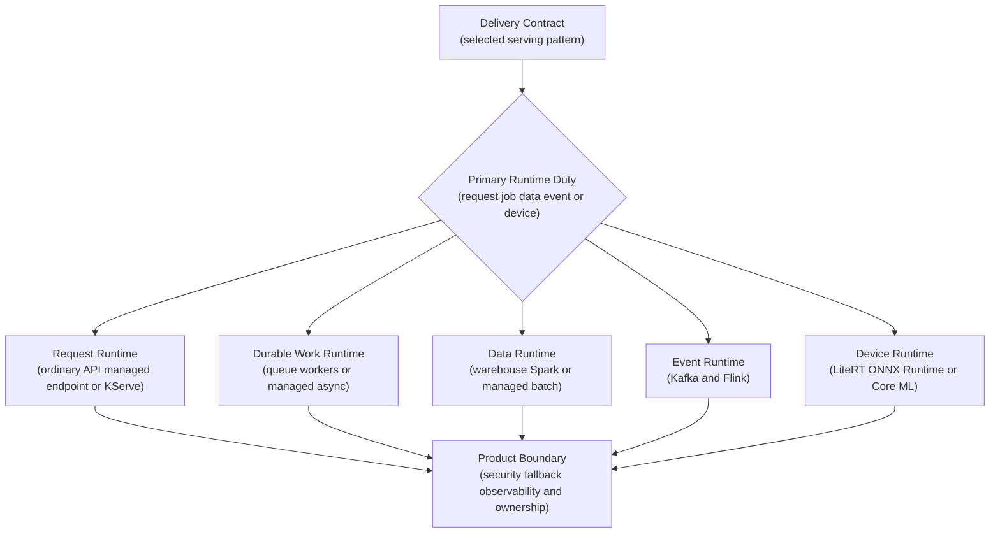
```mermaid
flowchart TD
    A["Delivery Contract<br/>(selected serving pattern)"] --> B{"Primary Runtime Duty<br/>(request job data event or device)"}
    B --> C["Request Runtime<br/>(ordinary API managed endpoint or KServe)"]
    B --> D["Durable Work Runtime<br/>(queue workers or managed async)"]
    B --> E["Data Runtime<br/>(warehouse Spark or managed batch)"]
    B --> F["Event Runtime<br/>(Kafka and Flink)"]
    B --> G["Device Runtime<br/>(LiteRT ONNX Runtime or Core ML)"]
    C --> H["Product Boundary<br/>(security fallback observability and ownership)"]
    D --> H
    E --> H
    F --> H
    G --> H

    class A input
    class B gate
    class C,D,E,F,G,H process
```

## Understand The Operating Work For Each Pattern
<!-- section-summary: Pattern selection changes the primary service objective, scaling signal, recovery unit, and evidence an on-call team needs. -->

The delivery contract tells the operations team what healthy service looks like. It selects the timing promise, the unit of recovery, and the evidence needed during an incident. A shared model registry may connect every model version, though the endpoint, queue, batch job, stream, and device fleet still create different responsibilities.

For synchronous online inference, the core service objective covers request availability and tail latency. Request rate, errors, p95/p99 latency, queue time, saturation, and fallback rate explain live behavior. Capacity tests establish the number of ready replicas needed for expected traffic.

For asynchronous inference, the main objective covers accepted jobs completing within a promised duration. Queue age, backlog, worker throughput, retry count, dead-letter volume, and status-record consistency become the key signals. Recovery replays a durable job under the same identity.

For batch inference, the objective covers a complete result generation reaching consumers before a cutoff. Input freshness, eligible-row count, scored-row count, failed partitions, completion time, and publication state provide the evidence. Recovery operates on an interval or partition.

For streaming inference, the objective covers event lag and state freshness. Consumer offsets, watermark delay, checkpoint health, backpressure, late events, and sink failures show whether scores reflect the intended event window. Recovery restores state and replays from durable positions.

For edge inference, the objective covers success across supported devices and local latency. Resource use and model-rollout health explain fleet behavior. Telemetry needs careful privacy limits. Recovery may roll back a model bundle or disable a feature cohort. Eligible requests can route to the cloud if policy and connectivity permit it.

Hybrid systems inherit every path's responsibilities plus consistency checks across them. A batch candidate generator and online ranker need shared entity identity and model lineage. A device/cloud fallback pair needs compatible output meaning and visible route selection.

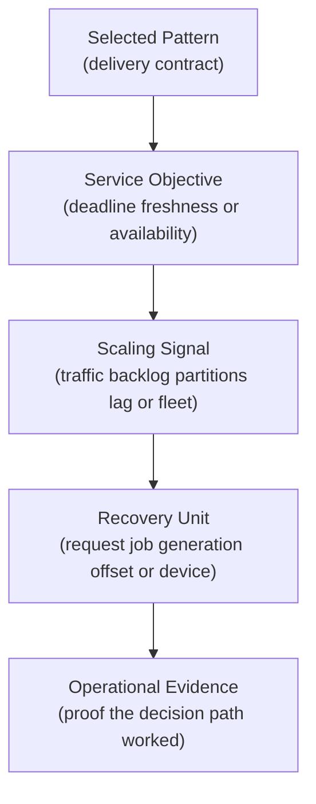
```mermaid
flowchart TD
    A["Selected Pattern<br/>(delivery contract)"] --> B["Service Objective<br/>(deadline freshness or availability)"]
    B --> C["Scaling Signal<br/>(traffic backlog partitions lag or fleet)"]
    C --> D["Recovery Unit<br/>(request job generation offset or device)"]
    D --> E["Operational Evidence<br/>(proof the decision path worked)"]

    class A input
    class B,C,D,E process
```

*Online, queue, batch, streaming, and edge contracts give on-call teams different clocks and recovery units. A hybrid owns all of the duties created by its component paths.*

## Revisit The Choice As The Product Changes
<!-- section-summary: Serving patterns are architecture decisions tied to product constraints, so new deadlines, traffic, features, costs, or device needs can justify a new boundary. -->

A serving pattern is a current answer to current constraints. Product behavior can change the deadline, freshness need, traffic shape, or connectivity assumption that supported the original design. Any such change should trigger a boundary review. Preserving the original pattern as a permanent platform rule can hide a better fit.

A daily priority list may gain an interactive re-score button after agents edit a case. The system can keep the full batch generation and add an asynchronous or online refresh for the changed case. This is often safer than replacing the entire batch path.

A synchronous document model may grow from a few seconds to a minute after a larger model release. Moving the user contract to a durable job can protect gateway connections and make retries visible. The model can remain on the same compute platform behind the worker.

A streaming score may prove valuable only once per hour. A micro-batch or scheduled job can reduce continuous infrastructure cost while meeting the actual action deadline. The team should compare product outcomes, freshness, and recovery work before changing the path.

A device feature may need better quality than the local model can supply for uncertain cases. Confidence-based routing can keep obvious decisions local and send approved hard cases to a cloud endpoint. Connectivity and privacy policy decide which inputs may leave the device.

Migration should preserve prediction meaning. The old and new paths can run side by side, record model and feature identity, compare outputs, and move a small decision segment first. Rollback returns the segment to the earlier delivery path under the same product contract.

## The Main Idea
<!-- section-summary: The right serving pattern follows the product decision, deadline, arrival shape, freshness, computation, constraints, and failure policy before any framework enters the design. -->

Choosing a serving pattern means choosing how prediction work reaches a real decision. Synchronous online inference serves a caller waiting now. Asynchronous inference completes a durable individual job. Batch inference publishes results for a known population. Streaming inference updates state from continuing events. Edge inference runs near the data source. Hybrid inference divides one decision across useful boundaries.

Start with the actor and action, then define the latest useful answer. Arrival shape, acceptable staleness, computation time, traffic, connectivity, privacy, hardware, and fallback remove unsuitable choices. Those requirements narrow the implementation. The remaining choice may be a managed endpoint, queue, warehouse, lakehouse, stream processor, Kubernetes serving layer, model server, or device runtime.

*The delivery contract is a product promise. Runtime and tool selection comes after the team can state who acts, when the answer is useful, how work arrives, and what happens when the path fails.*

## References

- [Amazon SageMaker AI: Inference options](https://docs.aws.amazon.com/sagemaker/latest/dg/deploy-model-options.html)
- [Amazon SageMaker AI: Asynchronous inference](https://docs.aws.amazon.com/sagemaker/latest/dg/async-inference.html)
- [Gemini Enterprise Agent Platform: Prediction guide](https://docs.cloud.google.com/gemini-enterprise-agent-platform/machine-learning/start/predictions-guide)
- [Azure Machine Learning: Online endpoints](https://learn.microsoft.com/en-us/azure/machine-learning/concept-endpoints-online)
- [Azure Machine Learning: Batch endpoints](https://learn.microsoft.com/en-us/azure/machine-learning/concept-endpoints-batch)
- [Databricks: Model Serving](https://docs.databricks.com/aws/en/machine-learning/model-serving)
- [Databricks: Batch inference](https://docs.databricks.com/aws/en/machine-learning/model-inference)
- [KServe: Predictive inference framework overview](https://kserve.github.io/website/docs/model-serving/predictive-inference/frameworks/overview)
- [NVIDIA Triton Inference Server: Dynamic batching](https://docs.nvidia.com/deeplearning/triton-inference-server/user-guide/docs/user_guide/batcher.html)
- [Apache Flink: Streaming analytics](https://nightlies.apache.org/flink/flink-docs-stable/docs/learn-flink/streaming_analytics/)
- [Apache Flink: Checkpointing](https://nightlies.apache.org/flink/flink-docs-stable/docs/dev/datastream/fault-tolerance/checkpointing/)
- [ONNX Runtime Mobile](https://onnxruntime.ai/docs/get-started/with-mobile.html)
- [LiteRT](https://developers.google.com/edge/litert)
