## Table of Contents

1. [Start With The Inference Deadline](#start-with-the-inference-deadline)
2. [How Batch Inference Produces Scheduled Results](#how-batch-inference-produces-scheduled-results)
3. [How Online Inference Responds To A Live Request](#how-online-inference-responds-to-a-live-request)
4. [Know The Difference Between Freshness And Latency](#know-the-difference-between-freshness-and-latency)
5. [How Throughput, Cost, And Failure Affect Architecture](#how-throughput-cost-and-failure-affect-architecture)
6. [Hybrid Designs Use Both Paths Deliberately](#hybrid-designs-use-both-paths-deliberately)
7. [Choose Batch Or Online From The Product Decision](#choose-batch-or-online-from-the-product-decision)
8. [Build Batch Inference With Production Data Systems](#build-batch-inference-with-production-data-systems)
9. [Build Online Inference With A Production Serving Layer](#build-online-inference-with-a-production-serving-layer)
10. [Monitor And Recover Batch And Online Systems](#monitor-and-recover-batch-and-online-systems)
11. [Change The Serving Pattern Without Changing Product Meaning](#change-the-serving-pattern-without-changing-product-meaning)
12. [The Main Idea](#the-main-idea)
13. [References](#references)

## Start With The Inference Deadline
<!-- section-summary: Batch and online inference are two ways to deliver a prediction, separated by the latest moment at which the prediction still helps a real decision. -->

A monthly outreach list can wait for predictions prepared overnight. A payment-risk check must return before the service approves or rejects the transaction. **Batch inference** prepares predictions for a known collection of records and publishes them for later use. **Online inference** calculates a prediction while a live request waits. The **inference deadline** is the latest moment at which that prediction can still influence the decision.

Consider two ordinary situations. A risk operations team reviews a list of accounts every morning. A scoring job can process all eligible accounts overnight and publish the list before the reviewers start work. A prediction that arrives in a few seconds offers no extra value; a complete, reviewed result set before the morning cutoff matters far more. That is a batch problem.

Now consider a card payment authorization. The payment service receives an amount, merchant, device, and account history, then requests a fraud score before approving or declining the transaction. The shopper and merchant are waiting. A score produced ten minutes later has missed the decision. That is an online problem.

These examples describe the delivery shape. The model type can stay unchanged: the same gradient-boosted model could run in either path. Batch and online inference differ through their contracts, capacity plans, failure boundaries, and recovery procedures.

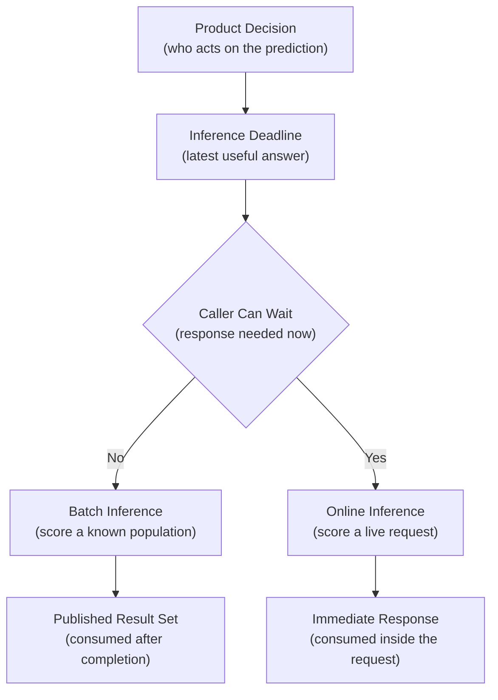

The deadline creates an operating promise. A batch team promises that a complete generation of scores will be ready by a business cutoff. An online team promises that each accepted request will receive a valid response inside a latency target. Those promises deserve separate designs even if both paths load the same registered model version.


*Batch protects a complete publication before a business cutoff. Online protects a caller that is waiting for a valid response inside the request deadline.*

## How Batch Inference Produces Scheduled Results
<!-- section-summary: A reliable batch run fixes its input snapshot, model identity, partitions, and publication boundary so retries produce one complete generation of predictions. -->

Batch inference works on a population the system can identify before scoring starts. That population might be every active subscriber, every product in a catalogue, or every image uploaded during the previous hour. The output usually lands in a warehouse table, lakehouse table, object store, search index, or cache. A later process reads it to rank work, prepare recommendations, or trigger a review.

You can picture a batch run as a small publishing process. It selects an edition of the input data, applies one model version, checks the finished pages, and releases the edition as a whole. Publishing matters because downstream consumers should avoid seeing a half-finished mixture of old and new scores.

### Use A Schedule To Define The Data Interval

A scheduler starts the work, though the wall clock alone leaves the data ambiguous. A run at 02:00 might process events from the previous business day. If the run starts late after an outage, it still needs that same interval. Mature orchestration systems make this distinction explicit: the schedule says *which run is due*, and the data interval says *which records belong to it*.

Airflow expresses this through logical dates and data intervals. Dagster commonly represents the same boundary as an asset partition. Managed ML pipelines expose scheduled parameters or pipeline-run inputs. In each case, the scoring task receives an interval or partition key. Reading that value avoids a fresh guess from the system clock.

For example, an hourly abuse-review job can receive `interval_start=14:00` and `interval_end=15:00`. A delayed run still scores events from that hour. The team can replay the exact interval later, compare counts, and prove which output belongs to it.

### Use A Snapshot To Fix The Population

An input snapshot records the exact rows and feature values supplied to the model. A practical snapshot can be a Delta table version, an Iceberg snapshot ID, a warehouse table created for the run, or a set of immutable object paths. The run manifest then records the snapshot identifier alongside the model version and feature-contract version.

Without a fixed snapshot, a retry can produce different results even though the code and model stayed unchanged. New rows may arrive, corrected values may replace old values, or a join may gain additional matches. The retry then answers a subtly different question. Reproducible batch inference fixes the eligible population first and scores that population second.

### Use Partitions To Divide Work And Failures

Large populations are split into partitions or shards. Spark may divide a Delta table across executors. A managed batch service may distribute files from object storage across instances. A warehouse can execute a set-based prediction query over date or region partitions. Partitioning improves parallelism and gives recovery a practical unit.

Suppose a daily catalogue job scores forty million products across twenty regions. If one region fails after a malformed feature value, the run can keep successful region outputs in a private staging area, repair the failed partition, and score that partition again. Validation runs across the complete staged generation before publication. Consumers continue reading the last successful generation during the repair.

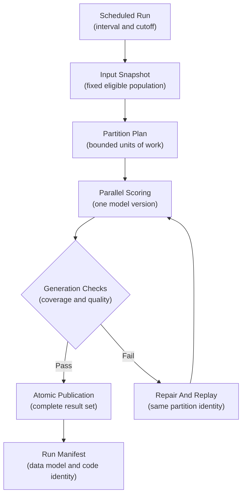

### Make Repeated Batch Runs Safe

**Idempotency** means repeating the same operation produces the same final state. For a batch job, the stable identity often combines the scoring interval, entity key, model version, and policy version. A retry updates or replaces that same logical output. Appending a second copy would violate the contract.

A Delta Lake writer can replace one run-scoped partition atomically after scoring and validation:

```python
run_filter = f"score_date = DATE '{score_date}' AND model_version = '{model_version}'"

(
    scored_rows.write.format("delta")
    .mode("overwrite")
    .option("replaceWhere", run_filter)
    .saveAsTable("ml_serving.account_risk_scores")
)
```

The snippet teaches one specific boundary: a replay replaces the partition owned by that run. Production code also checks the expected row count, unique entity keys, null scores, and score range before the write. A consumer-facing view or manifest should advance only after every required partition passes.

Late data needs an explicit policy. A completeness-first workflow holds publication until a lateness cutoff. A time-critical workflow may publish partial coverage, provided the missing population is visible to every consumer. A safer fallback for many decision systems is to keep the previous complete generation active.

Silent mixing is the dangerous option. The run record states how many entities were expected and received. It also identifies missing partitions and records the decision taken at the cutoff.

## How Online Inference Responds To A Live Request
<!-- section-summary: Online inference turns model execution into one stage of a live service request, so every dependency spends part of a shared latency and reliability budget. -->

Online inference accepts requests whose arrival times and volumes are unknown in advance. A caller sends a feature payload or entity reference, the serving path calculates a score, and the response immediately affects a workflow. Recommendation ranking, transaction risk, search relevance, and interactive assistants commonly use this shape.

The model server is only one part of the path. A production request may pass through authentication, schema validation, feature retrieval, a queue, model execution, calibration, policy rules, and response serialization. Each stage spends part of the same deadline.

For a transaction risk request with a 150-millisecond service budget, the team might reserve 20 milliseconds for network and gateway work, 35 for online feature retrieval, 60 for model execution, 15 for policy evaluation, and 20 for safety margin. Those numbers are capacity assumptions that load tests must verify. If feature retrieval regularly consumes 80 milliseconds, optimizing model inference from 40 to 30 milliseconds will leave the main problem intact.

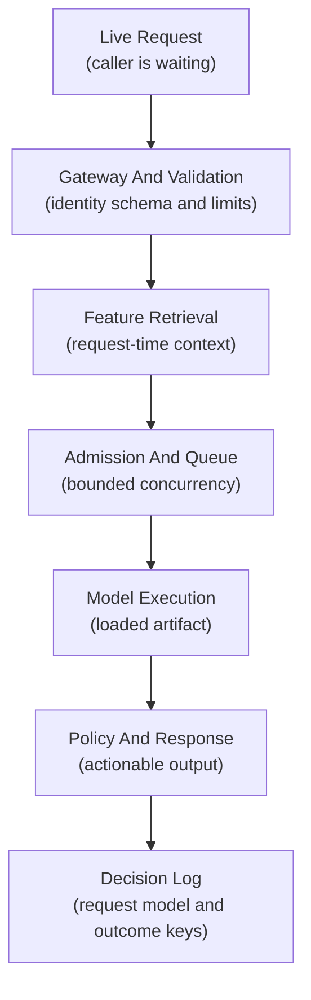

### Keep Warm Capacity For The Request Deadline

Online services need ready capacity before traffic arrives. Autoscaling reacts to observed demand, so it always has some delay. A new replica first starts its container and loads the model. An accelerator-backed replica may also allocate GPU memory or compile kernels. Only a healthy replica can receive traffic. Existing replicas absorb demand during that startup interval, which can make queues grow.

For a steady customer-facing API, a minimum replica count and spare headroom usually protect tail latency. Scale-to-zero can suit development endpoints or asynchronous traffic with generous deadlines. It introduces cold-start delay, and some platforms may reject or time out requests while capacity is being created. The product deadline determines whether that trade is acceptable.

Autoscaling signals should represent the actual bottleneck. CPU can work for a CPU model. An accelerator-backed service may scale from GPU utilization or in-flight requests. Queue depth and concurrency per replica can expose pressure that device utilization misses. Memory places a separate hard limit: a ten-gigabyte model leaves little room on a sixteen-gigabyte GPU even if compute utilization looks low.

### Define Timeouts, Retries, And Fallbacks

A timeout limits how much of the caller's deadline one dependency may consume. The serving client should pass a deadline or use a shorter local timeout, leaving enough time for a fallback. Retries need a remaining-time check and a bounded count. An automatic retry that starts after the product deadline only adds load to an already stressed service.

Pure model scoring can often be repeated safely, though the surrounding business action may have side effects. A payment authorization needs an idempotency key at the decision boundary. Notifications and account changes need the same protection. The prediction service should preserve a request ID so logs, traces, and decision records can be joined. Raw payloads remain outside general operational telemetry.

A fallback is a reviewed alternative result. It might return a cached score younger than a defined staleness limit, route the request to a smaller model, apply a conservative rule, or ask for human review. The response should identify fallback use so product analytics and incident responders can measure its impact.

## Know The Difference Between Freshness And Latency
<!-- section-summary: Data freshness, prediction freshness, and response latency answer separate questions and need separate limits. -->

Teams often describe a serving requirement as “real time” even though several different clocks are involved. Separating those clocks prevents a fast API from hiding stale evidence.

**Data freshness** measures the age of the facts supplied to the model. An endpoint can respond in 30 milliseconds while reading an account balance copied six hours ago. The service latency is excellent; the decision evidence is stale.

**Prediction freshness** measures the age of a previously calculated score. A batch recommendation generated overnight may remain perfectly useful for a homepage visit in the morning. The same score may be unsuitable after a customer changes an order, address, or preference.

**Response latency** measures the time between a live request and its response. This matters directly to online inference. Batch jobs instead track completion time and publication lag against a business cutoff.

Consider an inventory replenishment decision. A store planner may need a new score every morning, using stock counts finalized after the previous day closes. A 20-minute scoring run is healthy if results arrive before planning starts. An online stockout warning inside a shopping session has a different contract: it may require current stock and a response before the page finishes loading. Calling both systems “low latency” loses the information that actually guides the architecture.

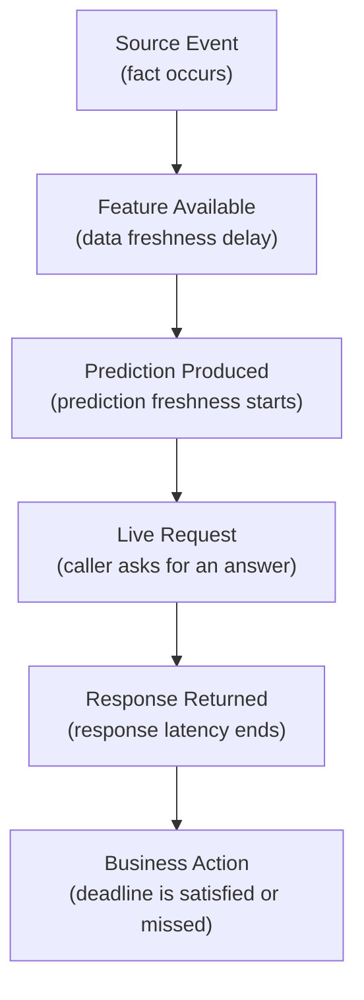

A useful service contract names all relevant limits: source data age, score age, request latency, and the consequence of crossing each limit. The resulting controls are concrete. A stale feature can route to review, an old cached score can be rejected, a slow endpoint can use a fallback, and a late batch generation can keep the previous approved output active.


*Data freshness, prediction freshness, and response latency are separate clocks. Each needs a limit tied to the product decision.*

## How Throughput, Cost, And Failure Affect Architecture
<!-- section-summary: Batch and online systems spend capacity differently and expose different failure scopes, even at the same daily prediction volume. -->

Two serving systems can produce the same number of daily predictions and require very different infrastructure. Batch traffic is concentrated into a known work window. Online traffic follows user behavior, promotions, time zones, and sudden spikes.

### Optimize Batch For Total Completion Work

Batch throughput is usually measured as records per second, partitions per hour, or time to complete the full generation. The system can group rows into large vectorized batches, keep accelerators busy, and release compute after the run. Data scans, shuffle, model loading, and output writes can dominate cost as much as the prediction calculation.

The input layout matters. SageMaker Batch Transform, for example, distributes object-store input across instances. One huge unsplittable file can leave most instances idle, while a useful file or record split exposes parallel work. Spark and warehouse systems have a similar principle: partition sizes need enough work for parallelism without creating a storm of tiny tasks and files.

A batch failure usually affects a bounded interval or partition. The team can quarantine malformed rows, replay failed partitions, and delay publication while consumers keep the last complete generation. This isolation is one of batch inference's strongest operational advantages.

### Optimize Online Inference For Waiting Time Under Concurrency

Online throughput is measured through requests per second and concurrent in-flight work, alongside percentile latency. Average latency can look healthy while a small group of requests waits far too long, so teams examine p50, p95, and p99. Queue depth and saturation explain whether latency is rising because demand exceeds ready capacity.

Online systems pay for availability. Replicas often stay warm between requests, and peak capacity may sit unused during quieter periods. GPU servers can improve utilization by combining compatible requests into a small dynamic batch. NVIDIA Triton exposes this directly:

```protobuf
max_batch_size: 32

dynamic_batching {
  max_queue_delay_microseconds: 200
}
```

This configuration allows a stateless model to gather requests briefly before execution. The 200-microsecond queue delay spends part of the latency budget in exchange for higher accelerator utilization. Teams tune the batch size and queue delay with representative load tests; a value copied from another model has little meaning because tensor shapes, compute time, and traffic patterns differ.

An online failure affects live callers immediately. Bounded queues and admission control stop excess work near the entrance. Per-dependency timeouts, circuit breakers, and fallbacks contain failures deeper in the path. Bulkheads can reserve capacity for important request classes, protecting customer traffic from a large background caller.

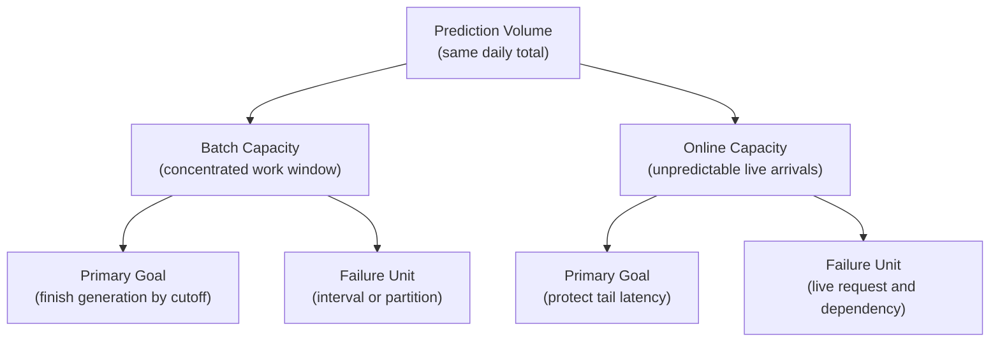

## Hybrid Designs Use Both Paths Deliberately
<!-- section-summary: A hybrid design prepares expensive, stable work in batch and reserves online computation for live context that can change the decision. -->

Many production products need a hybrid design. The design separates parts that can be prepared in advance from parts that depend on live context.

A recommendation system can calculate item embeddings and a few hundred candidates for each user overnight. During a page request, the online service retrieves that candidate set, adds current context such as device, inventory, and the last interaction, then re-ranks twenty items. Batch absorbs the large search across the catalogue. Online work stays small enough for the page deadline.

A lending review system can score the full portfolio weekly for analyst planning and still expose an online path for a new application. Both paths can load the same approved model artifact, though they may use separate feature retrieval and output contracts. Their run records should preserve model, feature, and policy versions so the team can compare results.

A cache can also bridge the paths. A live endpoint may use the latest batch score if it is younger than six hours, then calculate a new score for changed entities or high-value decisions. The staleness limit and fallback action belong in product policy, because a cached prediction carries an age as well as a number.

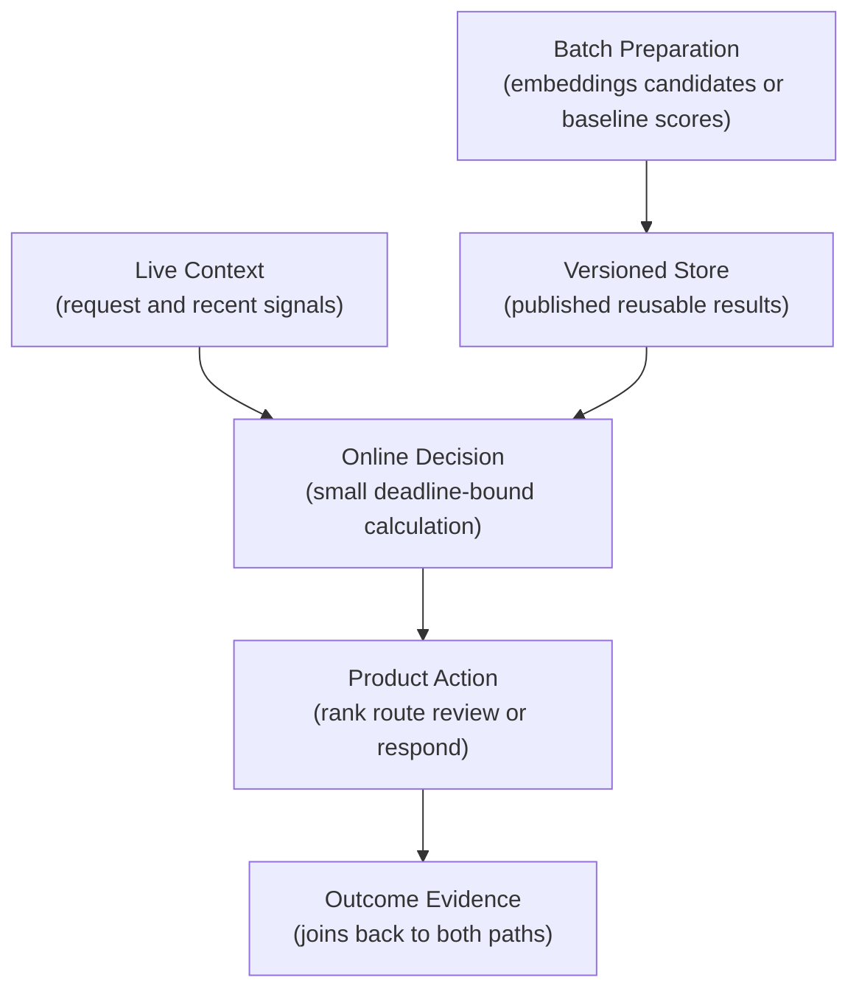

Hybrid systems need a shared definition of the prediction. Feature names and preprocessing must line up first. Output meaning, class order, calibration, and policy thresholds complete that contract. Shared model identity and shared runtime are separate choices. Batch can use Spark and online serving can use a managed endpoint while both refer to the same immutable registered model version.

## Choose Batch Or Online From The Product Decision
<!-- section-summary: The serving boundary follows the actor, action, deadline, acceptable staleness, fallback, and size of the population being scored. -->

A design review should start with the decision and leave platform selection for later. Write down the actor who uses the prediction and the action it changes. Then state the latest time at which the result can still affect that action. “Fast” is too vague; “the ranked work queue must be published before the review shift opens” or “the authorization service has 120 milliseconds for the risk dependency” gives the team a testable promise.

Next, define the eligible population. A known population available as a table or object set points toward batch. Individual events arriving through a live request point toward online. Large known populations can still require rapid completion, and small populations can still require an endpoint. Arrival shape and deadline usually carry greater weight than row count alone.

Then describe acceptable staleness. A product may tolerate a daily base score and require live updates only after a meaningful event. That requirement often reveals a hybrid boundary. It also prevents an endpoint from being built merely to serve a score that changes once per day.

Finally, decide what happens if fresh scoring is unavailable. A planner may continue with the last complete batch generation and see its age. A checkout flow may use a conservative rule or cached score. A high-risk medical or financial decision may pause for human review. The fallback shows the real cost of failure and influences how much availability engineering the serving path deserves.

A complete decision statement could read like this: “At the start of each support shift, supervisors receive one priority score for every open case, calculated from data finalized by the cutoff. The list may use the previous successful generation for up to two hours, and the interface must display its generation time.” That sentence supplies the orchestration and publication requirements. It also defines monitoring and fallback behavior before tools enter the discussion.

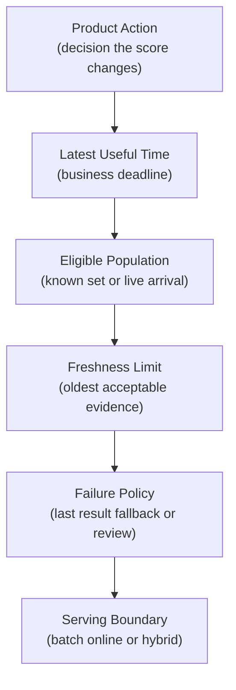

## Build Batch Inference With Production Data Systems
<!-- section-summary: Production batch inference usually runs close to governed data, uses an orchestrator for intervals and retries, and publishes a versioned output through a warehouse, lakehouse, or managed batch service. -->

Industrial batch systems usually follow one of three shapes. The best default keeps prediction work close to the governed data and chooses the least complex runtime that meets scale and model requirements.

### Warehouse and lakehouse scoring

SQL or warehouse-native model functions suit tabular models whose inputs already live in a warehouse. The query engine handles parallel reads and writes, permissions, and scheduled transformations. dbt can own upstream transformations and tests, while the orchestrator runs the scoring operation after required assets are ready.

Spark or Databricks suits large lakehouse tables, distributed feature preparation, and models packaged through MLflow. A stable Databricks approach loads a Unity Catalog model version with `mlflow.pyfunc` and applies it through Spark or pandas UDFs, then writes a Delta result table. Databricks AI Functions can simplify some workloads, though teams should verify preview status and regional support before choosing it as a production baseline.

The data layer should retain a run manifest with the input snapshot, output generation, model URI, code revision, feature-contract version, row counts, and validation result. Delta Lake or Iceberg supplies table snapshots and atomic commits; the manifest explains which snapshots belong to the business decision.

### Managed batch prediction services

Managed services remove part of the infrastructure work. SageMaker AI Batch Transform reads input from Amazon S3, distributes work across instances, and writes an output object for each input object. Gemini Enterprise Agent Platform (formerly Vertex AI) batch inference reads from Cloud Storage or BigQuery and writes to a configured destination in the same region as the model. Azure Machine Learning batch endpoints expose a durable endpoint and deployment for long-running scoring jobs. Databricks supports lakehouse jobs and Model Serving-backed AI Functions for batch inference.

Provider behavior influences capacity planning. Agent Platform batch inference uses `starting_replica_count` to fix the worker count at job startup. Batch jobs ignore `max_replica_count`, so the worker count stays fixed throughout the run. A team therefore sizes the starting replica count from measured partition throughput and the publication cutoff.

These services still require data and publication design. The team defines input eligibility and pins an immutable model identity. It chooses partition sizes and duplicate-handling rules. Output validation then protects the consumer-visible cutoff. The platform starts workers and runs the model inside those boundaries.

### Use A Workflow Tool To Coordinate Batch Scoring

Airflow is common in established data platforms. Its timetable and data-interval model fits scheduled scoring, while task retries and backfills provide recovery controls. Dagster fits asset-oriented systems: partitioned assets express the relationship between prepared features and prediction outputs. SageMaker Pipelines, Agent Platform Pipelines, Azure Machine Learning pipelines, and Databricks Jobs provide managed alternatives close to their respective runtimes.

The orchestrator coordinates the work, and business state stays visible outside opaque task code. The interval and model version identify the run. The input snapshot and publication status explain its data state. A task can succeed technically after scoring only half the eligible population. Orchestration status alone provides too little evidence for a valid result set.

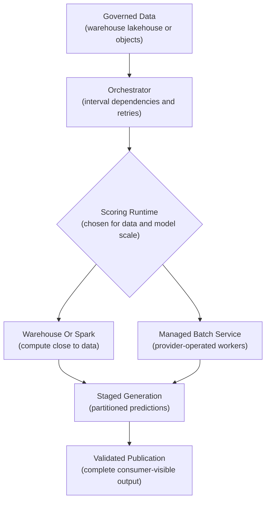

## Build Online Inference With A Production Serving Layer
<!-- section-summary: Production online inference combines a stable request contract, ready capacity, bounded dependencies, model execution, traffic control, and observable fallback behavior. -->

The online serving stack should match the team's operational needs. A small CPU model inside an existing product service can run behind an ordinary HTTP or gRPC API. A dedicated model service often starts with a managed endpoint. The provider supplies deployment primitives and health checks, then adds traffic routing and autoscaling. Current choices include SageMaker AI real-time endpoints and Agent Platform online endpoints. Azure managed online endpoints and Databricks Model Serving offer the same broad operating shape in their ecosystems.

Managed endpoints still need application-level design. The endpoint contract must validate inputs and version output semantics. The caller needs a timeout and fallback. Feature retrieval needs its own latency and freshness targets. Release records need model and container identity. Provider autoscaling settings require load tests against realistic traffic and model startup time.

KServe suits organisations that already operate Kubernetes as an internal platform and need a common inference control layer across model frameworks. Its `InferenceService` resource manages serving runtimes, revisions, traffic, and scaling capabilities. Deployment mode matters: Knative serverless and standard Kubernetes installations have different scaling behavior and operational dependencies. This choice is sensible for a team prepared to own the cluster platform. Other teams can avoid that responsibility through a managed endpoint.

NVIDIA Triton is a model server for high-throughput CPU and GPU inference. It supports several model frameworks, concurrent execution, and dynamic batching. Triton owns efficient model execution. A gateway or product API usually owns authentication, request policy, rate limits, and business-specific fallbacks around it.

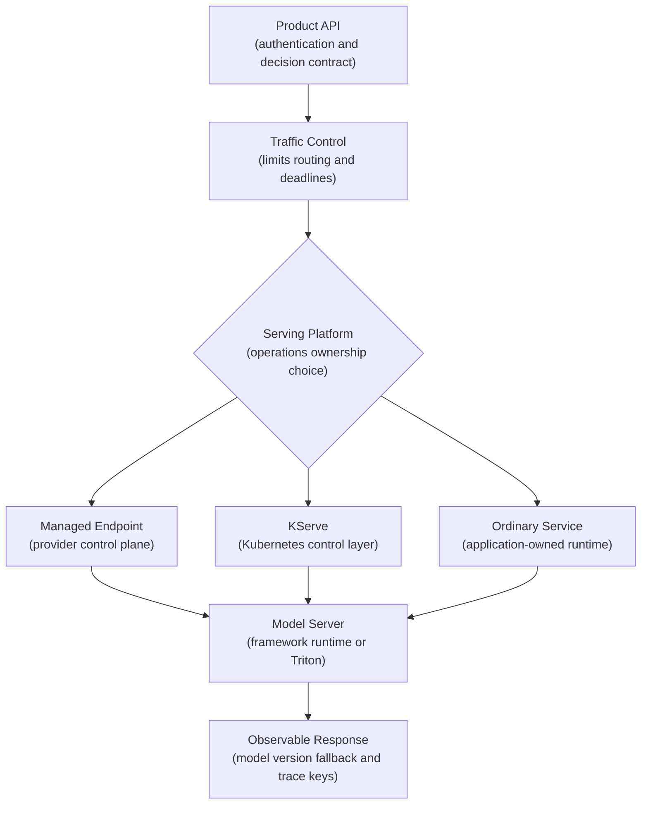

## Monitor And Recover Batch And Online Systems
<!-- section-summary: Batch monitoring proves that a complete generation was published by its cutoff, while online monitoring proves that live requests receive valid responses inside their deadline. -->

Batch monitoring follows the lifecycle of a result set. The team records whether the expected input snapshot arrived, how many entities were eligible, how many received a score, which partitions failed, and how long the generation took. Distribution checks can detect a broken feature or model output, while consumer checks confirm that the published generation was actually read.

Imagine an overnight account-review job that reports success after scoring nine of ten partitions. A green scheduler status would be misleading. The serving SLO should require complete coverage or an explicitly approved partial-publication policy. A reconciliation check compares expected and scored entity keys before the output pointer advances.

Recovery keeps the previous complete generation active, repairs the input or runtime, replays failed partitions with the same run identity, repeats reconciliation, and publishes the repaired generation atomically. The incident record should retain both the failed attempt and successful replay.

Online monitoring follows the request path. Request rate and error rate show traffic pressure and failures. Percentile latency, queue time, and in-flight requests reveal waiting. Replica saturation and model-load time explain capacity. Feature-fetch latency identifies upstream delay, while fallback rate shows how often the primary path lost control.

Prediction distributions and eventual outcomes describe model quality. They complement service telemetry and answer a different question: whether healthy-looking responses still support accurate decisions.

For example, a new model release may return valid HTTP responses while p99 latency rises from 90 to 400 milliseconds. The service is technically reachable, though it has violated the product deadline. Release automation can stop traffic expansion, route requests back to the previous model, and retain traces from the slow route for investigation.

Online recovery first protects callers: stop the rollout, route to a healthy version or reviewed fallback, restore capacity or dependencies, and verify latency plus error signals under real traffic. Root-cause work follows after the service promise is stable.

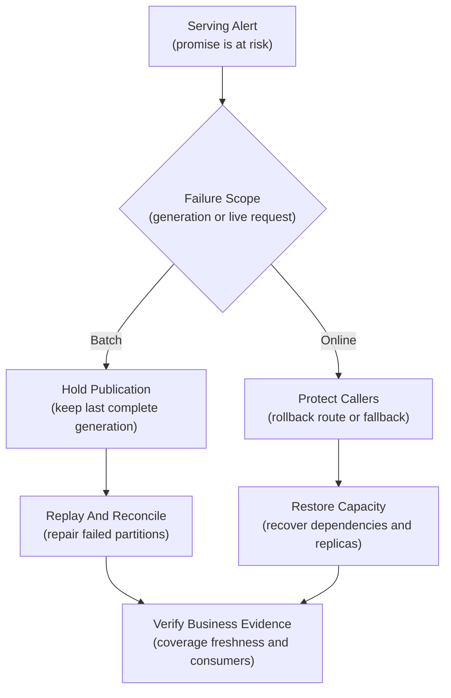

## Change The Serving Pattern Without Changing Product Meaning
<!-- section-summary: A migration should preserve prediction meaning and evidence while the team validates new timing, feature, capacity, and recovery behavior. -->

Moving from batch to online serving makes sense after the product decision gains a tighter deadline or genuinely needs request-time context. The change adds an always-available service, online feature retrieval, capacity planning, timeouts, and live incident response. It should earn that complexity through product value.

The first migration step freezes the existing prediction contract: feature definitions, preprocessing, model artifact, output meaning, policy thresholds, and fallback. The team then builds the online path in shadow mode, separated from live decisions. Each live request can receive the production batch score and a shadow online score. Comparison records measure coverage, numerical parity, feature freshness, and latency.

Differences need classification. A small floating-point difference may be harmless. A large difference can reveal preprocessing drift, missing online features, different categorical mappings, or a newer source value. The release owner defines acceptable tolerances before traffic moves.

After parity and load tests pass, a small request segment can use the online decision. Traffic grows in stages with service, model, and business guardrails. Rollback returns the segment to the batch score or previous endpoint under the same response contract.

The reverse migration can also be valuable. If a live score changes only after a daily data refresh and no user is blocked by immediate computation, publishing scores in batch can remove warm endpoint cost and simplify recovery. The product deadline remains the deciding fact.

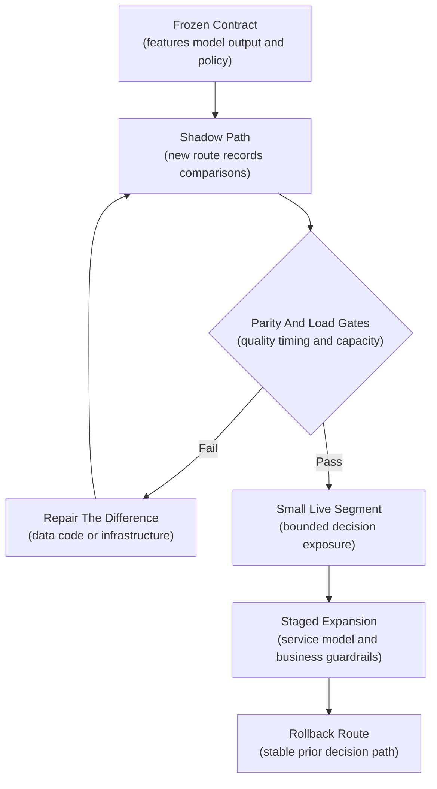

## The Main Idea
<!-- section-summary: Batch prepares a trusted generation before a cutoff; online protects a live request deadline; hybrid systems assign each part of the decision to the fitting path. -->

Batch inference and online inference deliver the same kind of model output under different operating promises. Batch fixes a population and data snapshot, scores partitions, validates the complete generation, and publishes it before a business cutoff. Online inference validates an arriving request, retrieves current evidence, uses ready capacity, and returns a result inside a latency deadline.

A strong design starts with the product action, actor, deadline, acceptable staleness, and fallback. That description leads naturally to a warehouse or lakehouse job, a managed batch service, an ordinary API, a managed endpoint, KServe, Triton, or a deliberate hybrid. Tool choice comes after the decision contract.


*A hybrid design gives stable catalogue work to batch and deadline-bound context to online inference while preserving shared model, feature, score, and fallback meaning.*

## References

- [Amazon SageMaker AI: Use Batch Transform](https://docs.aws.amazon.com/sagemaker/latest/dg/batch-transform.html)
- [Amazon SageMaker AI: Inference options](https://docs.aws.amazon.com/sagemaker/latest/dg/deploy-model-options.html)
- [Gemini Enterprise Agent Platform: Get batch inferences](https://docs.cloud.google.com/gemini-enterprise-agent-platform/machine-learning/predictions/get-batch-predictions)
- [Gemini Enterprise Agent Platform: Get online inferences](https://docs.cloud.google.com/gemini-enterprise-agent-platform/machine-learning/predictions/get-online-predictions)
- [Azure Machine Learning: Batch endpoints](https://learn.microsoft.com/en-us/azure/machine-learning/concept-endpoints-batch)
- [Azure Machine Learning: Online endpoints](https://learn.microsoft.com/en-us/azure/machine-learning/concept-endpoints-online)
- [Databricks: Batch inference](https://docs.databricks.com/aws/en/machine-learning/model-inference)
- [Databricks: Model Serving](https://docs.databricks.com/aws/en/machine-learning/model-serving)
- [Apache Airflow: Timetables](https://airflow.apache.org/docs/apache-airflow/stable/authoring-and-scheduling/timetable.html)
- [Dagster: Partitions and backfills](https://docs.dagster.io/guides/build/partitions-and-backfills/partitioning-assets)
- [KServe: Predictive inference framework overview](https://kserve.github.io/website/docs/model-serving/predictive-inference/frameworks/overview)
- [NVIDIA Triton Inference Server: Dynamic batcher](https://docs.nvidia.com/deeplearning/triton-inference-server/user-guide/docs/user_guide/batcher.html)
