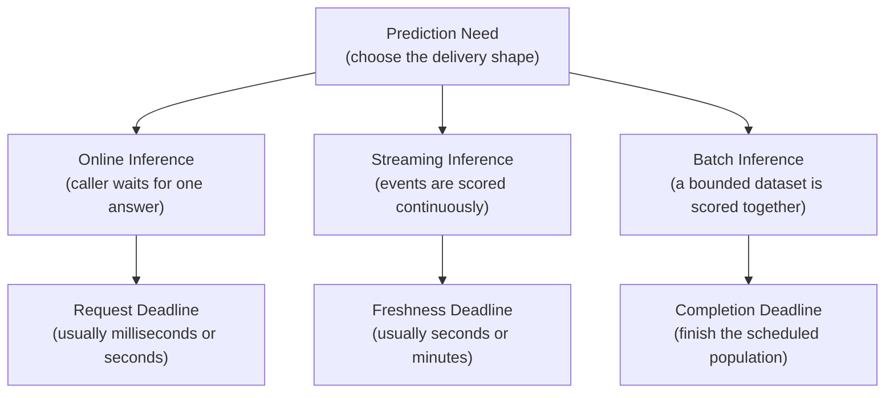
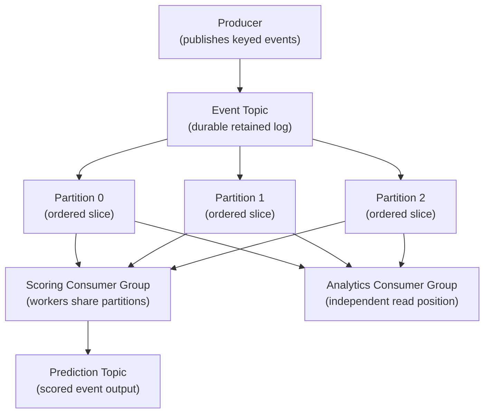
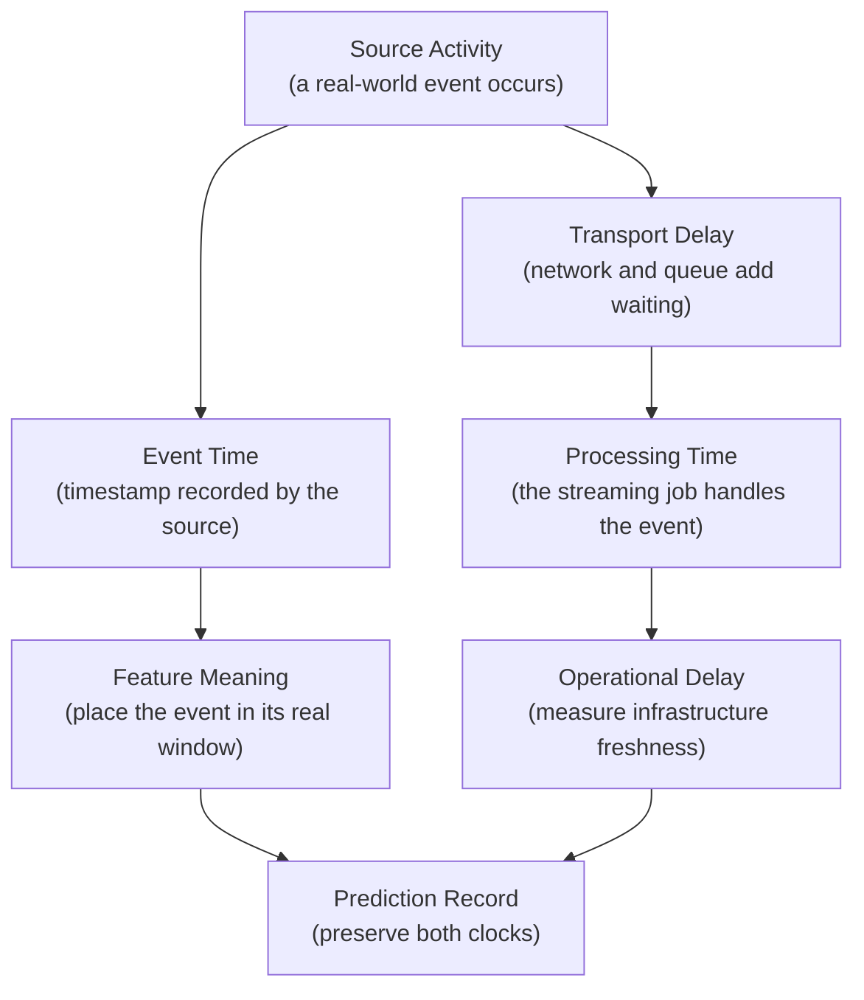
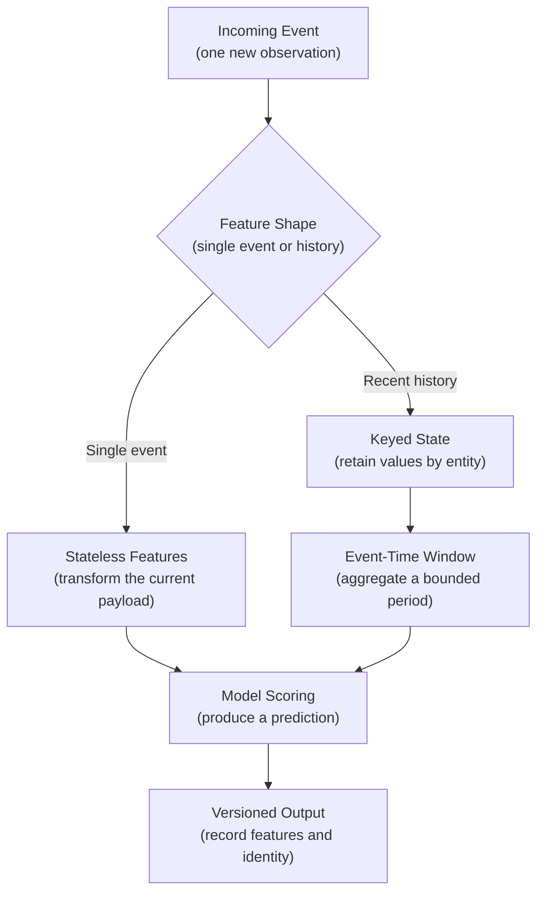
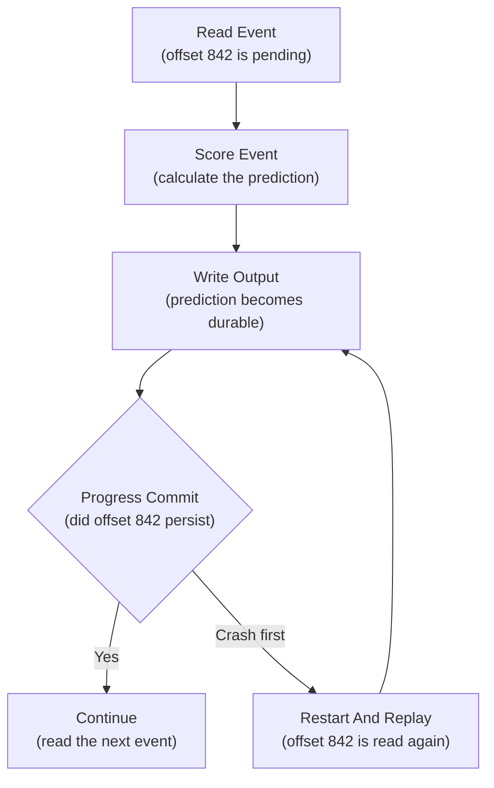
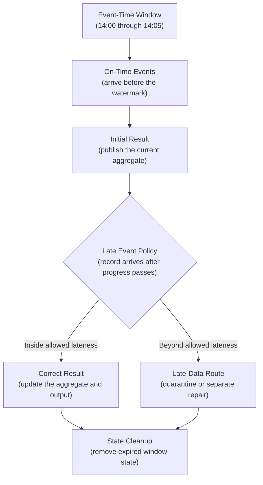
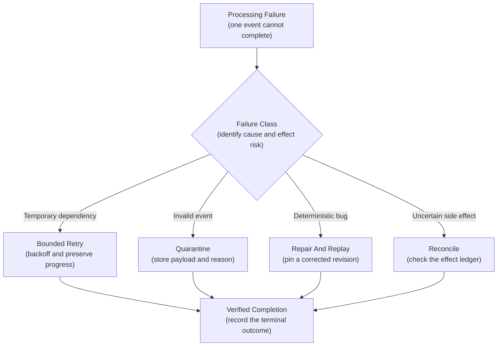
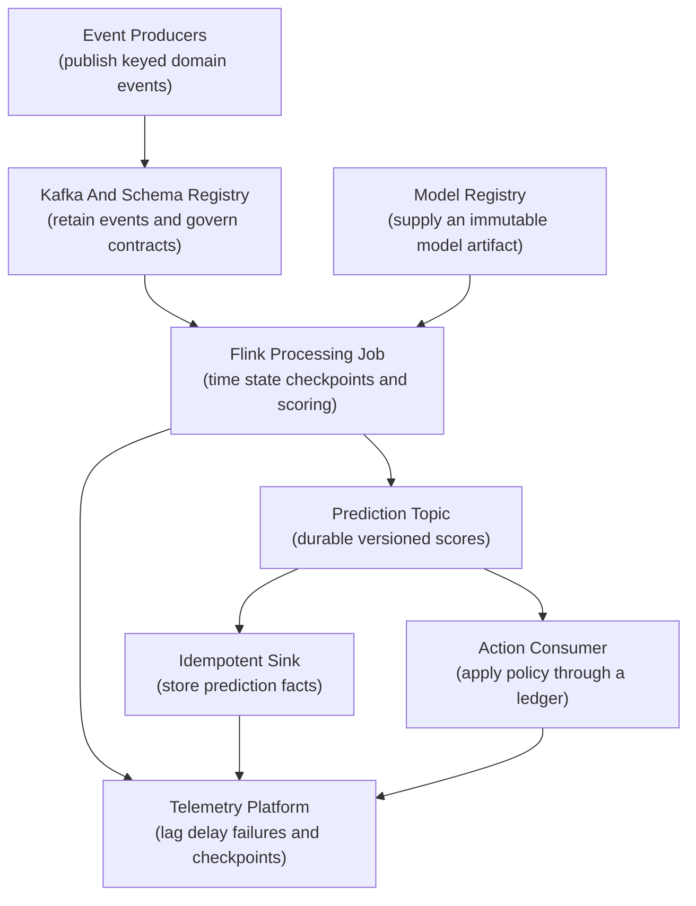
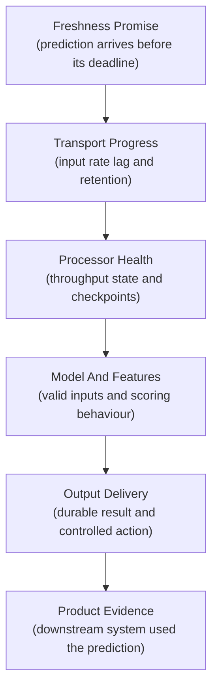

## Table of Contents

1. [What Streaming Inference Means](#what-streaming-inference-means)
2. [How A Stream Stores Events Over Time](#how-a-stream-stores-events-over-time)
3. [Know When An Event Happened And When The System Processed It](#know-when-an-event-happened-and-when-the-system-processed-it)
4. [Use Schemas To Change Events Safely](#use-schemas-to-change-events-safely)
5. [Understand How Stored Feature State Affects Processing](#understand-how-stored-feature-state-affects-processing)
6. [Give Every Streaming Prediction A Stable Identity](#give-every-streaming-prediction-a-stable-identity)
7. [Know Which Delivery Guarantees Each System Provides](#know-which-delivery-guarantees-each-system-provides)
8. [Make Replayed Outputs Safe](#make-replayed-outputs-safe)
9. [Use Lag And Backpressure To Detect Capacity Problems](#use-lag-and-backpressure-to-detect-capacity-problems)
10. [Use Watermarks To Handle Late Events](#use-watermarks-to-handle-late-events)
11. [Use A Separate Recovery Path For Each Failure](#use-a-separate-recovery-path-for-each-failure)
12. [Choose A Streaming Stack That Works Together](#choose-a-streaming-stack-that-works-together)
13. [Monitor Streaming Results And Test Recovery](#monitor-streaming-results-and-test-recovery)
14. [The Main Idea](#the-main-idea)
15. [References](#references)

## What Streaming Inference Means
<!-- section-summary: Streaming inference reads an ongoing event log, scores each useful event or event window, and publishes the result for another system to use. -->

**Streaming inference is the continuous scoring of events that arrive through a message stream.** A payment authorization, parcel scan, machine reading, page view, or account change enters a durable transport. A processing job validates the event, prepares model features, runs inference, and publishes a prediction without requiring a person to wait on the same network request.

The word *streaming* describes the shape of the input and the operating model. The input has no natural end. New records keep arriving, consumers remember their progress, and the system must recover from failures without silently losing work.

Three serving patterns often get confused:

- **Synchronous online inference** answers a caller during the same request. A checkout service asks for a fraud score and waits for the response before approving the purchase.
- **Streaming inference** processes an event asynchronously. A payment event enters a topic, a scorer publishes a risk assessment, and a case-management system opens a review a few seconds later.
- **Scheduled batch inference** scores a bounded collection. A daily job reads every active account and produces tomorrow's retention list.

All three can use the same trained model. Their reliability problems differ because they move work in different ways.



Consider a temperature sensor attached to industrial equipment. The model estimates whether the machine is approaching an unsafe operating state. A web request would couple sensor delivery to a live API call and give the producer no durable backlog during an outage. A nightly job would detect the problem too late. A stream keeps the readings available, allows several consumers to use them independently, and lets the scorer catch up after recovery.

The core design has six connected parts:

1. A durable event transport stores and orders work.
2. A schema contract defines what each event means.
3. A processing engine manages time, state, checkpoints, and parallel work.
4. A versioned scoring package turns valid features into a prediction.
5. A replay-safe output records the prediction and any downstream action.
6. Monitoring proves that predictions arrive before their freshness deadline.

The model call occupies one box inside this system. Most production incidents come from the boundaries around that box: an incompatible event, a delayed partition, a lost checkpoint, an overloaded feature lookup, a duplicate side effect, or a replay that uses the wrong model version.

## How A Stream Stores Events Over Time
<!-- section-summary: Topics, partitions, consumer groups, and offsets let a streaming system store events, divide work, and resume processing. -->

A stream is a set of append-only logs. Producers add records to the end. Consumers read forward and keep a bookmark that records their progress. This structure gives the system durable input, controlled parallelism, and a defined restart position.

An **event** is one record saying that something happened. It usually contains an event ID, the time of the event, a key identifying the subject, and a payload. A card transaction, a new support message, and a motor vibration reading are all events.

A **topic** is a named stream of related events. The name expresses the event family, such as `payment-authorizations` or `machine-readings`. Retention settings keep records for a defined period, so a consumer can recover or replay earlier data.

A **partition** is one ordered slice of a topic. Partitions provide parallelism. Events inside one Kafka partition have a defined order, while events in different partitions can be processed at the same time. A **partition key** chooses the slice. Using `account_id` keeps one account's events together; using a constant key sends everything to one partition and destroys useful parallelism.

A **consumer group** represents one logical application. Several worker instances in the same group divide the partitions between them. A separate group can read the same topic for another purpose. The fraud scorer and the analytics pipeline therefore keep independent progress even though both consume payment events.

An **offset** is the consumer's position inside a partition. Kafka uses offsets; Kinesis exposes sequence numbers; managed processors often store equivalent checkpoints. The purpose is the same: after a restart, the application resumes near its last durable position.



Suppose a consumer group has six worker replicas and a topic has four partitions. Only four workers can own a partition at one time, so two replicas may remain idle. Adding replicas alone cannot increase useful read parallelism beyond the partition layout. The processing engine may still run parallel tasks inside each worker, but ordering and checkpoint design place limits on that approach.

The key also controls the meaning of order. A parcel network may key scans by `parcel_id` because the order of scans matters for each parcel. Global order across millions of parcels provides little value and would force all traffic through one partition. Good partitioning preserves the smallest order that the product actually needs.

## Know When An Event Happened And When The System Processed It
<!-- section-summary: Event time records the real-world occurrence, while processing time records the system's handling of that occurrence. -->

Streaming systems use two clocks because arrival order may differ from real-world order. One clock describes the activity that produced the event. The other describes the infrastructure that received and processed it. Keeping both prevents a delayed network from rewriting the history used by model features.

**Event time** is the time the event happened in the real world. A sensor reading created at 10:02 carries an event-time value close to 10:02. **Processing time** is the time the streaming job handles that record. A network outage might delay the same reading until 10:09.

The difference matters because model logic often depends on the real sequence of events. A fraud model may count failed sign-in attempts during the ten minutes before a payment. If a mobile device uploads several offline events after reconnecting, processing-time order describes the network recovery. Event-time order describes the user's actual activity.



Every production event should carry a timestamp from the source domain, and the platform should add ingestion and scoring timestamps. Those values support distinct questions:

- `event_time`: At what time did the activity occur?
- `ingested_at`: At what time did the transport accept it?
- `scored_at`: At what time did the prediction become durable?

Their differences expose the delay path. `ingested_at - event_time` measures producer or network delay. `scored_at - ingested_at` measures queue and processing delay. `scored_at - event_time` measures the total freshness experienced by the product.

For example, a parcel scan occurs at 14:03 in a depot with poor connectivity. The scanner uploads it at 14:11, and the model scores it at 14:12. The stream processor completed its own work in one minute. The product received a prediction nine minutes after the physical scan. Both facts belong on the operational record.


*Event time places the scan in its real window. Ingestion and scoring timestamps show where the product's total freshness delay accumulated.*

Time semantics become especially important for aggregates. A model may need the number of device errors during the previous five minutes. The processor must decide whether “five minutes” refers to event time or server time, how long to wait for delayed records, and whether a late record should correct an earlier aggregate.

## Use Schemas To Change Events Safely
<!-- section-summary: A versioned schema turns an event payload into a contract that independent producers and consumers can change safely. -->

Every producer and consumer must agree on what a message means. The **schema** defines field names, types, required values, and nested structures. In practical terms, it is the API contract between the producer and every consumer of the topic.

A compact input envelope might look like this:

```json
{
  "event_id": "01JQ7S4D6K1VY9T3N8P2M5R0XC",
  "schema_version": 3,
  "event_time": "2026-07-18T14:03:12Z",
  "entity_key": "account_4812",
  "event_type": "payment_authorized",
  "payload": {
    "amount_minor": 12900,
    "currency": "GBP",
    "merchant_category": "electronics"
  }
}
```

The envelope separates transport concerns from model features. `event_id` supports deduplication and audit. `event_time` supports event-time processing. `entity_key` supports partitioning and keyed state. `schema_version` identifies the contract used to encode the payload.

Formats such as Avro, Protobuf, and JSON Schema can be registered in a schema registry. The registry stores versions and rejects changes that violate the chosen compatibility policy. **Backward compatibility** means a consumer using the new schema can still read records written with an older compatible schema. A common compatible change is adding an optional field with a default. Changing `amount_minor` from an integer to free-form text would usually be a breaking change.

Compatibility checks belong in the producer's CI pipeline. A useful release sequence is:

1. Register or validate the proposed schema against the current subject.
2. Deploy consumers that understand the compatible addition.
3. Deploy the producer that starts writing the new field.
4. Monitor deserialization failures and the volume of each schema version.
5. Remove old handling only after retained records and active producers no longer require it.

Schema validation cannot prove that a value is sensible. `temperature_celsius: 9000` may satisfy a numeric schema and still be impossible for the machine. The consumer therefore performs two checks. Deserialization verifies the structural contract. Domain validation verifies ranges, required relationships, and model assumptions. Structurally unreadable or semantically invalid records go to a governed quarantine path with a reason code.

Treating every invalid record as a retryable failure creates a **poison event**: one permanent error gets read, fails, and retries forever. Quarantining the record lets the healthy partitions continue while the data owner investigates.

## Understand How Stored Feature State Affects Processing
<!-- section-summary: Stateless scoring uses one event at a time, while stateful scoring keeps governed history for rolling features and joins. -->

Some models can score one event using only fields inside that event. This is **stateless processing**. A text classifier may receive the complete message text and return a category. The worker validates the payload, applies the same tokenizer used during training, and runs the model without remembering earlier messages.

Other models depend on recent history. A fraud model may need an account's payment count during the previous ten minutes. A predictive-maintenance model may need the rolling mean and slope of vibration readings. This is **stateful processing**. The engine keeps values between events, usually keyed by an entity such as account or machine.

State introduces three design questions:

1. **What is the key?** All events contributing to one state value need compatible partitioning. An account-level feature usually uses `account_id`.
2. **How long does the state live?** A ten-minute feature does not need indefinite history. State time-to-live and window cleanup keep storage bounded.
3. **How is state recovered?** Engines such as Flink checkpoint operator state to durable storage. Spark Structured Streaming records source progress and state through checkpoints. A restart restores state and resumes from a coordinated point.



A remote feature service can also supply current values, but one network lookup per event adds latency, cost, and another failure mode. High-volume pipelines commonly compute frequently used rolling features inside the stream processor or consume them from a continuously maintained feature topic. Remote lookups remain appropriate for smaller workloads or authoritative values that must be fetched at scoring time. The team should measure lookup latency, timeout behaviour, and freshness rather than assuming either design is universally superior.

Training must reproduce the feature definition. A production feature called `failed_logins_10m` needs the same event-time window and filtering rules in offline training data. Its entity key must match too. Null handling and the late-data policy complete the definition. Sharing declarative transformations or tested feature logic reduces training-serving skew. A feature registry or feature store can manage definitions and lineage, but it cannot repair an ambiguous event-time contract.

## Give Every Streaming Prediction A Stable Identity
<!-- section-summary: A prediction record needs the source event and every versioned input required to explain or reproduce the score. -->

A floating model name such as `fraud-latest` does not explain a historical decision. Deployments change, features evolve, and policy thresholds move independently. A production prediction therefore records immutable identity for the whole scoring path.

The useful minimum usually includes:

- source event ID and source schema version;
- model name and immutable model or artifact version;
- feature definition or feature-set version;
- preprocessing package version;
- decision-policy version if a threshold turns the score into an action;
- scoring timestamp and pipeline deployment revision;
- prediction ID and output schema version.

Suppose a model emits `risk_score=0.71`. Policy version 12 may classify that score as “review,” while policy version 13 raises the review threshold and classifies it as “allow.” Recording only the model version leaves the final action unexplained.

The prediction ID also needs deliberate semantics. One practical pattern derives it from the source event ID and a **scoring revision**:

```text
prediction_id = SHA256(source_event_id + ":" + scoring_revision)
```

The scoring revision represents the exact model, features, preprocessing, and policy bundle. Retrying the same event under the same revision produces the same prediction ID. An intentional reprocessing run using a repaired model receives a new scoring revision and therefore produces a distinct record instead of silently overwriting the original decision.

Reproducibility has a limit: some features depend on external mutable state. If the scorer fetches a current account balance and stores neither the retrieved value nor its version, later replay cannot reconstruct the original input. High-consequence systems record the governed feature vector or a reference to its point-in-time snapshot, subject to privacy and retention rules.

## Know Which Delivery Guarantees Each System Provides
<!-- section-summary: At-most-once, at-least-once, and exactly-once describe how records may be processed across a stated source, engine, and sink boundary. -->

Delivery semantics answer a precise question: after failures and retries, can a record be skipped, repeated, or committed exactly once inside a defined boundary?

**At-most-once** processing may lose work, but it avoids retry-driven duplicates. A consumer records progress before performing the output. A crash between those actions leaves the event marked complete even though the prediction was never written.

**At-least-once** processing avoids silent loss by recording progress after the output succeeds. A crash can happen after the output write and before the progress update. The restarted consumer reads that event again, so the output may be repeated.

This is at-least-once from first principles:



**Exactly-once** processing coordinates progress, state, and output so each source record contributes once to the committed result inside that supported boundary. Kafka transactions can atomically write records and consumer offsets to Kafka. Flink checkpoints coordinate replayable sources, operator state, and sinks that implement the required commit protocol. Spark Structured Streaming combines tracked source offsets, checkpoints, and sinks designed to tolerate reprocessing.

The boundary is the important part. A Kafka-to-Kafka transaction does not automatically include an email provider, an arbitrary HTTP endpoint, or a database that does not participate in the same transaction. A processor can commit its checkpoint and then lose the response from an external notification call. It cannot know whether the provider sent the notification.

Production designs therefore make external effects idempotent, record them through an outbox, or separate them into another consumer with its own durable ledger. “Exactly once” should always name the source, engine, sink, and failure assumptions. Without that scope, the phrase hides risk.

Cloud transports also expose different guarantees. Google Cloud Pub/Sub uses at-least-once delivery by default; its exactly-once option applies to pull subscriptions within a cloud region. Azure Event Hubs documents an at-least-once processing model built around per-partition checkpoints and recommends idempotent downstream systems. These guarantees describe transport delivery. The scoring job still owns its database and side-effect behaviour.

## Make Replayed Outputs Safe
<!-- section-summary: Stable output keys and conditional writes prevent retries from creating duplicate predictions or duplicate side effects. -->

**Idempotency means that repeating the same logical operation leaves the same final result.** It turns duplicate delivery from a product incident into an expected recovery event.

For prediction facts, the sink can use `prediction_id` as a unique key. A repeated attempt under the same scoring revision finds the existing row. A new revision creates a new historical row. PostgreSQL can enforce that contract directly:

```sql
INSERT INTO streaming_predictions (
    prediction_id,
    source_event_id,
    scoring_revision,
    score,
    scored_at
)
VALUES ($1, $2, $3, $4, $5)
ON CONFLICT (prediction_id) DO NOTHING;
```

The unique constraint supplies the guarantee. A process-local cache cannot do the same job because a restart loses the cache and another replica cannot see it.

Side effects need a second layer. A prediction record and an instruction to send an alert can be written together in one database transaction using the **transactional outbox pattern**. A separate dispatcher reads unsent outbox rows, calls the provider with an idempotency key if supported, and marks each row complete. The durable outbox closes the gap between “prediction committed” and “notification scheduled.”

Some effects cannot be undone or deduplicated perfectly. A device command may cause physical movement. A payment may transfer money. Those paths need a domain-level command ID, a receiver that rejects previously completed commands, and a manual reconciliation process for uncertain outcomes.

Idempotency keys also need retention. If the deduplication record expires after seven days while the event log keeps data for thirty days, an old replay can produce duplicates. Retention for source events, checkpoints, outputs, and deduplication ledgers must support the longest approved replay window.


*A unique sink protects the prediction fact. External effects need their own durable outbox, command identity, and receiver-side ledger because they sit outside the stream processor's commit boundary.*

## Use Lag And Backpressure To Detect Capacity Problems
<!-- section-summary: Lag measures unfinished stream work, while backpressure shows that downstream processing cannot accept work at the arrival rate. -->

**Consumer lag is the distance between the newest available record and the consumer group's progress.** Kafka commonly reports this distance in records for each partition. A time-based freshness metric adds the age of the oldest unprocessed event.

Record lag and time lag tell different stories. Ten thousand small events may clear in seconds. Ten thousand expensive image events may require hours. The product promise is usually expressed in time, such as “95 percent of sensor readings receive a score within two minutes,” so the dashboard needs end-to-end event delay as well as offset lag.

**Backpressure** occurs as one stage receives work faster than the next stage can process it. The processor slows source reads or accumulates queues so it does not exhaust memory. Backpressure protects the job, although sustained backpressure causes lag and stale predictions.

A small capacity estimate provides an initial check. If 1,000 events arrive each second and one scoring operation occupies a worker for 20 milliseconds, the workload requires about 20 concurrent scoring slots at full utilisation:

```text
required concurrency = arrival rate × average service time
                     = 1,000 events/second × 0.020 seconds
                     = 20 active scoring slots
```

Operating at 100 percent utilisation leaves no room for bursts, retries, garbage collection, or slow inputs. Dividing by a target utilisation of 0.7 raises the planning estimate to about 29 slots. Load testing must then verify throughput with the real model, event sizes, feature state, serialization, and sink.

Lag can rise for several reasons:

- traffic increased beyond tested capacity;
- one model release increased inference time;
- a downstream sink slowed down;
- checkpoints became large or unstable;
- one partition key became hot;
- a partition stopped making progress;
- repeated retries trapped workers on a poison event.

Scaling replicas helps only if the rest of the architecture permits parallel work. Kafka assigns each partition to at most one consumer in a group at a time. Twelve replicas cannot usefully share four partitions through ordinary group assignment. Adding partitions may increase concurrency, but it changes key distribution and can affect ordering assumptions.

Autoscaling from lag can help Kubernetes consumers handle bursts. The policy should include more than a single record threshold. Oldest-event age describes the product delay, while per-replica throughput estimates how quickly new capacity will drain the backlog. Partition count caps ordinary consumer-group parallelism. Model warm-up time and compute limits determine how quickly a replica starts processing records. Scale-down delay prevents churn, and sink capacity stops the controller from overwhelming the next dependency. Rapid scale-out against a slow database can move the bottleneck and make the incident worse.

## Use Watermarks To Handle Late Events
<!-- section-summary: Windows group events by event time, while watermarks and allowed lateness define how long state remains open for delayed records. -->

An unbounded stream never announces that all events have arrived. A processor computing five-minute features still needs a point at which it can emit a result and release old state.

A **window** groups events across a bounded interval, such as the five minutes from 14:00 to 14:05. A **watermark** is the engine's estimate of progress through event time. A watermark at 14:07 may mean the engine expects almost all events through 14:07 to have arrived. It is a progress estimate, not proof that no older event can appear.

**Allowed lateness** defines how long the job continues accepting events for a window after the watermark passes its end. A **trigger** defines the point at which the engine emits a result. Some pipelines emit an early result, an on-time result near the watermark, and a corrected result after late events.

Consider package scans grouped into five-minute windows. A scan occurs at 14:04, but the depot uploads it at 14:11. With two minutes of allowed lateness, the record is too late for the 14:00–14:05 window. With ten minutes of allowed lateness, the processor can update that window and publish a correction.



The policy balances three costs. A generous lateness allowance improves completeness, holds more state, and delays finality. A short allowance reduces state and produces faster final results, while more delayed events need correction or reprocessing. The right value comes from measured source delay and the product's tolerance for revision.

Idle partitions need special handling. Many engines derive the combined watermark from the slowest input. A partition with no traffic can hold the global watermark back unless the source marks it idle. Flink provides idle-source handling and partition-aware watermark generation for Kafka. Spark Structured Streaming uses watermark thresholds to manage late data and state cleanup. Apache Beam exposes windows, watermarks, triggers, accumulation modes, and allowed lateness as separate parts of its programming model.

## Use A Separate Recovery Path For Each Failure
<!-- section-summary: Transient infrastructure failures, invalid events, deterministic code bugs, and downstream uncertainty require different controls. -->

A single retry loop treats every failure as temporary. That assumption can trap a partition on one bad event, overload a failing dependency, or repeat an external action. Production recovery separates failures according to whether another attempt could succeed and whether the previous attempt may already have created an effect.

The decision starts with evidence from the failed record and the dependency involved. A timeout against a recovering service has a different path from a payload that violates its schema. A model runtime bug needs reproducible input and a repaired revision. An uncertain payment or notification needs reconciliation because an external effect may already exist.



### Transient infrastructure failure

A short network interruption, temporary registry outage, or throttled sink may succeed on a later attempt. The consumer retries with bounded exponential backoff and jitter. It preserves partition progress and alerts after the retry budget is exhausted.

Retries must have limits. An unavailable sink combined with unlimited immediate retries consumes worker capacity and amplifies the outage. Circuit breakers or paused consumption can give the dependency time to recover.

### Invalid or unsupported event

A malformed payload, unknown schema, impossible value, or missing required key will not improve through retry. The processor writes the original record and a structured reason to a quarantine topic or table. It then advances progress according to the approved data-loss policy.

The quarantine record identifies the exact source topic and partition. It also preserves the offset or message ID. Schema identity and consumer revision show which contract and code rejected the event. An error category and rejection timestamp support routing and investigation. Sensitive fields follow the same access and retention controls as the source.

### Deterministic scoring failure

A particular valid input may expose a preprocessing bug or model runtime error. Repeating it on every restart can block one partition. The team reproduces the failure with the recorded event and scoring revision, repairs the code or model package, verifies the fix on the quarantined set, and reprocesses the affected range.

### Uncertain external effect

An HTTP timeout after a notification request leaves an ambiguous outcome. The provider may have accepted the request even though the consumer did not receive the response. An idempotency key, outbox record, and reconciliation query provide a controlled resolution. Blind retry risks a duplicate effect.

Replay follows an approved operating procedure. A safe replay selects a bounded topic or time range and pins one scoring revision. It writes to an isolated destination while external side effects remain disabled or idempotent. Expected source and output counts provide the first completeness check. The team also reviews duplicate conflicts, errors, feature validity, and prediction distribution before promoting the repaired output.

## Choose A Streaming Stack That Works Together
<!-- section-summary: A production stack assigns transport, stream processing, model identity, output durability, and observability to tools with clear boundaries. -->

A common self-managed or cloud-neutral design uses **Kafka** for the durable event log and a **schema registry** for Avro, Protobuf, or JSON Schema contracts. **Flink** reads the events, maintains event-time state, restores from checkpoints, and runs the scoring transformation. A governed model registry supplies one immutable model artifact to each deployment. Predictions return to Kafka before dedicated consumers write queryable decisions or trigger product actions.

Each boundary has one job. Kafka retains source and prediction events long enough for recovery. The schema registry protects producer-consumer compatibility. Flink coordinates progress and state with its checkpoints. The model registry answers which artifact produced a score. The database sink enforces the unique prediction ID, and the action consumer maintains its own effect ledger. Telemetry connects delays and failures across these components.



Flink is a strong fit for low-latency event-time pipelines with large keyed state, complex windows, and coordinated checkpoints. Spark Structured Streaming fits teams already operating a lakehouse and expressing incremental work through DataFrames and SQL; its default micro-batch engine is often suitable for second-to-minute freshness. Apache Beam provides a portable programming model for event time, windows, triggers, and lateness across supported runners.

Managed transports replace Kafka for teams that prefer cloud operations:

- **Amazon Kinesis Data Streams** divides records into shards and uses partition keys and sequence numbers. The Kinesis Client Library coordinates shard processors and stores consumer metadata in DynamoDB.
- **Google Cloud Pub/Sub** presents topics and subscriptions as its primary abstractions. Ordering keys provide order for related messages, and at-least-once delivery remains the default.
- **Azure Event Hubs** provides partitioned streams, consumer groups, and checkpointing. Event processor clients coordinate ownership through a checkpoint store.

These products cover the transport layer. The surrounding pipeline still needs a schema policy and a scoring engine. Immutable model identity explains the output. Replay-safe sinks protect recovery, while monitoring and operating procedures turn failures into controlled actions.

Small workloads may use a simpler consumer service. A stateless classifier processing a few hundred events per minute may need Kafka or a managed topic, a schema-aware consumer, an idempotent database write, and ordinary Kubernetes or serverless compute. Adding Flink solely for a one-event transformation creates operational cost without meaningful state or time benefits.

Choose the stack from the required freshness and event volume first. State size and ordering scope determine the processing model. The replay window and delivery boundary determine retention and sink guarantees. The team's existing platform also matters because streaming incidents frequently involve state recovery, partition skew, checkpoints, and sink coordination. Model code forms only one part of that operating burden.

## Monitor Streaming Results And Test Recovery
<!-- section-summary: Streaming monitoring connects event freshness to transport progress, processor health, model behaviour, and durable outputs. -->

The user-facing promise is usually freshness: the prediction must reach its destination within a defined time after the source event. Monitoring starts from that promise and works backward through the path.

Four groups of signals provide the evidence:



### Monitor Transport Progress

Track input rate, consumed rate, record lag, oldest-unprocessed-event age, partition skew, rebalances, and retention headroom. Retention headroom compares the age of the backlog with the time before old records expire. A consumer falling twelve hours behind on a topic with six-hour retention faces data loss even if capacity is recovering.

### Monitor Processor And State Health

Track per-stage throughput, processing latency, backpressure, checkpoint duration and failure, restart count, state size, watermark delay, and late-event volume. A growing checkpoint duration can signal state growth or storage trouble before the job begins failing.

### Monitor Model And Feature Health

Track inference latency, model-load failures, feature validation failures, missing values, fallback use, score distribution, and prediction volume by immutable model version. These signals identify a model path that is healthy operationally but producing unusual outputs.

### Monitor Output And Product Health

Track durable output count, duplicate-conflict count, sink latency, outbox backlog, quarantine volume, and end-to-end event-to-prediction delay. Product metrics should confirm that the downstream decision or alert actually consumed the prediction.

A useful alert combines symptoms with an action. Rising record lag alone may describe a short burst. Rising oldest-event age, sustained backpressure, and replicas at their safe limit indicate a capacity or dependency incident. A sudden quarantine spike immediately after a producer deployment points toward a schema or domain-contract failure. Stable transport metrics with falling output volume point toward scoring or sink failure.

Recovery should be exercised before an incident. A production readiness test can stop one worker during active traffic, confirm partition reassignment, verify checkpoint restoration, and prove that duplicate deliveries do not create duplicate outputs. A second test can publish an incompatible event, confirm quarantine, and verify that healthy partitions continue. A replay drill can reprocess a bounded window into an isolated destination and compare source count, output count, duplicate conflicts, and prediction distribution.

The final evidence packet should answer five questions:

1. Did every intended source event reach a terminal state: scored, quarantined, or explicitly excluded?
2. Did each prediction use the intended model, feature, schema, and policy versions?
3. Did predictions arrive inside the product freshness objective?
4. Did retries and replay avoid duplicate product effects?
5. Can the team reproduce and reconcile uncertain records from durable evidence?

## The Main Idea
<!-- section-summary: Streaming inference is a recoverable event-processing system whose output happens to include a model prediction. -->

Streaming inference continuously turns domain events into versioned predictions. A durable log retains the work. A stable key supplies ordering and parallelism. An evolvable schema protects the producer-consumer contract, and explicit event time keeps delayed arrival from changing feature meaning. A bounded freshness promise defines the result that operations must protect.

Stateless models can use a simple consumer. Stateful features add windows and keyed state. Checkpoints restore that state after failure, and a late-data policy decides how long old windows remain open. At-least-once delivery is a practical baseline because progress follows durable output. Idempotent sinks and effect ledgers absorb the duplicates that recovery can produce. Exactly-once claims remain limited to the source, engine, and sink that participate in one supported protocol.

Kafka or a managed event service carries the records. Flink, Spark Structured Streaming, Beam, or a focused consumer performs the work. Model and policy versions explain each result. Lag, event delay, checkpoints, quarantine, and replay evidence prove that the system continues to meet its promise.


*Freshness, lag, schema failures, quarantine, checkpoint health, and replay conflicts prove whether the replayable system around the model is still meeting its product promise.*

## References

- [Apache Kafka: Getting Started](https://kafka.apache.org/getting-started/)
- [Apache Kafka: Design](https://kafka.apache.org/design/)
- [Confluent Schema Registry: Schema Evolution and Compatibility](https://docs.confluent.io/platform/current/schema-registry/fundamentals/schema-evolution.html)
- [Apache Flink: Generating Watermarks](https://nightlies.apache.org/flink/flink-docs-stable/docs/dev/datastream/event-time/generating_watermarks/)
- [Apache Flink: Checkpointing](https://nightlies.apache.org/flink/flink-docs-stable/docs/dev/datastream/fault-tolerance/checkpointing/)
- [Apache Flink: Kafka Connector](https://nightlies.apache.org/flink/flink-docs-stable/docs/connectors/table/kafka/)
- [Apache Spark: Structured Streaming Programming Guide](https://spark.apache.org/docs/latest/streaming/index.html)
- [Apache Beam: Programming Guide](https://beam.apache.org/documentation/programming-guide/)
- [Amazon Kinesis Data Streams: Terminology and Concepts](https://docs.aws.amazon.com/streams/latest/dev/key-concepts.html)
- [Google Cloud Pub/Sub: Subscription Overview](https://cloud.google.com/pubsub/docs/subscription-overview)
- [Google Cloud Pub/Sub: Exactly-Once Delivery](https://cloud.google.com/pubsub/docs/exactly-once-delivery)
- [Azure Event Hubs: Features and Terminology](https://learn.microsoft.com/azure/event-hubs/event-hubs-features)
- [Azure Event Hubs: Partition Load Balancing and Checkpointing](https://learn.microsoft.com/azure/event-hubs/event-processor-balance-partition-load)
