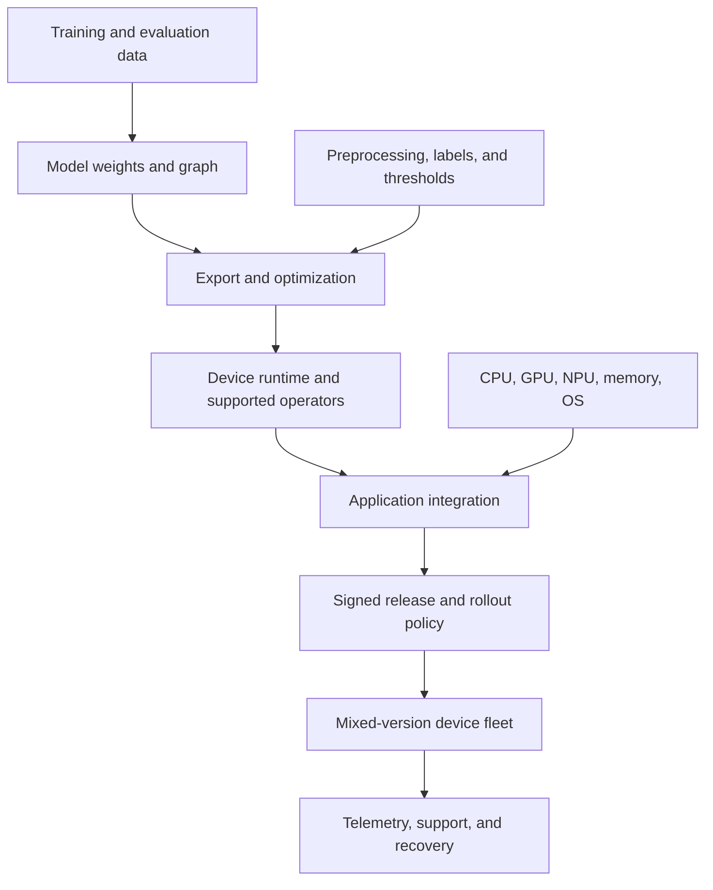
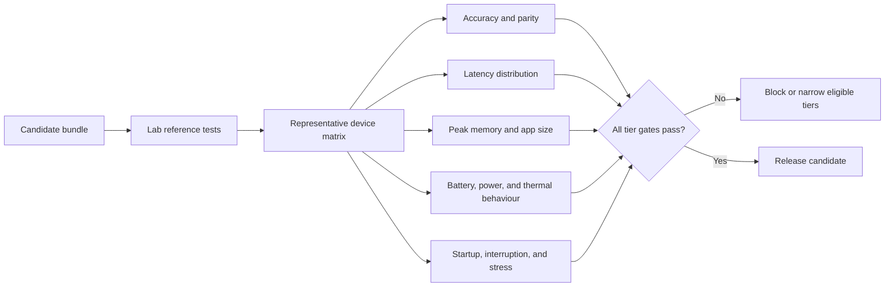
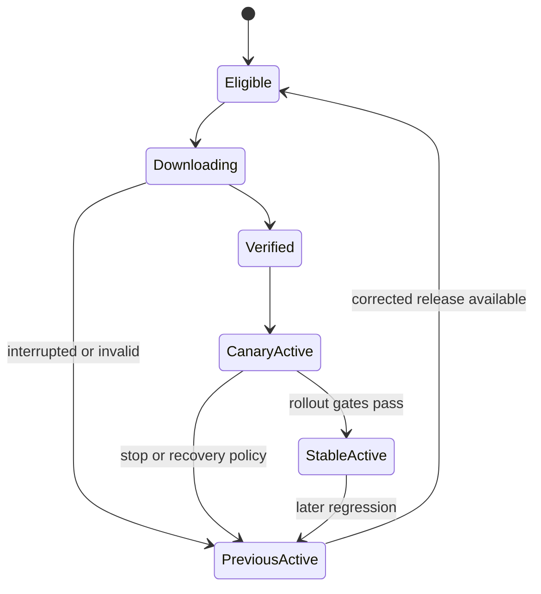

Most serving systems send an input to infrastructure operated by the model team. **Edge inference** moves prediction near the data source, such as a factory gateway or store computer. **On-device inference** is the narrower case where prediction runs inside a phone, vehicle, camera, wearable, or sensor.

The benefits can be decisive: the feature works without a network round trip, private inputs can remain local, radio bandwidth falls, and latency can be more predictable. The cost is a new operating problem. A server fleet can be upgraded centrally; a device fleet contains different processors, operating systems, accelerators, memory limits, power states, and update histories.

## The Release Unit Is Larger Than The Model
<!-- section-summary: On-device behaviour depends on a coupled model, preprocessing contract, runtime, application, hardware path, and release policy. -->

Use ParcelLens, a warehouse phone application that detects visible parcel damage. Workers use it in loading areas with unreliable connectivity, and the company does not want every camera frame uploaded. A local classifier fits the product need, while servers still distribute releases, control cohorts, collect limited telemetry, and accept cases that workers explicitly send for review.

The deployed unit has several coupled parts:



Changing image normalization can alter predictions even if the model file is identical. A newer graph operator may not load in an old runtime. An accelerator can support only part of the graph and make execution slower through device-to-CPU transfers. A threshold tuned on server floating-point outputs may be wrong after quantization.

Treat the model, preprocessing, postprocessing, runtime compatibility, labels, thresholds, and application feature flag as one versioned **system bundle**. Promotion and rollback operate on that bundle, even when the app package and model artifact travel through different distribution channels.

## Choose Edge For A Product Constraint
<!-- section-summary: Edge inference fits when offline operation, privacy, latency, bandwidth, or local autonomy outweigh the cost of device-fleet ownership. -->

Running locally is an architectural choice, not a default optimization. Start with the product constraint.

| Constraint | Why local inference may help | Question that remains |
| --- | --- | --- |
| Offline use | prediction does not require a live connection | how long can data and models remain stale? |
| Tight response time | removes network round trip | can representative devices meet the full pipeline deadline? |
| Sensitive input | raw text, audio, or images can remain local | what telemetry or review data may still leave the device? |
| Limited bandwidth | sends small results instead of large inputs | how are model updates delivered economically? |
| Local safety or autonomy | device can act during a network failure | what decisions are safe without central confirmation? |
| Server cost or scale | distributes inference compute to devices | can battery, thermal, and application-size budgets absorb it? |

Many products use a **hybrid** design. ParcelLens performs a quick local classification, shows an immediate result, and lets a worker submit uncertain cases to a server-assisted review path. The local and server models may differ. Their product semantics must still agree about classes, thresholds, and what the UI promises.

Do not claim that on-device automatically means private. Inputs may stay local while predictions, embeddings, crash dumps, or diagnostics leave the device. Privacy depends on the complete data flow and retention policy.

## Export Creates A Runtime Contract
<!-- section-summary: Export translates a training model into a target graph whose operators, shapes, data types, preprocessing, and outputs the device runtime must understand. -->

Training frameworks optimize for experimentation and gradient computation. Device runtimes optimize for small binaries, fast inference, and hardware acceleration. **Export** translates the learned model into a deployable graph such as ONNX, LiteRT's `.tflite` format, Core ML, or an ExecuTorch program.

Translation can fail in subtle ways. An operation may be unsupported, lowered differently, or split between execution backends. Dynamic input shapes may block an accelerator. A custom layer can require extra runtime code. The exported model can load and still produce numerically different results.

Validate three levels:

1. **Structural compatibility:** the target runtime can load every required operator, data type, and shape.
2. **Numerical equivalence:** exported outputs stay within defined tolerances on a representative corpus.
3. **Task equivalence:** the complete device pipeline preserves product metrics and critical slices.

The third is decisive. A small change in logits may cross a threshold and alter the user-visible class. Compare preprocessing, raw outputs, postprocessing, and final decisions between the training reference and each target runtime.

Runtime choice follows platforms and ownership. LiteRT currently supports model conversion, post-training optimization, and deployment across Android, Apple, web, desktop, and embedded targets. Core ML is native to Apple platforms. ONNX Runtime Mobile provides Android and iOS packages with CPU and platform acceleration paths. ExecuTorch targets PyTorch deployment across edge runtimes. These products evolve quickly; pin the runtime and toolchain version and verify the current support matrix for the chosen hardware.

## Qualification Happens On A Device Matrix
<!-- section-summary: A device matrix turns hardware diversity into explicit cohorts with capability, accuracy, latency, memory, power, and thermal gates. -->

A benchmark on one developer phone is not fleet evidence. Build a **device matrix** from the real population. Group devices only when the grouping predicts behaviour: operating-system range, architecture, RAM class, accelerator and driver, runtime version, and important application constraints.



Measure cold model load, warm inference, end-to-end feature latency, peak memory, package and model size, energy, thermal throttling, and crash or load failures. Run sustained workloads, not only one prediction. A model that meets 20 ms when the device is cool can miss the deadline after two minutes of camera use.

Accelerator performance is device- and graph-specific. ONNX Runtime's current mobile guidance recommends measuring binary size, model size, latency, and power, and notes that a partially supported graph may be partitioned across providers and perform poorly. Fallback to CPU should be an observed, versioned outcome—not an invisible surprise.

Qualification produces an eligibility rule. A low-memory tier may receive a smaller model. An old operating-system cohort may remain on a previous bundle. The release manifest should express that decision so clients do not guess from marketing device names.

## Optimization Trades Resources Against Behaviour
<!-- section-summary: Quantization, pruning, distillation, operator fusion, and runtime reduction can improve size or speed, but each creates a new candidate that needs parity and device gates. -->

**Quantization** represents weights and sometimes activations with lower precision. Moving from 32-bit floating-point weights to 8-bit integers can substantially reduce model size and memory bandwidth. Actual latency gains depend on hardware and operator support.

Post-training quantization uses a trained model and, for some methods, a representative calibration set. Quantization-aware training exposes the model to quantization effects during training. Other options include pruning, smaller architectures, distillation, operator fusion, and a custom runtime containing only the operators the application needs.

Optimization can change accuracy unevenly. A global metric may stay stable while small objects, low-light images, one language, or one sensor class degrades. Use the same critical slices as the original model evaluation and add device-specific numerical checks.

Think in a budget envelope rather than one benchmark:

| Budget | Example gate |
| --- | --- |
| Quality | damage recall and false-positive rate by condition |
| Latency | p50 and p95 end-to-end time per device tier |
| Memory | peak resident memory during load and inference |
| Storage | app and downloadable artifact size |
| Energy | sustained battery or power use |
| Thermal | performance after a realistic continuous session |
| Reliability | model-load and inference failure rate |

An optimization is ready only when it improves the target resource and keeps every product guardrail within tolerance.

## Distribution Is A Supply-Chain Decision
<!-- section-summary: App-bundled and separately downloaded models need authenticated releases, integrity checks, compatibility rules, and protection against replay or partial installation. -->

The simplest model ships inside the signed application. App stores then supply signing, review, and staged release mechanisms, but the model update follows the app's release cadence and increases package size.

A separately downloaded model can update faster and target cohorts independently. It also creates a software-update system. The device must authenticate metadata, verify artifact length and cryptographic digest, enforce compatibility, and install atomically. Sensitive or licensed models may need access control and encryption, although encryption cannot guarantee secrecy on a device the user controls.

A release manifest makes the contract inspectable:

```yaml
release_id: parcel-damage-2026-07-r7
sequence: 107
artifact:
  sha256: 8f6a...
  bytes: 18422304
runtime:
  family: onnxruntime-mobile
  minimum_version: 1.22.0
interface:
  input: rgb-uint8-224x224-v3
  output: parcel-damage-classes-v2
eligibility:
  os: android
  min_api: 29
  memory_tier: [mid, high]
rollout:
  cohort_seed: parcel-lens-device-id
fallback_release: parcel-damage-2026-06-r6
```

Sign the manifest through a trusted update system and rotate keys under a documented process. A digest proves which bytes arrived; a signature proves that trusted release authority approved the metadata. A monotonically increasing sequence or equivalent freshness rule prevents an attacker from replaying old signed metadata to force a downgrade.

Installation should write to an inactive slot, verify the artifact, load and smoke-test it, then switch one small pointer atomically. Keep the previous verified slot. If power or storage fails halfway, the active model remains usable.

## A Fleet Always Contains Version Skew
<!-- section-summary: Edge rollouts use stable cohorts and compatibility windows because devices update gradually, remain offline, or never qualify for the newest bundle. -->

Server canaries can shift traffic in seconds. Device rollouts may take days or weeks. Some devices charge only overnight, some lack storage, some are offline, and some users disable updates. **Version skew**—several app, runtime, model, and schema versions active at once—is normal.

Use a deterministic cohort assignment so a device remains in the same rollout bucket. Begin with internal and laboratory devices, then small field cohorts, then expand by device tier and region. Compare candidate and control cohorts on load failure, crash, latency, user override, and available quality proxies.



Server APIs and telemetry must understand the compatibility window. If a local prediction sends `class_id: 4`, the server needs the output schema version to interpret it. Do not assume every device sees the newest label map.

Offline policy should say which model remains valid, how long cached supporting data may be used, which actions require connectivity, how pending events queue, and how duplicate upload is prevented. An inference result can remain available offline while a high-risk business action waits for central confirmation.

## Telemetry Must Respect The Reason For Going Local
<!-- section-summary: Edge observability focuses on versions, capability, performance, failures, and carefully governed quality signals without silently uploading the raw inputs local inference was meant to protect. -->

Useful fleet telemetry includes app and model release, runtime, device tier, chosen execution provider, cold-load time, inference latency distribution, memory pressure, thermal state, load or fallback reason, update state, and last successful contact. Quality evidence may include user corrections, opt-in reviewed cases, or privacy-preserving aggregates.

Do not send raw camera frames merely because debugging is difficult. Define a purpose, consent, minimization, access, retention, and deletion path for every payload. Avoid stable device identifiers in broad metrics; use controlled fleet records when support needs a specific device history.

Telemetry is delayed and biased because offline devices cannot report. A healthy connected cohort does not prove the whole fleet is healthy. Dashboards should show last-seen age and estimated population coverage. Support channels and app-store crash reports provide additional evidence.

Measure update operations too: eligible devices, download attempts, bytes, verification failures, activation failures, active release, fallback selection, and devices stuck on unsupported versions. Otherwise the team may believe a rollout is complete when a large offline cohort has not observed it.

## Rollback Means Selecting A Trusted Compatible Bundle
<!-- section-summary: Recovery advances trusted control metadata to select a previously verified compatible bundle; it does not assume every device can instantly download an older model. -->

An edge rollback is not a magical reverse operation. The control plane publishes a new signed decision that selects a known-good bundle for eligible devices. Its sequence still moves forward so freshness protection remains intact.

The previous artifact must still exist locally or remain downloadable, pass current trust rules, and be compatible with the installed app and runtime. If the fault is in preprocessing or application code, switching only the model may not repair it. A feature flag, server-assisted fallback, or signed app update may be required.

Recovery starts by stopping rollout and disabling the unsafe path where possible. Identify affected bundles and device tiers. Select the safest compatible response. Publish forward-moving signed metadata. Verify recovery for connected cohorts, then track offline or stale devices as a separate exposure count.

Practice these cases before release: corrupted download, interrupted installation, incompatible runtime, accelerator crash, quantized quality regression, lost signing key, replayed old manifest, full device storage, and a device that stays offline past the support window.

## Operate The Lifecycle, Not A File
<!-- section-summary: Reliable edge inference joins product constraints, export, optimization, device qualification, supply-chain security, fleet control, private telemetry, and recovery. -->

Edge inference is valuable when prediction must stay close to the input. It succeeds when the team treats physical diversity and slow updates as first-class system properties.

Start with the constraint that requires local execution. Version the complete model–runtime–app contract. Prove export parity. Qualify representative device tiers under accuracy, latency, memory, power, thermal, and reliability gates. Authenticate and install artifacts atomically. Roll out to stable cohorts while expecting mixed versions. Observe only the data the privacy design allows. Recover by selecting a trusted compatible bundle and measuring devices that remain exposed.

That framework is more durable than any one mobile API. LiteRT, Core ML, ONNX Runtime Mobile, and ExecuTorch implement parts of the path; the MLOps responsibility is to connect those parts into a release the fleet can safely run and undo.

## References

- [Google LiteRT](https://developers.google.com/edge/litert)
- [Apple Core ML](https://developer.apple.com/documentation/coreml)
- [ONNX Runtime: deploy on mobile](https://onnxruntime.ai/docs/tutorials/mobile/)
- [ONNX Runtime: mobile export helpers](https://onnxruntime.ai/docs/tutorials/mobile/helpers/)
- [ONNX Runtime: quantization](https://onnxruntime.ai/docs/performance/model-optimizations/quantization.html)
- [ExecuTorch architecture](https://docs.pytorch.org/executorch/stable/getting-started-architecture.html)
- [The Update Framework specification](https://theupdateframework.github.io/specification/latest/)
- [Android app signing](https://developer.android.com/studio/publish/app-signing)
- [Android security checklist](https://developer.android.com/privacy-and-security/security-tips)
- [Google Play staged rollouts](https://support.google.com/googleplay/android-developer/answer/6346149)
- [Apple phased release](https://developer.apple.com/help/app-store-connect/update-your-app/release-a-version-update-in-phases)
