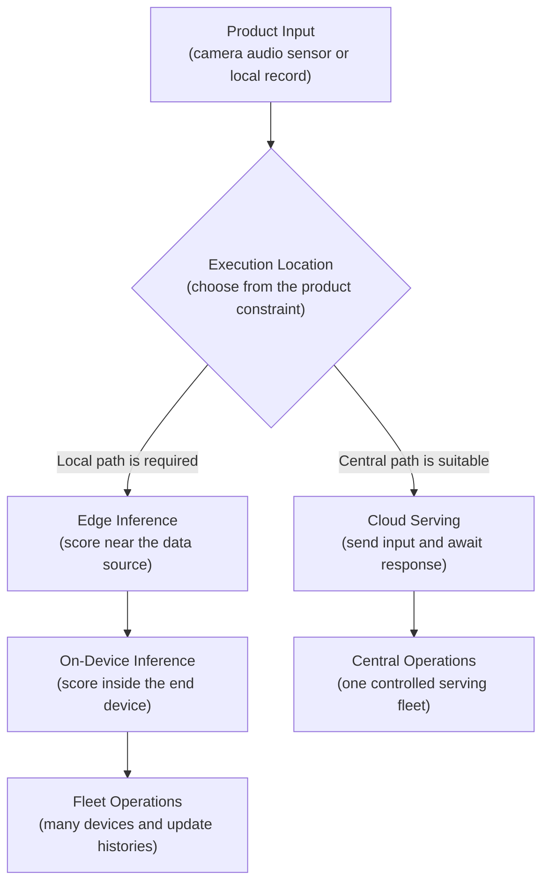
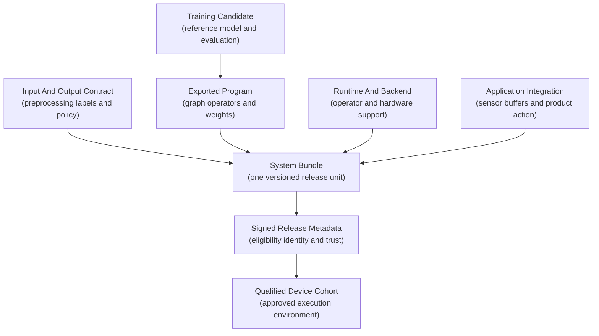
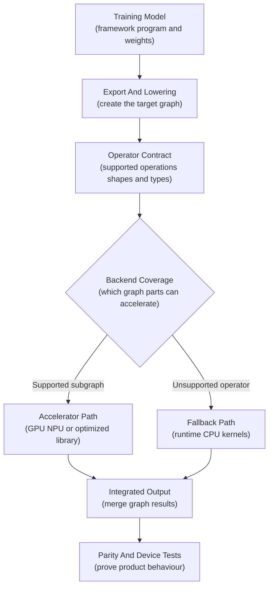
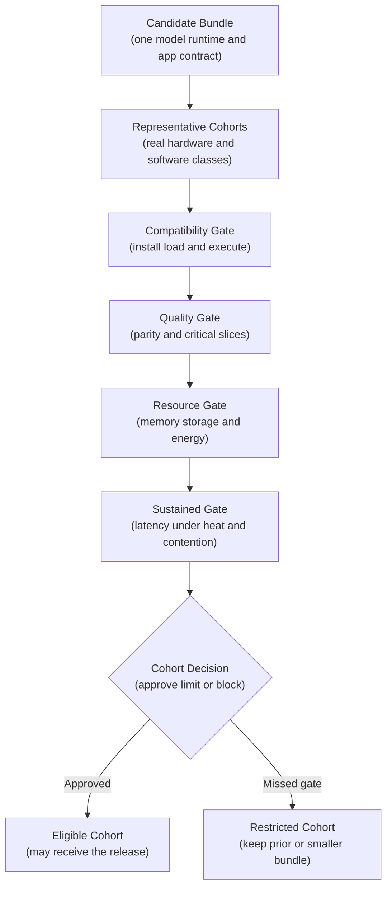
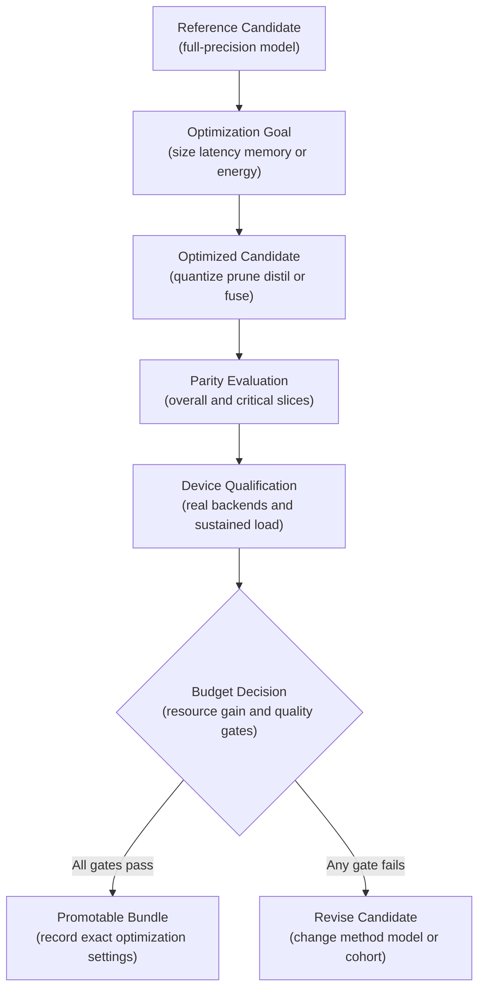
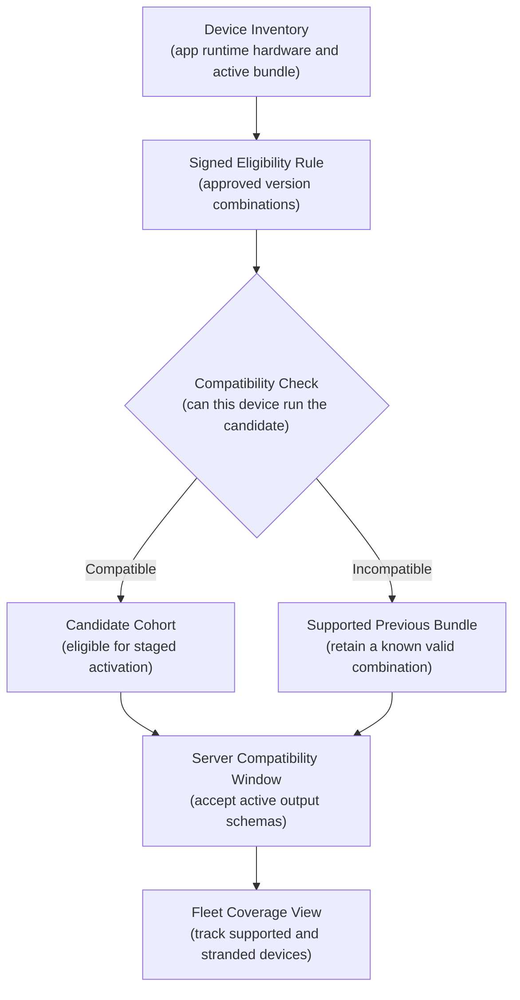
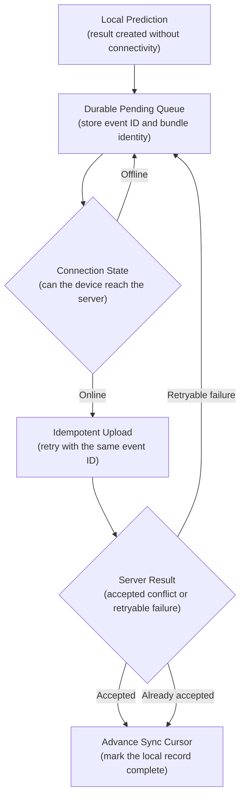
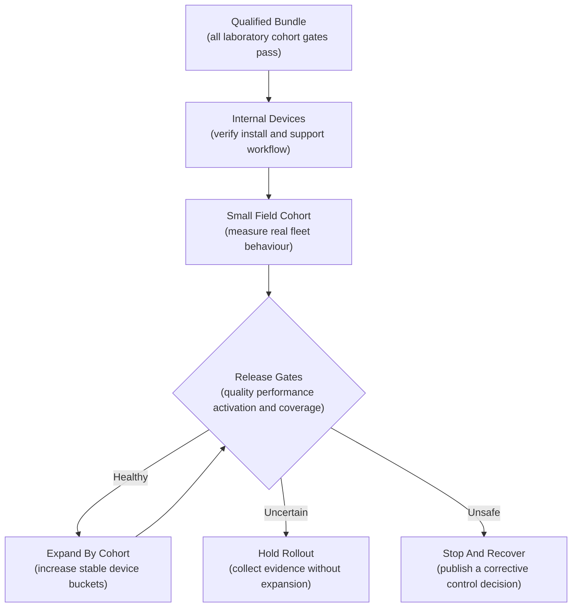

## Table of Contents

1. [What Edge And On-Device Inference Mean](#what-edge-and-on-device-inference-mean)
2. [Why Run Inference On The Device](#why-run-inference-on-the-device)
3. [Package Everything The Device Needs](#package-everything-the-device-needs)
4. [Export The Model For The Device Runtime](#export-the-model-for-the-device-runtime)
5. [Choose A Runtime For The Target Device](#choose-a-runtime-for-the-target-device)
6. [Test On Representative Device Groups](#test-on-representative-device-groups)
7. [Treat An Optimized Model As A New Release Candidate](#treat-an-optimized-model-as-a-new-release-candidate)
8. [Distribute Models Through A Secure Software Supply Chain](#distribute-models-through-a-secure-software-supply-chain)
9. [Support Devices Running Different Versions](#support-devices-running-different-versions)
10. [Synchronize Offline Data Safely](#synchronize-offline-data-safely)
11. [Collect Device Telemetry Without Breaking Privacy](#collect-device-telemetry-without-breaking-privacy)
12. [Staged Rollout Limits Fleet Exposure](#staged-rollout-limits-fleet-exposure)
13. [Recover Devices With A Forward Fix](#recover-devices-with-a-forward-fix)
14. [The Main Idea](#the-main-idea)
15. [References](#references)

## What Edge And On-Device Inference Mean
<!-- section-summary: Edge inference runs prediction near the data source, and on-device inference runs it inside the product that captures or uses the data. -->

**Edge inference means running a model close to the place where its input is created or its decision is used.** The edge machine could be a store computer, factory gateway, vehicle computer, or local network appliance. **On-device inference** is the narrower case in which the model runs inside a phone, camera, wearable, sensor, or other end-user device.

A centrally served model follows a familiar path. The application sends data across a network, a cloud service runs the model, and the response travels back. That design gives one team direct control over compute, model versions, and observability. It works well for many products.

Some product promises cannot depend on that path. A field worker may lose connectivity. A camera stream may be too large or too sensitive to upload continuously. A voice interface may need a response before a network round trip can finish. A machine may need local detection during a site outage. In those cases, prediction moves closer to the input.


```mermaid
flowchart TD
    A["Product Input<br/>(camera audio sensor or local record)"] --> B{"Execution Location<br/>(choose from the product constraint)"}
    B -->|"Central path is suitable"| C["Cloud Serving<br/>(send input and await response)"]
    B -->|"Local path is required"| D["Edge Inference<br/>(score near the data source)"]
    D --> E["On-Device Inference<br/>(score inside the end device)"]
    C --> F["Central Operations<br/>(one controlled serving fleet)"]
    E --> G["Fleet Operations<br/>(many devices and update histories)"]

    class A input; class B choice; class C,D,E path; class F,G operations
```

The operating model changes with the execution location. A cloud team can replace one deployment and observe most traffic immediately. A device fleet contains different processors, operating-system versions, accelerator drivers, memory sizes, battery states, and update histories. Some devices remain offline for weeks. A release may work on a recent phone and fail on an older device that still belongs to the supported population.

Edge MLOps is therefore the discipline of releasing a complete prediction capability into a diverse, partly disconnected fleet. The model file supplies the learned computation. Input code and the runtime determine how that computation executes. Hardware, update trust, local data policy, and recovery determine whether the fleet can operate it safely.

## Why Run Inference On The Device
<!-- section-summary: Offline operation, response time, privacy, bandwidth, and local autonomy justify the cost of owning an edge fleet. -->

Local execution adds platform work, so the decision should start with a product constraint. Five constraints cover most serious edge deployments: offline operation, response time, privacy, bandwidth, and local autonomy. Each one leads to a different system promise and a different test.

### Offline operation

An application used in tunnels, rural sites, aircraft, or disaster zones may spend long periods without a reliable connection. A local model can keep producing results from data already on the device.

The team still defines the offline boundary. It sets the model's approved offline duration and the maximum age of supporting data. It also defines queued synchronization and the high-consequence actions that require central confirmation. “Works offline” needs a duration and a safe degraded mode.

For example, a visual inspection tool can classify surface damage during a network outage and save each result locally. A repair authorization above a financial limit can remain pending until the device reconnects and a central system confirms the current policy.

### Response time

Some interactions run inside a human or control-system loop. Live audio enhancement, camera overlays, gesture recognition, and collision warnings have frame-level deadlines. Network latency also varies, so a good average cannot protect every interaction from a long tail.

The local deadline covers the whole path: sensor capture, preprocessing, queueing, model execution, postprocessing, and the user-visible action. A model benchmark of 12 milliseconds provides incomplete evidence if image conversion adds 20 milliseconds and a busy device adds another 40.

### Privacy

Local processing can keep raw text, audio, images, health signals, or household activity on the device. That architecture reduces the amount of sensitive data sent to a server.

The privacy boundary includes every output. Predictions, embeddings, thumbnails, crash dumps, debug logs, and user corrections can still reveal sensitive information. The design specifies which fields may leave the device, the purpose for each field, its retention, and the consent or legal basis that applies.

### Bandwidth

Continuous video and sensor streams can be expensive or impractical to upload. A local model can convert a high-volume stream into a small event such as “person entered restricted zone” or “bearing vibration exceeded the review threshold.”

Model updates travel in the opposite direction, so bandwidth planning remains part of the design. A 300 MB model sent to ten million devices is a major distribution workload. Delta updates, Wi-Fi-only policies, compressed artifacts, and device eligibility can reduce that cost.

### Local autonomy

A machine or vehicle may need to continue operating during a central outage. Local inference can support that autonomy, provided the approved action fits the risk model.

Safety-critical systems usually combine a model with deterministic limits, hardware interlocks, and a defined fallback state. The model may detect a suspicious pattern, while a separate safety controller enforces the physical boundary. Qualification must cover the complete control path.

Many products use a **hybrid architecture**. A small local model provides the immediate result. A server model handles uncertain cases, performs deeper analysis, or applies central policy after connectivity returns. Both paths need aligned class meanings and thresholds so the product does not give contradictory answers.


*Local execution is justified by a product constraint, not by the model type. The constraint also defines the offline, latency, privacy, bandwidth, or autonomy test the fleet must pass.*

## Package Everything The Device Needs
<!-- section-summary: On-device behaviour comes from a versioned bundle of model, data transforms, runtime, application code, compatibility policy, and update metadata. -->

A trained weight file cannot produce a user-visible decision by itself. The application must turn device data into tensors, load a runtime, choose a hardware backend, interpret model outputs, and apply product policy. A safe release versions those parts as one **system bundle**.

Suppose an image classifier expects RGB pixels resized to 224 by 224, normalized with specific means and standard deviations, and arranged in channels-first order. The mobile application accidentally supplies BGR pixels in channels-last order. The model loads and executes successfully. Its predictions are meaningless because the input contract changed.

The full release unit includes:

1. **Model program and parameters.** This is the exported graph or program plus its learned weights.
2. **Input contract.** It defines tensor names, shapes, data types, color space, sample rate, normalization, tokenization, and missing-value handling.
3. **Output contract.** It defines labels, units, score meaning, thresholds, and postprocessing.
4. **Runtime contract.** It pins the runtime family, supported operator set, runtime version range, and allowed accelerator paths.
5. **Application integration.** It covers sensor capture, memory buffers, concurrency, feature flags, and the user-visible action.
6. **Release policy.** It defines eligible devices, rollout cohort, artifact identity, trust metadata, and fallback bundle.
7. **Evidence contract.** It identifies the telemetry, quality checks, and support records that prove the bundle works.


```mermaid
flowchart TD
    A["Training Candidate<br/>(reference model and evaluation)"] --> B["Exported Program<br/>(graph operators and weights)"]
    C["Input And Output Contract<br/>(preprocessing labels and policy)"] --> D["System Bundle<br/>(one versioned release unit)"]
    B --> D
    E["Runtime And Backend<br/>(operator and hardware support)"] --> D
    F["Application Integration<br/>(sensor buffers and product action)"] --> D
    D --> G["Signed Release Metadata<br/>(eligibility identity and trust)"]
    G --> H["Qualified Device Cohort<br/>(approved execution environment)"]

    class A candidate; class B,C,E,F contract; class D bundle; class G,H release
```

Each release gets one immutable bundle identifier. Prediction and telemetry records carry that identifier. A later investigation can then connect a poor result to the exact model, transforms, runtime requirements, label map, and threshold policy that produced it.

The application package and model artifact may use separate delivery channels. They still share a compatibility contract. A downloaded model must never assume preprocessing code or operators that the installed application cannot provide. The control plane checks that relationship before activation.

## Export The Model For The Device Runtime
<!-- section-summary: Export converts a training model into a target program whose operators, tensors, numerical behaviour, and accelerator coverage the device runtime must support. -->

Training frameworks are designed for model development and gradient computation. Device runtimes are designed for small binaries, predictable memory use, and efficient inference. **Export** converts the trained model into a target program. Common outputs include a LiteRT `.tflite` model, a Core ML model, an ONNX graph, and an ExecuTorch `.pte` program.

The exported program is a graph of **operators**. An operator is one computation such as matrix multiplication, convolution, normalization, or token selection. Tensors connect the operators and carry defined shapes and data types. The runtime needs an implementation for every operator and every data type used by the graph.

Conversion can expose several incompatibilities:

- the exporter cannot represent a piece of dynamic control flow;
- the runtime lacks an operator or supports only another operator version;
- a hardware accelerator requires fixed input shapes;
- a custom layer needs a separately shipped kernel;
- data layout changes insert costly conversions;
- lower numerical precision moves a score across a product threshold.

A **delegate** or **execution provider** is the adapter that sends supported parts of a graph to a GPU, NPU, or optimized CPU library. LiteRT calls these adapters delegates. ONNX Runtime calls them execution providers. ExecuTorch uses backend delegation. Core ML chooses among Apple compute units according to configuration and platform support.

Accelerator use may cover the whole graph or only several subgraphs. Unsupported operators fall back to the runtime's ordinary CPU path if fallback is available. This **partial graph fallback** can perform worse than CPU-only execution because intermediate tensors move between CPU and accelerator memory several times. The team records delegated operator coverage and measures the final application before declaring the accelerator path successful.


```mermaid
flowchart TD
    A["Training Model<br/>(framework program and weights)"] --> B["Export And Lowering<br/>(create the target graph)"]
    B --> C["Operator Contract<br/>(supported operations shapes and types)"]
    C --> D{"Backend Coverage<br/>(which graph parts can accelerate)"}
    D -->|"Supported subgraph"| E["Accelerator Path<br/>(GPU NPU or optimized library)"]
    D -->|"Unsupported operator"| F["Fallback Path<br/>(runtime CPU kernels)"]
    E --> G["Integrated Output<br/>(merge graph results)"]
    F --> G
    G --> H["Parity And Device Tests<br/>(prove product behaviour)"]

    class A model; class B,C,D contract; class E,F,G path; class H gate
```

Export validation has three levels.

**Structural validation** proves that the target runtime loads the program and supports its required operators, shapes, and types. **Numerical parity** compares raw outputs from the training reference and target runtime on a fixed corpus with defined tolerances. **Task parity** runs preprocessing and postprocessing too, then compares accuracy, recall, false-positive rate, or another product metric across critical slices.

Task parity catches threshold effects. A floating-point reference may emit 0.501 while a quantized runtime emits 0.496. The numerical difference looks small. A threshold of 0.50 changes the final class. The release gate therefore checks decisions as well as tensor differences.

## Choose A Runtime For The Target Device
<!-- section-summary: LiteRT, Core ML, ONNX Runtime Mobile, and ExecuTorch serve different platform and framework ownership models. -->

The runtime choice determines export format, available operators, and hardware adapters. It also shapes application APIs and package size. Start with the operating systems and application stack already owned by the product team. Then verify the chosen model against the exact backend and device families in scope.

| Runtime | Strong default fit | Program and hardware path | Important qualification point |
| --- | --- | --- | --- |
| **LiteRT** | Android-first or cross-platform teams using the LiteRT ecosystem | `.tflite`; CompiledModel across CPU, GPU, and supported NPUs | CompiledModel is the modern standard; Interpreter remains for backward compatibility and some established integrations |
| **Core ML** | Applications owned entirely on Apple platforms | Core ML model; CPU, GPU, and Apple Neural Engine through compute-unit selection | Test conversion and the minimum OS target on supported Apple hardware; also qualify compute-unit behaviour |
| **ONNX Runtime Mobile** | Cross-framework teams wanting one ONNX contract across Android and iOS | ONNX or ORT format; CPU/XNNPACK plus NNAPI on Android or Core ML on iOS | Partial execution-provider coverage can add transfers and reduce performance; start with a measured CPU baseline |
| **ExecuTorch** | PyTorch teams that want an export-and-runtime path inside the PyTorch ecosystem | `.pte`; portable kernels plus XNNPACK, Core ML, Vulkan, Qualcomm, and other backends | Backend requirements and operator coverage vary by target, so export and qualification remain backend-specific |

**LiteRT** is the current name for the TensorFlow Lite runtime family. The current Android guidance presents CompiledModel as the modern standard for inference across CPU, GPU, and supported NPUs. New performance and accelerator work is prioritised there. The Interpreter API remains available for backward compatibility and still appears in integrations such as the Google Play services runtime. Existing applications can keep a qualified Interpreter path while planning and testing migration against their real device cohorts.

**Core ML** integrates directly with Apple platforms. Core ML Tools converts models, while the application configures eligible compute units such as CPU, GPU, and Neural Engine. Apple supports bundling models inside the application and downloading then compiling models on the user's device. The model's minimum platform target and the app's runtime contract need to agree.

**ONNX Runtime Mobile** accepts ONNX models and supplies Android and iOS packages. Its documentation recommends beginning with CPU for quantized models or XNNPACK for unquantized models, then testing NNAPI or Core ML execution providers if the baseline misses requirements. ORT format and custom builds can remove unused operators from the runtime binary after the model set stabilizes.

**ExecuTorch** starts from `torch.export` and lowers the program toward edge and backend dialects. It then emits a `.pte` program for its C++ runtime. Backend delegates can accelerate full or partial subgraphs. The stack fits teams already building in PyTorch and supports a shared preparation pipeline across mobile and embedded targets. Each delegate brings specific SDK requirements. Operator and device coverage remain target-dependent.

Runtime selection requires a device trial after the feature comparison. Build a representative model through each serious candidate. Measure binary size and model size, then inspect backend coverage. Sustained device tests show how each path behaves under realistic use. The application team also needs a runtime it can integrate and update. Its operating path must cover observation and fleet recovery.

## Test On Representative Device Groups
<!-- section-summary: Device qualification groups the real fleet by hardware and software capability, then tests quality and sustained performance on representative members. -->

A benchmark on a developer's newest phone says little about a mixed production fleet. Device qualification converts hardware diversity into explicit **cohorts**. A cohort is a group of devices expected to behave similarly under one bundle because they share the capabilities that matter to inference.

Useful cohort dimensions include processor architecture, available RAM, operating-system range, accelerator family, driver or vendor runtime, application version, and power profile. Marketing names are weak grouping keys because two products with similar names can use different chips or memory sizes.

A representative matrix can start with an older Android CPU-only device near the minimum supported memory. Add a common mid-range Android device using NNAPI or a vendor delegate and a recent device with an NPU. Include the oldest supported Apple hardware, current Apple hardware, and an always-powered ARM or x86 gateway if those populations exist. The final matrix should reflect actual fleet proportions and the devices carrying the greatest product risk.

Each cohort runs the same qualification layers:

1. **Compatibility:** install the bundle, load the model, select the intended backend, and complete a smoke prediction.
2. **Quality:** run the golden corpus and critical slices through the integrated application pipeline.
3. **Performance:** measure cold load, warm-up, p50 and p95 inference, end-to-end response, and throughput.
4. **Resources:** record peak memory, storage, binary growth, battery or power use, and temporary buffer allocation.
5. **Sustained behaviour:** run realistic continuous sessions while the device is warm, busy, low on memory, or switching foreground state.
6. **Interruption:** simulate process death, low storage, cancelled download, power loss, and application upgrade.


```mermaid
flowchart TD
    A["Candidate Bundle<br/>(one model runtime and app contract)"] --> B["Representative Cohorts<br/>(real hardware and software classes)"]
    B --> C["Compatibility Gate<br/>(install load and execute)"]
    C --> D["Quality Gate<br/>(parity and critical slices)"]
    D --> E["Resource Gate<br/>(memory storage and energy)"]
    E --> F["Sustained Gate<br/>(latency under heat and contention)"]
    F --> G{"Cohort Decision<br/>(approve limit or block)"}
    G -->|"Approved"| H["Eligible Cohort<br/>(may receive the release)"]
    G -->|"Missed gate"| I["Restricted Cohort<br/>(keep prior or smaller bundle)"]

    class A,B candidate; class C,D,E,F gate; class G choice; class H,I result
```

**Thermal throttling** is a device protecting itself from heat. It lowers CPU, GPU, or NPU frequency after sustained work, which increases inference time. A camera model may deliver 18 ms predictions for the first minute and 45 ms predictions after ten minutes. Cold benchmarks miss that change, so qualification graphs latency and temperature across a realistic session.

Qualification produces a separate eligibility decision for each cohort. A low-memory cohort may receive a smaller model. A device with poor accelerator coverage may use CPU. An old operating-system cohort may remain on a previous bundle until product support ends. Those decisions belong in release metadata and support records.


*The immutable bundle is promotable only for cohorts where the complete application path passes every required device gate. A benchmark on the newest phone is not fleet evidence.*

## Treat An Optimized Model As A New Release Candidate
<!-- section-summary: Quantization and other edge optimizations trade numerical representation or model capacity for size, speed, memory, and energy improvements. -->

Edge optimization aims to fit the model inside a device budget. The budget covers model size, application size, peak memory, response time, throughput, energy, and sustained thermal behaviour. Improving one number can move another in the wrong direction, so every optimization creates a proposed release, called a **release candidate**, that repeats parity and device qualification.

**Quantization** stores numbers with fewer bits. A typical training model uses 32-bit floating-point weights. An 8-bit quantized model maps those values onto a smaller integer range using scale information. The weight bytes can approach one quarter of the original size, although metadata, unquantized operations, and the application binary reduce the whole-package saving.

Several quantization paths solve different problems:

- **Float16 weight quantization** reduces weight storage and can fit GPU-oriented paths while keeping floating-point inputs and outputs.
- **Dynamic or weight-only quantization** stores weights at lower precision and calculates some activation scaling during execution.
- **Full integer quantization** uses integer weights and activations. It needs a representative calibration dataset to estimate activation ranges.
- **Quantization-aware training** simulates low-precision effects during training and can recover quality that post-training conversion lost.

The calibration set must represent production ranges and important slices. Calibrating an image model only on bright daytime scenes can assign poor activation ranges for low-light inputs. Calibrating a speech model on one language can hide damage to another language. Calibration quality is part of the release evidence.

Hardware support determines the speed result. An int8 model can run faster on a device with optimized integer kernels. A backend that inserts conversions or falls back to CPU may run it more slowly. The team records actual operator placement and profiles tensor transfers.


```mermaid
flowchart TD
    A["Reference Candidate<br/>(full-precision model)"] --> B["Optimization Goal<br/>(size latency memory or energy)"]
    B --> C["Optimized Candidate<br/>(quantize prune distil or fuse)"]
    C --> D["Parity Evaluation<br/>(overall and critical slices)"]
    D --> E["Device Qualification<br/>(real backends and sustained load)"]
    E --> F{"Budget Decision<br/>(resource gain and quality gates)"}
    F -->|"All gates pass"| G["Promotable Bundle<br/>(record exact optimization settings)"]
    F -->|"Any gate fails"| H["Revise Candidate<br/>(change method model or cohort)"]

    class A,C candidate; class B,D,E work; class F choice; class G,H result
```

Pruning removes low-value weights or structures. Distillation trains a smaller student model from a larger teacher. Operator fusion combines adjacent calculations so the runtime performs fewer launches and memory transfers. Selective runtime builds include only the operators required by the approved model set, reducing application binary size. Each technique needs its own measurement because theoretical reductions do not guarantee a device-level improvement.

A good release report compares resource use against the reference. It records model and runtime bytes, cold-load time, warm latency, peak memory, energy, and throttled latency. Backend coverage explains the execution path. Overall and critical-slice metrics confirm that the resource gain preserved the product behaviour.

## Distribute Models Through A Secure Software Supply Chain
<!-- section-summary: Edge model delivery authenticates release metadata, verifies artifact integrity and freshness, enforces compatibility, and activates through an atomic local install. -->

An edge model can ship inside the signed application or arrive later as a separately downloaded artifact. Bundling uses the normal App Store or Google Play trust and release process. It also ties model updates to application review and increases package size. Apple documents both bundled Core ML models and models downloaded then compiled on the device.

A separate model channel supports faster updates and device-specific artifacts. It also creates a software update system that the product team must secure. A compromised or replayed model can change every local decision while the application still appears healthy.

A **signed manifest** is a small metadata document approved by the release authority. It names the artifact digest and size, bundle identity, compatibility range, eligible cohort, release sequence, and fallback. The digest proves that the downloaded bytes match the approved artifact. The signature proves that an authorised key approved the manifest. An expiration and monotonically increasing sequence protect clients from stale metadata.

```yaml
release_id: edge-vision-r17
sequence: 417
artifact:
  uri: models/edge-vision-r17/model.ort
  sha256: 8f6a2c...
  bytes: 18422304
runtime:
  family: onnxruntime-mobile
  minimum_app_contract: vision-input-v4
eligibility:
  os_family: android
  cohorts: [mid-memory-cpu, high-memory-nnapi]
fallback_release: edge-vision-r16
expires_at: 2027-01-31T00:00:00Z
```

Clients enforce the signed expiration in the manifest. A device that cannot refresh metadata after expiry follows an explicit offline policy. It may keep the last approved local bundle for a limited period. A sensitive feature can also enter its defined disabled state.

The Update Framework provides a mature design for signed repository metadata, separate trust roles, hash and length checks, expiration, versioning, and key rotation. Teams can adopt a TUF implementation or apply the same security properties through a reviewed update service. A single long-lived signing key stored in a CI variable provides weak recovery from compromise.

Installation uses two local slots. The currently active bundle stays in slot A. The client downloads the candidate into slot B and checks available storage. It verifies artifact length, digest, signed metadata, and compatibility. It then loads the model and runs a smoke input. A successful smoke test permits one atomic switch of the active-slot pointer. A crash or power loss during download leaves slot A untouched.

The previous verified bundle remains available for recovery. Devices also protect update metadata from downgrade. Re-serving an old file with a valid historical signature must not move a device back to a vulnerable release. The sequence and trusted metadata state reject that rollback attack.

## Support Devices Running Different Versions
<!-- section-summary: Edge fleets run several app, runtime, model, and schema versions at the same time, so compatibility becomes an explicit release policy. -->

Device updates spread over hours, days, or weeks. Some devices are offline, low on storage, outside an app-store rollout, or pinned by enterprise policy. Several versions therefore remain active at the same time. This is **fleet version skew**.

Four version axes interact:

- the application version owns preprocessing, UI behaviour, and local storage schemas;
- the runtime version owns operator and backend support;
- the model bundle owns graph, weights, labels, and thresholds;
- the server contract owns uploaded event and prediction schemas.

A compatible release states the allowed combinations. For example, model bundle 17 may require input contract 4 and an app version that implements it. An older app remains on bundle 16. A newer app can read both output schema 3 and schema 4 during the migration window. The server accepts active client schemas until fleet evidence shows the old population has fallen below the support threshold.


```mermaid
flowchart TD
    A["Device Inventory<br/>(app runtime hardware and active bundle)"] --> B["Signed Eligibility Rule<br/>(approved version combinations)"]
    B --> C{"Compatibility Check<br/>(can this device run the candidate)"}
    C -->|"Compatible"| D["Candidate Cohort<br/>(eligible for staged activation)"]
    C -->|"Incompatible"| E["Supported Previous Bundle<br/>(retain a known valid combination)"]
    D --> F["Server Compatibility Window<br/>(accept active output schemas)"]
    E --> F
    F --> G["Fleet Coverage View<br/>(track supported and stranded devices)"]

    class A inventory; class B,C rule; class D,E,F path; class G evidence
```

Stable cohort assignment supports meaningful comparisons. A deterministic hash of an opaque device rollout ID and release ID places eligible devices into buckets. The same device stays in its bucket during pause and resume, so candidate and control populations remain interpretable. The rollout ID belongs in a controlled fleet system and should not become a high-cardinality public metric label.

Version skew also changes support work. A reported failure needs the active bundle and application contract. The support record also identifies the runtime, chosen backend, and device cohort. Its last successful update state shows how the device reached the current combination. These fields belong in a privacy-reviewed support record.

## Synchronize Offline Data Safely
<!-- section-summary: Offline devices store decisions and events durably, then use stable identifiers and idempotent server writes to synchronize after reconnecting. -->

Local inference often creates work that must reach a central system later. A field inspection records a defect. A wearable records a detected event. A store gateway accumulates anomaly summaries. Connectivity may return after the user has repeated an action or the device process has restarted.

The device stores pending records in a durable local queue. Each record receives a globally unique event ID before the first upload attempt. The payload carries the bundle ID, event time, local sequence, input-contract version, prediction, and action state. The server uses the event ID as an idempotency key, so repeated uploads converge on one accepted record.


```mermaid
flowchart TD
    A["Local Prediction<br/>(result created without connectivity)"] --> B["Durable Pending Queue<br/>(store event ID and bundle identity)"]
    B --> C{"Connection State<br/>(can the device reach the server)"}
    C -->|"Offline"| B
    C -->|"Online"| D["Idempotent Upload<br/>(retry with the same event ID)"]
    D --> E{"Server Result<br/>(accepted conflict or retryable failure)"}
    E -->|"Accepted"| F["Advance Sync Cursor<br/>(mark the local record complete)"]
    E -->|"Already accepted"| F
    E -->|"Retryable failure"| B

    class A,B local; class C,E choice; class D sync; class F result
```

Conflicts need domain rules. A central policy may have changed during the outage. The server can preserve the original local prediction as historical evidence, then calculate the current central action separately. Overwriting the local fact would erase what the user saw. Treating it as the current policy decision would ignore newer rules.

Offline state has retention and capacity limits. The client defines maximum queue size and an eviction policy. Encryption at rest protects the stored records. A pending decision also has a maximum age and a user-visible failure behaviour. A full high-value queue activates an explicit degraded state; the client must not silently discard those records.

Supporting data can become stale too. A local model may depend on a downloaded label map or risk threshold. Geofences and allowlists are other common examples. Each item has its own identity and expiry. Its fallback policy decides whether local scoring can continue and whether a high-risk action waits for fresh central data.

## Collect Device Telemetry Without Breaking Privacy
<!-- section-summary: Edge observability measures release health with minimized local aggregates and reports the coverage gaps created by offline or non-consenting devices. -->

Edge telemetry answers whether the bundle loads and meets its device budget. It also checks for plausible outputs and confirms how much of the intended fleet received the release. The telemetry policy should preserve the data-minimization reason that led to local inference.

The identity fields include bundle ID, application contract, runtime family, and device cohort. Execution fields record the selected backend, delegated graph share, load result, and fallback reason. Aggregated performance fields cover cold-start time, latency, memory pressure, and thermal band. Update state and last successful contact complete the fleet view. Controlled labels keep the metric population bounded.

Raw camera frames, audio, text, and sensor traces stay local under the normal telemetry policy. A separate reviewed path can collect an opt-in diagnostic sample or user-submitted correction. That path records its consent and purpose. Access, retention, deletion, and regional handling complete the governance policy.

Quality monitoring has less immediate evidence because raw inputs stay local and labels may arrive late. Local aggregates and delayed user corrections provide two options. Opt-in reviewed examples, product-outcome joins, and privacy-preserving counters can add evidence under the approved policy. For a classifier, the device might report a coarse distribution of predicted classes and user overrides across a sufficiently large local window. Small cells may need suppression to reduce re-identification risk.

Telemetry coverage is biased. Offline devices cannot report. Users who decline diagnostics disappear from telemetry. Older devices may crash before sending a final event. A dashboard showing only connected recent phones can look excellent while the lowest-memory cohort is failing.

Every fleet chart therefore includes a denominator and a freshness view:

- number of known eligible devices;
- number that fetched the manifest;
- number that downloaded and verified the bundle;
- number that activated it;
- number reporting health within the expected contact interval;
- number silent beyond that interval;
- coverage by device cohort and active bundle.

An inference-latency percentile without fleet coverage describes only the reporting subset. Product decisions should state that coverage beside the result.

## Staged Rollout Limits Fleet Exposure
<!-- section-summary: Edge rollout advances a qualified bundle through stable device cohorts while quality, performance, activation, and coverage gates control expansion. -->

A laboratory matrix finds known risks. A staged rollout finds production variation while limiting exposure. The rollout unit is the qualified system bundle and one explicit eligibility rule.

The first stage uses internal and dedicated test devices. The next stage activates a small field cohort with good support access. Expansion then proceeds by stable percentage and device tier. High-risk or poorly observed cohorts may receive the candidate later.

App-store rollouts and model-control-plane rollouts solve related problems. Google Play staged rollouts and Apple phased releases distribute signed application updates gradually. A separate model channel can target already installed app versions more precisely, provided its own trust and compatibility system is sound. The team may need both because an application-code defect cannot be repaired by changing model weights.


```mermaid
flowchart TD
    A["Qualified Bundle<br/>(all laboratory cohort gates pass)"] --> B["Internal Devices<br/>(verify install and support workflow)"]
    B --> C["Small Field Cohort<br/>(measure real fleet behaviour)"]
    C --> D{"Release Gates<br/>(quality performance activation and coverage)"}
    D -->|"Healthy"| E["Expand By Cohort<br/>(increase stable device buckets)"]
    E --> D
    D -->|"Uncertain"| F["Hold Rollout<br/>(collect evidence without expansion)"]
    D -->|"Unsafe"| G["Stop And Recover<br/>(publish a corrective control decision)"]

    class A candidate; class B,C,E stage; class D choice; class F,G action
```

Release gates start with model-load and activation success. Crash and fallback rates expose runtime problems. Sustained p95 latency, memory pressure, thermal degradation, and battery impact cover device behaviour. User overrides and available quality proxies cover prediction behaviour. Telemetry coverage shows how much of the cohort contributed evidence. The control cohort remains on the previous bundle so the team can separate release effects from a simultaneous application or population change.

Shadow execution can compare candidate and current outputs on the same device without exposing the candidate decision to the user. It doubles some compute and may harm battery or thermals, so it belongs in a small measured cohort and a bounded session.

A rollout percentage alone does not prove exposure. Devices receive updates at different times, and offline devices may never see the candidate. The dashboard uses actual activation acknowledgements and last-seen age. Those observations reveal the installed population represented by the configured percentage.

## Recover Devices With A Forward Fix
<!-- section-summary: Edge recovery publishes newer trusted control metadata that selects a compatible known-good bundle and measures devices that remain exposed. -->

Recovery begins by stopping further exposure. The team pauses the app or model rollout. A safe remote control path can disable the affected feature. Bundle and cohort identity then define the exposed population. The response depends on the failed layer.

A model-quality regression may be repaired by selecting the previous verified model bundle. An unsupported operator may require a cohort restriction or another export. A preprocessing bug needs an application update or a compatible server-assisted path. A compromised signing key needs the update system's key-rotation and revocation procedure.

**Forward-moving rollback** means publishing new trusted metadata with a higher sequence number that selects a known-good compatible bundle. The fleet moves to a newer control decision even though the selected model artifact may be older. This preserves freshness protection and avoids teaching clients to accept stale signed metadata.

The inactive-slot design supports fast local switching. The client verifies that the previous bundle still satisfies the installed app and runtime contract, smoke-tests it, then switches the active pointer. A device missing the bundle downloads it through the trusted update path if connectivity and retention allow.

Recovery evidence covers three populations. One population confirms activation of the repaired bundle. Another still reports the affected bundle. Offline devices form the unknown population. That group remains part of exposure until its support window expires or it reconnects and confirms repair.

Practise these failures before production:

- corrupted or truncated model download;
- interruption during installation;
- model that loads but fails its smoke input;
- unsupported accelerator operator and repeated CPU fallback;
- thermal regression after sustained use;
- quantized quality regression on one critical slice;
- full local storage and full offline sync queue;
- expired manifest during a long offline period;
- replayed historical manifest;
- lost or compromised signing key;
- application release incompatible with the fallback model.

A successful exercise proves the entire recovery path. Release authority can stop expansion, and clients reject untrusted metadata. Compatible devices activate the repair atomically. Offline devices follow policy, while queued events synchronize idempotently. Fleet coverage exposes the remaining uncertainty.

## The Main Idea
<!-- section-summary: Edge inference succeeds through a fleet release system that joins product constraints, runtime compatibility, device evidence, secure updates, offline policy, and recovery. -->

Edge and on-device inference move prediction close to its input or action. Offline operation, response time, privacy, bandwidth, and local autonomy provide the main reasons to accept the additional fleet responsibility.

The release unit combines model weights with preprocessing, postprocessing, runtime, backend, application contract, compatibility policy, and trust metadata. Export turns the model into an operator contract. LiteRT, Core ML, ONNX Runtime Mobile, and ExecuTorch implement that contract through different platform and framework paths. Representative devices prove quality, resources, acceleration, and sustained thermal behaviour.

Secure distribution authenticates the release and installs it atomically. Compatibility rules manage mixed versions. Durable local queues and idempotent uploads protect offline work. Privacy-aware telemetry reports both system health and the portion of the fleet that remains unseen. Staged rollout limits exposure, and forward-moving recovery selects a trusted compatible bundle without weakening update freshness.


*Healthy evidence expands the next cohort. Unsafe evidence selects a compatible known-good bundle through a newer trusted control decision, while repaired, still-affected, and offline devices remain visible as separate populations.*

## References

- [Google AI Edge: LiteRT for Android](https://developers.google.com/edge/litert/android)
- [Google AI Edge: On-Device Inference with LiteRT](https://developers.google.com/edge/litert/inference)
- [Google AI Edge: LiteRT GPU Acceleration](https://developers.google.com/edge/litert/android/gpu)
- [Apple: Core ML](https://developer.apple.com/documentation/coreml)
- [Apple: Reducing the Size of Your Core ML App](https://developer.apple.com/documentation/coreml/reducing-the-size-of-your-core-ml-app)
- [Apple: Core ML Compute Units](https://developer.apple.com/documentation/coreml/mlmodelconfiguration/computeunits)
- [ONNX Runtime: Deploy on Mobile](https://onnxruntime.ai/docs/tutorials/mobile/)
- [ONNX Runtime: Quantize ONNX Models](https://onnxruntime.ai/docs/performance/model-optimizations/quantization.html)
- [ExecuTorch: Architecture and Components](https://docs.pytorch.org/executorch/stable/getting-started-architecture.html)
- [ExecuTorch: Edge Platforms](https://docs.pytorch.org/executorch/stable/edge-platforms-section.html)
- [The Update Framework: Roles and Metadata](https://theupdateframework.io/docs/metadata/)
- [The Update Framework Specification](https://theupdateframework.github.io/specification/latest/)
- [Google Play: Release App Updates with Staged Rollouts](https://support.google.com/googleplay/android-developer/answer/6346149)
- [Apple: Release a Version Update in Phases](https://developer.apple.com/help/app-store-connect/update-your-app/release-a-version-update-in-phases)
