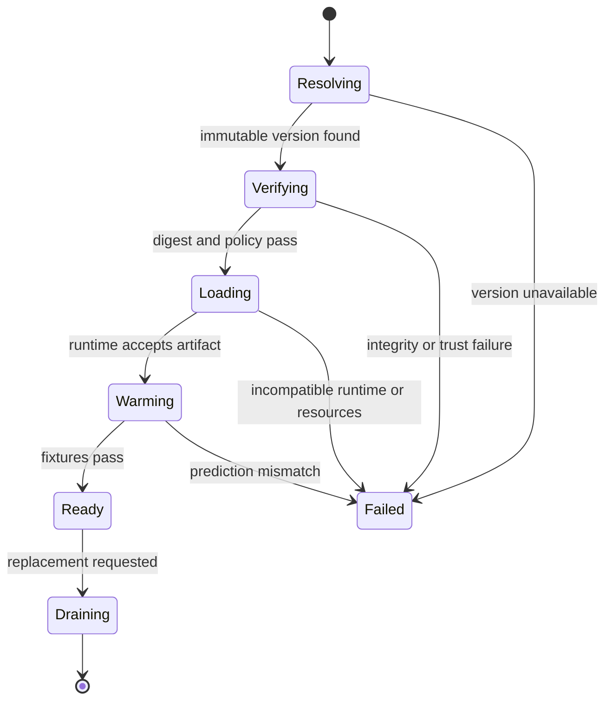

## A Saved Model Is A Serving Contract
<!-- section-summary: A production artifact connects model computation with preprocessing, schema, dependencies, identity, and verification. -->

Saving a model means creating a durable artifact that another process can load and use under known conditions. The artifact may contain weights, a computation graph, or a serialized object. Production serving also needs preprocessing, postprocessing, label maps, signature, dependencies, provenance, integrity, and example behaviour.

The safe artifact framework has seven parts:

1. Define the complete prediction contract.
2. Choose a serialization format and trust boundary.
3. Preserve preprocessing, postprocessing, and metadata.
4. Record signature, dependencies, lineage, and integrity.
5. Load in a controlled lifecycle with resource limits.
6. Verify readiness through known fixtures.
7. Retain a complete previous release for rollback.

This framework prevents teams from treating `model.pkl` as the whole product.

## Define What The Loadable Unit Contains
<!-- section-summary: The artifact bundle includes every component required to reproduce the reviewed input-to-output behaviour. -->

A prediction path often includes feature selection, scaling, encoding, tokenization, model computation, thresholding, calibration, label mapping, and response formatting. Splitting these components across undocumented files creates training-serving skew.

Where possible, package deterministic preprocessing with the model pipeline or version it as a required companion. Record postprocessing rules and thresholds explicitly. Text models need tokenizer vocabulary and configuration. Classifiers need the ordered label set. Forecasts may need transforms and inverse transforms.

The bundle should expose one input and output contract. A model signature records names, types, shapes, and optionality. An input example gives tools and reviewers a concrete fixture. Semantic details such as units, time zone, category policy, and missing-value behaviour belong in the feature contract.

### A Bundle Manifest Gives The Parts One Identity

A production bundle often contains several files: weights or graph, tokenizer, label map, preprocessing configuration, signature, fixtures, and metadata. The manifest lists each path, media type, size, and digest, then names the bundle version and contract version. The release system approves the manifest digest, which binds the exact set of companion files rather than trusting a directory name.

This matters because partial updates are dangerous. Replacing a tokenizer while keeping the old graph can preserve tensor shape and still change every token ID. Replacing a threshold file can change product actions without touching the model. A bundle identity makes any companion change a new candidate that must pass the appropriate gates.

Publication should be atomic from a consumer's perspective. Writers upload files to a new immutable prefix, verify them, write the manifest, and only then publish a completion marker or registry version. Loaders ignore prefixes without that final evidence. On object stores, “rename the directory” may not provide local-filesystem semantics, so the storage protocol must define how incomplete uploads remain invisible.

The bundle should avoid unnecessary duplication. A large shared tokenizer or base model can be referenced by digest if the loader is required to resolve and verify it. The manifest then represents a dependency graph rather than one archive. That saves storage but makes availability and retention of every referenced object part of the release contract.

## Serialization Sets Portability And Security
<!-- section-summary: Artifact format determines executable-code risk, runtime coupling, operator support, and portability. -->

Python pickle and related language-object formats can reconstruct complex pipelines but can execute code during deserialization. Load them only from trusted, integrity-verified sources inside an approved environment. They couple serving to compatible language and library versions.

Framework-native weight formats reduce some object risk while still requiring model code and compatible libraries. ONNX represents a portable computation graph for supported operators. TensorRT engines optimize for particular runtime and hardware conditions. SavedModel and TorchScript have their own capability and lifecycle constraints.

Choose the format from the serving target. A Python batch job may accept a trusted scikit-learn pipeline. A cross-language service may prefer ONNX. A high-throughput GPU path may build a TensorRT engine. Exported formats require numerical and task-quality comparison with the reviewed baseline.

The choice is easier when the team separates four questions that are often collapsed into “which format is best?”

- **Can the format represent the model?** An exporter may not support a custom operator, dynamic control flow, tokenizer step, or postprocessing rule.
- **Where will inference run?** A Python service, browser, mobile device, JVM application, and GPU model server have different runtimes and operator support.
- **How much of the original environment must be trusted?** Reconstructing a Python object can require executable application code. A graph format usually narrows that boundary, but its parser and runtime are still software that must be patched and constrained.
- **What must remain reproducible?** A hardware-specific engine may be fast but need rebuilding when the GPU generation or runtime changes. Portable weights may survive longer but require the original architecture code.

There is therefore no universally safest file extension. A team might retain framework-native weights as the durable source artifact, export an ONNX graph as a portable serving artifact, and compile a TensorRT engine as a replaceable deployment artifact. The registry links all three to the same reviewed candidate and records which transformation produced each one. If the compiled engine fails its numerical gate, the source candidate has not changed; only that serving representation is rejected.

The artifact store should enforce immutable versions, restricted writes, encryption, audit, and retention. A digest identifies exact bytes. Signing and provenance can strengthen supply-chain evidence. Never download and load an arbitrary model merely because its filename matches.

## Signature And Examples Make The Boundary Testable
<!-- section-summary: Signatures and representative fixtures catch mismatched fields, types, shapes, order, and preprocessing before traffic. -->

MLflow can log a model with an input example and inferred signature:

```python
import mlflow
from mlflow.models import infer_signature

signature = infer_signature(X_train, model.predict(X_train.head(20)))

with mlflow.start_run():
    mlflow.sklearn.log_model(
        sk_model=model,
        name="pricing-model",
        signature=signature,
        input_example=X_train.head(5),
    )
```

The current model-logging API and supported signature behaviour should be verified against the installed MLflow version. The important design is provider-independent: preserve the expected input and an executable example next to the versioned artifact.

Fixtures should include ordinary rows, missing values, category boundaries, maximum sizes, legacy inputs, and cases near important thresholds. The loader validates that preprocessing outputs match the signature and that prediction results remain inside reviewed tolerances.

## Dependencies And Lineage Explain How To Recreate The Runtime
<!-- section-summary: A release links the artifact to code, data, environment, packages, and training evidence. -->

The artifact record should identify training run, code commit, dataset snapshot, feature definitions, framework and package versions, Python or language runtime, container image, hardware where relevant, and evaluation report.

Dependency locks and container digests define the serving environment. A floating package range can load differently next month. Exact pins increase reproducibility but also require an upgrade and vulnerability-remediation process. The supported-runtime matrix in the later compatibility article connects these dependencies to hardware and model servers.

Lineage is useful during incidents. If predictions change after an image update with the same model artifact, the team can compare runtime versions. If an old artifact cannot load, the registry can locate the original environment and export path.

## Loading Is A Controlled Lifecycle
<!-- section-summary: The service resolves, verifies, loads, warms, and publishes model identity before reporting readiness. -->

A loader resolves one immutable approved version, downloads it to a controlled location, verifies digest and signature, checks available resources, and loads it using the expected runtime. It then runs warm-up and fixtures before setting readiness true.

Loading should not happen independently on every request. Long-lived services usually load once per worker or model process. Batch jobs load once per task partition where practical. Multi-model servers need explicit cache, eviction, concurrency, and memory policy.

The loader handles failure without exposing a half-initialized service. It may keep the previous model active, fail readiness so traffic stays away, or route to a documented fallback. Startup timeouts should accommodate legitimate load or compilation while still detecting a stuck process.

It helps to treat loading as a state machine rather than a startup function:



Each transition has different evidence and a different response. A download timeout can be retried without parsing the bytes. A digest mismatch must not be retried as if it were a transient network error. An out-of-memory load may require a smaller artifact or a different node. A fixture mismatch means the runtime produced unreviewed behaviour. Putting all four failures behind a generic `startup failed` message makes recovery slower and can encourage unsafe retries.

For a rolling deployment, new workers move through this state machine while old workers remain ready. Traffic changes only after enough new workers publish the expected model identity. During an in-process model swap, the service usually needs two model slots or a deliberate drain: requests already using version A must finish while version B warms. Replacing a shared pointer before B passes fixtures creates a brief but real unverified release.

The running service reports model version and digest, image digest, feature or tokenizer version, and load time. Prediction logs record the concrete loaded version rather than only a mutable alias.

The implementation can remain small because the state model carries the design. Its critical order is visible in this sketch:

```python
bundle = resolve(approved_version)
verify_digest(bundle.model, approved_model_digest)
verify_digest(bundle.contract, approved_contract_digest)
contract = read_contract(bundle.contract)
session = load_with_expected_runtime(bundle.model)
assert_prediction_fixture(session, contract.fixture)
publish_ready(contract.model_version, approved_model_digest)
```

Verification happens before the runtime parses the model or trusts its companion contract. Pinning only `model.onnx` would leave an accidental edit free to change the feature contract, fixture, or tolerance in `model-contract.json`; the release must pin both. Readiness publishes identity from the verified bundle rather than from a mutable deployment variable.

Test the failure transitions deliberately. Corrupt a copy of the model and expect an integrity failure with readiness still false. Change the contract without approving a new digest and expect loading to stop before the changed fixture is trusted. Approve a contract with the wrong input shape and expect the runtime boundary to reject it. Change a fixture result beyond tolerance and expect warm-up to fail while the previous release remains active. A successful test reports the complete identity:

```json
{
  "ready": true,
  "model_version": "pricing-model-42",
  "model_sha256": "7a9b4c...",
  "feature_contract": "pricing-features-v7"
}
```

## Smoke Tests Prove The Running Artifact
<!-- section-summary: A smoke test exercises the packaged request-to-prediction path and confirms identity, shape, values, and failure behaviour. -->

A load test that only imports the model can miss preprocessing and response problems. The smoke test sends representative requests through the same public prediction function or endpoint used by the service.

It verifies status, output schema, finite values, class or range constraints, model identity, and a known prediction tolerance. Negative fixtures verify invalid shape, missing required fields, and unsupported categories. For side-effect-free inference, the test is safe to repeat.

Readiness should depend on this end-to-end evidence. Liveness remains a process-health signal. Keeping the two probes separate prevents the platform from restarting a process that is alive while still preventing traffic from reaching an unloaded model.

## Artifact Trust Continues After Release
<!-- section-summary: Promotion, access, monitoring, and retention protect the artifact through its production life. -->

Only release automation should promote an approved artifact into production use. Serving identities receive read access to approved locations and no ability to replace them. Download and load events are audited.

Runtime monitoring checks load failures, startup duration, memory, prediction errors, model identity, and output distribution. A valid artifact can still be incompatible after a runtime or dependency change, so release tests rerun for the complete model-image pair.

Retention keeps production and rollback artifacts, dependencies or images, signatures, and evaluation evidence for the required window. Deleting one companion asset can make otherwise preserved weights unusable.

Artifact promotion should never mutate the bytes. A registry stage, alias, or release record points to an already immutable digest that passed review. Copying the same logical model between stores may create new storage metadata, so promotion verifies the content digest after transfer. If an organization rebuilds a serving representation during promotion—for example, compiles an engine on production hardware—that output is a new derived artifact with its own digest and comparison evidence.

Trust is transitive. A verified model that imports unpinned custom code or resolves a mutable tokenizer at load time is not a fully pinned release. The review should walk every runtime dependency reachable from the bundle and decide whether it is embedded, digest-addressed, supplied by the image, or intentionally read from a versioned service.

## Rollback Restores A Complete Known Release
<!-- section-summary: Recovery selects a previously verified artifact, runtime, preprocessing path, and policy rather than reconstructing them. -->

Rollback should point the deployment to a retained previous release, start or reload it, run readiness fixtures, and verify live prediction telemetry. The previous artifact must remain compatible with the current feature and request contracts or travel with its own serving path.

An alias change may not update workers that already loaded a model. Operators verify the runtime identity and route traffic only after the old version is active. The failed candidate remains available for investigation with its logs and evidence.

## Safe Saving Creates A Durable Prediction Boundary
<!-- section-summary: A trustworthy artifact preserves the full reviewed behaviour and the evidence needed to load, operate, and recover it. -->

The model file is one component of the loadable release. Serialization sets trust and portability. Signatures and fixtures make the boundary testable. Dependency and lineage records make it reproducible. Controlled loading and readiness protect traffic. Retention keeps rollback real.

Together, these responsibilities turn training output into an artifact a production system can depend on.

## References

- [MLflow model signatures](https://mlflow.org/docs/latest/ml/model/signatures/)
- [MLflow model logging](https://mlflow.org/docs/latest/ml/model/)
- [scikit-learn model persistence](https://scikit-learn.org/stable/model_persistence.html)
- [PyTorch saving and loading models](https://docs.pytorch.org/tutorials/beginner/saving_loading_models.html)
- [ONNX Runtime compatibility](https://onnxruntime.ai/docs/reference/compatibility.html)
- [NIST Secure Software Development Framework](https://csrc.nist.gov/Projects/ssdf)
