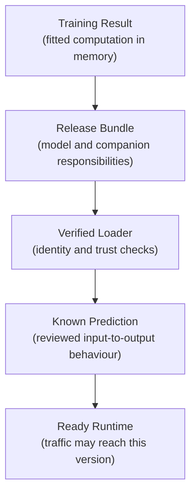
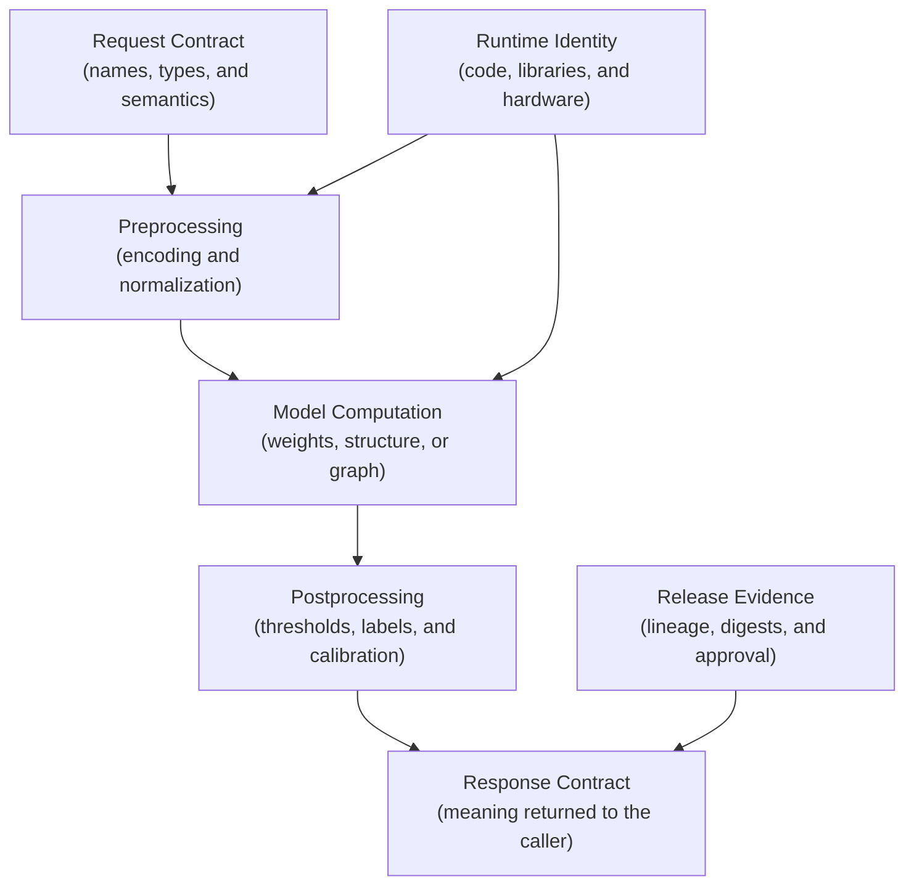
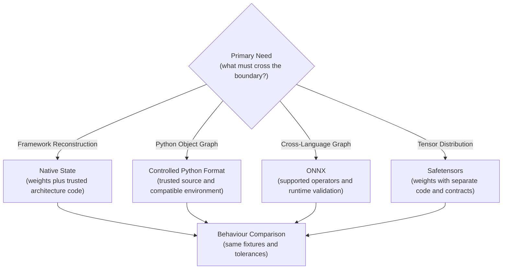
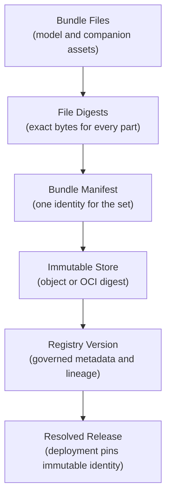
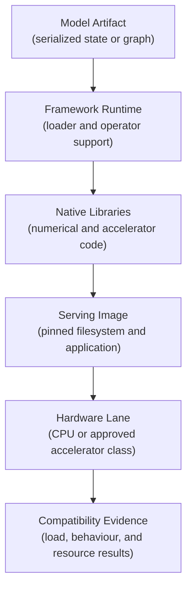
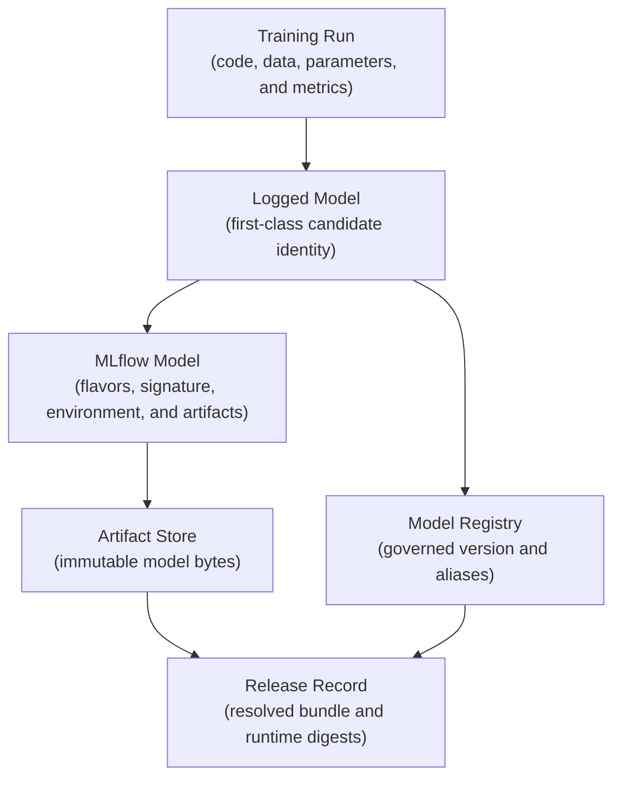
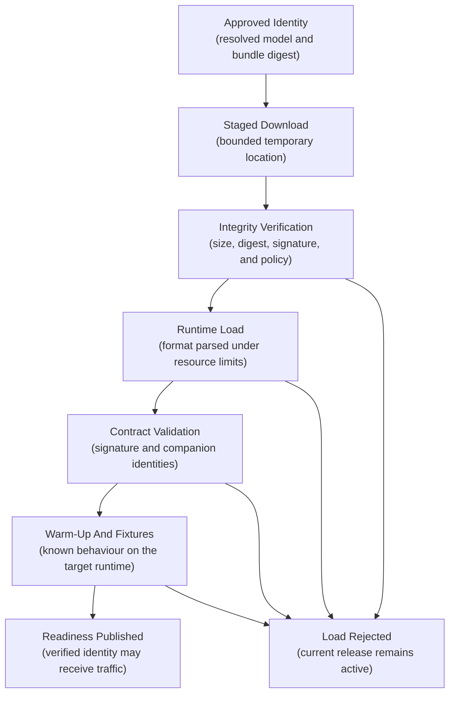
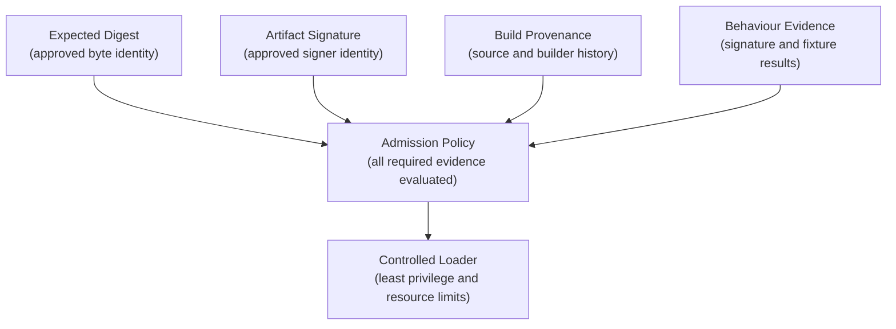
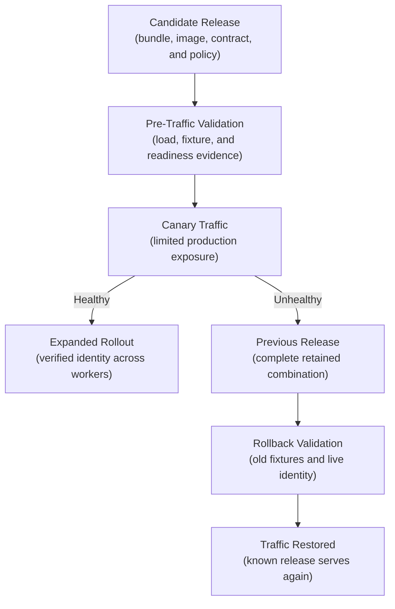

## Table of Contents

1. [What Saving A Model Really Means](#what-saving-a-model-really-means)
2. [Save Everything Needed To Reproduce A Prediction](#save-everything-needed-to-reproduce-a-prediction)
3. [Choose A Model Format From How It Will Be Loaded And Trusted](#choose-a-model-format-from-how-it-will-be-loaded-and-trusted)
4. [Give Every Saved Model An Immutable Identity](#give-every-saved-model-an-immutable-identity)
5. [Record The Input, Output, And Expected Prediction Behaviour](#record-the-input-output-and-expected-prediction-behaviour)
6. [Record Which Software And Hardware Can Run The Model](#record-which-software-and-hardware-can-run-the-model)
7. [Link The Saved Model To Its Training Run And Registry](#link-the-saved-model-to-its-training-run-and-registry)
8. [Load And Validate The Model Before Serving](#load-and-validate-the-model-before-serving)
9. [Verify Model Files And Their Build Provenance](#verify-model-files-and-their-build-provenance)
10. [Test The Loaded Model Before Traffic](#test-the-loaded-model-before-traffic)
11. [Roll Out And Roll Back The Complete Release](#roll-out-and-roll-back-the-complete-release)
12. [The Main Idea](#the-main-idea)
13. [References](#references)

## What Saving A Model Really Means
<!-- section-summary: Saving a model preserves enough information for another process to reproduce the reviewed prediction behaviour. -->

A fitted model may exist only as a Python object inside a notebook. The object disappears when that process ends, while a production service may start on another machine months later. **Saving a model** means turning the useful result of training into stored artifacts that another process can load to recreate the approved prediction behaviour.

The word *model* can hide several separate things. The learned weights or tree structure perform the mathematical calculation. Preprocessing turns a request into the values that calculation expects. A signature describes the allowed input and output shape. The runtime supplies framework libraries and native code. Metadata explains the class order, threshold, training lineage, and release identity.

Saving only the learned parameters may therefore preserve the mathematics and lose the product behaviour.

Consider a binary classifier that returns probabilities in this order:

```text
model classes: ["manual_review", "auto_approve"]
probabilities: [0.08, 0.92]
```

The service loads the model successfully. Its response code assumes the first probability means `auto_approve`, so it publishes the opposite decision. Deserialization, health checks, and latency all look normal. The missing class-order contract changed the meaning of the output.

The production goal is a **release bundle**: an immutable set of model data, companion assets, contracts, runtime identity, and evidence that reproduces a reviewed input-to-output path.


```mermaid
flowchart TD; A["Training Result<br/>(fitted computation in memory)"] --> B["Release Bundle<br/>(model and companion responsibilities)"]; B --> C["Verified Loader<br/>(identity and trust checks)"]; C --> D["Known Prediction<br/>(reviewed input-to-output behaviour)"]; D --> E["Ready Runtime<br/>(traffic may reach this version)"]
```


*The release bundle preserves the model, transformations, contracts, runtime, immutable identity, and evidence required to reproduce the reviewed prediction meaning.*

## Save Everything Needed To Reproduce A Prediction
<!-- section-summary: A release bundle preserves computation, transformations, contracts, environment, and identity as distinct responsibilities. -->

Design the bundle by following one prediction from the caller to the response. Each step must either live inside the artifact or point to a separately versioned dependency.

### Test Each Saved Part Separately

The separation matters because each part can fail without breaking the others. Valid weights can receive the wrong feature order. Correct preprocessing can feed an old model. A compatible runtime can return a score that the response layer maps to the wrong label. Naming each responsibility gives release tests a precise boundary to check.

**Model computation** includes fitted trees, coefficients, neural-network weights, persistent buffers, and any graph or architecture needed to use them. PyTorch commonly stores a `state_dict`, which contains parameters and persistent buffers. The trusted application code still defines the model class and constructs the architecture before loading those values.

**Preprocessing and postprocessing** preserve the meaning around the computation. A scikit-learn `Pipeline` can keep an encoder and estimator together. A text model needs its tokenizer configuration and vocabulary. An image model needs resize, channel order, and normalization rules. A classifier needs ordered labels and thresholds. Calibration or an inverse transform may sit after prediction.

**The signature** describes machine-checkable input and output structure: field names, data types, tensor shapes, and optional values. A separate feature or request contract records semantics such as currency units, time zones, missing-value policy, and category definitions. A float named `income` can pass a signature while using cents in one system and dollars in another.

**The environment** identifies the code and libraries that interpret the artifact. Some formats need the original Python class. Others need an ONNX runtime and supported operators. Native libraries, CPU architecture, accelerator runtime, and host driver may also affect load and inference.

**Identity and evidence** connect the bytes to their source and review. Digests bind the approved bytes. The training run and source commit explain which code produced them. A dataset snapshot links the candidate to its training inputs. Evaluation evidence and the release decision show why the candidate was allowed to move forward.


```mermaid
flowchart TD; A["Request Contract<br/>(names, types, and semantics)"] --> B["Preprocessing<br/>(encoding and normalization)"]; B --> C["Model Computation<br/>(weights, structure, or graph)"]; C --> D["Postprocessing<br/>(thresholds, labels, and calibration)"]; D --> E["Response Contract<br/>(meaning returned to the caller)"]; F["Runtime Identity<br/>(code, libraries, and hardware)"] --> B; F --> C; G["Release Evidence<br/>(lineage, digests, and approval)"] --> E
```

Large shared assets do not have to be copied into every directory. A bundle can reference a tokenizer or base weights by digest. That choice makes availability and retention of the referenced object part of the release contract.

## Choose A Model Format From How It Will Be Loaded And Trusted
<!-- section-summary: Serialization formats preserve different objects and expose different code-execution, portability, and compatibility boundaries. -->

**Serialization** converts in-memory state into bytes and reconstructs useful state from those bytes. The format decides what it can represent, which runtime can read it, and how much authority the loader gives the artifact.

### Separate Safe Data Loading From Executable Object Loading

An object format asks the loader to rebuild application objects and possibly call Python functions. A weights format asks the loader to read tensor data that trusted application code will use. A graph format asks a runtime to interpret operators. These are different security boundaries even if all three files are called models.

Framework-native formats usually preserve the framework's own concepts. PyTorch recommends saving a module's `state_dict` for inference. The loader creates the architecture from trusted code, loads the parameter dictionary, and switches the module to evaluation mode. XGBoost and LightGBM have native model formats with their own version support. These formats stay close to the training framework, so their compatibility rules still matter.

Python object formats preserve more application structure. `pickle`, `joblib`, and `cloudpickle` can reconstruct estimators and pipelines, including custom Python objects. That convenience creates an executable-code boundary: pickle deserialization can call functions while rebuilding an object. A benign demonstration makes the behaviour visible:

```python
import pickle


class RunsDuringLoad:
    def __reduce__(self):
        return (print, ("Deserialization executed a function",))


payload = pickle.dumps(RunsDuringLoad())
pickle.loads(payload)  # Prints during loading.
```

A file from an untrusted source can replace `print` with a harmful operation. `joblib` and `cloudpickle` use the pickle protocol and carry the same core risk. scikit-learn documents `skops.io` as a more controlled option because it lets reviewers inspect unknown types and explicitly trust them before loading. MLflow's current scikit-learn flavor also uses `skops` as its default serialization format. The runtime still needs compatible packages and a careful decision about every permitted type.

PyTorch uses pickle in its serialization machinery. Current PyTorch releases use a restricted `weights_only` loader by default in the common `torch.load` path. It limits dynamic imports and the objects that can be constructed. PyTorch also documents remaining denial-of-service and possible memory-safety limits. A restricted loader narrows one attack path; it does not establish trust in arbitrary checkpoint bytes.

**Safetensors** stores tensors in a deliberately simple format and avoids pickle-style object reconstruction. It is a strong fit for distributing weights. The file does not preserve the model architecture, tokenizer, custom layers, inference code, or product contract. Those responsibilities must come from reviewed code and companion metadata. Large or adversarial tensor shapes can still create resource risk in downstream software.

**ONNX** stores a portable computation graph and initializers for supported operators. ONNX Runtime supports several languages and hardware execution providers. Export coverage, custom operators, numerical differences, and task-quality comparison still need testing. ONNX Runtime explicitly warns that an untrusted graph can consume excessive memory or compute, so untrusted models belong in a constrained inspection environment.


```mermaid
flowchart TD; A{"Primary Need<br/>(what must cross the boundary?)"} -->|Framework Reconstruction| B["Native State<br/>(weights plus trusted architecture code)"]; A -->|Python Object Graph| C["Controlled Python Format<br/>(trusted source and compatible environment)"]; A -->|Cross-Language Graph| D["ONNX<br/>(supported operators and runtime validation)"]; A -->|Tensor Distribution| E["Safetensors<br/>(weights with separate code and contracts)"]; B --> F["Behaviour Comparison<br/>(same fixtures and tolerances)"]; C --> F; D --> F; E --> F
```

No extension solves every responsibility. A team may retain native weights as the durable source, create an ONNX export for serving, and record both as related artifacts. Each representation receives its own digest and comparison evidence.

## Give Every Saved Model An Immutable Identity
<!-- section-summary: A manifest and content digests bind every companion file into one release candidate. -->

Production models rarely fit into one file. A text classifier may ship weights, tokenizer files, a label map, a signature, a preprocessing configuration, and expected fixture results. A **bundle manifest** lists those parts and their cryptographic digests.

The manifest gives reviewers one object to approve. Without it, a deployment might select the model from version 42 and retrieve a tokenizer through a mutable `latest` path. Both files can be individually valid while their combination has never passed evaluation.

Each manifest entry describes a path and the digest expected at that path. The loader verifies every entry before it allows the format-specific parser to touch the model. Deployment and runtime telemetry record the manifest digest as the bundle identity.

```json
{
  "bundle_version": "document-classifier-42",
  "model": {"path": "model.onnx", "sha256": "5f31d2..."},
  "tokenizer": {"path": "tokenizer.json", "sha256": "8aa109..."},
  "labels": {"path": "labels.json", "sha256": "d7024c..."},
  "class_order": ["manual_review", "auto_approve"],
  "signature": {"path": "signature.json", "sha256": "22bd91..."},
  "fixture": {"path": "fixture.json", "sha256": "91e8a0..."}
}
```

The manifest itself receives a digest. That top-level digest identifies the exact set of model and companion bytes. Replacing `labels.json` creates a new candidate even if `model.onnx` stays unchanged.

An object store can publish each candidate under a new immutable prefix. The writer uploads the files, verifies them, writes the final manifest, and creates the registry record only after the bundle is complete. Readers ignore partial prefixes. An OCI registry can store a bundle as a digest-addressed artifact with related metadata. A model registry can point its version to the immutable object or OCI digest.

Human-friendly aliases such as `champion` or `production` remain useful for discovery. They are mutable pointers. Deployment resolves the alias to an immutable model or bundle identity and records that resolved value in the release. A running service should never report only the alias because the alias may move after the process has loaded an older version.


```mermaid
flowchart TD; A["Bundle Files<br/>(model and companion assets)"] --> B["File Digests<br/>(exact bytes for every part)"]; B --> C["Bundle Manifest<br/>(one identity for the set)"]; C --> D["Immutable Store<br/>(object or OCI digest)"]; D --> E["Registry Version<br/>(governed metadata and lineage)"]; E --> F["Resolved Release<br/>(deployment pins immutable identity)"]
```

## Record The Input, Output, And Expected Prediction Behaviour
<!-- section-summary: Signatures validate structure, while representative examples expose semantic and preprocessing mistakes. -->

A model signature is the machine-readable boundary around prediction. For tabular data it can describe column names, types, and optional fields. For tensors it can describe data type and shape. MLflow signatures can also describe outputs and inference parameters.

### Check Input Shape And Prediction Behaviour Separately

Signature validation asks whether an input is structurally acceptable. A representative fixture asks whether the complete prediction path still gives an expected result. Production loading needs both because semantic mistakes often preserve shape.

An **input example** is a concrete valid request stored with the model. It helps infer or inspect the signature and gives logging or serving tools something real to validate. MLflow can store both with an MLflow Model:

```python
import mlflow
from mlflow.models import infer_signature

sample = X_train.iloc[[0, 1]]
predictions = model.predict_proba(sample)
signature = infer_signature(sample, predictions)

with mlflow.start_run():
    model_info = mlflow.sklearn.log_model(
        sk_model=model,
        name="credit-decision",
        signature=signature,
        input_example=sample,
        metadata={"class_order": [str(value) for value in model.classes_]},
    )
```

The signature catches a missing field or incompatible tensor shape. It cannot tell that a monetary value changed from dollars to cents, that RGB became BGR, or that a label array was reversed. **Representative fixtures** cover this semantic layer. Each fixture carries a realistic input, the expected transformed representation or prediction, and an allowed tolerance.

For an image classifier, one fixture might record a small approved image, the expected resized tensor statistics, and the top class. A serving change that omits division by 255 still produces a tensor with the correct shape and data type. The tensor values and final prediction reveal the error.

Boundary fixtures deserve extra attention: missing optional values, unseen categories, maximum text length, timestamps around daylight-saving transitions, and probabilities near a product threshold. The goal is a small set that exposes meaning, not a copy of the evaluation dataset.

## Record Which Software And Hardware Can Run The Model
<!-- section-summary: The release records the software and hardware conditions required to interpret and execute the artifact. -->

Model bytes do not explain how to run themselves. A Python artifact needs a compatible language and model framework. Numerical packages such as NumPy and SciPy may also affect loading or inference. Custom application packages supply architecture and transformation code. Neural workloads add tokenizer libraries, native kernels, and precision settings.

MLflow Models can include files such as `requirements.txt`, `conda.yaml`, and `python_env.yaml`. These files help recreate an environment. A locked dependency set or serving-image digest provides a stronger release identity because it records the reviewed resolution or built filesystem. The bundle must link to the exact runtime tested with it.

Hardware matters whenever the artifact or runtime relies on a particular CPU architecture or instruction set. Accelerator serving adds a GPU class, host driver, user-space runtime, and memory limit. A compiled engine may bind several of those choices into one artifact. A TensorRT engine built for one environment is therefore a derived deployment artifact and may need rebuilding elsewhere. An ONNX graph may load with the CPU provider while the intended GPU provider is missing. That load is technically successful and operationally wrong.


```mermaid
flowchart TD; A["Model Artifact<br/>(serialized state or graph)"] --> B["Framework Runtime<br/>(loader and operator support)"]; B --> C["Native Libraries<br/>(numerical and accelerator code)"]; C --> D["Serving Image<br/>(pinned filesystem and application)"]; D --> E["Hardware Lane<br/>(CPU or approved accelerator class)"]; E --> F["Compatibility Evidence<br/>(load, behaviour, and resource results)"]
```

Training and serving environments can differ. An exported graph often exists to support that separation. The release must record and test the exporter-to-runtime pair. Copying the training environment into production may carry unnecessary packages and still fail to prove the intended hardware path.

## Link The Saved Model To Its Training Run And Registry
<!-- section-summary: Artifact storage holds bytes, a model registry governs versions, and lineage explains how each candidate was produced and evaluated. -->

A production team needs to find model bytes, decide which versions may be used, and understand where each version came from. Those needs lead to three related systems: an artifact store, a model registry, and lineage records.

You can think of the artifact store as the secured shelf, the registry as the catalog and approval desk, and lineage as the production history attached to each item. Combining the names can make the platform sound more complicated than it is. Keeping their responsibilities separate prevents a registry alias from being mistaken for immutable storage or a training run from being mistaken for release approval.

The **artifact store** holds model and companion bytes. Typical choices include S3, Google Cloud Storage, Azure Data Lake Storage, or an OCI registry. Access policy, retention, immutability, encryption, and digest verification protect the stored bundle.

The **model registry** is the governed catalog. It gives the candidate a stable identity, links approval state and aliases, and supports promotion or retirement. A registry entry should point to immutable artifact content. It should never act as a substitute for the artifact's own digest.

**Lineage** answers how the candidate came to exist. The source side links the training run, code commit, data snapshot, feature definitions, and training configuration. The review side links the evaluation dataset, segment results, exporter identity, and serving compatibility evidence.

### MLflow Models And Logged Models

MLflow illustrates how these responsibilities connect. An **MLflow Model** is a directory convention with an `MLmodel` descriptor, artifacts, dependency metadata, signatures, and one or more **flavors**. A flavor tells a compatible tool how to interpret the model. A scikit-learn model can expose its native flavor and the generic `python_function` flavor used by `mlflow.pyfunc`.

MLflow 3 also treats a **Logged Model** as a first-class record with its own model ID. Its record can connect artifacts and parameters to metrics from one or more runs. It also retains the source run and any registry registration. The model URI `models:/<model_id>` can refer to that identity. The packaging envelope does not erase the trust model of the contained flavor. A Python flavor that carries custom code still requires a trusted source and controlled loader.


```mermaid
flowchart TD; A["Training Run<br/>(code, data, parameters, and metrics)"] --> B["Logged Model<br/>(first-class candidate identity)"]; B --> C["MLflow Model<br/>(flavors, signature, environment, and artifacts)"]; C --> D["Artifact Store<br/>(immutable model bytes)"]; B --> E["Model Registry<br/>(governed version and aliases)"]; D --> F["Release Record<br/>(resolved bundle and runtime digests)"]; E --> F
```

## Load And Validate The Model Before Serving
<!-- section-summary: A production loader resolves, fetches, verifies, parses, warms, and validates a candidate before publishing readiness. -->

Loading a model is a release operation inside the running process. It downloads bytes, gives a parser access to them, allocates memory, may compile kernels, and changes which model will answer requests. A single `load_model()` call hides those stages.

### Keep The Current Model Active Until Validation Passes

A controlled loader starts from an approved immutable identity. It fetches the bundle into a staging area, checks file sizes and digests, verifies any required signature and provenance policy, and reads the manifest under resource limits. Only then does the format-specific runtime parse the model.

After parsing, the loader checks the signature, class order, tokenizer or preprocessing identity, and available execution provider. It runs warm-up plus representative fixtures. Readiness publishes the loaded model ID and digests after every check passes.


```mermaid
flowchart TD; A["Approved Identity<br/>(resolved model and bundle digest)"] --> B["Staged Download<br/>(bounded temporary location)"]; B --> C["Integrity Verification<br/>(size, digest, signature, and policy)"]; C --> D["Runtime Load<br/>(format parsed under resource limits)"]; D --> E["Contract Validation<br/>(signature and companion identities)"]; E --> F["Warm-Up And Fixtures<br/>(known behaviour on the target runtime)"]; F --> G["Readiness Published<br/>(verified identity may receive traffic)"]; C --> H["Load Rejected<br/>(current release remains active)"]; D --> H; E --> H; F --> H
```

A new worker can fail readiness and leave traffic on healthy old workers. An in-process swap needs two slots or a drain procedure: version A continues serving while version B loads and proves itself. Replacing the active pointer before B passes fixtures exposes an unreviewed model for a brief period.

The loader should distinguish failure classes. A download timeout may support a bounded retry. A digest mismatch is an integrity failure. An unsupported operator is a compatibility failure. A wrong fixture result is a behaviour failure. Each one needs different evidence and recovery.


*Traffic may move only after the staged candidate publishes its verified loaded identity. Integrity, compatibility, contract, or behaviour failure rejects the candidate without replacing the current release.*

## Verify Model Files And Their Build Provenance
<!-- section-summary: Digests, signatures, provenance, permissions, and isolation answer separate questions about artifact trust. -->

A **cryptographic digest** answers, “Are these the exact bytes the release expected?” Recomputing SHA-256 after download detects corruption or replacement. The expected digest must come from an approved record; a digest stored beside a replaced file gives an attacker both values.

A **digital signature** connects the digest to a signing identity. Sigstore Cosign can sign and verify blobs or OCI artifacts, including keyless workflows backed by an identity certificate and transparency evidence. Verification policy should restrict the expected issuer and signer identity. A valid signature says who signed particular bytes. Predictive quality still comes from evaluation and behaviour tests.

**Provenance** records how an artifact was built: source repository, commit, build workflow, and builder identity. It helps a policy decide whether the artifact came from the approved pipeline. Least-privilege storage permissions prevent serving identities from replacing what they read. Audit logs record publication, promotion, download, and load events.

Parser isolation supplies another layer. A pickle-like artifact receives no production credentials during inspection. An untrusted ONNX graph runs inside a resource-constrained sandbox because a graph can still request excessive compute or memory. File-size, tensor-shape, path, and decompression limits should be checked before large allocations wherever the format permits.


```mermaid
flowchart TD; A["Expected Digest<br/>(approved byte identity)"] --> E["Admission Policy<br/>(all required evidence evaluated)"]; B["Artifact Signature<br/>(approved signer identity)"] --> E; C["Build Provenance<br/>(source and builder history)"] --> E; D["Behaviour Evidence<br/>(signature and fixture results)"] --> E; E --> F["Controlled Loader<br/>(least privilege and resource limits)"]
```

## Test The Loaded Model Before Traffic
<!-- section-summary: Load validation proves identity, structure, semantic behaviour, and runtime mode on the exact artifact that will serve. -->

A serving smoke test exercises the real loader and prediction function. Importing the model class is too early in the path. Successfully deserializing the file proves only that the parser accepted it.

The following focused PyTorch example verifies the bytes before parsing, loads only tensor state into trusted architecture code, selects evaluation mode, checks the label order, and compares a known prediction:

```python
from hashlib import sha256
import json
from pathlib import Path

import torch

from service.model import ReviewClassifier


def file_sha256(path: Path) -> str:
    digest = sha256()
    with path.open("rb") as handle:
        for block in iter(lambda: handle.read(1024 * 1024), b""):
            digest.update(block)
    return digest.hexdigest()


weights = Path("bundle/model-state.pt")
manifest = json.loads(Path("bundle/manifest.json").read_text())
assert file_sha256(weights) == manifest["model"]["sha256"]

model = ReviewClassifier()
state = torch.load(weights, map_location="cpu", weights_only=True)
model.load_state_dict(state, strict=True)
model.eval()

assert manifest["class_order"] == ["manual_review", "auto_approve"]
fixture = torch.tensor([[0.2, -1.1, 0.7]], dtype=torch.float32)
with torch.inference_mode():
    actual = model(fixture).softmax(dim=1)
torch.testing.assert_close(actual, torch.tensor([[0.08, 0.92]]), rtol=0.02, atol=0.01)
```

In a real bundle, the fixture should enter before preprocessing if the service owns that transformation. The test then catches a changed scaler, tokenizer, image normalization rule, or category map. It also checks output schema, finite values, class or range constraints, and the exact loaded identity.

Negative fixtures matter too. Try a missing required field, an unseen category, an oversized input, and a corrupted copy of the artifact. The service should keep readiness false, return no prediction, and report the first failed boundary without leaking secrets or raw sensitive input.

## Roll Out And Roll Back The Complete Release
<!-- section-summary: Deployment and recovery move a proven combination of model, runtime, preprocessing, contracts, and policy. -->

After load validation, the new release can receive a small amount of canary or shadow traffic. Runtime telemetry records the model ID and bundle digest alongside the serving-image digest. It also reports the preprocessing or tokenizer version. Load results and prediction health complete the evidence. Together, these fields confirm that users reached the release the deployment intended.

The model ID and bundle digest identify the candidate. The image digest identifies the process interpreting it. A tokenizer or preprocessing version closes the transformation boundary. Load status and prediction telemetry show whether that exact combination stayed healthy after traffic arrived.

Rollback must restore a **complete known release**. Reverting only the weights can leave the new tokenizer, threshold, label map, feature contract, or runtime image in place. That mixed combination may never have been tested.

For example, version 43 adds a third output class and a new response mapping. Production behaviour fails after rollout. Pointing the model alias back to version 42 leaves workers that already loaded version 43 untouched, and the new response code may misread version 42's two-class output. Recovery selects the previous release record, restores its model bundle and compatible image, starts fresh workers, runs the version 42 fixtures, and then returns traffic.


```mermaid
flowchart TD; A["Candidate Release<br/>(bundle, image, contract, and policy)"] --> B["Pre-Traffic Validation<br/>(load, fixture, and readiness evidence)"]; B --> C["Canary Traffic<br/>(limited production exposure)"]; C -->|Healthy| D["Expanded Rollout<br/>(verified identity across workers)"]; C -->|Unhealthy| E["Previous Release<br/>(complete retained combination)"]; E --> F["Rollback Validation<br/>(old fixtures and live identity)"]; F --> G["Traffic Restored<br/>(known release serves again)"]
```

Retention policy therefore covers the previous bundle, serving image, dependency records, signatures, evaluation evidence, configuration, and rollout instructions. Operators verify the live loaded identity after rollback. An alias update alone cannot prove that every worker changed.

## The Main Idea
<!-- section-summary: Safe persistence preserves the complete reviewed prediction path and verifies it before any new artifact receives traffic. -->

A model file preserves one part of a production prediction. Transformations preserve the meaning of its inputs and outputs. A signature records structure, while examples record expected behaviour. Environment identity tells the loader which software and hardware combination has been tested. Lineage connects the candidate to training and review. Immutable digests bind all of those parts to the release.

Production safety comes from the full path: publish immutable bytes, resolve a governed identity, verify before parsing, load under controlled permissions and resources, run representative behaviour checks, expose the loaded version, and retain the complete previous release. A successful deserialization is one checkpoint inside that process.

This framework also gives incident responders a useful order. Confirm the loaded bundle and image identities first. Then inspect integrity, contract, preprocessing, runtime, and fixture evidence. The first broken boundary points toward the repair and identifies the complete release that can serve as rollback.


*Healthy canary evidence supports gradual expansion and reassessment. A failed check or stop condition restores the retained bundle, compatible image, transformations, contracts, policy, and fixtures before new requests prove recovery.*

## References

- [MLflow Models](https://mlflow.org/docs/latest/ml/model/)
- [MLflow model signatures and input examples](https://mlflow.org/docs/latest/ml/model/signatures/)
- [MLflow Tracking](https://mlflow.org/docs/latest/ml/tracking/)
- [scikit-learn model persistence](https://scikit-learn.org/stable/model_persistence.html)
- [PyTorch serialization semantics](https://docs.pytorch.org/docs/stable/notes/serialization.html)
- [PyTorch saving and loading models](https://docs.pytorch.org/tutorials/beginner/saving_loading_models.html)
- [ONNX Runtime](https://onnxruntime.ai/docs/)
- [ONNX external data security](https://onnx.ai/onnx/repo-docs/ExternalDataSecurity.html)
- [Safetensors documentation](https://huggingface.co/docs/safetensors/)
- [Sigstore Cosign blob signing](https://docs.sigstore.dev/cosign/signing/signing_with_blobs/)
- [Sigstore Cosign signature verification](https://docs.sigstore.dev/cosign/verifying/verify/)
