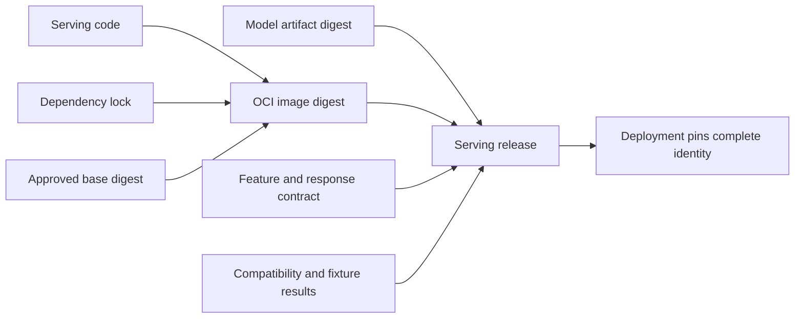

## An Image Defines The Serving Runtime
<!-- section-summary: A container image packages a filesystem and process definition, while a running container adds environment, identity, resources, network, and mounted data. -->

A **container image** is an immutable package of operating-system files, language runtime, libraries, application code, and startup configuration. A **container** is a running instance of that image with environment variables, credentials, network, resource limits, and writable storage.

For model serving, the image should create a repeatable path from process start to a ready prediction service. The packaging framework has six responsibilities:

1. Separate build-time work from runtime work.
2. Define OS, language, native, and application layers.
3. Choose whether the model is baked in or resolved at startup.
4. Define process, concurrency, signal, and health lifecycle.
5. Run as a constrained identity without embedded secrets.
6. Build, scan, sign, test, and deploy by digest.

Docker is one implementation of the OCI image model. Kubernetes and managed container services can run the resulting image, while their runtime configuration remains outside it.

## Build Time Produces A Reproducible Runtime
<!-- section-summary: Build stages compile dependencies and application assets, while the final image contains only what inference needs. -->

Build time can install compilers, resolve dependencies, run code generation, export a model, and create wheels. Runtime should contain the smallest approved set needed to start and serve.

A multi-stage build prevents compilers and caches from entering the final image. It also creates a clear supply-chain boundary: build inputs produce a runtime artifact that can be scanned and signed.

The build should use pinned base images and dependency locks. Tags such as `python:latest` move. A digest identifies exact base bytes. Exact application dependencies improve reproducibility, while the team still needs a regular upgrade and vulnerability-remediation process.

Network access during build should be controlled. Private package credentials use build secrets and never remain in image layers. Copy lock files before source code where cache behaviour helps without hiding dependency changes.

## Runtime Layers Follow Serving Responsibilities
<!-- section-summary: The final image contains system libraries, language dependencies, serving code, and a clear process command. -->

System libraries may support image decoding, tokenization, numerical kernels, or accelerator runtimes. Language packages include the model framework, API framework, validation, and observability. Application code handles request lifecycle and model loading.

Keep each dependency because the service needs it. Notebook, training, and development packages increase size, vulnerabilities, and import complexity. CPU and GPU images often need separate bases and support matrices rather than one image that contains every runtime.

The process command should use exec form so signals reach the server correctly. The server needs a defined host, port, worker model, timeout, and graceful shutdown. Container restart should not be the only failure strategy; readiness keeps traffic away from an unprepared model.

## Model Artifact Placement Has Two Main Designs
<!-- section-summary: Baking a model into the image simplifies identity, while loading an external artifact separates release cadence and can reduce image size. -->

A **baked-in model** travels inside the image. The image digest then identifies code, dependencies, and model together. Startup is predictable and does not depend on artifact download. Large models make builds, registry storage, and rollout heavier, and every model change creates a new image.

An **external model** is downloaded or mounted at startup from an approved immutable location. Code and model can promote separately, and one image can serve several versions. Startup needs credentials, network, integrity verification, cache policy, disk capacity, and failure handling. The deployment must pin the artifact version or digest.

Multi-model servers use a third variation: one runtime image plus a controlled model repository and cache. They need explicit memory, eviction, concurrency, tenant, and load policy.

The right choice follows artifact size, release frequency, isolation, cold-start limits, and audit requirements. Avoid mutable `latest` references in either design.

The important idea is that **packaging identity and release identity are not always the same thing**. With a baked-in model, one image digest can identify the complete serving release. With an external model, the image digest identifies only the runtime; the release identity is the pair of image digest and model digest, plus any separately versioned feature or tokenizer contract. A deployment that records only the image can appear unchanged while a mutable model reference silently moves.

This distinction also changes rollback. A baked-in release rolls back one image reference. An external model release must restore a proven combination. Rolling the model back while leaving a newly incompatible runtime in place is not recovery. Platforms that allow separate promotion should create an immutable release record that binds the components after compatibility tests pass.



## Process And Concurrency Must Match Model Behaviour
<!-- section-summary: Worker count, threads, batching, accelerator sharing, and memory determine how the container serves concurrent requests. -->

Traditional web advice to start many workers can be harmful when each worker loads a large model. Four workers may create four copies in memory or on the GPU. The process model should follow framework thread safety, model memory, accelerator sharing, request latency, and batching.

CPU services may use several processes or threads after load testing. GPU services often use a smaller number of model processes with controlled concurrency or a specialized inference server. Autoscaling replicas adds another layer and should not fight an internal queue or batcher.

Graceful shutdown stops new work, allows in-flight requests to finish within a limit, flushes telemetry, and exits. Long model load and warm-up should appear in readiness and startup probes rather than causing repeated restarts.

## Health Reflects Process And Model Lifecycle
<!-- section-summary: Liveness reports process viability, readiness reports model usability, and startup protects slow initialization. -->

Liveness indicates whether the process can continue. Readiness remains false until model load, warm-up, required dependency checks, and a fixture prediction succeed. A startup probe gives initialization time before liveness enforcement begins.

The service should expose the loaded model version and digest, image digest, feature or tokenizer version, and load time. A generic `{"status":"ok"}` cannot prove that the correct model is ready.

Health endpoints should remain cheap and avoid running a full prediction on every probe. The startup path can run the expensive fixture once and store the result in readiness state.

## The Image Is A Security And Supply-Chain Boundary
<!-- section-summary: A serving image runs as non-root, contains no secrets, limits packages, and carries verifiable provenance. -->

Create a non-root user and copy runtime files with narrow ownership. Use a read-only root filesystem where the platform supports it, with explicit writable paths for caches or temporary files. Drop Linux capabilities and apply seccomp or another sandbox policy according to the threat model.

Secrets enter at runtime through the platform's identity and secret system. They should not appear in Dockerfile instructions, copied configuration, or image history. Model-store credentials should be short-lived and read-only for approved artifacts.

CI scans operating-system and language packages, creates a software bill of materials, records build provenance, and signs the digest when the organization uses signing. Policy can require approved registries, bases, signatures, and vulnerability status before deployment.

These controls answer different questions. An SBOM lists what the image contains. A vulnerability scan compares that inventory with known advisories. Provenance records where and how the image was built. A signature associates the digest with an approved identity. None of them proves that the model is accurate, that the base image is well configured, or that the signer followed the release policy. A useful admission policy combines these signals with the prediction and compatibility gates rather than treating “signed” as “safe.”

Image hardening must also match the application. A read-only root filesystem fails if a tokenizer or framework tries to populate a cache at startup. The answer is not to make the entire filesystem writable; it is to identify the required cache, pre-populate it during the build when possible, or mount one narrowly scoped writable directory. The same reasoning applies to certificate stores, temporary uploads, and compiled model engines. Every writable path is an operational dependency that tests should expose.

## A Dockerfile Implements The Framework
<!-- section-summary: A multi-stage Dockerfile creates a minimal non-root runtime with pinned dependencies and an explicit server process. -->

```dockerfile
FROM python:3.12-slim@sha256:REPLACE_WITH_APPROVED_DIGEST AS builder
WORKDIR /build
COPY requirements.lock .
RUN python -m venv /opt/venv \
    && /opt/venv/bin/pip install --no-cache-dir -r requirements.lock

FROM python:3.12-slim@sha256:REPLACE_WITH_APPROVED_DIGEST AS runtime
ENV PATH="/opt/venv/bin:$PATH" \
    PYTHONUNBUFFERED=1 \
    PYTHONDONTWRITEBYTECODE=1

RUN groupadd --system app \
    && useradd --system --gid app --home /app app

WORKDIR /app
COPY --from=builder /opt/venv /opt/venv
COPY --chown=app:app src/ /app/src/
COPY --chown=app:app model-contract.json /app/model-contract.json

USER app
EXPOSE 8080
CMD ["uvicorn", "src.api:app", "--host", "0.0.0.0", "--port", "8080"]
```

Real builds replace the example base digest through an approved update workflow. Native libraries belong in the relevant stage. If the model is baked in, it is copied under an immutable version and verified during CI. If it loads externally, runtime configuration supplies the approved artifact URI and digest.

## Verification Tests The Built Image
<!-- section-summary: CI runs the same image that deployment will use and verifies startup, model identity, prediction fixtures, shutdown, and constraints. -->

CI builds the image once, tags it with the commit for convenience, and preserves the registry digest. It starts the container with representative runtime configuration, waits for readiness, calls version and prediction endpoints, checks negative inputs, and sends a termination signal.

Load tests measure memory per worker, startup time, concurrency, latency, throughput, and errors. CPU and GPU variants run on their intended hardware. The image does not earn release because `docker build` succeeded.

The deployment pins the image digest. A mutable tag can remain for human navigation, while the scheduler uses the immutable reference. Model and image identities appear together in release and runtime telemetry.

A CI smoke test should use the built container rather than importing the Python package on the runner:

```bash
set -euo pipefail

docker build --pull --tag document-api:${GIT_SHA} .
docker run --detach --name document-api-test \
  --read-only --tmpfs /tmp:rw,noexec,nosuid,size=64m \
  --env MODEL_URI=s3://ml-releases/document-classifier/version=42/model.onnx \
  --env MODEL_SHA256=7a9b4c... \
  --publish 18080:8080 document-api:${GIT_SHA}
trap 'docker rm --force document-api-test >/dev/null 2>&1 || true' EXIT

ready=false
for attempt in $(seq 1 60); do
  if curl --fail --silent http://127.0.0.1:18080/readyz >/dev/null; then
    ready=true
    break
  fi
  sleep 1
done
test "$ready" = true

curl --fail --silent http://127.0.0.1:18080/version | \
  jq --exit-status '.model_version == "42" and .model_sha256 == "7a9b4c..."'
curl --fail --silent --json @tests/fixture.json \
  http://127.0.0.1:18080/v1/predictions | \
  jq --exit-status '.class == "invoice"'

test "$(docker inspect --format '{{.Config.User}}' document-api-test)" = "app"
test "$(docker exec document-api-test id -u)" != "0"
docker stop --time 20 document-api-test
```

The read-only filesystem exposes hidden writes that would fail under a hardened deployment. Inspecting the declared user and its runtime user ID catches an image that only works as root; overriding the user in `docker run` would hide a broken Dockerfile. The readiness loop now fails explicitly after its bounded model-download and warm-up interval. The version and fixture calls verify identity and behaviour through HTTP, while graceful stop tests signal handling. The exit trap removes the test container after either success or failure.

The failure test supplies the wrong model digest. The process may remain alive long enough to report its load error, but `/readyz` must stay unavailable and `/v1/predictions` must never return a prediction. CI also inspects logs for a secret value and checks that a stopped container exits inside the termination budget.

## Containers Provide Portability Within Limits
<!-- section-summary: Images standardize user-space files and processes while host kernel, hardware, drivers, and platform configuration still vary. -->

An OCI image can run across compatible container platforms, but it does not package the host kernel or erase hardware differences. GPU images still rely on host drivers and device integration. CPU architecture and instruction sets matter. Filesystem, networking, security policy, and resource enforcement come from the runtime platform.

Portability should be tested on the environments the team supports. The compatibility matrix in the next article defines approved image, model, runtime, and hardware combinations.

## A Good Image Makes The Runtime Explicit
<!-- section-summary: Reproducible layers, deliberate artifact placement, lifecycle design, security, and digest-based release turn serving code into an operable package. -->

The value of the container image is not the Dockerfile syntax. It is the explicit runtime contract: what files and libraries exist, which process starts, how the model arrives, what identity runs, when traffic is allowed, and which digest the platform deployed.

That contract makes local tests, staging, production, and rollback refer to the same built artifact.

## References

- [Docker multi-stage builds](https://docs.docker.com/build/building/multi-stage/)
- [Docker build secrets](https://docs.docker.com/build/building/secrets/)
- [OCI Image Format Specification](https://github.com/opencontainers/image-spec)
- [Kubernetes container lifecycle hooks](https://kubernetes.io/docs/concepts/containers/container-lifecycle-hooks/)
- [Kubernetes probes](https://kubernetes.io/docs/concepts/configuration/liveness-readiness-startup-probes/)
- [SLSA specification](https://slsa.dev/spec/)
