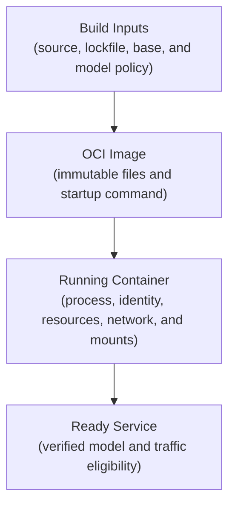
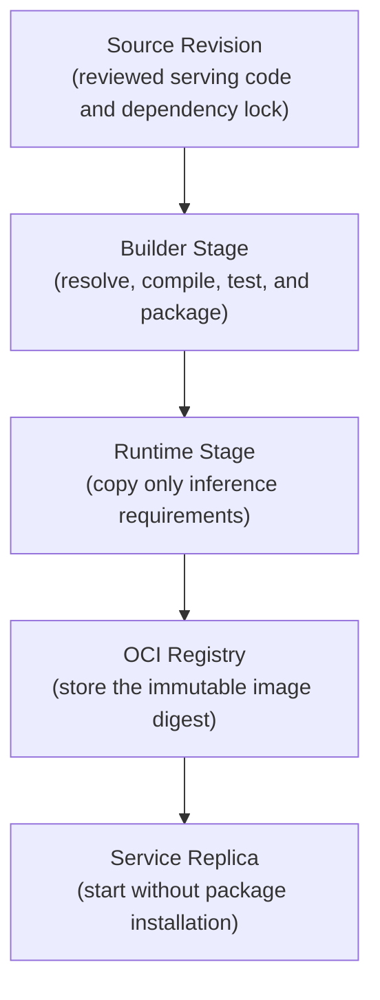
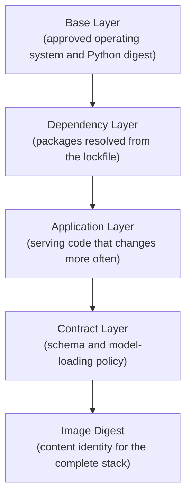
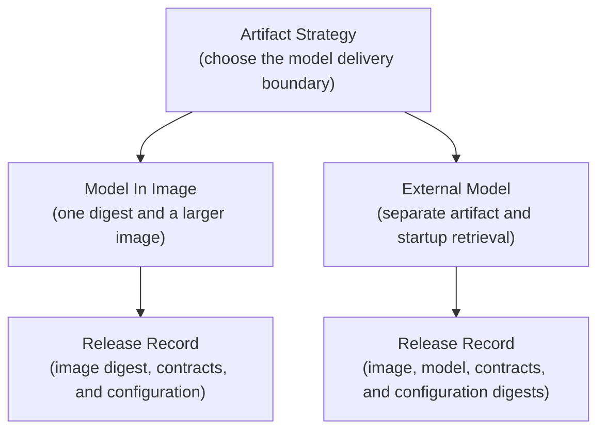
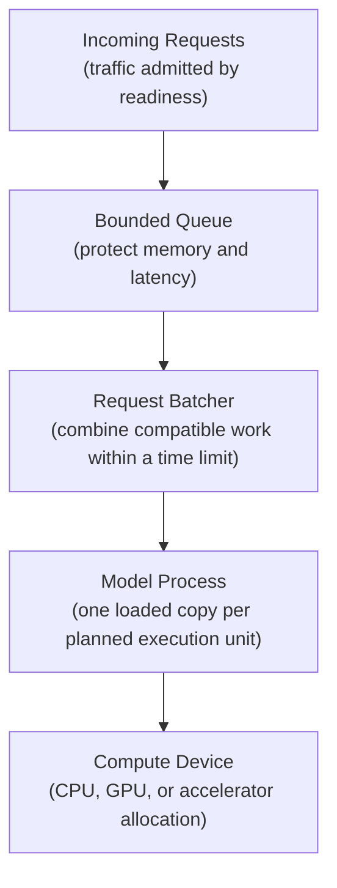
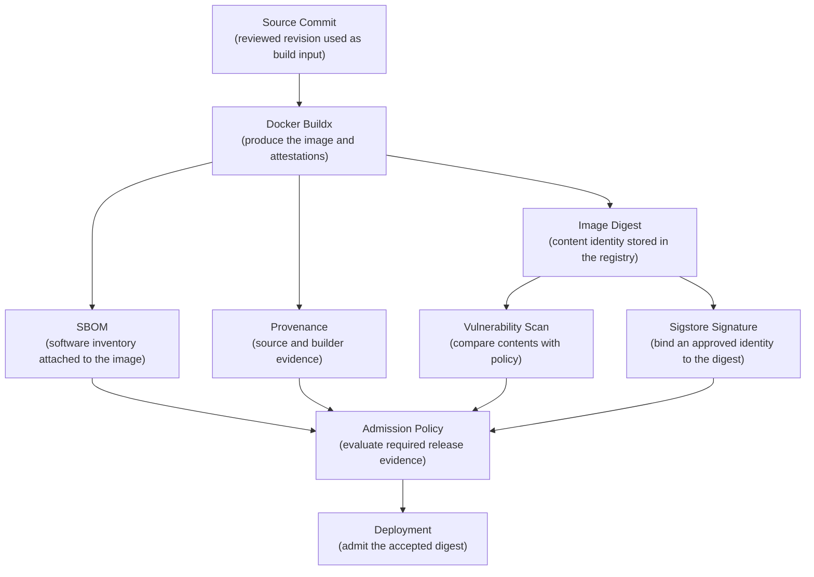
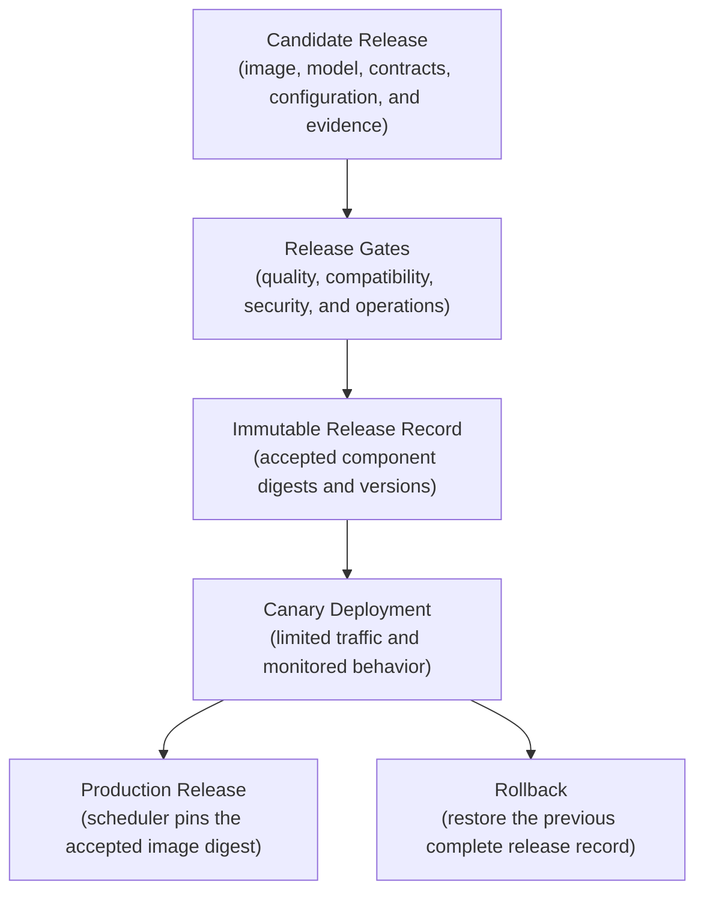

## Table of Contents

1. [What A Serving Image Solves](#what-a-serving-image-solves)
2. [Know What Happens During Image Build And Container Startup](#know-what-happens-during-image-build-and-container-startup)
3. [Build Reproducible And Cacheable Image Layers](#build-reproducible-and-cacheable-image-layers)
4. [Choose Where The Model Lives](#choose-where-the-model-lives)
5. [Choose Container Processes And Concurrency](#choose-container-processes-and-concurrency)
6. [Use Separate Startup, Readiness, And Liveness Checks](#use-separate-startup-readiness-and-liveness-checks)
7. [Limit Container Permissions And Resources](#limit-container-permissions-and-resources)
8. [Record How The Image Was Built](#record-how-the-image-was-built)
9. [Build A Small Production Image](#build-a-small-production-image)
10. [Smoke-Test The Built Image](#smoke-test-the-built-image)
11. [Deploy And Roll Back An Exact Image And Model](#deploy-and-roll-back-an-exact-image-and-model)
12. [Know Which Host Features Containers Do Not Bundle](#know-which-host-features-containers-do-not-bundle)
13. [Main Idea](#main-idea)
14. [References](#references)

## What A Serving Image Solves
<!-- section-summary: An image fixes the files and startup command for a model service, while the container runtime supplies the environment around each running process. -->

At a high level, a **container image** is a packaged filesystem with instructions for starting
an application. It can contain the Python runtime, native libraries, installed packages, serving
code, and sometimes the model itself. An **OCI image** follows the standard format created by
the Open Container Initiative, which allows registries and container platforms to exchange the
same package.

A **container** is a running instance of that image. The container runtime adds the parts that
vary between deployments: environment variables, workload identity, CPU and memory limits,
network access, mounted files, and writable temporary storage. One image can therefore start ten
containers, with each container running as a separate service replica.

This distinction solves a familiar production problem. A classifier may work in a notebook
because the laptop already has a native library, a cached tokenizer, and an old package
installed outside the project. A fresh production node has none of that hidden state. Packaging
the service in an image gives every node the same user-space files and the same startup command.


```mermaid
flowchart TD
    Inputs["Build Inputs<br/>(source, lockfile, base, and model policy)"] --> Image["OCI Image<br/>(immutable files and startup command)"]
    Image --> Container["Running Container<br/>(process, identity, resources, network, and mounts)"]
    Container --> Service["Ready Service<br/>(verified model and traffic eligibility)"]
```

The image has a clear boundary. It packages the serving process and its user-space files. The
host kernel and cloud permissions remain outside that package. Kubernetes resource policy, model
quality evidence, and tested hardware compatibility also remain separate production concerns.

The rest of the design follows that boundary. Build work produces one immutable image. Runtime
configuration starts a constrained container from it. A release record identifies the exact
image, model, contracts, and configuration that passed the release gates.

## Know What Happens During Image Build And Container Startup
<!-- section-summary: CI prepares dependencies and application artifacts during the build, while a production container starts without compiling code or installing packages. -->

**Build time** is the controlled preparation phase. CI resolves the locked dependencies and
compiles any native extensions. It can then build wheels, run tests, validate generated files,
and assemble the final filesystem. Temporary tools such as compilers are acceptable in a build
stage because users never run that stage in production.

**Runtime** begins after the platform starts the finished image. The serving process should load
its approved model, warm up, expose health endpoints, and accept traffic. It should not contact
a public package index, run `pip install`, compile extensions, or rewrite its own application
files.

Consider an autoscaling service that installs Python packages during startup. The first replica
might resolve one package version and the next replica might resolve another. A package outage
can also prevent new capacity from starting during a traffic spike. Moving dependency
installation into CI changes this failure mode: the registry either contains a tested image or
the release never begins.

A **multi-stage build** supports this separation. The builder stage includes packaging tools and
creates the application environment. The runtime stage copies only the finished environment and
the files required for inference.


```mermaid
flowchart TD
    Source["Source Revision<br/>(reviewed serving code and dependency lock)"] --> Builder["Builder Stage<br/>(resolve, compile, test, and package)"]
    Builder --> Runtime["Runtime Stage<br/>(copy only inference requirements)"]
    Runtime --> Registry["OCI Registry<br/>(store the immutable image digest)"]
    Registry --> Replica["Service Replica<br/>(start without package installation)"]
```

Private dependency credentials belong to BuildKit secret mounts or the CI platform's equivalent.
Docker build arguments and ordinary environment variables can appear in image history or
provenance, so they are unsuitable for secrets. Runtime credentials arrive later through
workload identity or a secret-management integration.

The final image also needs a maintenance path. Reproducibility keeps a release stable; regular
rebuilds bring in security fixes. Many teams use Renovate, Dependabot, Docker Scout, or an
internal base-image service to propose a reviewed digest update. The normal release pipeline
rebuilds and retests the image after that change.

## Build Reproducible And Cacheable Image Layers
<!-- section-summary: Image layers should rebuild predictably from pinned inputs, with stable dependency work placed before frequently changing application code. -->

An image is stored as a stack of **layers**. A Dockerfile instruction can add a layer containing
new or changed files. During a later build, BuildKit may reuse an existing layer if the
instruction and its inputs have stayed the same. A change invalidates that layer and every
dependent layer above it.

You can think of the cache as saved construction work. It should reduce build time without
deciding which dependencies enter the image. The dependency lock decides the versions; the cache
only avoids repeating an identical installation.

Layer order matters. Dependency metadata usually changes less often than application source.
Copy `pyproject.toml` and `uv.lock` first and install the locked dependencies. Copy the source
afterward. Editing one API function then rebuilds the small application layer instead of
downloading the full ML framework again.


```mermaid
flowchart TD
    Base["Base Layer<br/>(approved operating system and Python digest)"] --> Dependencies["Dependency Layer<br/>(packages resolved from the lockfile)"]
    Dependencies --> Application["Application Layer<br/>(serving code that changes more often)"]
    Application --> Contract["Contract Layer<br/>(schema and model-loading policy)"]
    Contract --> Image["Image Digest<br/>(content identity for the complete stack)"]
```

Reproducibility depends on four practical controls:

- Pin the base image by digest in the production build input. A tag such as `python:3.13-slim` is readable, but its publisher can move it to different bytes.
- Commit a dependency lock and use `uv sync --locked` or an equivalent lock-enforcing installer. A broad range such as `fastapi>=0.100` permits a future build to choose a different release.
- Keep the build context small with `.dockerignore`. Exclude local development state such as `.git`, virtual environments, notebooks, and caches. Training data and credentials should stay outside the build context. Include test outputs only if a deliberate build step consumes them.
- Control network inputs. Fetch packages and base images from approved registries or mirrors, and retain the resulting image digest and build provenance.

Aggressive caching cannot rescue unpinned inputs. A cached build may look stable for weeks, then
a clean runner produces different bytes. CI should occasionally perform a clean rebuild and
compare functional evidence, while the release record always stores the digest produced by the
accepted build.

## Choose Where The Model Lives
<!-- section-summary: A model can travel inside the image or arrive as an immutable external artifact, and each design creates a different release identity. -->

The serving process needs model files before it can make a prediction. There are two common ways
to supply them.

### Put The Model In The Image

A **model-in-image** release copies the model bundle into the image during CI. One image digest
identifies the assembled runtime and model. Replicas start without downloading the model.
Rollback restores one artifact, and local testing closely resembles production. The tradeoff is
size. A small code change can require pushing a multi-gigabyte image, and each model promotion
creates another image.

### Load An External Model

An **external-model** release keeps the runtime image and model artifact in separate stores. The
container downloads or mounts a versioned model at startup. This works well for large artifacts,
faster model promotion, or a shared inference runtime. It also introduces network access,
workload identity, local cache capacity, integrity checks, startup failure handling, and
compatibility between independently released parts.


```mermaid
flowchart TD
    Choice["Artifact Strategy<br/>(choose the model delivery boundary)"] --> Baked["Model In Image<br/>(one digest and a larger image)"]
    Choice --> External["External Model<br/>(separate artifact and startup retrieval)"]
    Baked --> BakedRelease["Release Record<br/>(image digest, contracts, and configuration)"]
    External --> ExternalRelease["Release Record<br/>(image, model, contracts, and configuration digests)"]
```

The external design requires an immutable model reference. Suppose a Deployment pins
`registry.example.com/risk-api@sha256:abc...` but sets
`MODEL_URI=s3://ml-production/risk-model/current/model.onnx`. One replica loaded the object
yesterday. A replacement replica starts today after `current` has been overwritten. Both
replicas run the same image and can return different predictions.

The repair has three parts. Store the model under a versioned object path. Record its digest in
the release. Verify the downloaded bytes before `/readyz` returns success. A simple release
record might contain:

```json
{
  "image": "registry.example.com/risk-api@sha256:<image-digest>",
  "model_uri": "s3://ml-production/risk-model/version=42/model.onnx",
  "model_sha256": "<model-digest>",
  "request_schema": "risk-request/v3",
  "feature_contract": "account-features/v7"
}
```

The angle-bracket values represent CI outputs, not mutable names. The deployment controller
receives the accepted record and renders the platform-specific configuration from it.

Multi-model serving adds a controlled repository and cache to the external pattern. It needs
explicit admission, eviction, memory isolation, and tenant policy. A generic download directory
with no capacity limit will eventually become an operational failure.

## Choose Container Processes And Concurrency
<!-- section-summary: The container process count, model copies, request concurrency, batching, and shutdown behavior must fit the model and its hardware. -->

A model-serving container is still a process-management problem. The platform needs one main
process to start predictably, report health, receive shutdown signals, and release resources. ML
adds a second concern: every process may load another copy of a large model.

### Handle Shutdown Signals Safely

The container's main process runs as PID 1. It must receive termination signals and stop
accepting new requests. It also needs to finish or cancel in-flight work inside the shutdown
budget, flush important telemetry, and exit. Docker's exec-form command preserves this signal
path:

```dockerfile
CMD ["/app/.venv/bin/uvicorn", "serving.api:app", "--host", "0.0.0.0", "--port", "8080"]
```

Shell form, such as `CMD uvicorn ...`, inserts a shell between the runtime and the server.
Signal forwarding then depends on the shell. An entrypoint script can still be appropriate. It
should validate configuration and finish with `exec "$@"` so the server replaces the shell.

### Count Model Copies Before Adding Workers

The worker count deserves special attention in ML serving. Many web servers start each worker as
a separate process, and each process imports the application and loads its own model. A
six-gigabyte GPU model served by four workers can request roughly twenty-four gigabytes for
model weights. Activations, framework memory, and request batches add further demand. The
container may pass a basic HTTP check and fail as soon as all workers finish loading.

GPU deployments commonly start with one model process per allocated GPU. Concurrency lives
inside that process through asynchronous request handling, a bounded queue, or dynamic batching.
Triton Inference Server, vLLM, KServe runtimes, Ray Serve, and application-specific servers
offer different batching and model-placement controls. CPU services may benefit from several
workers, but only measurements of memory, latency, throughput, and thread safety can set the
count.


```mermaid
flowchart TD
    Requests["Incoming Requests<br/>(traffic admitted by readiness)"] --> Queue["Bounded Queue<br/>(protect memory and latency)"]
    Queue --> Batcher["Request Batcher<br/>(combine compatible work within a time limit)"]
    Batcher --> Process["Model Process<br/>(one loaded copy per planned execution unit)"]
    Process --> Hardware["Compute Device<br/>(CPU, GPU, or accelerator allocation)"]
```

Horizontal replicas add another concurrency layer. The service should define where queuing
occurs and how overload is rejected. An unbounded application queue can hide saturation from an
autoscaler and turn a brief spike into minutes of stale requests. A bounded queue, explicit
timeout, and observable rejection counter give the platform a usable scaling signal.

## Use Separate Startup, Readiness, And Liveness Checks
<!-- section-summary: Startup protects model initialization, readiness controls traffic, and liveness requests a restart only for an unrecoverable local failure. -->

Kubernetes offers three probes because starting a process, accepting traffic, and recovering
from a stuck process are different operational decisions. Treating them as one generic health
check can send requests too early or restart healthy replicas during an upstream outage.

### Give Initialization Its Own Budget

The **startup probe** answers, “Has initialization completed?” Model download, checksum
verification, deserialization, accelerator compilation, and a warm-up prediction can take
several minutes. Kubernetes waits for the startup probe before it begins liveness and readiness
checks.

### Control Traffic With Readiness

The **readiness probe** answers, “Can this replica safely serve a request?” It returns success
after the expected model and contracts are loaded. It returns failure for an unloaded or corrupt
model and during a deliberate drain. Kubernetes then removes the Pod from the matching Service
endpoints without restarting the process.

Ordinary saturation needs a different response. A bounded queue and explicit `429` or `503` load
shedding protect latency while queue depth and rejection metrics drive autoscaling. If every
busy replica failed readiness together, Kubernetes could remove every endpoint and make the
incident worse.

### Reserve Liveness For Restartable Failure

The **liveness probe** answers, “Is this process stuck beyond recovery?” Failure asks Kubernetes
to restart the container. Keep this check local and inexpensive. A liveness endpoint that calls
a remote feature service can restart every healthy model replica during one upstream outage. The
restart wave increases load and can create a cascading failure.

```yaml
startupProbe:
  httpGet:
    path: /startupz
    port: 8080
  periodSeconds: 5
  failureThreshold: 60
  timeoutSeconds: 2
readinessProbe:
  httpGet:
    path: /readyz
    port: 8080
  periodSeconds: 5
  failureThreshold: 2
  timeoutSeconds: 2
livenessProbe:
  httpGet:
    path: /livez
    port: 8080
  periodSeconds: 10
  failureThreshold: 3
  timeoutSeconds: 2
```

This startup budget allows up to five minutes for initialization. The value should come from
measured cold-start distributions plus a deliberate margin. A service that usually loads in
forty seconds does not need a thirty-minute budget. Such a large allowance would delay recovery
from a permanently broken model URI.

Health responses should expose enough identity for operators to inspect the replica. `/readyz`
can report the loaded model version and digest. It can also report the contract version and
initialization state. Avoid running a full production prediction on every probe. Run an
expensive fixture during startup, save the result in process state, and keep the repeated
readiness request cheap.

## Limit Container Permissions And Resources
<!-- section-summary: A production container should run with a narrow identity, read-only application files, explicit writable paths, bounded resources, and runtime-delivered credentials. -->

The runtime should grant only what the serving process needs. Start with a non-root user and
prevent privilege escalation. Drop Linux capabilities, use the runtime's default seccomp
profile, and mount the root filesystem read-only. CPU and memory requests give the scheduler a
realistic placement signal. Limits prevent one replica from consuming the whole node. GPU
workloads request the platform's GPU resource instead of assuming a device is present.

### Set Container Identity, Filesystem, And Resources

The manifest below applies those controls to one Kubernetes container. Two bounded `emptyDir`
volumes supply the only writable paths, so a test can identify any unplanned write immediately.

```yaml
containers:
  - name: model-api
    image: registry.example.com/risk-api@sha256:<image-digest>
    securityContext:
      runAsNonRoot: true
      runAsUser: 10001
      allowPrivilegeEscalation: false
      readOnlyRootFilesystem: true
      capabilities:
        drop: ["ALL"]
      seccompProfile:
        type: RuntimeDefault
    resources:
      requests:
        cpu: "1"
        memory: 2Gi
      limits:
        cpu: "2"
        memory: 4Gi
    volumeMounts:
      - name: temporary-files
        mountPath: /tmp
      - name: model-cache
        mountPath: /var/cache/model
volumes:
  - name: temporary-files
    emptyDir:
      sizeLimit: 64Mi
  - name: model-cache
    emptyDir:
      sizeLimit: 8Gi
```

This manifest names every writable location. It also gives the model cache a capacity limit. For
an external model, the service verifies the digest after download and before changing readiness
to successful.

Read-only filesystems often uncover hidden assumptions. A tokenizer may try to create
`$HOME/.cache` during its first request. Pre-populate that cache during the image build if its
contents belong to the release. Otherwise, point the library at a narrowly mounted directory
such as `/var/cache/model`. Disabling the read-only policy would permit writes anywhere and hide
the dependency again.

Credentials stay outside the image. Cloud workload identity can grant read access to one model
prefix without distributing a long-lived access key. Environments that cannot use workload
identity can mount a short-lived secret from a managed secret store or a CSI driver. Dockerfile
instructions, copied `.env` files, and image labels are unsuitable secret locations.

Resource limits need load testing. A memory limit below model peak usage causes repeated
out-of-memory termination. A very large limit lets a bad batch or cache pressure neighboring
workloads. Measure cold load, steady traffic, peak batch size, and graceful shutdown, then set
requests and limits from those observations.

## Record How The Image Was Built
<!-- section-summary: The release pipeline should attach an SBOM and provenance, scan the image, sign its digest, and verify policy before deployment. -->

A production image contains code from many sources: a base operating system, Python packages,
native libraries, and the application's own build output. Supply-chain controls create evidence
about those inputs and the build that assembled them.

### Use Each Supply-Chain Record For One Purpose

An **SBOM**, or software bill of materials, lists the packages found in the image. A
**vulnerability scan** compares that inventory with advisory databases and the organization's
severity policy. **Build provenance** records how an artifact was produced and which source and
builder were involved. SLSA defines a common provenance model for tracing build outputs back to
their origin. A **signature** binds an approved signing identity to an immutable image digest.


```mermaid
flowchart TD
    Commit["Source Commit<br/>(reviewed revision used as build input)"] --> Build["Docker Buildx<br/>(produce the image and attestations)"]
    Build --> Image["Image Digest<br/>(content identity stored in the registry)"]
    Build --> Sbom["SBOM<br/>(software inventory attached to the image)"]
    Build --> Provenance["Provenance<br/>(source and builder evidence)"]
    Image --> Scan["Vulnerability Scan<br/>(compare contents with policy)"]
    Image --> Signature["Sigstore Signature<br/>(bind an approved identity to the digest)"]
    Sbom --> Policy["Admission Policy<br/>(evaluate required release evidence)"]
    Provenance --> Policy
    Scan --> Policy
    Signature --> Policy
    Policy --> Deployment["Deployment<br/>(admit the accepted digest)"]
```

### Generate Build Records And Verify The Image In CI

Docker Buildx can attach SBOM and provenance attestations as it pushes an image:

```bash
docker buildx build \
  --build-arg PYTHON_IMAGE="$PYTHON_IMAGE_BY_DIGEST" \
  --platform linux/amd64 \
  --sbom=true \
  --provenance=mode=max \
  --tag "$REGISTRY/model-api:$GIT_SHA" \
  --push .
```

Attestations need registry-compatible output. Loading only into Docker Engine's classic local
image store does not preserve them. After the registry returns the pushed digest, CI signs that
digest rather than the mutable tag. A Sigstore Cosign verification policy should check the
expected certificate identity and OIDC issuer:

```bash
cosign verify "$IMAGE_BY_DIGEST" \
  --certificate-identity "$RELEASE_WORKFLOW_IDENTITY" \
  --certificate-oidc-issuer "$OIDC_ISSUER"
```

These signals answer different questions. A valid signature proves that the configured identity
signed the referenced digest. It does not prove model quality or safe configuration. Admission
policy should combine supply-chain evidence with model evaluation, compatibility tests, security
rules, and release approval.

## Build A Small Production Image
<!-- section-summary: A focused multi-stage Dockerfile installs the locked Python environment in a builder and copies it into a non-root runtime image. -->

The following Dockerfile uses Python, `uv`, BuildKit cache mounts, and a two-stage design. CI
supplies `PYTHON_IMAGE` as an approved full reference such as `python:3.13-slim@sha256:...`.
Requiring that input prevents the production build from silently falling back to a mutable base
tag.

The builder installs the project into a virtual environment. The runtime copies that finished
environment and leaves the `uv` binary, package cache, and compilation tools behind. Both stages
use the same Python base, which keeps the copied environment compatible. The final command
starts one explicit serving process.

### Read The Dockerfile From Top To Bottom

```dockerfile
# syntax=docker/dockerfile:1
ARG PYTHON_IMAGE

FROM ${PYTHON_IMAGE} AS builder
COPY --from=ghcr.io/astral-sh/uv@sha256:2381d6aa60c326b71fd40023f921a0a3b8f91b14d5db6b90402e65a635053709 /uv /uvx /bin/
ENV UV_LINK_MODE=copy UV_COMPILE_BYTECODE=1
WORKDIR /app

COPY pyproject.toml uv.lock ./
RUN --mount=type=cache,target=/root/.cache/uv \
    uv sync --locked --no-dev --no-install-project

COPY src/ src/
RUN --mount=type=cache,target=/root/.cache/uv \
    uv sync --locked --no-dev --no-editable

FROM ${PYTHON_IMAGE} AS runtime
ENV PATH="/app/.venv/bin:$PATH" \
    PYTHONUNBUFFERED=1 \
    PYTHONDONTWRITEBYTECODE=1 \
    HOME=/home/app \
    MODEL_CACHE_DIR=/var/cache/model

RUN groupadd --gid 10001 app \
    && useradd --uid 10001 --gid 10001 --create-home app \
    && mkdir --parents /var/cache/model \
    && chown app:app /var/cache/model

WORKDIR /app
COPY --from=builder --chown=app:app /app/.venv /app/.venv
COPY --chown=app:app model-contract.json ./

USER 10001:10001
EXPOSE 8080
CMD ["/app/.venv/bin/uvicorn", "serving.api:app", "--host", "0.0.0.0", "--port", "8080"]
```

The `uv` binary comes from its official distroless image and is pinned by digest. It remains in
the builder. The runtime receives the finished non-editable virtual environment, the model
contract, and a numeric non-root user. The application package is already installed in the
virtual environment, so a source bind mount is unnecessary.

This example expects an external model. A model-in-image variant would verify and copy the
approved model bundle during the build. Its digest would also appear in image metadata and the
release record. Native operating-system libraries belong in the stage that needs them. Compilers
remain in the builder unless the inference runtime genuinely invokes them after startup.

The Dockerfile is one part of the build. `.dockerignore`, the committed lockfile, the approved
base digest, CI policy, and the model contract are also build inputs. Review them together.

## Smoke-Test The Built Image
<!-- section-summary: CI should start the exact image under production-like restrictions and verify readiness, release identity, prediction behavior, and graceful shutdown. -->

Unit tests can call Python functions directly. They cannot reveal a missing shared library, an
incorrect `CMD`, a root-only directory, or a hidden cache write. A **container smoke test**
starts the built image and uses its public HTTP interface.

This focused test supplies a read-only model fixture and locks the root filesystem. It applies
resource limits and waits for readiness. The last checks confirm the loaded identity, one
representative prediction, the runtime user, and graceful shutdown:

```bash
set -euo pipefail

IMAGE="model-api:test-$GIT_SHA"
NAME="model-api-smoke-$GIT_SHA"

docker build \
  --build-arg PYTHON_IMAGE="$PYTHON_IMAGE_BY_DIGEST" \
  --tag "$IMAGE" .

docker run --detach --name "$NAME" \
  --read-only --tmpfs /tmp:rw,noexec,nosuid,size=64m \
  --mount "type=bind,src=$PWD/tests/model,dst=/models/model,readonly" \
  --env MODEL_URI=file:///models/model \
  --env MODEL_SHA256="$TEST_MODEL_SHA256" \
  --memory 4g --cpus 2 --publish 18080:8080 "$IMAGE"
trap 'docker rm --force "$NAME" >/dev/null 2>&1 || true' EXIT

for attempt in $(seq 1 60); do
  curl --fail --silent http://127.0.0.1:18080/readyz >/dev/null && break
  test "$attempt" -lt 60
  sleep 1
done

curl --fail --silent http://127.0.0.1:18080/version \
  | jq --exit-status --arg digest "$TEST_MODEL_SHA256" '.model_sha256 == $digest'
curl --fail --silent --json @tests/request.json \
  http://127.0.0.1:18080/v1/predictions \
  | jq --exit-status '.prediction != null'
test "$(docker exec "$NAME" id -u)" = "10001"
docker stop --time 20 "$NAME"
```

The same suite should start a second container with an incorrect model digest. That replica must
remain unready and must refuse prediction traffic. CI should also assert that shutdown finishes
inside the termination budget and that the logs do not contain known secret fixtures.

Run performance tests separately on the intended hardware. Measure cold-start time, peak memory
during model load, steady memory per worker, latency percentiles, throughput, queue depth, and
overload behavior. A laptop smoke test proves packaging behavior; it cannot qualify a GPU image
for a production driver and accelerator combination.

The release pipeline builds once and promotes the same registry digest through environments.
Rebuilding from the same commit for production creates a new artifact. Base and dependency
resolution may have changed, so the staging evidence no longer describes the deployed bytes.

## Deploy And Roll Back An Exact Image And Model
<!-- section-summary: Deployment should pin the accepted image digest and every separately released model or contract so rollback can restore the exact proven combination. -->

A registry tag is a convenient human label. A digest is the content identity used by the
scheduler. Production manifests should therefore reference `registry/repository@sha256:...`. OCI
descriptors use the digest to identify and verify exact content.

For a model-in-image release, the image digest covers the runtime and model bytes. The release
record still identifies the request and response schemas. It also records the feature contract,
configuration revision, and evaluation evidence. Those items describe the behavior expected
around the image.

For an external-model release, rollback must restore the whole accepted combination. That
combination includes the image digest, model URI and digest, preprocessing or tokenizer
artifact, feature contract, and relevant configuration. Restoring only the model can pair an old
artifact with a runtime that no longer understands it. Restoring only the image can leave a new
model behind a mutable external reference.


```mermaid
flowchart TD
    Candidate["Candidate Release<br/>(image, model, contracts, configuration, and evidence)"] --> Gates["Release Gates<br/>(quality, compatibility, security, and operations)"]
    Gates --> Record["Immutable Release Record<br/>(accepted component digests and versions)"]
    Record --> Canary["Canary Deployment<br/>(limited traffic and monitored behavior)"]
    Canary --> Champion["Production Release<br/>(scheduler pins the accepted image digest)"]
    Canary --> Rollback["Rollback<br/>(restore the previous complete release record)"]
```

A canary receives a small traffic share or uses a small replica set. Service health, prediction
behavior, and business guardrails determine promotion. Keep the previous release record and its
registry/model artifacts available for the defined rollback window. A rollback drill should
prove that the platform can still pull the old image and retrieve the old model. It must also
satisfy current data contracts and reach readiness inside the recovery target.

The running service should emit its release identity in structured logs, traces, and a version
endpoint. During an incident, operators can then compare replicas and confirm whether mixed
image or model versions are serving traffic.

## Know Which Host Features Containers Do Not Bundle
<!-- section-summary: An image standardizes user-space files, while architecture, kernel, accelerator drivers, runtime policy, and external services still require explicit compatibility tests. -->

Container portability has limits. Linux containers share the host kernel. A CUDA runtime inside
the image still depends on a compatible host GPU driver and device plugin. CPU architecture
matters, and a native Python wheel built for `linux/amd64` will not run on an `arm64` node.

OCI image indexes can point one image name to separate platform-specific manifests.
Multi-platform publication solves distribution for supported architectures; it does not prove
that each variant produces acceptable predictions or performance. Build and test each target on
representative hardware.

Runtime policy also sits outside the image. A service may fail under a read-only filesystem,
restricted network egress, a service mesh, a small shared-memory mount, or a different
certificate authority. These are deployment contracts rather than reasons to expand the image's
privileges.

Keep a tested compatibility record for every supported combination. Record the image and model
digests first. Add the CPU architecture or accelerator type, its driver and runtime family, the
inference server, and important platform constraints. Production scheduling should select from
that approved set.

## Main Idea
<!-- section-summary: A production image turns a model-serving program into a repeatable process, while the release record and platform configuration complete the operational contract. -->

A production container image gives every model-serving replica the same filesystem and startup
command. Reaching that result requires more than placing code in a Dockerfile.

CI separates build work from runtime and locks dependency inputs. It arranges cacheable layers
and chooses a deliberate model-delivery strategy. The build records the resulting digest.

The serving design accounts for model copies and batching. It also defines signals,
initialization, traffic readiness, and unrecoverable failure. The runtime applies a non-root
identity and read-only application files. Narrow writable mounts and measured resource limits
cover legitimate operating needs.

The release pipeline adds several forms of evidence. An SBOM and vulnerability result describe
image contents. Provenance and a signature identify the build and signer. CI then tests the
image through its real interface.

Production deploys the accepted digest and binds it to the exact model, contracts,
configuration, and evaluation evidence. That complete identity gives operators something precise
to inspect, promote, and restore.

## References

- [Open Container Initiative](https://opencontainers.org/)
- [OCI Image Format Specification](https://github.com/opencontainers/image-spec)
- [Docker multi-stage builds](https://docs.docker.com/build/building/multi-stage/)
- [Docker build cache optimization](https://docs.docker.com/build/cache/optimize/)
- [Docker build secrets](https://docs.docker.com/build/building/secrets/)
- [Docker building best practices](https://docs.docker.com/build/building/best-practices/)
- [Docker build attestations](https://docs.docker.com/build/metadata/attestations/)
- [Using uv in Docker](https://docs.astral.sh/uv/guides/integration/docker/)
- [Kubernetes liveness, readiness, and startup probes](https://kubernetes.io/docs/concepts/workloads/pods/probes/)
- [Kubernetes security contexts](https://kubernetes.io/docs/tasks/configure-pod-container/security-context/)
- [SLSA provenance](https://slsa.dev/spec/v1.2/provenance)
- [Sigstore container signing](https://docs.sigstore.dev/cosign/signing/signing_with_containers/)
- [Sigstore signature verification](https://docs.sigstore.dev/cosign/verifying/verify/)
