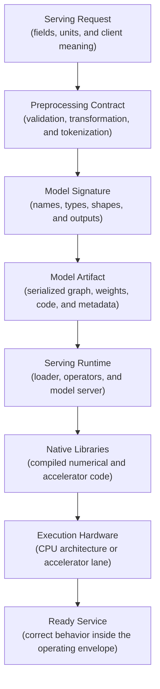
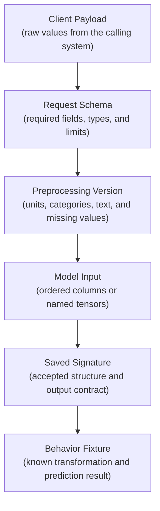
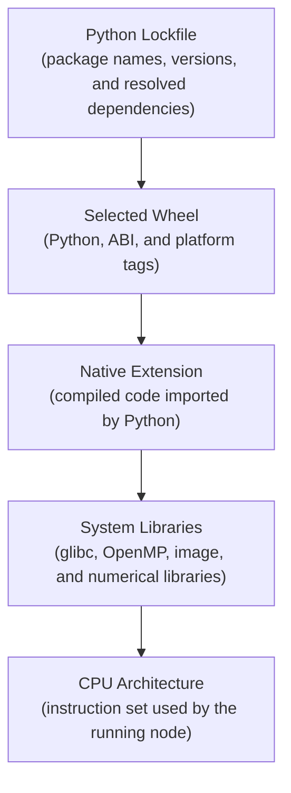
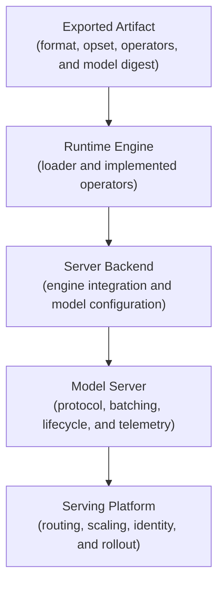
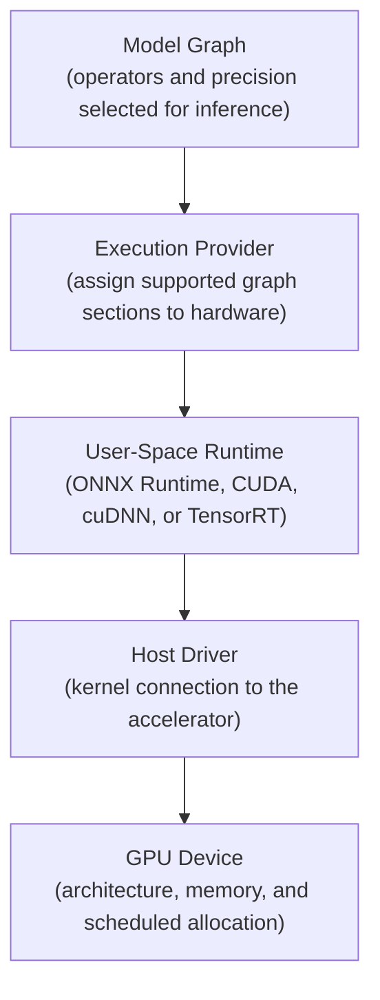
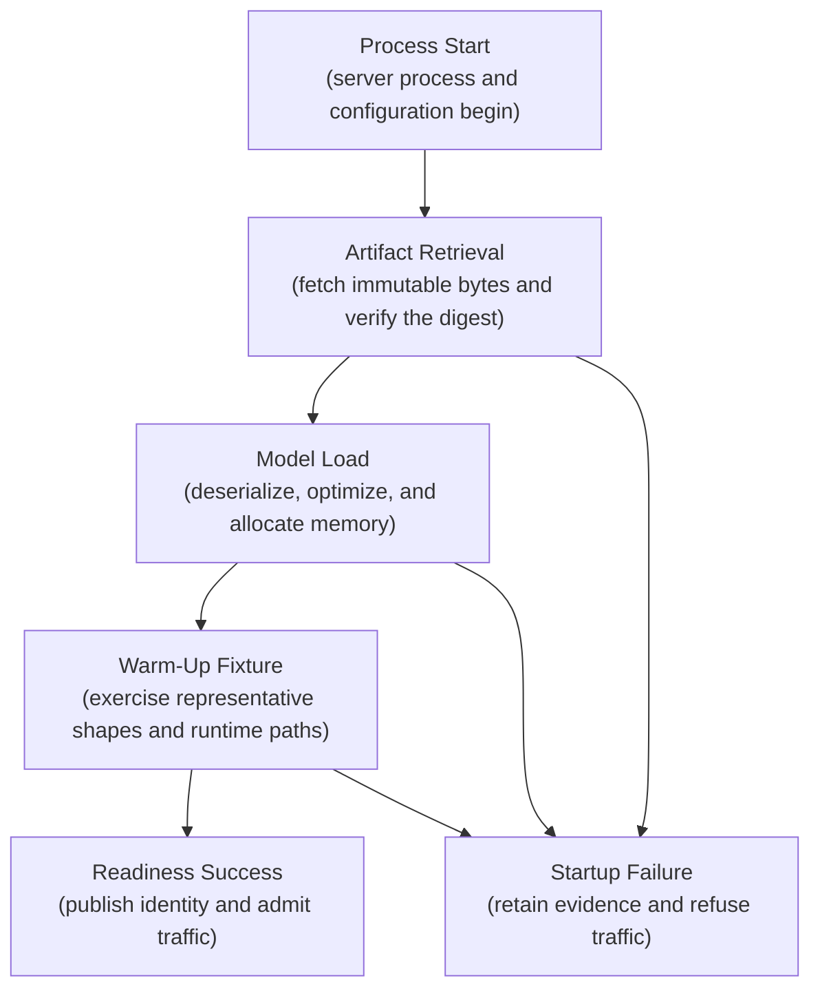
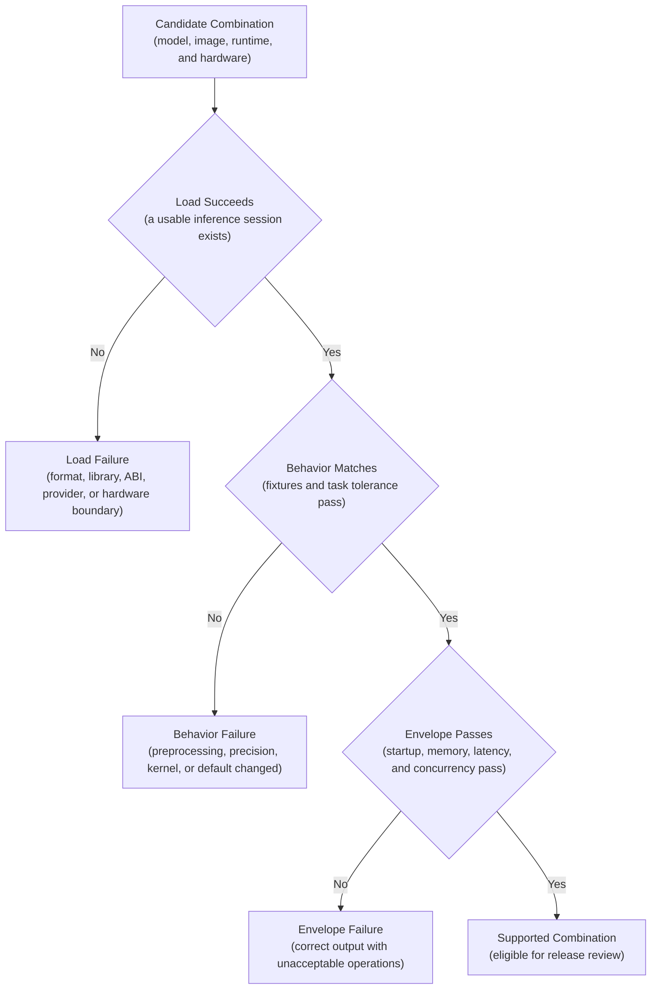
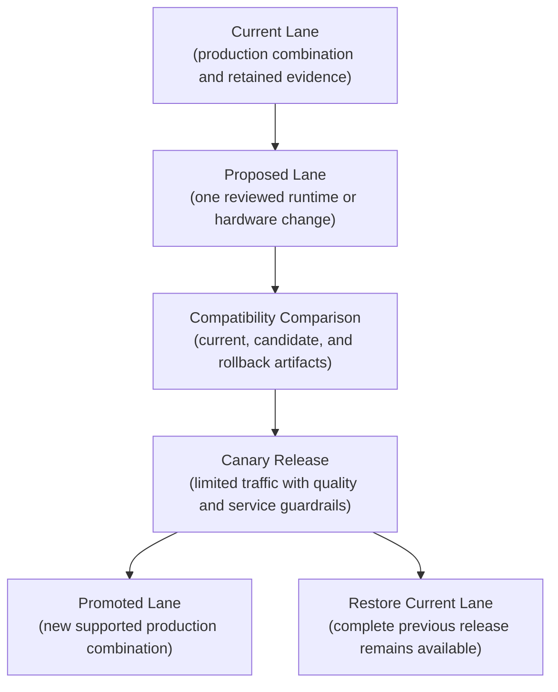

## Table of Contents

1. [What Runtime Compatibility Means](#what-runtime-compatibility-means)
2. [Define The Request And Model Contracts First](#define-the-request-and-model-contracts-first)
3. [Choose How The Model Is Serialized And Loaded](#choose-how-the-model-is-serialized-and-loaded)
4. [Track Python Packages And Native Libraries Together](#track-python-packages-and-native-libraries-together)
5. [Match The Model Format To A Supported Runtime](#match-the-model-format-to-a-supported-runtime)
6. [Check Every Layer From The Model Runtime To The Hardware](#check-every-layer-from-the-model-runtime-to-the-hardware)
7. [Test Loading, Warm-Up, And Readiness](#test-loading-warm-up-and-readiness)
8. [The Three Ways Runtime Compatibility Fails](#the-three-ways-runtime-compatibility-fails)
9. [Keep Supported Model And Runtime Combinations Small](#keep-supported-model-and-runtime-combinations-small)
10. [Test Upgrades As New Supported Combinations](#test-upgrades-as-new-supported-combinations)
11. [Record The Exact Model, Runtime, And Hardware Release](#record-the-exact-model-runtime-and-hardware-release)
12. [Find The First Incompatible Layer](#find-the-first-incompatible-layer)
13. [Main Idea](#main-idea)
14. [References](#references)

## What Runtime Compatibility Means
<!-- section-summary: Runtime compatibility means that a specific model release preserves its intended behavior and operating envelope throughout the real serving path. -->

A model file can open successfully while a changed preprocessing library produces different inputs or an unsupported hardware kernel changes execution. **Runtime compatibility** means that an approved model works as intended in the environment that serves it.
Opening the model file proves only the artifact-to-loader boundary.
The service must accept the right request, reproduce the reviewed preprocessing, and execute the model on supported software and hardware.
It must also return an acceptable result and meet its startup, memory, and latency limits.

This is why compatibility bugs can be deceptive.
A model may fail loudly because a native library is missing.
It may also load cleanly while a new tokenizer changes every input token.
An ONNX model may return correct predictions through the CPU even though the release expected GPU latency.
Every case has a different repair.

You can think of compatibility as a chain of agreements. Each boundary translates one representation into the next:


*A model is compatible only when every translation boundary preserves meaning and the complete service still meets its output, startup, memory, latency, and concurrency targets.*



An **operating envelope** is the range of conditions the release has proved it can handle.
It includes model-load time, peak memory, concurrency, latency, throughput, and failure behavior.
A prediction can be numerically correct and still be incompatible with production if one request takes four seconds instead of the accepted two hundred milliseconds.

Compatibility work therefore produces three things. First, the team defines each boundary. Second, CI tests a small set of supported combinations. Third, an immutable release record captures the exact combination that passed.

## Define The Request And Model Contracts First
<!-- section-summary: Request validation, preprocessing, and the model signature must agree on both data structure and the real-world meaning of every value. -->

The compatibility chain starts with the request the service accepts and the prediction interface the model expects. These two contracts establish names, types, shapes, units, missing-value rules, and output meaning before a runtime opens the model file.
A client sends a JSON object, event, or batch row.
**Preprocessing** turns that input into the dataframe or tensors consumed by the model.
A **model signature** describes the expected input and output names, data types, and shapes.
Some signature systems also describe inference parameters and optional fields.

### Check Data Shape And Meaning Separately

Structural compatibility asks whether the values fit the declared interface. A tensor may need the shape `[-1, 512]` and the type `int64`. MLflow model signatures can validate required fields and supported type conversions. They can also describe tensor shapes, outputs, and inference parameters for supported model workflows.

Semantic compatibility asks whether those values still mean the same thing. A floating-point field can contain dollars during training and cents in production. Two tokenizers can both return an `int64` tensor of shape `[1, 512]` while assigning different IDs to the same sentence. A timestamp can retain its data type while changing from UTC to local time.



### Keep A Real Serving Example

MLflow can save an input example and infer or store a signature alongside a model. The input example gives developers a concrete valid payload, while the signature gives the serving layer a machine-readable schema:

```python
import mlflow
from mlflow.models import infer_signature

serving_rows = validation_rows[["account_age_days", "amount_usd", "country_code"]]
serving_outputs = model.predict_proba(serving_rows)
signature = infer_signature(serving_rows, serving_outputs)

with mlflow.start_run():
    mlflow.sklearn.log_model(
        sk_model=model,
        name="model",
        signature=signature,
        input_example=serving_rows.iloc[:2],
    )
```

That code records structure. A separate fixture should preserve meaning. For example, the fixture can state that `amount_usd: 125.50` reaches preprocessing as `125.50`, an absent country follows the reviewed missing-value rule, and one known text sample produces an approved token sequence. The test should also compare the model result with a saved expectation or tolerance.

Boundary cases deserve their own fixtures. Include missing values, new categories, maximum input sizes, older supported client payloads, and values close to important decision thresholds. The endpoint versioning policy then determines whether an incompatible client receives a clear rejection or routes to a retained contract version.

## Choose How The Model Is Serialized And Loaded
<!-- section-summary: The artifact format decides which weights, graph operations, Python code, metadata, and library assumptions cross from training into serving. -->

**Serialization** converts a trained model and its supporting state into files that another process can load. Different formats carry different kinds of state.

A weights-only artifact usually needs application code to reconstruct the model. A portable graph such as ONNX stores operators and tensors for a compatible runtime. A Python-object format may store class references or executable behavior and depend closely on Python packages. A TensorRT engine contains hardware-oriented compiled work and has narrower platform constraints than a general graph.

The format choice creates a compatibility consequence. A Python object may depend on the same module path and library behavior used during training. An ONNX export depends on the chosen opset, supported operators, exporter behavior, and the target ONNX Runtime version. A TensorRT plan can depend on GPU compute capability and the TensorRT build environment.

Serialization also creates a trust boundary. Some formats can execute code during loading. Production should load artifacts only from a controlled, immutable store with restricted writers and verified digests. This control protects the loading process; it does not prove that the loaded model behaves correctly.

The release artifact should carry or reference the pieces needed to interpret it:

- The model file and its cryptographic digest identify the exact bytes.
- The signature and input example describe the public model interface.
- Preprocessing, tokenizer, label map, and postprocessing versions preserve meaning around the model.
- Exporter, framework, and format metadata identify important loading assumptions.
- A small behavior fixture proves that the target runtime can reproduce an accepted result.

If any of those pieces changes, the compatibility result needs a new evaluation. Reusing a model version label after replacing its tokenizer hides a behavioral change behind a stable name.

## Track Python Packages And Native Libraries Together
<!-- section-summary: A Python dependency lock identifies package versions, while wheels, native libraries, ABIs, and CPU architecture determine whether compiled code can run. -->

Python makes model code look portable because the import statement stays the same across machines. The imported package may still depend on compiled code, operating-system libraries, CPU instructions, or accelerator libraries that differ across hosts.
Many ML packages contain compiled code underneath that Python interface.
NumPy, PyTorch, ONNX Runtime, tokenizers, and image libraries commonly load native binaries.

### Understand What Wheel Platform Tags Mean

A **wheel** is a built Python package, usually a file ending in `.whl`. Pure-Python wheels can work across many systems. Wheels with compiled extensions contain platform-specific binaries. Their filenames carry compatibility tags for the Python implementation, the **ABI**, and the platform.

An **ABI**, or application binary interface, is the low-level agreement that compiled components use to call each other.
It covers details such as symbol names, binary data layout, and calling conventions.
Two libraries can expose similar source-level APIs and still fail at runtime because their compiled ABIs do not match.

A **native library** is compiled operating-system code, often loaded from a `.so` file on Linux or a `.dll` file on Windows.
A Python wheel may depend on further native libraries such as glibc, OpenMP, CUDA, or cuDNN.
The package manager can install the wheel successfully while the dynamic loader later fails to find one of those dependencies.



### Why A Locked Environment Can Fail On Another Machine

Suppose two images use the same Python lock. The first image targets `linux/amd64`; the second targets `linux/arm64`. An installer selects a wheel compatible with each platform, so the downloaded files can differ even though the package names and versions match. A package may also lack an ARM wheel and fall back to a source build or fail installation.

Copying an `x86_64` virtual environment directly into an ARM image is more direct evidence of the problem. Python source remains readable, but a compiled extension cannot execute on the wrong architecture. The import fails before the model loader has a chance to inspect the artifact.

The production identity therefore includes the built image digest and target platform. Store dependency locks for reproducibility, record wheel hashes where the build system supports them, and build each architecture deliberately. CI should run imports and model fixtures inside the final image on the intended architecture.

Training and serving can still use different environments. An exported graph may create a deliberate boundary between a large training image and a smaller inference runtime. The exporter-to-runtime pair needs comparison tests; copying the training environment does not provide stronger evidence by itself.

## Match The Model Format To A Supported Runtime
<!-- section-summary: The exported format, operator set, runtime engine, model server, repository layout, and protocol must form a documented supported pair. -->

A **runtime engine** loads a model representation and executes its operations. ONNX Runtime is one engine for ONNX graphs. TensorRT executes optimized NVIDIA inference engines. Framework libraries can execute their own native formats.

A **model server** is the long-running process around an engine. It exposes HTTP or gRPC APIs, manages model loading, applies batching and concurrency rules, reports health, and exports telemetry. A FastAPI application can serve as a custom Python model server. NVIDIA Triton is a specialized server with multiple backends. KServe is a Kubernetes serving layer that selects configured runtimes for supported model formats or custom containers.

### Match Format, Operators, And Engine

An ONNX file carries an opset version and a graph of operators. The selected ONNX Runtime release must support that opset and every required operator type. A custom operator adds another binary and version boundary. Successful export only proves that the exporter created a file; target-runtime tests prove that the selected engine can execute it.

Triton adds its own contract. Its model repository uses model directories, numeric version directories, model files, and configuration understood by the chosen backend. Triton's ONNX backend ultimately supports the ONNX models handled by the ONNX Runtime version shipped in that Triton release. A valid ONNX file in the wrong repository layout remains undeployable.



### Publish Supported Pairs

The platform should publish a few supported pairs rather than advertise every installable combination. One lane might use an MLflow PyFunc model in a Python image. Another might use ONNX with a pinned ONNX Runtime image. A GPU lane might use Triton with its shipped ONNX or TensorRT backend. KServe's `ServingRuntime` and `ClusterServingRuntime` resources can express which model formats and versions a runtime claims to support, but the platform team still owns validation on its cluster and hardware.

TorchServe can still appear in existing PyTorch estates. Its official documentation marks the project as **Limited Maintenance** and states that planned updates, bug fixes, features, and security patches are unavailable. That status makes TorchServe a legacy lane requiring an explicit migration or containment decision rather than a default for new production services.

Server features can alter behavior and performance. Dynamic batching changes request grouping. Quantization changes precision. Concurrent Python preprocessing can expose thread-safety bugs. Compatibility evidence should test the configured server path instead of calling the engine directly and assuming the results transfer.

## Check Every Layer From The Model Runtime To The Hardware
<!-- section-summary: Accelerator compatibility depends on the runtime engine, execution provider, user-space libraries, host driver, device exposure, and physical hardware. -->

CPU serving still has hardware boundaries: architecture, instruction-set support, available memory, and native numerical libraries. GPU serving adds several more layers.

An **execution provider** is ONNX Runtime's adapter for a hardware-specific backend. The CUDA Execution Provider assigns supported graph sections to NVIDIA CUDA. ONNX Runtime can keep its CPU provider as a fallback for graph sections that the higher-priority provider cannot execute.

The container normally carries user-space libraries such as the CUDA runtime and cuDNN. The host supplies the kernel-level NVIDIA driver and exposes the device to the container. Kubernetes device plugins and scheduling policy decide which Pod receives which GPU. NVIDIA publishes CUDA compatibility rules because toolkit, driver, feature, and GPU support have real constraints.



### Detect An Unexpected CPU Path

An ONNX request can succeed even if the release is using more CPU than expected. The default CPU provider may execute unsupported graph sections. An image containing only the CPU ONNX Runtime package can also return valid predictions while completely missing the intended CUDA path. Service health stays green, but latency and CPU saturation move outside the approved GPU envelope.

The service should assert its required provider during startup and expose the active provider order in readiness metadata:

```python
import onnxruntime as ort

required_provider = "CUDAExecutionProvider"
available_providers = ort.get_available_providers()
if required_provider not in available_providers:
    raise RuntimeError(
        f"{required_provider} is unavailable; found {available_providers}"
    )

session = ort.InferenceSession(
    "model.onnx",
    providers=[required_provider, "CPUExecutionProvider"],
)
assert session.get_providers()[0] == required_provider
```

This check confirms that the CUDA provider registered and has first priority. It does not prove that every graph node runs on CUDA. ONNX Runtime partitions the graph according to provider capability. Profiling, representative latency tests, GPU-utilization evidence, and CPU-usage limits reveal unexpected fallback or expensive device transfers.

Kubernetes scheduling success supplies equally limited evidence. A Pod can receive a GPU resource and still fail CUDA initialization because the image libraries require a newer driver feature. Startup evidence should report the detected device and driver. It should also record runtime libraries, provider order, model precision, and initial memory allocation before traffic begins.

## Test Loading, Warm-Up, And Readiness
<!-- section-summary: Compatibility includes retrieving the exact artifact, loading it within resource limits, warming runtime-specific paths, and declaring readiness only after a fixture succeeds. -->

The process can start long before the model is usable. External artifacts need storage access, enough disk space, a verified digest, and a bounded retry policy. Deserialization or graph optimization then consumes CPU and memory. GPU runtimes may allocate device memory or compile kernels during the first requests.

**Warm-up** sends representative inputs through the newly loaded model before ordinary traffic. It can initialize lazy code paths, compile kernels, populate caches, and expose unsupported shapes. Warm-up also provides a convenient point to compare one known result with the accepted tolerance.

Readiness should remain unsuccessful until the exact model and its supporting contracts have loaded, the warm-up fixture has passed, and required local runtime conditions are healthy. The readiness response should identify the model digest, image digest, contract or tokenizer version, runtime, execution provider, and load time.



Memory measurements must include load and warm-up peaks, not only idle state. A model can fit after initialization yet exceed the container limit while the runtime optimizes its graph. Concurrency tests matter too, because activations and request buffers can multiply after readiness.

A live reload needs a transactional design. Load and test the candidate beside the current model, then switch the route or pointer after success. A failed candidate should leave the current model available. Replacing the only in-memory model before validation can turn one bad artifact into an outage.

## The Three Ways Runtime Compatibility Fails
<!-- section-summary: Compatibility tests must distinguish loading failure, behavioral drift, and operating-envelope failure because each class needs different evidence and repair. -->

The phrase “incompatible model” hides three separate outcomes. Each outcome points toward a different boundary, requires different evidence, and leads to a different repair. Naming the outcome helps the team choose the next investigation.


*Load failure, behavioral drift, and operating-envelope failure can look similar from outside the service, but each one sends the investigation to a different part of the compatibility chain.*

### The Model Cannot Load

The service fails before a usable inference session exists. Common causes include an unsupported artifact format, missing operator, incompatible pickle dependency, absent native library, wrong CPU architecture, unavailable execution provider, or unsupported driver/runtime pair. Import checks and model-load tests find much of this class.

### The Model Loads But Behavior Changes

The service produces responses, but they differ from the accepted result beyond policy. A changed tokenizer, categorical mapping, timezone rule, precision mode, numerical kernel, or postprocessing default can cause this failure. Schema validation often passes because the tensor names and shapes remain valid.

Consider a tokenizer upgrade that still returns `int64` tensors of shape `[1, 512]`. The signature accepts the result. Different token IDs then shift the model output. A semantic preprocessing fixture and end-to-end prediction comparison catch the change.

### The Model Works Outside The Operating Envelope

Predictions remain acceptable, but production constraints fail. The release may consume too much memory, warm up too slowly, miss latency targets, or collapse under two concurrent requests. The unexpected ONNX CPU path belongs here if output quality remains stable and latency does not.



One import test covers only a narrow part of the first branch. A complete compatibility suite needs load evidence, semantic and numerical fixtures, and resource measurements.

## Keep Supported Model And Runtime Combinations Small
<!-- section-summary: A support matrix publishes the few model, image, runtime, and hardware combinations the platform promises to test, operate, upgrade, and roll back. -->

A **support matrix** is the platform's list of proven compatibility lanes. A lane binds an artifact format to a serving image, runtime engine or server, hardware class, request contract, and test suite. It represents an operational promise, not a list of combinations that might install.

Testing every Python, framework, model, server, GPU, and driver version creates a combinatorial grid. The cost soon exceeds the value, and users still lack a clear support promise. A practical platform may maintain a current CPU lane, a current GPU lane, and one retained rollback lane. Experimental combinations run outside the production promise until an owner qualifies them.

```yaml
lanes:
  - id: cpu-current
    artifact_format: onnx-opset-21
    image: registry.example.com/document-api@sha256:<cpu-image-digest>
    architecture: linux-amd64-avx2
    providers: [CPUExecutionProvider]
  - id: gpu-l4-current
    artifact_format: onnx-opset-21
    image: registry.example.com/document-api-cuda@sha256:<gpu-image-digest>
    accelerator: nvidia-l4
    providers: [CUDAExecutionProvider, CPUExecutionProvider]
  - id: cpu-rollback
    artifact_format: onnx-opset-21
    image: registry.example.com/document-api@sha256:<previous-image-digest>
    architecture: linux-amd64-avx2
    providers: [CPUExecutionProvider]
```

The placeholders are outputs from the image build and registry, not mutable deployment values. Each lane also references the exact runtime version, platform driver family, fixture suite, performance thresholds, owner, and planned retirement window in the release system.

The rollback lane deserves an independent test. A prior model can fail in a new image after a library, tokenizer, or operator change. A green current-model test says nothing about that previous artifact. Either retain the complete prior image and model release or prove that the previous model still works in the new image before describing it as a rollback target.

## Test Upgrades As New Supported Combinations
<!-- section-summary: Runtime, dependency, and hardware upgrades should enter as parallel lanes, pass old and new artifact tests, receive canary traffic, and retain an exercised rollback path. -->

An upgrade changes a compatibility boundary even if the model stays fixed. Examples include a new Python minor version, ONNX Runtime release, CUDA user-space runtime, Triton image, GPU type, or base operating system. Treat the proposal as a new lane rather than editing the existing lane in place.

Start by running the current production model in both lanes. Compare request fixtures, preprocessed tensors, predictions, provider evidence, startup time, memory, latency, and concurrency behavior. Then test the candidate model and the retained rollback artifact in the new lane. This separates a runtime regression from a model regression.



Canary evidence adds live request mix, real data shapes, resource pressure, and platform integration to CI results. It should not replace offline fixtures because production labels may arrive late and some semantic errors remain rare. Promotion needs both forms of evidence.

Keep the old lane until rollback has been exercised under the current platform. Removing it is a separate lifecycle decision with an owner and a date. Otherwise, a nominal rollback may point to an image that the registry retained but the current nodes can no longer run.

## Record The Exact Model, Runtime, And Hardware Release
<!-- section-summary: The immutable release record binds the exact model, contracts, software, runtime, hardware lane, evidence, and rollback target that passed together. -->

The support matrix says which kinds of combinations the platform accepts. A **release record** identifies the exact combination approved for one deployment.

```yaml
release_id: document-classifier-42-gpu-l4
model:
  uri: s3://ml-production/document-classifier/version=42/model.onnx
  sha256: <model-digest>
contracts:
  request: document-request/v3
  preprocessing: document-preprocessing/v5
  tokenizer: document-tokenizer/v4
runtime:
  image: registry.example.com/document-api-cuda@sha256:<image-digest>
  engine: onnxruntime
  model_server: triton
hardware:
  lane: gpu-l4-current
verification:
  compatibility_suite: document-serving/v8
  evidence_uri: s3://ml-evidence/releases/document-classifier-42-gpu-l4/
rollback:
  release_id: document-classifier-41-gpu-l4
```

This record binds immutable artifacts and versioned contracts. The detailed evidence can remain in the test system, artifact store, or model registry. The record links to that evidence. Prediction telemetry should include the `release_id` and model digest. The image digest and serving lane identify the remaining runtime path that handled a request.

Configuration can also change compatibility. Provider options, batching limits, precision mode, model-repository configuration, and memory settings should be versioned or included in a configuration digest. A release record that omits these values can point to identical image and model bytes while production behavior changes around them.

## Find The First Incompatible Layer
<!-- section-summary: Incident diagnosis should walk from request to hardware and stop at the first boundary whose actual evidence differs from the accepted release record. -->

Compatibility incidents become manageable if the investigation follows the same chain used during release testing. Start with the deployed release identity. Compare it with the accepted record, then inspect boundaries in order.

A request validation error points toward the client payload or request schema. A valid payload with a different feature tensor points toward preprocessing, units, tokenizer, or feature retrieval. A deserialization error points toward artifact format, package, native library, or trust policy. A missing CUDA provider points toward the wheel, user-space runtime, device exposure, or host driver. A ready service with wrong predictions points toward semantic or numerical behavior. A correct prediction with high latency points toward provider placement, data transfer, batching, or resource pressure.

The diagnostic output should name the first boundary that failed:

```json
{
  "release_id": "document-classifier-42-gpu-l4",
  "state": "failed",
  "boundary": "runtime_to_hardware",
  "expected_provider": "CUDAExecutionProvider",
  "available_providers": ["CPUExecutionProvider"],
  "loaded_model": false,
  "traffic_allowed": false
}
```

This evidence directs the investigation toward the serving image, CUDA libraries, device exposure, scheduling, or driver compatibility. Re-downloading the same model cannot add a missing execution provider. After the platform repair, the same compatibility job should show the expected provider and pass the behavior and operating-envelope checks.

Rollback restores the complete prior release record. Operators verify its loaded model digest, runtime provider, readiness identity, prediction fixture, and service-health guardrails before returning full traffic. This procedure avoids a partial rollback that restores an old model beside a newly incompatible runtime.

## Main Idea
<!-- section-summary: Runtime compatibility is a tested chain of agreements whose complete identity must survive deployment, upgrade, diagnosis, and rollback. -->

Runtime compatibility extends from the client request to the hardware that executes the model. A valid schema protects structure, while semantic fixtures protect meaning. The serialization format defines which graph, weights, code, and metadata cross into serving. Python locks record package versions, while wheels, ABIs, native libraries, and architecture determine which compiled code can run. The runtime engine and model server add operator support, repository layout, protocol, batching, and lifecycle behavior. CPU or accelerator execution adds provider, user-space library, driver, device, and resource constraints. Finally, load, warm-up, readiness, behavior, latency, and memory tests prove that the combination is usable in production. A deliberately small support matrix keeps this promise operable. The immutable release record binds the exact lane and artifacts that passed. During an incident, the same boundary chain reveals the first mismatch and gives rollback a complete, tested target.


*Qualification proves one explicit combination of model, runtime, and hardware; the release record keeps that combination identifiable during canary rollout, diagnosis, and rollback.*

## References

- [MLflow model signatures and input examples](https://mlflow.org/docs/latest/ml/model/signatures/)
- [MLflow model dependency management](https://mlflow.org/docs/latest/ml/model/dependencies)
- [Python platform compatibility tags](https://packaging.python.org/en/latest/specifications/platform-compatibility-tags/)
- [Python packaging flow](https://packaging.python.org/en/latest/flow/)
- [ONNX Runtime compatibility](https://onnxruntime.ai/docs/reference/compatibility.html)
- [ONNX Runtime execution providers](https://onnxruntime.ai/docs/execution-providers/)
- [ONNX Runtime architecture](https://onnxruntime.ai/docs/reference/high-level-design.html)
- [ONNX Runtime CUDA Execution Provider](https://onnxruntime.ai/docs/execution-providers/CUDA-ExecutionProvider.html)
- [NVIDIA CUDA compatibility](https://docs.nvidia.com/deploy/cuda-compatibility/)
- [NVIDIA Triton model repository](https://docs.nvidia.com/deeplearning/triton-inference-server/user-guide/docs/user_guide/model_repository.html)
- [KServe model-serving frameworks](https://kserve.github.io/website/docs/model-serving/predictive-inference/frameworks/overview)
- [TorchServe Limited Maintenance notice](https://docs.pytorch.org/serve/)
