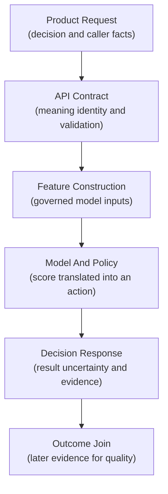
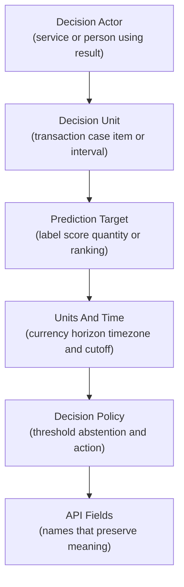
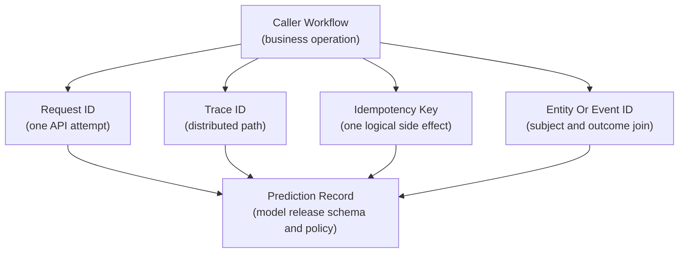
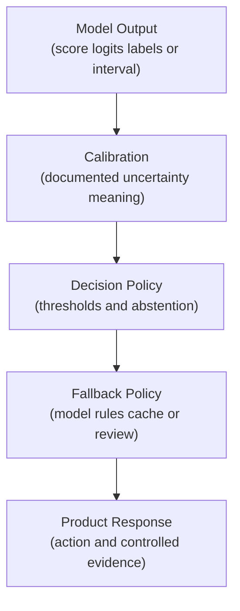
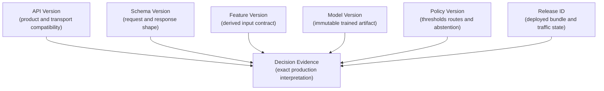
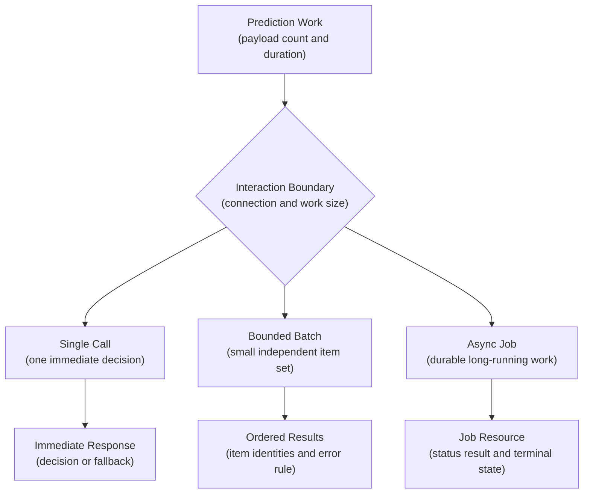
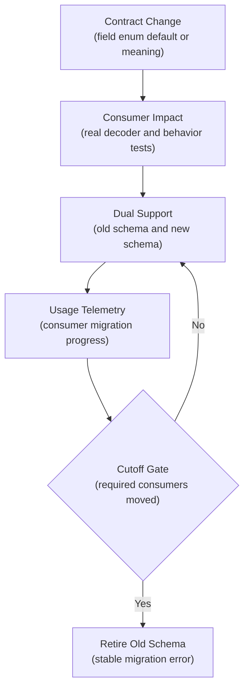
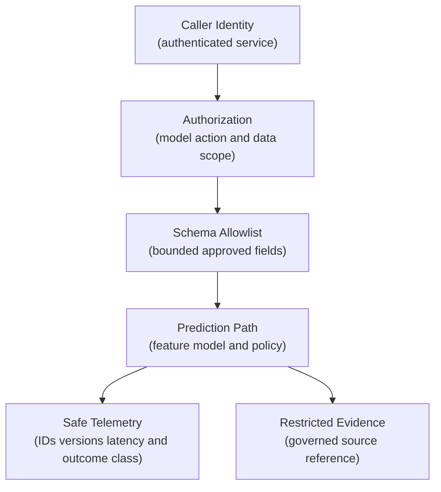
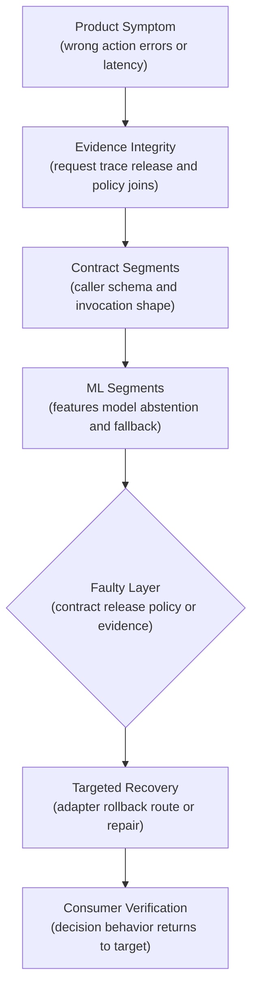

## Table of Contents

1. [What An ML API Must Communicate](#what-an-ml-api-must-communicate)
2. [Define The Product Decision Before Designing JSON](#define-the-product-decision-before-designing-json)
3. [Explain The Prediction Meaning In The Response](#explain-the-prediction-meaning-in-the-response)
4. [Choose A Single Request, Small Batch, Or Asynchronous Job](#choose-a-single-request-small-batch-or-asynchronous-job)
5. [Design The Payload For Privacy, Logging, And Security](#design-the-payload-for-privacy-logging-and-security)
6. [The Main Idea](#the-main-idea)
7. [References](#references)

## What An ML API Must Communicate
<!-- section-summary: An ML API surrounds a model call with defined product meaning, timing, identities, outputs, errors, and operational evidence. -->

A product service may ask for a risk decision, while the prediction service needs exact inputs and the caller needs to know how to interpret uncertainty or failure. An **ML API contract** is the agreement between those two services. It defines the requested decision, the facts the caller supplies, the meaning of the result, and the behaviour expected from both sides.

That description reaches beyond JSON types. A number can satisfy a schema and still carry the wrong meaning. Consider a response with `"score": 0.82`. One caller may read it as an 82 percent probability of fraud. The model may actually return the probability of a legitimate transaction. The JSON is valid, the HTTP status is successful, and the product decision is reversed.

Units create the same risk. A request field called `amount` accepts `1200` as a valid integer. One client may mean twelve dollars in cents; another may mean twelve hundred dollars. A stable contract names the unit, such as `amount_minor`, and pairs it with `currency`.

An ML API therefore needs several connected layers. Product semantics define the decision, units, and deadline. Identifiers connect a request to traces, releases, and eventual outcomes. The request schema then validates the facts supplied by the caller.

Inside the service, a feature contract governs derived model inputs. The response explains prediction meaning, uncertainty, abstention, and fallback. Version fields identify each changing layer, while error and compatibility policies tell consumers how to react as the service evolves.


*The caller sends stable product facts; the service owns derived features and turns the model score into a policy decision whose exact release remains visible in the response.*



A web framework can enforce this agreement after the team defines it. FastAPI and Pydantic v2 can validate request bodies, filter response fields, and generate OpenAPI documentation. Product and model owners still decide whether `0.82` means fraud, safety, relevance, or repayment.

## Define The Product Decision Before Designing JSON
<!-- section-summary: A contract starts with the actor, decision, prediction target, units, timing, and cost of mistakes so field names and outputs represent the real product action. -->

The contract discussion starts with a sentence about the product. It should name the caller, the decision, and the latest time at which an answer can still affect that decision. This sentence gives every field a reason to exist.

For a payment risk API, the sentence could say: “The authorization service requests a risk decision for one transaction before its dependency deadline. The result selects approve, review, or decline under the active policy.” The API now has a concrete unit: one transaction at one decision time.

For a support triage API, the caller may request a priority class for one case after a new message arrives. The result places the case into `standard`, `urgent`, or `specialist_review`. A generic `score` field would force every consumer to reproduce threshold logic. Returning the decision class plus the underlying score keeps product behavior consistent.

For a demand forecast API, the prediction target needs a horizon and unit. `expected_units` means little by itself. `expected_units_next_7_days` states the quantity and period. The request also needs the location, product identity, forecast origin time, and data cutoff that define the forecast.

Product semantics answer details that types alone miss. A timestamp needs a timezone and an event meaning; `transaction_occurred_at` differs from `request_received_at`. Money needs a currency and representation. Categories need controlled definitions. Probabilities need a positive class and calibration meaning. Missing data needs a policy because an absent field, an unknown value, and zero may produce different model behavior.

These details belong in the API description, schema field metadata, and consumer documentation. A model card can explain training behavior, though callers need the production meaning at the endpoint boundary.



### Give Each Identifier One Purpose
<!-- section-summary: Request IDs, trace context, idempotency keys, entity IDs, event IDs, and model identities solve separate correlation and safety problems. -->

Production APIs carry several identifiers because one identifier rarely serves every purpose safely. Giving each identity one job prevents accidental coupling.

A **request ID** identifies one API invocation in product logs. The caller can create it and the service returns it. Support teams use this value to locate the request and response record.

A **trace ID** identifies a distributed trace across services. W3C Trace Context propagates this identity through the `traceparent` header, and OpenTelemetry instrumentation turns service operations into related spans. A retry may create a new request attempt inside the same broader workflow, so request and trace identities should remain separate fields.

An **idempotency key** identifies a logical operation whose side effects must occur once. Repeating a pure prediction may simply calculate another score. Repeating a payment decision, notification, or async job creation can duplicate real actions. The service stores the key with a request fingerprint and returns the earlier result for an identical replay. Reusing the key with a different payload should return a conflict.

An **entity ID** identifies the subject of prediction, such as a transaction, case, or product. An **event ID** identifies the business event that triggered the decision. These values later connect predictions to outcomes. Access controls and retention rules may require pseudonymous references in operational stores.

Model evidence has its own identities. A model name and immutable model version identify the artifact. A release ID identifies the deployed combination of model, code, configuration, and traffic policy. A decision-policy version identifies thresholds and business rules applied after scoring.



Trace identifiers should stay out of business idempotency logic. Sampling can remove a trace from the observability backend, while the idempotency record must remain durable for its promised window.

### Keep The API Schema And Feature Definitions Separate
<!-- section-summary: The request schema describes stable product facts supplied by a caller, while the feature contract governs derived values produced inside the ML system. -->

A request payload should expose product facts that the caller owns. A feature vector contains model inputs produced by transformations, joins, encoders, and freshness rules. Treating these as the same contract makes every client depend on the internal shape of the current model.

Suppose an account-risk model uses `transactions_30d`, `amount_zscore`, `merchant_risk_7d`, and an encoded device category. Asking the payment service to calculate those values spreads feature logic into product code. Training and serving can drift, a model update can force a client release, and the API may expose sensitive aggregates to callers that never needed them.

A stable request can carry the current transaction facts and a governed account reference. The prediction service retrieves approved history, calculates derived features through the shared feature pipeline, checks freshness, and records the feature-set version. A new model can add an internal feature while the product request remains stable.

```python
from datetime import datetime
from typing import Annotated, Literal
from uuid import UUID

from pydantic import BaseModel, ConfigDict, Field


class RiskRequest(BaseModel):
    model_config = ConfigDict(extra="forbid")

    request_id: UUID
    transaction_id: str = Field(min_length=8, max_length=80)
    account_ref: str = Field(min_length=8, max_length=120)
    amount_minor: Annotated[int, Field(strict=True, ge=0)]
    currency: Literal["GBP", "EUR", "USD"]
    merchant_category: str = Field(min_length=2, max_length=12)
    transaction_occurred_at: datetime
    schema_version: Literal["risk-request-v3"]
```

This focused Pydantic v2 model rejects undeclared fields, constrains identifiers, names the currency representation, and pins the request schema. It deliberately omits rolling aggregates and encoded columns. Those fields belong to a feature contract with their own type, source, transformation, freshness, default, and availability rules.

The API can accept product facts or a reference to a versioned feature row if the caller and feature platform share governance. In both designs, the response should record `feature_set_version` and a freshness result. Raw feature vectors are poor default API payloads because they expose internal order, names, and transformations as a public dependency.

## Explain The Prediction Meaning In The Response
<!-- section-summary: A prediction response should state the product decision, score semantics, uncertainty, abstention, fallback route, and model evidence needed by consumers. -->

The response should answer the product question before it reports model internals. A consumer needs to know what action is permitted and how to handle uncertainty.

For payment risk, the product response may contain `decision`, `risk_probability`, `reason_codes`, and `review_required`. The schema defines `risk_probability` as the calibrated probability of a fraudulent outcome over the label window. This phrase establishes the positive class and time horizon. A bare `score` would leave both ambiguous.

**Confidence** also needs a definition. A class probability, calibration bucket, prediction interval, ensemble disagreement measure, and data-quality flag describe different forms of uncertainty. One generic `confidence` number encourages consumers to invent meanings. Give each supported measure a specific name and documented range.

**Abstention** is a valid model-system outcome. The service may decline to make an automated decision after out-of-distribution input, missing critical evidence, or high uncertainty. An abstention can return HTTP success because the request was valid and the decision policy completed. The response then identifies `review` as the action and records an abstention reason.

**Fallback** records a different execution path. A timeout may use a rules engine or a recent cached score. The response should expose the route through a controlled field such as `decision_source: "model" | "rules" | "cache"`. This allows product analytics and incident response to measure degraded behavior.

```python
class ModelEvidence(BaseModel):
    model_name: str
    model_version: str
    release_id: str
    feature_set_version: str
    policy_version: str


class RiskResponse(BaseModel):
    request_id: UUID
    decision: Literal["approve", "review", "decline"]
    risk_probability: Annotated[float, Field(ge=0.0, le=1.0)]
    decision_source: Literal["model", "rules", "cache"]
    abstention_reason: str | None = None
    reason_codes: list[str] = Field(max_length=5)
    evidence: ModelEvidence
```

Reason codes should come from a small reviewed vocabulary and represent decision evidence the product is allowed to expose. Arbitrary exception text, raw prompts, unrestricted feature values, and internal paths should stay out of the response.



### Version The API, Model, And Policy Separately
<!-- section-summary: API, schema, feature, model, policy, and release versions change for different reasons and should remain independently traceable. -->

Several independently changing parts can alter a production prediction even though the endpoint and request stay the same. Retraining can replace the model weights. A policy update can move the approval threshold. A service release can change preprocessing or timeout behavior. A single `version` value gives an incident responder too little evidence to identify which change affected the decision.

The practical solution is to record a separate identity for each layer that teams build, approve, or release independently. These identities travel with the decision record, so an engineer can compare affected requests against the exact API, feature logic, model, policy, and deployment that handled them.

The **API version** covers transport-level and product-semantic compatibility. A new path such as `/v2/risk-decisions` is appropriate after a breaking change to request meaning, response meaning, or interaction style.

The **request and response schema version** identifies the accepted document shape. A compatible optional field may stay inside the same API version, provided consumers tolerate unknown response fields. A new required request field or renamed field usually needs a migration.

The **feature-set version** identifies transformations and governed data inputs. The product request can remain unchanged while the internal feature set evolves.

The **model version** identifies immutable trained weights and packaging. Retraining under the same contract changes this version without forcing client changes.

The **policy version** identifies thresholds, routing rules, abstention criteria, and allowed fallbacks. A threshold change can alter product actions even if model scores stay identical.

The **release ID** identifies the deployed bundle. It connects the model, service image, feature set, policy, and environment configuration used for a traffic segment.



Separate identities answer real incident questions. A quality regression may come from new weights. A sudden decline-rate increase may come from a policy threshold. A validation spike may come from a schema migration. A latency regression may come from the service image. One `version` string hides these differences.

## Choose A Single Request, Small Batch, Or Asynchronous Job
<!-- section-summary: API interaction shape should match one immediate decision, a small bounded group, or a durable job whose processing outlives the request. -->

The **interaction shape** defines how much prediction work belongs to one call and how long the caller remains connected. A payment authorization needs one immediate decision inside a short deadline. Reranking twenty search candidates can fit in a small bounded request. Scoring several million customer records needs a durable job that continues after the HTTP connection closes.

These workloads lead to three common API shapes. Each shape needs its own request limits, response format, timeout behavior, and failure rules.

A **single synchronous call** asks for one decision and returns it inside the request deadline. It fits checkout, routing, ranking, and other immediate product actions. The request ID identifies one attempt, and the caller owns a timeout plus fallback.

A **bounded batch call** sends a small list of independent items under one HTTP request. Candidate ranking or a compact replay tool may benefit from this shape. The contract states a maximum item count and payload size. It also defines whether responses preserve input order and how item IDs map results back to requests.

Batch error behavior needs one declared rule. All-or-nothing validation rejects the whole document after any invalid item. Per-item results return a controlled success or error object for every item. The choice follows consumer needs, and the endpoint should avoid mixing both rules unpredictably.

A **durable asynchronous job** fits large payloads or long computation. The initial call returns `202 Accepted` with a job resource and status URL. The caller polls, receives a callback, or reads a result event. The contract defines job states, idempotent creation, retention, cancellation, completion deadline, and terminal errors.


*The interaction shape follows the amount of work that can safely finish inside the caller's deadline: one immediate decision, a bounded item set, or a durable job with its own lifecycle.*



An array with fifty thousand items is an offline data job disguised as an API call. A governed batch pipeline offers stronger snapshot, partition, replay, and publication controls for that scale.

### Define Stable Validation And Error Categories
<!-- section-summary: Validation protects syntax, schema, product rules, and model preconditions, while a stable error taxonomy tells callers whether repair, retry, fallback, or escalation is appropriate. -->

Validation protects the model boundary from inputs that are syntactically valid yet unsafe to interpret. For example, a request may contain valid JSON and a valid integer for `amount_minor`, while the currency is missing or the event timestamp lies outside the supported feature window. Passing that request to the model would create a plausible prediction with unreliable meaning.

Production services check the request in layers. Each layer returns a stable error category that leads the caller toward one action: repair the payload, change the client, retry within a limit, use a fallback, or escalate the service failure.

Transport validation checks content type, body size, authentication, and parseable JSON. Schema validation checks required fields, types, enums, ranges, and unknown properties. Product validation checks relationships such as an end time after a start time or a currency allowed for the account region. Model precondition checks verify feature availability, supported categories, and evidence freshness.

Pydantic v2 can enforce types and field constraints, while FastAPI turns these models into request validation and OpenAPI schemas. The service still needs explicit validators for cross-field product rules. Coercion deserves care: accepting the string `"1200"` as an integer can hide a client regression. Strict fields make the boundary reject that change early.

A stable error envelope separates machine-readable behavior from human-readable text:

```python
class FieldViolation(BaseModel):
    field: str
    code: str


class ApiError(BaseModel):
    error_code: str
    message: str
    request_id: UUID | None = None
    retryable: bool
    violations: list[FieldViolation] = Field(default_factory=list)
```

The HTTP status and `error_code` serve different purposes. HTTP groups transport behavior. The domain code identifies a stable reason such as `UNSUPPORTED_SCHEMA`, `FEATURES_STALE`, `PAYLOAD_TOO_LARGE`, or `MODEL_UNAVAILABLE`.

A practical mapping uses `422` for schema or product validation failures, `409` for an idempotency-key conflict, `413` for payload limits, and `429` for caller rate limits. Service unavailability can use `503`; a missed upstream deadline can use `504` if the service acts as a gateway. The API documentation should state the mapping and retry policy.

`retryable` is a bounded hint under the contract. A caller still applies exponential backoff, jitter, attempt limits, and its remaining product deadline. Validation failures require payload or client repair. A valid abstention belongs in the success response because the policy reached a controlled outcome.

### Migrate Clients Without Breaking Existing Requests
<!-- section-summary: Compatibility depends on consumer behavior, so schema changes need impact review, dual support, usage telemetry, deprecation communication, and a tested cutoff. -->

Compatibility describes the effect of an API change on real consumers. Suppose the service adds `manual_review` to a decision enum. The response remains valid JSON, yet a mobile client with an exhaustive switch may crash because it only handles `approve` and `decline`. Field-level syntax provides too little information about this consumer behavior.

A safe migration therefore combines schema review with tests from the clients that decode and act on the response. The team keeps both contract versions available during the transition, measures which consumers still use the old version, and retires it through a controlled cutoff.

Adding an optional request field is often compatible because old clients can omit it. Adding an optional response field is safe only for clients that ignore unknown fields. A mobile client with strict decoding may fail after any unrecognized property.

Adding an enum value can break an exhaustive switch even though the field type remains a string. Tightening a numeric range can reject payloads accepted yesterday. Changing a default can alter decisions for clients that omit the field. Renaming a reason code can break dashboards and support workflows.

A migration begins by publishing the new schema and examples. The service can accept old and new request versions through separate models or an explicit adapter. Telemetry counts calls by consumer and schema version, giving owners a concrete migration list. Responses can include deprecation headers or a controlled warning field if the organisation has a standard for them.

During the transition, contract tests run against both versions. The team verifies that the adapter preserves units, missing-value policy, and output meaning. The cutoff happens only after required consumers move or receive an approved exception. Retired schemas should fail with a stable `UNSUPPORTED_SCHEMA` response that points to migration guidance.



## Design The Payload For Privacy, Logging, And Security
<!-- section-summary: A production contract minimizes sensitive input, authenticates and authorizes callers, limits abuse, and records safe evidence through allowlisted logs and traces. -->

Every request field creates a data-handling obligation. The serving team should ask why the field is needed, who can send it, who can read it later, how long it is retained, and how deletion works.

Authentication identifies the caller. Authorization checks whether that caller may use this model, decision type, region, or data class. Transport encryption protects data in transit. Network policy can restrict endpoint reachability. Payload-size limits, timeouts, concurrency limits, and rate limits protect service capacity.

The request schema acts as an allowlist. `extra="forbid"` prevents undeclared JSON fields from silently entering application objects. It is one control among several; gateway and application authorization still decide who may call the endpoint.

Operational logs should record safe, bounded evidence. Request ID, route, caller service, schema version, release ID, latency, outcome class, fallback route, and error code usually provide high value. Raw feature vectors, direct personal identifiers, document bodies, prompts, credentials, and unrestricted exception text usually belong outside general logs.

Sensitive source material may need a restricted evidence store with separate access and retention. The prediction record can hold an approved reference or pseudonymous join key. This keeps incident investigation possible without copying the original payload into every log sink.

OpenTelemetry can propagate traces across the caller, gateway, feature service, and model service. Use low-cardinality span names such as `POST /risk-decisions`; placing entity IDs in span names creates expensive, sensitive cardinality. The standard HTTP attributes cover protocol behavior, and approved ML-specific attributes can record model or release identity under a controlled convention.



### Use OpenAPI And Contract Tests To Detect Breaking Changes
<!-- section-summary: Generated schemas document the boundary, while provider and consumer tests prove real clients can send, decode, and act on every supported response. -->

OpenAPI describes paths, operations, request bodies, responses, authentication, and reusable schemas. JSON Schema describes the structure and constraints of JSON instances. FastAPI generates these artifacts from Pydantic request and response models, giving teams a machine-readable contract and interactive documentation.

Generated documentation records the machine-readable boundary. The spec can identify a field as a number and attach its description. Concrete examples and consumer tests then demonstrate that callers interpret it as a fraud probability over the documented label window.

Provider contract tests exercise the service boundary. They cover a valid request, every documented error class, boundary values, unknown fields, missing values, enum behavior, idempotency replays, and response filtering. Bounded-batch tests verify maximum size, ordering, item identity, and partial-failure policy.

Consumer-driven tests use expectations captured from real clients. A checkout service may assert that `decision` contains the three supported actions and that unknown reason codes remain display-safe. A mobile client may prove it tolerates optional response fields. These tests run against the proposed OpenAPI artifact or a deployed test endpoint before release.

The OpenAPI document should live as a versioned build artifact. A schema-diff gate can flag removed fields, new required fields, narrowed ranges, changed response codes, and new enum values. A human review then evaluates meaning because automated diff tools only compare document shape and declared constraints.

```python
def test_amount_minor_rejects_string(client):
    payload = valid_risk_request()
    payload["amount_minor"] = "1200"

    response = client.post("/v1/risk-decisions", json=payload)

    assert response.status_code == 422
    assert response.json()["error_code"] == "REQUEST_VALIDATION_FAILED"
```

This focused test protects one contract choice: money arrives as a strict integer in minor units. Similar tests should focus on semantic relationships and response meaning. Framework-level unit tests cover the underlying validation machinery separately.

### Verify The API Contract During Releases And Incidents
<!-- section-summary: Rollout and incident checks follow contract evidence from the caller through schema, feature, model, policy, response, and eventual product outcome. -->

A contract release needs evidence from the real consumer path. Unit tests can pass while an older client sends a deprecated enum, a gateway drops `traceparent`, or a response decoder ignores the new abstention field.

Start rollout with shadow traffic or a small consumer segment. Compare request acceptance, error codes, latency, response distribution, fallback rate, and product actions by schema and release ID. Keep the prior contract adapter and release route available for rollback.

Suppose approval rate changes sharply after a release while HTTP success remains near 100 percent. The investigation first verifies evidence integrity: request IDs join to responses, traces cover the expected path, release identity is present, and policy versions match the traffic route. This prevents a logging gap from being mistaken for model behavior.

The next pass compares schema versions, caller services, feature-set freshness, model versions, policy decisions, abstentions, and fallback routes. A new caller may be sending currency in major units. A policy rollout may have changed thresholds. A model route may be healthy technically while returning a reversed class mapping.

Recovery follows the faulty layer. Route traffic back after a release problem. Re-enable the old schema adapter after a client migration problem. Restore the earlier policy after a threshold problem. Repair trace or decision logging after an evidence problem, then treat uncertain impact separately from confirmed model failure.



## The Main Idea
<!-- section-summary: A strong ML API preserves product meaning across caller facts, features, model releases, policy decisions, failures, migrations, and operational evidence. -->

An ML API is a stable decision contract around a changing model system. It names the decision unit and timing, gives each identity one job, separates caller facts from derived features, and returns an action with documented uncertainty and evidence.

Independent version fields explain changes to the API, schemas, features, model, policy, and deployed release. Single, bounded-batch, and asynchronous contracts match different work sizes. Validation, errors, privacy controls, OpenAPI artifacts, consumer tests, and incident joins keep the contract safe through real product change.

A well-designed contract lets a caller act on a result without learning the model's internal feature order or threshold implementation. It also gives operators enough evidence to distinguish a client migration problem, a feature problem, a model change, a policy change, and a service release. That separation is the foundation of a durable production boundary.


*A durable contract keeps product meaning stable while schemas, features, models, policies, and releases evolve through tested migrations with a retained fallback.*

## References

- [FastAPI: Request bodies](https://fastapi.tiangolo.com/tutorial/body/)
- [FastAPI: Response models](https://fastapi.tiangolo.com/tutorial/response-model/)
- [FastAPI: Handling errors](https://fastapi.tiangolo.com/tutorial/handling-errors/)
- [Pydantic: Models](https://pydantic.dev/docs/validation/latest/concepts/models/)
- [Pydantic: Strict mode](https://pydantic.dev/docs/validation/latest/concepts/strict_mode/)
- [Pydantic: JSON Schema](https://pydantic.dev/docs/json_schema/latest/concepts/json_schema/)
- [OpenAPI Specification](https://spec.openapis.org/oas/)
- [JSON Schema Draft 2020-12](https://json-schema.org/draft/2020-12)
- [W3C Trace Context](https://www.w3.org/TR/trace-context/)
- [OpenTelemetry: Traces](https://opentelemetry.io/docs/concepts/signals/traces/)
- [OpenTelemetry: HTTP span semantic conventions](https://opentelemetry.io/docs/specs/semconv/http/http-spans/)
