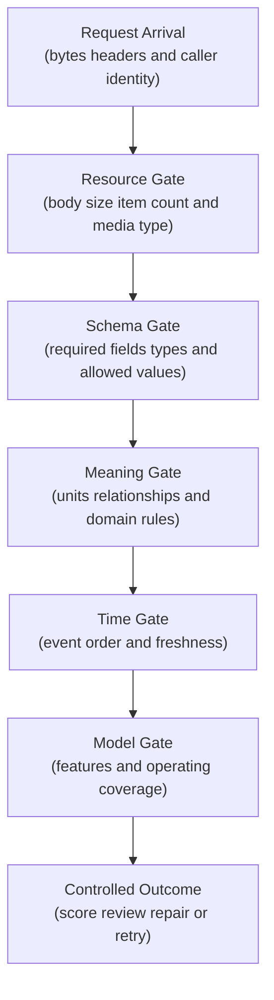
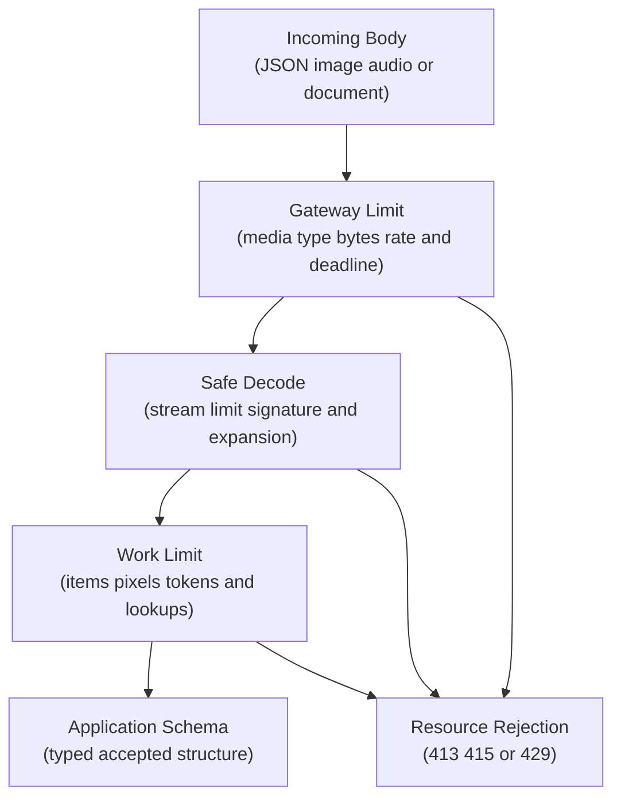
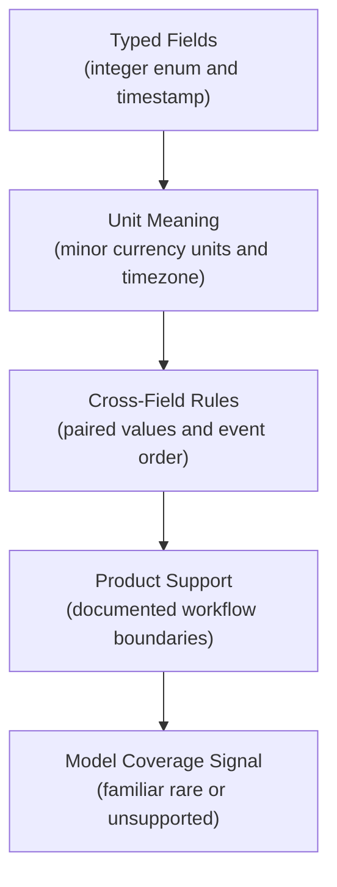
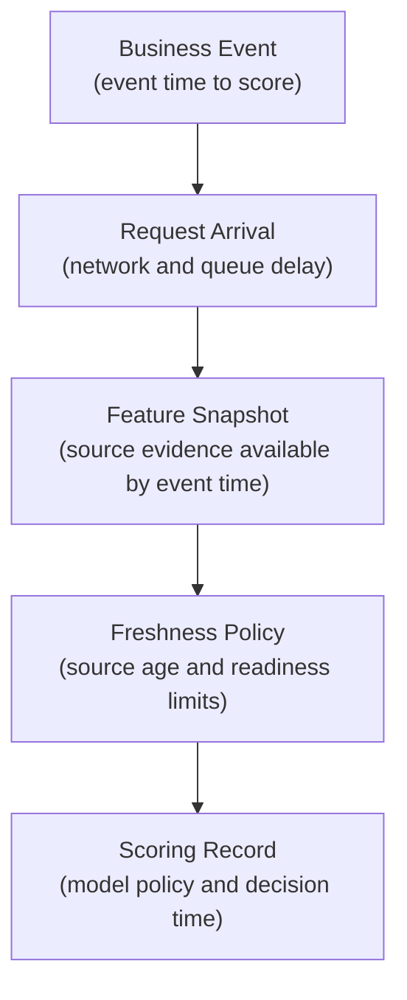
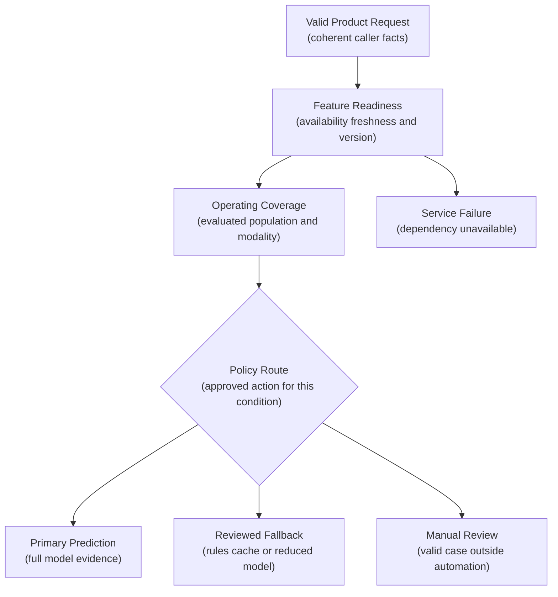
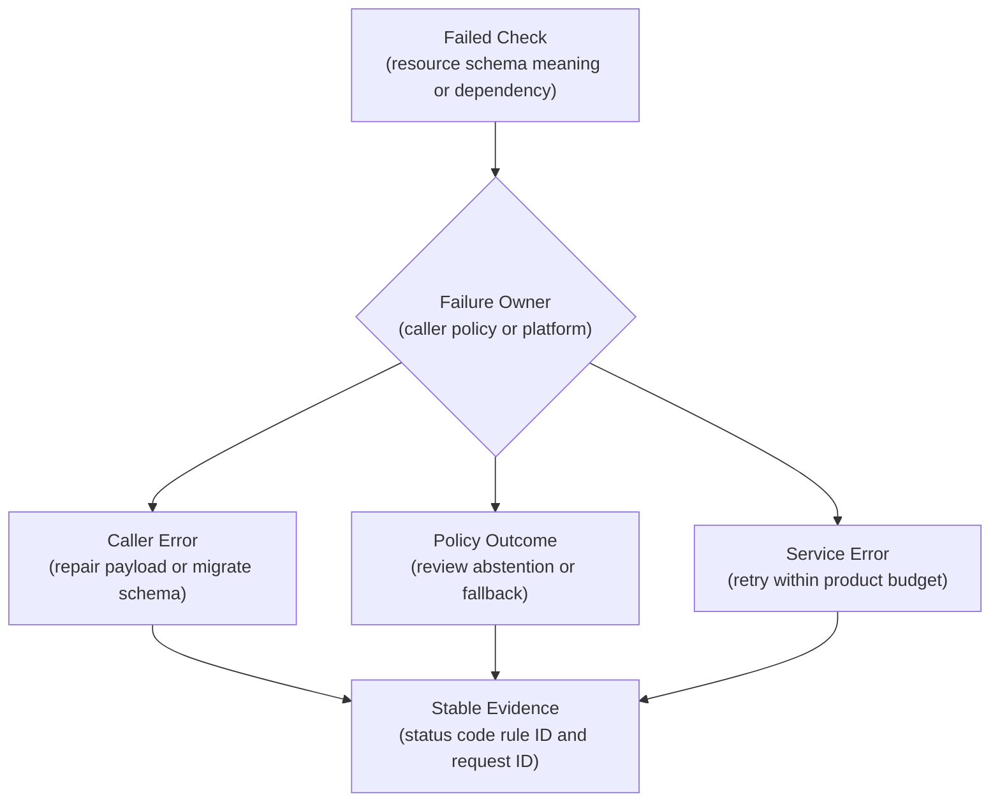
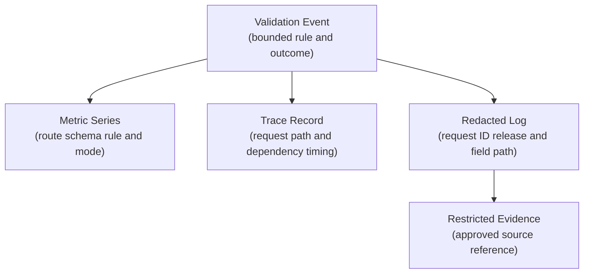
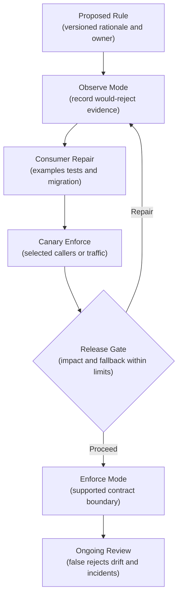

## Table of Contents

1. [Valid JSON Can Still Be Unsafe For A Model](#valid-json-can-still-be-unsafe-for-a-model)
2. [Validate Input At Several Boundaries](#validate-input-at-several-boundaries)
3. [Choose A Response For Each Validation Failure](#choose-a-response-for-each-validation-failure)
4. [Apply Security Controls Before And During Validation](#apply-security-controls-before-and-during-validation)
5. [Introduce New Validation Rules Gradually](#introduce-new-validation-rules-gradually)
6. [The Main Idea](#the-main-idea)
7. [References](#references)

## Valid JSON Can Still Be Unsafe For A Model
<!-- section-summary: Inference validation checks whether a request is safe to interpret, within the supported operating domain, and affordable to process before the model runs. -->

A request can contain valid JSON and still express an impossible age, a stale sensor reading, or a value in the wrong unit. **Input validation for inference** decides whether a production request is safe for the model system to interpret. The checks start with bytes and JSON shape, then continue through units, timestamps, feature freshness, and the conditions under which the model was approved to operate.

This matters because an ML service can accept a request, return `200 OK`, and still make a meaningless prediction. A field called `amount` may contain `1200`, with one caller intending cents and another intending dollars. Both values are valid integers. The model receives a value one hundred times larger than intended and produces a perfectly formatted response.

Time creates a similar problem. A support-ticket request may contain valid ISO timestamps, yet the reported time appears before the customer message that created the ticket. A fraud service may receive a valid feature snapshot that is several hours old, even though its policy requires recent account activity. Type validation approves both payloads; their meaning remains unsafe.

Files and arrays add a resource dimension. A valid image can contain enough pixels to exhaust decoder memory. A valid batch can contain enough rows to occupy every inference worker. Production validation therefore answers three questions before scoring:

- Can the service safely read and parse this request?
- Do the values describe a coherent event with documented units and time?
- Does the model system have the evidence and operating coverage required to make this decision?

The answer leads to a controlled outcome: accept the request, ask the caller to repair it, route the case to a safe review path, or report a service dependency failure.



## Validate Input At Several Boundaries
<!-- section-summary: Each validation layer owns a different failure class, allowing the cheapest and most precise check to run before model execution. -->

A production validation path works from cheap checks toward expensive checks. A gateway can reject a body that exceeds the published limit without allocating application memory for the full request. Pydantic can reject an undeclared field before feature lookups begin. A feature service can reject stale evidence before a GPU receives work.

This ordering saves capacity, though its deeper value is precision. The service can tell whether the caller sent malformed JSON, used the wrong unit, requested an unsupported case, or encountered a failing dependency. Each cause has a different owner and recovery action.

The layers also prevent one validation library from carrying responsibilities it was never designed to own. Pydantic describes structured Python data very well. It has no knowledge of the gateway's connection limits, the caller's permission to reference an account, the freshness of an online feature row, or the reviewed operating range of a model. Those checks live in the components that own the relevant evidence.

A practical request path uses this order:

1. The gateway checks protocol, content type, compressed and decoded body limits, authentication, rate limits, and deadlines.
2. The application schema checks fields, types, shapes, controlled values, and undeclared properties.
3. Domain rules check units and relationships between fields.
4. Temporal rules check event order, clock tolerance, and data freshness.
5. Feature and model preconditions check availability, supported modalities, and operating-domain policy.
6. Outcome routing returns a prediction, review decision, caller error, fallback, or service error.

The service should stop at the first layer that produces a definitive result. Later checks often require database, feature-store, or model work, so an early rejection protects both latency and capacity.


*The validation path rejects each unsafe condition at the cheapest boundary that owns the evidence, keeping malformed, stale, or unsupported inputs away from expensive model work.*

### Stop Unsafe Bodies Before Expensive Processing
<!-- section-summary: Gateways and streaming readers enforce media type, byte, batch, image, and deadline limits before application validation allocates costly resources. -->

Transport validation deals with the physical request: headers, bytes, compression, media type, and the amount of work represented by the body. This layer belongs before ordinary model validation because a framework often needs to read and decode JSON before it can construct a Pydantic object.

For a JSON prediction endpoint, the boundary accepts the documented media type, sets a maximum encoded and decoded body size, limits nesting and array length, and gives the entire request a deadline. A bounded-batch endpoint also caps the number of items. Rate limits control request frequency; concurrency limits control simultaneous expensive work. Both are needed because one large request and many small requests consume capacity differently.

Consider an image-classification endpoint. A five-megabyte upload may decode into hundreds of millions of pixels. The service first applies a gateway byte limit. A streaming reader maintains its own byte counter because a client may omit `Content-Length`. A safe image decoder then verifies the file signature, allowed format, decoded width, height, and pixel count before resizing. The client-provided filename and `Content-Type` offer hints; decoded content supplies the evidence used for acceptance.

Compressed bodies need two limits. The encoded limit protects network and buffering resources. The decoded limit protects memory and parsers from highly compressed content. Similar care applies to archives, audio duration, video dimensions, document page counts, and LLM token budgets.

OWASP groups missing timeouts, upload limits, batch limits, rate limits, and memory controls under unrestricted resource consumption. In practice, teams enforce these at the API gateway or ingress, repeat critical bounds in the application, and cap downstream work such as feature lookups and accelerator queue time.



### Use A Strict Schema For Values Supplied By The Caller
<!-- section-summary: A typed allowlist defines required fields, controlled values, lengths, ranges, and unknown-property behavior for the public request boundary. -->

After the body is safe to parse, **structural validation** checks its document shape. It answers concrete questions: Is the root value an object? Are required fields present? Are identifiers bounded strings? Is the currency drawn from an approved vocabulary? Is the batch an array with a declared maximum length?

FastAPI reads a typed request body through a Pydantic model. Pydantic validates the object and generates JSON Schema, which FastAPI includes in its OpenAPI document. The same source therefore drives runtime checks, client documentation, and schema-based tests.

The model below represents one transaction-risk request. The example stays at the API boundary: it contains facts owned by the caller and a reference used to retrieve governed features. Rolling aggregates, encodings, and model tensor positions remain inside the feature contract.

```python
from typing import Annotated, Literal, Self
from uuid import UUID

from pydantic import AwareDatetime, BaseModel, ConfigDict, Field, model_validator


class RiskDecisionRequest(BaseModel):
    model_config = ConfigDict(extra="forbid")

    schema_version: Literal["risk-request-v3"]
    request_id: UUID
    transaction_id: str = Field(min_length=8, max_length=80)
    account_ref: str = Field(min_length=8, max_length=120)
    amount_minor: Annotated[int, Field(strict=True, ge=0, le=50_000_000)]
    currency: Literal["GBP", "EUR", "USD"]
    channel: Literal["web", "mobile", "assisted"]
    transaction_created_at: AwareDatetime
    event_time: AwareDatetime

    @model_validator(mode="after")
    def creation_precedes_decision_event(self) -> Self:
        if self.transaction_created_at > self.event_time:
            raise ValueError("transaction_created_at must be at or before event_time")
        return self
```

`extra="forbid"` turns the model into an allowlist. An undeclared field such as `approval_override` fails validation before it enters the application object. The strict integer rule rejects `"1200"` for `amount_minor`, and the controlled literals reject misspelled currencies or channels. `AwareDatetime` requires timezone-aware values, which prevents a local timestamp from silently acquiring the server's timezone.

Ranges deserve product review. The upper amount bound should reflect the endpoint's supported decision workflow and abuse model. Copying the maximum observed training value would reject every legitimate future record above that historical sample. A range should express a documented business or system limit, with an explicit route for cases outside it.

### Validate Meaning, Units, And Relationships
<!-- section-summary: Semantic validation gives typed values a documented unit and checks relationships that determine whether the event makes sense. -->

Structural validation proves that `amount_minor` is an integer. **Semantic validation** proves that the integer has the unit and relationship expected by the decision. This layer checks the story told by the fields, beyond each field in isolation.

Clear names carry part of the solution. `amount_minor` paired with `currency` is safer than `amount`. `temperature_celsius` is safer than `temperature`. `forecast_horizon_hours` is safer than `horizon`. The OpenAPI field description should define any remaining assumptions, including rounding, inclusive bounds, and category meaning.

Cross-field rules cover facts that only make sense together. A reservation end time follows its start time. Latitude and longitude appear as a pair. A selected country supports the submitted currency. A requested forecast horizon fits the chosen model route. Pydantic v2 model validators run after individual fields have been parsed, making them appropriate for these relationships.

The validator in the preceding model protects a caller-owned relationship: the transaction creation time may occur at or before the decision event. Reversing those timestamps indicates a mapping, clock, or event-definition problem that the caller can repair.

A parallel point-in-time rule belongs inside feature retrieval. The feature snapshot may use evidence available at or before the transaction event. A snapshot from the future would leak later information into the decision. Training-data construction needs the same rule so offline evaluation and online inference share the same temporal meaning.

Some unusual values remain valid. A very large purchase, a rare product category, or a customer with little history may lie far from typical training examples. Domain validation should preserve these legitimate events and pass an explicit coverage signal to the model-policy layer. Treating every statistical outlier as malformed input hides model uncertainty inside a client error.



### Validate Timestamps And Data Freshness
<!-- section-summary: Temporal validation distinguishes event time, request time, feature time, and model time so production decisions use evidence available at the intended moment. -->

ML requests usually contain several clocks. **Event time** describes the business event being scored. **Request time** describes arrival at the serving boundary. **Feature time** describes the latest evidence included in a feature row. **Model time** records the model and policy state used during scoring.

These timestamps answer different questions. A delayed transaction event may still be valid, yet it requires a feature lookup as of the historical event. A feature row created recently may still contain source data that is too old. A timestamp several minutes in the future may indicate caller clock skew or a unit error.

Temporal validation starts with format and timezone, then checks relationships and tolerances. The service defines acceptable future skew, supported event age, feature freshness by feature group, and the exact point-in-time lookup rule. These limits come from the product deadline and feature pipeline guarantees.

Consider a risk request whose event occurred one minute ago. The online feature row says `updated_at` one minute ago, yet the card-activity source inside that row is two hours old. A top-level row timestamp gives false reassurance. Production feature contracts should expose freshness for the sources that matter to the decision, or provide a computed readiness status based on those source-level service objectives.

Ownership determines the response. A caller-supplied event time outside the documented window is a client or workflow problem. A server-managed feature lookup that returns stale evidence is a service precondition failure. The policy may use a reviewed fallback or route the case to manual review. Relabeling server staleness as invalid caller input sends recovery to the wrong team.



### Reject Inputs Outside The Model's Supported Domain
<!-- section-summary: Model preconditions check feature readiness, supported modalities, and approved coverage before policy chooses prediction, fallback, or review. -->

A request can satisfy the public API contract and still fall outside the conditions approved for automated prediction. This boundary is the **model operating domain**: the data conditions, populations, modalities, and feature availability under which evaluation supports use of the model.

For a tabular model, the gate first confirms that feature retrieval succeeded and returned the expected feature-set version. It checks freshness and verifies that every category has documented handling. A final tensor check rejects non-finite numeric values or an unexpected shape. Together, these checks prevent a serving transformation or feature-store problem from reaching the predictor as ordinary data.

Other modalities need their own evidence. An image gate verifies decoded format and usable resolution, then applies the approved channel and quality rules. A language gate checks the supported language and token budget. It also confirms the document type and configured content-safety route. Every rule should describe what the evaluated system supports, using the same preprocessing implementation exercised during model validation.

Operating-domain checks should reflect evaluation evidence and product risk. Training data identifies sparse regions, while slice evaluation measures quality for important populations and conditions. Out-of-distribution tests probe unfamiliar inputs, and calibration analysis shows whether reported probabilities retain their meaning there.

Policy review turns that evidence into routes. Well-supported cases can use automated prediction. Cases with evaluated fallback coverage use that fallback. Conditions with insufficient evidence go to human judgment. Historical minimums and maximums remain descriptive statistics; they rarely define universal limits for future valid events.

Suppose an identity model receives a sharp, valid image of a document type that was excluded from evaluation. The body and image decoder have succeeded. Returning `422` would imply a malformed request. A controlled `review` decision explains the actual result: the case is valid for the product and outside automated coverage.

Feature dependency failures need another route. A timeout from the feature store says nothing about the caller's event. The service can use a pre-approved reduced-feature model, a cached result inside its freshness limit, manual review, or a `503` response. The decision source and precondition outcome belong in prediction evidence so monitoring can separate full-model traffic from degraded routes.



### Control Type Coercion And Compatibility
<!-- section-summary: Strict fields expose accidental type changes, while explicit schema versions and adapters give consumers a controlled migration path. -->

Validation libraries often coerce values for developer convenience. Pydantic's default behavior can convert the string `"123"` into the integer `123`. That behavior fits query parameters and environment variables, which naturally arrive as text. At an ML request boundary, silent conversion can hide a client release that changed serialization or units.

Use strict mode selectively for fields whose representation carries meaning. Money in minor units, item counts, booleans, and bounded numeric measurements are strong candidates. Date and time parsing follows its own JSON rules, so timezone requirements and relationship validators still matter. Record a test for every coercion choice that protects a product invariant.

Strictness also interacts with schema evolution. A new required field breaks old callers immediately. A new enum member may break clients with exhaustive decoders. An optional response field may break a strict mobile decoder. OpenAPI and JSON Schema describe the document shape, while consumer contract tests reveal how actual clients behave.

An explicit `schema_version` makes migrations observable. The service can support two request models and translate the older form through a reviewed adapter. Metrics count accepted and rejected requests by a bounded schema-version label and registered caller. Owners contact remaining consumers, verify their contract tests, and remove the adapter through a controlled release.

The feature-set version stays separate. A serving team may change internal features while the public request remains `risk-request-v3`. Joining schema, feature, model, and policy versions in the decision record gives incident responders the exact interpretation of every accepted request.

## Choose A Response For Each Validation Failure
<!-- section-summary: Caller mistakes, valid low-confidence cases, approved fallbacks, and platform failures produce different outcomes because they require different recovery. -->

A failed check can reveal a caller bug, stale evidence, an unsupported case, a security violation, or a temporary dependency problem. These situations require different responses because the caller can repair some of them while the service must contain or recover the others. Four outcome families cover most production cases.

A **client repair** means the request violates the published contract. Examples include malformed JSON, a missing field, a string in a strict numeric field, or an event timestamp outside the supported request window. The response names the violated rule and gives a stable machine-readable code.

A **controlled review or abstention** means the request describes a valid product case and automated prediction lacks sufficient coverage or evidence. A rare category, uncertain image, or unfamiliar language can take this route. The API returns the documented product action and records the reason as prediction evidence.

An **approved fallback** means the primary path failed and policy selected another safe method. A feature timeout may route to a reviewed rules engine. A missing high-cost feature may use a reduced-feature model whose quality has been evaluated. The response identifies the fallback so downstream analytics can measure degraded operation.

A **service error** means the platform failed to fulfil a valid request and no approved fallback completed the decision. An unavailable model artifact, feature dependency, or exhausted deadline belongs here. The caller applies the documented retry and product fallback policy.

These categories keep model uncertainty, invalid input, and infrastructure failure visible as separate operational signals. Combining them into a generic `validation_failed` counter would obscure ownership and encourage unsafe retries.


*A failed check should reveal who can act next: the caller repairs its request, policy chooses review or a tested fallback, or the service reports an unavailable safe path with bounded retry guidance.*

### Use Stable Error Categories
<!-- section-summary: Stable status codes, domain codes, rule identifiers, field paths, and retry guidance let callers recover without parsing prose. -->

An error contract serves two audiences. The HTTP status guides generic transport behavior, while a domain `error_code` guides the product client. A `rule_id` identifies the exact validation rule, and a field path locates the failing value without copying it into the response.

Common transport choices include `413` for a body beyond the declared limit, `415` for an unsupported media type, and `429` for a rate limit. FastAPI uses `422` for request-body validation by default. Teams may map malformed JSON and semantic failures into their own documented `400` or `422` policy; consistency across versions matters more than inventing many status codes. Dependency unavailability commonly maps to `503`, while a gateway deadline can map to `504`.

A stable error envelope typically carries:

- `error_code`, such as `REQUEST_SCHEMA_INVALID` or `FEATURES_STALE`;
- `rule_id`, such as `amount_minor.strict_integer`;
- `field_paths`, using bounded schema paths;
- a short human-readable message;
- `request_id` for log correlation;
- `retryable` plus an optional bounded delay hint;
- a documentation link tied to the contract version.

The message may improve over time, so clients branch on `error_code` and `rule_id`. They should apply capped exponential backoff and jitter only for documented transient errors. A retry still respects the user's remaining deadline and attempt budget. Validation errors require payload repair or migration, and repeated retries would only amplify traffic.



## Apply Security Controls Before And During Validation
<!-- section-summary: Authentication, authorization, resource budgets, property allowlists, and safe media handling protect threats beyond ordinary field correctness. -->

Schema validation is one part of API security. Authentication establishes caller identity. Authorization establishes whether that identity may score this entity, use this model route, or access a protected explanation. Object-level checks matter because a perfectly valid `account_ref` may belong to another tenant.

An allowlisted request model also reduces mass-assignment risk. `extra="forbid"` rejects a caller-supplied `approval_override` or `internal_tier` field, and application code maps approved request fields into internal commands explicitly. Authorization still checks the caller's permission for each referenced object and operation.

Resource controls surround the schema. Gateways enforce body size, rate, concurrency, and deadlines. The application caps batch items, decoded pixels, token count, feature lookups, and downstream fan-out. Infrastructure limits memory and CPU, while cost controls watch paid external services. These measures align with OWASP guidance on unrestricted resource consumption.

Media inputs require content-aware handling. File extensions and caller-provided MIME types can be spoofed. A production path checks an allowed type, verifies the file signature, decodes with a maintained library under resource limits, and validates the decoded representation. Teams can isolate or scan higher-risk document formats and store uploads outside executable web paths.

URLs in an inference request create a server-side fetch capability. A controlled fetcher should allow approved schemes and destinations, resolve addresses safely, block private-network targets, cap redirects and bytes, and apply its own deadline. Many systems avoid arbitrary URLs entirely and accept an authorized object-store reference.

Rich text and prompts require domain-specific controls because grammar checks provide little protection against harmful meaning. Content policy, moderation, prompt isolation, output controls, and human review belong to that wider safety design.

### Monitor Validation Without Storing Raw Payloads
<!-- section-summary: Bounded metrics, traces, and redacted logs reveal validation drift while keeping personal data and high-cardinality values out of telemetry. -->

Validation failures often reveal a broken client release before model-quality metrics move. The service needs enough telemetry to answer which rule failed, which contract version was used, and which registered caller is affected.

A practical counter looks like `inference_validation_total{route, schema_version, rule_id, outcome}`. Each label comes from a bounded vocabulary. A histogram can track accepted payload bytes or batch length. Service metrics separately track feature-readiness failures, abstention rate, fallback rate, and model execution failures.

Entity IDs, request IDs, raw values, free-form messages, and file names create high-cardinality metric labels. Keep them out of metrics. Request and trace IDs belong in structured logs and trace records with appropriate access and retention, allowing an operator to move from an aggregate spike to a small set of approved diagnostic records.

OpenTelemetry's HTTP semantic conventions use route templates such as `/v1/risk-decisions` for low-cardinality `http.route`. A concrete transaction path would create one time series per identifier and may expose sensitive data. Custom validation attributes should follow the same bounded-cardinality discipline.

Logs should identify the stable rule, field path, registered caller class, schema version, and serving release. Enforcement mode and outcome complete the operational explanation: the same rule may be observed for one caller and enforced for another during migration.

General operational logs exclude the raw request body and feature vector. Prompts, images, and direct personal identifiers also stay outside this store. Parser failures map to bounded error codes before logging, keeping unrestricted exception text out of the event. A restricted evidence store can retain an approved pseudonymous reference for investigations that require source review.



## Introduce New Validation Rules Gradually
<!-- section-summary: New compatibility rules progress from measured observation to targeted enforcement, with caller evidence and rollback kept throughout the migration. -->

A stricter validation rule can break healthy clients. Changing a numeric field from coercing to strict, narrowing an enum, or retiring a schema version deserves the same release care as any API compatibility change.

Teams commonly use three modes. **Observe** evaluates the proposed rule and records `would_reject` while the existing safe behavior continues. **Canary enforce** rejects violations for selected test callers or a small production segment. **Enforce** applies the rule across the supported contract. A rule registry records the rule ID, owner, rationale, severity, affected schema versions, remediation, and current mode.

Observe mode fits compatible tightening, such as discovering clients that still serialize an integer as a string. Fundamental safety controls—authentication, object authorization, body limits, and known-dangerous media rules—should be active from the start. Production traffic should never bypass a critical control merely to collect migration data.

During observation, dashboards segment `would_reject` by registered caller, schema version, and rule ID. Owners receive concrete failing examples through an approved private channel. Provider and consumer tests exercise the new rule. Canary enforcement then proves the real response code, error envelope, client behavior, and fallback path.

Rollback preserves the former accepted schema model or adapter behind a release control. A rollback decision uses client impact, false-rejection rate, resource risk, and product fallback health. The team keeps the new rule's observation metrics active after rollback so the migration can continue with evidence.



### Test The Validation Contract And Incident Paths
<!-- section-summary: Boundary tests prove documented rules, while incident diagnosis separates telemetry integrity, caller changes, rule releases, feature readiness, and model behavior. -->

Contract tests should exercise the public boundary through the same parser and exception handler used in production. Positive cases prove accepted requests. Negative cases cover every stable error family: missing fields, unknown fields, strict numeric types, enum values, string and list bounds, cross-field relationships, timezone requirements, body and batch limits, deprecated schema versions, and authorization checks.

Boundary values deserve special attention. Test the exact maximum body size, one byte beyond it, the first supported event time, clock-skew tolerance, and the feature-freshness threshold on both sides. Property-based or fuzz tests can explore malformed shapes, while curated examples preserve the business meaning expected by consumers.

One compact test can protect the cross-field rule in the Pydantic model:

```python
from datetime import datetime, timedelta, timezone

import pytest
from pydantic import ValidationError


def test_transaction_created_after_event_is_rejected(valid_payload):
    event_time = datetime.now(timezone.utc)
    valid_payload["event_time"] = event_time
    valid_payload["transaction_created_at"] = event_time + timedelta(minutes=1)

    with pytest.raises(
        ValidationError,
        match="transaction_created_at must be at or before event_time",
    ):
        RiskDecisionRequest.model_validate(valid_payload)
```

The concrete timestamp carries no policy meaning; the test asserts the relationship between two fields. A separate API-level test should prove that the exception handler returns the documented `422`, stable `error_code`, `rule_id`, and redacted field path.

Incident diagnosis starts by checking evidence integrity. Confirm that validation metrics are fresh, the rule registry matches the deployed release, schema and caller labels are populated, and trace sampling still covers the affected route. A telemetry gap can make healthy traffic appear rejected or hide an entire caller segment.

The next pass compares failure rate by rule ID, caller, schema version, release ID, and enforcement mode. A strict-integer spike limited to one client release points toward serialization. The same spike across every caller immediately after a validator release points toward a service rule or adapter. Feature-freshness failures across several endpoints point toward the feature pipeline.

After locating the layer, recovery follows its owner: roll back the validation release, restore an adapter, repair the caller, fix the feature pipeline, or switch to the reviewed fallback. Model-quality investigation starts only after accepted-request integrity and evidence freshness are established.

## The Main Idea
<!-- section-summary: Strong inference validation protects resources, preserves product meaning, checks model readiness, and routes every failure to an observable recovery path. -->

Input validation is a layered production safety boundary. Gateways protect bytes, rate, and deadlines. Typed schemas protect document structure. Semantic and temporal rules protect meaning. Feature and operating-domain checks protect the conditions required for a trustworthy model decision.

The boundary also needs deliberate outcomes. Caller mistakes receive stable repair guidance. Valid cases outside automated coverage receive review or abstention. Approved fallbacks remain visible in prediction evidence. Platform failures produce bounded retry guidance.

Strict Pydantic v2 models, FastAPI-generated OpenAPI, gateway limits, OpenTelemetry signals, contract tests, and observe-to-enforce rollout controls provide an industrial implementation path. Their value comes from a shared validation policy that names every rule, owner, outcome, and recovery action.


*New compatibility rules move from observation to targeted enforcement with bounded telemetry and a retained adapter, so healthy clients are identified and repaired before the boundary tightens for everyone.*

## References

- [FastAPI: Request bodies](https://fastapi.tiangolo.com/tutorial/body/)
- [FastAPI: Strict Content-Type checking](https://fastapi.tiangolo.com/advanced/strict-content-type/)
- [FastAPI: Handling errors](https://fastapi.tiangolo.com/tutorial/handling-errors/)
- [Pydantic: Models](https://pydantic.dev/docs/validation/latest/concepts/models/)
- [Pydantic: Validators](https://pydantic.dev/docs/validation/latest/concepts/validators/)
- [Pydantic: Strict mode](https://pydantic.dev/docs/validation/latest/concepts/strict_mode/)
- [Pydantic: JSON Schema](https://pydantic.dev/docs/validation/latest/concepts/json_schema/)
- [OpenAPI Specification](https://spec.openapis.org/oas/)
- [JSON Schema Draft 2020-12](https://json-schema.org/draft/2020-12)
- [OpenTelemetry: HTTP metrics semantic conventions](https://opentelemetry.io/docs/specs/semconv/http/http-metrics/)
- [OWASP API Security: Unrestricted Resource Consumption](https://owasp.org/API-Security/editions/2023/en/0xa4-unrestricted-resource-consumption/)
- [OWASP API Security: Broken Object Property Level Authorization](https://owasp.org/API-Security/editions/2023/en/0xa3-broken-object-property-level-authorization/)
- [OWASP: Input Validation Cheat Sheet](https://cheatsheetseries.owasp.org/cheatsheets/Input_Validation_Cheat_Sheet.html)
- [OWASP: File Upload Cheat Sheet](https://cheatsheetseries.owasp.org/cheatsheets/File_Upload_Cheat_Sheet.html)
- [OWASP: REST Security Cheat Sheet](https://cheatsheetseries.owasp.org/cheatsheets/REST_Security_Cheat_Sheet.html)
