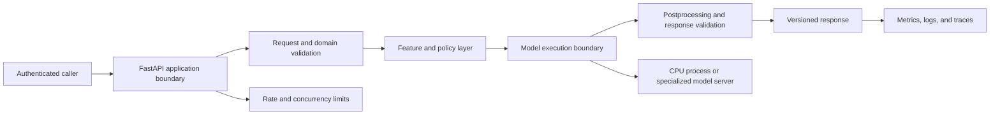

## FastAPI Implements The HTTP Inference Boundary
<!-- section-summary: A model API turns an authenticated, validated request into a versioned prediction through a controlled lifecycle. -->

FastAPI is a Python web framework that uses type hints and Pydantic models for request validation and OpenAPI generation. In model serving, it can implement the HTTP boundary around a prediction function.

The complete request lifecycle is:

1. Authenticate and identify the caller.
2. Parse and validate the request contract.
3. Apply size, rate, timeout, and policy limits.
4. Resolve or fetch required features.
5. Run deterministic preprocessing.
6. Execute the loaded model.
7. Apply calibration, thresholds, and postprocessing.
8. Validate and return the response with version evidence.
9. Record latency, errors, model identity, and safe prediction metadata.

FastAPI supplies routing, validation integration, dependency injection, lifecycle hooks, and error handling. It does not decide the model contract, permissions, feature semantics, concurrency, or release policy.

The application boundary and the model execution boundary can live in the same process for a small CPU model. Larger systems often separate them. FastAPI then owns authentication, request validation, product policy, and response assembly, while a model server owns batching, accelerator scheduling, and model instances. The split follows different scaling needs: HTTP coordination may need many lightweight workers, while a large model may need a small number of expensive accelerator workers.



This map gives every later section an owner. Schema failures belong near the HTTP boundary. Stale features belong in the feature layer. Out-of-memory errors belong in the execution boundary. A poor threshold belongs in policy or postprocessing. Keeping those responsibilities visible prevents one route function from accumulating every production concern.

## Decide Whether FastAPI Should Execute The Model
<!-- section-summary: FastAPI can call a local model or coordinate a separate model server, and the workload determines the useful boundary. -->

Running the model inside the API process keeps the first deployment simple. The process loads one bundle during startup and calls it directly. This works well for modest CPU models, low traffic, and teams that need a clear service before they need a serving platform. The API and model release together, so compatibility testing has one artifact pair.

The same design creates limits. Every web worker may load another model copy. A large model can exhaust memory before the service reaches useful concurrency. Native inference can block the event loop, and GPU batching rarely aligns with generic HTTP worker settings. A crash in the model runtime also removes the API worker that was coordinating the request.

A separate execution service adds a network hop and another dependency, while giving the team independent model scaling, shared batching, accelerator-aware scheduling, and a narrower serving runtime. Triton, KServe, BentoML, and Ray Serve cover different parts of that design. The product API can remain stable while the execution layer changes, provided the internal tensor or prediction contract remains compatible.

Choose the boundary from evidence. Measure model memory per process, safe concurrency, batch opportunity, startup time, failure isolation, and team ownership. A local call is a good production design when it meets the contract. A second service is justified when it solves a measured execution or ownership problem.

## Model Lifecycle Is Separate From Request Lifecycle
<!-- section-summary: The service loads and verifies the model during startup, reuses it across requests, and exposes readiness only after successful initialization. -->

Loading a model inside every request wastes time and memory. A long-lived worker should resolve one approved artifact during startup, verify its identity, load preprocessing and model assets, warm the runtime, and run a fixture before reporting readiness.

FastAPI's lifespan mechanism can manage this lifecycle:

```python
from contextlib import asynccontextmanager
from fastapi import FastAPI

runtime: dict[str, object] = {}

@asynccontextmanager
async def lifespan(app: FastAPI):
    bundle = load_verified_bundle(settings.model_uri, settings.model_digest)
    run_startup_fixture(bundle)
    runtime["bundle"] = bundle
    runtime["ready"] = True
    try:
        yield
    finally:
        runtime["ready"] = False
        runtime.clear()

app = FastAPI(lifespan=lifespan)
```

If loading fails, startup fails or readiness remains false. The platform can keep traffic on the previous release. A service should not return successful health while silently using an uninitialized fallback unless that fallback is explicit in the response and release design.

Multiple server workers usually load multiple model copies. Worker count therefore follows model memory, CPU threading, GPU sharing, and tested concurrency rather than generic web-server defaults.

## Typed Schemas Protect The Caller Contract
<!-- section-summary: Pydantic models validate shape and basic rules before domain and feature validation run. -->

The previous articles in this submodule define request and validation contracts. FastAPI maps those contracts into Pydantic models:

```python
from pydantic import BaseModel, ConfigDict, Field

class PredictionRequest(BaseModel):
    model_config = ConfigDict(extra="forbid")

    age: int = Field(ge=18, le=100)
    systolic_bp: float = Field(ge=60, le=260)
    heart_rate: float = Field(ge=20, le=240)
    symptom_codes: list[str] = Field(min_length=1, max_length=20)

class PredictionResponse(BaseModel):
    risk_band: str
    score: float = Field(ge=0.0, le=1.0)
    model_version: str
    policy_version: str
    request_id: str
```

`extra="forbid"` catches unexpected fields rather than ignoring caller mistakes. Field constraints reject impossible ranges and oversized lists. Cross-field and domain validation can check relationships, allowed codes, units, and caller permissions.

Schema validation protects the API shape. It cannot prove that the value was measured correctly, that the caller is authorized, or that the feature is fresh. Those checks remain separate.

## The Endpoint Coordinates A Narrow Prediction Function
<!-- section-summary: The route coordinates trusted context, preprocessing, inference, postprocessing, and response evidence without containing the model logic itself. -->

Keep feature and model logic in testable modules. The route handles protocol concerns and calls the prediction service.

```python
from fastapi import Depends, Request

@app.post("/v1/predictions", response_model=PredictionResponse)
async def predict(
    payload: PredictionRequest,
    request: Request,
    caller: Caller = Depends(authenticated_caller),
) -> PredictionResponse:
    bundle = runtime["bundle"]
    features = build_features(payload, caller=caller)
    result = await inference_limiter.run(bundle.predict, features)
    decision = apply_policy(result, policy=current_policy())

    return PredictionResponse(
        risk_band=decision.risk_band,
        score=decision.score,
        model_version=bundle.version,
        policy_version=decision.policy_version,
        request_id=request.state.request_id,
    )
```

This read-only route omits an idempotency key because retrying it does not perform a business action. **Idempotency** means retries of one logical request leave one final effect; a route that triggers a downstream action needs a deliberate idempotency key, transaction, and authorization design. The API should avoid combining “predict” and “perform irreversible business action” casually.

The response includes concrete model and policy versions. This lets clients and operators connect a decision to release evidence. It should avoid exposing raw internal features or debugging data by default.

## Concurrency And Overload Need Explicit Policy
<!-- section-summary: The service limits in-flight inference and returns controlled errors before queues exhaust memory or violate latency. -->

An async route does not make a CPU- or GPU-bound model asynchronous. Blocking inference can run in a controlled thread pool, process, or specialized model server. GPU calls may use a dedicated queue or batcher.

The service should cap in-flight work according to load tests. Unbounded requests create queue growth, memory pressure, and tail latency. When capacity is exhausted, fail quickly with an appropriate status or route through a queue rather than accepting work that cannot meet its deadline.

Timeouts need cancellation semantics. Cancelling the HTTP coroutine may not stop a native model call already executing. The platform should account for this when setting concurrency and upstream timeouts.

For high-throughput or accelerator-heavy inference, FastAPI can remain the application boundary while Triton, ONNX Runtime, BentoML, or Ray Serve owns specialized execution.

## Worker Topology Changes Memory And Failure Behaviour
<!-- section-summary: Processes, threads, model instances, and replicas consume different resources and fail at different boundaries. -->

A **replica** is one deployed copy of the service. A replica may run one or more operating-system processes, commonly called workers. Each process can own threads and usually has its own Python memory. If startup loads a 3 GB model in four workers, the pod may need roughly four model copies unless the runtime has a tested sharing mechanism.

CPU inference can use native library threads inside one process, several single-threaded processes, or a controlled combination. Too many web workers multiplied by too many math-library threads causes oversubscription: the processes compete for the same cores and tail latency rises. Set thread counts, worker counts, CPU requests, and in-flight limits as one tested topology.

GPU inference usually needs tighter ownership. Several API workers attempting to use one device can duplicate model memory or create unpredictable scheduling. A dedicated model server can own device instances and batch requests from many application replicas. If the model remains in-process, start with one process per assigned device and prove concurrency through load tests.

Failure handling follows this topology. A worker crash should remove readiness and let the platform replace the replica. A model-server timeout should consume a bounded request budget and return a stable dependency error or approved fallback. Avoid automatic retries for expensive inference unless the caller still has time and the retry will use healthy capacity.

## Errors Should Be Stable And Safe
<!-- section-summary: Error responses separate invalid input, authentication, authorization, capacity, dependency, and internal failures. -->

Clients need stable categories and request IDs. Validation errors can identify fields without leaking sensitive values. Authentication and authorization remain distinct. Overload can use `429` or `503` according to the product contract. Dependency and internal errors avoid raw stack traces.

```python
from fastapi.responses import JSONResponse

@app.exception_handler(ModelUnavailable)
async def model_unavailable(request: Request, exc: ModelUnavailable):
    return JSONResponse(
        status_code=503,
        content={
            "error": {"code": "MODEL_UNAVAILABLE"},
            "request_id": request.state.request_id,
        },
    )
```

Logs hold protected diagnostic context under access and retention policy. The response remains small and consistent.

## Health Endpoints Reflect Real Readiness
<!-- section-summary: Liveness reports process health, readiness reports model usability, and version endpoints expose the loaded release. -->

```python
@app.get("/livez")
async def livez():
    return {"status": "alive"}

@app.get("/readyz")
async def readyz():
    if not runtime.get("ready"):
        raise ModelUnavailable()
    return {"status": "ready"}

@app.get("/version")
async def version():
    bundle = runtime["bundle"]
    return {
        "model_version": bundle.version,
        "model_digest": bundle.digest,
        "feature_version": bundle.feature_version,
    }
```

Readiness can also reflect a required feature service or model runtime when the API cannot serve safely without it. Avoid turning probes into expensive full predictions on every interval. Startup runs a fixture once and stores the result.

## Observability Follows The Request Path
<!-- section-summary: Metrics, logs, and traces connect request health to model, feature, policy, and outcome identities. -->

Record request count, error category, latency, queue wait, preprocessing time, model time, postprocessing time, and response size. Model-specific telemetry includes model and feature version, prediction distribution, fallback, and later outcome join where allowed.

High-cardinality request and entity IDs belong in structured logs and traces rather than metric labels. Raw payloads and predictions require privacy review. OpenTelemetry can connect the API span to feature and model-runtime calls.

The service should emit the version it actually loaded, which may differ from a registry alias or desired deployment after a partial rollout. Runtime identity is essential for incidents.

## Tests Cover Contract, Lifecycle, And Behaviour
<!-- section-summary: Tests exercise schemas, startup, prediction fixtures, errors, readiness, concurrency, and shutdown. -->

Unit tests cover preprocessing, postprocessing, and policy. API tests verify valid and invalid requests, authentication, response shape, version fields, error categories, and readiness before and after startup. Integration tests load the packaged model and run reviewed fixtures.

Load tests exercise representative payloads, concurrency, bursts, timeouts, and downstream failures. Deployment tests verify graceful termination and that readiness changes before the process exits.

The candidate service earns release when contract, quality, performance, and recovery evidence match the approved model-image pair. FastAPI is the implementation surface; the production standard is the complete inference lifecycle.

## Release The API And Model As One Proven Combination
<!-- section-summary: A serving release pins the application, model, preprocessing, policy, and runtime evidence that passed together. -->

The deployed image should identify the expected model digest and contract version. Startup verifies the artifact before readiness, then the version endpoint reports the identity actually loaded. This catches a partial rollout where the deployment manifest points at a new model while one replica still serves an older cached artifact.

A canary sends a small share of representative traffic to the candidate application-model pair. Service gates cover startup, readiness, error rate, queue wait, and latency. Model gates cover prediction distributions, shadow comparisons, or delayed outcomes. Rollback restores the previous complete pair; changing only the application while leaving an incompatible artifact in storage can reproduce the failure.

Graceful termination is part of the release. The platform removes the replica from readiness, allows bounded in-flight work to finish, and then stops the process. The application should reject new work after shutdown begins. This ordering prevents a rolling update from cutting active predictions halfway through while the load balancer still considers the pod ready.

FastAPI's test client runs the lifespan when it is used as a context manager. That lets one integration test prove startup, loaded identity, contract validation, and prediction behaviour together:

:::expand[Test the complete packaged prediction lifecycle]{kind="example"}

```python
from fastapi.testclient import TestClient

def test_packaged_prediction_lifecycle(monkeypatch):
    monkeypatch.setenv("MODEL_URI", "tests/artifacts/risk-model-42")
    monkeypatch.setenv("MODEL_SHA256", "7a9b4c...")

    with TestClient(app) as client:
        assert client.get("/readyz").json() == {"status": "ready"}
        assert client.get("/version").json()["model_version"] == "42"

        response = client.post(
            "/v1/predictions",
            headers={"Authorization": "Bearer test-clinician"},
            json={
                "age": 67,
                "systolic_bp": 172,
                "heart_rate": 118,
                "symptom_codes": ["CHEST_PAIN"],
            },
        )
        assert response.status_code == 200
        body = response.json()
        request_id = body.pop("request_id")
        assert request_id.startswith("req_")
        assert body == {
            "risk_band": "urgent_review",
            "score": 0.91,
            "model_version": "42",
            "policy_version": "triage-policy-v8",
        }

        invalid = client.post(
            "/v1/predictions",
            headers={"Authorization": "Bearer test-clinician"},
            json={"age": 67, "systolic_bp": 172, "heart_rate": 118,
                  "symptom_codes": ["CHEST_PAIN"], "debug": True},
        )
        assert invalid.status_code == 422
```

:::

A second test makes `load_verified_bundle` raise a digest error. Application startup should fail, so the test client never reaches a ready state. An overload test holds every limiter permit, sends one more request, and expects the documented `503` error with a request ID. A shutdown test starts a slow request, sends termination, and verifies readiness turns false before the process exits. Together these tests cover the failure boundaries that the endpoint code creates.

## References

- [FastAPI lifespan events](https://fastapi.tiangolo.com/advanced/events/)
- [FastAPI request body](https://fastapi.tiangolo.com/tutorial/body/)
- [FastAPI error handling](https://fastapi.tiangolo.com/tutorial/handling-errors/)
- [Pydantic models](https://docs.pydantic.dev/latest/concepts/models/)
- [Kubernetes probes](https://kubernetes.io/docs/concepts/configuration/liveness-readiness-startup-probes/)
- [OpenTelemetry Python instrumentation](https://opentelemetry.io/docs/languages/python/instrumentation/)
